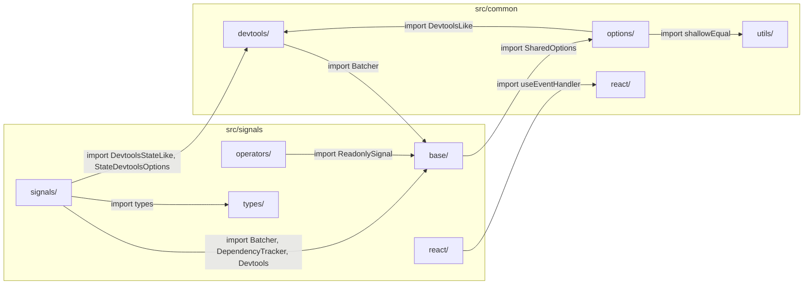
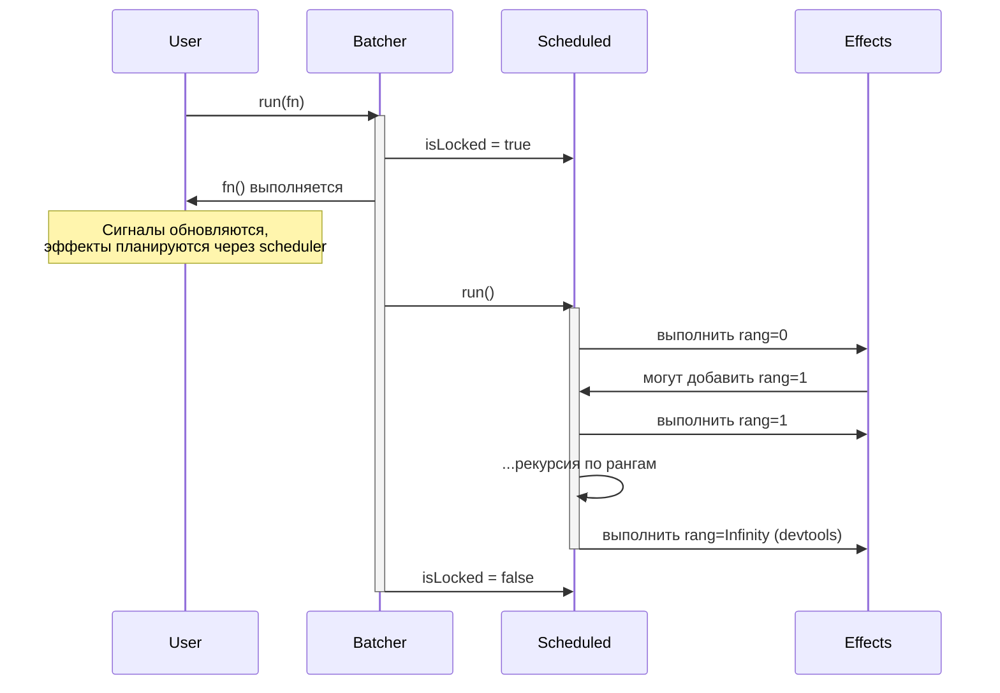
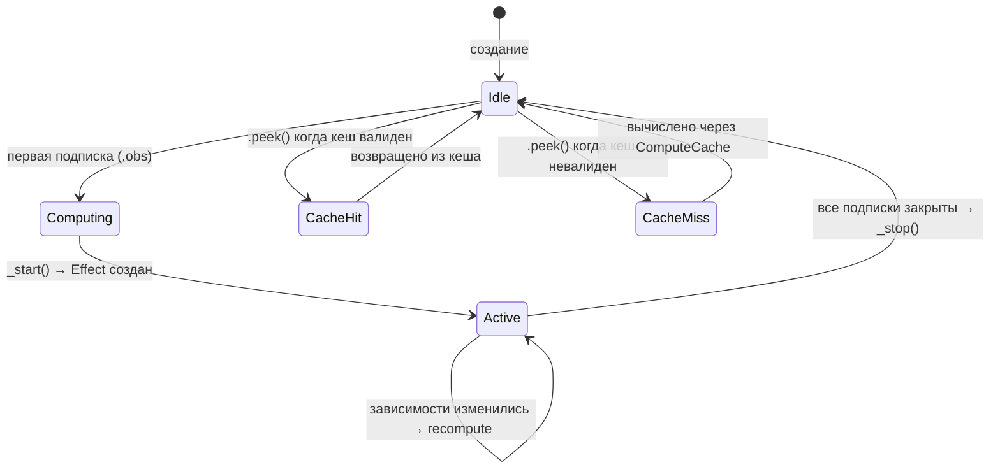
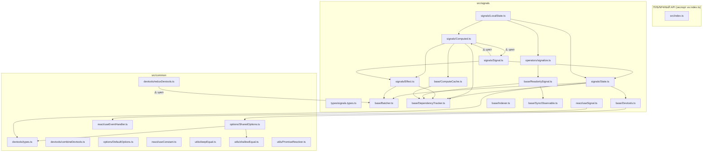

# 01 — Анализ кодовой базы

## Обзор модулей

Исследуемый scope содержит 2 модуля, 19 файлов и ~950 строк кода (без учёта пустых строк и комментариев).



---

## src/common/

### devtools/combineDevtools.ts
**Публичный API**: `combineDevtools(...devtools: DevtoolsLike[]): DevtoolsLike`

Простая функция комбинирования нескольких devtools-адаптеров в один. Чистый функциональный код.

**Потенциальные проблемы:**
- Нет обработки ошибок — если один из `updaters` бросит исключение, остальные не выполнятся
- Нет валидации входных данных (пустой массив и т.д.)

### devtools/reduxDevtools.ts
**Публичный API**: `reduxDevtools(options?)`, `BatchStrategy`

Самый сложный файл в `src/common/` (~220 строк). Содержит:
- `createBatchScheduler` — планировщик с тремя стратегиями батчинга
- `reduxDevtools` — фабрика адаптера для Redux DevTools
- `applyState` / `deleteState` — утилиты работы с вложенным состоянием

**Критическая проблема: циклическая зависимость**
```typescript
import { Batcher } from "@/signals"; // common → signals
```
Модуль `common` задуман как базовый, но `reduxDevtools` зависит от `Batcher` из модуля `signals`. Это создаёт цикл:
`common/devtools/reduxDevtools → signals/base/Batcher` и `signals/base/Devtools → common/options/SharedOptions → common/devtools`.

**Потенциальные проблемы:**
- `(window as any).__REDUX_DEVTOOLS_EXTENSION__` — обращение к `window` без проверки среды (SSR/Node.js)
- `throw new Error('Redux Devtools extension is not installed')` — жёсткая ошибка при отсутствии расширения. Для библиотеки это неудобно
- `pendingActionType` — единственная переменная на весь адаптер, при быстрых обновлениях разных сигналов тип действия может перезаписаться
- `deleteState` использует `hasOwnProperty` напрямую вместо `Object.prototype.hasOwnProperty.call`
- В `deleteRecursive` возвращаемое значение `boolean` не используется

### options/SharedOptions.ts
**API**: `SharedOptions` (static class)

Глобальный синглтон для настроек библиотеки. Все поля — `static`.

**Заметки:**
- `defaultCompareArgs = shallowEqual` — используется только в `src/query`, не в scope исследования

### options/DefaultOptions.ts
**Публичный API**: `DefaultOptions.update(part)`

Тонкая обёртка над `SharedOptions`. Метод `update` принимает partial-объект и обновляет соответствующие поля.

**Заметки:**
- Нет метода `reset()` / `getAll()` — при тестировании сложно восстановить исходное состояние
- Нет валидации входных значений

### react/useConstant.ts
**Публичный API**: `useConstant<T>(fn, deps?)`

Хук, аналогичный `useMemo`, но "без выгрузки" (мемоизация гарантирована).

**Потенциальные проблемы:**
- Сравнение deps через `!==` поэлементно — не обрабатывает NaN, undefined корректно (NaN !== NaN)
- Нет проверки длины `deps` — если длина массива deps изменилась, поведение некорректно
- Документация: JSDoc только "Hook like useMemo, but without unloading" — не объясняет поведение при смене deps

### react/useEventHandler.ts
**Публичный API**: `useEventHandler<T>(fn)`

Стабильная ссылка на callback (аналог `useCallback` с `ref`).

**Заметки:**
- `ref.current = fn` — присваивание каждый рендер, но это стандартный паттерн

### utils/deepEqual.ts
**Публичный API**: `deepEqual(a, b): boolean`

Рекурсивное глубокое сравнение объектов.

**Проблемы:**
- `// @ts-ignore` на строке доступа к полям — лучше использовать `as Record<string, unknown>` или корректную типизацию
- Не обрабатывает `Date`, `RegExp`, `Map`, `Set`, `ArrayBuffer`, типизированные массивы
- Не обрабатывает циклические ссылки — бесконечная рекурсия
- Массивы обрабатываются через `Object.keys()` — работает, но неоптимально
- Не проверяет `Symbol`-ключи
- NaN не обрабатывается (NaN !== NaN, но deepEqual должен считать NaN === NaN)

### utils/shallowEqual.ts
**Публичный API**: `shallowEqual(a, b): boolean`

Поверхностное сравнение объектов.

**Проблемы:**
- `// @ts-ignore` — аналогично deepEqual
- Те же проблемы с NaN, Symbol-ключами
- Для shallow это менее критично, но всё равно заслуживает внимания

### utils/PromiseResolver.ts
**Публичный API**: `PromiseResolver<T>`

Deferred/resolver паттерн. Позволяет создать Promise и resolve/reject его извне.

**Заметки:**
- Чистый, корректный код
- `_resolve!` и `_reject!` с non-null assertion — безопасно, т.к. инициализируются в конструкторе Promise
- Нет метода для проверки состояния (pending/resolved/rejected) — может быть полезно

---

## src/signals/

### types/signals.types.ts
**Публичный API**: `ReadableSignalLike<T>`, `ReadableSignalFnLike<T>`, `WriteableSignalLike<T>`, `ClearableSignalLike<T>`, `StatefulSignalFn<T>`, `SignalFn<T>`, `ComputeFn<T>`

Чистые интерфейсы. Определяют контракты сигналов.

**Заметки:**
- `WriteableSignalLike` — опечатка? Обычно пишется `Writable` (без `e`). Но это breaking change при исправлении
- `StatefulSignalFn` extends Read + Write + Clearable
- `SignalFn` extends Read + Write (без Clear)
- `ComputeFn` extends Read only

### base/Batcher.ts
**Публичный API**: `Batcher.scheduler(rang)`, `Batcher.run(fn)`

Система батчинга обновлений сигналов. Приоритезированная очередь выполнения.



**Потенциальные проблемы:**
- `Scheduled.run()` — **рекурсивная** реализация. При большом количестве уровней рангов (маловероятно, но возможно при глубокой цепочке computed) может вызвать Stack Overflow
- `Scheduled` — объектный литерал с мутабельным состоянием, фактически синглтон. Не thread-safe (не проблема в JS, но проблема при параллельных тестах)
- `lowestRang` инициализируется как `-1`, но `run()` проверяет `if (this.map.size === 0) return this.done()` — при пустой карте `lowestRang` может быть неконсистентен
- Если `fn()` внутри `Batcher.run()` бросит исключение, `Scheduled.isLocked` останется `true`, что заблокирует все дальнейшие операции. Нет `try/finally`

### base/ComputeCache.ts
Внутренний API для кеширования вычислений `Computed`.

**Потенциальные проблемы:**
- `isValid()` вызывает `dep.peek()` в try/catch — ловит все исключения silently. Если зависимость бросает ошибку по бизнес-причине, кеш будет инвалидирован
- `getOrCompute()` — при ошибке в `computeFn()` зависимости будут частично записаны (`stopTracking()` в `finally`), но `_cachedValue` и `_dependencies` не обновятся. На следующем вызове кеш будет невалиден — это корректно

### base/DependencyTracker.ts
**Публичный API**: `DependencyTracker.track(dep)`, `DependencyTracker.start(handler)`

Система отслеживания зависимостей (аналог `ReactiveScope` в других фреймворках).

**Заметки:**
- Основан на глобальном `_currentHandler` — stack-based подход с вложенностью
- `DependencyRecord.meta` — зарезервировано, но нигде не используется
- Паттерн "save/restore" handler — классический и корректный

### base/Devtools.ts
Внутренний мост между сигналами и devtools-интеграцией.

**Заметки:**
- `Devtools.createState()` возвращает `null` если devtools отключены
- Использует `Indexer` для уникальных ключей — `Indexer` НЕ экспортируется из `base/index.ts` (внутренний)

### base/Indexer.ts
Простой автоинкрементный счётчик. НЕ экспортируется из пакета.

**Заметки:**
- `currentIndex` — мутабельное поле. Между тестами будет расти — может быть проблемой для snapshot-тестов
- Нет метода `reset()` — проблема для тестирования

### base/ReadonlySignal.ts
**Публичный API**: `ReadonlySignal<T>`, `ReadonlySignal.create<T>(subscribe)`

Базовый класс для read-only сигналов. Используется как основа для `signalize()`.

**Заметки:**
- `ReadonlySignal.create()` создаёт функцию-обёртку вручную (не через prototype) — дублирование с `State.create()`, `Computed.create()` и `LocalState.create()`
- `signal.obs` прямое присваивание на функцию — работает в JS, но может быть неочевидно для TypeScript

### base/SyncObservable.ts
**Публичный API**: `SyncObservable<T>` (extends `Observable<T>`)

Observable, который может вернуть значение синхронно через `.value`.

**Потенциальные проблемы:**
- `.value` подписывается и **немедленно отписывается** в одном синхронном стеке — это хрупкий паттерн
- Если Observable использует async-scheduling (например, через `observeOn`), значение не будет получено и будет ошибка "No value emitted"
- Каждый вызов `.value` создаёт новую подписку — потенциальные side effects при повторных вызовах
- Тип `value: T | Symbol` внутри, но `Symbol` не в union типе возврата — хорошо скрыто через проверку

### signals/State.ts
**Публичный API**: `State<T>`, `State.create<T>(initialValue, options?)`

Основной примитив — мутабельный сигнал на базе `BehaviorSubject`.

**Ключевые решения:**
- `set()` оборачивается в `Batcher.run()` — обеспечивает батчинг
- `set()` проверяет `value === this.bs$.value` (referential equality) — пропускает одинаковые значения
- `FinalizationRegistry` для автоочистки devtools — хороший паттерн, но не гарантирует timing

**Потенциальные проблемы:**
- `heldValue('$COMPLETED' as any)` — `as any` для передачи строки вместо `T`. FinalizationRegistry callback вызывается с `DevtoolsStateLike`, т.е. `(newState: T) => void`, а передаём строку. Это нарушение типов
- `State.create()` — функция `signalFn` не является instanceof `State` — потеря класса в пользу duck typing
- Нет `update(fn: (prev: T) => T)` метода — часто удобен для инкрементальных обновлений

### signals/Computed.ts
**Публичный API**: `Computed<T>`, `Computed.create<T>(computeFn, options?)`

Вычисляемый (производный) сигнал. Ленивый — вычисляется только при подписке.



**Ключевая архитектура:**
- Использует `Signal.state()` + Effect для реактивности при подписке
- `ComputeCache` для peek() без подписки
- `share()` с `ReplaySubject(1)` для мультикастинга
- `resetOnRefCountZero: true` — при 0 подписчиков эффект уничтожается

**Потенциальные проблемы:**
- **Циклическая зависимость**: `Computed.ts` импортирует `Signal`, a `Signal.ts` импортирует `Computed` из `@/signals/signals`
- `_start()` бросает `'Computed value is not initialized'`, если `computeFn` не вернул значение — это может произойти если `computeFn` пуст
- `getRang()` в `get()` бросает ошибку если Effect не создан — что происходит при `get()` без подписки в tracked context?
- `map((value) => { if (value === Computed._EMPTY) ... })` — при каждом новом подписчике `_start()` вызывается заново если предыдущий observer отписался

### signals/Effect.ts
**Публичный API**: `Effect`, `Effect.create(effectFn)`

Побочный эффект, автоматически переподписывающийся на зависимости.

**Ключевая архитектура:**
- Tracked context для автоотслеживания
- Переиспользование подписок через `legacySubscriptions`
- Teardown поддержка (cleanup функция)
- `SubscriptionLike` интерфейс — совместим с RxJS

**Потенциальные проблемы:**
- `scheduler` создаётся ПОСЛЕ `effectFn()` — до этого момента emissions от подписок попадают в branch `if (isTrackedContext) return`. Это корректно, но хрупко
- Если `effectFn` бросает исключение, `stopTracking()` вызывается в функции напрямую (не в try/finally), но `isTrackedContext = false` тоже выставлен напрямую. Если исключение произошло до `stopTracking()`, tracked context "утечёт"
- `_getRang()` — публичный через underscore prefix, используется в `Computed.get()`. Лучше бы был `protected` или `internal`
- `complete()` помечен `@deprecated` в пользу `unsubscribe()` — хорошо

### signals/Signal.ts
**Публичный API**: `Signal<T>`, `Signal.state()`, `Signal.compute()`, `Signal.effect()`

Фасад-класс, агрегирующий все примитивы сигналов.

**Заметки:**
- Конструктор и `Signal.create()` помечены `@deprecated` — фактически это наследие для обратной совместимости
- `Signal` extends `State` — подкласс с deprecated конструктором
- Основное использование — через статические методы

### signals/LocalState.ts
**Публичный API**: `LocalState<T>`, `LocalState.create<T>(options)`, `LocalSignal` (deprecated alias)

Сигнал с синхронизацией в localStorage.

**Зависимости:**
- `zod/v4` — для валидации данных из storage
- `signalize` — для преобразования validator Observable в сигнал

**Потенциальные проблемы:**
- `JSON.parse(item)` без try/catch — если в localStorage повреждённые данные, будет uncaught exception
- `validator$` — deprecated в пользу `checkEffect`, но оба могут быть переданы одновременно, и оба сработают
- `_getStorageValue` вызывает `z.record(z.string(), ...)` при каждом доступе — потенциально тяжело
- `DEFAULT_DRIVER = localStorage` — прямое обращение к `localStorage` на уровне модуля. В SSR/Node.js throws `ReferenceError`
- `console.warn` при невалидных данных — единственное место с warning в коде
- `LocalSignal` — deprecated alias, экспортируется

### operators/signalize.ts
**Публичный API**: `signalize<T>(observable)`: `ReadableSignalFnLike<T>`

Преобразует Observable в read-only сигнал.

**Заметки:**
- Простая обёртка вокруг `ReadonlySignal.create()`
- Корректный и чистый код

### react/useSignal.ts
**Публичный API**: `useSignal<T>(signal$)`: `T`

React хук для подписки на сигнал.

**Архитектура:**
- Использует `React.useSyncExternalStore` — правильный подход для React 18+
- `queueMicrotask` оптимизация для дебаунса обновлений
- `useEventHandler` для стабильного getSnapshot

**Потенциальные проблемы:**
- `doUpdateRef` паттерн: если `getSnapshot` вызван React по любой другой причине (concurrent rendering, Suspense), он "съест" следующий запланированный update
- `subscribe` зависит от `[signal$]` — при каждом новом объекте signal пересоздаётся подписка
- Нет `getServerSnapshot` — при SSR будет ошибка React
- `signal$.obs.subscribe(() => { ... })` подписывается на ВСЕ emissions, даже если значение не изменилось. Дедупликация происходит на уровне `useSyncExternalStore` (через Object.is в getSnapshot)

---

## Граф зависимостей



## Экспортируемый публичный API (из src/index.ts)

Из `src/common`:
- `reduxDevtools`, `combineDevtools`, `DevtoolsLike`, `DevtoolsStateLike`, `StateDevtoolsOptions`, `BatchStrategy`
- `DefaultOptions`
- `useConstant`, `useEventHandler`
- `deepEqual`, `shallowEqual`

**Не экспортируется напрямую из index.ts:**
- `SharedOptions` — доступен через re-exports, но не явно
- `PromiseResolver` — экспортируется через `common/utils/index.ts`, но NOT из `src/index.ts` (т.к. `src/index.ts` экспортирует только `deepEqual` и `shallowEqual` напрямую)

Из `src/signals`:
- `Batcher`, `ComputeCache`, `DependencyTracker`, `Devtools`, `ReadonlySignal`, `SyncObservable`
- `signalize`
- `useSignal`
- `State`, `Computed`, `Effect`, `Signal`, `LocalState`, `LocalSignal`
- Все типы из `signals.types.ts`
