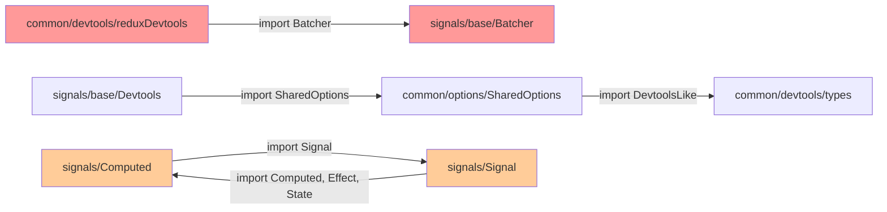

# 03 — Технические ограничения

## 1. Ограничения scope

- **НЕ трогаем `src/query/`** — отдельный модуль, не в scope
- **НЕ модифицируем исходный код** на этапе исследования
- **НЕ ломаем обратную совместимость** — deprecated API должны остаться работоспособными до планового удаления

## 2. Инфраструктурные ограничения

### 2.1 Отсутствие тестовой инфраструктуры

В проекте полностью отсутствует:
- Тестовый фреймворк (ни Vitest, ни Jest)
- Тестовые скрипты в `package.json`
- Конфигурация тестового окружения
- CI/CD pipeline для тестов
- Coverage reporting

**Следствие**: необходимо создать всю инфраструктуру с нуля.

### 2.2 Модульная система

- `"type": "module"` в package.json — ESM
- `"moduleResolution": "bundler"` в tsconfig — Vite/Webpack-стиль resolving
- Path aliases: `"@/*": ["src/*"]` — требует настройки в тестовом фреймворке
- Тестовый фреймворк должен поддерживать ESM + path aliases

### 2.3 Зависимости

| Зависимость | Роль | Тестовая специфика |
|-------------|------|-------------------|
| `rxjs ^7.0.0` | peerDependency, основа | Нужно мокировать/использовать реальные Observable |
| `react ^19.0.0` | peerDependency | Нужен `@testing-library/react` для хуков |
| `zod ^4.0.0` | peerDependency (LocalState) | Реальные схемы в тестах |
| `immer ^10.1.3` | dependency | Не используется в scope |
| `observable-hooks ^4.2.4` | dependency | Не используется в scope |

### 2.4 Среда выполнения

- Код использует `window` (reduxDevtools.ts) и `localStorage` (LocalState.ts)
- `FinalizationRegistry` (State.ts) — поддерживается в Node.js 14+
- `queueMicrotask` (useSignal.ts, reduxDevtools.ts) — поддерживается в Node.js 11+
- Для тестирования нужен `jsdom` или `happy-dom` environment

## 3. Ограничения архитектуры

### 3.1 Глобальное состояние (синглтоны)

Следующие компоненты используют глобальное мутабельное состояние:

| Компонент | Глобальное состояние | Проблема для тестов |
|-----------|---------------------|-------------------|
| `Scheduled` (Batcher.ts) | `map`, `lowestRang`, `isLocked` | Невозможно изолировать тесты |
| `SharedOptions` | `DEVTOOLS`, `onQueryError`, etc. | Нужен reset между тестами |
| `Indexer` | `currentIndex` | Тесты зависят от порядка выполнения |
| `DependencyTracker` | `_currentHandler` | Вложенные tracked contexts |

**Следствие**: тесты нельзя запускать параллельно (или нужен механизм изоляции).

### 3.2 Циклические зависимости



**Цикл 1** (common ↔ signals): `reduxDevtools.ts` → `Batcher` → через barrel exports потенциально весь signals модуль. Это может вызывать проблему при tree-shaking и время от времени при инициализации модулей.

**Цикл 2** (внутри signals): `Computed ↔ Signal` — менее критично, т.к. обе стороны используют задержанные (lazy) ссылки через статические методы.

### 3.3 Отсутствие error boundaries

В Batcher при ошибке в `fn()` внутри `Batcher.run()`:
```typescript
run<T>(fn: () => T) {
    if (Scheduled.isLocked) return fn();
    Scheduled.isLocked = true;
    const v = fn();        // ← если бросит, isLocked навсегда true
    Scheduled.run();
    Scheduled.isLocked = false;
    return v;
}
```

Нет `try/finally`, что означает: **одна ошибка в любом сигнале заблокирует всю систему батчинга**.

## 4. Ограничения API-совместимости

### 4.1 Deprecated API (в scope)

| API | Замена | Файл |
|-----|--------|------|
| `Signal` constructor | `State` constructor | [Signal.ts](../../../src/signals/signals/Signal.ts) |
| `Signal.create()` | `Signal.state()` / `State.create()` | [Signal.ts](../../../src/signals/signals/Signal.ts) |
| `Effect.complete()` | `Effect.unsubscribe()` | [Effect.ts](../../../src/signals/signals/Effect.ts) |
| `validator$` option | `checkEffect` option | [LocalState.ts](../../../src/signals/signals/LocalState.ts) |
| `LocalSignal` export | `LocalState` | [LocalState.ts](../../../src/signals/signals/LocalState.ts) |

### 4.2 Внутренний API, экспортируемый публично

Следующие компоненты экспортируются, но выглядят как внутренние:

| API | Причина сомнения |
|-----|-----------------|
| `Batcher` | Инфраструктурный механизм |
| `ComputeCache` | Внутренний кеш Computed |
| `DependencyTracker` | Низкоуровневый tracking |
| `Devtools` (signals/base) | Внутренний мост к devtools |
| `SyncObservable` | Внутренняя абстракция |
| `Indexer` | Автоинкремент (не экспортируется из base, но может быть доступен) |
| `_skipValues` в `StateDevtoolsOptions` | Underscore-prefix в публичном типе |

## 5. Ограничения производительности тестов

- `Batcher.run()` использует рекурсию — при глубоких цепочках может замедлить тесты
- `SyncObservable.value` создаёт подписку на каждый вызов — тесты с частыми peek() могут быть медленными
- `LocalState` обращается к localStorage (jsdom) — I/O операции
- `queueMicrotask` / `setTimeout` — тесты могут требовать `vi.useFakeTimers()` или `await` micro/macro задач
