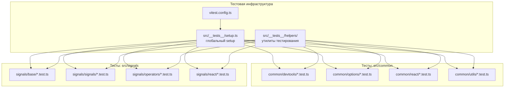
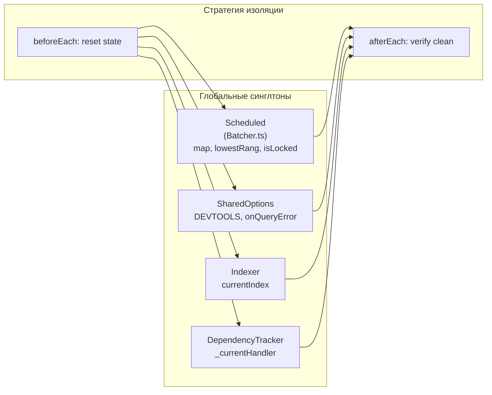
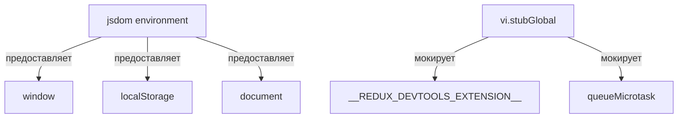

# 01 — Архитектура тестовой инфраструктуры

## Обзор

Тестовая инфраструктура строится с нуля на базе Vitest. Архитектура учитывает особенности проекта: ESM, path aliases, глобальные синглтоны, реактивные цепочки и React хуки.

Основание: [исследование кодовой базы](../01-research/01-codebase-analysis.md) и [ограничения](../01-research/03-constraints.md).

## Общая архитектура



## Выбор фреймворка: Vitest

**Решение**: Vitest (см. [ADR-1](./04-decisions.md#adr-1))

**Обоснование** (из [исследования](../01-research/02-external-research.md#4-выбор-тестового-фреймворка)):
- Проект использует `"type": "module"` (ESM) — Vitest имеет нативную поддержку
- Vite уже используется в `apps/demos/` — единая экосистема
- `"moduleResolution": "bundler"` и path aliases `@/*` — Vitest поддерживает через `vite.config`
- TypeScript без дополнительной конфигурации (через esbuild)

## Организация файлов

```
rx-toolkit/
├── vitest.config.ts              # Конфигурация Vitest
├── src/
│   ├── __tests__/
│   │   ├── setup.ts              # Глобальный setup/teardown
│   │   └── helpers/
│   │       ├── signal-helpers.ts  # Утилиты для тестирования сигналов
│   │       ├── singleton-reset.ts # Reset глобальных синглтонов
│   │       └── async-helpers.ts   # Утилиты для microtask/timing
│   ├── common/
│   │   ├── devtools/
│   │   │   ├── combineDevtools.test.ts
│   │   │   └── reduxDevtools.test.ts
│   │   ├── options/
│   │   │   ├── SharedOptions.test.ts
│   │   │   └── DefaultOptions.test.ts
│   │   ├── react/
│   │   │   ├── useConstant.test.ts
│   │   │   └── useEventHandler.test.ts
│   │   └── utils/
│   │       ├── deepEqual.test.ts
│   │       ├── shallowEqual.test.ts
│   │       └── PromiseResolver.test.ts
│   └── signals/
│       ├── base/
│       │   ├── Batcher.test.ts
│       │   ├── ComputeCache.test.ts
│       │   ├── DependencyTracker.test.ts
│       │   ├── Devtools.test.ts
│       │   ├── Indexer.test.ts
│       │   ├── ReadonlySignal.test.ts
│       │   └── SyncObservable.test.ts
│       ├── signals/
│       │   ├── State.test.ts
│       │   ├── Computed.test.ts
│       │   ├── Effect.test.ts
│       │   ├── Signal.test.ts
│       │   └── LocalState.test.ts
│       ├── operators/
│       │   └── signalize.test.ts
│       └── react/
│           └── useSignal.test.ts
```

**Конвенция именования**: `<ModuleName>.test.ts` — co-located с исходным файлом.

**Обоснование co-location**: тесты рядом с кодом упрощают навигацию и поддержку. При сборке пакета (`tsconfig` с `exclude`) тестовые файлы исключаются из production build.

## Конфигурация Vitest

```typescript
// vitest.config.ts
import { defineConfig } from 'vitest/config';
import { resolve } from 'path';

export default defineConfig({
  resolve: {
    alias: {
      '@': resolve(__dirname, 'src'),
    },
  },
  test: {
    globals: true,
    environment: 'jsdom',     // для window, localStorage, React
    setupFiles: ['src/__tests__/setup.ts'],
    include: ['src/**/*.test.ts'],
    coverage: {
      provider: 'v8',
      include: ['src/common/**', 'src/signals/**'],
      exclude: [
        'src/query/**',
        'src/**/*.test.ts',
        'src/**/index.ts',
        'src/**/*.types.ts',
      ],
      thresholds: {
        statements: 80,
        branches: 80,
        functions: 80,
        lines: 80,
      },
    },
    // Последовательное выполнение для изоляции синглтонов
    pool: 'forks',
    poolOptions: {
      forks: {
        singleFork: false,
      },
    },
  },
});
```

**Ключевые решения в конфигурации:**

| Параметр | Значение | Причина |
|----------|----------|---------|
| `environment` | `jsdom` | Нужны `window`, `localStorage`, React DOM ([03-constraints](../01-research/03-constraints.md#22-среда-выполнения)) |
| `globals` | `true` | Удобство — `describe`, `it`, `expect` без импортов |
| `pool` | `forks` | Изоляция глобальных синглтонов между файлами ([ADR-3](./04-decisions.md#adr-3)) |
| `coverage.provider` | `v8` | Быстрее Istanbul, нативная поддержка в Node.js |
| Coverage thresholds | 80% | Ответ на [Q5](../01-research/04-open-questions.md#q5) |

## Стратегия изоляции глобальных синглтонов

Исследование выявило 4 глобальных синглтона ([03-constraints](../01-research/03-constraints.md#31-глобальное-состояние-синглтоны)):



### Файл: `src/__tests__/helpers/singleton-reset.ts`

```typescript
import { SharedOptions } from '@/common/options/SharedOptions';

/**
 * Сброс SharedOptions к значениям по умолчанию.
 * Вызывается в beforeEach для изоляции тестов.
 */
export function resetSharedOptions(): void {
  SharedOptions.DEVTOOLS = null;
  // Другие поля SharedOptions по необходимости
}

/**
 * Проверка что Scheduled не заблокирован после теста.
 * Если isLocked === true — тест оставил систему в сломанном состоянии.
 */
export function assertBatcherClean(): void {
  // Доступ к Scheduled через Batcher — если isLocked, следующие тесты упадут
  // Реализация зависит от доступности Scheduled (внутренний API)
}
```

**Подход**: Т.к. `Scheduled` — объектный литерал без reset-метода и `Indexer` не имеет сброса, применяем двухуровневую стратегию:

1. **Уровень файла** (`pool: 'forks'`): каждый тестовый файл запускается в отдельном процессе — чистый `Scheduled`, `Indexer`
2. **Уровень теста** (`beforeEach`): сброс `SharedOptions`, `DependencyTracker` между тестами внутри одного файла

Это решает проблему без модификации исходного кода (добавления reset-методов в синглтоны).

## Стратегия мокирования

### Мокирование browser API



| Что мокируется | Как | Где используется |
|----------------|-----|-----------------|
| `window.__REDUX_DEVTOOLS_EXTENSION__` | `vi.stubGlobal` | `reduxDevtools.ts` |
| `localStorage` | jsdom (встроен) или `vi.stubGlobal` | `LocalState.ts` |
| `queueMicrotask` | Реальный (jsdom) + `vi.useFakeTimers` при необходимости | `useSignal.ts`, `reduxDevtools.ts` |
| `FinalizationRegistry` | Реальный (Node.js 14+) | `State.ts` |
| React | `@testing-library/react` + `renderHook` | `useSignal.ts`, `useConstant.ts`, `useEventHandler.ts` |

### Мокирование RxJS

**Подход**: использовать реальные RxJS Observable, БЕЗ мокирования.

**Обоснование**: сигнальная система глубоко интегрирована с RxJS (`BehaviorSubject`, `Observable`, `share()`, `finalize()`). Мокирование RxJS приведёт к тестам, которые не проверяют реальное поведение.

### Мокирование zod

**Подход**: использовать реальные zod-схемы в тестах `LocalState`.

**Обоснование**: `LocalState` зависит от zod для валидации — мокирование скроет реальные edge cases.

## Зависимости тестирования

```json
{
  "devDependencies": {
    "vitest": "^3.x",
    "@testing-library/react": "^16.x",
    "@testing-library/jest-dom": "^6.x",
    "jsdom": "^26.x"
  }
}
```

**Примечания:**
- `react`, `rxjs`, `zod` — уже в `peerDependencies`, устанавливаются в dev
- `@testing-library/react` — для тестирования React хуков (`renderHook`, `act`)
- `@testing-library/jest-dom` — матчеры для DOM assertions (опционально)
- `jsdom` — среда выполнения для browser API

## Интеграция с package.json

```json
{
  "scripts": {
    "test": "vitest run",
    "test:watch": "vitest",
    "test:coverage": "vitest run --coverage",
    "test:ui": "vitest --ui"
  }
}
```

## Исключение тестов из production build

В существующем `tsconfig.json` нужно добавить исключение:

```json
{
  "exclude": ["**/*.test.ts", "src/__tests__/**"]
}
```

Это гарантирует, что тестовые файлы не попадут в скомпилированный пакет.
