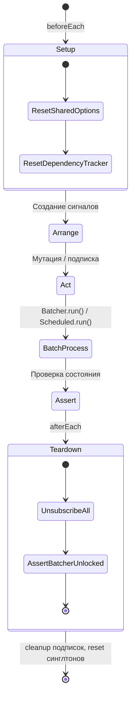
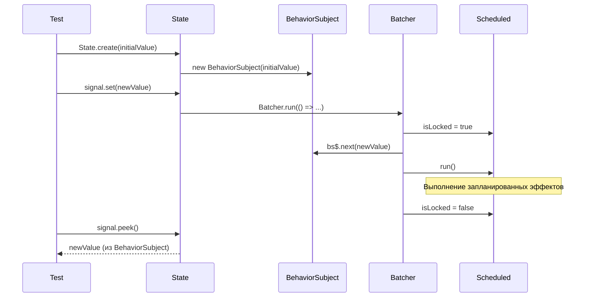
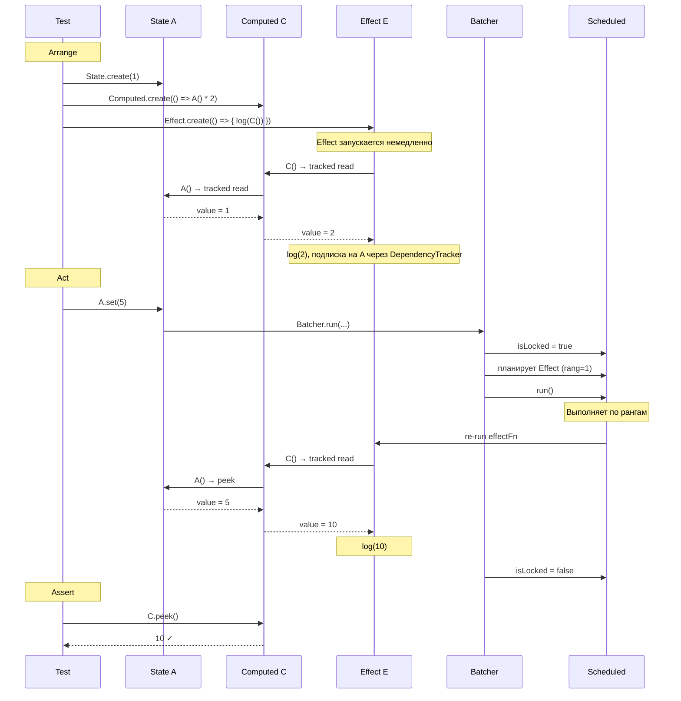
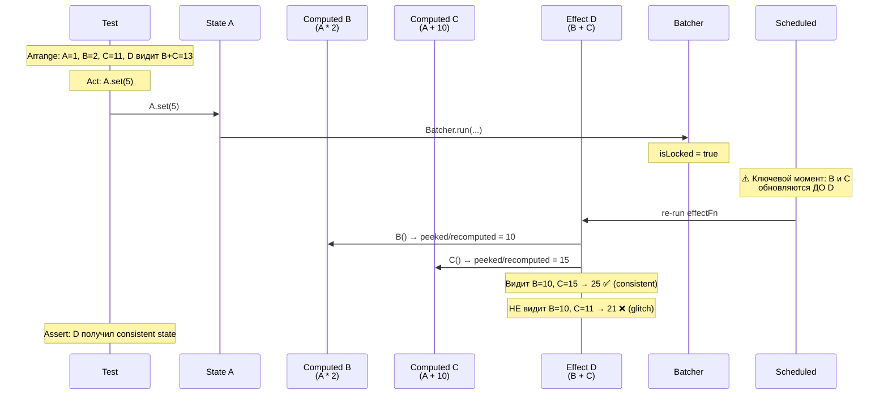
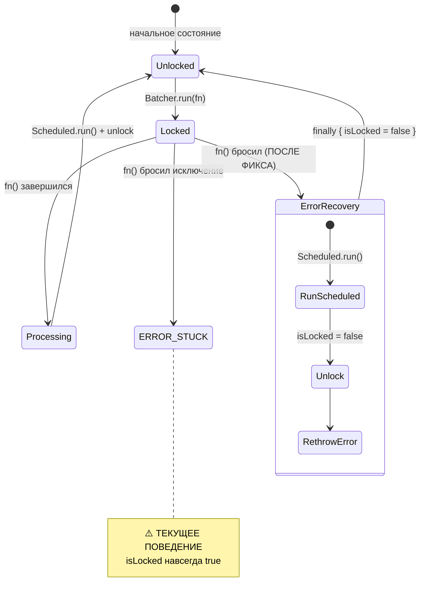
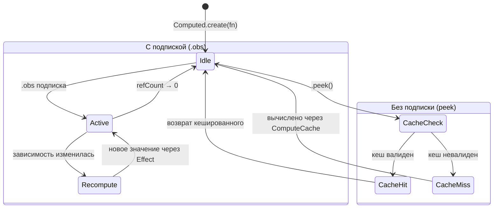
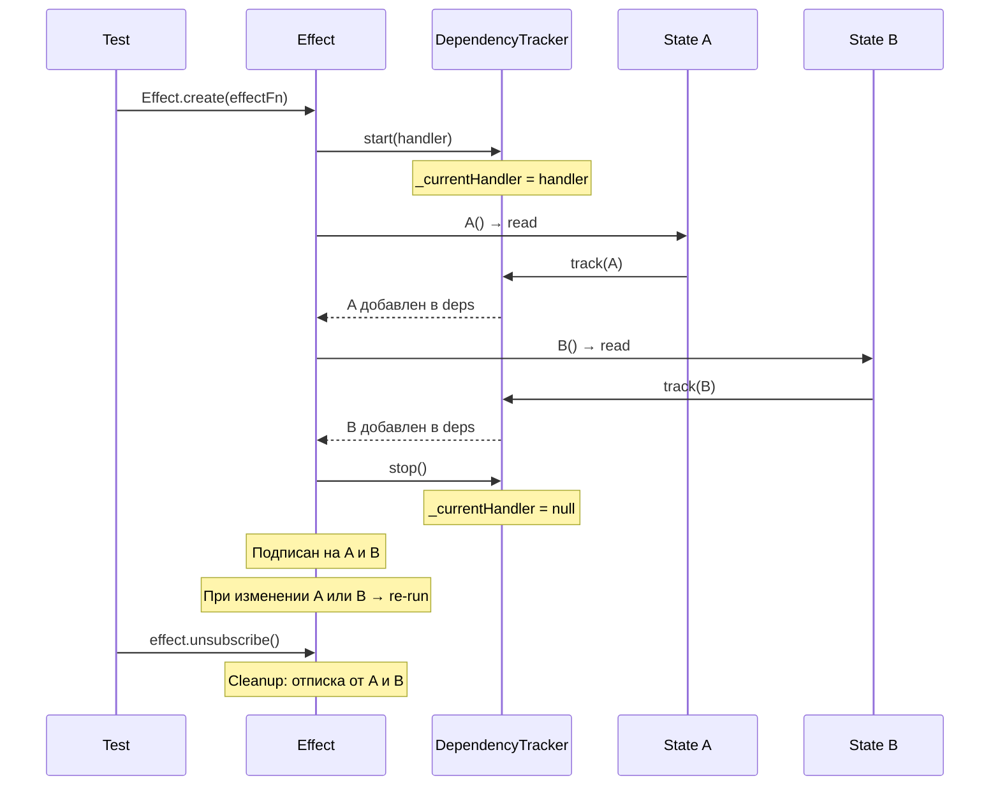

# 02 — Data Flow тестов через реактивную систему

## Обзор

Тестирование реактивной системы требует понимания потоков данных: как изменения сигналов распространяются через Batcher, как computed пересчитываются, как эффекты срабатывают. Этот документ описывает потоки данных с точки зрения тестирования.

Основание: [анализ кодовой базы](../01-research/01-codebase-analysis.md), [best practices](../01-research/02-external-research.md).

## Жизненный цикл теста



## Ключевые потоки данных

### 1. State → подписчик (простейший поток)



**Что тестировать:**
- `peek()` возвращает текущее значение синхронно
- `set()` обновляет значение
- Одинаковые значения (`===`) не вызывают обновление
- `obs` возвращает Observable, который эмитит значения

### 2. State → Computed → Effect (реактивная цепочка)



**Что тестировать:**
- Computed пересчитывается при изменении зависимости
- Effect получает обновлённое значение
- Порядок: сначала Computed, затем Effect (через систему рангов)
- Промежуточные состояния НЕ наблюдаются Effect'ом

### 3. Diamond Problem (glitch-free guarantee)



**Что тестировать:**
- При обновлении `A` Effect `D` видит обновлённые `B` И `C` одновременно
- Промежуточное состояние {B=new, C=old} **не наблюдается**
- Это гарантируется системой рангов: Computed (rang 0+) выполняются перед Effect (rang > computed)

### 4. Batcher: обработка ошибок (критический фикс)



**Критический фикс** (см. [ADR-2](./04-decisions.md#adr-2)): `Batcher.run()` должен использовать `try/finally` для гарантии разблокировки. Текущий код ([Batcher.ts](../01-research/01-codebase-analysis.md#basebatcherts)):

```typescript
// ТЕКУЩИЙ (сломанный)
run<T>(fn: () => T) {
    if (Scheduled.isLocked) return fn();
    Scheduled.isLocked = true;
    const v = fn();         // ← если бросит, isLocked навсегда true
    Scheduled.run();
    Scheduled.isLocked = false;
    return v;
}

// ПОСЛЕ ФИКСА
run<T>(fn: () => T) {
    if (Scheduled.isLocked) return fn();
    Scheduled.isLocked = true;
    try {
        const v = fn();
        Scheduled.run();
        return v;
    } finally {
        Scheduled.isLocked = false;
    }
}
```

**Тесты для этого фикса:**
- `fn()` бросает → `isLocked` сбрасывается → следующий `Batcher.run()` работает
- `fn()` бросает → исключение пробрасывается наверх
- `Scheduled.run()` бросает → `isLocked` сбрасывается

### 5. Computed: ленивое вычисление и кеш



**Что тестировать:**
- `peek()` БЕЗ подписки → вычисление через `ComputeCache`
- `peek()` С подпиской → возврат из внутреннего `State`
- Переход из режима peek → подписка → обратно в peek
- Кеш инвалидируется при изменении зависимости

### 6. Effect: tracked context и teardown



**Что тестировать:**
- Effect автоматически отслеживает прочитанные сигналы
- При изменении любой зависимости Effect перезапускается
- `unsubscribe()` полностью очищает подписки
- Teardown-функция (возврат из `effectFn`) вызывается перед re-run

## Тестирование microtask timing

Файл `useSignal.ts` использует `queueMicrotask` для оптимизации обновлений React. Это требует специальных подходов:

```typescript
// Утилита для ожидания microtasks в тестах
export function flushMicrotasks(): Promise<void> {
  return new Promise(resolve => queueMicrotask(resolve));
}

// Использование в тесте
it('обновляет React при изменении сигнала', async () => {
  const state = Signal.state(1);
  const { result } = renderHook(() => useSignal(state));
  
  expect(result.current).toBe(1);
  
  act(() => { state.set(2); });
  await flushMicrotasks();
  
  expect(result.current).toBe(2);
});
```

## Утилита тестирования: signal-helpers

```typescript
// src/__tests__/helpers/signal-helpers.ts

/**
 * Собирает все значения, эмитированные сигналом.
 * Удобно для проверки последовательности обновлений.
 */
export function collectValues<T>(signal: ReadableSignalLike<T>): {
  values: T[];
  unsubscribe: () => void;
} {
  const values: T[] = [];
  const sub = signal.obs.subscribe(v => values.push(v));
  return { values, unsubscribe: () => sub.unsubscribe() };
}

/**
 * Создаёт "шпион" для Effect — подсчитывает количество вызовов.
 */
export function spyEffect(effectFn: () => void): {
  effect: SubscriptionLike;
  callCount: () => number;
} {
  let count = 0;
  const effect = Effect.create(() => { count++; effectFn(); });
  return { effect, callCount: () => count };
}
```
