# 06 — Полная стратегия тестирования

## Подход

Смешанный: unit-тесты для каждого файла + integration-тесты для ключевых кроссмодульных сценариев ([Q6](../01-research/04-open-questions.md#q6)).

**Целевой coverage**: ≥ 80% по lines, branches, functions, statements ([Q5](../01-research/04-open-questions.md#q5)).

---

## Тестовая карта: src/common

### common/utils

| Файл | Тест | Тип | Приоритет | Кейсы |
|------|------|-----|-----------|-------|
| `deepEqual.ts` | `deepEqual.test.ts` | Unit | Средний | Примитивы, объекты, массивы, вложенные структуры, `null`/`undefined`, различия. `.skip`: NaN, Date, RegExp, Map, Set, циклические ссылки |
| `shallowEqual.ts` | `shallowEqual.test.ts` | Unit | Средний | Примитивы, плоские объекты, различие по ключам, различие по значениям, один аргумент `null` |
| `PromiseResolver.ts` | `PromiseResolver.test.ts` | Unit | Низкий | resolve, reject, доступ к promise |

### common/options

| Файл | Тест | Тип | Приоритет | Кейсы |
|------|------|-----|-----------|-------|
| `SharedOptions.ts` | `SharedOptions.test.ts` | Unit | Средний | Значения по умолчанию, установка DEVTOOLS, reset между тестами |
| `DefaultOptions.ts` | `DefaultOptions.test.ts` | Unit | Средний | `update()` partial, проверка что SharedOptions обновлён |

### common/devtools

| Файл | Тест | Тип | Приоритет | Кейсы |
|------|------|-----|-----------|-------|
| `combineDevtools.ts` | `combineDevtools.test.ts` | Unit | Средний | Один devtools, несколько devtools, null updaters, пустой список (если применимо) |
| `reduxDevtools.ts` | `reduxDevtools.test.ts` | Unit + Integration | Высокий | Создание адаптера с mock `__REDUX_DEVTOOLS_EXTENSION__`, batch strategies (Sync, Async, None), `applyState`/`deleteState`, ошибка при отсутствии extension |

### common/react

| Файл | Тест | Тип | Приоритет | Кейсы |
|------|------|-----|-----------|-------|
| `useConstant.ts` | `useConstant.test.ts` | Unit (React) | Средний | Стабильность без deps, пересоздание при изменении deps, стабильность при тех же deps |
| `useEventHandler.ts` | `useEventHandler.test.ts` | Unit (React) | Средний | Стабильная ссылка, актуальный callback |

---

## Тестовая карта: src/signals/base

| Файл | Тест | Тип | Приоритет | Кейсы |
|------|------|-----|-----------|-------|
| `Batcher.ts` | `Batcher.test.ts` | Unit + Integration | **Критический** | `run()` base case, вложенный `run()` (isLocked), батчинг нескольких сигналов, **try/finally фикс**, порядок рангов, пустой батч |
| `ComputeCache.ts` | `ComputeCache.test.ts` | Unit | Высокий | `getOrCompute` — первый вызов (cache miss), повторный (hit), инвалидация при изменении deps, ошибка в `computeFn` |
| `DependencyTracker.ts` | `DependencyTracker.test.ts` | Unit | Высокий | `start`/`stop` tracking, `track` добавляет зависимость, вложенные tracked contexts, утечка handler |
| `Devtools.ts` | `Devtools.test.ts` | Unit | Низкий | `createState` с devtools, без devtools (`null`), Indexer-based ключи |
| `Indexer.ts` | `Indexer.test.ts` | Unit | Низкий | Автоинкремент, уникальность |
| `ReadonlySignal.ts` | `ReadonlySignal.test.ts` | Unit | Средний | `create` от Observable, `peek()`, `obs`, функция-обёртка вызывается как getter |
| `SyncObservable.ts` | `SyncObservable.test.ts` | Unit | Средний | `.value` от BehaviorSubject, `.value` от Observable без немедленного значения (throw), pipe/subscribe |

---

## Тестовая карта: src/signals/signals

| Файл | Тест | Тип | Приоритет | Кейсы |
|------|------|-----|-----------|-------|
| `State.ts` | `State.test.ts` | Unit + Integration | **Критический** | Создание (`State.create`), `set`/`peek`/вызов как функция, referential equality skip, `obs` подписка, devtools integration (mock), FinalizationRegistry (документация), `clear()` |
| `Computed.ts` | `Computed.test.ts` | Unit + Integration | **Критический** | Ленивое вычисление, `peek()` через cache, подписка через `.obs`, инвалидация при изменении deps, множественные зависимости, diamond problem (integration с Batcher), `resetOnRefCountZero`, ошибка в computeFn |
| `Effect.ts` | `Effect.test.ts` | Unit + Integration | **Критический** | Автотрекинг, re-run при изменении, teardown, `unsubscribe()`, вложенные эффекты, **deprecated `complete()`**, динамические зависимости (чтение разных сигналов в разных runs) |
| `Signal.ts` | `Signal.test.ts` | Unit | Средний | `Signal.state()`, `Signal.compute()`, `Signal.effect()` — фасадный API. **Deprecated**: constructor, `Signal.create()` |
| `LocalState.ts` | `LocalState.test.ts` | Unit | Высокий | Создание с schema и default, запись/чтение из localStorage, невалидные данные в storage, `clear()`, **deprecated** `validator$`, `LocalSignal` alias, `checkEffect` |

---

## Тестовая карта: src/signals/operators

| Файл | Тест | Тип | Приоритет | Кейсы |
|------|------|-----|-----------|-------|
| `signalize.ts` | `signalize.test.ts` | Unit | Средний | BehaviorSubject → signal, Observable → signal, `peek()`, `obs` |

---

## Тестовая карта: src/signals/react

| Файл | Тест | Тип | Приоритет | Кейсы |
|------|------|-----|-----------|-------|
| `useSignal.ts` | `useSignal.test.ts` | Unit (React) | **Критический** | Начальное значение, обновление при set, отписка при unmount, переключение signal prop, множественные быстрые обновления (batching), concurrent mode (если возможно) |

---

## Integration тесты

Отдельный файл: `src/__tests__/integration/signals-integration.test.ts`

| Сценарий | Компоненты | Приоритет | Описание |
|----------|-----------|-----------|----------|
| Diamond problem | State + Computed + Effect + Batcher | **Критический** | A → B, A → C, B+C → D. Проверка glitch-free |
| Глубокая цепочка | State + N×Computed + Effect | Высокий | State → C1 → C2 → C3 → Effect. Проверка корректного пересчёта |
| Батчинг многих сигналов | N×State + Effect + Batcher | Высокий | `Batcher.run(() => { s1.set(); s2.set(); s3.set(); })` → Effect 1 раз |
| Ошибка в батче | State + Batcher | **Критический** | Ошибка внутри `Batcher.run()` → система восстанавливается |
| Computed peek + subscribe переход | State + Computed | Средний | `peek()` → подписка → `peek()` — все возвращают корректное значение |
| Effect teardown chain | State + Effect | Средний | Effect с teardown → 3 обновления → проверка порядка teardown-ов |
| Dynamic dependencies | State × 3 + Effect | Средний | Effect читает разные сигналы в зависимости от условия |

---

## Edge cases и error scenarios

| Категория | Сценарий | Файл | Приоритет |
|-----------|----------|------|-----------|
| Ошибки | Ошибка в `computeFn` | `Computed.test.ts` | Высокий |
| Ошибки | Ошибка в `effectFn` | `Effect.test.ts` | Высокий |
| Ошибки | Ошибка внутри `Batcher.run()` | `Batcher.test.ts` | **Критический** |
| Ошибки | Невалидный JSON в localStorage | `LocalState.test.ts` | Средний |
| Граничные | `null` / `undefined` как значение сигнала | `State.test.ts` | Средний |
| Граничные | Пустой computeFn (не возвращает значение) | `Computed.test.ts` | Средний |
| Граничные | Effect без зависимостей (не читает сигналы) | `Effect.test.ts` | Низкий |
| Граничные | Двойной `unsubscribe()` | `Effect.test.ts` | Средний |
| Циклы | Effect пишет в свою зависимость | `Effect.test.ts` | Средний |
| Память | Computed: подписка → отписка → все очищено | `Computed.test.ts` | Средний |
| Память | Effect: unsubscribe очищает подписки | `Effect.test.ts` | Средний |
| Типы | `deepEqual` с NaN, Date, циклами | `deepEqual.test.ts` | Низкий (.skip) |
| React | useSignal: быстрая смена signal prop | `useSignal.test.ts` | Средний |

---

## Приоритизация выполнения

```mermaid
gantt
    title Порядок написания тестов
    dateFormat X
    axisFormat %s

    section Критический
    Batcher.test.ts (+ фикс try/finally)    :crit, 0, 3
    State.test.ts                             :crit, 0, 3
    Computed.test.ts                          :crit, 1, 4
    Effect.test.ts                            :crit, 1, 4
    useSignal.test.ts                         :crit, 2, 4
    Integration tests                         :crit, 3, 5

    section Высокий
    ComputeCache.test.ts                      :2, 3
    DependencyTracker.test.ts                 :2, 3
    LocalState.test.ts                        :3, 4
    reduxDevtools.test.ts                     :3, 4

    section Средний
    deepEqual.test.ts                         :4, 5
    shallowEqual.test.ts                      :4, 5
    ReadonlySignal.test.ts                    :4, 5
    SyncObservable.test.ts                    :4, 5
    signalize.test.ts                         :4, 5
    useConstant.test.ts                       :4, 5
    useEventHandler.test.ts                   :4, 5
    Signal.test.ts (фасад)                    :4, 5
    combineDevtools.test.ts                   :4, 5
    SharedOptions.test.ts                     :4, 5
    DefaultOptions.test.ts                    :4, 5

    section Низкий
    PromiseResolver.test.ts                   :5, 6
    Indexer.test.ts                            :5, 6
    Devtools.test.ts                           :5, 6
```

## Метрики качества

| Метрика | Порог | Инструмент |
|---------|-------|-----------|
| Line coverage | ≥ 80% | Vitest + v8 |
| Branch coverage | ≥ 80% | Vitest + v8 |
| Function coverage | ≥ 80% | Vitest + v8 |
| Тесты проходят | 100% green | `vitest run` |
| Нет flaky тестов | 0 flaky | 3 последовательных run без failures |
| Время выполнения | < 30 секунд | `vitest run --reporter=verbose` |
