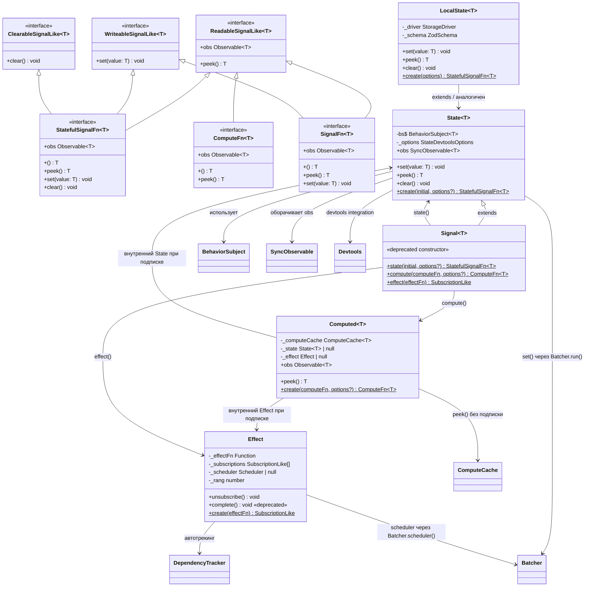
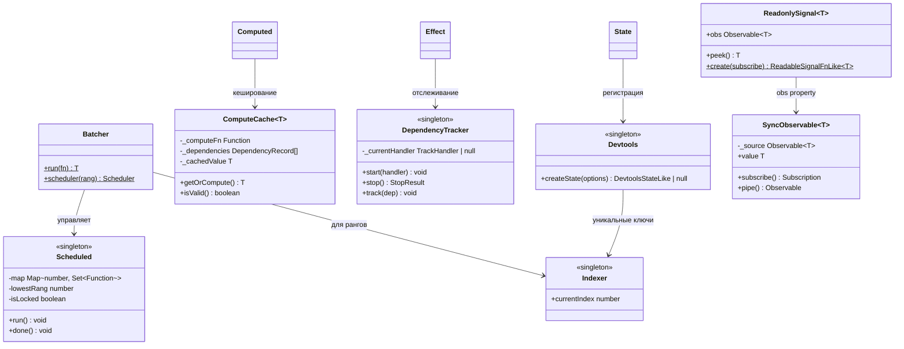
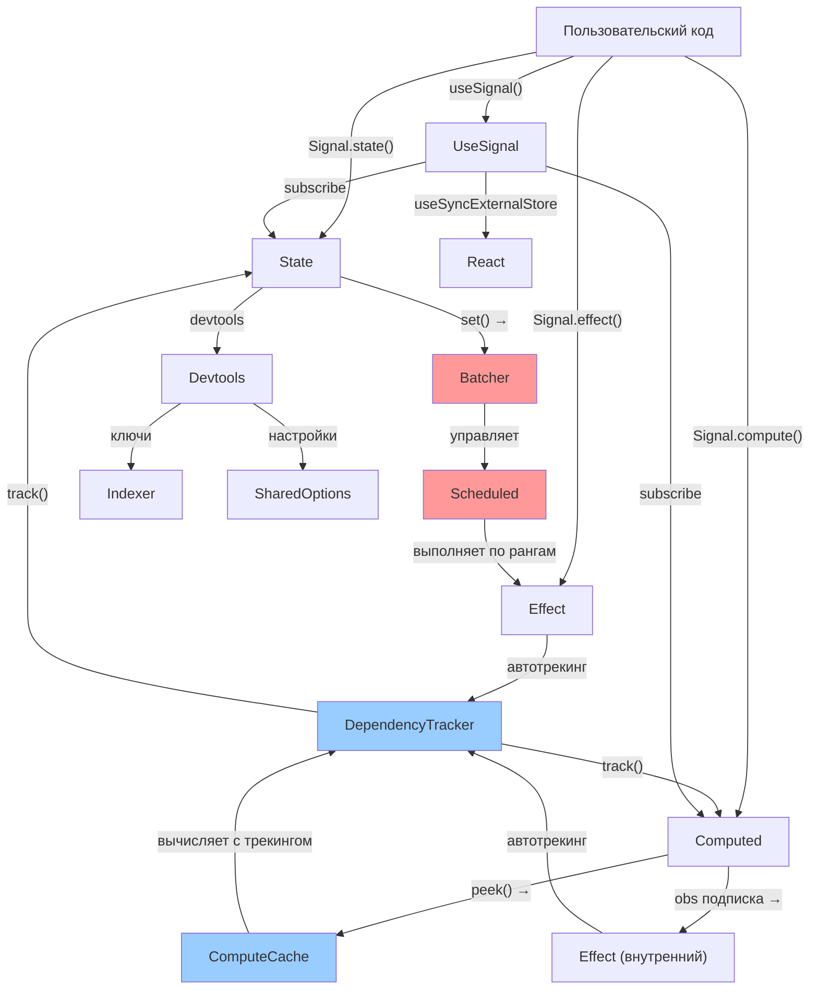

# 07 — Доменная модель сигнальной системы

## Обзор

Документ описывает ключевые сущности реактивной системы `rx-toolkit`, их отношения, инварианты и бизнес-правила. Модель основана на анализе кодовой базы ([01-codebase-analysis](../01-research/01-codebase-analysis.md)) и паттернах из экосистемы ([02-external-research](../01-research/02-external-research.md)).

---

## Диаграмма классов



---

## Инфраструктурные компоненты



---

## Ключевые сущности

### State (мутабельный сигнал)

**Роль**: Основной примитив для хранения изменяемого состояния.

**Инварианты**:
- `peek()` всегда возвращает текущее значение синхронно
- `set(v)` при `v === currentValue` (referential equality) — NO-OP
- `set(v)` всегда оборачивается в `Batcher.run()` — гарантия батчинга
- `obs` — горячий Observable (BehaviorSubject), эмитит текущее значение при подписке
- `clear()` сбрасывает к начальному значению

### Computed (вычисляемый сигнал)

**Роль**: Производное значение, автоматически зависящее от других сигналов.

**Инварианты**:
- Ленивый: `computeFn` НЕ вызывается до первого чтения
- `peek()` без подписки — вычисляет через `ComputeCache` (синхронно)
- `peek()` с подпиской — возвращает из внутреннего `State`
- Кеш валиден пока зависимости не изменились
- При подписке через `.obs` — создаётся внутренний Effect для реактивности
- `resetOnRefCountZero: true` — при 0 подписчиков внутренний Effect уничтожается
- Rang > rang зависимостей (гарантия порядка батчинга)

### Effect (побочный эффект)

**Роль**: Выполнение побочных действий при изменении зависимостей.

**Инварианты**:
- `effectFn` выполняется немедленно при создании
- Автоматический tracked context — все прочитанные сигналы становятся зависимостями
- При изменении любой зависимости — `effectFn` перезапускается
- Возвращаемая функция из `effectFn` — teardown, вызывается ПЕРЕД перезапуском
- `unsubscribe()` — полная очистка, последний teardown вызывается
- Rang Effect > rang всех его зависимостей (Computed включительно)

### Batcher (менеджер батчинга)

**Роль**: Группировка обновлений для предотвращения glitch.

**Инварианты**:
- `isLocked === true` → все `set()` вызовы выполняются напрямую (без повторного батчинга)
- После `fn()` → `Scheduled.run()` выполняет запланированные эффекты по рангам
- Порядок выполнения: rang 0 → rang 1 → ... → rang Infinity (devtools)
- **ПОСЛЕ ФИКСА**: `try/finally` гарантирует `isLocked = false` при ошибке

### ComputeCache (кеш вычислений)

**Роль**: Кеширование результата `computeFn` для `peek()` без подписки.

**Инварианты**:
- Кеш валиден ↔ все зависимости не изменились (`dep.peek() === cached_dep_value`)
- При невалидном кеше — пересчёт через `computeFn` с новым `DependencyTracker` scope
- Ошибка в `computeFn` — зависимости частично записаны, кеш невалиден (корректно)

### DependencyTracker (отслеживание зависимостей)

**Роль**: Stack-based система отслеживания чтений сигналов.

**Инварианты**:
- `start()` → сохраняет предыдущий handler, устанавливает новый
- `track(dep)` → добавляет зависимость в текущий handler
- `stop()` → восстанавливает предыдущий handler, возвращает зависимости
- Вложенные tracked contexts корректны (stack save/restore)
- `peek()` НЕ вызывает `track()` — чтение без отслеживания

---

## Граф зависимостей между сущностями



---

## Типы TypeScript

```typescript
// Ключевые интерфейсы (из src/signals/types/signals.types.ts)

interface ReadableSignalLike<T> {
  peek(): T;
  readonly obs: Observable<T>;
}

interface WriteableSignalLike<T> {  // Примечание: "Writeable" — опечатка
  set(value: T): void;
}

interface ClearableSignalLike<T> {
  clear(): void;
}

// Составные типы — функции с методами
type StatefulSignalFn<T> = (() => T) &
  ReadableSignalLike<T> &
  WriteableSignalLike<T> &
  ClearableSignalLike<T>;

type ComputeFn<T> = (() => T) & ReadableSignalLike<T>;

type SignalFn<T> = (() => T) &
  ReadableSignalLike<T> &
  WriteableSignalLike<T>;

// Devtools
interface DevtoolsLike {
  createState(key: string, initialValue?: unknown): DevtoolsStateLike | null;
}

type DevtoolsStateLike = (newState: unknown) => void;

// DependencyTracker
interface DependencyRecord {
  dep: ReadableSignalLike<unknown>;
  meta: unknown;
}
```

---

## Бизнес-правила (для тестирования)

| # | Правило | Где проверять |
|---|---------|--------------|
| BR-1 | `State.set(v)` при `v === current` — не эмитит | `State.test.ts` |
| BR-2 | `Computed` вычисляется лениво | `Computed.test.ts` |
| BR-3 | `Computed.peek()` возвращает кешированное при валидном кеше | `ComputeCache.test.ts` |
| BR-4 | `Effect` автоматически собирает зависимости | `Effect.test.ts` |
| BR-5 | `Effect` перезапускается при изменении ЛЮБОЙ зависимости | `Effect.test.ts` |
| BR-6 | `Batcher.run()` — эффекты выполняются ПОСЛЕ всех set() | `Batcher.test.ts` |
| BR-7 | Система рангов: rang(Effect) > rang(Computed) > rang(State) | Integration |
| BR-8 | Diamond problem → consistent state (no glitch) | Integration |
| BR-9 | `peek()` НЕ создаёт зависимость в tracked context | `State.test.ts` |
| BR-10 | `Effect.unsubscribe()` → teardown + отписка от всех deps | `Effect.test.ts` |
| BR-11 | `Computed` при 0 подписчиков → уничтожение внутреннего Effect | `Computed.test.ts` |
| BR-12 | `Batcher.run()` при ошибке → `isLocked` сбрасывается (ПОСЛЕ ФИКСА) | `Batcher.test.ts` |
