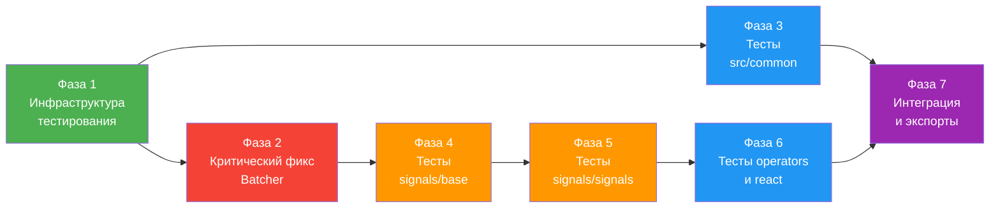

# План: validate-common-signals-release

**Status**: Approved
**Дата**: 2026-03-09  
**Scope**: `src/common/` и `src/signals/` (без `src/query`)  
**Цель**: Реализовать тестовую инфраструктуру, покрыть тестами код, исправить критический баг Batcher

## Контекст

План основан на утверждённом дизайне ([02-design](../02-design/README.md)), который определяет:
- Vitest как тестовый фреймворк ([ADR-1](../02-design/04-decisions.md#adr-1))
- Стратегию «тесты + критические фиксы» ([ADR-2](../02-design/04-decisions.md#adr-2))
- Двухуровневую изоляцию синглтонов ([ADR-3](../02-design/04-decisions.md#adr-3))
- Deprecated API покрываются тестами ([ADR-4](../02-design/04-decisions.md#adr-4))
- deepEqual — только документация ограничений ([ADR-5](../02-design/04-decisions.md#adr-5))

## Диаграмма зависимостей фаз



## Таблица фаз

| # | Фаза | Зависимости | Тип | Сложность | Задач | Файл |
|---|------|-------------|-----|-----------|-------|------|
| 1 | Инфраструктура тестирования | — | Последовательная | Низкая | 8 | [01-infrastructure.md](./01-infrastructure.md) |
| 2 | Критический фикс Batcher | Фаза 1 | Последовательная | Низкая | 1 | [02-batcher-fix.md](./02-batcher-fix.md) |
| 3 | Тесты src/common | Фаза 1 | Параллельная | Средняя | 7 | [03-common-tests.md](./03-common-tests.md) |
| 4 | Тесты src/signals/base | Фазы 1, 2 | Параллельная | Высокая | 7 | [04-signals-base-tests.md](./04-signals-base-tests.md) |
| 5 | Тесты src/signals/signals | Фаза 4 | Параллельная | Высокая | 5 | [05-signals-signals-tests.md](./05-signals-signals-tests.md) |
| 6 | Тесты operators и react | Фаза 5 | Параллельная | Средняя | 2 | [06-operators-react-tests.md](./06-operators-react-tests.md) |
| 7 | Интеграция и экспорты | Фазы 3, 6 | Последовательная | Средняя | 5 | [07-integration-exports.md](./07-integration-exports.md) |

**Итого**: 7 фаз, 35 задач

## Параллелизация

```
Фаза 1 (фундамент)
    ├── Фаза 2 (Batcher фикс) ──→ Фаза 4 (base) ──→ Фаза 5 (signals) ──→ Фаза 6 (operators/react) ──┐
    └── Фаза 3 (common) ───────────────────────────────────────────────────────────────────────────────┤
                                                                                                        ↓
                                                                                                    Фаза 7 (интеграция)
```

- **Фазы 2 и 3** могут выполняться параллельно (обе зависят только от Фазы 1)
- **Фазы 5 и 6** внутри себя содержат независимые тестовые файлы, но последовательны между собой
- **Фаза 7** — финальная, зависит от всех предыдущих

## Правила выполнения

1. **Каждая фаза — отдельный коммит** в формате Conventional Commits
2. **Не модифицировать исходный код** кроме явно указанного в Фазе 1 (SharedOptions reset) и Фазе 2 (Batcher fix)
3. **Не вводить новые дизайн-решения** — план строго следует [02-design](../02-design/README.md)
4. **Все тесты должны проходить** (`vitest run`) перед коммитом каждой фазы
5. **Тесты пишутся co-located** — рядом с исходным файлом как `<Name>.test.ts`
6. **Язык тестов** — TypeScript, описания тестов на английском (стандарт для кода)
7. **`.skip` тесты** — для документации известных ограничений (deepEqual: NaN, Date, RegExp)
8. **`TODO(v0.6.0)`** — маркер для deprecated API тестов
9. **Верификация каждой фазы** — запуск `vitest run` + проверка чек-листа

## Фазы наивысшей сложности

- **Фаза 4** (signals/base) — `Batcher`, `ComputeCache`, `DependencyTracker` требуют глубокого понимания реактивной системы
- **Фаза 5** (signals/signals) — `Computed` и `Effect` содержат сложные жизненные циклы, diamond problem, glitch-free гарантии
