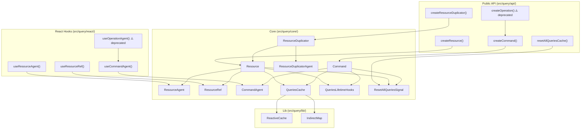
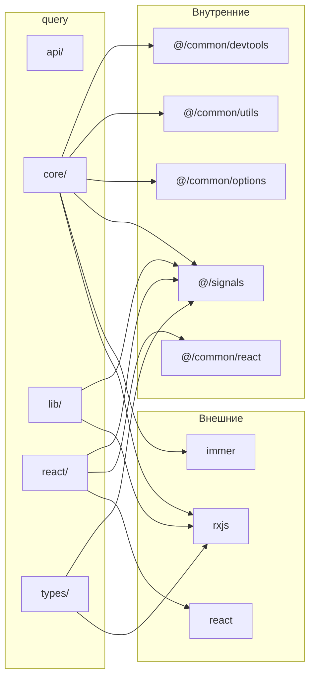

# Анализ кодовой базы

## 1. Обзор модуля `src/query/`

### 1.1 Архитектура модуля

Модуль query — система управления асинхронными запросами и кэшированием, архитектурно близкая к TanStack Query и RTK Query. Основные абстракции:

### 1.2 Зависимости модуля

---

## 2. Анализ файлов

### 2.1 Типы (`src/query/types/`)

#### `src/query/types/shared.types.ts`
- **Утилиты**: `Prettify<T>`, `FallbackOnNever<T, F>` — хорошо типизированы
- **`CacheEntryAddedTools<DATA>`** — содержит `dataChanged$: Subject<DATA>` (RxJS Subject). Экспозиция Subject в публичном API позволяет вызвать `.next()` из потребительского кода, что нарушает инкапсуляцию.
- **`QueryStartedTools<DATA>`** — `$queryFulfilled` возвращает дискриминированный union (`isError: true | false`) — хороший паттерн.

#### `src/query/types/Resource.types.ts`
- **`ResourceDefinition<A = any, R = any, S = any>`** — использует `any` в дефолтных параметрах. Это допустимо для constraint-типов, но `unknown` был бы строже.
- **`ResourceRefInstanse`** (строка 138) — **ОПЕЧАТКА**: `Instanse` → `Instance`. Это публичный тип, опечатка станет частью API.
- **`ResourceQueryState`** (строка 120) — `args: D["Args"] | undefined` с TODO-комментарием: "undefined - это костыль для сведения типов, его быть не должно". Это технический долг, влияющий на DX.
- **`ResourceQueryFnTools`** — `abortSignal?: AbortSignal` — опциональный. Вопрос: почему опциональный? В `Resource.ts` (строка 300) он всегда создаётся.

#### `src/query/types/Command.types.ts`
- **`CommandInstance<D>`** — содержит `mutate` с `@deprecated`. Нет планов удаления указанного в JSDoc.
- **`CommandQueryState<D>`** — не содержит `isInitiated`, хотя `CoreCommandQueryState` в `Command.ts` его имеет. Это несоответствие между внутренним и публичным состоянием.
- **`LinkOptions`** — `update` и `optimisticUpdate` возвращают `void | RD["Data"] | Promise<RD["Data"]>`. Update поддерживает Promise, но optimisticUpdate тоже — это некорректно для синхронной оптимистичной операции.

#### `src/query/types/Operation.types.ts`
- Все типы помечены `@deprecated` с указанием v0.6.0 — корректно.
- **`OperationAgentInstanse`** — двойная опечатка: и "Instanse", и "Operation" вместо Command. В CHANGELOG эта опечатка задокументирована.

#### `src/query/types/index.ts`
- Реэкспортирует все типы — корректно.
- **ПРОБЛЕМА**: этот barrel НЕ реэкспортируется из `src/query/index.ts`, поэтому потребители не могут импортировать типы.

### 2.2 API (`src/query/api/`)

#### `src/query/api/createResource.ts`
- Используется паттерн `satisfies` для type-checking фабричной функции — хороший TypeScript-паттерн.
- **Нет валидации входных параметров** — `queryFn` может быть `undefined`, `cacheLifetime` может быть отрицательным числом. Вопрос: нужна ли runtime-валидация для библиотечных API?

#### `src/query/api/createCommand.ts`
- Аналогичная структура, хорошо документированный JSDoc с примером.

#### `src/query/api/createResourceDuplicator.ts`
- Экспортирует `ResourceDuplicatorCreateFn` тип, но сам по себе не участвует в реэкспорте типов.
- Тип `DuplicatorOptions` и `DuplicatorDefinition` импортируются из внутреннего модуля `ResourceDuplicator` и реэкспортируются потребителю неявно через `createResourceDuplicator` — это нормально.

#### `src/query/api/createOperation.ts`
- Простой deprecated-рээкспорт — корректно.

#### `src/query/api/resetAllQueriesCache.ts`
- Делегирует на `ResetAllQueriesSignal.clean()` — простой фасад.

### 2.3 Core (`src/query/core/`)

#### `src/query/core/QueriesCache.ts`
- Использует `IndirectMap` + `ReactiveCache` для хранения кэша по ключам (args).
- `_cacheLifeTime` по умолчанию 60_000 — соответствует документации для Resources.
- Метод `values()` возвращает `IterableIterator` — используется в `ResetAllQueriesSignal` подписчиках для массового сброса.

#### `src/query/core/QueriesLifetimeHooks.ts`
- **`as any`** (строка 48): `stateDevtools!('$CLEANED' as any)` — обход типов для devtools. Потенциальный runtime-баг если devtools API изменится.
- Devtools-интеграция условна: `if (devtoolsName !== false && Devtools.hasDevtools)` — хорошо.
- **TODO** (строка 64): "не нравится мне это, мб передавать $spy в аргументы?" — указывает на неудовлетворённость архитектурой lifecycle hooks.
- Использует `SharedOptions.onQueryError` — глобальный обработчик ошибок.

#### `src/query/core/ResetAllQueriesSignal.ts`
- Статический singleton с Subject — простой pub/sub для глобального сброса кэша.
- Оборачивает `next()` в `Batcher.run()` — обеспечивает батчинг.

#### `src/query/core/Command/Command.ts`
- **`CoreCommandQueryState`** содержит `isRepeating` — этого нет в публичном `CommandQueryState`. Возможно намеренно скрыто, но может потребоваться потребителям.
- В `_initiate()` — promise chain `.then()` / `.catch()` без обработки `abortController`. У команд нет abort-механизма в отличие от ресурсов. Это может быть проблемой при race conditions.
- **`mutate()`** — deprecated метод, использует subscription + PromiseResolver. Подписка на `value$.obs` потенциально может не сработать если кэш очищается между вызовами.
- В `.catch()` блоке: `cache.next(CommandQueryState.error(state, error))` ссылается на `state` из closure, что корректно при однократном вызове initiate. Но при concurrent-вызовах с тем же args может быть race condition.

#### `src/query/core/Command/CommandAgent.ts`
- `_commands$` с `isDisabled: true` — lazy signal, не вычисляется пока нет подписки. Хороший паттерн.
- `createAgent()` (строка 68) — метод есть на агенте, но его нет в `CommandAgentInstance` типе. **Расхождение типов** — тип объявляет `createAgent()`, а реализация тоже имеет его, но он не типизирован в `CommandInstance` корректно.

#### `src/query/core/Resource/Resource.ts`
- Самый крупный файл. Полный жизненный цикл ресурса: create → initiate → success/error → lock/unlock → update(patch) → createWithData.
- **abort-механизм**: `prevAbortController?.abort()` при повторном initiate — правильно предотвращает race conditions.
- `createWithData()` — create only if not initiated. Хороший guard.
- `compareArgs()` fallback на `SharedOptions.defaultCompareArgs` (shallowEqual) — гибко.
- В `success()` state transition: `savedData: null, transactions: null` — сбрасывает оптимистичные обновления. Это правильное поведение.

#### `src/query/core/Resource/ResourceAgent.ts`
- **TODO** (строки 31-32): "вообще нет точного представлния, как блокировака доложна работать" — критический TODO для публичного API. Означает, что поведение блокировки не специфицировано.
- **Typo** в комментарии: "единсвенная" (единственная), "представлния" (представления), "блокировака" (блокировка).
- `initiate()` — автоматически перезапускает запрос при reset (когда `!currState.isInitiated`). Это побочный эффект внутри `Computed.create()`, что может нарушать принцип purity компьютедов.
- `_next()` — управляет previous/current кэшами для показа stale данных при загрузке.

#### `src/query/core/Resource/ResourceRef.ts`
- `enablePatches()` вызывается в модуле — это глобальный side-effect импорта immer. Вызовется при первом import этого модуля.
- `patch()` — сложная транзакционная логика с commit/abort/reapply. Алгоритм обработки очереди транзакций (pending → committed → aborted) выглядит корректным, но **крайне сложен и не покрыт тестами**.
- `invalidate()` — делегирует на `resource.initiate()`, что вызовет новый fetch.

#### `src/query/core/Resource/ResourceDuplicator.ts`
- **`FrowardInfo`** (строка 15) — **опечатка**: должно быть `ForwardInfo`.
- **`d_init`** (строка 122) — помечен `@deprecated`, но активно используется в `createCache()` (строка 55). Deprecated public метод не должен использоваться внутренне.
- **`any[]`** (строка 213) — `item.data?.forEach((d: any[])` — потеря типизации.
- `ComputedReactiveCache` — внутренний класс, дублирует часть логики `ReactiveCache`. Нарушение DRY.
- `serialize()` — использует `join('|')` для формирования ключа. Если getArgKey возвращает строку, содержащую `|`, будут коллизии.

#### `src/query/core/Resource/ResourceDuplicatorAgent.ts`
- **Дублирование кода**: `state$` Computed практически идентичен `ResourceAgent.state$`. Copy-paste с минимальными изменениями.
- **TODO** (строка 35): тот же TODO про блокировку что и в ResourceAgent.

#### `src/query/core/Opertation/` (директория)
- **ОПЕЧАТКА В ИМЕНИ ДИРЕКТОРИИ**: `Opertation` вместо `Operation`. Не видна потребителям (внутренняя), но плохо для open-source проекта.
- `Operation.ts` и `OperationAgent.ts` — минимальные deprecated реэкспорты. Корректно.

### 2.4 Lib (`src/query/lib/`)

#### `src/query/lib/ReactiveCache.ts`
- Основа реактивного кэширования поверх RxJS BehaviorSubject + share/ReplaySubject.
- `_getOnRefCountZero()` — управляет автоматической очисткой кэша по таймеру.
- `complete()` — idempotent (проверка `this.closed`). Хорошо.
- `value$` — сигнализированный Observable через `signalize()`. Мост между RxJS и signals.

#### `src/query/lib/IndirectMap.ts`
- Map с кастомным сравнением ключей (по умолчанию shallowEqual).
- `_compareCache` — WeakMap для кэширования маппинга ключей. Оптимизация O(1) для повторных обращений.
- **Потенциальная утечка**: `delete()` удаляет из `_map`, но из `_compareCache` удаляет только объектные ключи. Однако WeakMap не предотвращает GC, так что это OK.
- **Линейный поиск** в `_getCachedKey()`: `for (const cachedKey of this._map.keys())` — O(n) при каждом промахе кэша. Для больших кэшей может быть медленно.

### 2.5 React хуки (`src/query/react/`)

#### `src/query/react/useResourceAgent.ts`
- **`any` типы** (строка 45): `compare(args: any, prevArgs: any, agent: ResourceAgentInstance<any>)` — потеря type-safety в helper-функции.
- Используется `React.useRef` для отслеживания prev args и сравнения через `agent.compareArgs()`.
- Принимает как `ResourceInstance`, так и `ResourceDuplicator` — полиморфный hooks.
- **Render-фазовый side-effect**: `agent.initiate(args)` вызывается при сравнении args в render-фазе (не в effect). Это нарушает React strict mode best practices.

#### `src/query/react/useResourceRef.ts`
- `React.useMemo(() => res.createRef(args), [args])` — зависимость `[args]` при каждом рендере создаёт новый объект args (если объект), что ломает мемоизацию. **Потенциальный баг**: createRef будет создаваться заново каждый рендер для объектных args.

#### `src/query/react/useCommandAgent.ts`
- Возвращает `[trigger, state]` — паттерн аналогичный `useMutation` в TanStack Query.
- `trigger` использует `useEventHandler` — стабильная ссылка.
- **Потенциальная утечка подписки**: в `trigger`, subscription на `agent.state$.obs` создаётся внутри Promise, но unsubscribe вызывается только при success/done. Если компонент размонтируется до завершения — подписка останется.

#### `src/query/react/useOperationAgent.ts`
- Deprecated alias — корректно.

### 2.6 SKIP_TOKEN (`src/query/SKIP_TOKEN.ts`)
- Экспортирует единственный символ `SKIP = Symbol('SKIP')`.
- Простой и чистый skip-token паттерн (как в TanStack Query `skipToken`).

### 2.7 Experimental (`src/query/experimental/`)
- Пустая директория `resource_de_god/` — **мёртвый код / артефакт**. Должна быть удалена перед релизом.

---

## 3. Анализ `src/index.ts`

### Текущие экспорты

| Путь | Экспортирует |
|------|-------------|
| `./common/devtools` | `reduxDevtools`, `combineDevtools`, типы devtools |
| `./common/options` | `DefaultOptions` |
| `./common/react` | `useConstant`, `useEventHandler` |
| `./common/utils/deepEqual` | `deepEqual` |
| `./common/utils/shallowEqual` | `shallowEqual` |
| `./query` | Все query API, хуки, SKIP, deprecated operation API |
| `./signals` | Все signals API |

### Проблемы

1. **`PromiseResolver` не экспортируется из root** — это задокументировано и проверено тестом (`root-exports.test.ts`, строка 60). Корректно — это internal utility.
2. **Query типы не доступны** — из-за отсутствия `export * from './types'` в `src/query/index.ts`, типы `ResourceDefinition`, `CommandDefinition`, `ResourceQueryState`, `CommandQueryState`, `LinkOptions` и др. недоступны потребителям. Это **критическая проблема** для TypeScript-потребителей.
3. **Отсутствует точка с запятой** — строка 5: `export * from './common/utils/shallowEqual'` (minor, но inconsistent).
4. **Devtools-типы** экспортируются через `./common/devtools` — `DevtoolsLike`, `DevtoolsStateLike` и пр. доступны потребителям. Это может быть нежелательно.

---

## 4. Анализ интеграционных тестов (`src/__tests__/`)

### 4.1 Тестовые файлы

| Файл | Кол-во тестов | Покрытие |
|------|--------------|----------|
| `root-exports.test.ts` | 22 | common, signals экспорты ✅; query экспорты ❌ |
| `common-exports.test.ts` | 8 | devtools, options, react, utils ✅ |
| `signals-exports.test.ts` | 14 | Все signals экспорты ✅ |
| `deprecated-api.test.ts` | 5 (+ `TODO(v0.6.0)`) | Signal→State, Effect.complete, LocalSignal ✅ |
| `signals-integration.test.ts` | 7 сценариев | Diamond, deep chain, batching, error recovery, dynamic deps ✅ |

### 4.2 Проблемы

1. **Нет тестов query-экспортов** — `root-exports.test.ts` проверяет common и signals, но НЕ проверяет `createResource`, `createCommand`, `useResourceAgent`, `useCommandAgent`, `useResourceRef`, `SKIP`, `createResourceDuplicator`, `resetAllQueriesCache`, `createOperation`, `useOperationAgent`. Это значительный пробел.
2. **Нет интеграционных тестов для query-модуля** — нет ни одного теста, проверяющего Resource lifecycle, Command→Resource linking, оптимистичные обновления, patch-транзакции, resetAllQueriesCache и т.д.
3. **`deprecated-api.test.ts`** — все тесты помечены `TODO(v0.6.0): remove deprecated API test`. Нет date/deadline для этих TODO.
4. **Test helpers** — `async-helpers.ts` (`flushMicrotasks`) и `signal-helpers.ts` (`collectValues`) не используются в текущих тестах. Могут быть артефактами или подготовкой для будущих тестов.

### 4.3 Качество существующих тестов

- **Diamond problem** — хороший тест на consistency.
- **Error recovery** — проверяет восстановление Batcher после throw, что критически важно.
- **Dynamic dependencies** — проверяет пересписку зависимостей при смене условий.
- **Tear-down chain** — проверяет порядок cleanup-ов в Effects.
- В целом, набор signals-integration тестов качественный и покрывает ключевые edge cases.

---

## 5. Анализ конфигурации

### 5.1 `package.json`

- **Версия**: `0.5.3-rc.2` — release candidate.
- **`dependencies`**: `immer` ^10.1.3, `observable-hooks` ^4.2.4 — прямые зависимости. `observable-hooks` используется? Не найден ни один import в src/query/. (Возможно используется в signals.)
- **`peerDependencies`**: `react` ^19.0.0, `rxjs` ^7.0.0, `zod` ^4.0.0.
  - `react: ^19.0.0` — **только React 19**. Это сужает аудиторию. Многие проекты ещё на React 18.
  - `zod: ^4.0.0` — peer dependency, но zod используется только в `LocalState` (signals). Потребители, не использующие LocalState, вынуждены устанавливать zod.
- **`exports`**: только `"."` entry point. Нет sub-path exports (`./signals`, `./query` и т.д.). Это означает, что потребители не могут tree-shake на уровне модулей.
- **`sideEffects: false`** — заявлен, но `ResourceRef.ts` вызывает `enablePatches()` (immer side-effect) при импорте. Это может быть проблемой для tree-shaking.
- **`@vitest/ui`** — нет в devDependencies, но `test:ui` скрипт есть. Будет ошибка при запуске.

### 5.2 `tsconfig.json`

- **`strict: true`** — включено ✅
- **`noEmitOnError: true`** — корректно
- **`moduleResolution: "bundler"`** — подходит для ESM-only библиотек
- **`jsx: "react-jsx"`** — React 17+ JSX transform
- **Path aliases**: `@/* → src/*` — используются повсеместно, резолвятся через `tsc-alias` при сборке
- **Исключение тестов**: `"**/*.test.ts"`, `"src/__tests__/**"` — тесты не попадают в build. Корректно.

### 5.3 `vitest.config.ts`

- **`environment: 'jsdom'`** — правильно для React-хуков.
- **`pool: 'forks'`** — использует forks вместо threads. Может быть из-за singleton state isolation.
- **Coverage excludes `src/query/**`** — явно. Это подтверждает, что query не планировался к покрытию тестами.
- **Threshold 80%** — для src/common и src/signals. Хороший baseline.

---

## 6. Анализ документации

### 6.1 `docs/query/README.md`
- Обширная документация с примерами кода. Качественная.
- **`ResourceRefInstanse`** — та же опечатка что и в коде (строка 318).
- Документация соответствует текущему API.
- Нет документации для `createResourceDuplicator`.

### 6.2 `docs/usage/react/README.md`
- Документация React-хуков полная и с примерами.
- **`ResourceRefInstanse`** — та же опечатка (строка 226).
- Нет документации для `useResourceAgent` с `ResourceDuplicator`.

### 6.3 `docs/CHANGELOG.md`
- Грамотный формат Keep a Changelog.
- Документирует deprecated API и миграционные пути.

### 6.4 `docs/release/README.md`
- Процедура релиза задокументирована. Включает RC процесс.

---

## 7. Сводка найденных проблем

### Баги

| # | Проблема | Файл | Строка | Критичность |
|---|---------|------|--------|-------------|
| B1 | `useResourceRef` useMemo зависит от `[args]` — ref создаётся заново при каждом рендере для объектных args | `src/query/react/useResourceRef.ts` | 15 | Высокая |
| B2 | Потенциальная утечка подписки в trigger (useCommandAgent) при размонтировании | `src/query/react/useCommandAgent.ts` | 41-50 | Средняя |
| B3 | `sideEffects: false` в package.json, но ResourceRef вызывает `enablePatches()` | `src/query/core/Resource/ResourceRef.ts` | 4 | Средняя |

### Проблемы типизации

| # | Проблема | Файл | Строка |
|---|---------|------|--------|
| T1 | Query типы не реэкспортируются потребителям | `src/query/index.ts` | — |
| T2 | `ResourceRefInstanse` — опечатка в публичном типе | `src/query/types/Resource.types.ts` | 138 |
| T3 | `any` в `compare()` | `src/query/react/useResourceAgent.ts` | 45 |
| T4 | `any[]` в ResourceDuplicator | `src/query/core/Resource/ResourceDuplicator.ts` | 213 |
| T5 | `as any` в devtools cleanup | `src/query/core/QueriesLifetimeHooks.ts` | 48 |
| T6 | `CommandQueryState` не содержит `isInitiated`, но `CoreCommandQueryState` содержит | `src/query/types/Command.types.ts` vs `Command.ts` | — |
| T7 | `args: undefined` как костыль в ResourceQueryState | `src/query/types/Resource.types.ts` | 120 |

### Отсутствующие тесты

| # | Что не покрыто |
|---|---------------|
| M1 | Весь `src/query/` — 0 unit-тестов |
| M2 | Query экспорты в root-exports.test.ts |
| M3 | Resource lifecycle (create → initiate → success/error → cache cleanup) |
| M4 | Command → Resource linking (link, invalidate, lock, optimistic updates) |
| M5 | Patch-транзакции (commit, abort, reapply) |
| M6 | resetAllQueriesCache + автоматический re-initiate |
| M7 | SKIP token поведение в useResourceAgent |
| M8 | ResourceDuplicator агрегация |
| M9 | ReactiveCache lifecycle (timer, cleanup) |
| M10 | IndirectMap с кастомным compare |

### Мёртвый код

| # | Что | Путь |
|---|-----|------|
| D1 | Пустая experimental директория | `src/query/experimental/resource_de_god/` |
| D2 | `d_init` deprecated но используется | `src/query/core/Resource/ResourceDuplicator.ts:122` |
| D3 | Неиспользуемые test helpers | `src/__tests__/helpers/async-helpers.ts`, `signal-helpers.ts` |

### Опечатки / нейминг

| # | Что | Где |
|---|-----|-----|
| N1 | Директория `Opertation` | `src/query/core/Opertation/` |
| N2 | `ResourceRefInstanse` → `ResourceRefInstance` | types, docs |
| N3 | `FrowardInfo` → `ForwardInfo` | `ResourceDuplicator.ts:15` |
| N4 | `OperationAgentInstanse` → legacy, but carries double typo | types |
