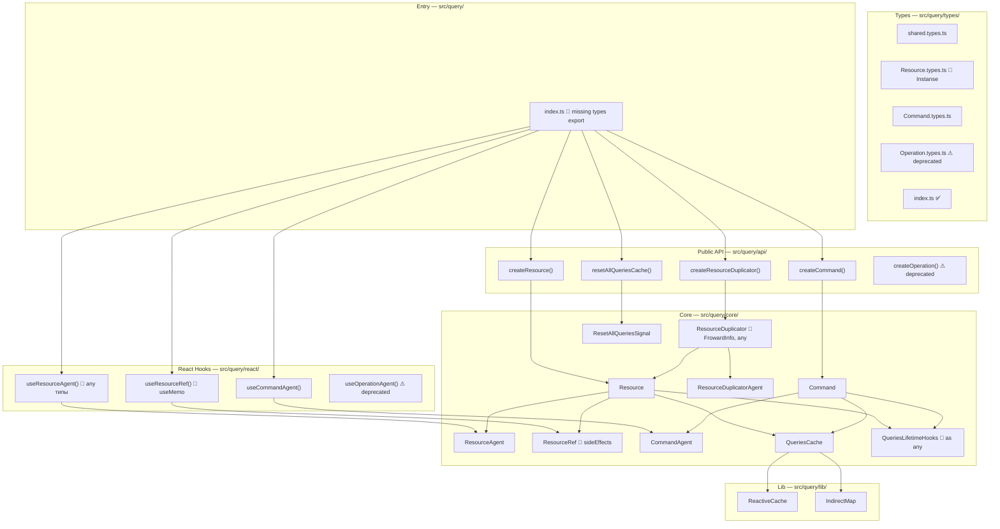
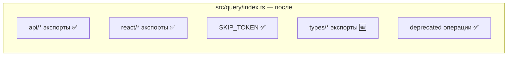

# Архитектура изменений

## 1. Обзор

Этот документ описывает **все файлы**, требующие модификации, и характер изменений в каждом. Изменения разделены на три категории: исправления багов (Bug), исправления API (API), добавление тестов (Test).

## 2. Компонентная диаграмма `src/query/`

## 3. Карта изменений

### 3.1 Исправления багов (Bug)

| Файл | Изменение | Приоритет |
|------|----------|-----------|
| `src/query/react/useResourceRef.ts` | Исправить `useMemo` зависимость — заменить `[args]` на стабильный ключ (JSON-сериализация или deep equality ref) | 🔴 Высокий |
| `package.json` | Заменить `"sideEffects": false` на `"sideEffects": ["./dist/query/core/Resource/ResourceRef.js"]` | 🔴 Высокий |

### 3.2 Исправления публичного API (API)

| Файл | Изменение | Приоритет |
|------|----------|-----------|
| `src/query/index.ts` | Добавить `export * from './types'` | 🔴 Высокий |
| `src/query/types/Resource.types.ts` | Переименовать `ResourceRefInstanse` → `ResourceRefInstance` + deprecated alias | 🟡 Средний |
| `src/query/core/Resource/ResourceDuplicator.ts` | Переименовать тип `FrowardInfo` → `ForwardInfo` + deprecated alias | 🟡 Средний |
| `src/query/react/useResourceAgent.ts` | Заменить `any` в `compare()` на generic constraints | 🟡 Средний |
| `src/query/core/Resource/ResourceDuplicator.ts` | Заменить `d: any[]` на типизированный вариант | 🟡 Средний |
| `src/query/core/QueriesLifetimeHooks.ts` | Заменить `as any` на type assertion с конкретным типом | 🟢 Низкий |

### 3.3 Переименование директории

| Файл | Изменение | Приоритет |
|------|----------|-----------|
| `src/query/core/Opertation/` → `src/query/core/Operation/` | Переименовать директорию, обновить все импорты | 🟡 Средний |

### 3.4 Чистка мёртвого кода

| Файл | Изменение | Приоритет |
|------|----------|-----------|
| `src/query/experimental/resource_de_god/` | Удалить пустую директорию | 🟢 Низкий |

### 3.5 Новые файлы — тесты

| Файл для тестирования | Новый тест-файл | Приоритет |
|-----------------------|-----------------|-----------|
| `src/query/lib/IndirectMap.ts` | `src/query/lib/IndirectMap.test.ts` | 🔴 Высокий |
| `src/query/lib/ReactiveCache.ts` | `src/query/lib/ReactiveCache.test.ts` | 🔴 Высокий |
| `src/query/core/QueriesCache.ts` | `src/query/core/QueriesCache.test.ts` | 🔴 Высокий |
| `src/query/core/ResetAllQueriesSignal.ts` | `src/query/core/ResetAllQueriesSignal.test.ts` | 🟡 Средний |
| `src/query/core/QueriesLifetimeHooks.ts` | `src/query/core/QueriesLifetimeHooks.test.ts` | 🟡 Средний |
| `src/query/core/Resource/Resource.ts` | `src/query/core/Resource/Resource.test.ts` | 🔴 Высокий |
| `src/query/core/Resource/ResourceRef.ts` | `src/query/core/Resource/ResourceRef.test.ts` | 🔴 Высокий |
| `src/query/core/Resource/ResourceDuplicator.ts` | `src/query/core/Resource/ResourceDuplicator.test.ts` | 🟡 Средний |
| `src/query/core/Command/Command.ts` | `src/query/core/Command/Command.test.ts` | 🔴 Высокий |
| `src/query/SKIP_TOKEN.ts` | `src/query/SKIP_TOKEN.test.ts` | 🟢 Низкий |
| `src/query/types/index.ts` | (Проверка в интеграционном тесте) | 🟡 Средний |
| `src/__tests__/integration/root-exports.test.ts` | Расширить существующий файл query-экспортами | 🔴 Высокий |

### 3.6 Обновление конфигурации

| Файл | Изменение | Приоритет |
|------|----------|-----------|
| `vitest.config.ts` | Убрать `src/query/**` из excludes coverage | 🔴 Высокий |

## 4. Модульная структура после изменений

### Итого

| Категория | Кол-во файлов |
|-----------|--------------|
| Исправления багов | 2 |
| Исправления API | 6 |
| Переименование | 1 директория + обновление импортов |
| Чистка | 1 пустая директория |
| Новые тесты | 10 файлов |
| Расширение тестов | 1 файл |
| Конфигурация | 1 файл |
| **Итого затронутых файлов** | **~22** |
