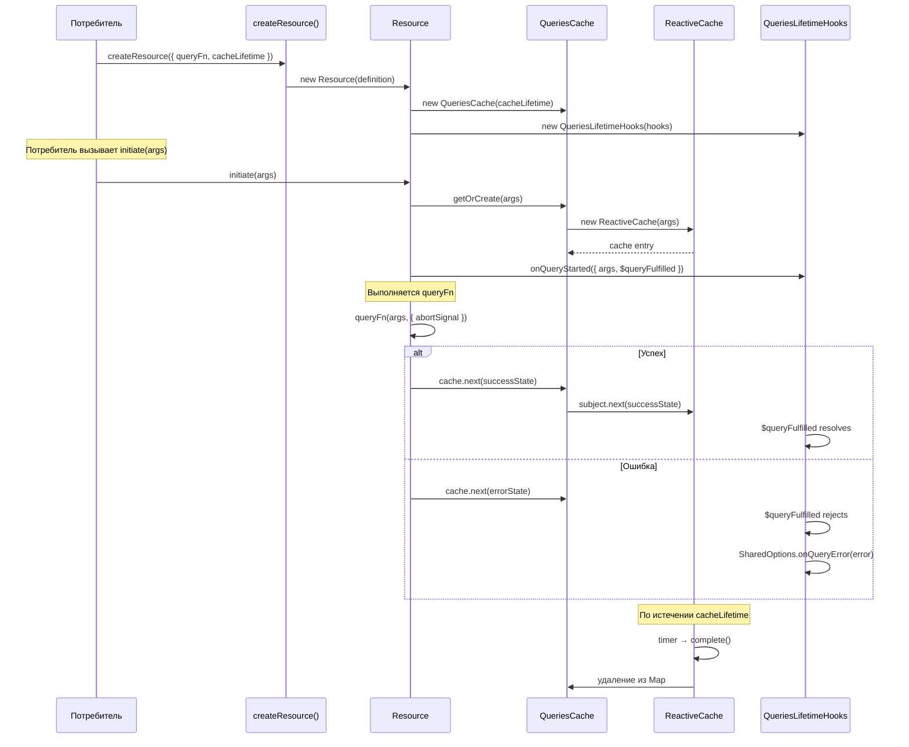
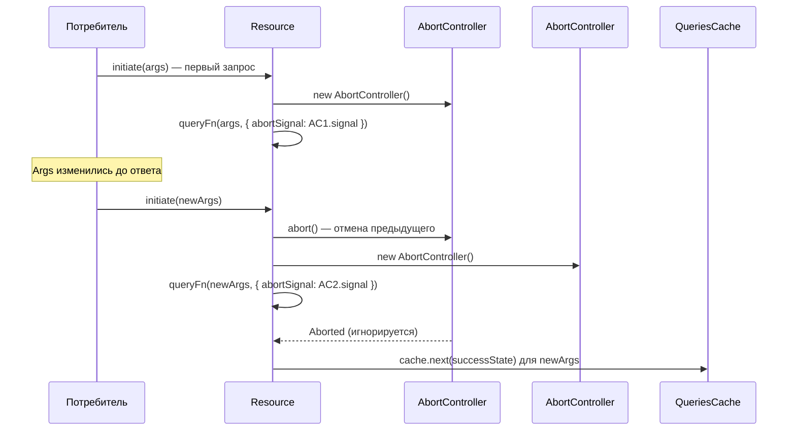
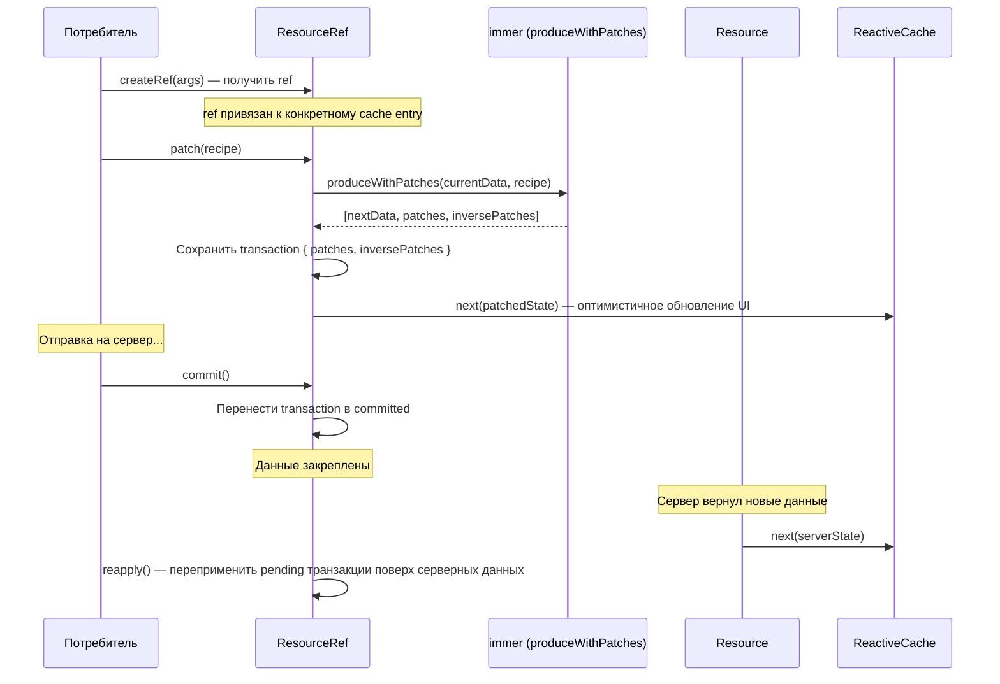
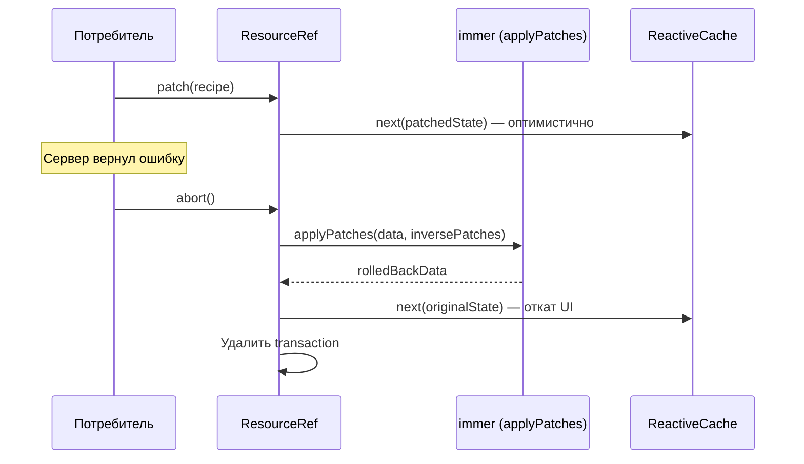
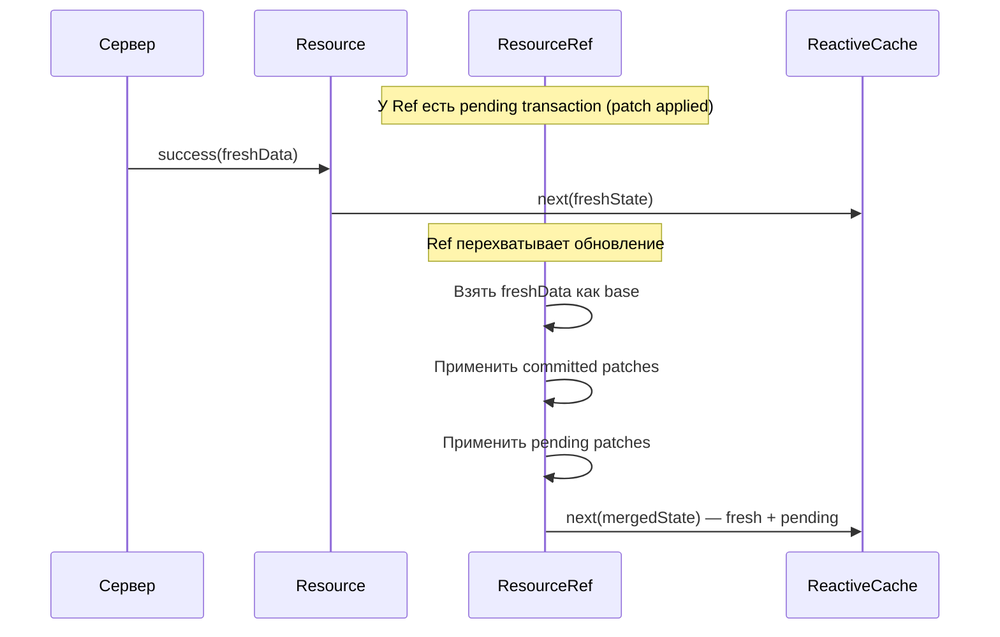
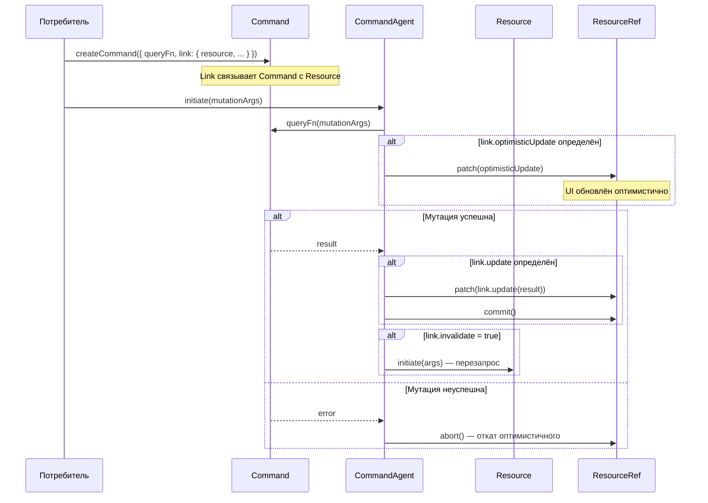
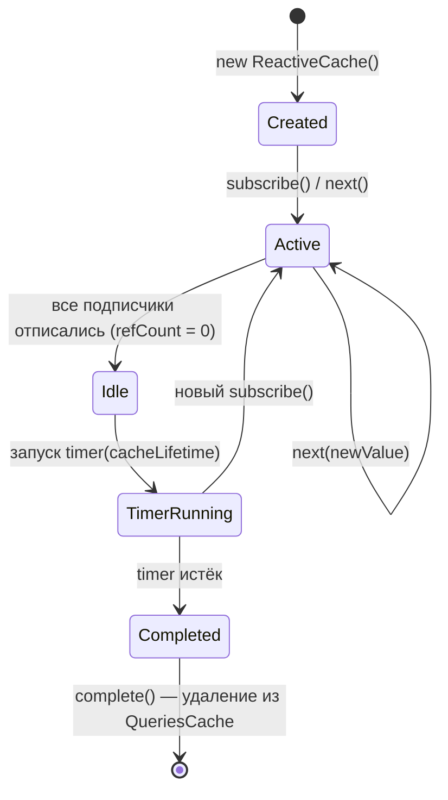
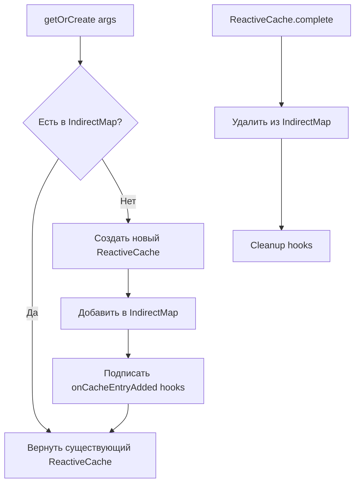
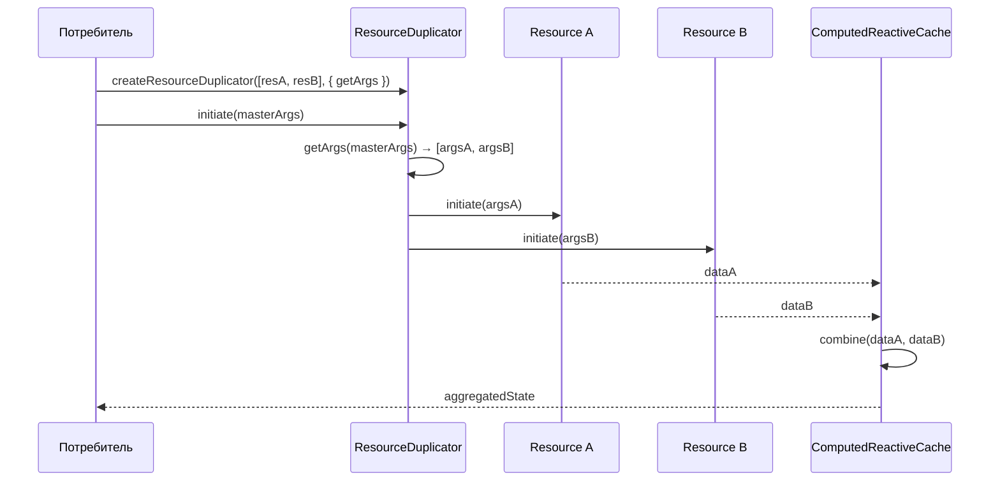
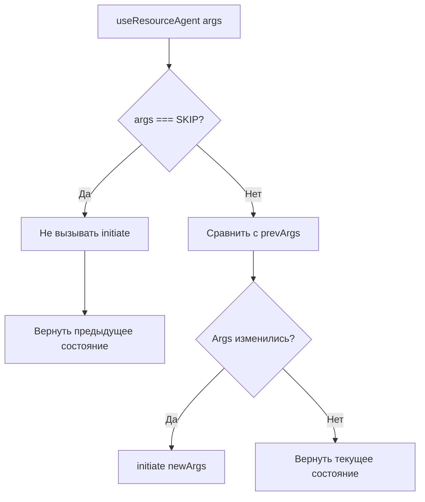

# Потоки данных в Query-модуле

## 1. Обзор

Этот документ описывает потоки данных через ключевые компоненты `src/query/`. Понимание этих потоков критически важно для написания тестов и верификации корректности.

## 2. Жизненный цикл Resource-запроса

### 2.1 Основной поток: создание → запрос → кэш → очистка

### 2.2 Повторный запрос и abort

## 3. Транзакционная модель ResourceRef

### 3.1 Patch → Commit → Success

### 3.2 Patch → Abort (откат)

### 3.3 Reapply — переприменение при обновлении сервера

## 4. Жизненный цикл Command и Link-система

### 4.1 Command → Resource linking

## 5. Жизненный цикл кэша

### 5.1 ReactiveCache — таймер и очистка

### 5.2 QueriesCache — управление entries

## 6. ResourceDuplicator — агрегация

## 7. SKIP Token

