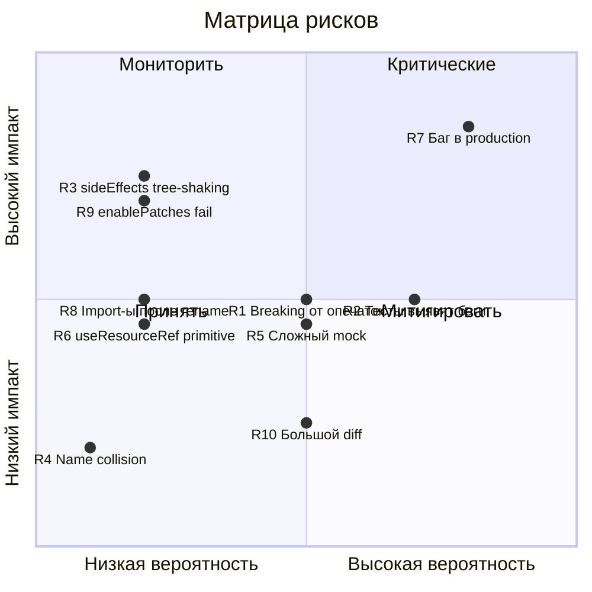

# Анализ рисков

## 1. Таблица рисков

| ID | Риск | Вероятность | Импакт | Уровень | Митигация |
|----|------|-------------|--------|---------|-----------|
| R1 | Breaking change от исправления опечаток (`ResourceRefInstanse` → `ResourceRefInstance`) | Средняя | Средний | 🟡 | Deprecated alias (ADR-1); bumped minor version; CHANGELOG запись |
| R2 | Тесты выявят баги, требующие архитектурных изменений, выходящих за scope | Высокая | Средний | 🟡 | Жёсткий scope: фиксировать только баги уровня "не работает", архитектурные — в issues |
| R3 | `sideEffects` fix ломает tree-shaking у потребителей | Низкая | Высокий | 🟡 | Конкретный файл в `sideEffects` массиве, а не отмена `false` целиком |
| R4 | Export типов создаёт name collision у потребителей | Очень низкая | Низкий | 🟢 | Имена типов достаточно специфичны (`ResourceDefinition`, `CommandQueryState`) |
| R5 | Тесты core-модулей требуют сложного mock-окружения (signals, rxjs) | Средняя | Средний | 🟡 | Использовать паттерны из существующих тестов `src/common/` и `src/signals/` |
| R6 | `useResourceRef` fix меняет поведение для primitive args | Низкая | Средний | 🟡 | Тест для обоих случаев (primitive и object args) |
| R7 | Пропуск бага в непротестированном коде → баг в production у потребителя | Высокая | Высокий | 🔴 | Tier-система тестирования: core первым делом; known-issues документация |
| R8 | Переименование директории `Opertation` → `Operation` ломает import-ы | Низкая | Средний | 🟡 | Автоматизированный поиск и замена всех import-ов; tsc --noEmit верификация |
| R9 | `enablePatches()` перестаёт вызываться после sideEffects fix | Низкая | Высокий | 🟡 | Тест patch-операций; проверка с реальным bundler-ом |
| R10 | Слишком большой diff блокирует code review | Средняя | Низкий | 🟢 | Разделить на фазы: fixes отдельно, тесты отдельно |

## 2. Матрица рисков

## 3. Детальный анализ критических рисков

### R7: Пропуск бага в непротестированном коде (🔴 Критический)

**Описание**: Даже после добавления тестов, coverage не будет 100%. Сложная логика patch-транзакций (commit/abort/reapply очереди) может содержать скрытые баги, которые проявятся только в production при специфических условиях.

**Конкретные зоны риска**:
- `ResourceRef.reapply()` — переприменение pending-транзакций поверх серверных данных. Порядок patches, conflict resolution
- `Command` concurrent вызовы с одним и тем же args — race condition в state machine
- `ReactiveCache` timer edge cases — подписка/отписка в moment между timer fire и cleanup
- `ResourceDuplicator.serialize()` — коллизии ключей при `|` в getArgKey

**Митигация**:
1. Приоритизация тестов: `ResourceRef` и `Resource` — первые
2. Тигие тест-кейсы для edge cases (см. `06-testcases.md`)
3. Release notes с честным указанием "query module has limited test coverage"
4. RC-процесс с feedback loop от early adopters

### R1: Breaking change от исправления опечаток (🟡 Средний)

**Описание**: Потребители, использующие `ResourceRefInstanse` как тип annotation, получат TypeScript-ошибку.

**Оценка масштаба**: Версия 0.5.3-rc.2 — limited adoption. Вероятность что кто-то уже использует этот тип по имени — средняя (он присутствует в документации `docs/query/README.md:318` и `docs/usage/react/README.md:226`).

**Митигация**:
1. Deprecated alias (`export type ResourceRefInstanse = ResourceRefInstance`)
2. CHANGELOG запись с migration instruction
3. Semver: 0.x → minor bump допустим

### R2: Тесты выявят не-тривиальные баги (🟡 Средний)

**Описание**: При написании тестов для `ResourceRef.patch()` или `Command.initiate()` может обнаружиться, что текущая логика некорректна в определённых сценариях.

**Пример**: если `reapply()` неправильно обрабатывает очередь из 3+ транзакций, fix потребует изменения core-логики.

**Митигация**:
1. Если баг — чётко ломает потребителя → фиксим
2. Если баг — edge case, не воспроизводимый в normal usage → документируем, фиксим позже
3. Жёсткий scope: не рефакторить core

## 4. Стратегия отката

Если в процессе имплементации обнаружится, что изменения слишком рискованны:

1. **Точка возврата 1**: после fix багов, до тестов → можно выпустить только с fixes
2. **Точка возврата 2**: тесты выявили критический баг → выпустить warning в docs, отложить тесты
3. **Полный откат**: `git revert` серии коммитов → возврат к текущему состоянию

## 5. Самый рискованный изменение

**`sideEffects` fix + `enablePatches()` взаимодействие** (R3 + R9).

Текущее состояние: `sideEffects: false` → bundler может удалить `enablePatches()` → patch-транзакции ломаются silently (immer не выбрасывает ошибку, просто не генерирует patches).

Фикс: `"sideEffects": ["./dist/query/core/Resource/ResourceRef.js"]` — но если путь в dist не точно совпадает (например, bundler flatten-ит), фикс не сработает.

**Верификация**: после фикса запустить `npm pack` + проверить что `enablePatches()` присутствует в bundle.
