# Тест-стратегия и тест-кейсы

## 1. Подход к тестированию

### 1.1 Инструменты

- **Vitest** — тест-раннер (уже настроен)
- **jsdom** — DOM-окружение для React-хуков (уже настроено в `vitest.config.ts`)
- **@testing-library/react** + `renderHook` — для smoke-тестов React hooks
- **Паттерны** из существующих тестов `src/common/` и `src/signals/`

### 1.2 Структура тестовых файлов

Тесты располагаются рядом с исходными файлами (colocated pattern, как в `src/common/`):

```
src/query/
├── SKIP_TOKEN.test.ts
├── lib/
│   ├── IndirectMap.test.ts
│   └── ReactiveCache.test.ts
├── core/
│   ├── QueriesCache.test.ts
│   ├── QueriesLifetimeHooks.test.ts
│   ├── ResetAllQueriesSignal.test.ts
│   ├── Resource/
│   │   ├── Resource.test.ts
│   │   ├── ResourceRef.test.ts
│   │   └── ResourceDuplicator.test.ts
│   └── Command/
│       └── Command.test.ts
src/__tests__/
└── integration/
    └── root-exports.test.ts  ← расширить
```

### 1.3 Конфигурация

Необходимое изменение в `vitest.config.ts`:
- Убрать `src/query/**` из `coverage.exclude`
- Оставить порог 80% для `src/common` и `src/signals`, для `src/query` установить начальный порог 50%

### 1.4 Test Setup для query-модулей

Для query-тестов нужен дополнительный reset (аналог `resetSharedOptions()` из `src/__tests__/setup.ts`):

```typescript
// В каждом query-тесте:
beforeEach(() => {
  resetSharedOptions(); // уже существует
  // + reset singleton state:
  // ResetAllQueriesSignal — вызвать clean или пересоздать
});
```

### 1.5 Mock-стратегия

| Зависимость | Стратегия | Обоснование |
|-------------|-----------|-------------|
| `queryFn` | Mock function (`vi.fn()`) | Контролируемый async |
| `RxJS` | Реальная реализация | Тестируем интеграцию с RxJS |
| `immer` | Реальная реализация | Тестируем patch-транзакции |
| `Signals` (Computed, State) | Реальная реализация | Уже протестированы; нужна реальная реактивность |
| `React` (для hooks) | `renderHook` из testing-library | Стандартный подход |
| `timers` | `vi.useFakeTimers()` | Контроль `cacheLifetime` таймеров |

---

## 2. Полная таблица тест-кейсов

### 2.1 IndirectMap (`src/query/lib/IndirectMap.test.ts`)

| # | Тест-кейс | Приоритет | Описание |
|---|-----------|-----------|----------|
| TC-001 | Примитивный ключ: set/get | 🔴 Высокий | `map.set('key', value)` → `map.get('key')` возвращает value |
| TC-002 | Объектный ключ: shallow equal | 🔴 Высокий | `map.set({a:1}, v1)` → `map.get({a:1})` возвращает v1 (новый объект, но equal) |
| TC-003 | Объектные ключи: разные значения | 🔴 Высокий | `map.set({a:1}, v1)` → `map.get({a:2})` возвращает undefined |
| TC-004 | WeakMap кэш: повторные обращения O(1) | 🟡 Средний | Второй `get({a:1})` быстрее (из _compareCache) |
| TC-005 | delete: удаление по ключу | 🟡 Средний | `map.delete({a:1})` → `map.get({a:1})` возвращает undefined |
| TC-006 | has: проверка существования | 🟡 Средний | `map.has({a:1})` → true/false |
| TC-007 | values: итерация | 🟢 Низкий | `[...map.values()]` содержит все значения |
| TC-008 | Кастомный compare function | 🟡 Средний | `new IndirectMap(deepEqual)` — работает с deep-nested objects |
| TC-009 | Примитивный ключ: number, null, undefined | 🟡 Средний | Корректная обработка edge-case ключей |

### 2.2 ReactiveCache (`src/query/lib/ReactiveCache.test.ts`)

| # | Тест-кейс | Приоритет | Описание |
|---|-----------|-----------|----------|
| TC-010 | Создание с initial value | 🔴 Высокий | `new ReactiveCache(initialState)` → `.value` возвращает initialState |
| TC-011 | next(): обновление значения | 🔴 Высокий | `.next(newState)` → подписчики получают newState |
| TC-012 | value$ Observable: подписка | 🔴 Высокий | `cache.value$.obs.subscribe()` — получает текущее и последующие значения |
| TC-013 | Cache lifetime: таймер запускается при refCount=0 | 🔴 Высокий | Отписка всех → таймер → `complete()` |
| TC-014 | Cache lifetime: таймер отменяется при новой подписке | 🔴 Высокий | Отписка → подписка до истечения → кэш жив |
| TC-015 | complete(): idempotent | 🟡 Средний | Двойной `complete()` не бросает ошибку |
| TC-016 | closed: флаг после complete | 🟡 Средний | `cache.closed` → true |
| TC-017 | signalized value$ | 🟡 Средний | `value$` использует `signalize()` — синхронный доступ через `.value` |

### 2.3 QueriesCache (`src/query/core/QueriesCache.test.ts`)

| # | Тест-кейс | Приоритет | Описание |
|---|-----------|-----------|----------|
| TC-018 | getOrCreate: новый entry | 🔴 Высокий | Первый вызов создаёт ReactiveCache |
| TC-019 | getOrCreate: существующий entry (cache hit) | 🔴 Высокий | Повторный вызов с тем же args возвращает тот же cache |
| TC-020 | getOrCreate: разные args — разные entries | 🔴 Высокий | `getOrCreate({id:1})` и `getOrCreate({id:2})` — разные |
| TC-021 | values(): все entries | 🟡 Средний | Возвращает все активные ReactiveCache |
| TC-022 | Cleanup по таймеру: entry удаляется | 🟡 Средний | `cacheLifetime` истёк → entry нет в IndirectMap |
| TC-023 | Default cacheLifetime = 60000 | 🟢 Низкий | Соответствует документации |

### 2.4 Resource (`src/query/core/Resource/Resource.test.ts`)

| # | Тест-кейс | Приоритет | Описание |
|---|-----------|-----------|----------|
| TC-024 | initiate: success flow | 🔴 Высокий | `initiate(args)` → queryFn вызван → state = success с data |
| TC-025 | initiate: error flow | 🔴 Высокий | queryFn throws → state = error |
| TC-026 | initiate: isLoading → success transition | 🔴 Высокий | state.isLoading = true → queryFn resolves → isLoading = false, data set |
| TC-027 | initiate: isInitialLoading vs isReloading | 🟡 Средний | Первый запрос = isInitialLoading; повторный = isReloading |
| TC-028 | initiate: abort при повторном вызове | 🔴 Высокий | `initiate(a)` → `initiate(b)` → первый aborted, только второй резолвится |
| TC-029 | initiate: тот же args — dedup | 🟡 Средний | Два `initiate({id:1})` → один fetch |
| TC-030 | compareArgs: shallowEqual default | 🟡 Средний | `{a:1}` == `{a:1}` (новый объект) |
| TC-031 | compareArgs: custom function | 🟡 Средний | `compareArgs: deepEqual` — используется для сравнения |
| TC-032 | createWithData: создание с данными | 🟡 Средний | Предзаполненный state без fetch |
| TC-033 | createWithData: игнорируется если initiated | 🟡 Средний | Если уже initiate вызван, createWithData — no-op |
| TC-034 | success: сброс transactions | 🟡 Средний | `savedData: null, transactions: null` после success |
| TC-035 | state transitions: полный цикл | 🔴 Высокий | idle → loading → success → loading (re-fetch) → success |

### 2.5 ResourceRef (`src/query/core/Resource/ResourceRef.test.ts`)

| # | Тест-кейс | Приоритет | Описание |
|---|-----------|-----------|----------|
| TC-036 | createRef: создание ref для args | 🔴 Высокий | `resource.createRef(args)` возвращает ResourceRef |
| TC-037 | patch: produce + patches generated | 🔴 Высокий | `ref.patch(draft => { draft.x = 1 })` → UI обновляется |
| TC-038 | patch: inverse patches сохраняются | 🔴 Высокий | Для rollback |
| TC-039 | commit: фиксация транзакции | 🔴 Высокий | `ref.commit()` → transported из pending в committed |
| TC-040 | abort: откат к оригинальным данным | 🔴 Высокий | `ref.patch(...)` → `ref.abort()` → данные = до patch |
| TC-041 | reapply: pending patches поверх свежих данных | 🔴 Высокий | Server update → pending patches переприменяются |
| TC-042 | Несколько patch подряд | 🔴 Высокий | `patch → patch → commit` → оба применены |
| TC-043 | patch → server update → reapply → commit | 🟡 Средний | Комплексный сценарий с серверным обновлением |
| TC-044 | abort после commit — без эффекта | 🟡 Средний | Committed транзакцию нельзя отменить |
| TC-045 | invalidate: делегирует на resource.initiate | 🟡 Средний | `ref.invalidate()` → re-fetch |
| TC-046 | enablePatches() вызван | 🔴 Высокий | Верификация что immer patches работают |

### 2.6 Command (`src/query/core/Command/Command.test.ts`)

| # | Тест-кейс | Приоритет | Описание |
|---|-----------|-----------|----------|
| TC-047 | initiate: success flow | 🔴 Высокий | `initiate(args)` → queryFn → state = success |
| TC-048 | initiate: error flow | 🔴 Высокий | queryFn throws → state = error |
| TC-049 | state transitions: idle → loading → success | 🔴 Высокий | Полный цикл |
| TC-050 | link: update после success | 🟡 Средний | `link.update(result)` → ResourceRef.patch |
| TC-051 | link: optimisticUpdate → commit | 🟡 Средний | optimistic patch → success → commit |
| TC-052 | link: optimisticUpdate → abort | 🟡 Средний | optimistic patch → error → abort (rollback) |
| TC-053 | link: invalidate после success | 🟡 Средний | `link.invalidate: true` → resource re-initiate |
| TC-054 | concurrent initiate (same args) | 🟡 Средний | Race condition проверка |

### 2.7 ResetAllQueriesSignal (`src/query/core/ResetAllQueriesSignal.test.ts`)

| # | Тест-кейс | Приоритет | Описание |
|---|-----------|-----------|----------|
| TC-055 | clean: вызывает next() через Batcher | 🟡 Средний | Подписчики получают сигнал |
| TC-056 | Несколько подписчиков получают сигнал | 🟡 Средний | Broadcast всем |
| TC-057 | Подписка/отписка | 🟢 Низкий | Нет утечек |

### 2.8 QueriesLifetimeHooks (`src/query/core/QueriesLifetimeHooks.test.ts`)

| # | Тест-кейс | Приоритет | Описание |
|---|-----------|-----------|----------|
| TC-058 | onQueryStarted: вызывается при initiate | 🟡 Средний | callback вызван с правильными args |
| TC-059 | $queryFulfilled: resolves при success | 🟡 Средний | Promise resolves с data |
| TC-060 | $queryFulfilled: rejects при error | 🟡 Средний | Promise rejects с error |
| TC-061 | onCacheEntryAdded: вызывается при создании entry | 🟡 Средний | callback вызван |
| TC-062 | SharedOptions.onQueryError: вызывается при ошибке | 🟡 Средний | Глобальный error handler |
| TC-063 | Devtools integration: условный вызов | 🟢 Низкий | `Devtools.hasDevtools` → stateDevtools вызван |

### 2.9 ResourceDuplicator (`src/query/core/Resource/ResourceDuplicator.test.ts`)

| # | Тест-кейс | Приоритет | Описание |
|---|-----------|-----------|----------|
| TC-064 | Создание из нескольких ресурсов | 🟡 Средний | `createResourceDuplicator([res1, res2])` |
| TC-065 | initiate: все ресурсы инициируются | 🟡 Средний | Каждый ресурс получает свои args |
| TC-066 | Агрегация состояний: isLoading | 🟡 Средний | isLoading = true пока хотя бы один loading |
| TC-067 | Агрегация состояний: isError | 🟡 Средний | isError если хотя бы один error |
| TC-068 | serialize: уникальный ключ | 🟢 Низкий | Разные args → разные ключи |

### 2.10 SKIP_TOKEN (`src/query/SKIP_TOKEN.test.ts`)

| # | Тест-кейс | Приоритет | Описание |
|---|-----------|-----------|----------|
| TC-069 | SKIP является Symbol | 🟢 Низкий | `typeof SKIP === 'symbol'` |
| TC-070 | SKIP уникален | 🟢 Низкий | `SKIP !== Symbol('SKIP')` |

### 2.11 React hooks (smoke-тесты)

| # | Тест-кейс | Файл | Приоритет | Описание |
|---|-----------|------|-----------|----------|
| TC-071 | useResourceAgent: рендер без ошибок | (в Resource.test.ts или отдельно) | 🟡 Средний | `renderHook(() => useResourceAgent(res, args))` |
| TC-072 | useResourceAgent: SKIP не вызывает initiate | — | 🟡 Средний | `renderHook(() => useResourceAgent(res, SKIP))` |
| TC-073 | useResourceAgent: смена args → re-initiate | — | 🟡 Средний | rerender с новыми args |
| TC-074 | useCommandAgent: trigger вызывает initiate | — | 🟡 Средний | `const [trigger] = result.current; trigger(args)` |
| TC-075 | useResourceRef: создание ref | — | 🟡 Средний | `renderHook(() => useResourceRef(res, args))` |
| TC-076 | useResourceRef: объектные args — ref стабилен (BUGFIX) | — | 🔴 Высокий | После фикса: rerender с `{id:1}` → тот же ref |
| TC-077 | useResourceRef: primitive args — ref стабилен | — | 🟡 Средний | rerender с `'id1'` → тот же ref |

### 2.12 Интеграционные тесты экспортов

| # | Тест-кейс | Файл | Приоритет | Описание |
|---|-----------|------|-----------|----------|
| TC-078 | root экспортирует createResource | `src/__tests__/integration/root-exports.test.ts` | 🔴 Высокий | `expect(mod.createResource).toBeDefined()` |
| TC-079 | root экспортирует createCommand | — | 🔴 Высокий | |
| TC-080 | root экспортирует useResourceAgent | — | 🔴 Высокий | |
| TC-081 | root экспортирует useCommandAgent | — | 🔴 Высокий | |
| TC-082 | root экспортирует useResourceRef | — | 🔴 Высокий | |
| TC-083 | root экспортирует SKIP | — | 🔴 Высокий | |
| TC-084 | root экспортирует createResourceDuplicator | — | 🟡 Средний | |
| TC-085 | root экспортирует resetAllQueriesCache | — | 🟡 Средний | |
| TC-086 | root экспортирует createOperation (deprecated) | — | 🟡 Средний | |
| TC-087 | root экспортирует useOperationAgent (deprecated) | — | 🟡 Средний | |
| TC-088 | root экспортирует ResourceDefinition type | — | 🔴 Высокий | После фикса типов |
| TC-089 | root экспортирует CommandDefinition type | — | 🔴 Высокий | |
| TC-090 | root экспортирует ResourceQueryState type | — | 🟡 Средний | |
| TC-091 | root экспортирует CommandQueryState type | — | 🟡 Средний | |
| TC-092 | root экспортирует ResourceRefInstance type | — | 🟡 Средний | |

---

## 3. Сводка

### По приоритетам

| Приоритет | Кол-во тест-кейсов |
|-----------|-------------------|
| 🔴 Высокий | 33 |
| 🟡 Средний | 44 |
| 🟢 Низкий | 15 |
| **Итого** | **92** |

### По файлам

| Тест-файл | Кол-во кейсов |
|-----------|--------------|
| `IndirectMap.test.ts` | 9 |
| `ReactiveCache.test.ts` | 8 |
| `QueriesCache.test.ts` | 6 |
| `Resource.test.ts` | 12 |
| `ResourceRef.test.ts` | 11 |
| `Command.test.ts` | 8 |
| `ResetAllQueriesSignal.test.ts` | 3 |
| `QueriesLifetimeHooks.test.ts` | 6 |
| `ResourceDuplicator.test.ts` | 5 |
| `SKIP_TOKEN.test.ts` | 2 |
| Hooks smoke-тесты | 7 |
| `root-exports.test.ts` (расширение) | 15 |
| **Итого** | **92** |

### План приоритизации

```mermaid
gantt
    title Порядок написания тестов
    dateFormat X
    axisFormat %s

    section Tier 1 — Core
    IndirectMap.test.ts           :t1, 0, 1
    ReactiveCache.test.ts         :t2, 0, 1
    QueriesCache.test.ts          :t3, 1, 2
    Resource.test.ts              :t4, 1, 3
    ResourceRef.test.ts           :t5, 1, 3
    Command.test.ts               :t6, 2, 3

    section Tier 2 — Supporting
    QueriesLifetimeHooks.test.ts  :t7, 3, 4
    ResetAllQueriesSignal.test.ts :t8, 3, 4
    ResourceDuplicator.test.ts    :t9, 3, 4
    SKIP_TOKEN.test.ts            :t10, 3, 4

    section Tier 3 — Integration
    root-exports.test.ts          :t11, 4, 5
    Hooks smoke-тесты             :t12, 4, 5
```


