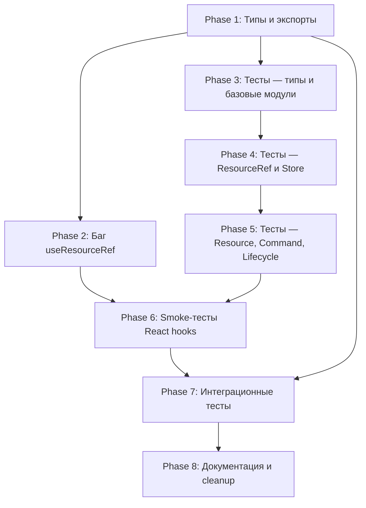

# План: Release Validation

- **Date**: 2026-03-10
- **Status**: Draft
- **Feature**: Предрелизная валидация `src/query/`, корневых экспортов и интеграционных тестов

## Цель

Декомпозировать дизайн из [фазы Design](../02-design/README.md) на независимые фазы имплементации. Каждая фаза — отдельный conventional commit, который можно верифицировать и откатить.

## Документы

| # | Фаза | Описание | Тип |
|---|------|----------|-----|
| 01 | [Типы и экспорты](./01-types-and-exports.md) | Исправление опечаток, добавление экспортов типов, замена `any` | Последовательная |
| 02 | [Баг useResourceRef](./02-fix-useResourceRef.md) | Исправление мемоизации для объектных аргументов | Последовательная |
| 03 | [Unit-тесты: типы и базовые модули](./03-tests-types-and-basic.md) | Тесты SKIP_TOKEN, IndirectMap, ReactiveCache | Последовательная |
| 04 | [Unit-тесты: ResourceRef и Store](./04-tests-resourceref-and-store.md) | Тесты ResourceRef, QueriesCache, ResetAllQueriesSignal | Последовательная |
| 05 | [Unit-тесты: Resource, Command и Lifecycle](./05-tests-resource-command-lifecycle.md) | Тесты Resource, Command, QueriesLifetimeHooks, ResourceDuplicator | Последовательная |
| 06 | [Smoke-тесты React hooks](./06-tests-react-hooks.md) | Smoke-тесты useResourceAgent, useCommandAgent, useResourceRef | Последовательная |
| 07 | [Интеграционные тесты и экспорты](./07-tests-integration-exports.md) | Расширение root-exports.test.ts, конфигурация coverage | Последовательная |
| 08 | [Документация и cleanup](./08-docs-and-cleanup.md) | CHANGELOG, обновление docs, чистка мёртвого кода | Последовательная |

## Диаграмма зависимостей

## Сводная таблица

| Фаза | Задач | Файлов затронуто | Зависит от | Блокирует |
|------|-------|-----------------|------------|-----------|
| 1 | 6 | 7 | — | 2, 3, 7 |
| 2 | 2 | 1 | 1 | 6 |
| 3 | 3 | 3 | 1 | 4 |
| 4 | 3 | 3 | 3 | 5 |
| 5 | 4 | 4 | 4 | 6 |
| 6 | 3 | 3 | 2, 5 | 7 |
| 7 | 3 | 2 | 1, 6 | 8 |
| 8 | 5 | 5+ | 7 | — |

## Параллелизация

```mermaid
gantt
    title Порядок выполнения фаз
    dateFormat X
    axisFormat %s

    section Основная ветка
    Phase 1 — Типы и экспорты       :p1, 0, 1
    Phase 2 — Баг useResourceRef     :p2, 1, 2
    Phase 3 — Тесты: базовые модули  :p3, 1, 2
    Phase 4 — Тесты: ResourceRef     :p4, 2, 3
    Phase 5 — Тесты: Resource/Command:p5, 3, 4
    Phase 6 — Smoke-тесты hooks      :p6, 4, 5
    Phase 7 — Интеграция и exports   :p7, 5, 6
    Phase 8 — Docs и cleanup         :p8, 6, 7
```

**Параллельные пары:**
- Фазы 2 и 3 могут выполняться параллельно после фазы 1
- Остальные фазы строго последовательны

## Правила выполнения

1. **Каждая фаза = один conventional commit** — формат из документа фазы
2. **Верификация перед коммитом** — `tsc --noEmit && vitest run`
3. **Не модифицировать код вне scope** — только файлы, указанные в задачах
4. **При обнаружении нового бага** — документировать, не чинить (если вне scope)
5. **Git: не пушить** — коммиты локальные, ревью после всех фаз

## Следующие шаги

После ревью человеком переходите к фазе Implement: `04-implement/`
