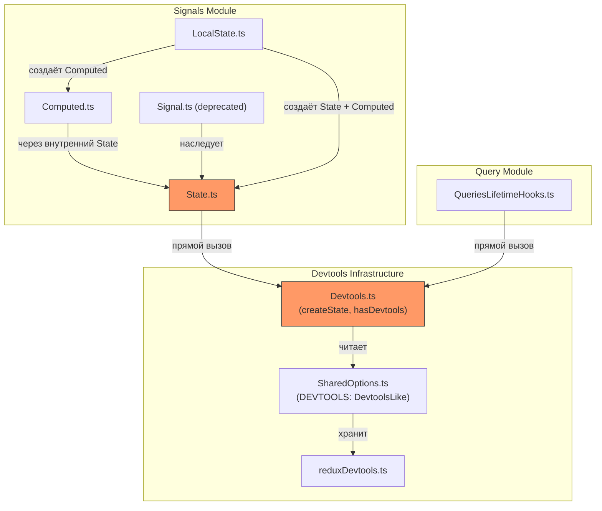
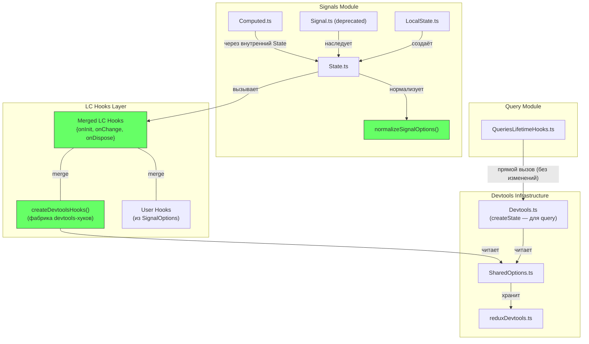
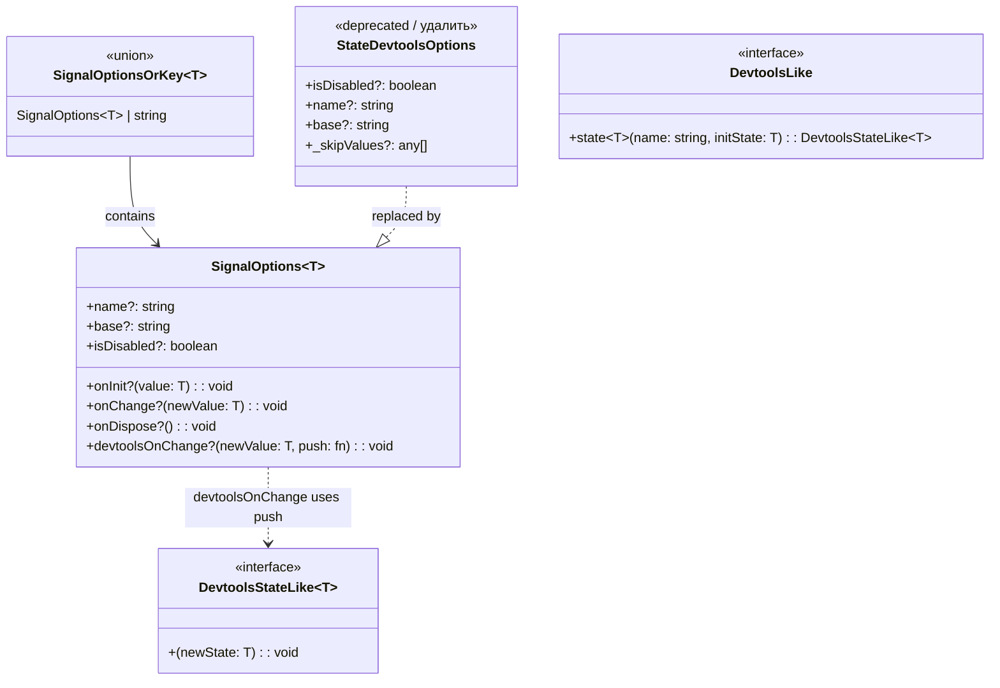
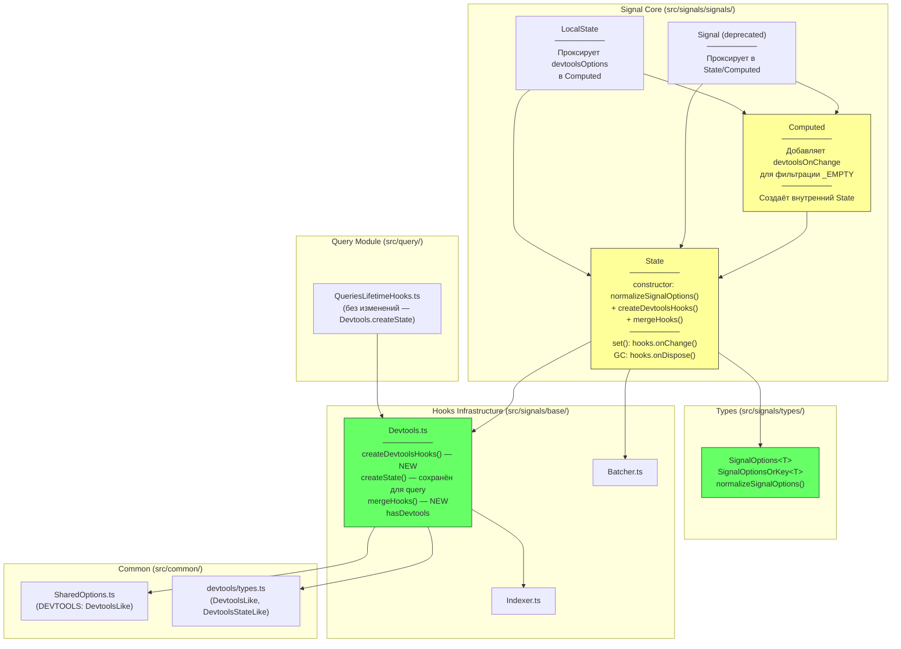
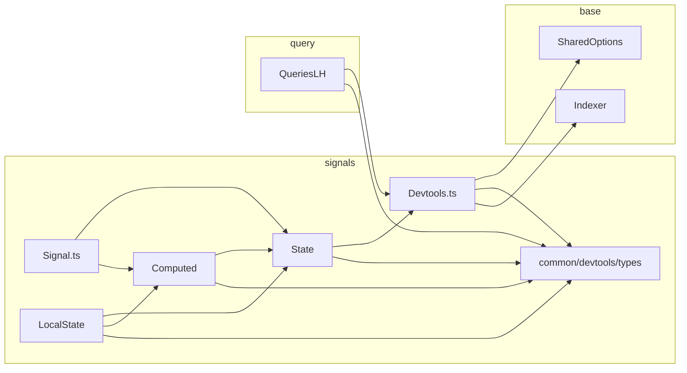
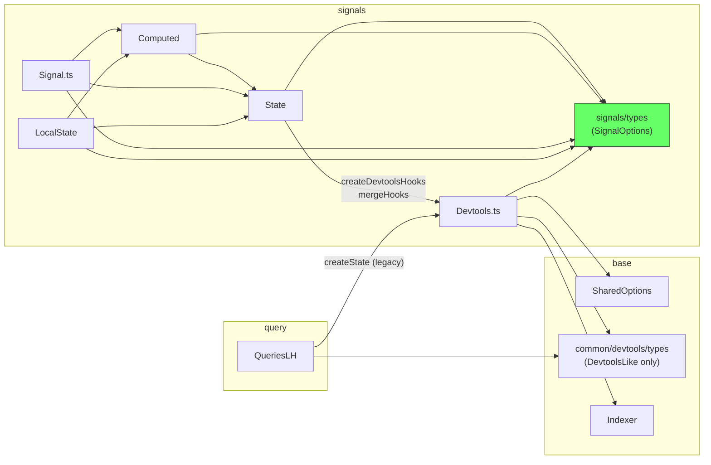

# Архитектура системы: Signal Devtools Lifecycle Hooks

**Status**: Draft  
**Дата**: 2026-03-11

---

## 1. Обзор архитектурных изменений

### 1.1. Текущая архитектура (AS-IS)

Сигналы **напрямую** вызывают devtools через `Devtools.createState()`. Devtools-логика жёстко вшита в `State.set()`, `State.constructor` и `FinalizationRegistry`. Нет абстракции lifecycle — три неявных события (create, update, GC) обрабатываются разрозненно.



**Проблемы**:
- State напрямую зависит от `Devtools.createState()` — жёсткая связь
- `_skipValues` — приватный хак с `any[]` в публичном типе
- Тройная нормализация `string → object` (State, Computed, Devtools.createState)
- `$COMPLETED` — magic string с `as any`
- Нет расширяемости для пользовательских lifecycle-обработчиков

### 1.2. Целевая архитектура (TO-BE)

Сигналы вызывают **только** LC-хуки. Devtools подключаются как **дефолтный набор** LC-хуков, создаваемый фабрикой внутри `State`. Пользовательские хуки merge'атся с devtools-хуками. `Devtools.createState()` остаётся для query-модуля.



---

## 2. Новая система типов

### 2.1. SignalOptions и SignalOptionsOrKey

Определяются в `src/signals/types/options.types.ts`:

```typescript
/**
 * Lifecycle-хук, вызываемый при создании сигнала.
 * @param value — начальное значение
 */
type SignalOnInit<T> = (value: T) => void;

/**
 * Lifecycle-хук, вызываемый при каждом изменении значения.
 * @param newValue — новое значение
 */
type SignalOnChange<T> = (newValue: T) => void;

/**
 * Lifecycle-хук, вызываемый при GC/dispose сигнала.
 */
type SignalOnDispose = () => void;

/**
 * Callback для кастомизации отправки значений в devtools.
 * Заменяет _skipValues: вызывающий решает, пушить ли значение.
 * @param newValue — новое значение сигнала
 * @param push — функция для отправки значения в devtools
 */
type SignalDevtoolsOnChange<T> = (newValue: T, push: (value: T) => void) => void;

/**
 * Опции сигнала с lifecycle hooks и настройками devtools.
 */
interface SignalOptions<T = any> {
    /** Имя сигнала для devtools */
    name?: string;
    /** Базовый префикс для ключа devtools (State, Computed, и т.д.) */
    base?: string;
    /** Отключить devtools для этого сигнала */
    isDisabled?: boolean;

    // --- Lifecycle hooks ---
    onInit?: SignalOnInit<T>;
    onChange?: SignalOnChange<T>;
    onDispose?: SignalOnDispose;

    // --- Devtools customization (не LC-хук) ---
    devtoolsOnChange?: SignalDevtoolsOnChange<T>;
}

/**
 * Shorthand: строка интерпретируется как { name: string }.
 */
type SignalOptionsOrKey<T = any> = SignalOptions<T> | string;
```

### 2.2. Диаграмма иерархии типов



### 2.3. Связь с существующими типами

| Старый тип | Новый тип | Изменение |
|------------|-----------|-----------|
| `StateDevtoolsOptions` | `SignalOptionsOrKey<T>` | Полная замена. `StateDevtoolsOptions` удаляется |
| `StateDevtoolsOptions._skipValues` | `SignalOptions.devtoolsOnChange` | Замена приватного хака на публичный callback |
| — (нет) | `SignalOptions.onInit` | Новый LC-хук |
| — (нет) | `SignalOptions.onChange` | Новый LC-хук |
| — (нет) | `SignalOptions.onDispose` | Новый LC-хук |

---

## 3. Утилита нормализации

### 3.1. `normalizeSignalOptions()`

Определяется в `src/signals/types/options.types.ts` (рядом с типами) или в отдельном файле утилит сигналов:

```typescript
function normalizeSignalOptions<T>(
    options?: SignalOptionsOrKey<T>
): SignalOptions<T> {
    if (!options) return {};
    if (typeof options === 'string') return { name: options };
    return options;
}
```

**Единственная точка нормализации** — заменяет тройную нормализацию в State, Computed, Devtools.createState.

### 3.2. Где вызывается

| Потребитель | Где вызывает | Что получает |
|-------------|-------------|--------------|
| `State.constructor` | Первая строка конструктора | `SignalOptions<T>` — для создания LC-хуков |
| `Computed.constructor` | Перед созданием внутреннего State | `SignalOptions<T>` — добавляет `devtoolsOnChange` и передаёт в State |
| `Signal.state()` / `Signal.compute()` | Проксирует в State/Computed | Без изменений — проксирует `SignalOptionsOrKey` |
| `LocalState.constructor` | Проксирует в Computed | Без изменений |
| `Devtools.createState()` | **Не меняется** — query-модуль продолжает использовать | Внутренняя нормализация остаётся |

---

## 4. Архитектура LC-хуков

### 4.1. Фабрика devtools-хуков

Новая функция `createDevtoolsHooks()` в `src/signals/base/Devtools.ts`:

```typescript
function createDevtoolsHooks<T>(
    initialValue: T,
    options: SignalOptions<T>,
): Pick<SignalOptions<T>, 'onInit' | 'onChange' | 'onDispose'> | null {
    if (options.isDisabled) return null;

    const createStateDevtools = SharedOptions.DEVTOOLS?.state;
    if (!createStateDevtools) return null;

    const key = createKey(options.name, options.base);
    let stateDevtools: DevtoolsStateLike<T> | null = null;

    return {
        onInit(value: T) {
            stateDevtools = createStateDevtools<T>(key, value);
        },
        onChange(newValue: T) {
            stateDevtools?.(newValue);
        },
        onDispose() {
            stateDevtools?.('$COMPLETED' as any);
            stateDevtools = null;
        },
    };
}
```

### 4.2. Merge пользовательских и devtools-хуков

Новая утилита `mergeHooks()`:

```typescript
function mergeHooks<T>(
    devtoolsHooks: Pick<SignalOptions<T>, 'onInit' | 'onChange' | 'onDispose'> | null,
    userOptions: SignalOptions<T>,
): Pick<SignalOptions<T>, 'onInit' | 'onChange' | 'onDispose'> | null {
    const userOnInit = userOptions.onInit;
    const userOnChange = userOptions.onChange;
    const userOnDispose = userOptions.onDispose;

    const hasUser = userOnInit || userOnChange || userOnDispose;
    if (!devtoolsHooks && !hasUser) return null;

    return {
        onInit: devtoolsHooks?.onInit || userOnInit
            ? (value: T) => {
                devtoolsHooks?.onInit?.(value);
                userOnInit?.(value);
            }
            : undefined,
        onChange: devtoolsHooks?.onChange || userOnChange
            ? (newValue: T) => {
                devtoolsHooks?.onChange?.(newValue);
                userOnChange?.(newValue);
            }
            : undefined,
        onDispose: devtoolsHooks?.onDispose || userOnDispose
            ? () => {
                devtoolsHooks?.onDispose?.();
                userOnDispose?.();
            }
            : undefined,
    };
}
```

**Порядок**: devtools-хуки вызываются **первыми**, затем пользовательские. Это обеспечивает корректное логгирование до пользовательских side effects.

### 4.3. Интеграция `devtoolsOnChange` с devtools-хуками

Когда `devtoolsOnChange` задан, devtools LC-хуки адаптируются:

```typescript
// Внутри createDevtoolsHooks, если options.devtoolsOnChange задан:
if (options.devtoolsOnChange) {
    return {
        onInit(value: T) {
            // devtoolsOnChange контролирует, пушить ли начальное значение
            options.devtoolsOnChange!(value, (v) => {
                stateDevtools = createStateDevtools<T>(key, v);
            });
        },
        onChange(newValue: T) {
            options.devtoolsOnChange!(newValue, (v) => {
                if (!stateDevtools) {
                    stateDevtools = createStateDevtools<T>(key, v);
                    return;
                }
                stateDevtools(v);
            });
        },
        onDispose() {
            stateDevtools?.('$COMPLETED' as any);
            stateDevtools = null;
        },
    };
}
```

Это заменяет `_skipValues`: `Computed` передаёт `devtoolsOnChange`, который фильтрует `_EMPTY`.

### 4.4. Компонентная диаграмма (C4 — Container Level)



Зелёные — новые/значительно изменённые модули. Жёлтые — модули с умеренными изменениями.

---

## 5. Изменения в каждом модуле

### 5.1. `State.ts` — основные изменения

```typescript
import { SignalOptionsOrKey, normalizeSignalOptions } from "@/signals/types";
import { Devtools } from "../base";

export class State<T> {
    private readonly _hooks;  // заменяет _stateDevtools
    private _rang = 0;
    protected readonly bs$;
    readonly obs;

    constructor(initialValue: T, options?: SignalOptionsOrKey<T>) {
        const opts = normalizeSignalOptions(options);

        this.bs$ = new BehaviorSubject<T>(initialValue);
        this.obs = this.bs$.asObservable();

        // Гибридный merge: devtools-хуки + пользовательские
        this._hooks = Devtools.mergeHooks(
            Devtools.createDevtoolsHooks(initialValue, opts),
            opts,
        );

        // onInit
        this._hooks?.onInit?.(initialValue);

        // GC cleanup через onDispose
        if (this._hooks?.onDispose) {
            State._finalizationRegistry.register(this, this._hooks.onDispose);
        }
    }

    set(value: T) {
        if (value === this.bs$.value) return;
        Batcher.run(() => {
            this._hooks?.onChange?.(value);
            this.bs$.next(value);
        });
    }

    // ... остальное без изменений

    private static _finalizationRegistry = new FinalizationRegistry(
        (onDispose: SignalOnDispose) => { onDispose(); }
    );
}
```

**Ключевые отличия от текущей версии**:
- `_stateDevtools` → `_hooks` (тип: `{ onInit?, onChange?, onDispose? } | null`)
- Нормализация — однократно через `normalizeSignalOptions()`
- Devtools подключаются через `createDevtoolsHooks()` + `mergeHooks()`
- `FinalizationRegistry` хранит `onDispose` callback вместо `DevtoolsStateLike`
- Нет magic strings (`$COMPLETED` перемещён внутрь `createDevtoolsHooks`)

### 5.2. `Computed.ts` — замена `_skipValues`

```typescript
constructor(private _computeFn: () => T, options?: SignalOptionsOrKey<T>) {
    const opts = normalizeSignalOptions(options);

    const stateOptions: SignalOptions<symbol | T> = {
        ...opts,
        base: opts.base ?? Computed.name,
        // Замена _skipValues: фильтруем _EMPTY через devtoolsOnChange
        devtoolsOnChange: (newValue, push) => {
            if (newValue !== Computed._EMPTY) {
                push(newValue);
            }
        },
    };

    this._state$ = State.create<symbol | T>(Computed._EMPTY, stateOptions);
    // ...
}
```

### 5.3. `Signal.ts` — минимальные изменения

```typescript
import type { SignalOptionsOrKey } from "@/signals/types";

export class Signal<T> extends State<T> {
    constructor(initialValue: T, options?: SignalOptionsOrKey<T>) {
        super(initialValue, options);
    }

    static state<T>(initialValue: T, options?: SignalOptionsOrKey<T>): SignalFn<T> {
        return State.create(initialValue, options);
    }

    static compute<T>(computeFn: () => T, options?: SignalOptionsOrKey<T>) {
        return Computed.create(computeFn, options);
    }
}
```

### 5.4. `LocalState.ts` — минимальные изменения

Тип `devtoolsOptions` в `Options<T>` меняется с `StateDevtoolsOptions` на `SignalOptionsOrKey<T>`. Передача в `Computed` — без изменений.

### 5.5. `Devtools.ts` — расширение API

```typescript
export const Devtools = {
    // СУЩЕСТВУЮЩИЙ — для query-модуля
    createState<T>(initialValue: T, optionsDry: StateDevtoolsOptions = {}) {
        // ... без изменений
    },

    // НОВЫЙ — фабрика devtools LC-хуков для сигналов
    createDevtoolsHooks<T>(
        initialValue: T,
        options: SignalOptions<T>,
    ): Pick<SignalOptions<T>, 'onInit' | 'onChange' | 'onDispose'> | null {
        // ... см. раздел 4.1
    },

    // НОВЫЙ — merge devtools + user хуков
    mergeHooks<T>(
        devtoolsHooks: ... | null,
        userOptions: SignalOptions<T>,
    ): ... | null {
        // ... см. раздел 4.2
    },

    get hasDevtools() {
        return !!SharedOptions.DEVTOOLS?.state;
    },
}
```

### 5.6. `QueriesLifetimeHooks.ts` — БЕЗ ИЗМЕНЕНИЙ

Продолжает использовать `Devtools.createState()` и `Devtools.hasDevtools`. Эта функция сохраняется в `Devtools.ts`.

### 5.7. `src/common/devtools/types.ts` — удаление `_skipValues`

```typescript
// БЫЛО:
export type StateDevtoolsOptions = {
    isDisabled?: boolean,
    name?: string,
    base?: string,
    _skipValues?: any[],
} | string

// СТАЛО: StateDevtoolsOptions остаётся для query-модуля, но без _skipValues
export type StateDevtoolsOptions = {
    isDisabled?: boolean,
    name?: string,
    base?: string,
} | string
```

`_skipValues` удаляется из `StateDevtoolsOptions`. Единственный потребитель (`Computed`) переходит на `devtoolsOnChange`.

---

## 6. Диаграмма зависимостей модулей

### 6.1. Текущие зависимости (AS-IS)



### 6.2. Целевые зависимости (TO-BE)



**Ключевое изменение**: сигналы импортируют `SignalOptions` из `signals/types` вместо `StateDevtoolsOptions` из `common/devtools`. Связь с devtools — только через `Devtools.ts` (не через типы).

---

## 7. Публичный API

### 7.1. Экспорты из `src/signals/types/`

```typescript
// src/signals/types/options.types.ts — NEW
export type { SignalOptions, SignalOptionsOrKey, SignalDevtoolsOnChange };
export { normalizeSignalOptions };

// src/signals/types/index.ts — обновить
export * from './signals.types';
export * from './options.types';   // NEW
```

### 7.2. Экспорты из `src/signals/index.ts`

Публичный API сигналов расширяется типами `SignalOptions`, `SignalOptionsOrKey` и функцией `normalizeSignalOptions`.

### 7.3. Экспорты из `src/index.ts`

Через реэкспорт из `signals` — автоматически.

### 7.4. Обратная совместимость

| API | Совместимость | Примечание |
|-----|---------------|------------|
| `State.create(value, "name")` | ✅ Полная | `SignalOptionsOrKey` поддерживает string |
| `State.create(value, { name, base })` | ✅ Полная | Поля name/base/isDisabled сохранены |
| `Signal.state()` / `Signal.compute()` | ✅ Полная | Типы меняются, но shape совместим |
| `Devtools.createState()` | ✅ Полная | Сохранён для query-модуля |
| `StateDevtoolsOptions._skipValues` | ❌ Удалён | Приватный хак, не документирован |
| `StateDevtoolsOptions` (тип) | ❌ Изменён | Не документирован, не breaking change |

---

## 8. Точки интеграции

### 8.1. SharedOptions.DEVTOOLS

Остаётся **без изменений**. `DefaultOptions.update({ DEVTOOLS: reduxDevtools() })` — тот же API.

`createDevtoolsHooks()` читает `SharedOptions.DEVTOOLS` для создания devtools LC-хуков, аналогично тому, как `createState()` читает его сейчас.

### 8.2. FinalizationRegistry

Текущая реализация хранит `DevtoolsStateLike` в `FinalizationRegistry`. Новая — хранит `onDispose` callback.

**Изменение**: `FinalizationRegistry<DevtoolsStateLike>` → `FinalizationRegistry<SignalOnDispose>`.

Callback `onDispose` из merged-хуков содержит и devtools-cleanup, и пользовательский cleanup.

### 8.3. Batcher

LC-хуки `onChange` вызываются **внутри** `Batcher.run()`, что обеспечивает:
- Вызов devtools onChange **до** `bs$.next()` (как сейчас)
- Батчинг обновлений devtools при каскадных изменениях

### 8.4. Indexer

Используется внутри `createDevtoolsHooks()` (через `createKey()`) — без изменений.

---

## 9. Сводка файловых изменений

| Файл | Действие | Scope |
|------|----------|-------|
| `src/signals/types/options.types.ts` | **Создать** | Новые типы + normalizeSignalOptions |
| `src/signals/types/index.ts` | Изменить | Добавить реэкспорт |
| `src/signals/base/Devtools.ts` | Изменить | Добавить createDevtoolsHooks, mergeHooks |
| `src/signals/signals/State.ts` | Изменить | Использовать LC-хуки вместо прямых devtools |
| `src/signals/signals/Computed.ts` | Изменить | Заменить _skipValues на devtoolsOnChange |
| `src/signals/signals/Signal.ts` | Изменить | Обновить типы параметров |
| `src/signals/signals/LocalState.ts` | Изменить | Обновить тип devtoolsOptions |
| `src/common/devtools/types.ts` | Изменить | Удалить _skipValues из StateDevtoolsOptions |
| `src/query/core/QueriesLifetimeHooks.ts` | **Без изменений** | — |
| `src/common/options/SharedOptions.ts` | **Без изменений** | — |
| `src/common/devtools/reduxDevtools.ts` | **Без изменений** | — |

---

## 10. Принципы проектирования

1. **Инверсия зависимости**: State не знает о конкретной реализации devtools — только о LC-хуках
2. **Единая нормализация**: `normalizeSignalOptions()` — одна точка преобразования `string → object`
3. **Zero overhead**: если хуки не заданы, `_hooks === null`, optional chaining `?.` — ~2ns overhead (см. [внешнее исследование](../01-research/02-external-research.md))
4. **Open/Closed**: новые LC-обработчики добавляются через пользовательские хуки без модификации State
5. **Backward compatible**: `SignalOptionsOrKey<T>` — совместим с текущим API (string | object)
6. **Minimal scope**: query-модуль не затрагивается; `Devtools.createState()` сохранён
