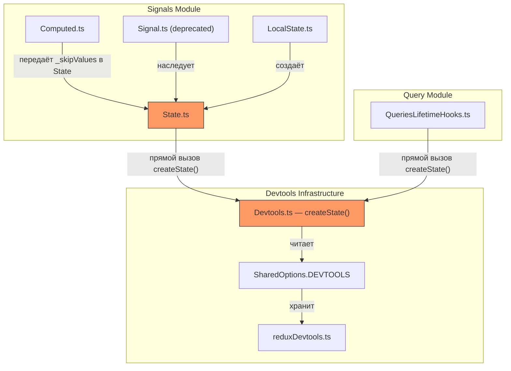
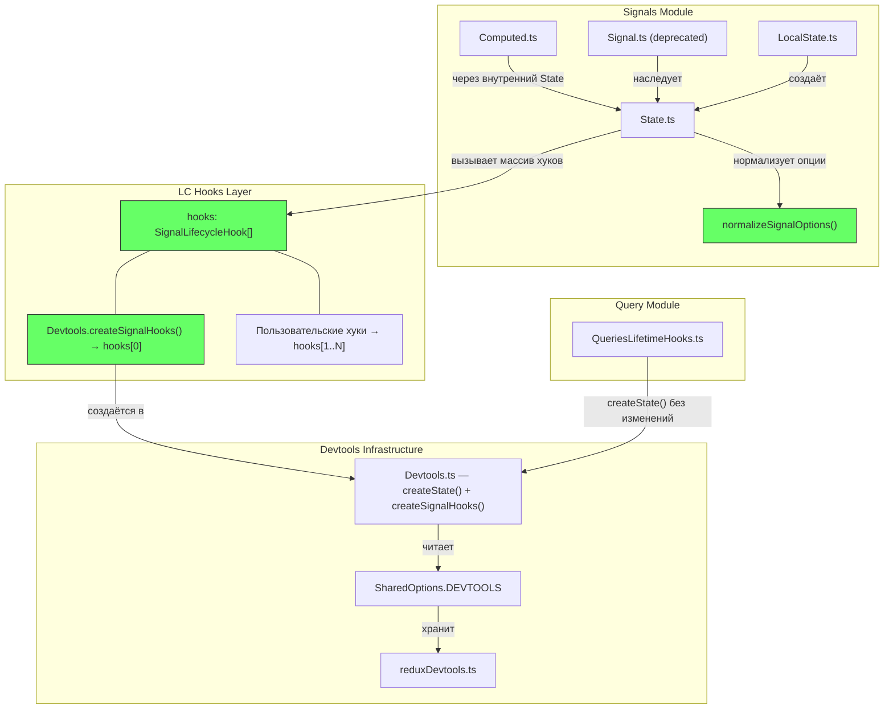
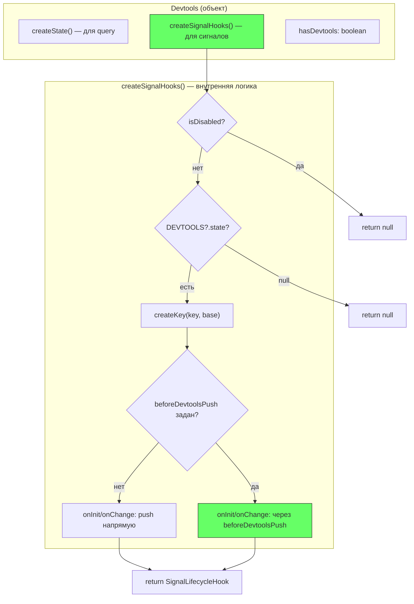
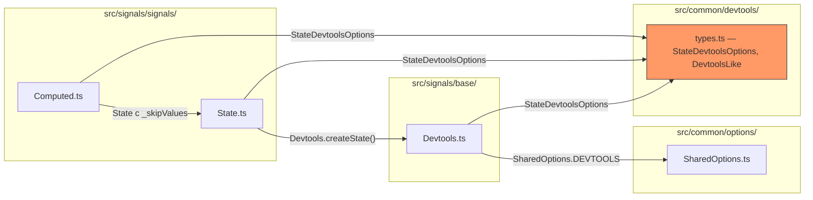
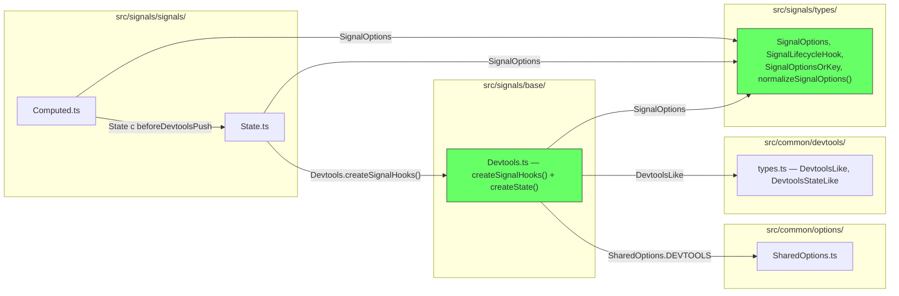
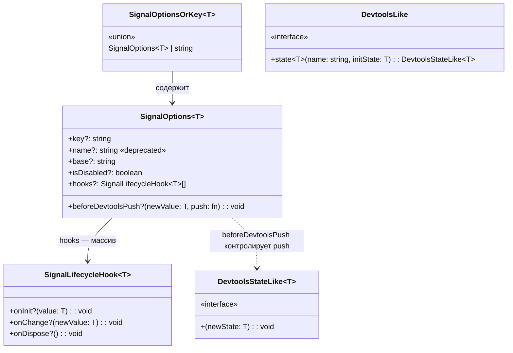

# Архитектура: Signal Devtools Lifecycle Hooks (v3 — Redraft 2)

**Status**: Redraft  
**Дата**: 2026-03-11

---

## 1. Контекст: как фича вписывается в rx-toolkit

rx-toolkit — библиотека реактивных сигналов (State, Computed, Effect) с devtools-интеграцией через Redux DevTools. Текущая архитектура: `State` напрямую вызывает `Devtools.createState()`, который возвращает функцию-push. Lifecycle-события (create, update, GC) обрабатываются разрозненно — нет единой абстракции.

**Цель**: ввести массив LC-хуков (`SignalLifecycleHook[]`), где devtools — один из элементов, создаваемый `Devtools.createSignalHooks()`. Callback `beforeDevtoolsPush` вызывается **внутри** `Devtools.createSignalHooks()` — в том же месте кода, где сейчас `_skipValues?.includes()`.

---

## 2. C4 Level 2 — Контейнеры

### 2.1. AS-IS



### 2.2. TO-BE



---

## 3. C4 Level 3 — Компоненты

### 3.1. Компонент `Devtools`

Объект `Devtools` в `src/signals/base/Devtools.ts` получает **новый метод** `createSignalHooks()`. Старый `createState()` остаётся для query-модуля.



**Ключевой момент**: `beforeDevtoolsPush` вызывается **внутри** `createSignalHooks()` — в `onInit` и `onChange` возвращаемого хука. Это **то самое место** в коде, где `_skipValues?.includes()` стоит сейчас в `createState()`. Никакого отдельного метода `_createMappedHooks()` нет — логика ветвления inline.

### 3.2. Компонент `State`

`State` в конструкторе:
1. `normalizeSignalOptions(options)` → `SignalOptions<T>`
2. `Devtools.createHooks(initialValue, opts)` → `hooks[0]` или null
3. `opts.hooks` → `hooks[1..N]`
4. Итерация `hooks[].onInit(value)`
5. Регистрация в `FinalizationRegistry` если есть `onDispose`

В `set()`: итерация `hooks[].onChange(value)` внутри `Batcher.run()`, затем `bs$.next()`.

### 3.3. Компонент `Computed`

`Computed` передаёт `beforeDevtoolsPush` в опции внутреннего State:

```typescript
beforeDevtoolsPush: (val, push) => {
    if (val !== Computed._EMPTY) push(val);
}
```

Заменяет `_skipValues: [Computed._EMPTY]`.

---

## 4. Границы модулей и ответственности

| Модуль | Ответственность | Изменение |
|--------|----------------|-----------|
| `src/signals/types/` | Типы: `SignalOptions`, `SignalLifecycleHook`, `SignalOptionsOrKey`, утилита `normalizeSignalOptions()` | **Новое** — замена `StateDevtoolsOptions` для сигналов |
| `src/signals/base/Devtools.ts` | `createSignalHooks()` — создание devtools-хука как `SignalLifecycleHook`. `beforeDevtoolsPush` применяется здесь. | **Новый метод**, `createState()` без изменений |
| `src/signals/signals/State.ts` | Массив `_hooks: SignalLifecycleHook[]`, итерация в constructor / set / FR | **Рефакторинг** — `_stateDevtools` → `_hooks[]` |
| `src/signals/signals/Computed.ts` | Передаёт `beforeDevtoolsPush` callback | **Рефакторинг** — `_skipValues` → `beforeDevtoolsPush` |
| `src/common/devtools/types.ts` | `DevtoolsLike`, `DevtoolsStateLike`. Удалить `StateDevtoolsOptions` (не public API). | Удаление внутреннего типа |
| `src/query/` | `Devtools.createState()` для query | **Без изменений** |

---

## 5. Публичный API

### 5.1. `SignalLifecycleHook<T>`

```typescript
interface SignalLifecycleHook<T = any> {
    onInit?: (value: T) => void;
    onChange?: (newValue: T) => void;
    onDispose?: () => void;
}
```

### 5.2. `SignalOptions<T>`

```typescript
interface SignalOptions<T = any> {
    key?: string;
    /** @deprecated use key */
    name?: string;
    base?: string;
    isDisabled?: boolean;
    beforeDevtoolsPush?: (newValue: T, push: (v: T) => void) => void;
    hooks?: SignalLifecycleHook<T>[];
}
```

### 5.3. `SignalOptionsOrKey<T>`

```typescript
type SignalOptionsOrKey<T = any> = SignalOptions<T> | string;
```

### 5.4. `normalizeSignalOptions()`

```typescript
function normalizeSignalOptions<T>(
    options?: SignalOptionsOrKey<T>
): SignalOptions<T> {
    if (!options) return {};
    if (typeof options === 'string') return { key: options };
    if (options.name && !options.key) {
        return { ...options, key: options.name };
    }
    return options;
}
```

Единственная точка нормализации — заменяет тройную нормализацию в State, Computed, Devtools.createState.

### 5.5. `Devtools.createSignalHooks()`

```typescript
createHooks<T>(
    initialValue: T,
    options: SignalOptions<T>,
): SignalLifecycleHook<T> | null
```

Возвращает один `SignalLifecycleHook<T>` или `null`. Внутри — `beforeDevtoolsPush` вызывается в `onInit` и `onChange`, в том же месте кода, где сейчас `_skipValues?.includes()`.

---

## 6. Точки интеграции

### 6.1. State ↔ Devtools

- **Было**: `State.constructor` → `Devtools.createState()` → `DevtoolsStateLike` (функция), хранится в `_stateDevtools`
- **Стало**: `State.constructor` → `Devtools.createSignalHooks()` → `SignalLifecycleHook`, добавляется как `_hooks[0]`

### 6.2. Computed → State

- **Было**: `Computed` → `State.create(value, { _skipValues: [_EMPTY] })`
- **Стало**: `Computed` → `State.create(value, { beforeDevtoolsPush: (v, push) => v !== _EMPTY && push(v) })`

### 6.3. Query → Devtools (без изменений)

`QueriesLifetimeHooks` → `Devtools.createState()` — интерфейс не меняется.

### 6.4. FinalizationRegistry

- **Было**: FR хранит `DevtoolsStateLike`, callback: `heldValue('$COMPLETED' as any)`
- **Стало**: FR хранит `SignalLifecycleHook[]`, callback: итерация `hooks[].onDispose?.()`

---

## 7. Диаграмма зависимостей модулей

### 7.1. Before



### 7.2. After



**Изменения**:
- `State`, `Computed` импортируют из `src/signals/types/` вместо `src/common/devtools/types.ts`
- `Devtools.ts` импортирует `SignalOptions` из `src/signals/types/` для `createSignalHooks()`
- `StateDevtoolsOptions` удаляется из `src/common/devtools/types.ts` (не public API — не breaking change)
- `Devtools.ts` сохраняет локальный тип для `createState()` (query)

---

## 8. Иерархия типов


