# Потоки данных: Signal Devtools Lifecycle Hooks

**Status**: Draft  
**Дата**: 2026-03-11

---

## 1. Обзор lifecycle событий

Сигнал проходит через три ключевых lifecycle-события. Каждое событие проходит через merged LC-хуки (devtools + user):

| Событие | Когда | LC-хук | Контекст выполнения |
|---------|-------|--------|---------------------|
| **Init** | Конструктор State | `onInit(value)` | Синхронно в конструкторе |
| **Change** | `State.set(value)` | `onChange(newValue)` | Внутри `Batcher.run()` |
| **Dispose** | FinalizationRegistry / GC | `onDispose()` | В микрозадаче GC callback |

---

## 2. Диаграмма состояний жизненного цикла сигнала

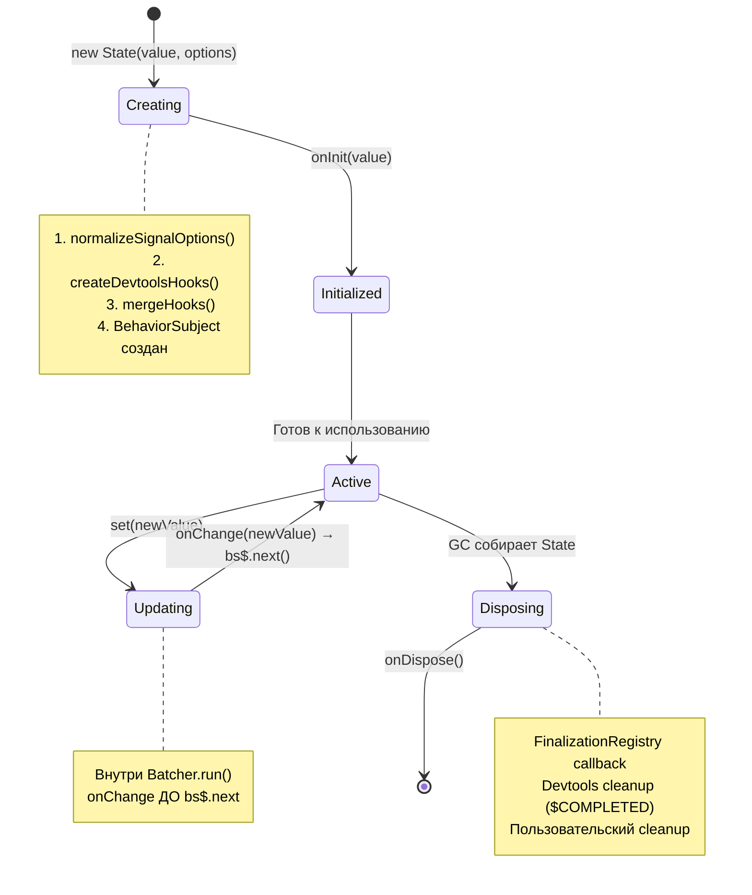

---

## 3. Поток создания State с devtools-хуками

### 3.1. Sequence-диаграмма: `State.create(value, options)`

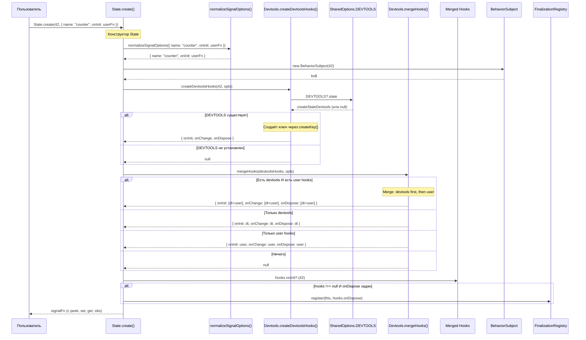

### 3.2. Как devtools-хуки создаются внутри `createDevtoolsHooks`

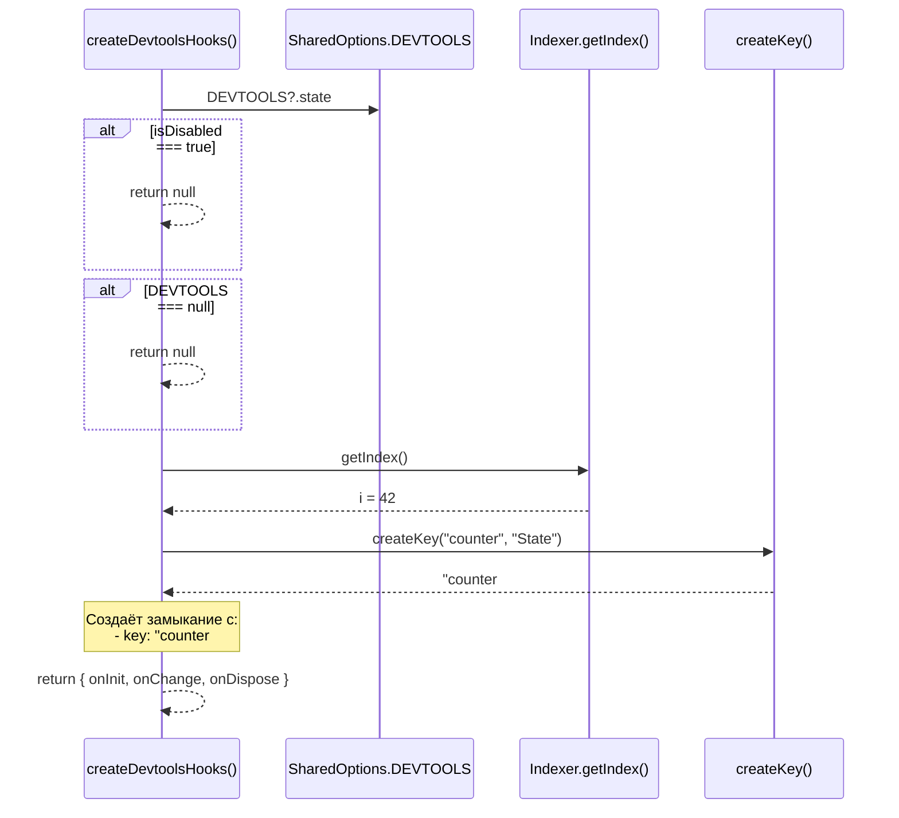

---

## 4. Поток обновления State (`set()`)

### 4.1. Sequence-диаграмма: `state.set(newValue)`

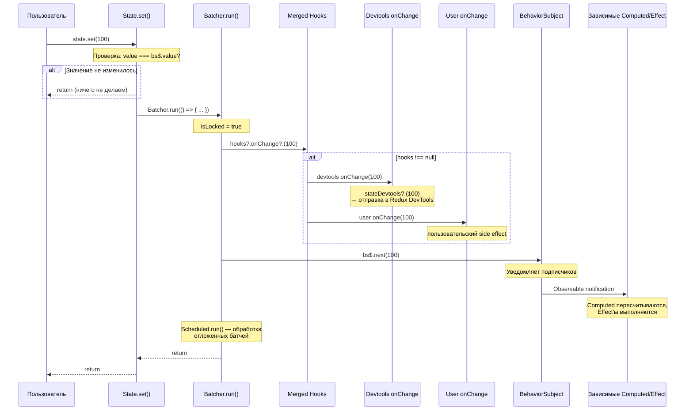

### 4.2. Порядок операций внутри Batcher

Важно: `onChange` хук вызывается **внутри** `Batcher.run()`, но **до** `bs$.next()`.

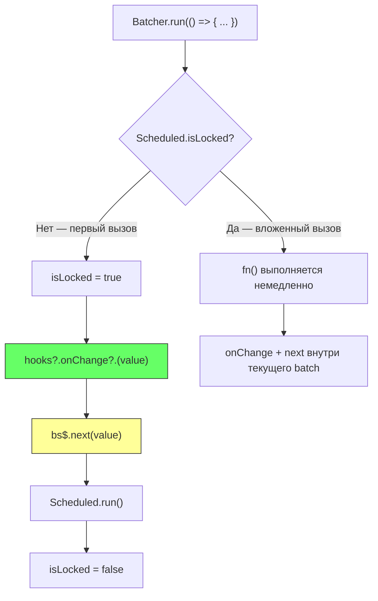

Это гарантирует:
1. Devtools получают значение **до** уведомления подписчиков
2. При каскадных обновлениях (Computed → Effect → State.set) все onChange батчатся вместе
3. Devtools видят последовательность изменений в правильном порядке

---

## 5. Поток Computed с фильтрацией devtools (замена `_skipValues`)

### 5.1. Как Computed создаёт State с `devtoolsOnChange`

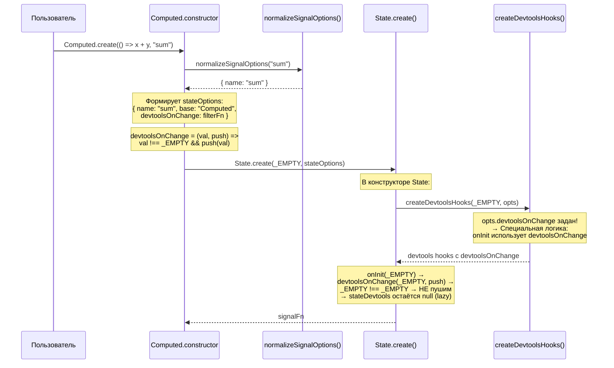

### 5.2. Обновление Computed — фильтрация `_EMPTY`

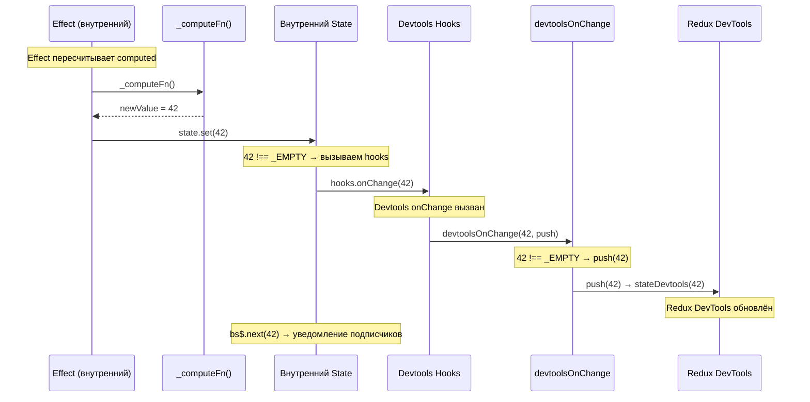

### 5.3. Сравнение: старая vs новая фильтрация

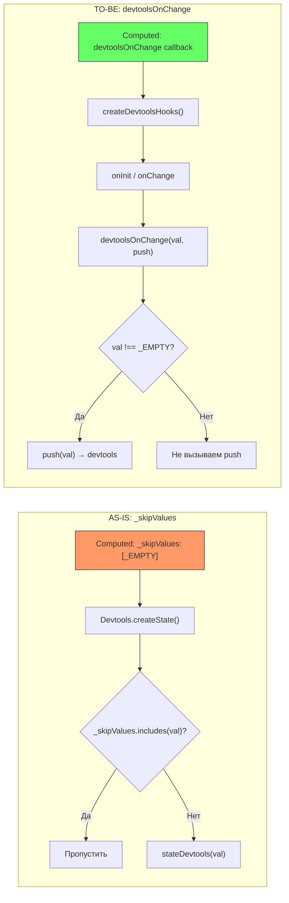

**Преимущества нового подхода**:
- Нет `any[]` в публичном типе
- Computed контролирует логику фильтрации, не передавая «magic values»
- `devtoolsOnChange` — расширяемый: пользователь может трансформировать данные перед отправкой в devtools

---

## 6. Поток GC/Dispose через `onDispose`

### 6.1. Sequence-диаграмма: FinalizationRegistry → onDispose

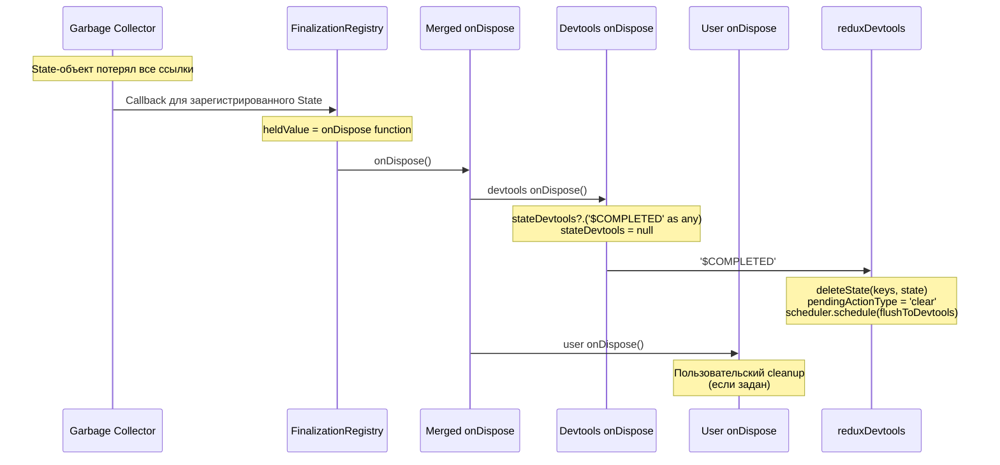

### 6.2. Сравнение: старая vs новая GC-обработка

| Аспект | AS-IS | TO-BE |
|--------|-------|-------|
| Что хранится в FR | `DevtoolsStateLike` (функция) | `onDispose` callback |
| Как cleanup | `heldValue('$COMPLETED' as any)` | `onDispose()` → внутри `stateDevtools?.('$COMPLETED')` |
| Magic string | В `State.ts` | Инкапсулирован в `createDevtoolsHooks` |
| `as any` | В `State.ts` (публичный код) | Только внутри `Devtools.ts` |
| Расширяемость | Только devtools cleanup | Devtools + пользовательский cleanup |

---

## 7. Поток merge хуков

### 7.1. Алгоритм `mergeHooks()`

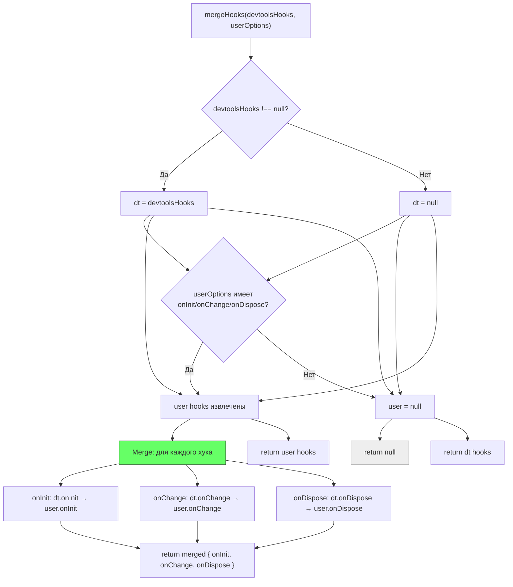

### 7.2. Порядок вызова при merge

```
merged.onInit(value):
  1. devtoolsHooks.onInit(value)     // devtools регистрация
  2. userOptions.onInit(value)        // пользовательский callback

merged.onChange(newValue):
  1. devtoolsHooks.onChange(newValue) // devtools обновление
  2. userOptions.onChange(newValue)    // пользовательский callback

merged.onDispose():
  1. devtoolsHooks.onDispose()       // devtools cleanup ($COMPLETED)
  2. userOptions.onDispose()          // пользовательский cleanup
```

**Обоснование порядка**: devtools first — чтобы логгирование и cleanup происходили прежде пользовательских side effects.

### 7.3. Оптимизация: null-short-circuit

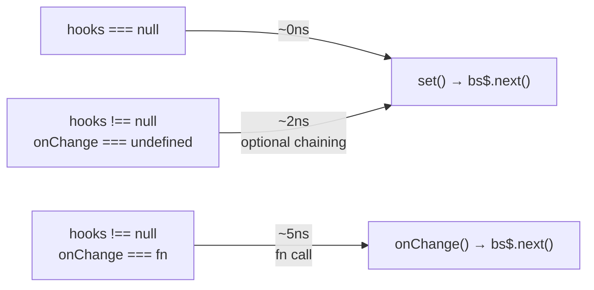

Когда хуки не заданы (`_hooks === null`), overhead = 0. При наличии хуков optional chaining `?.` добавляет ~2ns (см. [исследование производительности](../01-research/02-external-research.md)).

---

## 8. Полный lifecycle — сквозной поток

### 8.1. Сквозная sequence-диаграмма: создание → обновления → GC

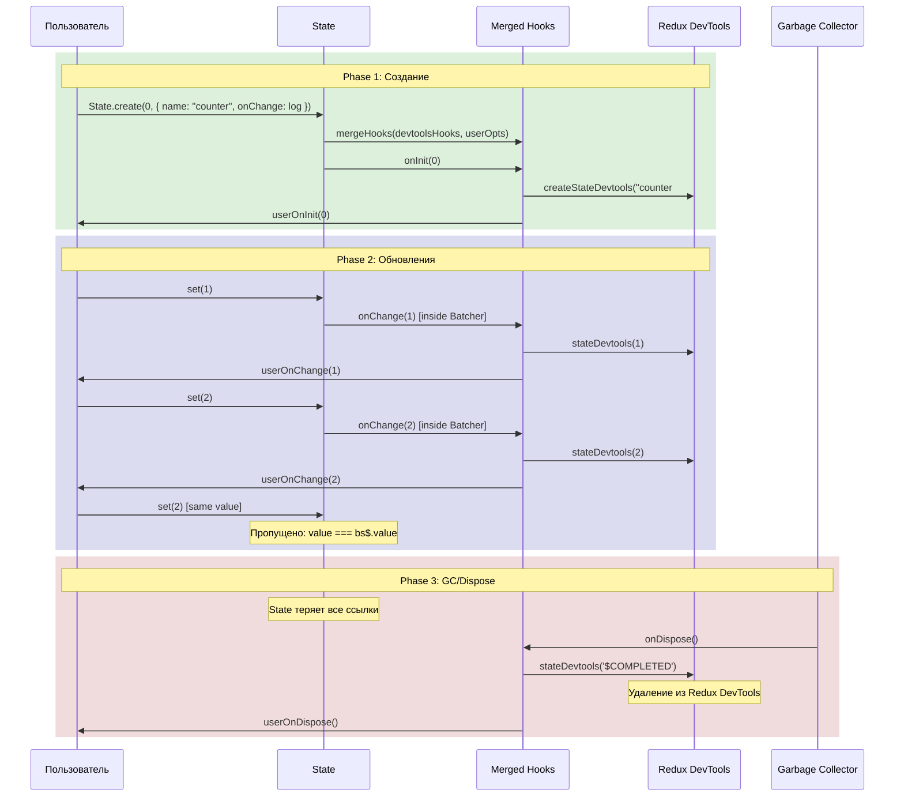

---

## 9. Потоки данных в контексте Batcher

### 9.1. Батчинг нескольких State.set() в одном цикле

```mermaid
sequenceDiagram
    participant User as Пользователь
    participant Batcher as Batcher
    participant S1 as State A
    participant S2 as State B
    participant H1 as Hooks A
    participant H2 as Hooks B
    participant Computed as Computed C (зависит от A и B)

    User->>Batcher: Batcher.run(() => { a.set(1); b.set(2); })

    Note over Batcher: isLocked = true

    Batcher->>S1: a.set(1)
    Note over S1: value !== bs$.value
    S1->>Batcher: Batcher.run() [вложенный]
    Note over Batcher: isLocked === true → fn() немедленно
    S1->>H1: hooks.onChange(1)
    Note over H1: devtools(1) → user(1)
    S1->>S1: bs$.next(1)
    Note over S1: Computed C scheduled

    Batcher->>S2: b.set(2)
    S2->>Batcher: Batcher.run() [вложенный]
    S2->>H2: hooks.onChange(2)
    Note over H2: devtools(2) → user(2)
    S2->>S2: bs$.next(2)
    Note over S2: Computed C scheduled (already)

    Note over Batcher: Scheduled.run()
    Batcher->>Computed: Пересчёт C
    Note over Computed: C.onChange(newVal) через внутренний State

    Note over Batcher: isLocked = false
```

### 9.2. Как devtools видят батчированные обновления

В контексте Batcher devtools получают **каждое** изменение отдельно (не агрегированно). Это совпадает с текущим поведением — `devtoolsOnChange` вызывается для каждого `set()`, даже внутри batch.

Порядок в Redux DevTools при батче `{ a.set(1); b.set(2); }`:
1. `State A#i=0: 1`
2. `State B#i=1: 2`
3. `Computed C#i=2: newComputedValue`

---

## 10. Специальные потоки

### 10.1. State без devtools (isDisabled: true)

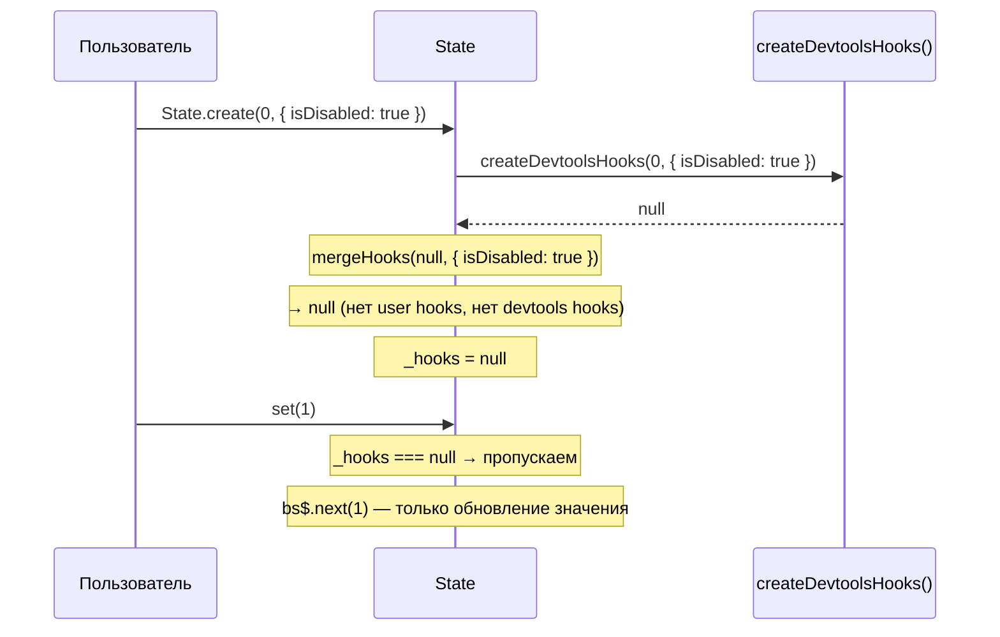

### 10.2. State без глобальных devtools (DEVTOOLS не установлен)

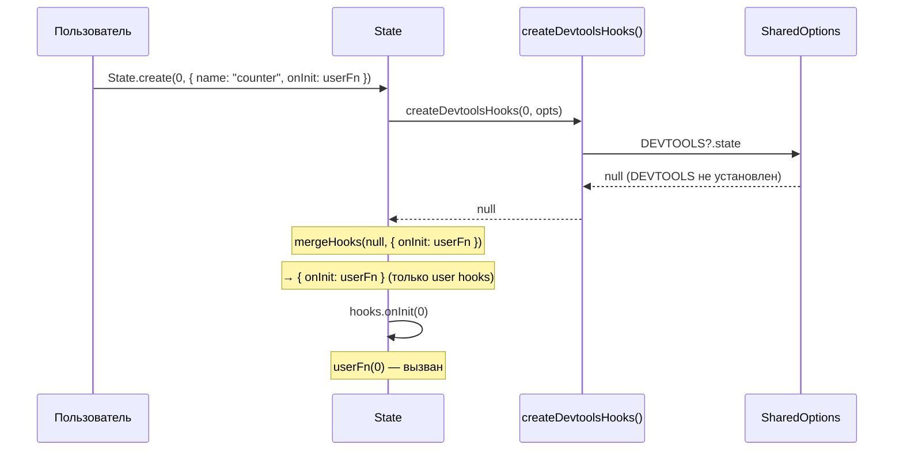

### 10.3. LocalState — цепочка через Computed

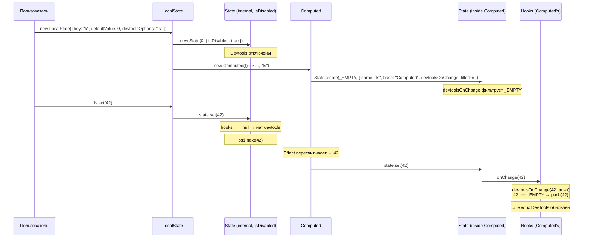

---

## 11. Сводка потоков и зон ответственности

| Поток | Инициатор | Контекст выполнения | LC-хуки |
|-------|-----------|---------------------|---------|
| Создание State | `new State()` | Синхронно, конструктор | `onInit` |
| Обновление State | `State.set()` | Внутри `Batcher.run()` | `onChange` |
| Обновление Computed | Effect → `State.set()` | Внутри `Batcher.run()` | `onChange` (с `devtoolsOnChange` фильтрацией) |
| GC State | `FinalizationRegistry` | Микрозадача GC | `onDispose` |
| Merge хуков | `State.constructor` | Синхронно, конструктор | Все три |
| Devtools фабрика | `createDevtoolsHooks()` | Синхронно, внутри конструктора | Создаёт devtools LC-хуки |
| Query devtools | `QueriesLifetimeHooks` | Async (через subscribe) | **Не LC-хуки** — прямой `Devtools.createState()` |
