# Потоки данных: Signal Devtools Lifecycle Hooks (v3 — Redraft 2)

**Status**: Redraft  
**Дата**: 2026-03-11

---

## 1. Lifecycle-события

| Событие | Когда | Метод хука | Контекст |
|---------|-------|------------|----------|
| **Init** | Конструктор State | `onInit(value)` | Синхронно |
| **Change** | `State.set(value)` | `onChange(newValue)` | Внутри `Batcher.run()` |
| **Dispose** | FinalizationRegistry / GC | `onDispose()` | Микрозадача GC callback |

---

## 2. Жизненный цикл сигнала

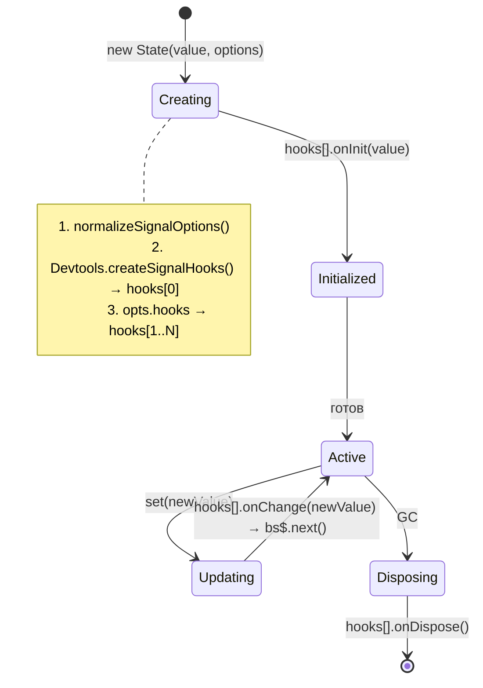

---

## 3. Создание State

`Devtools.createSignalHooks()` создаёт один хук, который **prepend**-ится в массив hooks. Пользовательские хуки идут после.

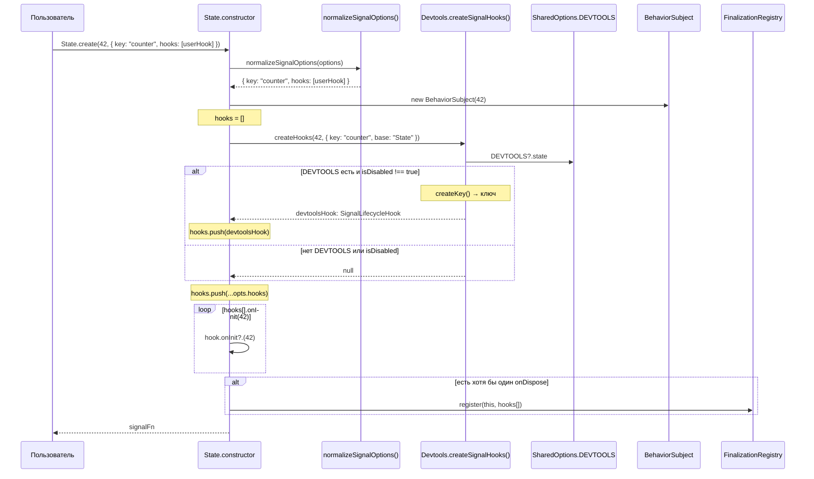

---

## 4. Внутри `Devtools.createSignalHooks()` — `beforeDevtoolsPush`

`beforeDevtoolsPush` вызывается **в том же месте**, где сейчас `_skipValues?.includes()` — внутри `onInit` и `onChange` возвращаемого хука. Нет отдельного метода — логика inline.

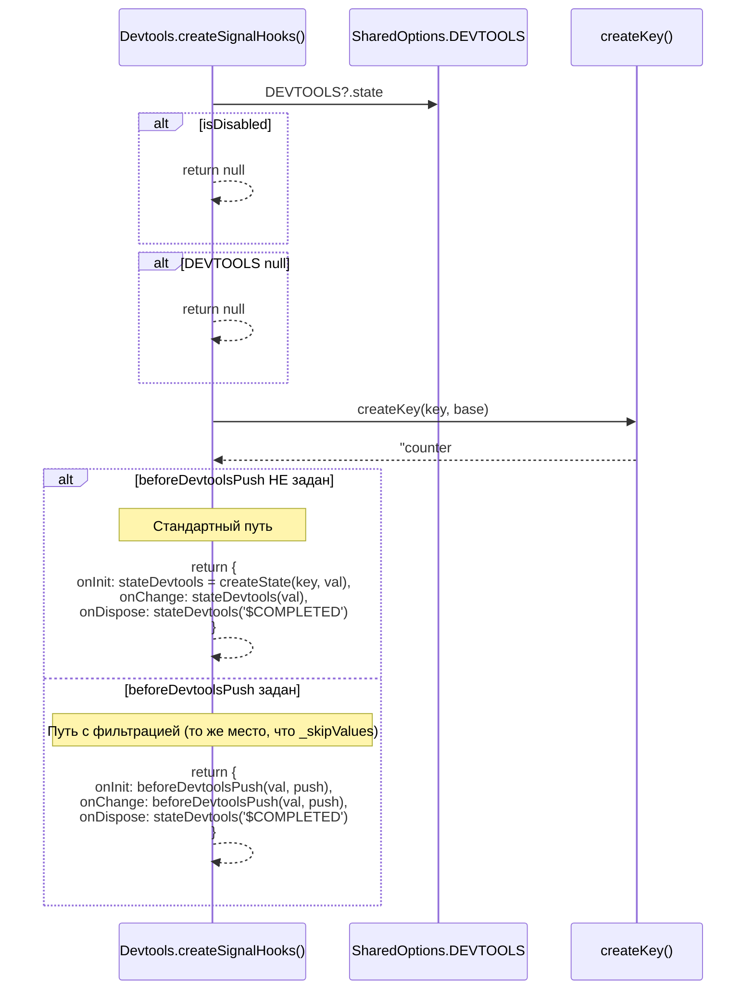

### Сравнение: где именно вызывается

**AS-IS** — `createState()`, строки 20-25:
```typescript
let stateDevtools =
    options._skipValues?.includes(initialValue)  // ← ЭТО МЕСТО (onInit)
        ? null
        : createStateDevtools<T>(key, initialValue)

return (newState: T) => {
    if (options._skipValues?.includes(newState)) {  // ← ЭТО МЕСТО (onChange)
        return;
    }
```

**TO-BE** — `createSignalHooks()`, тот же участок кода в `onInit` и `onChange`:
```typescript
onInit(value: T) {
    beforeDevtoolsPush(value, (v) => {            // ← ТО ЖЕ МЕСТО
        stateDevtools = createStateDevtools(key, v);
    });
},
onChange(newValue: T) {
    beforeDevtoolsPush(newValue, (v) => {          // ← ТО ЖЕ МЕСТО
        if (!stateDevtools) {
            stateDevtools = createStateDevtools(key, v);
            return;
        }
        stateDevtools(v);
    });
},
```

---

## 5. `State.set()` — обновление через массив хуков

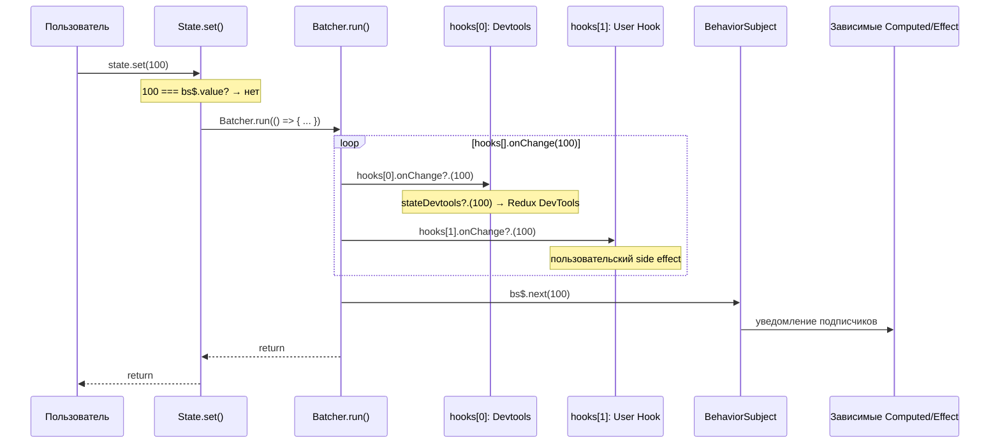

Порядок: все `onChange` хуки вызываются **внутри** `Batcher.run()`, **до** `bs$.next()`.

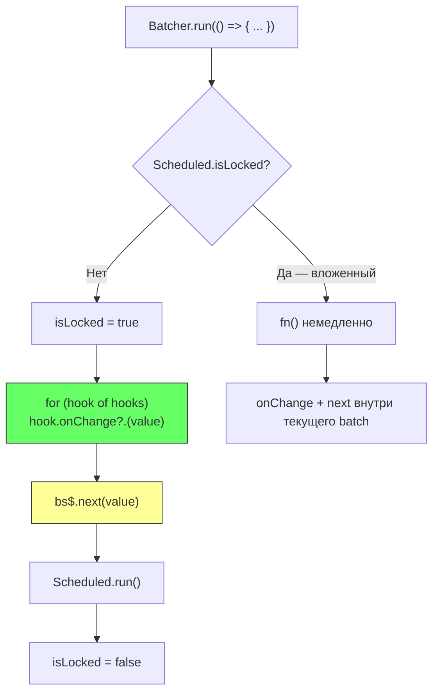

---

## 6. Computed — `beforeDevtoolsPush` фильтрует `_EMPTY`

### 6.1. Создание Computed → State с `beforeDevtoolsPush`

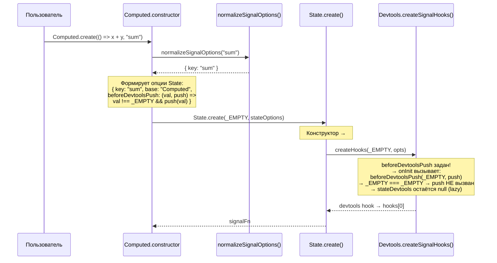

### 6.2. Обновление Computed — `_EMPTY` отфильтрован

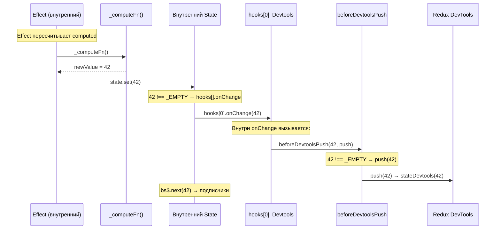

### 6.3. AS-IS vs TO-BE

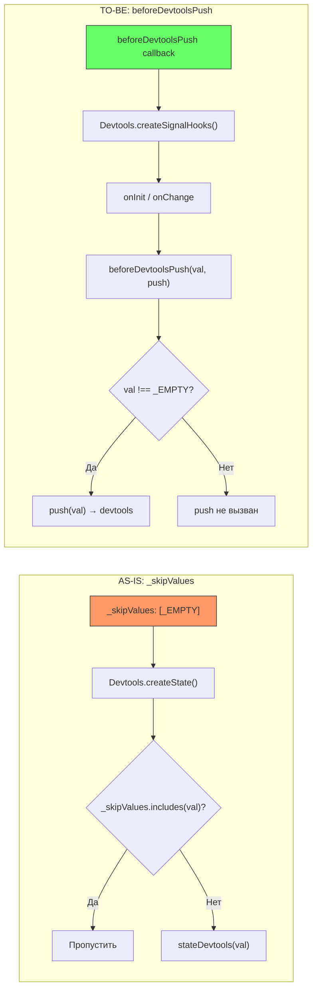

---

## 7. GC / Dispose через массив хуков

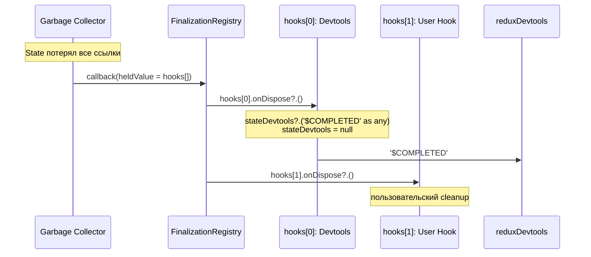

| Аспект | AS-IS | TO-BE |
|--------|-------|-------|
| Хранится в FR | `DevtoolsStateLike` (функция) | `SignalLifecycleHook[]` (массив) |
| Cleanup | `heldValue('$COMPLETED' as any)` | Итерация `hooks[].onDispose?.()` |
| Magic string `$COMPLETED` | В `State.ts` | Инкапсулирована в `Devtools.ts` |
| `as any` | В `State.ts` | Только внутри `Devtools.ts` |
| Расширяемость | Только devtools | Devtools + пользовательские хуки |

---

## 8. Полный цикл: создание → обновление → GC

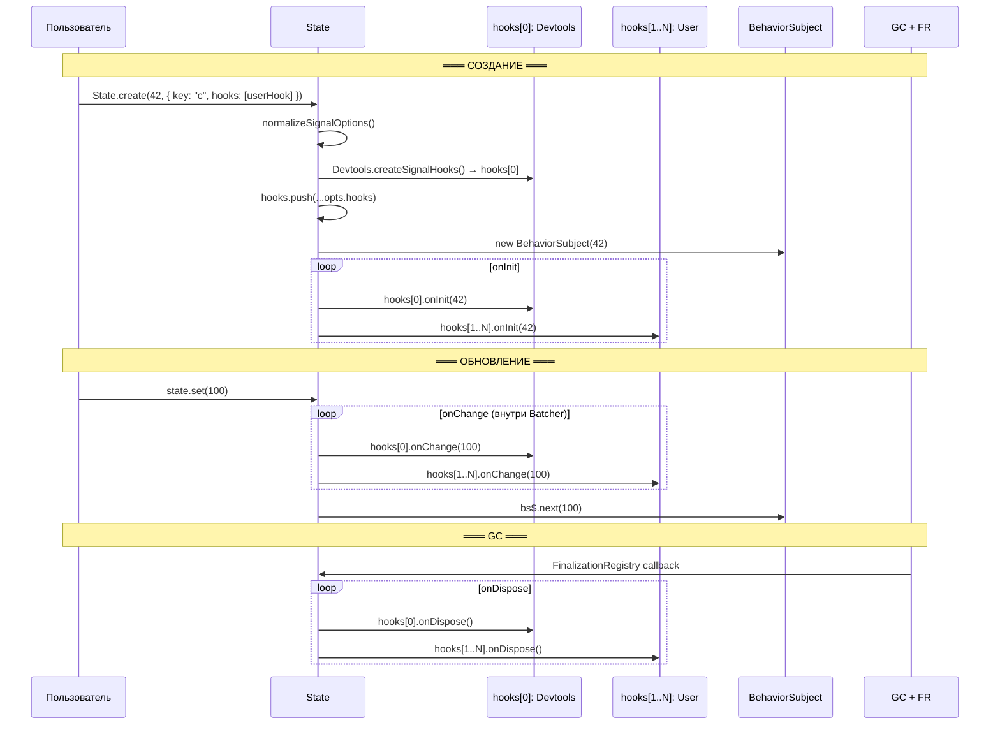

---

## 9. Query — без изменений

Query-модуль продолжает использовать `Devtools.createState()` напрямую. Массив LC-хуков не затрагивает этот путь:

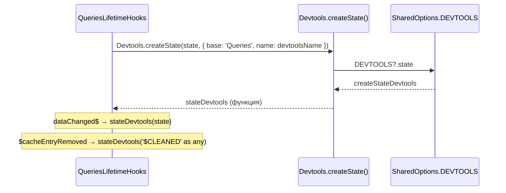

`createState()` сохраняется с текущей сигнатурой. Замена типа на `SignalOptions` не требуется.
