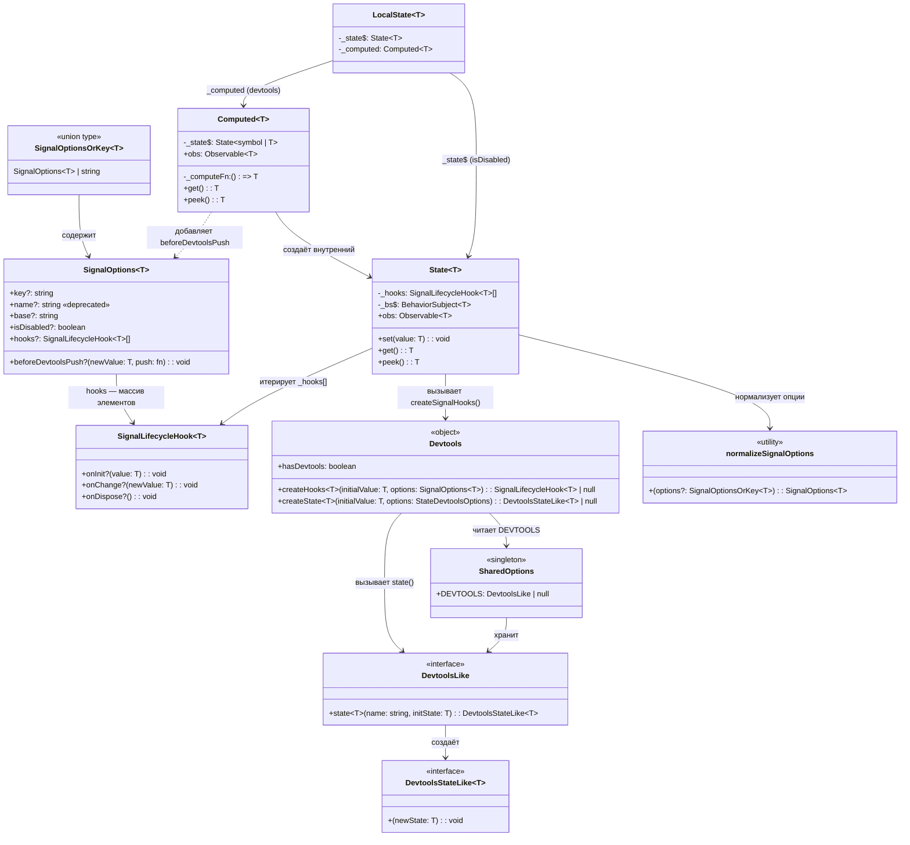
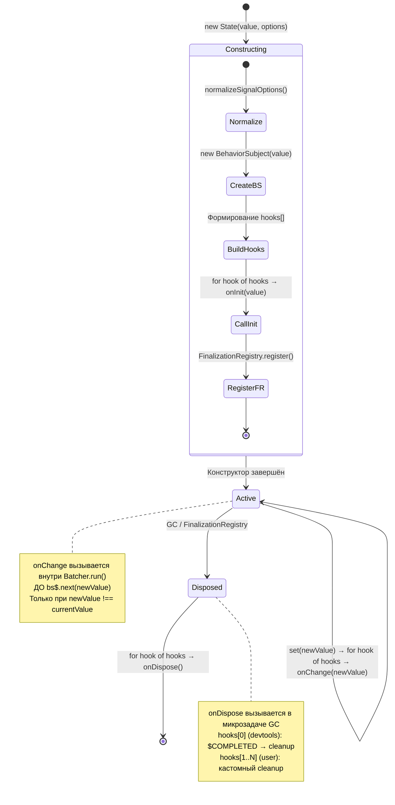

# Доменная модель: Signal Devtools Lifecycle Hooks (v3 — Redraft 2)

**Status**: Redraft  
**Дата**: 2026-03-11

---

## 1. Ключевые сущности и их взаимосвязи

### 1.1. Обзор доменной модели

Доменная модель описывает систему lifecycle-хуков для сигналов с поддержкой devtools. Центральная идея — **массив наборов LC-хуков** (`hooks: SignalLifecycleHook<T>[]`), где devtools-хук занимает позицию `hooks[0]`, а пользовательские хуки — `hooks[1..N]`.

| Сущность | Ответственность |
|----------|----------------|
| **SignalLifecycleHook\<T\>** | Один набор LC-callbacks (onInit, onChange, onDispose) — элемент массива |
| **SignalOptions\<T\>** | Конфигурация сигнала: `key`, devtools-настройки, массив хуков, `devtoolsMapValue` |
| **SignalOptionsOrKey\<T\>** | Union-тип: строка-shorthand (`{ key: string }`) или полный объект |
| **Devtools** | Объект с методами `createSignalHooks()` (для сигналов) и `createState()` (для query) |
| **DevtoolsLike** | Абстракция devtools-провайдера (Redux DevTools, custom и т.д.) |
| **DevtoolsStateLike** | Функция отправки обновлений в конкретный devtools-экземпляр |
| **State** | Основной state-сигнал, потребитель массива LC-хуков |
| **Computed** | Производный сигнал, использует `devtoolsMapValue` для фильтрации `_EMPTY` |

---

## 2. TypeScript-определения интерфейсов

### 2.1. SignalLifecycleHook\<T\>

Один набор lifecycle-хуков. Один элемент массива `hooks[]` в `SignalOptions`:

```typescript
/**
 * Набор lifecycle-хуков для сигнала.
 * Один элемент массива hooks в SignalOptions.
 */
interface SignalLifecycleHook<T = any> {
    /** Вызывается при создании сигнала (синхронно в конструкторе) */
    onInit?: (value: T) => void;
    /** Вызывается при каждом изменении значения */
    onChange?: (newValue: T) => void;
    /** Вызывается при GC/dispose сигнала (FinalizationRegistry callback) */
    onDispose?: () => void;
}
```

### 2.2. SignalOptions\<T\>

Центральный тип конфигурации сигнала. `hooks` — массив наборов LC-хуков. `devtoolsMapValue` — отдельная настройка, применяемая внутри `Devtools.createSignalHooks()`:

```typescript
/**
 * Опции сигнала с lifecycle hooks и настройками devtools.
 */
interface SignalOptions<T = any> {
    /** Уникальный ключ сигнала для devtools */
    key?: string;
    /** @deprecated use key */
    name?: string;
    /** Базовый префикс для ключа devtools (State, Computed и т.д.) */
    base?: string;
    /** Отключить devtools для этого сигнала */
    isDisabled?: boolean;
    /** Кастомизация значений перед отправкой в devtools (замена _skipValues) */
    beforeDevtoolsPush?: (newValue: T, push: (v: T) => void) => void;
    /** Массив наборов lifecycle-хуков */
    hooks?: SignalLifecycleHook<T>[];
}
```

### 2.3. SignalOptionsOrKey\<T\>

Удобный union для API сигналов — строка интерпретируется как `{ key: string }`:

```typescript
type SignalOptionsOrKey<T = any> = SignalOptions<T> | string;
```

### 2.4. DevtoolsLike

Абстракция devtools-провайдера. Определена в `src/common/devtools/types.ts` — **без изменений**:

```typescript
interface DevtoolsLike {
    state<T>(name: string, initState: T): DevtoolsStateLike<T>;
}
```

### 2.5. DevtoolsStateLike\<T\>

Функция отправки обновлений состояния в devtools. Определена в `src/common/devtools/types.ts` — **без изменений**:

```typescript
interface DevtoolsStateLike<T = any> {
    (newState: T): void;
}
```

---

## 3. Диаграмма классов доменной модели



---

## 4. Утилита нормализации

### 4.1. `normalizeSignalOptions()`

Определяется в `src/signals/types/options.types.ts`:

```typescript
function normalizeSignalOptions<T>(
    options?: SignalOptionsOrKey<T>
): SignalOptions<T> {
    if (!options) return {};
    if (typeof options === 'string') return { key: options };
    if (options.name && !options.key) {
        return { ...options, key: options.name };
    }
    return options;
}
```

**Единственная точка нормализации** — заменяет тройную нормализацию в State, Computed, Devtools.createState.

### 4.2. Где вызывается

| Потребитель | Где вызывает | Что получает |
|-------------|-------------|--------------|
| `State.constructor` | Первая строка конструктора | `SignalOptions<T>` — для сборки массива хуков |
| `Computed.constructor` | Перед созданием внутреннего State | `SignalOptions<T>` — добавляет `beforeDevtoolsPush` и передаёт в State |
| `Signal.state()` / `Signal.compute()` | Проксирует в State/Computed | Без изменений — проксирует `SignalOptionsOrKey` |
| `LocalState.constructor` | Проксирует в Computed | Без изменений |
| `Devtools.createState()` | **Не меняется** — query-модуль продолжает использовать | Внутренняя нормализация остаётся |

---

## 5. Архитектура массива LC-хуков

### 5.1. Формирование массива hooks[] в State

State собирает финальный массив хуков в конструкторе. Devtools-хук **всегда первый**:

```typescript
// State.constructor (псевдокод)
const opts = normalizeSignalOptions(options);

const hooks: SignalLifecycleHook<T>[] = [];

// 1. Devtools-хук → hooks[0]
const devtoolsHook = Devtools.createHooks(initialValue, {
    ...opts,
    base: 'State',
});
if (devtoolsHook) hooks.push(devtoolsHook);

// 2. Пользовательские хуки → hooks[1..N]
if (opts.hooks) hooks.push(...opts.hooks);

this._hooks = hooks.length > 0 ? hooks : null;
```

### 5.2. Devtools.createSignalHooks() — метод объекта Devtools

Создаёт один `SignalLifecycleHook` — элемент массива. `beforeDevtoolsPush` вызывается **внутри** `onInit` и `onChange` — в том же месте кода, где сейчас `_skipValues?.includes()`:

```typescript
export const Devtools = {
    // legacy — для query-модуля
    createState<T>(initialValue: T, optionsDry: StateDevtoolsOptions = {}) {
        // ... без изменений ...
    },

    createHooks<T>(
        initialValue: T,
        options: SignalOptions<T>,
    ): SignalLifecycleHook<T> | null {
        if (options.isDisabled) return null;

        const createStateDevtools = SharedOptions.DEVTOOLS?.state;
        if (!createStateDevtools) return null;

        const key = createKey(options.key, options.base);
        let stateDevtools: DevtoolsStateLike<T> | null = null;
        const beforePush = options.beforeDevtoolsPush;

        // С beforeDevtoolsPush — push-based стратегия (lazy init)
        // Вызывается В ТОМ ЖЕ МЕСТЕ, где _skipValues?.includes()
        if (beforePush) {
            const push = (v: T) => {
                if (!stateDevtools) {
                    stateDevtools = createStateDevtools<T>(key, v);
                } else {
                    stateDevtools(v);
                }
            };
            return {
                onInit(value: T) { beforePush(value, push); },
                onChange(newValue: T) { beforePush(newValue, push); },
                onDispose() {
                    stateDevtools?.('$COMPLETED' as any);
                    stateDevtools = null;
                },
            };
        }

        // Без beforeDevtoolsPush — прямой push
        return {
            onInit(value: T) {
                stateDevtools = createStateDevtools<T>(key, value);
            },
            onChange(newValue: T) {
                stateDevtools?.(newValue);
            },
            onDispose() {
                stateDevtools?.('$COMPLETED' as any);
                stateDevtools = null;
            },
        };
    },

    get hasDevtools() {
        return !!SharedOptions.DEVTOOLS?.state;
    },
};
```

### 5.3. Вызов хуков из массива

State итерирует массив для каждого события:

```typescript
// State.constructor — onInit
for (const hook of this._hooks) {
    hook.onInit?.(value);
}

// State.set() — onChange
for (const hook of this._hooks) {
    hook.onChange?.(newValue);
}

// FinalizationRegistry — onDispose
for (const hook of hooks) {
    hook.onDispose?.();
}
```

---

## 6. Инварианты данных и бизнес-правила

### 6.1. Инварианты SignalOptions

| # | Инвариант | Обеспечивается |
|---|-----------|----------------|
| I-1 | `key` поддерживает плейсхолдеры `{base}` и `{scope}` | `createKey()` в `Devtools.ts` |
| I-2 | `name` → `key` при нормализации (обратная совместимость) | `normalizeSignalOptions()` |
| I-3 | Если `isDisabled === true`, devtools-хук **НЕ** создаётся | `Devtools.createSignalHooks()` возвращает `null` |
| I-4 | `beforeDevtoolsPush` — **не** LC-хук; влияет только на devtools-вывод | Применяется только внутри `Devtools.createSignalHooks()` |
| I-5 | `hooks[]` — массив; пользователь передаёт свои наборы хуков через него | Типизация `SignalLifecycleHook<T>[]` |
| I-6 | `SignalOptionsOrKey<T>` строка эквивалентна `{ key: string }` | `normalizeSignalOptions()` |
| I-7 | `base` устанавливается автоматически (State/Computed) и не задаётся пользователем | Конструкторы State/Computed |

### 6.2. Инварианты массива hooks[]

| # | Инвариант | Обеспечивается |
|---|-----------|----------------|
| H-1 | Devtools-хук — всегда `hooks[0]` (если существует) | Формирование массива в `State.constructor` |
| H-2 | Пользовательские хуки — `hooks[1..N]` | `opts.hooks` добавляются после devtools |
| H-3 | `_hooks` = `null`, если массив пуст (нет ни devtools, ни пользовательских) | Guard `hooks.length > 0 ? hooks : null` |
| H-4 | `onInit` каждого элемента вызывается ровно 1 раз — в конструкторе State | `State.constructor` |
| H-5 | `onChange` вызывается для каждого элемента при **изменении** значения (`!==`) | Guard в `State.set()` |
| H-6 | `onDispose` каждого элемента вызывается не более 1 раза — через `FinalizationRegistry` | Регистрация один раз в конструкторе |
| H-7 | Порядок итерации — всегда прямой (от `hooks[0]` к `hooks[N]`) | `for...of` loop |

### 6.3. Инварианты Devtools-интеграции

| # | Инвариант | Обеспечивается |
|---|-----------|----------------|
| D-1 | Devtools-хук создаётся **только** при наличии `SharedOptions.DEVTOOLS` | Проверка в `Devtools.createSignalHooks()` |
| D-2 | `$COMPLETED` отправляется **только** внутри devtools `onDispose` | Инкапсуляция в `Devtools.createSignalHooks()` |
| D-3 | При `beforeDevtoolsPush` — devtools-значение контролируется вызывающим (push-based) | `Devtools.createSignalHooks()` создаёт push-обёртку |
| D-4 | `Devtools.createState()` сохранён — query-модуль работает без изменений | Отдельный метод объекта `Devtools` |
| D-5 | Каждый devtools-экземпляр получает уникальный ключ через `Indexer` | `createKey()` + `Indexer.getIndex()` |
| D-6 | `beforeDevtoolsPush` применяется **внутри** devtools-хука, не влияет на остальные хуки | Замкнут внутри `Devtools.createSignalHooks()` |

### 6.4. Бизнес-правила нормализации

| # | Правило | Пример |
|---|---------|--------|
| N-1 | `undefined` → `{}` | `normalizeSignalOptions()` → `{}` |
| N-2 | `string` → `{ key: string }` | `normalizeSignalOptions('counter')` → `{ key: 'counter' }` |
| N-3 | `object` → pass-through (+ `name` → `key` миграция) | `normalizeSignalOptions({ name: 'x' })` → `{ name: 'x', key: 'x' }` |
| N-4 | Нормализация — однократная, на входе в State/Computed | Единая точка вызова |

---

## 7. Маппинг lifecycle-хуков на состояния сигнала

### 7.1. Диаграмма состояний с привязкой к хукам



### 7.2. Маппинг хуков на операции State

| Операция State | Итерация массива | Момент вызова | Контекст |
|----------------|-----------------|---------------|----------|
| `constructor(value, options)` | `hooks[].onInit(value)` | После создания `BehaviorSubject`, до FR.register | Синхронно |
| `set(newValue)` | `hooks[].onChange(newValue)` | Внутри `Batcher.run()`, перед `bs$.next()` | Синхронно, в batch |
| GC собирает State | `hooks[].onDispose()` | `FinalizationRegistry` callback | Асинхронно, микрозадача |

### 7.3. Маппинг для Computed

Computed не имеет собственного массива хуков — он делегирует всё внутреннему State:

| Операция Computed | Что происходит в State | Влияние beforeDevtoolsPush |
|-------------------|----------------------|----------------------------|
| `constructor(fn, options)` | `State.create(_EMPTY, opts)` | `beforeDevtoolsPush(_EMPTY, push)` → **не пушит** (фильтрация) |
| Первое вычисление (`_start`) | `state.set(computedValue)` | `beforeDevtoolsPush(value, push)` → **пушит** (lazy init devtools) |

---

## 8. Связь с существующими типами

| Старый тип | Новый тип | Изменение |
|------------|-----------|-----------|
| `StateDevtoolsOptions` | `SignalOptionsOrKey<T>` | Полная замена |
| `StateDevtoolsOptions._skipValues` | `SignalOptions.beforeDevtoolsPush` | Приватный хак → публичный callback |
| `StateDevtoolsOptions.name` | `SignalOptions.key` + `name` (deprecated) | Переименование с обратной совместимостью |
| — (нет) | `SignalLifecycleHook<T>` | Новый тип — один набор хуков |
| — (нет) | `SignalOptions.hooks` | Массив наборов LC-хуков |
| — (нет) | `Devtools.createSignalHooks()` (method) | Новый метод объекта Devtools |
