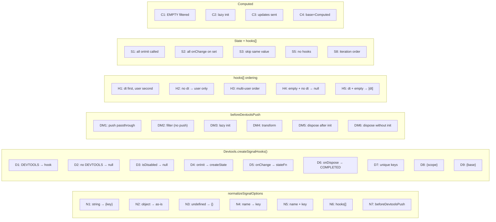
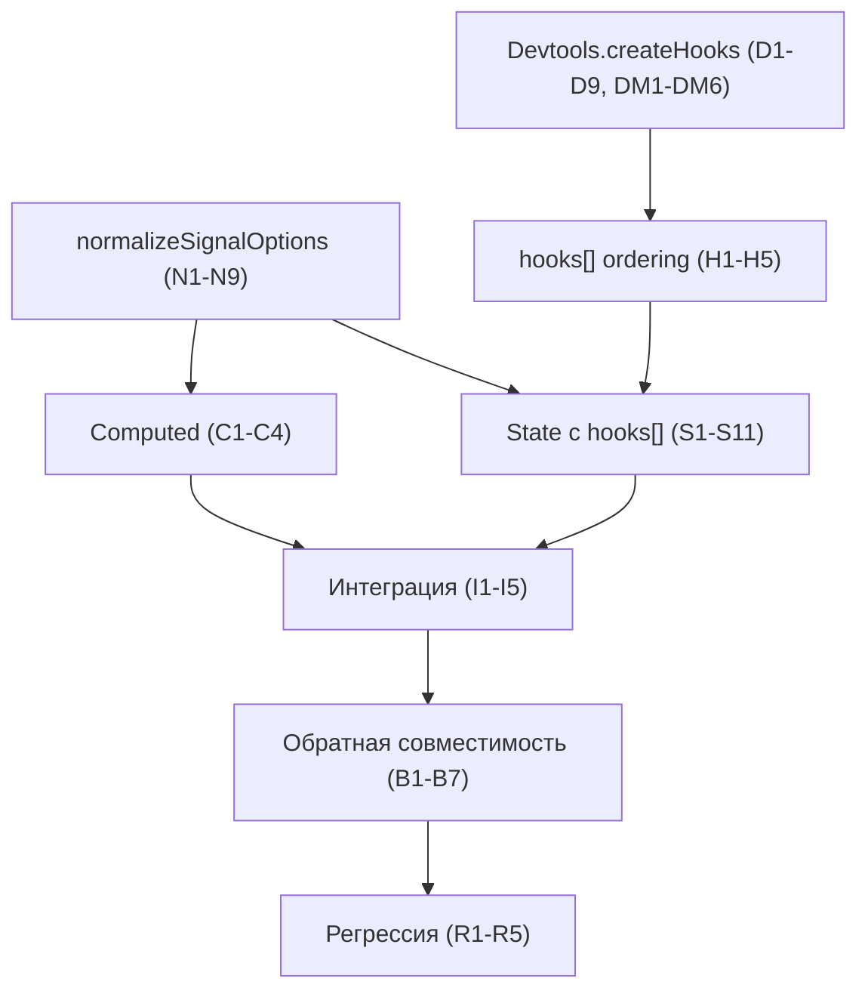

# Стратегия тестирования: Signal Devtools Lifecycle Hooks (v2 — Redraft)

**Status**: Redraft  
**Дата**: 2026-03-11

---

## 1. Обзор

Стратегия тестирования охватывает все новые и изменённые компоненты фичи Lifecycle Hooks для сигналов. Тесты разделены на unit-тесты отдельных модулей, интеграционные тесты взаимодействия компонентов и регрессионные тесты существующей функциональности.

Ключевое изменение по сравнению с v1: **массив хуков** (`hooks: SignalLifecycleHook<T>[]`) вместо `mergeHooks()`. State итерирует массив для каждого lifecycle-события. `mergeHooks()` **удалён** из scope.

### 1.1. Scope тестирования

| Компонент | Файл тестов | Тип |
|-----------|-------------|-----|
| `normalizeSignalOptions()` | `src/signals/types/normalizeSignalOptions.test.ts` | Unit |
| `Devtools.createSignalHooks()` | `src/signals/base/Devtools.test.ts` | Unit |
| `State` с массивом `hooks[]` | `src/signals/signals/State.test.ts` | Unit |
| `Computed` с `beforeDevtoolsPush` | `src/signals/signals/Computed.test.ts` | Unit |
| State + Devtools интеграция | `src/__tests__/integration/` | Integration |
| Обратная совместимость | `src/__tests__/integration/` | Integration |
| Query-модуль (регрессия) | `src/query/core/QueriesLifetimeHooks.test.ts` | Regression |

### 1.2. Существующие тесты (затронутые)

- `src/signals/base/Devtools.test.ts` — тесты `createState()`, `_skipValues`, генерация ключей, `hasDevtools`. Тесты `_skipValues` заменяются на тесты `beforeDevtoolsPush` через `Devtools.createHooks()`.
- `src/__tests__/integration/signals-exports.test.ts` — проверка экспортов. Добавить `SignalOptions`, `SignalOptionsOrKey`, `SignalLifecycleHook`, `normalizeSignalOptions`.
- `src/__tests__/integration/common-exports.test.ts` — без изменений (типы devtools не меняются).

---

## 2. Таблица тест-кейсов

### 2.1. Unit: `normalizeSignalOptions()`

| ID | Категория | Описание | Входные данные | Ожидаемый результат | Приоритет |
|----|-----------|----------|----------------|---------------------|-----------|
| N1 | normalizeSignalOptions | Строка — преобразуется в `{ key }` | `"counter"` | `{ key: "counter" }` | P0 |
| N2 | normalizeSignalOptions | Объект с `key` — возвращается как есть | `{ key: "x", base: "State" }` | `{ key: "x", base: "State" }` | P0 |
| N3 | normalizeSignalOptions | `undefined` — возвращается пустой объект | `undefined` | `{}` | P0 |
| N4 | normalizeSignalOptions | Deprecated `name` → `key` | `{ name: "counter" }` | `{ name: "counter", key: "counter" }` | P0 |
| N5 | normalizeSignalOptions | `name` + `key` — `key` приоритетнее | `{ name: "old", key: "new" }` | `{ name: "old", key: "new" }` (key не перезаписан) | P0 |
| N6 | normalizeSignalOptions | Объект с `hooks[]` — массив хуков сохраняется | `{ key: "x", hooks: [{ onInit: fn }] }` | `{ key: "x", hooks: [{ onInit: fn }] }` | P1 |
| N7 | normalizeSignalOptions | Объект с `beforeDevtoolsPush` | `{ beforeDevtoolsPush: fn }` | `{ beforeDevtoolsPush: fn }` | P1 |
| N8 | normalizeSignalOptions | Пустой объект | `{}` | `{}` | P1 |
| N9 | normalizeSignalOptions | Пустая строка | `""` | `{ key: "" }` | P2 |

### 2.2. Unit: `Devtools.createSignalHooks()`

| ID | Категория | Описание | Входные данные | Ожидаемый результат | Приоритет |
|----|-----------|----------|----------------|---------------------|-----------|
| D1 | Devtools.createHooks | DEVTOOLS установлен — возвращает `SignalLifecycleHook` | `SharedOptions.DEVTOOLS = mock`, `value=0, opts={key:"x"}` | `{ onInit, onChange, onDispose }` — все функции | P0 |
| D2 | Devtools.createHooks | DEVTOOLS не установлен — возвращает `null` | `SharedOptions.DEVTOOLS = null` | `null` | P0 |
| D3 | Devtools.createHooks | `isDisabled: true` — возвращает `null` | `opts = { isDisabled: true }` | `null` | P0 |
| D4 | Devtools.createHooks | `onInit` вызывает `DEVTOOLS.state()` с правильным ключом | `value=42, opts={key:"counter", base:"State"}` | `mockCreateState` вызван с ключом, содержащим `"counter"`, и значением `42` | P0 |
| D5 | Devtools.createHooks | `onChange` вызывает devtools state function | После `onInit` вызвать `onChange(100)` | `mockStateFn(100)` вызван | P0 |
| D6 | Devtools.createHooks | `onDispose` отправляет `$COMPLETED` | После `onInit` вызвать `onDispose()` | `mockStateFn("$COMPLETED")` вызван | P0 |
| D7 | Devtools.createHooks | Ключ содержит уникальный индекс `Indexer` | Создать два набора хуков с одинаковым key | Ключи различаются (`#i=N` часть разная) | P1 |
| D8 | Devtools.createHooks | `{scope}` плейсхолдер заменяется | `opts = { key: "{scope}/counter" }`, `getScopeName = () => "app"` | Ключ содержит `"app"` | P1 |
| D9 | Devtools.createHooks | `{base}` плейсхолдер заменяется | `opts = { key: "{base}/x", base: "State" }` | Ключ содержит `"State"` | P1 |

### 2.3. Unit: `Devtools.createHooks()` с `beforeDevtoolsPush`

| ID | Категория | Описание | Входные данные | Ожидаемый результат | Приоритет |
|----|-----------|----------|----------------|---------------------|-----------|
| DM1 | Devtools.createHooks + beforeDevtoolsPush | `onInit` — `beforeDevtoolsPush` контролирует push | `beforeDevtoolsPush: (v, push) => push(v)`, `value=42` | `mockCreateState` вызван с `42` | P0 |
| DM2 | Devtools.createHooks + beforeDevtoolsPush | `onInit` — фильтрация через `beforeDevtoolsPush` | `beforeDevtoolsPush: (v, push) => { /* не вызываем push */ }`, `value=_EMPTY` | `mockCreateState` **не** вызван (lazy init не произошёл) | P0 |
| DM3 | Devtools.createHooks + beforeDevtoolsPush | `onChange` — lazy init при первом push | Начальное значение отфильтровано, затем `onChange(42)` с push | `mockCreateState` вызван при `onChange`, не при `onInit` | P0 |
| DM4 | Devtools.createHooks + beforeDevtoolsPush | `onChange` — трансформация значения | `beforeDevtoolsPush: (v, push) => push({...v, token: "***"})` | `mockStateFn` получает маскированное значение | P1 |
| DM5 | Devtools.createHooks + beforeDevtoolsPush | `onDispose` — работает независимо от `beforeDevtoolsPush` | После lazy init, вызвать `onDispose` | `$COMPLETED` отправлен | P1 |
| DM6 | Devtools.createHooks + beforeDevtoolsPush | `onDispose` без предшествующего init (всё отфильтровано) | `beforeDevtoolsPush` никогда не вызывает push, затем `onDispose` | Нет ошибки, `stateDevtools` остаётся `null` | P1 |

### 2.4. Unit: State с массивом `hooks[]`

| ID | Категория | Описание | Входные данные | Ожидаемый результат | Приоритет |
|----|-----------|----------|----------------|---------------------|-----------|
| S1 | State + hooks[] | `onInit` каждого хука вызывается в конструкторе | `State.create(42, { hooks: [{ onInit: spy1 }, { onInit: spy2 }] })` | `spy1` и `spy2` вызваны с `42`, каждый один раз | P0 |
| S2 | State + hooks[] | `onChange` каждого хука при `set()` | `hooks: [{ onChange: spy1 }, { onChange: spy2 }]`, затем `state.set(1)` | `spy1` и `spy2` вызваны с `1` | P0 |
| S3 | State + hooks[] | `onChange` не вызывается при одинаковом значении | `hooks: [{ onChange: spy }]`, затем `state.set(0)` (начальное 0) | `spy` не вызван (значение не изменилось) | P0 |
| S4 | State + hooks[] | `onDispose` каждого хука при GC | `hooks: [{ onDispose: spy1 }, { onDispose: spy2 }]`, GC | `spy1` и `spy2` вызваны | P1 |
| S5 | State + hooks[] | Без хуков — State работает как раньше | `State.create(0, "counter")` | Нет ошибок, `set`/`get` работают | P0 |
| S6 | State + hooks[] | `beforeDevtoolsPush` + пользовательские хуки | `State.create(data, { beforeDevtoolsPush: mapFn, hooks: [{ onChange: spy }] })` | Devtools получает mapped данные, `spy` получает оригинальные | P1 |
| S7 | State + hooks[] | `onChange` вызывается внутри Batcher.run | `hooks: [{ onChange: spy }]`, `state.set(1)` | `spy` вызван синхронно внутри текущего batch | P1 |
| S8 | State + hooks[] | Порядок итерации `hooks[0]` → `hooks[N]` | `hooks: [{ onChange: spy1 }, { onChange: spy2 }]` | `spy1` вызван **до** `spy2` | P0 |
| S9 | State + hooks[] | `_hooks = null` если массив пуст | `State.create(0)` без devtools, без user hooks | Внутреннее поле `_hooks` === `null` | P1 |
| S10 | State + hooks[] | Ошибка в `onInit` — State всё равно создан | `hooks: [{ onInit: throws }]` | State создаётся, `set`/`get` работают | P2 |
| S11 | State + hooks[] | Ошибка в `onChange` — значение всё равно обновлено | `hooks: [{ onChange: throws }]`, `state.get()` | Значение обновлено несмотря на ошибку | P2 |

### 2.5. Unit: Computed с `beforeDevtoolsPush`

| ID | Категория | Описание | Входные данные | Ожидаемый результат | Приоритет |
|----|-----------|----------|----------------|---------------------|-----------|
| C1 | Computed + beforeDevtoolsPush | `_EMPTY` не попадает в devtools | `Computed.create(() => dep(), "x")` | При создании `mockCreateState` **не** вызван (начальное значение `_EMPTY` отфильтровано через `beforeDevtoolsPush`) | P0 |
| C2 | Computed + beforeDevtoolsPush | Первое вычисленное значение → lazy init devtools | Computed пересчитывается в `42` | `mockCreateState` вызван с `42` | P0 |
| C3 | Computed + beforeDevtoolsPush | Последующие значения отправляются в devtools | Computed пересчитывается: `42` → `100` | `mockStateFn(100)` вызван | P0 |
| C4 | Computed + beforeDevtoolsPush | `base` автоматически устанавливается `"Computed"` | `Computed.create(fn, "myComp")` | Ключ содержит `"Computed"` (через `base`) | P1 |

### 2.6. Unit: Формирование массива hooks[] и порядок

| ID | Категория | Описание | Входные данные | Ожидаемый результат | Приоритет |
|----|-----------|----------|----------------|---------------------|-----------|
| H1 | hooks[] ordering | Devtools-хук — `hooks[0]`, user — `hooks[1..N]` | `DEVTOOLS = mock`, `{ key: "x", hooks: [{ onChange: userSpy }] }` | При `set()`: `mockStateFn` вызван **до** `userSpy` | P0 |
| H2 | hooks[] ordering | Devtools `null` — только пользовательские хуки | `DEVTOOLS = null`, `{ hooks: [{ onChange: spy }] }` | `hooks` содержит только user hook, `spy` вызван | P0 |
| H3 | hooks[] ordering | Несколько пользовательских хуков — порядок сохраняется | `{ hooks: [hookA, hookB, hookC] }` | Итерация: `hookA.onChange` → `hookB.onChange` → `hookC.onChange` | P1 |
| H4 | hooks[] ordering | Пустой массив `hooks: []` + нет devtools | `DEVTOOLS = null`, `{ hooks: [] }` | `_hooks = null` | P1 |
| H5 | hooks[] ordering | Devtools + пустой массив `hooks: []` | `DEVTOOLS = mock`, `{ key: "x", hooks: [] }` | `_hooks` содержит только devtools-хук | P1 |

### 2.7. Интеграция: State + Devtools

| ID | Категория | Описание | Входные данные | Ожидаемый результат | Приоритет |
|----|-----------|----------|----------------|---------------------|-----------|
| I1 | Integration: State+Devtools | Devtools-хук создаётся автоматически при наличии DEVTOOLS | `DefaultOptions.update({ DEVTOOLS: mock })`, `State.create(0, "x")` | `mock.state` вызван при `onInit` | P0 |
| I2 | Integration: State+Devtools | Обновления отправляются в devtools через итерацию hooks[] | `state.set(1)`, `state.set(2)` | `mockStateFn` вызван дважды с `1` и `2` | P0 |
| I3 | Integration: State+Devtools | Пользовательские хуки + devtools работают вместе | `State.create(0, { key: "x", hooks: [{ onChange: userSpy }] })`, `state.set(1)` | И `mockStateFn(1)` И `userSpy(1)` вызваны | P0 |
| I4 | Integration: State+Devtools | Порядок: devtools onChange → user onChange | `State.create(0, { key: "x", hooks: [{ onChange: userSpy }] })` | `mockStateFn` вызван **до** `userSpy` (devtools = hooks[0]) | P1 |
| I5 | Integration: State+Devtools | Без DEVTOOLS — только user hooks | `SharedOptions.DEVTOOLS = null`, `State.create(0, { hooks: [{ onChange: spy }] })` | `spy` вызван, devtools не задействованы | P1 |

### 2.8. Интеграция: обратная совместимость

| ID | Категория | Описание | Входные данные | Ожидаемый результат | Приоритет |
|----|-----------|----------|----------------|---------------------|-----------|
| B1 | Backward compat | Строковый shorthand работает | `State.create(0, "counter")` | Сигнал создан с ключом `"counter"` | P0 |
| B2 | Backward compat | `isDisabled` продолжает работать | `State.create(0, { isDisabled: true })` | Devtools не инициализируются | P0 |
| B3 | Backward compat | Отсутствие опций — как раньше | `State.create(0)` | Сигнал работает без ошибок | P0 |
| B4 | Backward compat | Deprecated `name` → `key` при нормализации | `State.create(0, { name: "counter" })` | Devtools используют ключ `"counter"` | P0 |
| B5 | Backward compat | `Computed.create` со строковым именем | `Computed.create(fn, "myComp")` | Computed работает, ключ используется в devtools | P0 |
| B6 | Backward compat | `Signal.state()` и `Signal.compute()` проксируют корректно | `Signal.state(0, "x")`, `Signal.compute(fn, "y")` | Оба работают без ошибок | P1 |
| B7 | Backward compat | `LocalState` продолжает работать | `LocalState.create(fn, "ls")` | Создаётся без ошибок, devtools для Computed работает | P1 |

### 2.9. Регрессия

| ID | Категория | Описание | Входные данные | Ожидаемый результат | Приоритет |
|----|-----------|----------|----------------|---------------------|-----------|
| R1 | Regression | `QueriesLifetimeHooks` — `Devtools.createState()` работает | Существующие тесты query lifecycle | Все тесты проходят без изменений | P0 |
| R2 | Regression | `Devtools.hasDevtools` — поведение сохранено | `SharedOptions.DEVTOOLS = null` / `{ state: fn }` | `false` / `true` | P0 |
| R3 | Regression | `Devtools.createState()` — legacy API не сломан | Существующие тесты `createState` | Все проходят (кроме `_skipValues` тестов, которые обновлены) | P0 |
| R4 | Regression | Экспорты сигналов — новые типы экспортируются | `import { SignalOptions, SignalOptionsOrKey, SignalLifecycleHook } from 'rx-toolkit/signals'` | Типы доступны | P1 |
| R5 | Regression | `LocalState` с devtools — не ломается | `LocalState.create(fn, { name: "ls" })` | Computed внутри получает devtools через массив хуков | P1 |

---

## 3. Edge Cases и граничные условия

### 3.1. Обработка ошибок в хуках

| ID | Edge Case | Описание | Ожидаемое поведение | Приоритет |
|----|-----------|----------|---------------------|-----------|
| E1 | `onChange` throws в одном хуке массива | `hooks[1].onChange` бросает исключение | Значение сигнала **обновлено**. `hooks[0].onChange` (devtools) уже выполнен. Ошибка не блокирует остальные хуки (открытый вопрос: try/catch per hook или общий) | P1 |
| E2 | `onInit` throws | Хук в массиве бросает исключение при инициализации | State создан и работоспособен | P2 |
| E3 | `onDispose` throws | Хук бросает в callback FinalizationRegistry | Ошибка не приводит к утечке, не блокирует вызов остальных `onDispose` хуков | P2 |

> **Примечание к E1**: Стратегия обработки ошибок при итерации массива хуков — открытый вопрос. Варианты: (1) try/catch на каждый хук — все хуки выполняются; (2) без try/catch — ошибка прерывает итерацию. Решается на этапе имплементации.

### 3.2. Массив хуков и граничные случаи

| ID | Edge Case | Описание | Ожидаемое поведение | Приоритет |
|----|-----------|----------|---------------------|-----------|
| E4 | Пустой массив user hooks + devtools | `hooks: []` + DEVTOOLS включены | `_hooks` = `[devtoolsHook]` — один элемент | P1 |
| E5 | `_hooks === null` → итерация не происходит | `State.create(0)` без devtools, без hooks | `for...of` не выполняется (guard `if (_hooks)`) | P0 |
| E6 | Хук без некоторых callback'ов | `hooks: [{ onInit: fn }]` (без onChange/onDispose) | `hook.onChange?.()` и `hook.onDispose?.()` — optional chaining, нет ошибки | P1 |

### 3.3. Производительность

| ID | Edge Case | Описание | Ожидаемое поведение | Приоритет |
|----|-----------|----------|---------------------|-----------|
| E7 | Hot path без хуков | `State.create(0)` без key, без DEVTOOLS | `_hooks === null`, guard `if (_hooks)` — одна проверка null | P1 |
| E8 | Hot path с одним devtools-хуком | `State.create(0, "x")` с DEVTOOLS | Итерация массива из 1 элемента — минимальный overhead | P2 |
| E9 | Массовое создание сигналов | 10 000 `State.create` с devtools | Время создания не деградирует нелинейно. Indexer справляется с большим количеством ключей | P2 |

---

## 4. Диаграмма покрытия тест-кейсами



---

## 5. Стратегия запуска тестов

### 5.1. Приоритеты

| Приоритет | Описание | Когда запускать |
|-----------|----------|-----------------|
| **P0** | Критический путь — должен пройти для merge | Каждый PR, CI pipeline |
| **P1** | Важные edge cases и интеграция | Каждый PR, CI pipeline |
| **P2** | Граничные и performance-сценарии | Перед release, ручная проверка |

### 5.2. Зависимости между тестами



### 5.3. Обновление существующих тестов

| Текущий тест | Изменение |
|-------------|-----------|
| `Devtools.test.ts` — `_skipValues` тесты (2 теста) | Заменить на тесты `beforeDevtoolsPush` через `Devtools.createHooks()` (DM1–DM6) |
| `Devtools.test.ts` — `createState()` тесты | Оставить без изменений (legacy API для query) |
| `Devtools.test.ts` — `hasDevtools`, key generation | Оставить без изменений |
| `signals-exports.test.ts` | Добавить проверки `SignalOptions`, `SignalOptionsOrKey`, `SignalLifecycleHook`, `normalizeSignalOptions` |

---

## 6. Мок-стратегия

### 6.1. `SharedOptions.DEVTOOLS`

Все тесты devtools используют мок `SharedOptions.DEVTOOLS`:

```typescript
const mockStateFn = vi.fn();
const mockCreateState = vi.fn(() => mockStateFn);
SharedOptions.DEVTOOLS = { state: mockCreateState };
```

Каждый `describe`/`beforeEach` сбрасывает DEVTOOLS в `null` для изоляции.

### 6.2. FinalizationRegistry (для `onDispose`)

Прямое тестирование GC ненадёжно. Стратегия:

1. **Unit-тесты `onDispose`**: вызвать каждый `hook.onDispose()` напрямую — проверить, что devtools получает `$COMPLETED` и пользовательские callback'и вызваны
2. **Не тестировать GC напрямую**: `FinalizationRegistry.register` замокан для проверки, что callback итерирует `_hooks[].onDispose`

### 6.3. `Indexer`

Indexer не мокается — его реальная реализация достаточно проста. Проверяем через результат (уникальность ключей).
