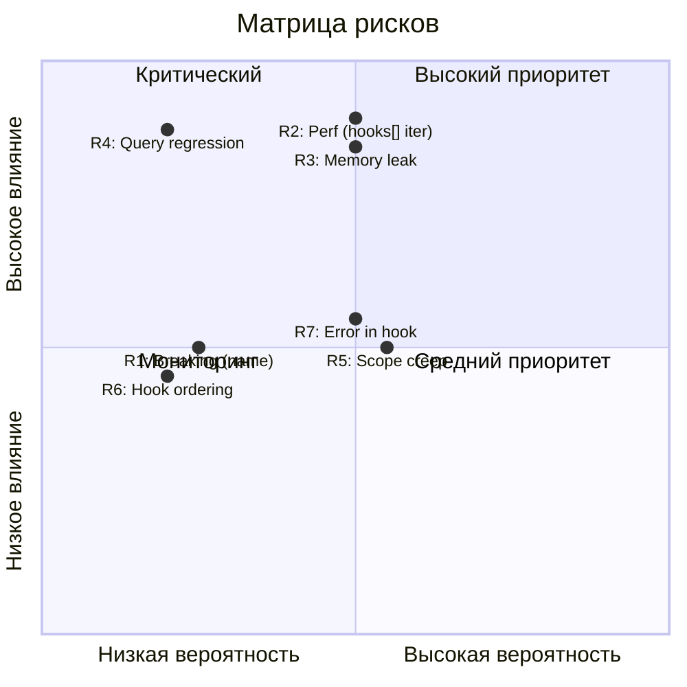

# Анализ рисков: Signal Devtools Lifecycle Hooks (v2 — Redraft)

**Status**: Redraft  
**Дата**: 2026-03-11

---

## 1. Матрица рисков

| ID | Риск | Вероятность | Влияние | Уровень | Стратегия | Митигация |
|----|------|-------------|---------|---------|-----------|-----------|
| R1 | Breaking change для потребителей `name` | Низкая | Среднее | Низкий | Смягчение | `name→key` автонормализация через `normalizeSignalOptions()` |
| R2 | Регрессия производительности: итерация `hooks[]` на hot path | Средняя | Высокое | Высокий | Предотвращение | Null-check оптимизация (`_hooks === null`) + бенчмарк |
| R3 | Утечка памяти: FinalizationRegistry + замыкания массива хуков | Средняя | Высокое | Высокий | Предотвращение | Обнуление ссылок в devtools-хуке `onDispose` + тесты |
| R4 | Регрессия query-модуля (`QueriesLifetimeHooks`) | Низкая | Высокое | Средний | Предотвращение | `Devtools.createState()` без изменений + 0 изменений в query |
| R5 | Scope creep — расширение набора хуков или структуры `SignalLifecycleHook` | Средняя | Среднее | Средний | Избежание | Строго 3 callback'а (onInit, onChange, onDispose) |
| R6 | Некорректный порядок итерации массива `hooks[]` | Низкая | Среднее | Низкий | Предотвращение | Явный контракт + unit-тесты порядка (H1-H3) |
| R7 | Ошибка в одном хуке прерывает итерацию остальных | Средняя | Среднее | Средний | Предотвращение | Стратегия обработки ошибок (try/catch per hook — открытый вопрос) |

---

## 2. Детальный анализ рисков

### R1: Breaking change для потребителей `name`

**Описание**: Внешние потребители могут использовать поле `name` в опциях сигналов. `StateDevtoolsOptions` не является публичным API — его удаление не является breaking change.

**Оценка вероятности**: **Низкая**. `name` широко используется, но остаётся как deprecated alias с автоматической нормализацией `name→key`.

**Влияние**: **Среднее**. Код с `name` продолжит работать без изменений.

**Митигация**:

1. **`name` → `key` автонормализация** в `normalizeSignalOptions()`:
   ```typescript
   if (options.name && !options.key) {
       return { ...options, key: options.name };
   }
   ```
2. **`name` сохраняется** как `@deprecated` поле в `SignalOptions`
3. **Удаление `name`** — не ранее чем через 2 minor-релиза

**Индикатор**: Отсутствие ошибок компиляции при обновлении пользовательских проектов.

---

### R2: Регрессия производительности: итерация `hooks[]`

**Описание**: Замена прямого вызова `this._stateDevtools?.(value)` на итерацию массива `for (const hook of this._hooks) { hook.onChange?.(value); }` в `State.set()` создаёт overhead на каждом обновлении. Массив хуков обычно содержит 0–2 элемента, но итерация + optional chaining на каждом элементе может быть заметна на hot path.

**Оценка вероятности**: **Средняя**. Для массива из 1 элемента overhead минимален. Но для path без хуков (`_hooks === null`) нужен guard, чтобы не создавать итератор.

**Влияние**: **Высокое**. Деградация производительности в реактивных системах критична — накапливается мультипликативно.

**Митигация**:

1. **Null-check на уровне `_hooks`** — если нет ни devtools, ни user hooks: `_hooks = null`:
   ```typescript
   // Hot path: одна проверка null
   if (this._hooks) {
       for (const hook of this._hooks) {
           hook.onChange?.(value);
       }
   }
   ```
2. **`_hooks = null` если массив пуст** — `hooks.length > 0 ? hooks : null` в конструкторе
3. **Нет аллокации wrapper-функций** — массив содержит оригинальные объекты хуков, не обёртки (в отличие от `mergeHooks`)
4. **Бенчмарк при PR** — микробенчмарк:
   - `State.set()` без хуков (`_hooks === null`, baseline)
   - `State.set()` с 1 хуком (devtools only)
   - `State.set()` с 2 хуками (devtools + user)
   - Сравнить с текущей реализацией (прямой вызов `_stateDevtools`)
5. **Критерий**: overhead не более 5% относительно текущей реализации при идентичном сценарии

**Индикатор**: Результаты бенчмарка. Если overhead > 5% — оптимизировать (inline для массива из 1 элемента).

---

### R3: Утечка памяти: FinalizationRegistry + замыкания массива хуков

**Описание**: `Devtools.createSignalHooks()` создаёт замыкание с `stateDevtools`, `createStateDevtools`, `key`. Массив хуков хранит ссылки на все элементы. `FinalizationRegistry` хранит reference на callback, который итерирует `_hooks[].onDispose()`. Если цепочка ссылок удерживает объекты — утечка.

**Оценка вероятности**: **Средняя**. FinalizationRegistry по стандарту не гарантирует вызов callback'а. Если callback не вызван, замыкание devtools-хука продолжает жить, удерживая reference на DevtoolsStateLike.

**Влияние**: **Высокое**. В SPA утечка памяти накапливается — особенно с частым созданием/уничтожением React-компонентов.

**Митигация**:

1. **Обнуление ссылок в devtools-хуке `onDispose`**:
   ```typescript
   onDispose() {
       stateDevtools?.('$COMPLETED' as any);
       stateDevtools = null; // Разрываем ссылку на DevtoolsStateLike
   }
   ```
2. **FinalizationRegistry хранит массив `_hooks`** — held value содержит ссылку на массив, не на весь State:
   ```typescript
   State._finalizationRegistry.register(this, this._hooks);
   // callback: (hooks) => { for (const h of hooks) h.onDispose?.(); }
   ```
3. **Тестирование**: Unit-тест DM6 — `onDispose` без предшествующего init (`stateDevtools === null`) — нет ошибки, нет утечки
4. **WeakRef для stateDevtools** — рассмотреть если утечки обнаружены, но не как первичную реализацию

**Индикатор**: Memory profiling в Chrome DevTools при создании/уничтожении 1000 сигналов. Нет роста retained memory.

---

### R4: Регрессия query-модуля

**Описание**: `QueriesLifetimeHooks` использует `Devtools.createState()` и `Devtools.hasDevtools`. Изменения в `Devtools.ts` (добавление `createSignalHooks()`) теоретически могут повлиять на существующий API.

**Оценка вероятности**: **Низкая**. `Devtools.createState()` остаётся без изменений. `createSignalHooks()` — новый метод объекта `Devtools`, не модифицирующий существующие. Query-модуль — 0 изменений в `src/query/`.

**Влияние**: **Высокое**. Регрессия query-кэша может привести к потере данных, stale state, race conditions.

**Митигация**:

1. **0 изменений в `src/query/`** — строгое ограничение scope
2. **`Devtools.createState()` — без изменений** — ни сигнатура, ни реализация не меняются
3. **Существующие тесты query** — запустить полный test suite при каждом PR
4. **Регрессионный тест R1** — явный тест, что `Devtools.createState()` работает как раньше

**Индикатор**: Все существующие тесты `QueriesLifetimeHooks` и `Devtools.createState()` проходят без изменений.

---

### R5: Scope creep — расширение набора хуков

**Описание**: Соблазн добавить дополнительные callback'и в `SignalLifecycleHook`: `onWatch`, `onUnwatch` (TC39 Signals), `onBatch`, `onError`, `onSubscribe`. Каждый новый callback увеличивает размер интерфейса, сложность итерации, и overhead при optional chaining.

**Оценка вероятности**: **Средняя**. TC39 Signals Proposal включает `Watcher` с аналогичными событиями. Давление на расширение предсказуемо.

**Влияние**: **Среднее**. Дополнительная сложность, больше тестов, потенциально больше overhead. Массив хуков легко расширяется, но каждый новый callback — дополнительный optional chaining в hot path.

**Митигация**:

1. **Строгий scope**: ровно 3 callback'а в `SignalLifecycleHook`: `onInit`, `onChange`, `onDispose`
2. **Массив хуков позволяет расширение** — новые callback'и добавляются как optional-поля в `SignalLifecycleHook` без breaking change
3. **Критерий добавления**: конкретный use case + невозможность реализации через существующие callback'и + одобрение мейнтейнера
4. **Отдельный PR для каждого нового callback'а**

**Индикатор**: Код-ревью фиксирует попытки добавить callback'и за пределами scope.

---

### R6: Некорректный порядок итерации массива `hooks[]`

**Описание**: Контракт: devtools-хук всегда `hooks[0]`, пользовательские — `hooks[1..N]`. Итерация прямая: `for...of`. Неправильная сборка массива (devtools не первый) может привести к тому, что devtools не залогирует состояние до user side effect.

**Оценка вероятности**: **Низкая**. Сборка массива в `State.constructor` тривиальна — сначала push devtools, потом push user hooks. Ошибка маловероятна.

**Влияние**: **Среднее**. Неправильный порядок — subtle bug: devtools показывает не то, что ожидает пользователь.

**Митигация**:

1. **Явный контракт в конструкторе State**:
   ```typescript
   // Contract: devtools hook is always hooks[0], user hooks are hooks[1..N]
   const hooks: SignalLifecycleHook<T>[] = [];
   const dtHook = Devtools.createHooks(value, opts);
   if (dtHook) hooks.push(dtHook);
   if (opts.hooks) hooks.push(...opts.hooks);
   ```
2. **Тест-кейс H1** — проверяет порядок через `vi.fn()` callOrder
3. **Тест-кейс I4** — интеграционный тест порядка на реальном State

**Индикатор**: Тесты H1 и I4 проходят.

---

### R7: Ошибка в одном хуке прерывает итерацию остальных

**Описание**: При итерации `for (const hook of hooks) { hook.onChange?.(v); }` — если `hooks[0].onChange` бросает исключение, `hooks[1].onChange` не будет вызван. Это особенно критично, если devtools-хук (hooks[0]) упал, а пользовательский хук (hooks[1]) не выполнился.

**Оценка вероятности**: **Средняя**. Devtools-хуки работают с внешним API (Redux DevTools extension) — могут бросать ошибки при некорректном state.

**Влияние**: **Среднее**. Пользовательский хук не вызван → пропущена аналитика, логирование, кастомная логика.

**Митигация**:

1. **Вариант A — try/catch per hook** (рекомендуемый):
   ```typescript
   for (const hook of this._hooks) {
       try { hook.onChange?.(value); } catch (e) { console.error(e); }
   }
   ```
   Pro: все хуки гарантированно выполняются. Con: скрывает ошибки.
2. **Вариант B — без try/catch**:
   Ошибка всплывает, остальные хуки не вызываются. Pro: быстрее, ошибки видны. Con: один сломанный хук ломает все.
3. **Это открытый вопрос** — решается на этапе имплементации, тест-кейсы E1–E3 покрывают оба варианта.

**Индикатор**: Тест-кейсы E1–E3.

---

## 3. Матрица риск / вероятность



---

## 4. План мониторинга рисков

| Риск | Когда проверять | Как проверять | Ответственный |
|------|----------------|---------------|---------------|
| R1 | При реализации типов | Проверить экспорты, `name→key` нормализация | Автор PR |
| R2 | При реализации State.set() | Микробенчмарк: null-path / 1 hook / 2 hooks vs текущая реализация | Автор PR |
| R3 | При реализации FinalizationRegistry | Memory profiling, тесты onDispose по всему массиву | Автор PR |
| R4 | При каждом PR | Полный тест suite query-модуля | CI pipeline |
| R5 | При code review | Ревью scope: только 3 callback'а в SignalLifecycleHook | Мейнтейнер |
| R6 | При реализации конструктора State | Тесты порядка итерации (H1, H3, I4) | Автор PR |
| R7 | При реализации итерации hooks[] | Тесты E1-E3, решение по try/catch стратегии | Автор PR + Мейнтейнер |

---

## 5. Открытые вопросы (связанные с рисками)

| Вопрос | Связан с | Статус |
|--------|----------|--------|
| Нужен ли try/catch вокруг вызова user-хуков в merged callback? | R2 (overhead), E1 (onChange throws) | Открыт — решение при имплементации |
| Нужен ли WeakRef для stateDevtools в замыкании? | R3 | Не в первой итерации, мониторить |

---

## 6. Contingency plans

### При реализации R2 (performance regression > 5%)

1. Прямое присвоение: если только devtools `onChange` — один элемент массива, минимальный overhead
2. В крайнем случае: вернуть прямой вызов `stateDevtools` в `State.set()` для hot path, оставив массив только для `onInit`/`onDispose`

### При реализации R3 (memory leak обнаружена)

1. Обнулить все ссылки в `onDispose`: `stateDevtools = null`, `createStateDevtools = null`
2. Рассмотреть хранение `key` + factory ref вместо готового DevtoolsStateLike
3. Добавить `unregister()` в FinalizationRegistry при явном dispose (если будет добавлен)
