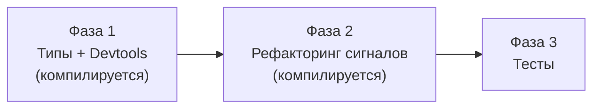

# План имплементации: Signal Devtools Lifecycle Hooks

- **Дата**: 2026-03-11
- **Status**: Approved
- **Feature**: Lifecycle hooks для сигналов, замена `_skipValues`, утилита нормализации

## Связанные документы

- [Дизайн](../02-design/README.md)
- [Архитектура](../02-design/01-architecture.md)
- [Потоки данных](../02-design/02-dataflow.md)
- [Доменная модель](../02-design/03-model.md)
- [Решения (ADR)](../02-design/04-decisions.md)
- [Тест-кейсы](../02-design/06-testcases.md)

## Обзор

План разбит на 3 фазы. Каждая фаза — атомарный коммит. **Каждая фаза компилируется без ошибок** (`npx tsc --noEmit` проходит). Фазы выполняются последовательно.

### Ключевые решения (redraft)

1. **`createSignalHooks`** вместо `createHooks` — имя отражает контекст сигналов.
2. **`createSignalHooks` делегирует в `createState()`** — не дублирует логику, а оборачивает результат `createState()` в интерфейс `SignalLifecycleHook`.
3. **Каждая фаза компилируется** — в Фазе 1 `StateDevtoolsOptions` сохранён как временный alias (`type StateDevtoolsOptions = SignalOptions | string`), чтобы сигналы (ещё не рефакторенные) продолжали компилироваться. Удаление alias — в Фазе 2.

## Диаграмма зависимостей фаз

## Сводная таблица фаз

| Фаза | Цель | Файлы | Верификация |
|------|------|-------|-------------|
| [Фаза 1](./01-phase.md) | Типы, `normalizeSignalOptions()`, `Devtools.createSignalHooks()` | `src/signals/types/SignalOptions.ts`, `src/signals/types/normalizeSignalOptions.ts`, `src/signals/types/index.ts`, `src/common/devtools/types.ts`, `src/signals/base/Devtools.ts` | `npx tsc --noEmit` — чисто |
| [Фаза 2](./02-phase.md) | Рефакторинг State, Computed, Signal, LocalState; удаление alias `StateDevtoolsOptions` | `src/signals/signals/State.ts`, `src/signals/signals/Computed.ts`, `src/signals/signals/Signal.ts`, `src/signals/signals/LocalState.ts`, `src/common/devtools/types.ts` | `npx tsc --noEmit` — чисто, `npx vitest run` — все тесты |
| [Фаза 3](./03-phase.md) | Тесты | `src/signals/base/Devtools.test.ts`, `src/signals/types/normalizeSignalOptions.test.ts`, `src/__tests__/integration/signals-exports.test.ts` | `npx vitest run` — полный прогон |

## Файлы без изменений

- `src/query/core/QueriesLifetimeHooks.ts` — использует `Devtools.createState()` напрямую (не импортирует `StateDevtoolsOptions`)
- `src/common/devtools/reduxDevtools.ts`
- `src/common/devtools/combineDevtools.ts`
- `src/common/options/SharedOptions.ts`
- `src/common/options/DefaultOptions.ts`
