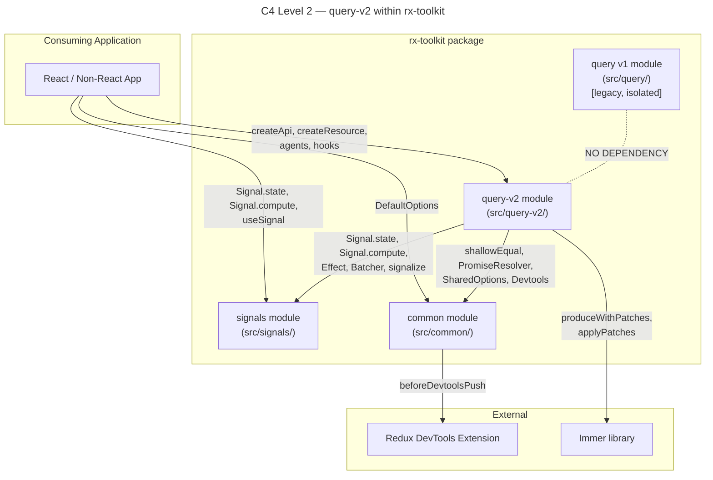
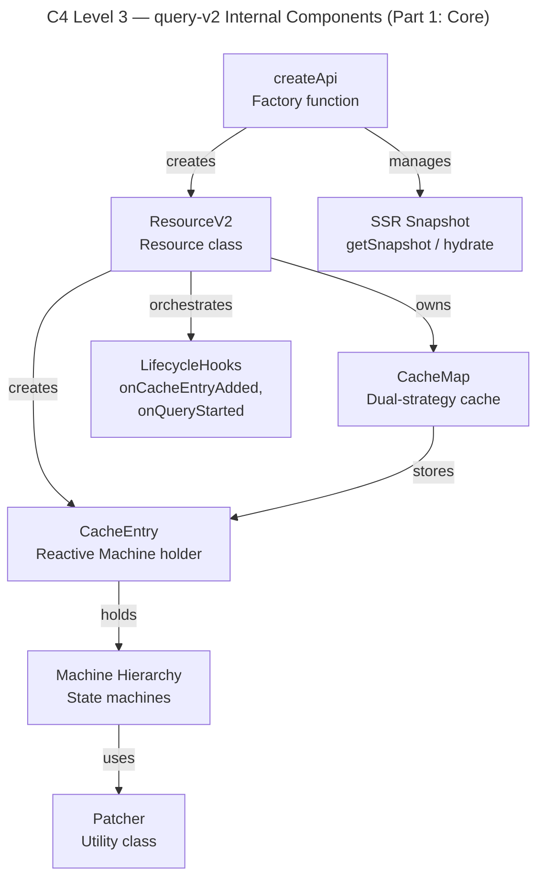
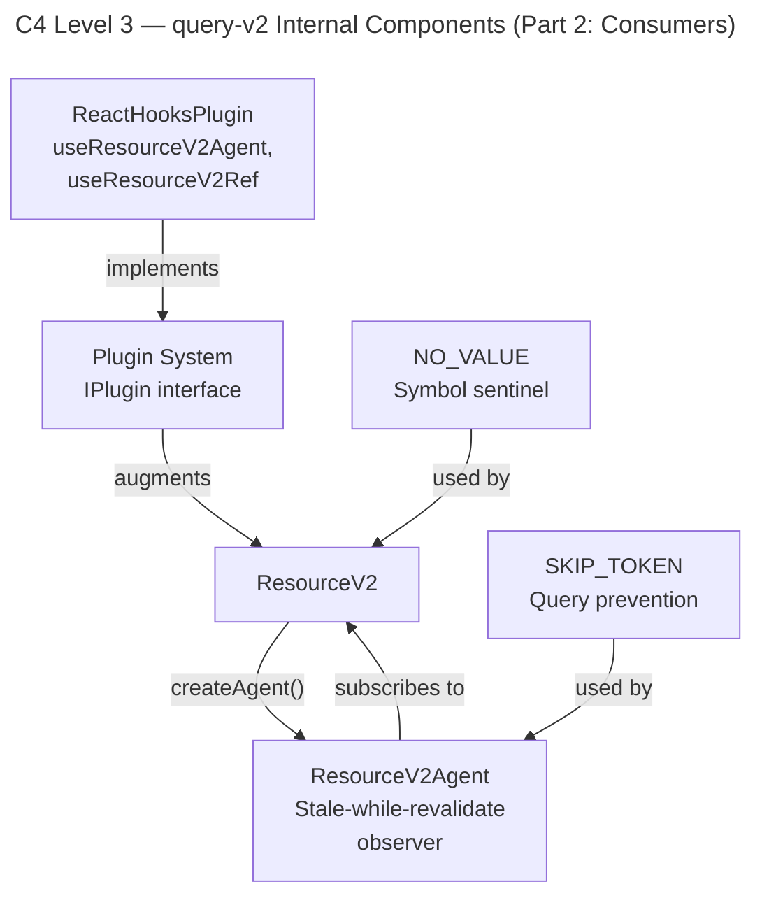
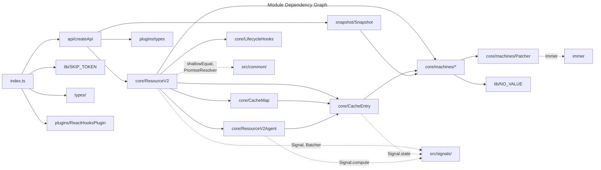
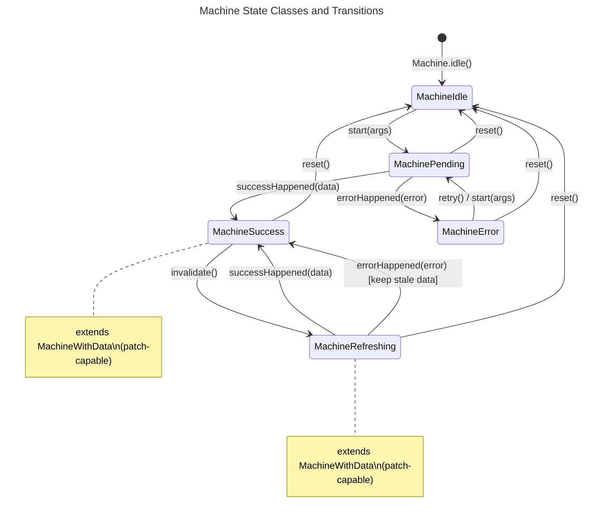

# System Architecture: Query v2 Module

## 1. Context and Positioning

Query v2 (`src/query-v2/`) is a ground-up redesign of the data-fetching and caching layer in rx-toolkit. It replaces v1's boolean-flag state model with class-based state machines, introduces API-level grouping via `createApi`, a dual-strategy cache, a plugin system, and SSR snapshot support. [ref: [01-codebase-query-v1.md](../01-research/01-codebase-query-v1.md)#8]

v2 lives in full isolation from v1 (`src/query/`) — no imports from v1 are permitted. It reuses only `src/common/` and `src/signals/` infrastructure. [ref: [04-open-questions.md](../01-research/04-open-questions.md)#Q4]

## 2. C4 Level 2 — Container Diagram

Shows query-v2 within the rx-toolkit package and its relationships with other modules and external consumers.



## 3. C4 Level 3 — Component Diagram

Internal structure of the query-v2 module.





## 4. Module Dependency Diagram

Proposed folder structure for `src/query-v2/` and import relationships.

```
src/query-v2/
├── index.ts                 # Public barrel export
├── api/
│   └── createApi.ts         # createApi factory
├── core/
│   ├── ResourceV2.ts        # Resource class (query orchestration)
│   ├── ResourceV2Agent.ts   # Agent (stale-while-revalidate observer)
│   ├── CacheMap.ts          # Dual-strategy cache abstraction
│   ├── CacheEntry.ts        # Reactive cache entry (Signal-based)
│   ├── LifecycleHooks.ts    # onCacheEntryAdded, onQueryStarted
│   └── machines/
│       ├── Machine.ts        # TMachine union + Machine.fromSnapshot()
│       ├── MachineIdle.ts
│       ├── MachinePending.ts
│       ├── MachineSuccess.ts
│       ├── MachineError.ts
│       ├── MachineRefreshing.ts
│       ├── MachineWithData.ts  # Shared base for Success + Refreshing
│       └── Patcher.ts         # Static patch utility
├── lib/
│   ├── SKIP_TOKEN.ts         # SKIP symbol + type
│   └── NO_VALUE.ts           # NO_VALUE symbol + type
├── plugins/
│   ├── types.ts              # IPlugin, IPluginContext
│   └── ReactHooksPlugin.ts   # React hooks plugin
├── snapshot/
│   └── Snapshot.ts           # SSR snapshot serialize/deserialize
└── types/
    ├── index.ts              # Type barrel export
    ├── api.types.ts          # ICreateApiOptions, IApi
    ├── resource.types.ts     # IResourceV2Options, IResourceV2
    ├── machine.types.ts      # Machine state types, TMachine union
    ├── cache.types.ts        # ICacheEntry, CacheMap types
    ├── agent.types.ts        # IResourceV2Agent
    ├── plugin.types.ts       # IPlugin, IPluginContext, plugin utilities
    ├── snapshot.types.ts     # TApiSnapshot, TResourceSnapshot
    ├── lifecycle.types.ts    # onCacheEntryAdded, onQueryStarted types
    └── shared.types.ts       # Prettify, NO_VALUE type, utility types
```



## 5. Machine State Hierarchy



**Class hierarchy:**

```
Machine (static factory: idle(), fromSnapshot())
├── MachineIdle              — status: 'idle', no data
├── MachinePending           — status: 'pending', no data, has args
├── MachineWithData<Data>    — abstract base, has data + patch methods
│   ├── MachineSuccess<Data> — status: 'success', has data
│   └── MachineRefreshing<Data> — status: 'refreshing', has stale data
└── MachineError<Error>      — status: 'error', has error, may have args
```

## 6. Component Responsibilities

### 6.1 `createApi` (Factory Function)

- **Owns**: API-level configuration (keyPrefix, keyStrategy, plugins, cacheLifetime defaults, snapshot options)
- **Creates**: `ResourceV2` instances via `createResource()`
- **Manages**: Resource registry (unique key enforcement for `serialize` strategy), plugin initialization, SSR snapshot coordination
- **Delegates**: Query execution to `ResourceV2`, signal management to signals module
- [ref: [01-codebase-query-v1.md](../01-research/01-codebase-query-v1.md)#8 — v1 lacks grouping, this is the primary v2 motivation]

### 6.2 `ResourceV2` (Resource Class)

- **Owns**: Query execution orchestration, abort controller management, lifecycle hook firing
- **Creates**: `CacheEntry` instances, `ResourceV2Agent` instances
- **Manages**: CacheMap for this resource, query deduplication (same-args concurrent calls)
- **Delegates**: Cache storage to `CacheMap`, state transitions to Machine classes, reactive updates to signals
- [ref: [01-codebase-query-v1.md](../01-research/01-codebase-query-v1.md)#2.1 — analogous to v1 Resource class]

### 6.3 `CacheMap` (Dual-Strategy Cache)

- **Owns**: Key-to-CacheEntry mapping, strategy selection (`serialize` vs. `compare`)
- **Implements**: `get(args)`, `set(args, entry)`, `delete(args)`, `has(args)`, `values()`, `entries()`
- **Strategy `serialize`**: Uses `Map<string, CacheEntry>` with O(1) lookup via serialized key
- **Strategy `compare`**: Uses linear-scan array with `compareArg` function (analogous to v1's `IndirectMap`)
- **Delegates**: Serialization to `serializeArgs` function, comparison to `compareArg` function
- [ref: [03-external-research.md](../01-research/03-external-research.md)#5.2 — serialize vs. compare tradeoffs]

### 6.4 `CacheEntry` (Reactive Cache Unit)

- **Owns**: A single `Signal.state<TMachine>` holding the current Machine instance
- **Provides**: Reactive access via signal (`machine$`), synchronous access via `peek()`
- **Manages**: Cache lifetime (ref-counted via signal subscription count + timer for cleanup)
- **Replaces**: v1's `ReactiveCache` (BehaviorSubject-based) with pure signal-based approach
- [ref: [02-codebase-signals-common.md](../01-research/02-codebase-signals-common.md)#1.1 — Signal.state as reactive primitive]

### 6.5 Machine Classes (State Machines)

- **Own**: State transitions (methods return new Machine instances), state serialization (`.state` property)
- **Enforce**: Valid transitions at compile time (only valid methods exist per class)
- **`MachineWithData`**: Shared base providing `addPatch()`, `finishPatch()`, `createPatch()` methods for `MachineSuccess` and `MachineRefreshing`
- [ref: [03-external-research.md](../01-research/03-external-research.md)#3.2 — class vs. discriminated union tradeoffs]

### 6.6 `Patcher` (Static Utility)

- **Owns**: Patch creation (via Immer `produceWithPatches`), patch resolution algorithm, patch finish logic
- **Pure functions**: `createPatch(patchFn, data)`, `resolvePatches(originalData, patches)`, `finishPatch(originalData, patches, type, patch)`
- **Called by**: `MachineWithData` base class methods
- [ref: [01-codebase-query-v1.md](../01-research/01-codebase-query-v1.md)#2.3 — v1 ResourceRef patch algorithm, lines 42-131]

### 6.7 `ResourceV2Agent` (Observer)

- **Owns**: Stale-while-revalidate logic (previous/current cache entry tracking)
- **Provides**: `state$` computed signal merging current and previous states, `start(args)`, `query$(args)`
- **Manages**: Arg tracking (fresh args vs. stale args), concurrent query latest-wins semantics
- [ref: [01-codebase-query-v1.md](../01-research/01-codebase-query-v1.md)#2.2 — v1 ResourceAgent pattern]

### 6.8 Plugin System

- **Owns**: Plugin registration, resource augmentation lifecycle
- **`IPlugin` interface**: `install(context)` for API-level setup, `augmentResource(resource)` for per-resource augmentation
- **`IPluginContext`**: Provides hooks into API lifecycle for plugin initialization
- **`ReactHooksPlugin`**: Adds `useResourceV2Agent(args)` and `useResourceV2Ref(args)` to each resource
- [ref: [03-external-research.md](../01-research/03-external-research.md)#4 — plugin system patterns]

### 6.9 SSR Snapshot Layer

- **Owns**: Serialization of API state to `TApiSnapshot`, deserialization via `Machine.fromSnapshot()`
- **`getSnapshot()`**: Iterates all resources, collects `MachineSuccess` entries (only), produces versioned JSON-serializable snapshot
- **`initialSnapshot` hydration**: On `createApi` construction, populates CacheMap entries from snapshot, checks `maxSnapshotDataAge`, triggers invalidation for stale entries
- [ref: [03-external-research.md](../01-research/03-external-research.md)#6 — SSR hydration patterns]

### 6.10 `LifecycleHooks`

- **Owns**: `onCacheEntryAdded` and `onQueryStarted` promise-based lifecycle management
- **Creates**: `PromiseResolver` pairs (`$cacheDataLoaded` / `$cacheEntryRemoved`, `$queryFulfilled`)
- **Called by**: `ResourceV2` at transition points (entry creation, query start, success, error, cleanup)
- [ref: [01-codebase-query-v1.md](../01-research/01-codebase-query-v1.md)#2.6 — v1 QueriesLifetimeHooks]

## 7. Public API Surface

Exports from `src/query-v2/index.ts`:

```ts
// --- Factory ---
export { createApi } from './api/createApi';

// --- Tokens ---
export { SKIP, type SKIP_TOKEN } from './lib/SKIP_TOKEN';
export { NO_VALUE } from './lib/NO_VALUE';

// --- Plugins ---
export { ReactHooksPlugin } from './plugins/ReactHooksPlugin';

// --- Machine classes (for instanceof checks and snapshot rehydration) ---
export {
  Machine,
  MachineIdle,
  MachinePending,
  MachineSuccess,
  MachineError,
  MachineRefreshing,
} from './core/machines/Machine';

// --- Types ---
export type {
  // API
  ICreateApiOptions,
  IApi,
  // Resource
  IResourceV2Options,
  IResourceV2,
  // Machine
  TMachine,
  TMachineStatus,
  TResourceV2IdleState,
  TResourceV2PendingState,
  TResourceV2SuccessState,
  TResourceV2ErrorState,
  TResourceV2RefreshingState,
  // Cache
  ICacheEntry,
  // Agent
  IResourceV2Agent,
  IResourceV2AgentState,
  // Plugin
  IPlugin,
  IPluginContext,
  // Snapshot
  TApiSnapshot,
  TResourceSnapshot,
  // Lifecycle
  TOnCacheEntryAdded,
  TOnQueryStarted,
  TCacheEntryAddedTools,
  TQueryStartedTools,
  // Patcher
  TResourceV2Patch,
  TPatchFn,
  // Misc
  TSerializeArgsFn,
  TCompareArgsFn,
  TBeforeDevtoolsPushFn,
  TQueryFn,
  TQueryFnTools,
} from './types';
```

## 8. Integration Points with Existing Modules

### 8.1 Signals (`src/signals/`)

| Usage in query-v2 | Signal primitive | Purpose |
|---|---|---|
| `CacheEntry.machine$` | `Signal.state()` | Mutable reactive holder for current Machine |
| `ResourceV2Agent.state$` | `Signal.compute()` | Derived stale-while-revalidate state |
| Query side-effects | `Signal.effect()` | (Optional) For reactive query triggers in `query$` |
| `Batcher.run()` | `Batcher` | Atomic multi-signal updates during transitions |
| Devtools bridge | `Signal.state()` `beforeDevtoolsPush` | Push Machine state to Redux DevTools via Signal's built-in devtools hooks |

### 8.2 Common (`src/common/`)

| Usage in query-v2 | Utility | Purpose |
|---|---|---|
| Default arg comparison | `shallowEqual` | Default `compareArg` function |
| Lifecycle promises | `PromiseResolver` | `$cacheDataLoaded`, `$cacheEntryRemoved`, `$queryFulfilled` |
| Global options | `SharedOptions` | Devtools, `onQueryError` (fallback) |
| React hooks | `useConstant`, `useEventHandler` | Used by ReactHooksPlugin |

### 8.3 Immer (External)

| Usage | Immer API | Purpose |
|---|---|---|
| Patch creation | `enablePatches()`, `produceWithPatches()` | Create patches + inverse patches for optimistic updates |
| Patch application | `applyPatches()` | Apply/revert patches on data |
