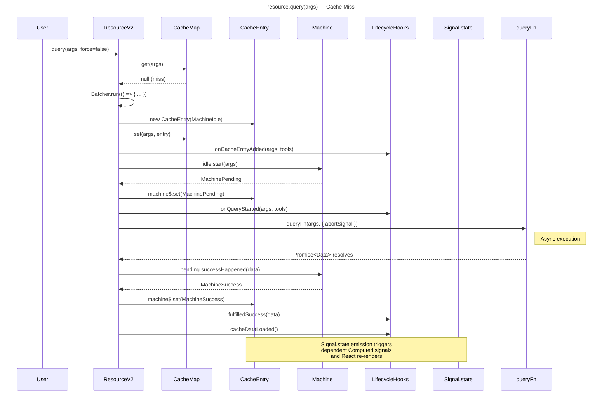
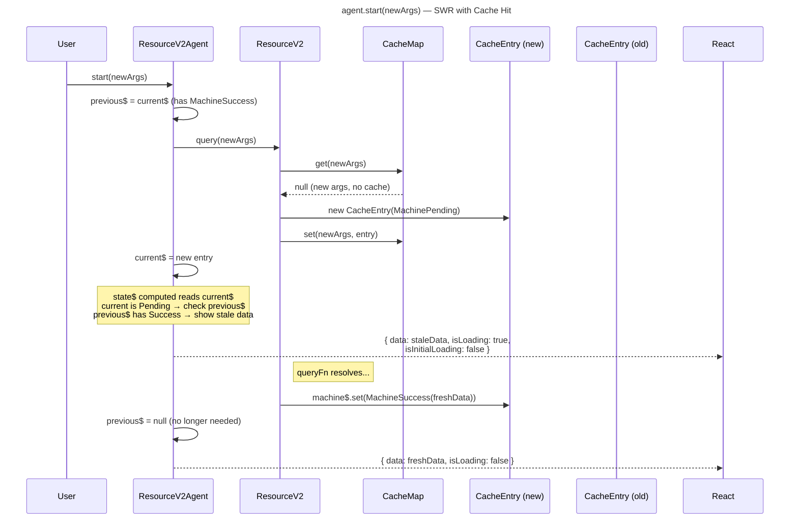
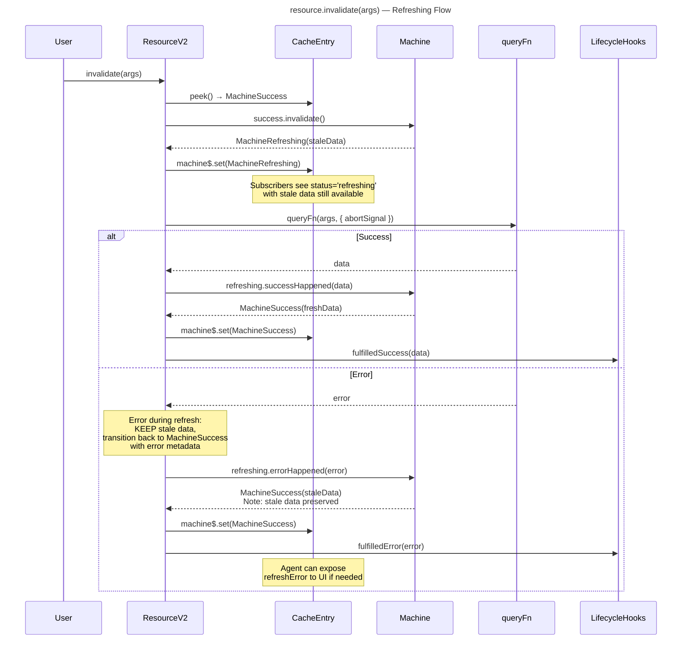
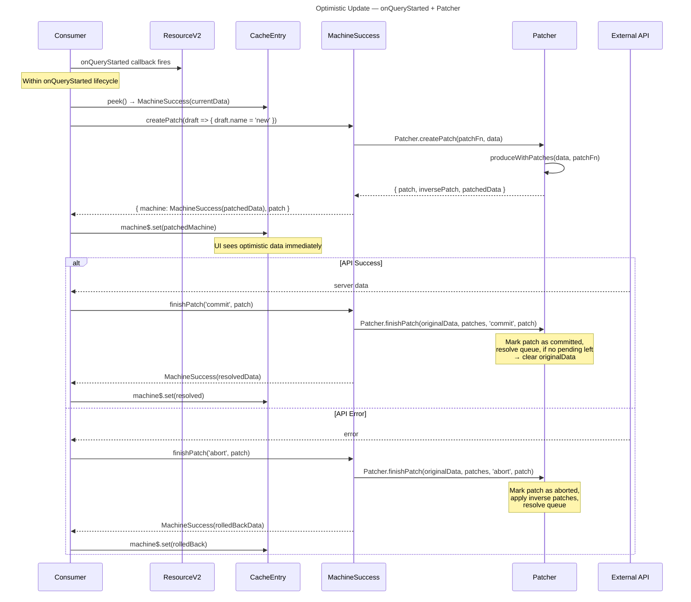
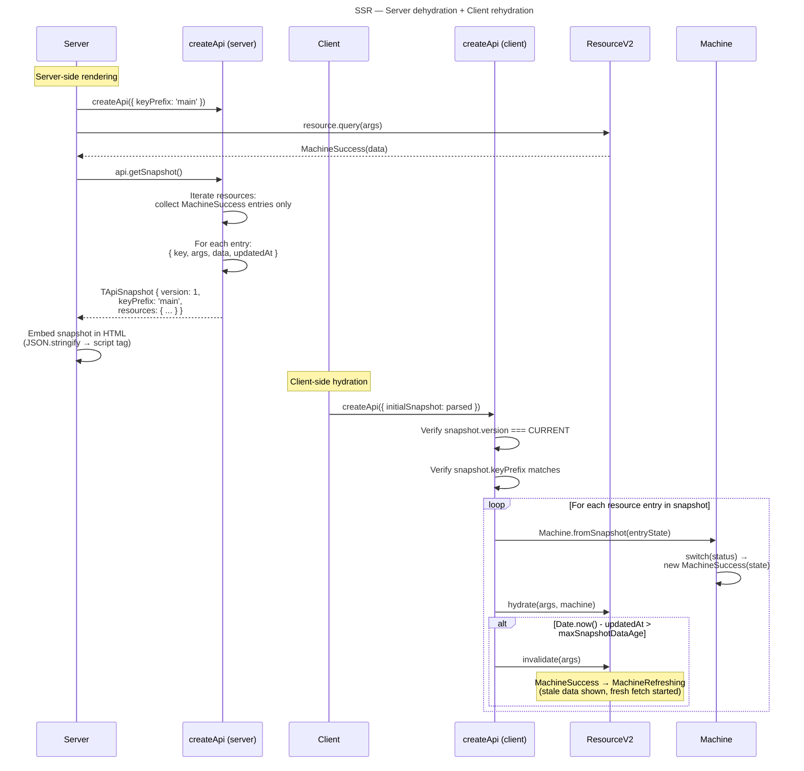
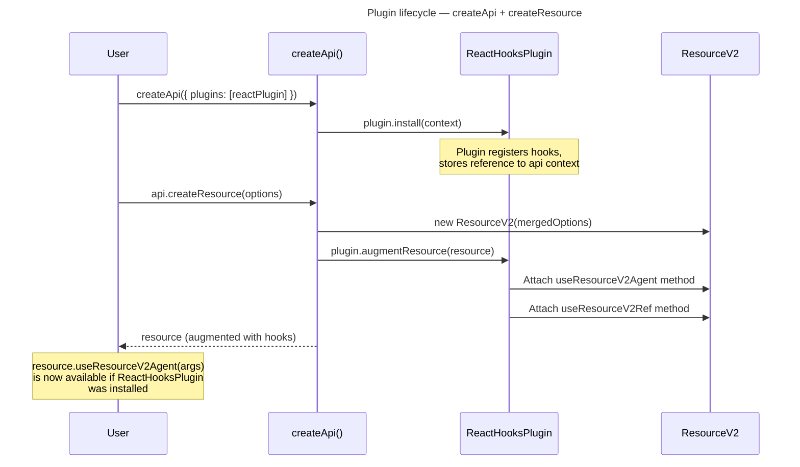
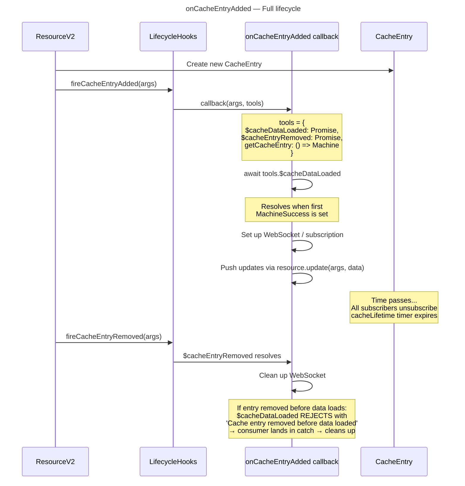
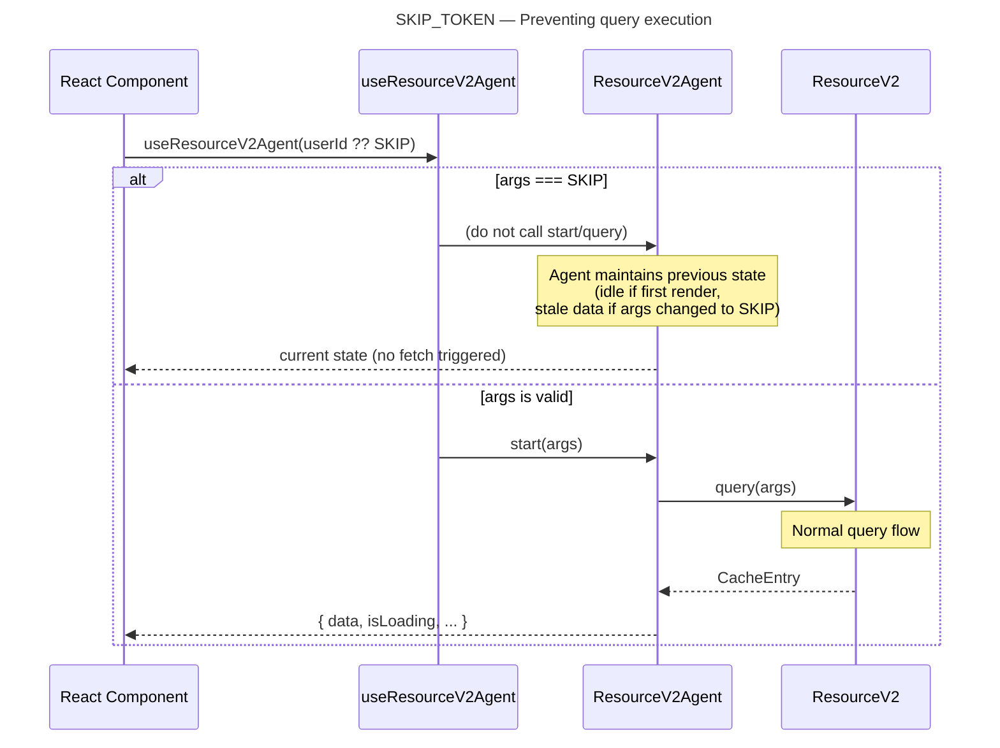
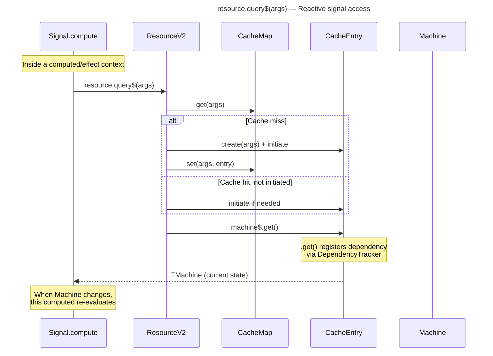

# Data Flow: Query v2 Module

## 1. Resource Query — Cache Miss (First Fetch)

User calls `resource.query(args)` when no cache entry exists.

## 2. Resource Query — Cache Hit (Stale-While-Revalidate via Agent)

Agent manages stale-while-revalidate when args change.

## 3. Resource Invalidation — MachineRefreshing Flow

`resource.invalidate(args)` transitions `MachineSuccess → MachineRefreshing`, re-fetches, and handles errors.

**Error semantics during refresh** (see [ADR-2 in 04-decisions.md](./04-decisions.md#adr-2)):

On error during `MachineRefreshing`:
- Transition **back to `MachineSuccess`** preserving the stale data.
- The error is passed to `onQueryStarted` → `$queryFulfilled` rejection so consumers can react.
- The Agent exposes a `refreshError` field on its state for UI display.
- Rationale: Losing stale data on a transient error degrades UX. [ref: [03-external-research.md](../01-research/03-external-research.md)#2.2 — TanStack Query preserves stale data on background refetch failure]

### Patch interaction during refresh

When `MachineRefreshing` has active patches:
1. `addPatch()` works on `MachineRefreshing` (inherits from `MachineWithData`) — patches are applied on top of stale data.
2. On `successHappened(freshData)`: all pending patches are **aborted** (fresh data supersedes optimistic changes). Committed patches have already been applied server-side.
3. On `errorHappened(error)`: patches remain attached to the stale data in the returned `MachineSuccess`.

## 4. Optimistic Update via Patcher

**Hanging patch fix**: When a Machine transitions to `MachineIdle` (via `reset()`) or when the `CacheEntry` is cleaned up, all pending patches are automatically aborted. This prevents the v1 bug where orphaned pending patches block `originalData` cleanup. [ref: [01-codebase-query-v1.md](../01-research/01-codebase-query-v1.md)#2.3, [04-open-questions.md](../01-research/04-open-questions.md)#Q12]

## 5. SSR — Snapshot Lifecycle

**Key design choices:**
- Only `MachineSuccess` entries are serialized in snapshots. Other states (Pending, Error, Idle) are transient and don't survive SSR transfer.
- `Machine.fromSnapshot(state)` uses `switch(state.status)` to reconstruct the correct class instance. [ref: [04-open-questions.md](../01-research/04-open-questions.md)#Q2]
- Snapshot version is an integer counter for simplicity. [ref: [04-open-questions.md](../01-research/04-open-questions.md)#Q17]

## 6. Plugin Initialization

**Type-level flow**: The `plugins` array type in `createApi` options flows through to the return type of `createResource`, which uses conditional type mapping to add plugin-contributed methods. See [ADR-1 in 04-decisions.md](./04-decisions.md#adr-1).

## 7. `onCacheEntryAdded` Lifecycle

**Firing rules:**
- `onCacheEntryAdded` fires when a **new** CacheEntry is created in the CacheMap (not on cache hit).
- `$cacheDataLoaded` resolves on the first transition to `MachineSuccess` (including from snapshot hydration).
- `$cacheEntryRemoved` resolves when the CacheEntry is evicted from CacheMap (after ref-count drops to 0 and `cacheLifetime` timer expires).
- If the entry is removed before data loads, `$cacheDataLoaded` rejects to prevent resource leaks. [ref: [03-external-research.md](../01-research/03-external-research.md)#1.3 — RTK Query cacheDataLoaded rejection pattern]

## 8. SKIP_TOKEN Data Flow

**Type safety**: `SKIP_TOKEN` is typed as `typeof SKIP`. Resource methods accept `Args | SKIP_TOKEN`. Agent's `start()` method checks at runtime: `if (args === SKIP) return`. The type system ensures `SKIP` can only be used where args are expected. [ref: [01-codebase-query-v1.md](../01-research/01-codebase-query-v1.md)#1.6 — v1 SKIP pattern]

## 9. Reactive Query — `query$` Signal Flow

`query$(args)` returns a signal read — calling it inside a `Signal.compute` or `Signal.effect` automatically subscribes to changes. The `doForce` parameter (second arg) controls whether a fresh fetch is always triggered. Unlike `query(args)` which returns a Promise of the CacheEntry, `query$(args)` returns the current machine state synchronously (as a signal read).
