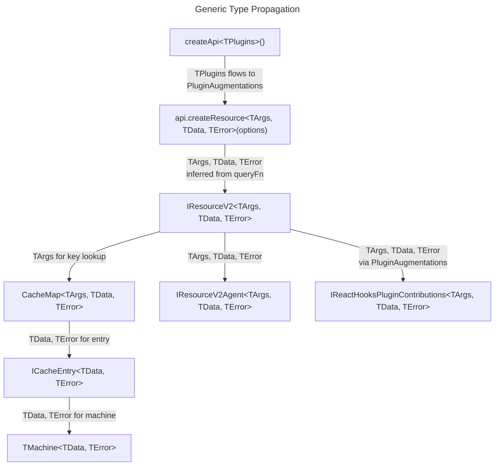

# Domain Model: Query v2 Module

## 1. Core Type Definitions

### 1.1 `createApi` — Options and Instance

```ts
/** Options for createApi factory */
interface ICreateApiOptions<TPlugins extends IPlugin[] = []> {
  keyPrefix?: string | null;
  keyStrategy?: 'serialize' | 'compare';
  serializeArgs?: TSerializeArgsFn;
  compareArg?: TCompareArgsFn;
  initialSnapshot?: TApiSnapshot | null;
  cacheLifetime?: number;
  plugins?: TPlugins;
  maxSnapshotDataAge?: number;
  doCacheArgs?: boolean;
}

/** API instance returned by createApi */
interface IApi<TPlugins extends IPlugin[] = []> {
  createResource<TArgs, TData, TError = Error>(
    options: IResourceV2Options<TArgs, TData, TError>
  ): IResourceV2<TArgs, TData, TError> & PluginAugmentations<TPlugins, TArgs, TData, TError>;

  resetAll(): void;
  getSnapshot(): TApiSnapshot;
}
```

### 1.2 `ResourceV2` — Options and Instance

```ts
/** Query function signature */
type TQueryFn<TArgs, TData> = (
  args: TArgs,
  tools: TQueryFnTools
) => Promise<TData>;

interface TQueryFnTools {
  abortSignal: AbortSignal;
}

/** Options for api.createResource */
interface IResourceV2Options<TArgs, TData, TError = Error> {
  key?: string;
  queryFn: TQueryFn<TArgs, TData>;
  onCacheEntryAdded?: TOnCacheEntryAdded<TArgs, TData>;
  onQueryStarted?: TOnQueryStarted<TArgs, TData>;
  serializeArgs?: TSerializeArgsFn;
  compareArg?: TCompareArgsFn;
  cacheLifetime?: number;
  beforeDevtoolsPush?: TBeforeDevtoolsPushFn<TMachine<TData, TError>>;
  maxSnapshotDataAge?: number;
  doCacheArgs?: boolean;
}

/** ResourceV2 instance (public API) */
interface IResourceV2<TArgs, TData, TError = Error> {
  /** Create an agent (observer with SWR) */
  createAgent(): IResourceV2Agent<TArgs, TData, TError>;

  /** Execute query, returns promise of cache entry */
  query(args: TArgs, doForce?: boolean): Promise<ICacheEntry<TData, TError>>;

  /** Reactive query — returns current machine state as signal read */
  query$(args: TArgs, doForce?: boolean): TMachine<TData, TError>;

  /** Get raw cache entry (non-reactive) */
  entry(args: TArgs, doInitiate?: boolean): ICacheEntry<TData, TError> | null;

  /** Get cache entry signal (reactive) */
  entry$(args: TArgs, doInitiate?: boolean): TMachine<TData, TError>;

  /** Force re-fetch for given args */
  invalidate(args: TArgs): void;

  /** Compare two args values */
  compareArgs(a: TArgs, b: TArgs): boolean;
}
```

### 1.3 Machine Classes

#### Union Type and Status

```ts
/** Discriminated union of all machine states */
type TMachine<TData, TError = Error> =
  | MachineIdle
  | MachinePending<TData>
  | MachineSuccess<TData>
  | MachineError<TError>
  | MachineRefreshing<TData>;

type TMachineStatus = 'idle' | 'pending' | 'success' | 'error' | 'refreshing';
```

#### State Shapes

```ts
interface TResourceV2IdleState {
  status: 'idle';
  args: null;
  data: null;
  error: null;
  updatedAt: null;
}

interface TResourceV2PendingState<TData = unknown> {
  status: 'pending';
  args: unknown; // TArgs from context
  data: null;
  error: null;
  updatedAt: null;
  originalData: TData | typeof NO_VALUE;
}

interface TResourceV2SuccessState<TData = unknown> {
  status: 'success';
  args: unknown;
  data: TData;
  error: null;
  updatedAt: number;
  originalData: TData | typeof NO_VALUE;
  patches: TResourceV2Patch[] | null;
}

interface TResourceV2ErrorState<TError = Error> {
  status: 'error';
  args: unknown;
  data: null;
  error: TError;
  updatedAt: null;
}

interface TResourceV2RefreshingState<TData = unknown> {
  status: 'refreshing';
  args: unknown;
  data: TData;
  error: null;
  updatedAt: number;
  originalData: TData | typeof NO_VALUE;
  patches: TResourceV2Patch[] | null;
}
```

#### Machine Classes

```ts
/** MachineIdle — initial state, no data */
class MachineIdle {
  readonly state: TResourceV2IdleState;

  start(args: unknown): MachinePending;
  reset(): MachineIdle; // identity

  static create(): MachineIdle;
}

/** MachinePending — query in progress, no data yet */
class MachinePending<TData = unknown> {
  readonly state: TResourceV2PendingState<TData>;

  successHappened(data: TData): MachineSuccess<TData>;
  errorHappened(error: unknown): MachineError;
  reset(): MachineIdle;

  static create(args: unknown): MachinePending;
}

/** MachineWithData — abstract base for patch-capable machines */
abstract class MachineWithData<TData = unknown> {
  abstract readonly state: { data: TData; originalData: TData | typeof NO_VALUE; patches: TResourceV2Patch[] | null };

  addPatch(patch: TResourceV2Patch): this;
  finishPatch(type: 'commit' | 'abort', patch: TResourceV2Patch): this;
  createPatch(patchFn: TPatchFn<TData>): { machine: this; patch: TResourceV2Patch };

  /** Abort all pending patches (for cleanup / hanging patch fix) */
  abortAllPendingPatches(): this;
}

/** MachineSuccess — data loaded successfully */
class MachineSuccess<TData = unknown> extends MachineWithData<TData> {
  readonly state: TResourceV2SuccessState<TData>;

  invalidate(): MachineRefreshing<TData>;
  reset(): MachineIdle;

  static create(data: TData, args: unknown): MachineSuccess<TData>;
  static deploy(snapshotSlice: TResourceV2SnapshotSlice): MachineSuccess;
}

/** MachineError — query failed */
class MachineError<TError = Error> {
  readonly state: TResourceV2ErrorState<TError>;

  retry(): MachinePending;
  start(args: unknown): MachinePending;
  reset(): MachineIdle;

  static create(error: TError, args: unknown): MachineError<TError>;
}

/** MachineRefreshing — re-fetching while holding stale data */
class MachineRefreshing<TData = unknown> extends MachineWithData<TData> {
  readonly state: TResourceV2RefreshingState<TData>;

  successHappened(data: TData): MachineSuccess<TData>;
  errorHappened(error: unknown): MachineSuccess<TData>; // preserves stale data
  reset(): MachineIdle;

  static create(data: TData, args: unknown, updatedAt: number): MachineRefreshing<TData>;
}

/** Static factory/router for snapshot rehydration */
namespace Machine {
  function idle(): MachineIdle;

  /** Rehydrate from serialized state */
  function fromSnapshot<TData>(
    state: { status: TMachineStatus } & Record<string, unknown>
  ): TMachine<TData>;
}
```

### 1.4 `MachineWithData` Base Class

Shared base for `MachineSuccess` and `MachineRefreshing`. Provides patch methods that delegate to `Patcher` static utilities. [ref: [04-open-questions.md](../01-research/04-open-questions.md)#Q3]

```ts
abstract class MachineWithData<TData = unknown> {
  abstract readonly state: {
    data: TData;
    originalData: TData | typeof NO_VALUE;
    patches: TResourceV2Patch[] | null;
  };

  addPatch(patch: TResourceV2Patch): this {
    // Compute originalData (first patch captures it)
    // Append patch to queue
    // Resolve patches → new data
    // Return new instance of same type (MachineSuccess or MachineRefreshing)
  }

  finishPatch(type: 'commit' | 'abort', patch: TResourceV2Patch): this {
    // Delegate to Patcher.finishPatch
    // If no more pending patches → clear originalData
    // Return new instance
  }

  createPatch(patchFn: TPatchFn<TData>): { machine: this; patch: TResourceV2Patch } {
    // Delegate to Patcher.createPatch
    // Call addPatch with created patch
    // Return { machine, patch }
  }

  abortAllPendingPatches(): this {
    // Abort all pending patches in queue
    // Resolve data from originalData + remaining committed patches
    // Clear originalData if no pending left
    // Return new instance
  }
}
```

### 1.5 `ICacheEntry`

```ts
/** Single reactive cache unit holding a Machine */
interface ICacheEntry<TData, TError = Error> {
  /** Reactive signal holding current machine state */
  readonly machine$: SignalFn<TMachine<TData, TError>>;

  /** Synchronous peek at current machine */
  peek(): TMachine<TData, TError>;

  /** Update machine state */
  set(machine: TMachine<TData, TError>): void;

  /** Cleanup — complete and release */
  complete(): void;

  /** Observable for cache lifetime management */
  readonly onClean$: Observable<void>;
}
```

### 1.6 `CacheMap`

```ts
/** Dual-strategy cache abstraction */
interface ICacheMap<TArgs, TData, TError = Error> {
  get(args: TArgs): ICacheEntry<TData, TError> | undefined;
  set(args: TArgs, entry: ICacheEntry<TData, TError>): void;
  delete(args: TArgs): boolean;
  has(args: TArgs): boolean;
  values(): Iterable<ICacheEntry<TData, TError>>;
  entries(): Iterable<[TArgs | string, ICacheEntry<TData, TError>]>;
  clear(): void;
  readonly size: number;
}

/** Factory for creating appropriate cache map */
interface ICacheMapOptions<TArgs> {
  keyStrategy: 'serialize' | 'compare';
  serializeArgs: TSerializeArgsFn;
  compareArg: TCompareArgsFn;
  doCacheArgs: boolean;
}
```

**Implementation**: `CacheMap` is a concrete class with two internal strategies:
- `serialize` mode: wraps `Map<string, CacheEntry>`, uses `serializeArgs(args)` to produce string keys
- `compare` mode: wraps an array of `[TArgs, CacheEntry]` tuples with linear-scan lookup using `compareArg`
- Also optionally uses `WeakMap<object, string>` for serialization result caching when `doCacheArgs = true`

[ref: [04-open-questions.md](../01-research/04-open-questions.md)#Q7, [03-external-research.md](../01-research/03-external-research.md)#5.2]

### 1.7 `IResourceV2Agent`

```ts
/** Agent — observer with stale-while-revalidate */
interface IResourceV2Agent<TArgs, TData, TError = Error> {
  /** Reactive state (computed signal) */
  readonly state$: ComputeFn<IResourceV2AgentState<TArgs, TData, TError>>;

  /** Start query with new args (returns promise) */
  start(args: TArgs | SKIP_TOKEN): Promise<void>;

  /** Compare previous and new args */
  compareArgs(a: TArgs, b: TArgs): boolean;
}

/** Agent's computed state shape */
interface IResourceV2AgentState<TArgs, TData, TError = Error> {
  /** Current machine status */
  status: TMachineStatus;
  /** Current data (may be stale during loading) */
  data: TData | null;
  /** Current error */
  error: TError | null;
  /** Current args (fresh) */
  args: TArgs | null;
  /** Loading indicator */
  isLoading: boolean;
  /** True only on first load (no previous data) */
  isInitialLoading: boolean;
  /** True when refreshing existing data */
  isRefreshing: boolean;
  /** True when data is available */
  isSuccess: boolean;
  /** True when in error state */
  isError: boolean;
  /** Error from a failed background refresh (stale data preserved) */
  refreshError: TError | null;
}
```

[ref: [01-codebase-query-v1.md](../01-research/01-codebase-query-v1.md)#2.2 — v1 ResourceAgent stale-while-revalidate pattern]

### 1.8 `Patcher` Utility

```ts
/** Patch record in the queue */
interface TResourceV2Patch {
  patches: Patch[]; // Immer Patch[]
  inversePatches: Patch[];
  status: 'pending' | 'committed' | 'aborted';
}

/** Patch function (Immer recipe) */
type TPatchFn<TData> = (draft: TData) => void;

/** Static utility class for patch operations */
class Patcher {
  /**
   * Create a new patch from a mutation function.
   * Uses Immer produceWithPatches.
   */
  static createPatch<TData>(patchFn: TPatchFn<TData>, data: TData): TResourceV2Patch;

  /**
   * Resolve patch queue against original data.
   * Algorithm: apply committed (before first pending) → remove;
   *   apply pending → keep; apply committed (after pending) → keep;
   *   revert aborted (after pending if more pending follow) → keep;
   *   remove aborted (if no pending follow).
   */
  static resolvePatches<TData>(originalData: TData, patches: TResourceV2Patch[]): TData;

  /**
   * Mark a patch as committed or aborted and resolve the queue.
   * Returns new { originalData, patches } — originalData becomes NO_VALUE
   * when no pending patches remain (cleanup).
   */
  static finishPatch<TData>(
    originalData: TData | typeof NO_VALUE,
    patches: TResourceV2Patch[] | null,
    type: 'commit' | 'abort',
    patch: TResourceV2Patch
  ): { originalData: TData | typeof NO_VALUE; patches: TResourceV2Patch[] | null };
}
```

[ref: [01-codebase-query-v1.md](../01-research/01-codebase-query-v1.md)#2.3 — v1 ResourceRef patch algorithm]

### 1.9 Plugin System

```ts
/** Plugin interface — all plugins must implement this */
interface IPlugin {
  /** Unique plugin name */
  readonly name: string;

  /** Called once when createApi installs the plugin */
  install(context: IPluginContext): void;

  /** Called for each createResource — returns augmented resource */
  augmentResource<TArgs, TData, TError>(
    resource: IResourceV2<TArgs, TData, TError>,
    options: IResourceV2Options<TArgs, TData, TError>
  ): Record<string, unknown>;
}

/** Context provided to plugins during install */
interface IPluginContext {
  /** The API instance */
  readonly api: IApi<any>;
  /** Key strategy for this API */
  readonly keyStrategy: 'serialize' | 'compare';
}

/**
 * Type-level utility: extracts augmentations from a plugin.
 * Each plugin defines its contributions via a TypeScript interface.
 */
type PluginAugmentations<
  TPlugins extends IPlugin[],
  TArgs,
  TData,
  TError
> = TPlugins extends []
  ? {}
  : Prettify<UnionToIntersection<
      TPlugins[number] extends infer P
        ? P extends IPlugin
          ? ExtractPluginContributions<P, TArgs, TData, TError>
          : never
        : never
    >>;
```

[ref: [03-external-research.md](../01-research/03-external-research.md)#4 — plugin system patterns]

### 1.10 `ReactHooksPlugin`

```ts
interface IReactHooksPluginContributions<TArgs, TData, TError> {
  /** Hook for reactive query + agent in React components */
  useResourceV2Agent(
    args: TArgs | SKIP_TOKEN
  ): IResourceV2AgentState<TArgs, TData, TError>;

  /** Hook for imperative cache entry access in React */
  useResourceV2Ref(
    args: TArgs | SKIP_TOKEN
  ): IResourceV2Ref<TArgs, TData, TError>;
}

class ReactHooksPlugin implements IPlugin {
  readonly name = 'ReactHooksPlugin';

  install(context: IPluginContext): void;

  augmentResource<TArgs, TData, TError>(
    resource: IResourceV2<TArgs, TData, TError>,
    options: IResourceV2Options<TArgs, TData, TError>
  ): IReactHooksPluginContributions<TArgs, TData, TError>;
}
```

**Type-level integration**: When `ReactHooksPlugin` is in the plugins array, `createResource` return type includes `IReactHooksPluginContributions<TArgs, TData, TError>` via `PluginAugmentations`. See [ADR-1 in 04-decisions.md](./04-decisions.md#adr-1).

[ref: [01-codebase-query-v1.md](../01-research/01-codebase-query-v1.md)#4 — v1 React hooks pattern]

### 1.11 SSR Snapshot Types

> **Cross-reference**: These types (`TApiSnapshot`, `TResourceSnapshot`, `TResourceV2SnapshotSlice`) are referenced by the SSR architecture (see [01-architecture.md §6.9](./01-architecture.md#69-ssr-snapshot-layer)), the SSR data flow (see [02-dataflow.md §5](./02-dataflow.md#5-ssr--snapshot-lifecycle)), and the `Machine.fromSnapshot()` static factory in [§1.3 Machine Classes](#13-machine-classes) above.

```ts
/** Full API snapshot for SSR */
interface TApiSnapshot {
  /** Format version (integer counter) */
  version: number;
  /** keyPrefix of the API instance */
  keyPrefix: string | null;
  /** Resource snapshots keyed by resource key */
  resources: Record<string, TResourceSnapshot>;
}

/** Single resource snapshot */
interface TResourceSnapshot {
  /** Cache entries keyed by serialized args */
  entries: Record<string, TResourceV2SnapshotSlice>;
}

/** Single cache entry snapshot */
interface TResourceV2SnapshotSlice<TData = unknown> {
  status: 'success'; // only success entries are snapshotted
  args: unknown;
  data: TData;
  updatedAt: number;
}
```

[ref: [04-open-questions.md](../01-research/04-open-questions.md)#Q17 — integer version counter]

### 1.12 `SKIP_TOKEN` and `NO_VALUE`

```ts
/** SKIP token — prevents query execution */
const SKIP: unique symbol = Symbol('SKIP');
type SKIP_TOKEN = typeof SKIP;

/** NO_VALUE sentinel — distinguishes "no data yet" from "data is null" */
const NO_VALUE: unique symbol = Symbol('NO_VALUE');
type NO_VALUE = typeof NO_VALUE;
```

[ref: [04-open-questions.md](../01-research/04-open-questions.md)#Q6 — NO_VALUE as symbol sentinel]

### 1.13 Lifecycle Hook Types

```ts
/** Tools provided to onCacheEntryAdded */
interface TCacheEntryAddedTools<TData> {
  /** Resolves when first MachineSuccess is set */
  $cacheDataLoaded: Promise<TData>;
  /** Resolves when cache entry is removed */
  $cacheEntryRemoved: Promise<void>;
  /** Get current machine state */
  getCacheEntry(): TMachine<TData, any>;
}

/** onCacheEntryAdded callback type */
type TOnCacheEntryAdded<TArgs, TData> = (
  args: TArgs,
  tools: TCacheEntryAddedTools<TData>
) => void | Promise<void>;

/** Tools provided to onQueryStarted */
interface TQueryStartedTools<TData> {
  /** Resolves/rejects when query completes */
  $queryFulfilled: Promise<{ data: TData; isError: false }>;
  /** Get current cache entry for patching */
  getCacheEntry(): ICacheEntry<TData, any>;
}

/** onQueryStarted callback type */
type TOnQueryStarted<TArgs, TData> = (
  args: TArgs,
  tools: TQueryStartedTools<TData>
) => void | Promise<void>;
```

[ref: [01-codebase-query-v1.md](../01-research/01-codebase-query-v1.md)#2.6 — v1 QueriesLifetimeHooks, [03-external-research.md](../01-research/03-external-research.md)#1.3 — RTK Query lifecycle hooks]

### 1.14 `beforeDevtoolsPush` Callback

```ts
/**
 * Intercepts machine state before pushing to Redux DevTools.
 * Default behavior: push machine.state (plain object).
 * User can transform or filter.
 */
type TBeforeDevtoolsPushFn<TMachineState> = (
  newValue: TMachineState,
  push: (value: TMachineState) => void
) => void;
```

[ref: [02-codebase-signals-common.md](../01-research/02-codebase-signals-common.md)#2.6 — Devtools.ts beforeDevtoolsPush pattern]

### 1.15 Serialization / Comparison Function Types

```ts
/** Serialize args to string cache key */
type TSerializeArgsFn = (args: unknown) => string;

/** Compare two args for equality (used in 'compare' strategy) */
type TCompareArgsFn = (a: unknown, b: unknown) => boolean;
```

### 1.16 `IResourceV2Ref` (Imperative Handle)

```ts
/** Ref — imperative access to a specific cache entry by args */
interface IResourceV2Ref<TArgs, TData, TError = Error> {
  /** Check if cache entry exists */
  readonly has: boolean;
  /** Lock cache entry (prevent eviction) */
  lock(): { unlock: () => void };
  /** Invalidate (force re-fetch) */
  invalidate(): void;
  /** Create optimistic patch */
  createPatch(patchFn: TPatchFn<TData>): {
    commit: () => void;
    abort: () => void;
  } | null;
  /** Pre-populate cache with data */
  create(data: TData): void;
}
```

## 2. Entity Relationship Diagram

```mermaid
---
title: "Entity Relationships — Query v2"
---
erDiagram
    IApi ||--o{ IResourceV2 : "createResource()"
    IApi ||--o{ IPlugin : "plugins[]"
    IApi ||--|| TApiSnapshot : "getSnapshot()"

    IResourceV2 ||--|| CacheMap : "owns"
    IResourceV2 ||--o{ IResourceV2Agent : "createAgent()"
    IResourceV2 ||--o{ IResourceV2Ref : "via ReactHooksPlugin"
    IResourceV2 ||--|| LifecycleHooks : "delegates to"

    CacheMap ||--o{ ICacheEntry : "stores"
    ICacheEntry ||--|| TMachine : "holds (signal)"

    TMachine ||--|| MachineIdle : "is"
    TMachine ||--|| MachinePending : "is"
    TMachine ||--|| MachineSuccess : "is"
    TMachine ||--|| MachineError : "is"
    TMachine ||--|| MachineRefreshing : "is"

    MachineSuccess ||--|| MachineWithData : "extends"
    MachineRefreshing ||--|| MachineWithData : "extends"

    MachineWithData ||--o{ TResourceV2Patch : "patches[]"
    MachineWithData ..|| Patcher : "delegates to"

    TApiSnapshot ||--o{ TResourceSnapshot : "resources{}"
    TResourceSnapshot ||--o{ TResourceV2SnapshotSlice : "entries{}"

    IPlugin ||--|| ReactHooksPlugin : "implements"
    IResourceV2Agent ||--|| ICacheEntry : "subscribes to"
```

## 3. Generic Type Parameter Flow

Shows how `TArgs`, `TData`, `TError` propagate from `createApi` down through the system.



**Inference chain**:
1. `queryFn: (args: TArgs) => Promise<TData>` — `TArgs` and `TData` are inferred from the `queryFn` parameter type. No need to specify generics explicitly.
2. `TError` defaults to `Error` if not specified.
3. `TPlugins` propagates from `createApi` options through to `createResource` return type, where `PluginAugmentations` conditionally adds methods.
4. Within machines, `TData` parameterizes `MachineSuccess<TData>`, `MachineRefreshing<TData>`, `MachinePending<TData>` (for `originalData`). `TError` parameterizes `MachineError<TError>`.
5. `TMachine<TData, TError>` is the discriminated union seen by consumers.

## 4. State Machine Invariants

### 4.1 Machine State Invariants

| State | `data` | `error` | `args` | `updatedAt` | Patches allowed |
|-------|--------|---------|--------|-------------|-----------------|
| `idle` | `null` | `null` | `null` | `null` | No |
| `pending` | `null` | `null` | non-null | `null` | No |
| `success` | non-null | `null` | non-null | `number` | Yes |
| `error` | `null` | non-null | non-null | `null` | No |
| `refreshing` | non-null (stale) | `null` | non-null | `number` | Yes |

### 4.2 Transition Rules

| From | To | Method | Conditions |
|------|-----|--------|------------|
| `idle` | `pending` | `start(args)` | Always valid |
| `pending` | `success` | `successHappened(data)` | Query resolved |
| `pending` | `error` | `errorHappened(error)` | Query rejected |
| `pending` | `idle` | `reset()` | Abort + reset |
| `success` | `refreshing` | `invalidate()` | Re-fetch same args |
| `success` | `pending` | `start(args)` | New args (different from current) |
| `success` | `idle` | `reset()` | Full reset |
| `error` | `pending` | `retry()` / `start(args)` | Re-attempt |
| `error` | `idle` | `reset()` | Full reset |
| `refreshing` | `success` | `successHappened(data)` | Refresh resolved |
| `refreshing` | `success` | `errorHappened(error)` | Refresh failed → preserve stale data |
| `refreshing` | `idle` | `reset()` | Abort + reset |

### 4.3 Business Rules

1. **`reset()` on any state aborts all pending patches** — transitions to `MachineIdle`, calls `abortAllPendingPatches()` on `MachineWithData` states first.
2. **`CacheEntry` cleanup triggers `reset()`** — when cache lifetime expires and entry is evicted.
3. **Only one active fetch per CacheEntry** — new `start()` or `invalidate()` aborts the previous `AbortController`.
4. **`MachineRefreshing.errorHappened()` preserves stale data** — error is not stored on machine, but passed to lifecycle hooks.
5. **Snapshot only captures `MachineSuccess`** — other states are transient.
6. **Agent's `start(SKIP)` is a no-op** — does not modify agent state.
