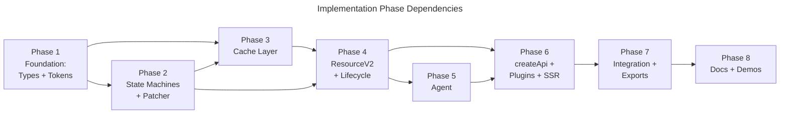

## Overview

Decomposes the approved query-v2 design into 8 sequential implementation phases — progressing from foundational types through machine classes, cache, resource orchestration, agent, API/plugin/SSR layers, integration testing, and documentation. Each phase produces compilable code with colocated tests, enforcing the invariant that `npm run ts-check` passes at every boundary. The plan covers all 9 ADRs, 16+ type definitions, 5 machine classes, dual-strategy cache, Patcher, Agent, createApi factory, ReactHooksPlugin, SSR snapshots, and 97 test cases from the design.

## Phase Map

## Phase Summary

| Phase | Name | Tasks | Complexity | Dependencies | Parallelizable |
|-------|------|-------|------------|--------------|----------------|
| 1 | Foundation — Types, Tokens, Utilities | 4 | Medium | None | — |
| 2 | State Machines + Patcher | 5 | High | Phase 1 | — |
| 3 | Cache Layer — CacheMap + CacheEntry | 3 | Medium | Phase 1, 2 | — |
| 4 | ResourceV2 Core + LifecycleHooks | 3 | High | Phase 2, 3 | — |
| 5 | ResourceV2Agent | 2 | Medium | Phase 4 | — |
| 6 | createApi + Plugin System + SSR Snapshots | 5 | High | Phase 4, 5 | — |
| 7 | Integration Tests + Barrel Export + Config | 4 | Medium | Phase 6 | — |
| 8 | Documentation + Demos | 4 | Low | Phase 7 | — |

## Execution Rules

- Every phase MUST leave the project in a compilable state (`npm run ts-check` passes).
- All new code resides under `src/query-v2/` — zero imports from `src/query/`.
- Tests use real `Signal.state`, `Signal.compute`, `Batcher` from `src/signals/` (no mocking signal primitives).
- Tests use real Immer for Patcher verification.
- `queryFn` in tests always uses controllable promises (resolve/reject on demand).
- Time-dependent tests use `vi.useFakeTimers()`.
- Code that is not yet tested must be tested within the next phase.
- Phase 2–3 dependency: CacheEntry tests may use machine instances from Phase 2 as fixtures.

## Documents

- [Phase 1: Foundation](./01-foundation.md)
- [Phase 2: State Machines + Patcher](./02-state-machines.md)
- [Phase 3: Cache Layer](./03-cache-layer.md)
- [Phase 4: ResourceV2 Core + LifecycleHooks](./04-resource-core.md)
- [Phase 5: ResourceV2Agent](./05-agent.md)
- [Phase 6: createApi + Plugins + SSR](./06-api-plugins-ssr.md)
- [Phase 7: Integration Tests + Exports](./07-integration-exports.md)
- [Phase 8: Documentation + Demos](./08-docs-demos.md)

## Quality Review

### Checklist

| # | Criterion | Status | Notes |
|---|-----------|--------|-------|
| 1 | Every design component mapped to task(s) | PASS | All 16 model types, 9 ADRs, 9 data flow diagrams, 12 risks, 11 use cases, 97 test cases, and all architecture components (createApi, ResourceV2, CacheMap, CacheEntry, 5 machine classes, MachineWithData, Patcher, Machine namespace, Agent, LifecycleHooks, Plugin system, ReactHooksPlugin, SSR Snapshot, SKIP_TOKEN, NO_VALUE, stableStringify) are mapped to specific tasks across 8 phases. Documentation and demo tasks traced to 07-docs.md. |
| 2 | File paths concrete and verified | PASS | All existing files referenced in the plan verified against repo: `src/common/utils/shallowEqual.ts`, `src/common/utils/PromiseResolver.ts`, `src/common/react/useConstant.ts`, `src/common/react/useEventHandler.ts`, `src/signals/`, `src/query/SKIP_TOKEN.ts`, `src/query/react/useResourceAgent.ts`, `src/query/react/useResourceRef.ts`, `vitest.config.ts`, `src/index.ts`, `docs/query/README.md`, `docs/migrations/0.5.0.md`, `apps/demos/src/examples/query/simple-list.tsx`, `apps/demos/src/examples/query/todo-patches.tsx`, `apps/demos/src/examples/index.ts`, `src/__tests__/setup.ts`. Target directory `src/query-v2/` confirmed not to exist yet. |
| 3 | Phase dependencies correct | PASS | Dependency graph verified: P1→P2, P1→P3, P2→P3, P2→P4, P3→P4, P4→P5, P4→P6, P5→P6, P6→P7, P7→P8. No circular dependencies. Mermaid graph matches stated dependencies in each phase file. Transitive dependencies (e.g., P4 implicitly requires P1 through P2+P3) are correctly covered. |
| 4 | Verification criteria per phase | PASS | All 8 phases have detailed verification checklists. Every phase starts with `npm run ts-check` passes. Phase 2 has 9 criteria, Phase 4 has 11 criteria, Phase 6 has 13 criteria — thorough. |
| 5 | Each phase leaves project compilable | PASS | Every phase includes `npm run ts-check` as first verification criterion. README states "Every phase MUST leave the project in a compilable state". Phase 1 creates only types/tokens (compilable). Phase 2 adds machines+tests (compilable). Progressive build-up verified through all 8 phases. |
| 6 | No vague tasks — exact files and changes | PASS | All 30 tasks across 8 phases specify exact file paths, action types (Create/Modify), and concrete descriptions of what to implement. Task 2.2 explicitly presents two options for the `MachineSuccess.start()` inconsistency with a recommendation. No "improve X" or "refactor Y" vague language found. |
| 7 | Design traceability (`[ref: ...]`) on all tasks | PASS | All 30 tasks include `[ref: ...]` citations to specific design document sections: model (§1.1–§1.16), dataflow (§1–§9), architecture (§4, §5, §7), decisions (ADR-1 through ADR-9), test cases (§1–§11), docs (07-docs.md), and risks (R1). Cross-references verified against design document structure. |
| 8 | Parallel/sequential correctly marked | PASS | All 8 phases are sequential — correct, given the strict dependency chain. Phase summary table marks all as "—" for Parallelizable. Within the dependency graph, no two phases can truly run in parallel (every phase depends on at least one earlier phase except P1). |
| 9 | Complexity estimates present (L/M/H) | PASS | All 30 tasks have per-task complexity (Low/Medium/High). Phase-level complexity in summary table present and reasonable: Phase 2 (High — 5 machine classes + Patcher + 29 unit tests), Phase 6 (High — createApi + plugins + SSR + 24 tests), Phase 8 (Low — docs only). |
| 10 | Documentation tasks proportional to existing docs/demos | PASS | Existing: `docs/query/README.md` (1 doc page), 5 query demos, signals and other docs. Planned: 4 new doc pages (justified — SSR, plugins, optimistic updates have no v1 equivalent), 2 existing page updates (minor), 1 migration guide, 2–3 new demos (less than v1's 5, proportional to experimental status). Matches design's 07-docs.md scope. |
| 11 | Mermaid dependency graph present | PASS | Phase Map section contains a complete Mermaid `graph LR` diagram titled "Implementation Phase Dependencies" with all 8 phases and 10 dependency edges. All edges verified against individual phase dependency declarations. |
| 12 | Phase summary table complete | PASS | Table has all 8 phases with columns: Phase, Name, Tasks, Complexity, Dependencies, Parallelizable. Task counts verified: 4+5+3+3+2+5+4+4 = 30 tasks total. All counts match actual tasks in phase files. |
| 13 | Known issue tracked: `MachineSuccess.start(args)` | PASS | Task 2.2 explicitly tracks the inconsistency between model §1.3 (no `start`), transition table §4.2 row 6 (`start`), test M5 (`start`), and state diagram §5 (no `start`). Presents two resolution options (A: add, B: remove) with recommendation for Option A. Placed in Phase 2 (early). |
| 14 | Test coverage mapping: 06-testcases.md → phases | PASS | All 97 test cases mapped: M1–M17 → Phase 2; C1–C11 → Phase 3; P1–P12 → Phase 2; R1–R12 → Phase 4; A1–A8 → Phase 5; API1–API7 → Phase 6; S1–S8 → Phase 6; PL1–PL6 → Phase 6; L1–L9 → Phase 4; D1–D4 → Phase 3+6; E1–E12 → Phases 2–5. Correctness Verification #1–#5 → Phase 7 integration tests. |
| 15 | Risk mitigation: high-impact risks addressed early | PASS | R3 (hanging patch, H impact) → Phase 2 (Patcher P12, abortAllPendingPatches) + Phase 3 (CacheEntry ADR-4 Layer 3) + Phase 4 (E9, E10). R5 (signals integration, H impact) → Phase 3–5 (real signals in all integration tests, E8, E12). R1 (TS2589, H impact) → Phase 1 (PluginAugmentations type defined) + Phase 6 (PL6 validation with 2 plugins). R2 (instanceof SSR, H impact) → Phase 6 (S7, S8, Machine.fromSnapshot). R8 (breaking changes, H impact) → Phase 8 (experimental marking). |

### Documentation Proportionality

Existing documentation: `docs/query/README.md`, docs for signals, options, devtools, and 1 migration guide (`0.5.0.md`). Demo directory: 5 query examples (duplicator, shopping-cart, simple-list, todo-patches, user-profile) plus signals examples. Planned v2 additions: 4 new doc pages (justified — SSR, plugin system, optimistic updates, API reference all cover topics without v1 equivalents), 2 minor existing page updates, 1 migration guide, 2–3 new demos. Proportional to feature scope. Demo count intentionally lower than v1's 5, appropriate for experimental phase.

### Issues Found

1. **Low — Architecture folder structure doesn't list `lib/stableStringify.ts`**: The plan correctly creates `src/query-v2/lib/stableStringify.ts` (Task 1.3) as the default `serializeArgs` implementation needed by `CacheMap`. However, the design's architecture §4 folder layout only lists `SKIP_TOKEN.ts` and `NO_VALUE.ts` under `lib/`. This is a design gap that the plan fills correctly — no plan change needed, but the design architecture §4 has a minor omission.
   - Where: `01-foundation.md` Task 1.3 vs `01-architecture.md` §4
   - Expected: Architecture §4 should have listed `stableStringify.ts` under `lib/`
   - Severity: Low
   - Checklist ref: #2

2. **Low — R1 (TS2589) early type prototype not tracked as dedicated task**: Risk R1 mitigation step 1 recommends "create a standalone type prototype file before implementing the full ResourceV2". The plan defines `PluginAugmentations` in Phase 1 (Task 1.1, `plugin.types.ts`) but the full 2-plugin type validation test is only in Phase 6 (Task 6.4, PL6). TS2589 issues would surface during Phase 1 type compilation, but the explicit prototype with 2 mock plugins as recommended by the risk mitigation plan is deferred to Phase 6.
   - Where: Cross-reference `08-risks.md` R1 mitigation step 1 vs Phase 6 Task 6.4
   - Expected: Optional — a Phase 1 subtask or note about verifying `PluginAugmentations` compiles with 2+ mock plugins
   - Severity: Low
   - Checklist ref: #15

3. **Low — `ICacheEntry.onClean$: Observable<void>` from model not addressed in plan**: Model §1.5 defines `onClean$: Observable<void>` on `ICacheEntry`, but plan Task 3.2 describes CacheEntry purely via Signal.state per ADR-7 and does not mention `onClean$`. This property may be a remnant from an earlier BehaviorSubject-based design iteration. The implementer may need clarification on whether to implement it as a signal-based cleanup observable or omit it.
   - Where: `03-cache-layer.md` Task 3.2 vs `03-model.md` §1.5
   - Expected: Task 3.2 should acknowledge `onClean$` and either implement it or explicitly note it's replaced by the `complete()` method per ADR-7
   - Severity: Low
   - Checklist ref: #6

## Next Steps

Proceeds to implementation after human review. Each phase will be executed sequentially by coder agents, with verification at each boundary before proceeding to the next phase.
