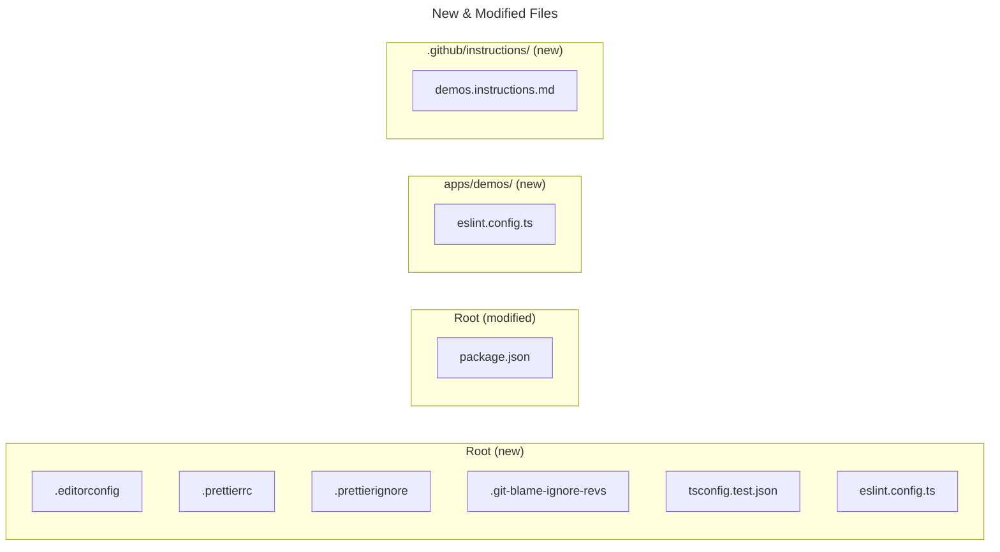
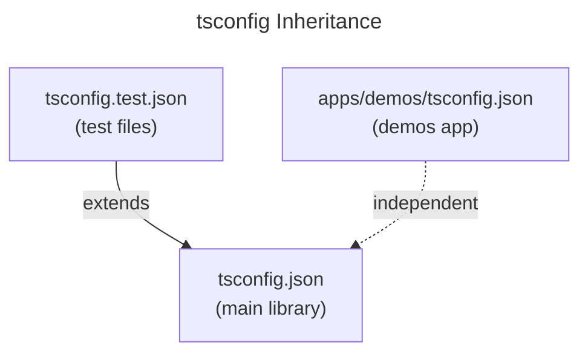
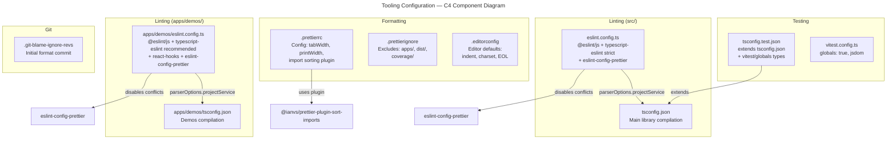

# Tooling Configuration Architecture

## 1. Tool Selection Summary

| Tool | Purpose | Key Decision |
|------|---------|-------------|
| **Prettier** | Code formatting (whitespace, quotes, semicolons, import sorting) | `src/` only; `@ianvs/prettier-plugin-sort-imports` for import ordering [ref: ../01-research/03-open-questions.md#Q1] |
| **ESLint** | Static analysis (correctness, best practices) | Separate `eslint.config.ts` for `src/` and `apps/demos/`; flat config with `jiti` [ref: ../01-research/03-open-questions.md#Q3] |
| **tsconfig.test.json** | TypeScript types for vitest globals in test files | Extends `tsconfig.json`, adds `vitest/globals` to `types` [ref: ../01-research/03-open-questions.md#Q2] |
| **EditorConfig** | Editor-level defaults for all file types | Covers indent, charset, EOL, trailing whitespace [ref: ../01-research/03-open-questions.md#Q11] |
| **eslint-config-prettier** | Disable ESLint rules that conflict with Prettier | Required since both tools run on `src/` [ref: ../01-research/02-external-research.md#prettier-eslint-coexistence-eslint-config-prettier] |

## 2. File Tree — New and Modified Files

```
rx-toolkit/                          (repository root)
├── .editorconfig                    [NEW]   — editor-level defaults
├── .prettierrc                      [NEW]   — Prettier config with import sorting
├── .prettierignore                  [NEW]   — excludes apps/demos/, dist/, coverage/
├── .git-blame-ignore-revs           [NEW]   — ignore formatting commit in git blame
├── tsconfig.test.json               [NEW]   — test file types (extends tsconfig.json)
├── eslint.config.ts                 [NEW]   — ESLint config for src/
├── package.json                     [MODIFIED] — new devDependencies + scripts
├── apps/
│   └── demos/
│       └── eslint.config.ts         [NEW]   — ESLint config for apps/demos/
└── .github/
    └── instructions/
        └── demos.instructions.md    [NEW]   — AI instructions for apps/demos/
```



## 3. Config File Layout

### Root-level files

All shared tooling configs live at the repository root. This is the standard location for Prettier, ESLint, EditorConfig, and tsconfig files. The root ESLint config covers `src/` exclusively.

| File | Scope | Rationale |
|------|-------|-----------|
| `.editorconfig` | All files in repo | Universal editor defaults [ref: ../01-research/02-external-research.md#supported-formats] |
| `.prettierrc` | `src/` only (via `.prettierignore`) | Single Prettier config at root; demos excluded per user decision [ref: ../01-research/03-open-questions.md#Q14] |
| `.prettierignore` | — | Excludes `apps/`, `dist/`, `coverage/`, `node_modules/` |
| `.git-blame-ignore-revs` | — | Lists the initial formatting commit SHA |
| `tsconfig.test.json` | Test files in `src/` | Extends root `tsconfig.json` [ref: ../01-research/02-external-research.md#established-practices] |
| `eslint.config.ts` | `src/**/*.ts` | Root ESLint for library code |

### `apps/demos/` files

| File | Scope | Rationale |
|------|-------|-----------|
| `eslint.config.ts` | `apps/demos/src/**/*.{ts,tsx,mdx}` | Separate config per user decision; different stack (React, JSX, MDX, HeroUI) [ref: ../01-research/03-open-questions.md#Q4] |

### `.github/instructions/` files

| File | `applyTo` | Rationale |
|------|-----------|-----------|
| `demos.instructions.md` | `apps/demos/**` | Single file covering page, example, and scope workflows [ref: ../01-research/03-open-questions.md#Q13] |

## 4. Dependency Inventory

All packages go into root `devDependencies` unless noted.

### Formatting

| Package | Purpose | Notes |
|---------|---------|-------|
| `prettier` | Code formatter | Core tool [ref: ../01-research/01-codebase-analysis.md#3-formatting-status] |
| `@ianvs/prettier-plugin-sort-imports` | Import sorting via Prettier | User chose Prettier plugin over ESLint [ref: ../01-research/03-open-questions.md#Q1] |

### Linting (root — `src/`)

| Package | Purpose | Notes |
|---------|---------|-------|
| `eslint` | Linter core | Required for all ESLint functionality |
| `@eslint/js` | Core JS recommended rules (`js.configs.recommended`) | Base layer [ref: ../01-research/02-external-research.md#preset-packages] |
| `typescript-eslint` | TS parser + rule presets (`strict`) | Provides `tseslint.configs.strict` [ref: ../01-research/02-external-research.md#recommended-rule-sets-for-a-library-project] |
| `eslint-config-prettier` | Disables ESLint rules conflicting with Prettier | Must be last in config chain [ref: ../01-research/02-external-research.md#prettier-eslint-coexistence-eslint-config-prettier] |
| `jiti` | Enables `eslint.config.ts` format | Required for TS config files [ref: ../01-research/03-open-questions.md#Q3] |

### Linting (`apps/demos/`)

| Package | Purpose | Install location |
|---------|---------|-----------------|
| `eslint` | Linter core | `apps/demos` devDependencies |
| `@eslint/js` | Core JS recommended rules | `apps/demos` devDependencies |
| `typescript-eslint` | TS parser + rule presets | `apps/demos` devDependencies |
| `eslint-plugin-react-hooks` | Rules of Hooks enforcement | `apps/demos` devDependencies [ref: ../01-research/02-external-research.md#preset-packages] |
| `eslint-config-prettier` | Prettier conflict resolution | `apps/demos` devDependencies |
| `jiti` | TS config support | `apps/demos` devDependencies |

> **Note**: `eslint-plugin-react` is excluded initially. The `react-hooks` plugin is the highest-value React lint plugin (enforces Rules of Hooks). Full `eslint-plugin-react` adds complexity for rules that are largely covered by TypeScript and modern React 19 patterns (no prop-types needed). Can be added later.

### Not included (discretionary decisions)

| Package | Decision | Rationale |
|---------|----------|-----------|
| `eslint-plugin-import-x` | **Skip** | TypeScript's `tsc --noEmit` already catches unresolved imports; `@ianvs/prettier-plugin-sort-imports` handles ordering; adding `import-x` requires resolver configuration for `@/*` aliases — overhead not justified for initial setup [ref: ../01-research/03-open-questions.md#Q9] |
| `eslint-plugin-simple-import-sort` | **Skip** | User chose Prettier plugin for import sorting [ref: ../01-research/03-open-questions.md#Q1] |
| `@testing-library/jest-dom` | **Remove** | Installed but completely unused — no test uses DOM matchers [ref: ../01-research/01-codebase-analysis.md#vitest-globals-usage-in-test-files]. Remove from `devDependencies` |

## 5. Config File Structures

### `.prettierrc` (root)

JSON format. Contains:
- `tabWidth: 4` — keep existing convention [ref: ../01-research/03-open-questions.md#Q7]
- `printWidth: 120` — user decision [ref: ../01-research/03-open-questions.md#Q12]
- `plugins` — `["@ianvs/prettier-plugin-sort-imports"]`
- `importOrder` — regex array for group ordering: builtins → third-party → `@/` aliases → `../` relative → `./` local, with blank line separators
- All other options left at Prettier defaults (double quotes, semicolons, trailing commas `"all"`, `arrowParens: "always"`) [ref: ../01-research/02-external-research.md#prettier-configuration-best-practices]

### `.prettierignore` (root)

Patterns:
- `apps/` — exclude demos from formatting [ref: ../01-research/03-open-questions.md#Q14]
- `dist/`
- `coverage/`
- `node_modules/`
- `*.md` — leave Markdown as-is (documentation has manual formatting)

### `.editorconfig` (root)

Sections:
- `[*]` — universal: `indent_style = space`, `indent_size = 4`, `end_of_line = lf`, `charset = utf-8`, `trim_trailing_whitespace = true`, `insert_final_newline = true`
- `[*.md]` — Markdown: `trim_trailing_whitespace = false` (trailing spaces are significant in Markdown)
- `[*.{json,yml,yaml}]` — data files: `indent_size = 2`

### `tsconfig.test.json` (root)

Extends `tsconfig.json`. Overrides:
- `compilerOptions.types`: `["vitest/globals"]` — provide vitest global types [ref: ../01-research/02-external-research.md#established-practices]
- `compilerOptions.noEmit`: `true` — test files are never compiled to JS
- `include`: `["src/**/*.test.ts", "src/__tests__/**"]` — covers all test files that the main tsconfig excludes [ref: ../01-research/01-codebase-analysis.md#root-tsconfigjson]
- `exclude`: removes the main tsconfig's test exclusions (by overriding `exclude` to just `["node_modules", "dist"]`)

### `eslint.config.ts` (root)

Structure:
1. **Base layer**: `@eslint/js` → `js.configs.recommended`
2. **TypeScript layer**: `tseslint.configs.strict` with typed linting (`parserOptions.projectService: true`) [ref: ../01-research/02-external-research.md#recommended-rule-sets-for-a-library-project]
3. **Prettier compat**: `eslint-config-prettier` as the last config entry
4. **Ignore patterns**: `dist/`, `coverage/`, `node_modules/`, `apps/`, `**/*.test.ts`, `src/__tests__/**` — this config covers `src/` production code only; test files are excluded from linting (type-checking handled by `tsconfig.test.json`)
5. File scope: `files: ["src/**/*.ts"]`

### `apps/demos/eslint.config.ts`

Structure:
1. **Base layer**: `@eslint/js` → `js.configs.recommended`
2. **TypeScript layer**: `tseslint.configs.recommended` (not `strict` — demos are less critical than library code)
3. **React Hooks**: `eslint-plugin-react-hooks` → `recommended` config
4. **Prettier compat**: `eslint-config-prettier` as the last config entry
5. File scope: `files: ["src/**/*.{ts,tsx}"]`
6. **Ignore patterns**: `node_modules/`

> The demos config uses `recommended` instead of `strict` because demos are a sandbox — prioritizing developer velocity over strict correctness.

## 6. ESLint Config Relationship

The two ESLint configs are **independent** — no shared base config file.

Rationale:
- The root config and demos config use different TypeScript preset levels (`strict` vs. `recommended`)
- The demos config needs React-specific plugins the root doesn't
- The root config needs `parserOptions.projectService` pointing at the root tsconfig; the demos config at `apps/demos/tsconfig.json`
- Creating a shared base would save ~5 lines of duplication but add abstraction overhead and a file that both configs depend on
- Both configs are small (~30-50 lines) — duplication is minimal and each is self-contained

Both configs independently include `@eslint/js` recommended and `eslint-config-prettier`. This minor duplication is acceptable for full independence and clarity.

## 7. `tsconfig.test.json` ↔ `tsconfig.json` Relationship



- `tsconfig.test.json` **extends** `tsconfig.json` via `"extends": "./tsconfig.json"` [ref: ../01-research/02-external-research.md#established-practices]
- Inherits all compiler options (strict, jsx, paths, module resolution)
- Overrides `include` to target test files, adds `types: ["vitest/globals"]`, sets `noEmit: true`
- The main `tsconfig.json` continues to exclude test files — this is correct because only the build toolchain uses it
- `apps/demos/tsconfig.json` remains fully independent (different target, different types, different include)

## 8. Component Diagram



## 9. `package.json` Script Additions

New scripts in the root `package.json`:

| Script | Command | Purpose |
|--------|---------|---------|
| `lint` | `eslint src/` | Lint library source code |
| `lint:fix` | `eslint src/ --fix` | Auto-fix lintable issues |
| `format` | `prettier --write src/` | Format library source code |
| `format:check` | `prettier --check src/` | CI check — verify formatting |
| `typecheck` | `tsc --noEmit` | Type-check library source (existing `ts-check` does the same — alias for consistency) |

> Note: `apps/demos/` linting is run separately from within its directory (e.g., `cd apps/demos && npx eslint src/`). Scripts for demos linting can be added to `apps/demos/package.json` later.
