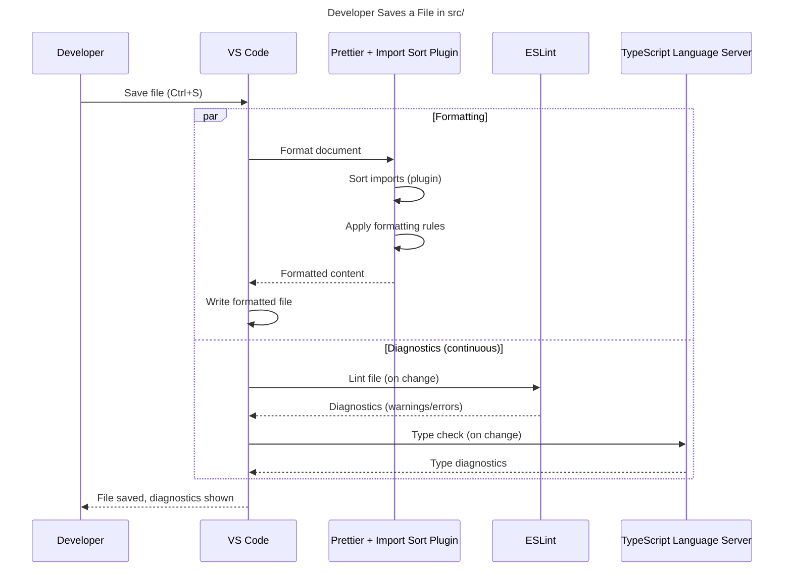
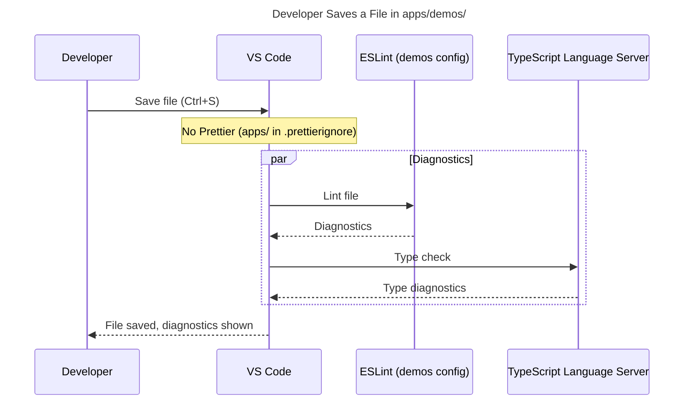
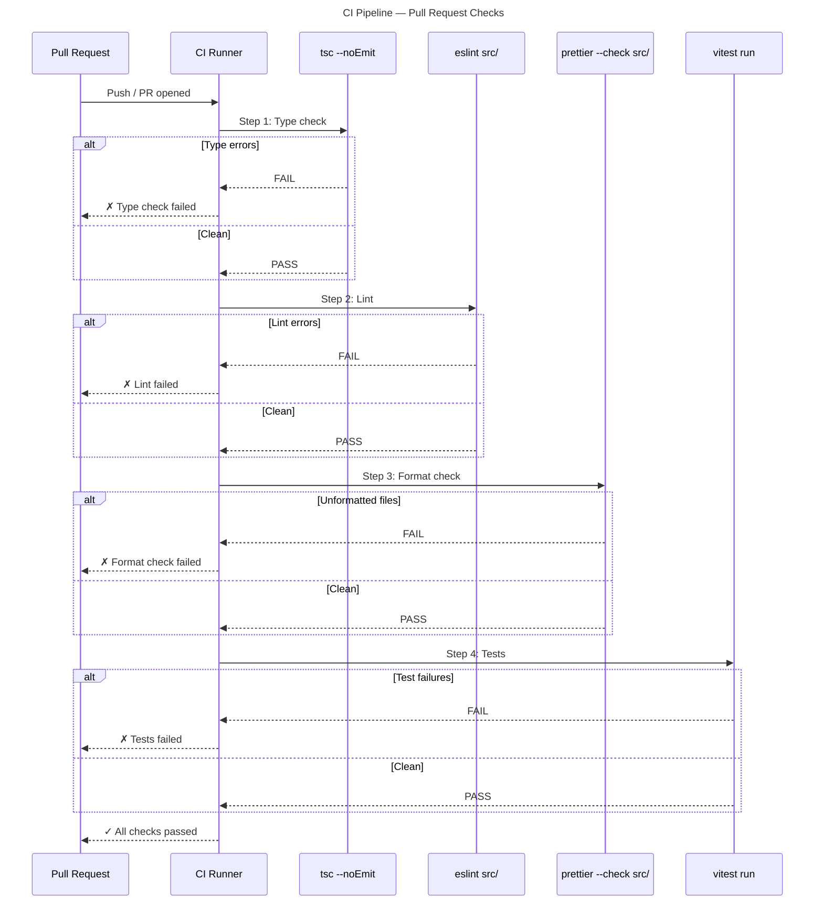

# Tool Interaction & Developer Workflow

## 1. Prettier ↔ ESLint Interaction

### Boundary Definition

Prettier and ESLint have **non-overlapping responsibilities** in this setup:

| Concern | Handled by | Examples |
|---------|-----------|----------|
| **Formatting** | Prettier | Indentation, quotes, semicolons, trailing commas, line wrapping, import sorting |
| **Correctness** | ESLint | Unused variables, type errors, unsafe `any` usage, Rules of Hooks |

This separation is the established best practice — running Prettier as an ESLint plugin (`eslint-plugin-prettier`) is explicitly discouraged by both projects [ref: ../01-research/02-external-research.md#prettier-eslint-coexistence-eslint-config-prettier].

### `eslint-config-prettier` Role

`eslint-config-prettier` is **required** in both ESLint configs. It disables all ESLint rules that would conflict with Prettier's formatting decisions [ref: ../01-research/02-external-research.md#prettier-eslint-coexistence-eslint-config-prettier].

Without it, `typescript-eslint` strict rules like `@typescript-eslint/indent` or `@typescript-eslint/comma-dangle` (if they existed in the preset) would conflict with Prettier's output. The `eslint-config-prettier` package automatically handles this for all known plugins including `@typescript-eslint`.

**Critical**: Plugin names in `eslint.config.ts` must use canonical names. If `typescript-eslint` is aliased to something else (e.g., `ts`), `eslint-config-prettier` won't disable its conflicting rules [ref: ../01-research/02-external-research.md#prettier-eslint-coexistence-eslint-config-prettier].

## 2. Prettier Import Sorting ↔ ESLint

### No Conflict by Design

The user chose `@ianvs/prettier-plugin-sort-imports` for import sorting (a Prettier plugin) and `eslint-plugin-simple-import-sort` is **not** included [ref: ../01-research/03-open-questions.md#Q1]. Additionally, `eslint-plugin-import-x` is not included [ref: ../01-research/03-open-questions.md#Q9].

This means:

- **No ESLint import ordering rules exist** — no `simple-import-sort/imports`, no `import-x/order`
- **No ESLint import validation rules exist** — no `import-x/no-unresolved`, no `import-x/no-duplicates`
- Import sorting happens **exclusively** during Prettier formatting
- Import resolution errors are caught by **TypeScript** (`tsc --noEmit`), not ESLint

### Consequence for CI

Import ordering is **not enforceable as a lint error** in CI. Instead, `prettier --check` will fail if imports are unsorted, since Prettier (with the import sorting plugin) treats import order as a formatting concern. This provides CI enforcement but reports it as a formatting violation rather than a lint error.

## 3. Editor Integration Flow

### On File Save (VS Code)

The recommended developer setup uses Prettier as the primary formatter via VS Code's `editor.formatOnSave` setting. ESLint runs separately for diagnostics.

**Key points**:
- Prettier runs **on save** via `editor.formatOnSave` — handles all formatting including import sorting
- ESLint runs **continuously** in the background via the ESLint VS Code extension — shows diagnostics in the Problems panel
- ESLint `editor.codeActionsOnSave` with `source.fixAll.eslint` is **not recommended** in conjunction with Prettier format-on-save to avoid race conditions. Prettier alone handles all formatting; ESLint auto-fix can be triggered manually if needed
- TypeScript language server runs continuously for type diagnostics

### On File Save (apps/demos/)

For `apps/demos/` files, Prettier is **not active** (excluded via `.prettierignore`). ESLint provides the only automated checking.

## 4. CI Pipeline Flow

### Recommended CI Commands

| Step | Command | Purpose | Fails if... |
|------|---------|---------|-------------|
| 1. Type check | `tsc --noEmit` | Verify library types compile | Type errors in `src/` |
| 2. Lint (src/) | `eslint src/` | Static analysis | ESLint errors in `src/` |
| 3. Format check | `prettier --check src/` | Verify formatting (incl. import order) | Any file in `src/` not formatted |
| 4. Test | `vitest run` | Unit tests | Test failures |

> **Note**: `apps/demos/` linting is a separate CI job or step that runs `cd apps/demos && npx eslint src/`. It is independent of the root pipeline and can be added incrementally.

### CI Sequence

### Parallel Optimization

Steps 1–3 (type check, lint, format check) are **independent** and can run in parallel in CI. Step 4 (tests) is also independent but typically the heaviest. A CI configuration could run all four in parallel for faster feedback.

## 5. Tool Execution Order — Local Development

When a developer works on a file, the recommended workflow is:

1. **Write code** — ESLint and TS diagnostics appear in real-time
2. **Save** — Prettier formats automatically (imports sorted, whitespace normalized)
3. **Review diagnostics** — fix any remaining ESLint errors shown in the Problems panel
4. **Commit** — all files are formatted and lint-clean

There is no `lint-staged` or `husky` pre-commit hook in the initial setup. The CI pipeline serves as the enforcement gate. Pre-commit hooks can be added later if needed.

## 6. Import Sorting — Detailed Flow

When Prettier formats a file with the `@ianvs/prettier-plugin-sort-imports` plugin:

1. Parser reads the file's import declarations
2. Plugin categorizes each import by matching against `importOrder` regex patterns:
   - `<BUILTIN_MODULES>` — Node.js built-ins (rare in browser code)
   - `<THIRD_PARTY_MODULES>` — anything from `node_modules` (`rxjs`, `react`, `immer`, etc.)
   - `^@/(.*)$` — path alias imports (`@/signals/...`, `@/query/...`)
   - `^\\.\\./(.*)`  — parent-relative imports (`../base/Batcher`)
   - `^\\./(.*)$` — sibling-relative imports (`./useSignal`)
3. Imports within each group are sorted alphabetically by specifier
4. Empty strings in the `importOrder` array produce blank lines between groups
5. The sorted imports replace the original import block

Side-effect imports (e.g., `import './styles.css'`) are **not reordered across groups** by the `@ianvs` plugin — this is a key safety feature [ref: ../01-research/02-external-research.md#import-sorting-plugins-comparison].
