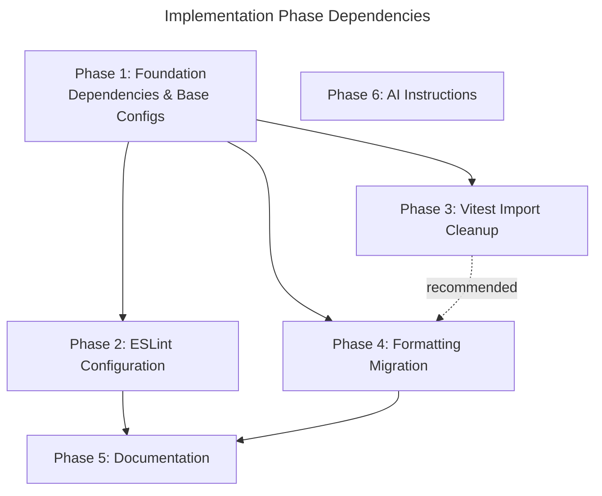

## Overview

Implement repository development tooling for `rx-toolkit`: Prettier formatting with import sorting, ESLint flat config for `src/` and `apps/demos/`, vitest global typing via `tsconfig.test.json`, `.editorconfig`, and an AI instruction file for `apps/demos/`. The plan includes two migration steps (initial formatting pass, vitest import removal) and documentation updates.

## Phase Map

## Phase Summary

| Phase | Name | Description | Dependencies | Parallelizable | Complexity |
|-------|------|-------------|--------------|----------------|------------|
| 1 | Foundation | Install deps, create base config files (.editorconfig, .prettierrc, .prettierignore, tsconfig.test.json, .git-blame-ignore-revs stub), modify both package.json files | None | No (foundation) | Medium |
| 2 | ESLint Configuration | Create `eslint.config.ts` (root + demos), triage initial violations | Phase 1 | Parallel with Phase 3 | High |
| 3 | Vitest Import Cleanup | Remove explicit vitest imports from ~60 files, verify tests + types | Phase 1 | Parallel with Phase 2 | Medium |
| 4 | Formatting Migration | Run `prettier --write src/`, update `.git-blame-ignore-revs` with commit SHA | Phase 1; recommended after Phase 3 | Sequential | Medium |
| 5 | Documentation | Update `docs/CONTRIBUTING.md` with tooling section | Phases 2, 4 | Sequential | Low |
| 6 | AI Instructions | Create `.github/instructions/demos.instructions.md` | None | Parallel with all phases | Low |

## Execution Rules

- **Compilability invariant**: every phase must leave the project in a state where `npm run ts-check` passes.
- **Parallel execution**: Phases 2 and 3 may execute in parallel after Phase 1. Phase 6 may execute at any time (fully independent).
- **Sequential constraints**: Phase 4 (formatting) should execute after Phase 3 (vitest imports) so the formatting commit contains only formatting changes. Phase 5 (docs) executes last so documented commands are accurate.
- **Verification**: each phase has explicit verification criteria that must pass before proceeding to dependent phases.

## Documents

- [Phase 1: Foundation](./01-foundation.md)
- [Phase 2: ESLint Configuration](./02-eslint.md)
- [Phase 3: Vitest Import Cleanup](./03-vitest-cleanup.md)
- [Phase 4: Formatting Migration](./04-formatting-migration.md)
- [Phase 5: Documentation](./05-documentation.md)
- [Phase 6: AI Instructions](./06-ai-instructions.md)

## Next Steps

Proceeds to implementation after human review. Each phase becomes one or more coder/tester subagent invocations in the `04-implement` stage.

## Quality Review

### Checklist

| # | Criterion | Status | Notes |
|---|-----------|--------|-------|
| 1 | Every design component mapped to task(s) | PASS | All 11 new/modified files from `01-architecture.md` Section 2 are traced: `.editorconfig` (T1.3), `.prettierrc` (T1.4), `.prettierignore` (T1.5), `.git-blame-ignore-revs` (T1.7 stub + T4.3 populate), `tsconfig.test.json` (T1.6), `eslint.config.ts` root (T2.1), `eslint.config.ts` demos (T2.2), `package.json` root (T1.1), `apps/demos/package.json` (T1.2), `docs/CONTRIBUTING.md` (T5.1), `demos.instructions.md` (T6.1). `@testing-library/jest-dom` removal (T1.1). Vitest import removal (T3.1). |
| 2 | File paths concrete and verified | PASS | All existing file paths verified against repository: `package.json`, `apps/demos/package.json`, `tsconfig.json`, `vitest.config.ts`, `docs/CONTRIBUTING.md`, `.github/instructions/` directory, `src/__tests__/setup.ts`. Test file list in Task 3.1 verified: 59 `.test.ts` files + `setup.ts` = 60 files, matching actual repo count. New file paths use correct directory structure. |
| 3 | Phase dependencies correct | PASS | P1→P2 (deps before ESLint config), P1→P3 (`tsconfig.test.json` before import removal), P1→P4 (Prettier config before formatting), P3⇢P4 (recommended — clean formatting commit), P2→P5 and P4→P5 (docs last). P6 independent. `.git-blame-ignore-revs` stub in P1, populated in P4. No circular dependencies. Mermaid graph matches phase summary table and individual phase `Dependencies`/`Blocks` fields. |
| 4 | Verification criteria per phase | PASS | All 6 phases have explicit verification checklists: P1 (7 items), P2 (6 items), P3 (4 items), P4 (5 items), P5 (5 items), P6 (5 items). Every phase includes `npm run ts-check` or equivalent compilability check. |
| 5 | Each phase leaves project compilable | PASS | Every phase verification section includes `npm run ts-check` passes. P5 and P6 note "no code changed" for compilability. P3 additionally checks `tsc --project tsconfig.test.json --noEmit`. |
| 6 | No vague tasks — exact files and changes | PASS | All 19 tasks specify exact file paths and concrete actions. Config file creation tasks (T1.3–T1.7) specify full content. ESLint tasks (T2.1–T2.2) specify config structure and layers. Vitest cleanup (T3.1) lists all 60 affected files with special cases called out. Documentation (T5.1) specifies insertion point, subsections, and scope (~15–20 lines). |
| 7 | Design traceability (`[ref: ...]`) on all tasks | PARTIAL | 18 of 19 tasks have `[ref: ...]` links to design sections. Task 1.8 ("Install dependencies" — `npm install` command) lacks a design reference. Acceptable since it's an implicit terminal step for Tasks 1.1–1.2, not a standalone design component. |
| 8 | Parallel/sequential correctly marked | PASS | Phase-level annotations are correct: P1 sequential (foundation), P2∥P3 parallel after P1, P4 sequential after P1 (recommended after P3), P5 sequential after P2+P4, P6 parallel with all. The `Parallelizable` column in the summary table and `Execution` fields in individual phase files are consistent. |
| 9 | Complexity estimates present (L/M/H) | PASS | Per-phase estimates in summary table: P1 Medium, P2 High, P3 Medium, P4 Medium, P5 Low, P6 Low. Per-task estimates absent but criterion permits per-phase granularity. |
| 10 | Documentation tasks proportional to existing docs/demos | PASS | Task 5.1 adds ~15–20 lines to `docs/CONTRIBUTING.md`, matching `07-docs.md` specification. Proportional to existing substantial documentation (CONTRIBUTING.md, CHANGELOG.md, plus 9 subdirectories in `docs/`). No README.md changes. AI instruction file (T6.1) is a separate artifact, not general documentation. |
| 11 | Mermaid dependency graph present | PASS | Graph in README.md shows all 6 phases, 6 edges (5 hard + 1 recommended dashed). P6 is present as an isolated node (correctly independent). Graph is syntactically valid and matches phase dependencies. |
| 12 | Phase summary table complete | PASS | Table has all required columns (Phase, Name, Description, Dependencies, Parallelizable, Complexity) for all 6 phases. All cells populated. Dependencies match Mermaid graph. |
| 13 | Migration ordering correct | PASS | UC-7 (formatting pass): Phase 4 after Phase 1 (`.prettierrc` in place), recommended after Phase 3 (vitest imports already cleaned). UC-8 (vitest import removal): Phase 3 after Phase 1 (`tsconfig.test.json` exists). `.git-blame-ignore-revs`: stub in T1.7, SHA populated in T4.3 after formatting commit. |
| 14 | Risk coverage (R01, R02, R04, R05, R06, R07) | PASS | R01 (ESLint violations): T2.3 triage with specific mitigation steps. R02 (eslint-config-prettier conflicts): T2.1 uses canonical names, T4.4 verifies integration (T18). R04 (jiti failure): T1.1 pins jiti version, P2 verification exercises config loading. R05 (Prettier semantics): T4.1 spot-checks diffs, T4.2 runs tests after formatting. R06 (vitest edge cases): T3.1 calls out 3 special cases explicitly, T3.2 grep verification. R07 (types override): P1 verification (`tsc --project tsconfig.test.json --noEmit`). |

### Documentation Proportionality

Existing `docs/` is substantial: `CONTRIBUTING.md` (~160 lines), `CHANGELOG.md`, plus subdirectories for signals, query, query-v2, devtools, options, usage, migrations, and contributing guides. `apps/demos/` has no standalone documentation.

Task 5.1 proposes ~15–20 lines added to `CONTRIBUTING.md` covering lint/format commands, editor setup, and `.git-blame-ignore-revs`. This matches the design specification (`07-docs.md`) and is appropriate — no over-specification or under-specification. Task 6.1 (AI instruction file) is a separate operational artifact, not end-user documentation; its scope is justified by the 6-topic content spec in `05-usecases.md` UC-13.

### Issues Found

1. **Task 1.8 missing `[ref: ...]` design reference** — Task 1.8 ("Install dependencies") is the only task without a `[ref: ...]` link. It's an implicit terminal step following T1.1 and T1.2, so the gap is understandable.
   - **Where**: `03-plan/01-foundation.md`, Task 1.8
   - **Expected**: A reference such as `[ref: ../02-design/03-model.md#7-packagejson-modifications]`
   - **Severity**: Low
   - **Resolution**: Ignored — non-blocking, implicit terminal step.

2. ~~**Approximate line numbers in Task 5.1**~~ — ✅ Resolved in Redraft Round 1. Task 5.1 now references "Тесты section (line ~125)" and "Соглашения section (line ~140)", matching actual `docs/CONTRIBUTING.md` lines 125 and 140.
   - **Where**: `03-plan/05-documentation.md`, Task 5.1
   - **Severity**: Low
   - **Resolution**: Fixed — line numbers updated to match actual file.
