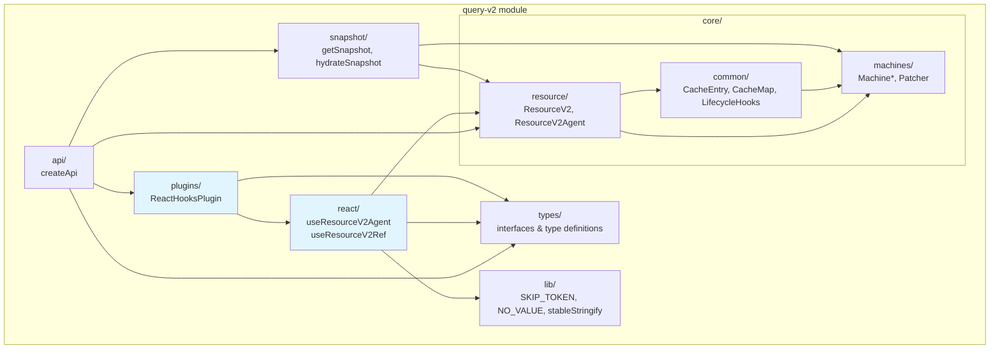
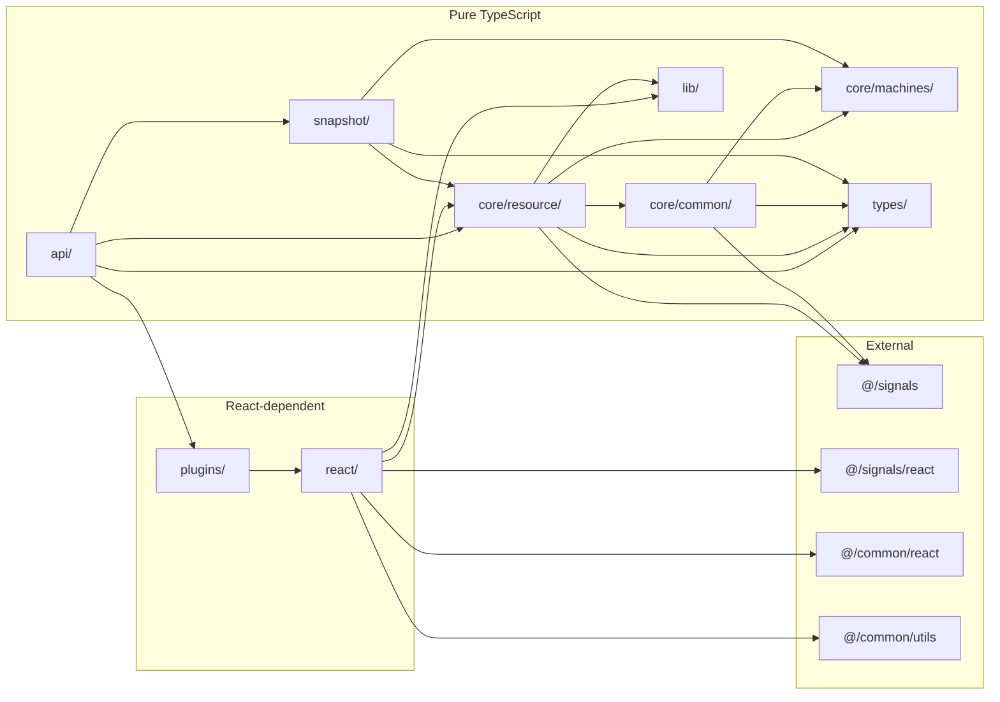
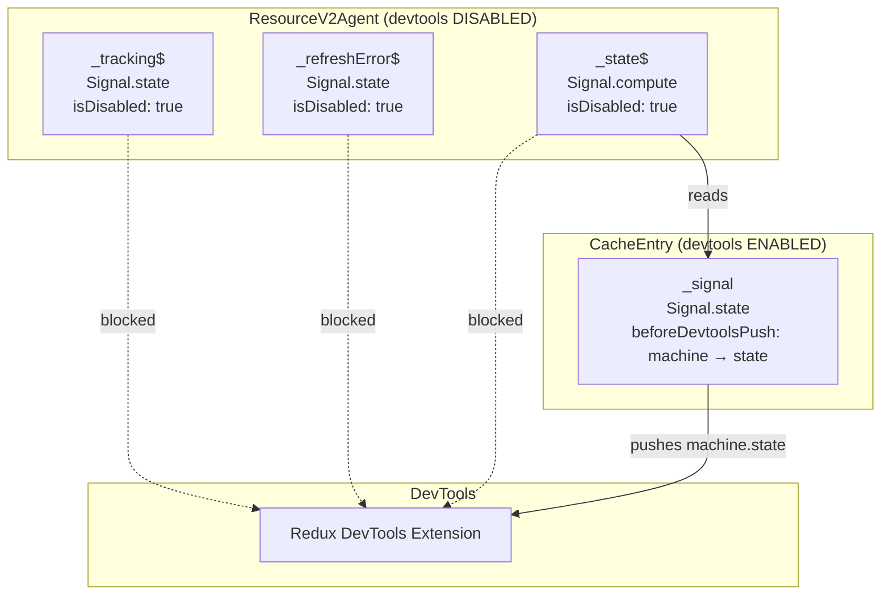

# System Architecture

## 1. Module Boundary Overview (C4 Level 2)

After all 7 fixes are applied, the `query-v2` module has 8 sub-modules. The key structural changes are: a new `react/` sub-module for standalone hooks, `core/` split into three internal sub-folders, and devtools isolation in `ResourceV2Agent`.



**Legend**: Blue-highlighted modules depend on React. All others are pure TypeScript.

[ref: ../01-research/01-codebase-analysis.md#2-react-hooks-folder-location] — No `react/` folder currently exists.  
[ref: ../01-research/01-codebase-analysis.md#3-core-module-organization] — Core is currently flat with only `machines/` isolated.

## 2. Component Boundaries per Fix

### Fix #1 + #2: Standalone React Hooks in `react/`

**New files:**

| File | Responsibility |
|------|---------------|
| `react/useResourceV2Agent.ts` | Standalone hook: `useResourceV2Agent(resource, args)` → creates agent, subscribes to `state$`, returns reactive state |
| `react/useResourceV2Ref.ts` | Standalone hook: `useResourceV2Ref(resource, args)` → returns imperative `IResourceV2Ref` |
| `react/index.ts` | Barrel export of both hooks + helper types |

**Modified files:**

| File | Change |
|------|--------|
| `plugins/ReactHooksPlugin.ts` | `augmentResource` delegates to standalone hook imports from `react/`. Hook function bodies removed from this file. |
| `index.ts` | Adds re-export from `./react` |

**Standalone vs. plugin call path:**

```
Standalone:  useResourceV2Agent(resource, args)
                 ↓ resource param is explicit
             resource.createAgent() → agent.state$ → useSignal

Plugin:      resource.useResourceV2Agent(args)
                 ↓ augmentResource closure captures `resource`
             useResourceV2Agent(resource, args)   ← delegates to standalone
```

The plugin becomes a thin wrapper (~10 lines). The standalone hooks take `resource: ResourceV2<TArgs, TData, TError>` as the first parameter — identical to v1's `useResourceAgent(resource, args)` pattern.
[ref: ../01-research/01-codebase-analysis.md#1-react-hooks--plugin-dependency] — hooks already receive `resource` and `options` as closure arguments from `augmentResource`.

### Fix #3: Core Internal Split

Internal restructure only. `core/index.ts` barrel re-exports unchanged.
[ref: ../01-research/02-open-questions.md#q3-will-the-core-split-change-public-import-paths] — User decision: internal-only, no public API change.

| Sub-folder | Files moved | Responsibility |
|------------|------------|----------------|
| `core/common/` | `CacheEntry.ts`, `CacheMap.ts`, `LifecycleHooks.ts` | Shared cache infrastructure (entries, map, lifecycle) |
| `core/machines/` | *(already here)* | State machine hierarchy + Patcher |
| `core/resource/` | `ResourceV2.ts`, `ResourceV2Agent.ts` | Resource orchestration + agent |

**Updated `core/index.ts`:**
```typescript
export * from "./common";
export * from "./machines";
export * from "./resource";
```

Each sub-folder gets its own `index.ts` barrel. External code importing from `@/query-v2/core` sees no change.

### Fix #4: DevTools Agent State Isolation

**Problem:** `ResourceV2Agent` creates three signals that leak to devtools:
[ref: ../01-research/02-open-questions.md#q5-does-fix-4-devtools-must-not-receive-agent-state-logs-require-any-code-change] — User corrected the research: agent state DOES leak.

| Signal | Type | Leaks to devtools |
|--------|------|-------------------|
| `_tracking$` | `Signal.state<AgentTracking>` | Yes — no `isDisabled`, devtools creates entry with key `State/#i=N` |
| `_refreshError$` | `Signal.state<TError \| null>` | Yes — same as above |
| `_state$` | `Signal.compute<IResourceV2AgentState>` | Yes — `Computed` creates internal `State` with `base: "Computed"`, forwards to devtools as `Computed/#i=N` |

**Solution:** Pass `{ isDisabled: true }` to all three signal constructors in `ResourceV2Agent`. This uses the existing `SignalOptions.isDisabled` flag, which `Devtools.createState` checks before creating a devtools entry.

**Modified file:** `core/resource/ResourceV2Agent.ts` (3 signal constructor calls)

```typescript
// Before:
this._tracking$ = Signal.state<AgentTracking<TData, TError>>({ previous: null, current: null });

// After:
this._tracking$ = Signal.state<AgentTracking<TData, TError>>(
    { previous: null, current: null },
    { isDisabled: true },
);
```

Same pattern for `_refreshError$` and `_state$`.

This is the minimal change — it uses the signal system's existing opt-out mechanism without modifying the signals module or adding new infrastructure. `CacheEntry` signals are unaffected; they continue pushing to devtools.
[ref: ../01-research/01-codebase-analysis.md#4-devtools-agent-state-logging] — CacheEntry has `beforeDevtoolsPush`, agent signals have no options.

### Fix #5: Snapshot Hydration Error Handling

**Modified file:** `snapshot/Snapshot.ts` — `hydrateSnapshot` function.

[ref: ../01-research/01-codebase-analysis.md#5-snapshot-loading-error-handling] — Three silent skip scenarios found.
[ref: ../01-research/02-open-questions.md#q4-what-error-behavior-should-hydratesnapshot-produce-on-failure] — User decision: throw on version/prefix mismatch, warn on others.

| Scenario | Current behavior | New behavior |
|----------|-----------------|-------------|
| Version mismatch | `return` (silent) | `throw Error` |
| Key prefix mismatch | `return` (silent) | `throw Error` |
| Unknown resource key | `continue` (silent) | `console.warn` + `continue` |
| `Machine.fromSnapshot` corrupt status | Throws (uncaught) | Unchanged — already throws |
| Existing entry (hydrate no-op) | Silent skip | Unchanged |

### Fix #6: JSDoc Scope

[ref: ../01-research/01-codebase-analysis.md#6-jsdoc-coverage] — full inventory of undocumented items.

**Public API JSDoc (required):**

| File | Items |
|------|-------|
| `api/createApi.ts` | `createApi()` function |
| `core/resource/ResourceV2.ts` | Class-level, `createAgent()`, `query()`, `query$()`, `entry()`, `resetCache()` |
| `core/resource/ResourceV2Agent.ts` | Class-level, `state$`, `start()` |
| `core/common/CacheEntry.ts` | Class-level, `machine$`, `peek()`, `set()`, `complete()` |
| `plugins/ReactHooksPlugin.ts` | Class-level |
| `react/useResourceV2Agent.ts` | Function-level |
| `react/useResourceV2Ref.ts` | Function-level |

**Inline comments ("magic" locations):**

| File | Location | Why |
|------|----------|-----|
| `core/common/CacheEntry.ts` | `beforeDevtoolsPush` callback | Type mismatch is intentional (pushes state, not machine) |
| `core/resource/ResourceV2Agent.ts` | `isDisabled: true` on signals | Explains why agent signals opt out of devtools |
| `snapshot/Snapshot.ts` | Error/throw logic in `hydrateSnapshot` | Documents error semantics |
| `plugins/ReactHooksPlugin.ts` | Declaration merging block | Explains type-level wiring |

### Fix #7: Documentation — Optimistic Update Snapshot Behavior

**Target:** `docs/query-v2/ssr.md` — the "Ограничения" (Limitations) section.

[ref: ../01-research/02-open-questions.md#q7-should-the-three-documentation-files-describe-snapshot-during-optimistic-update-behavior-identically] — User decision: find existing snapshot documentation and add optimistic update info there.

The "Ограничения" section already mentions "Snapshot не включает информацию о патчах или pending-запросах" — this is where the optimistic update behavior should be expanded. Add a paragraph explaining:
- During active optimistic patches, `data` in the snapshot is the **patched** (optimistic) data
- `originalData` and `patches` are NOT included
- Hydrating such a snapshot installs optimistic data as if it were confirmed server data

## 3. Module Dependency Diagram



**Key change from current state:** `plugins/` now depends on `react/` (delegation), whereas previously `plugins/` contained the hooks inline. `react/` depends on `@/signals/react` and `@/common/react` for `useSignal` and `useConstant`.

## 4. Signal/DevTools Boundary



Agent signals are internal derived state for React hooks. Only `CacheEntry` signals — representing the canonical cache state — push to devtools.
