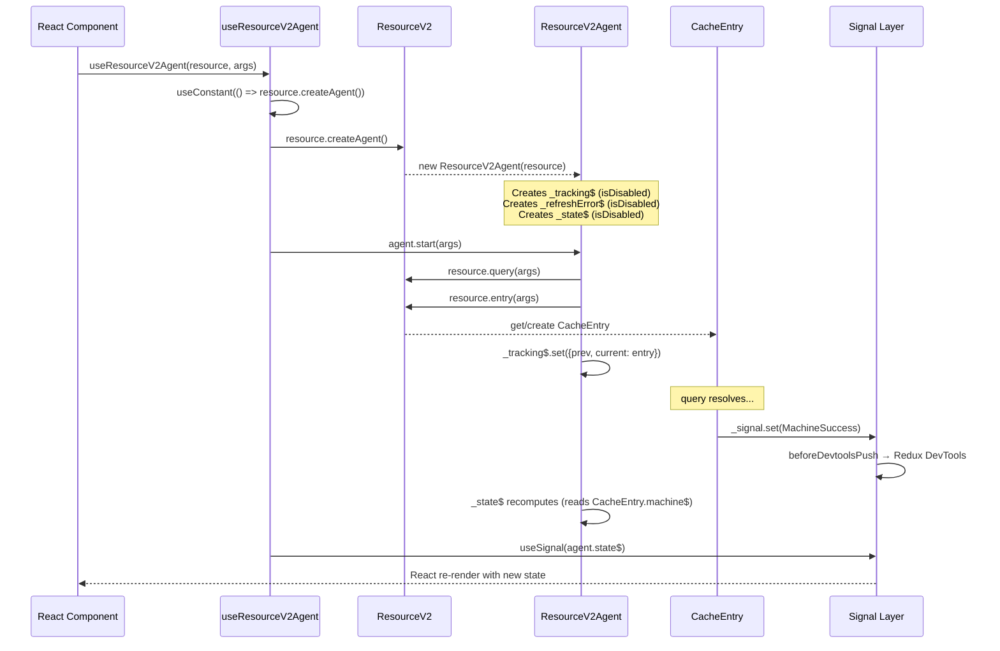
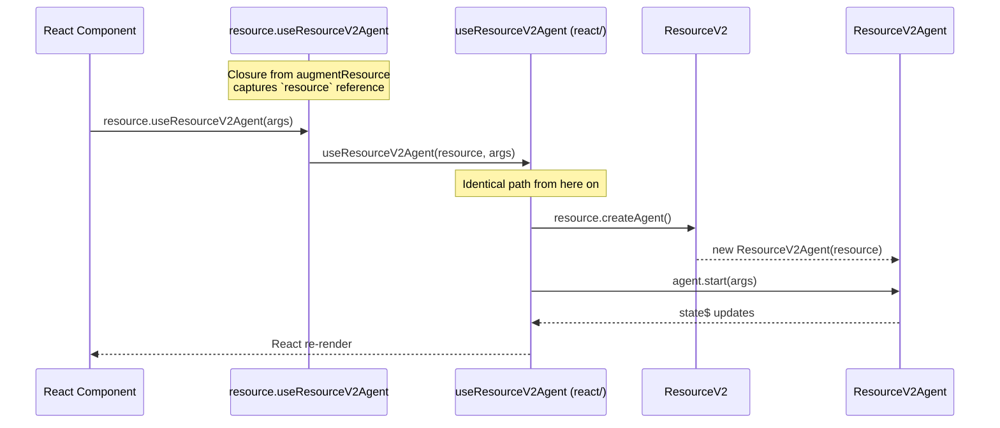
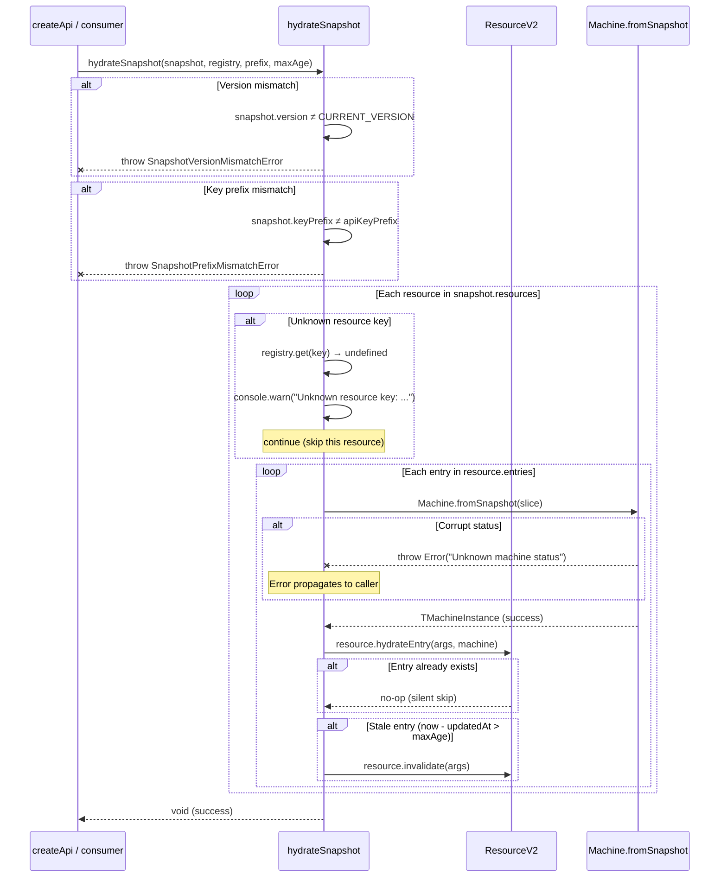
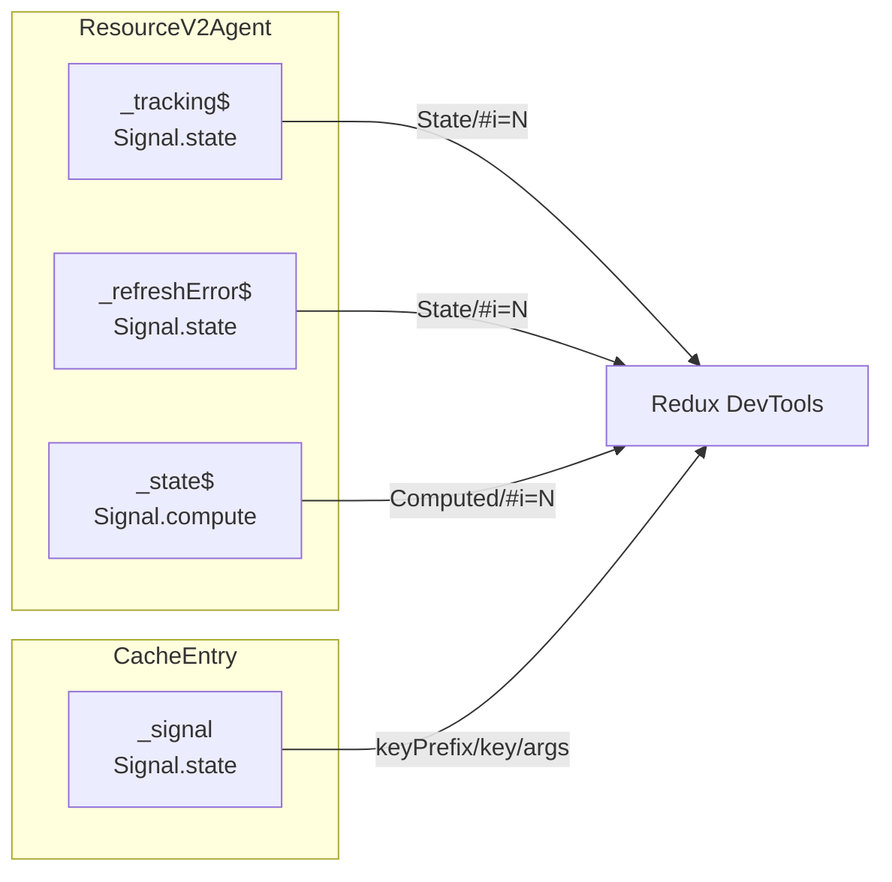
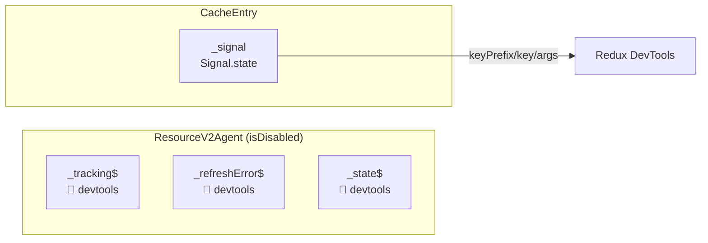
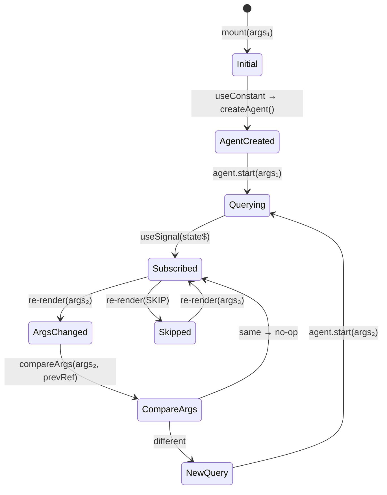

# Data Flow

## 1. Standalone Hook Lifecycle

`useResourceV2Agent(resource, args)` — direct import from `react/`.



Key points:
- Agent signals have `isDisabled: true` — no devtools push from agent layer [ref: ../01-research/02-open-questions.md#q5]
- `CacheEntry._signal` pushes to devtools via `beforeDevtoolsPush` [ref: ../01-research/01-codebase-analysis.md#4-devtools-agent-state-logging]
- `useSignal` subscribes to `agent.state$` (computed), which transitively reads `CacheEntry.machine$` (state)

## 2. Plugin Hook Lifecycle (Delegation)

`resource.useResourceV2Agent(args)` — accessed via plugin augmentation.



The plugin closure is a single-line delegation:
```typescript
augmentResource(res) {
    return {
        useResourceV2Agent: (args) => useResourceV2Agent(res, args),
        useResourceV2Ref: (args) => useResourceV2Ref(res, args),
    };
}
```

[ref: ../01-research/01-codebase-analysis.md#1-react-hooks--plugin-dependency] — current `augmentResource` already returns a closure that calls the hook functions; the only change is the functions now live in `react/`.

## 3. Snapshot Hydration with Error Handling



Error semantics per user decision [ref: ../01-research/02-open-questions.md#q4]:
- **Version mismatch** → `throw` (fatal — snapshot format incompatibility)
- **Key prefix mismatch** → `throw` (fatal — wrong API instance)
- **Unknown resource key** → `console.warn` + skip (non-fatal — resource may have been removed)
- **Corrupt machine status** → `throw` from `Machine.fromSnapshot` (propagates — data corruption)

## 4. DevTools Flow: Current vs. Fixed

### Current State (Agent Leaks)



All signals register with devtools because none pass `isDisabled: true`. The agent signals create noise entries with auto-generated keys (`State/#i=N`, `Computed/#i=N`).

[ref: ../01-research/02-open-questions.md#q5] — User confirmed agent signals leak to devtools.

### Fixed State (Agent Isolated)



Only `CacheEntry` signals push to devtools. Agent signals are internal derived state that exists solely for React hook consumption. Devtools shows the canonical cache machine state, not computed agent projections.

## 5. Args Change Flow in useResourceV2Agent



The agent is created once per component mount. Subsequent renders trigger arg comparison — if args differ, `agent.start(newArgs)` is called, which internally swaps the tracked `CacheEntry` and triggers a reactive chain through `_state$` → `useSignal` → re-render.

[ref: ../01-research/01-codebase-analysis.md#1-react-hooks--plugin-dependency] — `compareArgs` uses `React.useRef` for arg stability.
