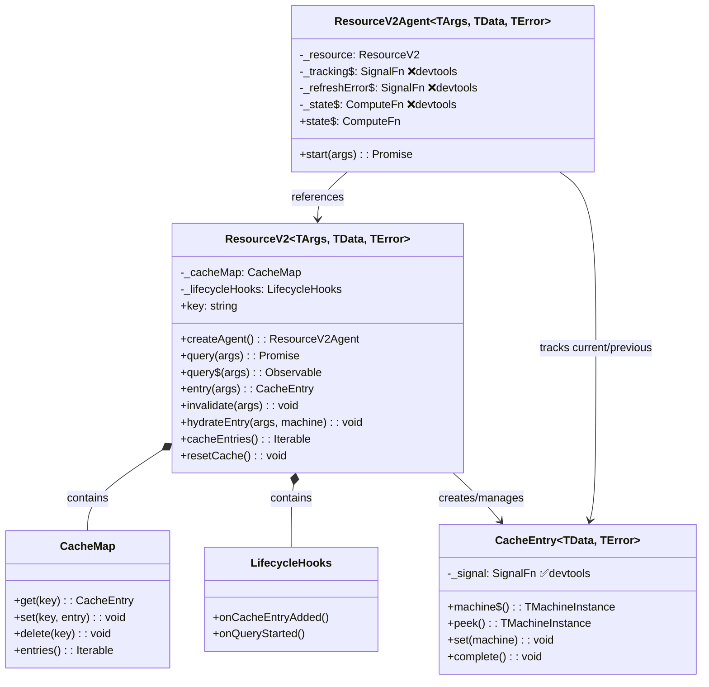
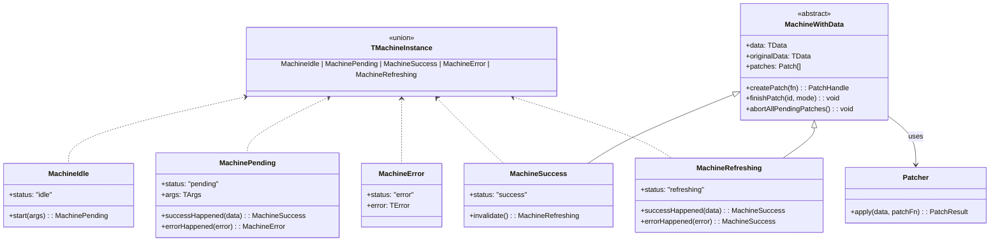
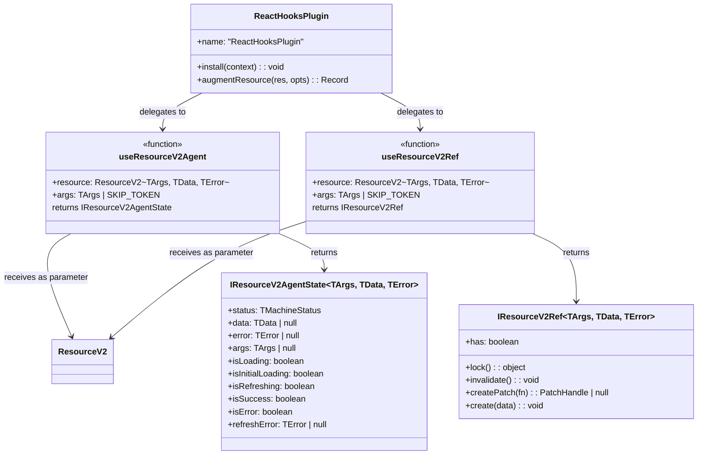
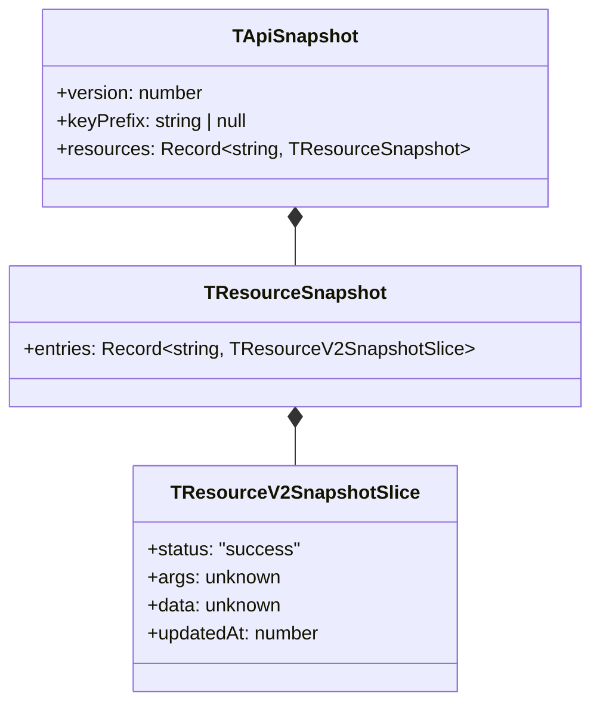

# Domain Model

## 1. Class/Interface Hierarchy



**Devtools markers**: ❌ = `isDisabled: true` (no devtools push), ✅ = `beforeDevtoolsPush` configured.

## 2. Machine State Hierarchy



[ref: ../01-research/01-codebase-analysis.md#3-core-module-organization] — Machine hierarchy already isolated in `machines/`.

## 3. Standalone Hooks Relationship



Hooks receive `ResourceV2` as an explicit parameter. The plugin captures `resource` in its `augmentResource` closure and passes it through. Both paths produce the same return types.

[ref: ../01-research/01-codebase-analysis.md#1-react-hooks--plugin-dependency] — `augmentResource` already calls internal functions with `resource` argument; refactoring to explicit parameters is straightforward.

## 4. Snapshot Domain Model



**Invariants:**
- Only `MachineSuccess` entries are captured in snapshots [ref: ../01-research/01-codebase-analysis.md#7-optimistic-update-snapshot-content]
- `data` may contain optimistic (patched) data if a snapshot is taken during active patches
- `originalData` and `patches` are **not** included — hydration installs optimistic data as canonical

**Hydration error semantics:**
- `version ≠ CURRENT_SNAPSHOT_VERSION` → throw (fatal)
- `keyPrefix ≠ apiKeyPrefix` → throw (fatal)
- Unknown resource key → warn + skip
- Corrupt machine status → throw from `Machine.fromSnapshot`

[ref: ../01-research/02-open-questions.md#q4] — User decision on error semantics.

## 5. Module Organization After Restructuring

```
query-v2/
├── index.ts                    # Public barrel (unchanged exports + new react/ exports)
├── api/
│   └── createApi.ts            # API factory (unchanged)
├── core/
│   ├── index.ts                # Re-exports from common/, machines/, resource/
│   ├── common/
│   │   ├── index.ts            # CacheEntry, CacheMap, LifecycleHooks
│   │   ├── CacheEntry.ts
│   │   ├── CacheMap.ts
│   │   └── LifecycleHooks.ts
│   ├── machines/               # (unchanged location)
│   │   ├── index.ts
│   │   ├── Machine.ts
│   │   ├── MachineIdle.ts
│   │   ├── MachinePending.ts
│   │   ├── MachineSuccess.ts
│   │   ├── MachineError.ts
│   │   ├── MachineRefreshing.ts
│   │   ├── MachineWithData.ts
│   │   └── Patcher.ts
│   └── resource/
│       ├── index.ts            # ResourceV2, ResourceV2Agent
│       ├── ResourceV2.ts
│       └── ResourceV2Agent.ts
├── lib/
│   ├── SKIP_TOKEN.ts
│   ├── NO_VALUE.ts
│   └── stableStringify.ts
├── plugins/
│   ├── ReactHooksPlugin.ts     # Thin wrapper → delegates to react/
│   └── types.ts
├── react/                      # NEW
│   ├── index.ts                # Barrel: useResourceV2Agent, useResourceV2Ref
│   ├── useResourceV2Agent.ts   # Standalone hook
│   └── useResourceV2Ref.ts     # Standalone hook
├── snapshot/
│   └── Snapshot.ts             # getSnapshot + hydrateSnapshot (with error handling)
└── types/
    ├── agent.types.ts
    ├── api.types.ts
    ├── cache.types.ts
    ├── lifecycle.types.ts
    ├── machine.types.ts
    ├── plugin.types.ts
    ├── resource.types.ts
    ├── shared.types.ts
    └── snapshot.types.ts
```

[ref: ../01-research/01-codebase-analysis.md#3-core-module-organization] — File-to-category mapping confirmed.

## 6. Plugin System Type Wiring (Unchanged)

The plugin type system remains as-is per user decision [ref: ../01-research/02-open-questions.md#q2].

```typescript
// In ReactHooksPlugin.ts — declaration merging stays:
declare module "@/query-v2/types/plugin.types" {
    interface PluginContributionMap<TArgs, TData, TError> {
        ReactHooksPlugin: IReactHooksPluginContributions<TArgs, TData, TError>;
    }
}

// PluginAugmentations type utility extracts contributions from plugin tuple.
// When ReactHooksPlugin is in TPlugins, resource gets .useResourceV2Agent() and .useResourceV2Ref().
// When no plugins: PluginAugmentations<[]> = object (no additional methods).
```

This type machinery is unchanged. The only behavioral change is that `augmentResource` now delegates to imported functions instead of defining them inline.
