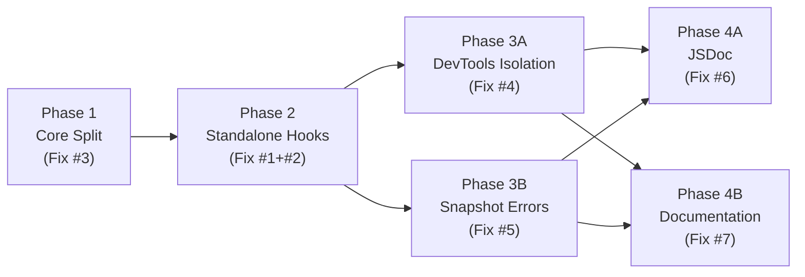

## Overview

This plan decomposes the approved design for 7 query-v2 fixes into 4 phases with strict ordering. Phase 1 restructures `core/` into `common/machines/resource` sub-folders (Fix #3). Phase 2 extracts standalone React hooks into `react/` and refactors `ReactHooksPlugin` into a delegation wrapper (Fix #1+#2). Phase 3 applies devtools isolation and snapshot error handling in parallel (Fix #4 + #5). Phase 4 adds JSDoc and documentation updates in parallel (Fix #6 + #7).

## Phase Map

## Phase Summary

| Phase | Name | Description | Complexity | Depends On | Parallelizable | Verification |
|-------|------|-------------|------------|------------|----------------|--------------|
| 1 | Core Split | Move `CacheEntry`, `CacheMap`, `LifecycleHooks` → `core/common/`; `ResourceV2`, `ResourceV2Agent` → `core/resource/`; create barrels; update all imports | High | None | No | `npm run ts-check` + `vitest run src/query-v2/` |
| 2 | Standalone Hooks | Create `react/` with standalone hooks; refactor `ReactHooksPlugin` to delegate; create hook tests | High | Phase 1 | No | `npm run ts-check` + `vitest run src/query-v2/` |
| 3A | DevTools Isolation | Add `{ isDisabled: true }` to 3 agent signal constructors | Low | Phase 2 | Parallel with 3B | `npm run ts-check` + `vitest run src/query-v2/core/` |
| 3B | Snapshot Errors | Replace silent returns with throws; add `console.warn` for unknown resources; update tests S4/S5 | Medium | Phase 2 | Parallel with 3A | `npm run ts-check` + `vitest run src/query-v2/snapshot/ src/query-v2/__tests__/integration/` |
| 4A | JSDoc | Add JSDoc to public API surface + inline comments at magic locations | Medium | Phase 3A + 3B | Parallel with 4B | `npm run ts-check` |
| 4B | Documentation | Update `ssr.md`, `api-reference.md` with standalone hooks, errors, optimistic update info | Low | Phase 3A + 3B | Parallel with 4A | Manual review |

## Execution Rules

- Phases without dependencies on incomplete phases may be executed in parallel (3A ∥ 3B, 4A ∥ 4B).
- Sequential phases (1 → 2 → 3 → 4) require verification before proceeding.
- Every phase must leave the project in a compilable state (`npm run ts-check` passes).
- All phases should be implemented on a single feature branch to avoid cross-branch merge conflicts [ref: ../02-design/08-risks.md R4].
- After each phase, run `vitest run src/query-v2/` to confirm no regressions [ref: ../02-design/08-risks.md R2].

## Test Case Distribution

| Phase | Test Cases Addressed |
|-------|---------------------|
| 1 | T14–T22 (core barrel exports, cross-subfolder imports, existing test regression) |
| 2 | T1–T13 (standalone hook unit tests, plugin delegation integration, backward-compat regression) |
| 3A | T23–T28 (devtools isolation unit, CacheEntry devtools regression, agent reactivity regression) |
| 3B | T29–T38 (snapshot error throws, unknown resource warn, round-trip regression, SSR integration) |
| 4A | — (no test cases, documentation-only) |
| 4B | — (no test cases, documentation-only) |

## Next Steps

Proceeds to implementation after human review.

## Quality Review

> **Re-review (Redraft Round 1)** — verified fixes for REVIEW.md issue #1 and user feedback (remove `docs/query-v2/README.md` from Phase 4B).

### Checklist

| # | Criterion | Status | Notes |
|---|-----------|--------|-------|
| 1 | Every design component mapped to task(s) | PASS | All 5 ADRs mapped: ADR-1→Phase 2, ADR-2→Phase 1, ADR-3→Phase 3A, ADR-4→Phase 3B, ADR-5→Phase 4A. All use cases (UC-1.x through UC-6.x) covered. All 38 test cases (T1–T38) distributed across phases per the Test Case Distribution table, with no orphaned cases. |
| 2 | File paths concrete and verified | PASS | Spot-checked 23 existing file paths against the repository: all confirmed present (core source files, test files, doc files, integration tests). 7 new files to be created are correctly marked as Create action. Import paths in `createApi.ts` (line 1), `ReactHooksPlugin.ts` (line 5), and `Snapshot.ts` (line 4) verified to match plan descriptions. |
| 3 | Phase dependencies correct | PASS | Dependency chain P1→P2→P3A∥P3B→P4A∥P4B matches design recommendation (Fix #3→#1/#2→#4/#5→#6/#7). No circular dependencies. Mermaid graph matches phase summary table and individual phase `## Dependencies` sections. P3A depends on P2 conservatively (only needs P1 for file paths), but this is explicitly acknowledged in 03a-devtools-isolation.md. |
| 4 | Verification criteria per phase | PASS | All 6 phases include `npm run ts-check`. Phases 1, 2, 3A, 3B include specific `vitest run` commands targeting affected test directories. Phase 4B uses manual review (appropriate for docs-only). Phase verification checklists reference risk mitigations (R2, R3, R5, R6, R7). |
| 5 | Each phase leaves project compilable | PASS | Phase 1: all import updates happen within the same phase as file moves. Phase 2: creates new files + refactors plugin in same phase. Phase 3A/3B: additive changes only (parameter additions, error behavior changes). Phase 4A/4B: comments and docs only. No phase deletes a file without updating dependent imports in the same phase. |
| 6 | No vague tasks — exact files and changes | PASS | Every task specifies exact file path, action (Create/Modify/Move), and concrete description. Import changes enumerate specific `from` → `to` paths per file. Error messages include exact text. Barrel files list exact export statements. **Re-verified**: Task 1.4 header now correctly states "(8 relative imports change)" — matches the 8 enumerated import lines (3 common + 5 machines) plus 1 unchanged (`./ResourceV2Agent`). Cross-checked against actual `ResourceV2.ts` imports (lines 12–20). |
| 7 | Design traceability (`[ref: ...]`) on all tasks | PASS | All 28 tasks have design references (29→28 after Task 4B.3 removal). Most use `[ref: ../02-design/...]` format. Tasks 1.7, 1.8, 3A.2 use "Addresses TNN" format referencing test cases from `06-testcases.md` — adequate traceability though stylistically inconsistent. |
| 8 | Parallel/sequential correctly marked | PASS | P3A∥P3B: verified — modify completely disjoint file sets (`ResourceV2Agent.ts` vs `Snapshot.ts` + snapshot tests). P4A∥P4B: verified — source file JSDoc vs doc files. No shared file conflicts in parallel pairs. Within-phase tasks are implicitly sequential (appropriate for file-move phases). |
| 9 | Complexity estimates present (L/M/H) | PASS | All 28 tasks have complexity estimates. Distribution: 17 Low, 9 Medium, 2 High. High-complexity tasks (1.3 file moves + 2.6 test creation) are reasonable classifications. |
| 10 | Documentation tasks proportional to existing docs/demos | PASS | Phase 4B specifies ~15 lines across 2 existing files (`ssr.md`, `api-reference.md`). `docs/query-v2/README.md` was removed per user feedback. No new documentation files. No demo changes. Existing `docs/query-v2/` has 4 files; `apps/demos/src/examples/query-v2/` is untouched. Proportional to scope. |
| 11 | Mermaid dependency graph present | PASS | `graph LR` in README.md with 6 nodes (P1–P4B) and 7 edges. Valid Mermaid syntax. Correctly shows P1→P2 sequential, P3A∥P3B parallel, P4A∥P4B parallel. |
| 12 | Phase summary table complete | PASS | Table has all required columns (Phase, Name, Description, Complexity, Depends On, Parallelizable, Verification). All 6 phases listed. Data matches individual phase documents. Phase 4B description correctly references only `ssr.md` and `api-reference.md`. |

### Documentation Proportionality

The existing `docs/query-v2/` directory has 4 files: `README.md`, `api-reference.md`, `optimistic-updates.md`, `ssr.md`. The `apps/demos/src/examples/` directory has `query-v2/` with interactive demos.

Phase 4B proposes (after Redraft Round 1):
- `ssr.md`: 3–5 bullet points (optimistic update limitations) + 3–4 bullet points (hydration error behavior)
- `api-reference.md`: ~5 lines (standalone hook import note)

Total: ~15 lines across 2 existing files. No new documentation files. No demo changes. `docs/query-v2/README.md` excluded per user feedback — design doc `07-docs.md` included it, but user explicitly overrode. Proportional to scope.

### Issues Found

No issues found.
