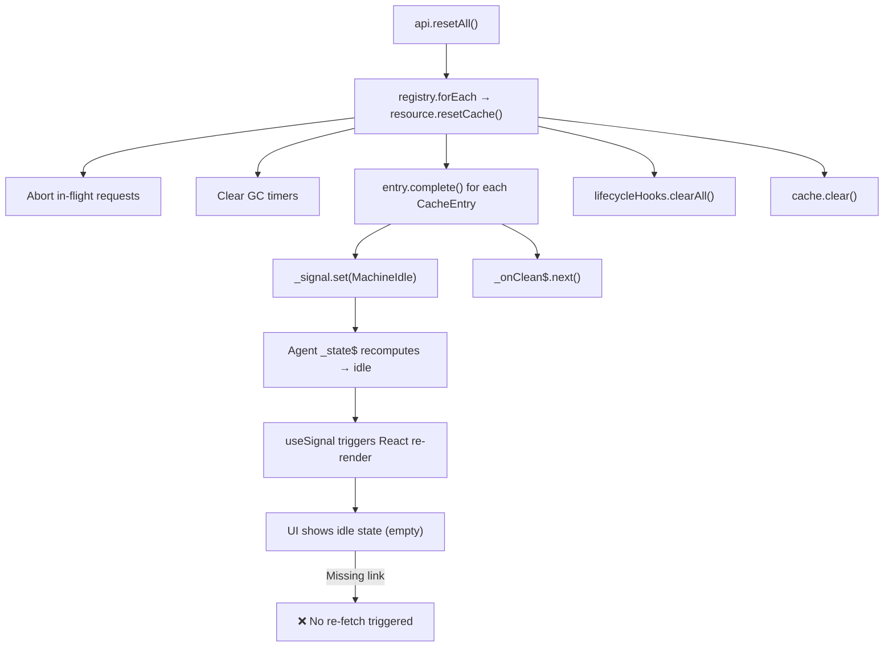

## Summary

`api.resetAll()` iterates over all registered resources and calls `resource.resetCache()` on each. `resetCache()` aborts in-flight requests, clears GC timers, calls `entry.complete()` on every cache entry (which sets the internal signal to `MachineIdle` and marks the entry as permanently completed), clears lifecycle hooks, and empties the cache map. **No mechanism exists to notify active agents that a reset occurred or to trigger re-fetching.** The agent holds a stale reference to a completed `CacheEntry` whose signal is frozen at `MachineIdle`, and has no way to detect that it should re-query.

## Findings

### 1. resetAll Implementation

#### 1.1 Public API Surface — `createApi`

- **Location**: `@/query-v2/api/createApi.ts:107-111`
- **What it does**: `resetAll()` iterates the internal `registry` (a `Map<string, ResourceV2>`) and calls `resource.resetCache()` on each resource.
- **Key code**:
  ```ts
  resetAll(): void {
      for (const [, resource] of registry) {
          resource.resetCache();
      }
  },
  ```
- **Key observation**: This is a synchronous, fire-and-forget operation. No return value, no signal emitted, no notification mechanism.

#### 1.2 Type Definition

- **Location**: `@/query-v2/types/api.types.ts:27`
- **What it does**: Declares `resetAll(): void` on the `IApi` interface.

#### 1.3 Registry

- **Location**: `@/query-v2/api/createApi.ts:36`
- **What it does**: `const registry = new Map<string, ResourceV2<any, any, any>>()` — resources are added only when `key` is not null (`createApi.ts:92`).
- **Key observation**: Resources without a `key` are **not registered** and will NOT be reset by `resetAll()`.

#### 1.4 ResourceV2.resetCache()

- **Location**: `@/query-v2/core/resource/ResourceV2.ts:283-302`
- **What it does** (step-by-step):
  1. Aborts all in-flight requests via `AbortController.abort()`, clears `_inFlight` map.
  2. Clears all GC timers via `clearTimeout()`, clears `_gcTimers` map.
  3. Calls `entry.complete()` on every cache entry (iterates `_cache.values()`).
  4. Calls `_lifecycleHooks.clearAll()` to reject pending lifecycle promises.
  5. Calls `_cache.clear()` to empty the cache map.
- **Key code**:
  ```ts
  resetCache(): void {
      for (const [, flight] of this._inFlight) {
          flight.abortController.abort();
      }
      this._inFlight.clear();

      for (const [, timer] of this._gcTimers) {
          clearTimeout(timer);
      }
      this._gcTimers.clear();

      for (const entry of this._cache.values()) {
          (entry as unknown as CacheEntry<TData, TError>).complete();
      }

      this._lifecycleHooks.clearAll();
      this._cache.clear();
  }
  ```
- **Key observation**: No notification/signal/event is emitted to subscribers or agents. The method only destroys internal state.

#### 1.5 CacheEntry.complete()

- **Location**: `@/query-v2/core/common/CacheEntry.ts:72-86`
- **What it does**:
  1. Sets `_completed = true` (any future `set()` calls become no-ops).
  2. Aborts all pending patches on `MachineWithData` instances.
  3. Sets internal signal to `MachineIdle.create()`.
  4. Emits `_onClean$.next()` and `_onClean$.complete()`.
- **Key code**:
  ```ts
  complete(): void {
      if (this._completed) return;
      this._completed = true;

      const current = this._signal.peek();
      if (current instanceof MachineWithData) {
          current.abortAllPendingPatches();
      }

      this._signal.set(MachineIdle.create() as unknown as TMachineInstance<TData, TError>);

      this._onClean$.next();
      this._onClean$.complete();
  }
  ```
- **Critical**: After `complete()`, the signal transitions to `MachineIdle` — any reactive subscribers (agents) WILL see the state change to `idle`. However, the entry is permanently locked (`_completed = true`), so no further state transitions can occur on this entry.

#### 1.6 LifecycleHooks.clearAll()

- **Location**: `@/query-v2/core/common/LifecycleHooks.ts:121-137`
- **What it does**: Rejects all pending `$cacheDataLoaded` promises with `"Cache entry removed before data loaded"`, resolves all `$cacheEntryRemoved` promises, rejects any pending `$queryFulfilled` with `"Resource reset"`.

### 2. Agent Signal Handling

#### 2.1 ResourceV2Agent — Architecture

- **Location**: `@/query-v2/core/resource/ResourceV2Agent.ts`
- **Agent type**: query-v2 has only **one agent type**: `ResourceV2Agent`. There are no Operation or Command agents (unlike query-v1).
- **Key dependencies**: Uses `Signal.state` and `Signal.compute` from `@/signals`.

#### 2.2 How the Agent Tracks Cache Entries

- **Location**: `@/query-v2/core/resource/ResourceV2Agent.ts:24-26`
- `_tracking$`: A `SignalFn<AgentTracking>` holding `{ previous: CacheEntry | null, current: CacheEntry | null }`.
- The `_state$` computed signal reads `this._tracking$()` to get the current entry, then reads `current.machine$()` reactively.
- **Key observation**: The agent holds a **direct reference** to the `CacheEntry` object. It does NOT subscribe to the resource or the cache map. It has no mechanism to detect that the entry was evicted from the cache.

#### 2.3 What Happens to the Agent on Reset

When `resetCache()` is called:
1. The `CacheEntry` that the agent's `_tracking$.current` points to has `complete()` called.
2. `complete()` sets the inner signal to `MachineIdle` — the agent's `_state$` **will** recompute and show `status: "idle"`.
3. However, the entry's `_completed` flag is `true`, so any attempt to transition it again will be silently dropped.
4. The entry is also removed from the `_cache` map, so a fresh `resource.query(args)` would create a **new** `CacheEntry` — but the agent still references the **old, completed** entry.
5. **There is no mechanism for the agent to detect this reset and re-bind to a new entry or re-trigger `start()`.**

#### 2.4 Agent `start()` Method — Same-Args Check

- **Location**: `@/query-v2/core/resource/ResourceV2Agent.ts:107-111`
- **Key code**:
  ```ts
  if (this._currentArgs !== null && this._resource.compareArgs(this._currentArgs, typedArgs)) {
      return;
  }
  ```
- **Critical**: If an external caller (e.g., React hook) calls `agent.start(args)` with the same args after reset, it is a **no-op** because `_currentArgs` still matches. The agent never re-queries.

#### 2.5 React Hook — useResourceV2Agent

- **Location**: `@/query-v2/react/useResourceV2Agent.ts:18-42`
- Creates the agent via `useConstant()` (once per mount).
- On re-renders, compares `args` with `prevArgsRef.current` — only calls `agent.start()` if args changed.
- Uses `useSignal(agent.state$)` for reactive state.
- **Key observation**: After `resetAll()`, the hook will NOT re-call `agent.start()` because:
  1. The agent is created once via `useConstant` and persists.
  2. The args haven't changed, so the comparison passes and `start()` is not called.
  3. Even if `start()` were called, the agent's same-args check would skip it.

#### 2.6 Subscriber Awareness / Lifecycle

- **Agent has no subscriber count**: Unlike the cache's GC mechanism (which tracks subscribers via `lockEntry`/`scheduleGc`), the agent itself has no concept of "active subscribers" or "mounted components".
- **`useResourceV2Agent` does not register** with the resource or cache for lifecycle events (like reset notifications).
- **No `onReset` event**: Neither `ResourceV2` nor `CacheEntry` provides an observable/callback that agents could subscribe to for reset events.

### 3. Test Coverage for resetAll

#### 3.1 Integration Tests

**File**: `@/query-v2/__tests__/integration/query-flow.test.ts:361-385`

Single test case:
- **Test**: `"api.resetAll() clears all resources and caches"`
- **What it tests**: After `resetAll()`, `entry(args)` returns `null` for both resources.
- **What it does NOT test**:
  - Agent behavior after reset (does agent see idle? does it re-fetch?)
  - React hook behavior after reset
  - Active subscriptions during reset
  - Re-fetching behavior after reset

#### 3.2 ResourceV2 Unit Tests

**File**: `@/query-v2/core/__tests__/ResourceV2.test.ts`

Two relevant tests:
- **R11** (line 214): `"resetCache resets all entries"` — verifies entries are null after reset.
- **E9** (line 332): `"resetCache aborts in-flight queries"` — verifies abort signal fires on reset.

Neither test verifies agent behavior or re-fetching.

#### 3.3 Machine State Transition Tests

**File**: `@/query-v2/__tests__/integration/query-flow.test.ts:180-265`

Tests `reset()` on each machine type (MachineIdle, MachinePending, MachineSuccess, MachineRefreshing, MachineError) — all return `MachineIdle`. These test the state machine transitions, not the resetAll flow.

#### 3.4 Missing Test Scenarios

Based on the code analysis, the following scenarios are **not tested**:
1. Agent reactive state after `resetAll()` — does `agent.state$()` transition to idle?
2. Agent re-fetch after `resetAll()` — does `agent.start(sameArgs)` trigger a new query?
3. React hook (`useResourceV2Agent`) behavior after `resetAll()` — does the UI update? Does it re-fetch?
4. Multiple agents on the same resource during `resetAll()`.
5. `resetAll()` while queries are in-flight — agent perspective.
6. `resetAll()` followed by a new `query()` — does a new cache entry get created properly?
7. Agent SWR behavior during/after reset (previous data handling).

#### 3.5 React Hook Tests

**File**: `@/query-v2/react/__tests__/useResourceV2Agent.test.ts`

Tests T1-T5 cover: basic success, SKIP, args change, SKIP → real args, same-args dedup.
**No `resetAll` or `resetCache` tests exist in the React hook tests.**

### 4. Demo App Structure

#### 4.1 App Architecture

- **Location**: `apps/demos/src/app/App.tsx`
- **Framework**: React + React Router + HeroUI (Navbar-based navigation).
- **Routes**: `/` (Home), `/signals`, `/queries` (v1), `/queries-v2`.
- **Pages**: MDX files in `apps/demos/src/pages/` — e.g., `QueriesV2Page.mdx`.

#### 4.2 Examples System

- **Location**: `apps/demos/src/examples/query-v2/index.ts`
- **Pattern**: Each example is a `.tsx` file imported with `?raw` suffix (Vite raw import) for live editing.
- **Existing examples**:
  - `simple-resource.tsx` — basic resource with `useResourceV2Agent` + `api.resetAll()` button.
  - `optimistic-patches.tsx` — optimistic update demos.
  - `ssr-snapshot.tsx` — SSR snapshot demo.
- **Registration**: Exported via `examples` object in `index.ts`, consumed by `QueriesV2Page.mdx` as tabs.

#### 4.3 LiveExample Component

- **Location**: `apps/demos/src/components/LiveExample.tsx`
- Uses `react-live` (`LiveProvider`, `LiveEditor`, `LivePreview`).
- Auto-strips imports and adds `render(Base)` for components with `function Base`.
- **Scope**: All `@fozy-labs/rx-toolkit` exports + HeroUI components + `fetches` utility available in scope.

#### 4.4 Adding a New Example

To add a new example page:
1. Create a `.tsx` file in `apps/demos/src/examples/query-v2/`.
2. Import it with `?raw` in `apps/demos/src/examples/query-v2/index.ts`.
3. Add a `<Tab>` entry in `apps/demos/src/pages/QueriesV2Page.mdx`.
4. Use `function Base` as the main component (auto-wrapped by `processExample`).

#### 4.5 Utilities

- **Location**: `apps/demos/src/utils/fetches.ts`
- Mock API functions with `setTimeout` delays: `getItems`, `getCart`, `toggleCartItem`, `getUser`, `getUserStats`.

#### 4.6 Note on Existing resetAll Demo

The `simple-resource.tsx` demo already has a "Сбросить все ресурсы v2" button that calls `api.resetAll()`. After pressing it, the resource data disappears but **does not re-fetch** — this directly demonstrates the bug described in TASK.md.

### 5. Signals Infrastructure

#### 5.1 How query-v2 Uses Signals

query-v2 uses the `@/signals` module for reactivity:
- **`Signal.state`**: Used in `CacheEntry` (`@/query-v2/core/common/CacheEntry.ts:29`) to wrap the machine instance as a reactive signal.
- **`Signal.state`**: Used in `ResourceV2Agent` (`@/query-v2/core/resource/ResourceV2Agent.ts:37-39`) for `_tracking$` and `_refreshError$`.
- **`Signal.compute`**: Used in `ResourceV2Agent` (`@/query-v2/core/resource/ResourceV2Agent.ts:45`) for the derived `_state$`.
- **`Batcher.run`**: Used in `ResourceV2` (`@/query-v2/core/resource/ResourceV2.ts`) for atomic signal updates.
- **`useSignal`**: Used in `useResourceV2Agent` (`@/query-v2/react/useResourceV2Agent.ts:35`) to bridge signals to React rendering.

#### 5.2 Signal Flow for resetAll



#### 5.3 No Reset Signal Infrastructure in query-v2

Unlike query-v1 which uses `ResetAllQueriesSignal` (an RxJS `Subject<void>` at `@/query/core/ResetAllQueriesSignal.ts`), query-v2 has **no equivalent signal/event bus** for reset events. The reset is implemented as a direct method call chain (`api → resource → cache entry`) with no pub/sub mechanism.

#### 5.4 Comparison with query-v1 Reset

| Aspect | query-v1 | query-v2 |
|--------|----------|----------|
| Reset mechanism | `ResetAllQueriesSignal` (global RxJS Subject) | Direct method call `resource.resetCache()` |
| Subscriber notification | Agents subscribe to `clean$` and reset their cache state | No subscriber notification |
| Post-reset state | Cache entries reset to initial state (but preserved in map) | Cache entries `complete()`-d and removed from map |
| Re-fetch behavior | Depends on agent implementation (query-v1 Resource resets state, agent reacts) | **No re-fetch — gap in implementation** |

#### 5.5 Existing Invalidation Pattern

`resource.invalidate(args)` at `@/query-v2/core/resource/ResourceV2.ts:207-241` provides a single-entry invalidation that:
1. Transitions `MachineSuccess → MachineRefreshing` (preserving stale data).
2. Fires a new query.
3. Agents see the reactive `refreshing` state and `data` is preserved (SWR).

This pattern could inform how reset+re-fetch should work, but `invalidate` operates on a single entry by args, whereas `resetAll` destroys all entries.

## Code References

- `@/query-v2/api/createApi.ts:107-111` — `resetAll()` implementation
- `@/query-v2/api/createApi.ts:36` — resource registry (`Map<string, ResourceV2>`)
- `@/query-v2/api/createApi.ts:92` — resources registered only when `key != null`
- `@/query-v2/core/resource/ResourceV2.ts:283-302` — `resetCache()` method
- `@/query-v2/core/common/CacheEntry.ts:72-86` — `complete()` method (permanent)
- `@/query-v2/core/common/CacheEntry.ts:63-65` — `set()` no-op after complete
- `@/query-v2/core/resource/ResourceV2Agent.ts:107-111` — same-args skip in `start()`
- `@/query-v2/core/resource/ResourceV2Agent.ts:24-26` — `_tracking$` holds direct CacheEntry reference
- `@/query-v2/core/resource/ResourceV2Agent.ts:45-87` — `_state$` compute reads `current.machine$()`
- `@/query-v2/react/useResourceV2Agent.ts:25-36` — `useConstant` creates agent once, args comparison skips same-args
- `@/query-v2/core/common/LifecycleHooks.ts:121-137` — `clearAll()` rejects pending promises
- `@/query-v2/types/api.types.ts:27` — `IApi.resetAll(): void` type
- `@/query-v2/types/agent.types.ts:7-18` — `IResourceV2Agent` interface (no reset/cleanup method)
- `@/query-v2/__tests__/integration/query-flow.test.ts:361-385` — only existing `resetAll` test
- `@/query-v2/core/__tests__/ResourceV2.test.ts:214-228` — `resetCache` unit test
- `@/query-v2/core/__tests__/ResourceV2.test.ts:332-342` — `resetCache` abort test
- `@/query-v2/core/__tests__/ResourceV2Agent.test.ts` — agent tests (no reset scenarios)
- `@/query-v2/react/__tests__/useResourceV2Agent.test.ts` — React hook tests (no reset scenarios)
- `@/query-v2/core/resource/ResourceV2.ts:207-241` — `invalidate()` as reference pattern for re-fetch
- `@/query/core/ResetAllQueriesSignal.ts:5-14` — query-v1 reset signal (comparison)
- `@/query/core/Resource/Resource.ts:177-183` — query-v1 resource subscribing to reset signal
- `apps/demos/src/examples/query-v2/simple-resource.tsx:18-21` — existing demo with `resetAll()` button
- `apps/demos/src/examples/query-v2/index.ts` — example registry
- `apps/demos/src/pages/QueriesV2Page.mdx` — queries-v2 page with tab layout
- `apps/demos/src/components/LiveExample.tsx` — live playground component using `react-live`
