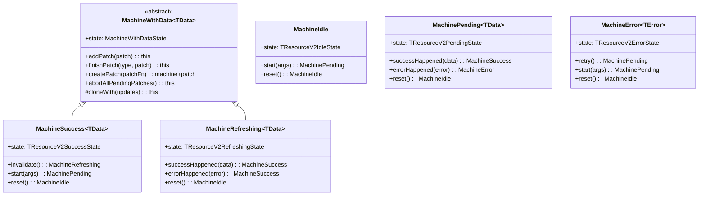
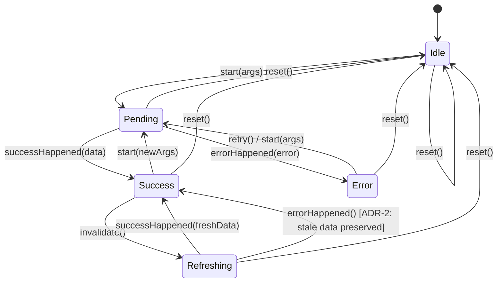
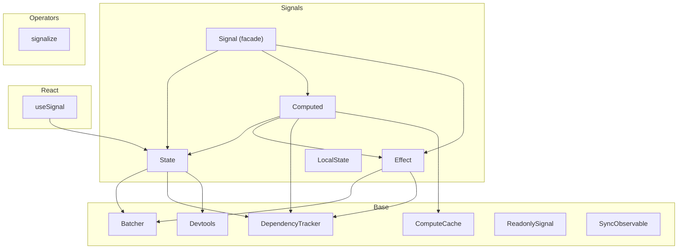

## Summary

The query-v2 module is a cache-backed asynchronous data management system built on top of the signals reactive layer. It uses a machine-based state model (Idle → Pending → Success/Error → Refreshing), Immer-based optimistic patching, a plugin system for attaching React hooks, and an SSR snapshot/hydration mechanism. The implementation is structurally complete across machines, caching, API factory, plugins, snapshots, and React integration, but contains multiple type inconsistencies, naming mismatches versus documentation, and several features described in docs that are not yet implemented.

## 1. query-v2 Module Structure

### 1.1 File Organization

```
src/query-v2/
├── index.ts                          # Public API barrel
├── api/
│   ├── createApi.ts                  # API factory (root entry point)
│   └── __tests__/createApi.test.ts
├── core/
│   ├── index.ts                      # Re-exports common + machines + resource
│   ├── common/
│   │   ├── index.ts
│   │   ├── CacheEntry.ts             # Reactive cache unit wrapping a Signal
│   │   ├── CacheEntry.test.ts
│   │   ├── CacheMap.ts               # Cache map (serialize vs compare strategies)
│   │   ├── CacheMap.test.ts
│   │   ├── LifecycleHooks.ts         # onCacheEntryAdded, onQueryStarted hook orchestration
│   │   └── LifecycleHooks.test.ts    # (NOTE: file is in core/__tests__/)
│   ├── machines/
│   │   ├── index.ts
│   │   ├── Machine.ts                # Static factory + TMachineInstance union type
│   │   ├── Machine.test.ts
│   │   ├── MachineIdle.ts
│   │   ├── MachineIdle.test.ts
│   │   ├── MachinePending.ts
│   │   ├── MachinePending.test.ts
│   │   ├── MachineSuccess.ts
│   │   ├── MachineSuccess.test.ts
│   │   ├── MachineError.ts
│   │   ├── MachineError.test.ts
│   │   ├── MachineRefreshing.ts
│   │   ├── MachineRefreshing.test.ts
│   │   ├── MachineWithData.ts        # Abstract base for Success/Refreshing (optimistic patch support)
│   │   ├── MachineWithData.test.ts   # (NOTE: no standalone test; tested via Success/Patcher)
│   │   ├── Patcher.ts                # Immer-based optimistic patch engine
│   │   └── Patcher.test.ts
│   └── resource/
│       ├── index.ts
│       ├── ResourceV2.ts             # Core resource manager (cache, queries, GC, patches)
│       ├── ResourceV2Agent.ts        # Agent (SWR observer with reactive state)
│       └── (no standalone ResourceV2Agent tests — tests in core/__tests__/)
├── lib/
│   ├── index.ts
│   ├── SKIP_TOKEN.ts                 # SKIP sentinel symbol
│   ├── NO_VALUE.ts                   # NO_VALUE sentinel symbol
│   └── stableStringify.ts            # Deterministic JSON.stringify with sorted keys
├── plugins/
│   ├── types.ts                      # Re-exports from types/plugin.types.ts
│   ├── ReactHooksPlugin.ts           # Plugin attaching useResourceV2Agent/useResourceV2Ref
│   └── __tests__/ReactHooksPlugin.test.ts
├── react/
│   ├── index.ts
│   ├── useResourceV2Agent.ts         # React hook: agent with SWR state
│   ├── useResourceV2Ref.ts           # React hook: imperative ref handle
│   └── __tests__/
│       ├── helpers.ts
│       ├── useResourceV2Agent.test.ts
│       └── useResourceV2Ref.test.ts
├── snapshot/
│   ├── Snapshot.ts                   # getSnapshot() + hydrateSnapshot()
│   └── __tests__/Snapshot.test.ts
├── types/
│   ├── index.ts
│   ├── agent.types.ts                # IResourceV2Agent, IResourceV2AgentState, IResourceV2Ref
│   ├── api.types.ts                  # ICreateApiOptions, IApi
│   ├── cache.types.ts                # ICacheEntry, ICacheMapOptions
│   ├── lifecycle.types.ts            # TOnCacheEntryAdded, TOnQueryStarted, tools interfaces
│   ├── machine.types.ts              # TMachineStatus, state interfaces, TResourceV2Patch, TMachine union
│   ├── plugin.types.ts               # IPlugin, IPluginContext, PluginContributionMap, PluginAugmentations
│   ├── resource.types.ts             # IResourceV2Options, IResourceV2
│   ├── shared.types.ts               # Prettify, TSerializeArgsFn, TCompareArgsFn, TQueryFn, TBeforeDevtoolsPushFn
│   └── snapshot.types.ts             # TApiSnapshot, TResourceSnapshot, TResourceV2SnapshotSlice
└── __tests__/
    └── integration/
        ├── query-flow.test.ts         # Full lifecycle, optimistic updates, machine transitions, SWR, dedup, reset
        ├── ssr-hydration.test.ts      # Server→client round-trip, version/prefix mismatch, maxSnapshotDataAge
        └── plugin-augmentation.test.ts # Type-level + runtime plugin composition
```

### 1.2 Public API Surface (`@/query-v2/index.ts`)

**Exported entities (runtime):**

| Export | Source | Category |
|--------|--------|----------|
| `SKIP` | `lib/SKIP_TOKEN.ts` | Sentinel |
| `NO_VALUE` | `lib/NO_VALUE.ts` | Sentinel |
| `stableStringify` | `lib/stableStringify.ts` | Utility |
| `Machine` (static factory) | `core/machines/Machine.ts` | Core |
| `MachineIdle` | `core/machines/MachineIdle.ts` | Core |
| `MachinePending` | `core/machines/MachinePending.ts` | Core |
| `MachineSuccess` | `core/machines/MachineSuccess.ts` | Core |
| `MachineError` | `core/machines/MachineError.ts` | Core |
| `MachineRefreshing` | `core/machines/MachineRefreshing.ts` | Core |
| `MachineWithData` | `core/machines/MachineWithData.ts` | Core |
| `Patcher` | `core/machines/Patcher.ts` | Core |
| `CacheEntry` | `core/common/CacheEntry.ts` | Core |
| `CacheMap` | `core/common/CacheMap.ts` | Core |
| `LifecycleHooks` | `core/common/LifecycleHooks.ts` | Core |
| `ResourceV2` | `core/resource/ResourceV2.ts` | Core |
| `ResourceV2Agent` | `core/resource/ResourceV2Agent.ts` | Core |
| `createApi` | `api/createApi.ts` | API |
| `ReactHooksPlugin` | `plugins/ReactHooksPlugin.ts` | Plugin |
| `useResourceV2Agent` | `react/useResourceV2Agent.ts` | React |
| `useResourceV2Ref` | `react/useResourceV2Ref.ts` | React |
| `getSnapshot` | `snapshot/Snapshot.ts` | Snapshot |
| `hydrateSnapshot` | `snapshot/Snapshot.ts` | Snapshot |
| `CURRENT_SNAPSHOT_VERSION` | `snapshot/Snapshot.ts` | Snapshot |

**Exported types:** All types from `types/` barrel (re-exported via `export * from "./types"`).

---

## 2. Core Abstractions

### 2.1 Machine State Model

All five machine classes are immutable — transitions return new instances. The class hierarchy:



### 2.2 State Machine Transitions



**Key design decisions found in code:**
- **ADR-2** (`@/query-v2/core/machines/MachineRefreshing.ts:52–59`): `errorHappened()` on Refreshing returns `MachineSuccess` with stale data preserved (not `MachineError`)
- **ADR-4** (`@/query-v2/core/machines/MachineSuccess.ts:63–64`): `start()` and `reset()` on Success abort all pending patches before transitioning

### 2.3 Machine State Shapes

Each machine class holds its `.state` as a readonly flat-object conforming to discriminated-union type `TMachine`:

| Status | Fields | Notes |
|--------|--------|-------|
| `idle` | `args: null, data: null, error: null, updatedAt: null` | |
| `pending` | `args: TArgs, data: null, error: null, updatedAt: null, originalData: TData\|NO_VALUE` | |
| `success` | `args: TArgs, data: TData, error: null, updatedAt: number, originalData: TData\|NO_VALUE, patches: TResourceV2Patch[]\|null` | |
| `error` | `args: TArgs, data: null, error: unknown, updatedAt: null` | |
| `refreshing` | `args: TArgs, data: TData, error: null, updatedAt: number, originalData: TData\|NO_VALUE, patches: TResourceV2Patch[]\|null` | |

- **Location of state type interfaces**: `@/query-v2/types/machine.types.ts:1–82`

### 2.4 `Machine` Static Factory

- **Location**: `@/query-v2/core/machines/Machine.ts:18–56`
- `Machine.idle()` — creates `MachineIdle`
- `Machine.fromSnapshot(state)` — reconstructs the correct class instance from a plain status/data object (switch on `state.status`)
- Also exports `TMachineInstance<TData, TError>` — the union of all 5 machine classes

---

## 3. Optimistic Patching System

### 3.1 Patcher (`@/query-v2/core/machines/Patcher.ts`)

Immer-based patching engine. Uses `produceWithPatches` and `applyPatches` from immer. Calls `enablePatches()` at module level.

**Key methods:**
- `Patcher.createPatch(patchFn, data)` → `TResourceV2Patch { patches, inversePatches, status: "pending" }`
- `Patcher.resolvePatches(originalData, patches[])` → resolves the full patch queue, separating committed/pending/aborted. Returns `{ data, patches, baseData }`.
- `Patcher.finishPatch(originalData, patches, type, patch)` → transitions a single patch to committed/aborted, re-resolves queue
- `Patcher.abortAllPending(originalData, patches)` → marks all pending as aborted, resolves

**Patch lifecycle:**
1. `pending` — active optimistic patch, applied to data
2. `committed` — confirmed by server, baked into base data when no pending patches precede it
3. `aborted` — rolled back; `inversePatches` applied if pending patches follow

**Patch queue resolution logic** (`@/query-v2/core/machines/Patcher.ts:29–65`):
- Iterates patches sequentially
- Before first pending: committed patches are applied and consumed (removed from queue); aborted are silently dropped
- At pending: applied and kept
- After pending: committed applied and kept; aborted applied inversely if more pending follow, otherwise dropped

### 3.2 MachineWithData (abstract base)

- **Location**: `@/query-v2/core/machines/MachineWithData.ts`
- Shared by `MachineSuccess` and `MachineRefreshing`
- Tracks: `data`, `originalData` (pre-patch), `patches` (queue)
- Methods: `addPatch()`, `finishPatch()`, `createPatch()`, `abortAllPendingPatches()`
- All methods return new cloned instances via `cloneWith()` (immutability)

---

## 4. Cache Layer

### 4.1 CacheEntry (`@/query-v2/core/common/CacheEntry.ts`)

Wraps a `Signal.state<TState>` holding a machine instance. Implements `ICacheEntry<TState>`.

**Key characteristics:**
- `state$` — getter returning the signal function (reactive read)
- `peek()` — non-reactive read
- `set(state)` — update (no-op if completed)
- `complete()` — marks as completed, fires `onClean$` Subject
- Uses rxjs `Subject` for `onClean$`
- Constructor accepts optional `CacheEntryOptions { keyParts?, beforeDevtoolsPush? }` for devtools integration

**Important discrepancy**: Tests expect `machine$()` method (`@/query-v2/core/common/CacheEntry.test.ts:21`), but implementation exposes `state$`. Similarly, ResourceV2Agent code references `current.machine$()` (`@/query-v2/core/resource/ResourceV2Agent.ts:57`) — this is a naming inconsistency.

**Important discrepancy**: Tests (`CacheEntry.test.ts:83–88`) expect `complete()` to call `abortAllPendingPatches` and reset machine to idle, but the current `complete()` implementation only fires `onClean$` and sets `_completed = true` — it does NOT abort patches or reset to idle.

### 4.2 CacheMap (`@/query-v2/core/common/CacheMap.ts`)

Factory `CacheMap.create(options)` returns one of two internal map implementations:

| Strategy | Class | Key type | Lookup | SSR support |
|----------|-------|----------|--------|-------------|
| `serialize` | `SerializedCacheMap` | `string` (via `serializeArgs`) | `Map<string, CacheEntry>` | ✅ |
| `compare` | `CompareCacheMap` | `TArgs` (original) | Linear scan with `compareArg` | ❌ |

- `SerializedCacheMap` supports optional args memoization via `WeakMap` when `doCacheArgs: true`
- Both expose: `get`, `set`, `getOrCreate`, `delete`, `has`, `values`, `entries`, `clear`, `size`

**Note**: `TCacheMapInstance` type is referenced in `core/common/index.ts` export but is not explicitly defined in `CacheMap.ts`. It's likely inferred as the return type of `CacheMap.create()`.

### 4.3 LifecycleHooks (`@/query-v2/core/common/LifecycleHooks.ts`)

Manages `onCacheEntryAdded` and `onQueryStarted` callbacks with promise-based coordination.

**Cache entry lifecycle:**
1. `fireCacheEntryAdded(args, getCacheEntry)` — creates `PromiseResolver` instances for `$cacheDataLoaded` and `$cacheEntryRemoved`, calls user callback with tools
2. `resolveCacheDataLoaded(args, data)` — resolves `$cacheDataLoaded` on first success
3. `fireCacheEntryRemoved(args)` — resolves `$cacheEntryRemoved`, rejects `$cacheDataLoaded` if never loaded
4. `clearAll()` — rejects all pending, resolves all removed (used by `resetCache`)

**Query lifecycle:**
1. `fireQueryStarted(args, getCacheEntry)` — creates `$queryFulfilled` resolver, calls user callback
2. `resolveQueryFulfilled(data)` / `rejectQueryFulfilled(error)` — settles the promise

---

## 5. ResourceV2 (`@/query-v2/core/resource/ResourceV2.ts`)

The central orchestrator. ~570 lines (full file).

### 5.1 Constructor config

```typescript
interface ResourceV2Config<TArgs, TData> {
    key?: string;
    keyPrefix?: string;
    keyStrategy?: "serialize" | "compare";
    queryFn: TQueryFn<TArgs, TData>;
    onCacheEntryAdded?: TOnCacheEntryAdded<TArgs, TData>;
    onQueryStarted?: TOnQueryStarted<TArgs, TData>;
    serializeArgs?: TSerializeArgsFn;
    compareArg?: TCompareArgsFn;
    cacheLifetime?: number;
    beforeDevtoolsPush?: TBeforeDevtoolsPushFn<TMachine<TData>>;
    maxSnapshotDataAge?: number;
    doCacheArgs?: boolean;
}
```

### 5.2 Internal state

- `_cache: TCacheMapInstance` — cache map (serialize or compare)
- `_inFlight: Map<string, InFlightEntry<TData>>` — in-flight dedup tracker with abort controllers
- `_gcTimers: Map<string, ReturnType<typeof setTimeout>>` — GC timeout handles
- `_refreshErrorListeners: Set<(args, error) => void>` — listeners for refresh error events
- `_lifecycleHooks: LifecycleHooks` — lifecycle hook orchestrator

### 5.3 Public methods

| Method | Description | Location |
|--------|-------------|----------|
| `createAgent()` | Creates a `ResourceV2Agent` | `@/query-v2/core/resource/ResourceV2.ts:99–101` |
| `query(args, doForce?)` | Execute query with dedup and abort. Returns `Promise<ICacheEntry>` | `:110–163` |
| `query$(args, doForce?)` | Reactive query — registers signal dependency, fire-and-forget initiation | `:177–195` |
| `entry(args, doInitiate?)` | Get cache entry, optionally initiate query | `:203–217` |
| `entry$(args, doInitiate?)` | Reactive entry access | `:219–233` |
| `invalidate(args)` | Force re-fetch from success state → refreshing | `:235–269` |
| `compareArgs(a, b)` | Compare args using configured strategy | `:271–276` |
| `getSerializedKey(args)` | Serialize args to string | `:285` |
| `cacheEntries()` | Iterate cache (for snapshot) | `:289` |
| `hydrateEntry(args, machine)` | Hydrate from snapshot (no overwrite) | `:292–304` |
| `hasEntry(args)` / `populateEntry(args, data)` / `createEntryPatch(args, patchFn)` | Cache manipulation | `:307–359` |
| `lockEntry(args)` | Prevent GC eviction | `:362–369` |
| `onRefreshError(listener)` | Subscribe to refresh errors (used by Agent) | `:372–377` |
| `resetCache()` | Full reset — abort all, clear GC, complete entries, clear cache | `:380–400` |
| `scheduleGc(args)` / `cancelGc(args)` | GC scheduling | `:406–422` |

### 5.4 Query Execution (private)

`_executeQuery(args, key, cacheEntry, abortController)` (`@/query-v2/core/resource/ResourceV2.ts:460–520`):
1. Calls `queryFn(args, { abortSignal })` 
2. On success: transitions to `MachineSuccess` via `Batcher.run()`, resolves lifecycle hooks
3. On error (pending): transitions to `MachineError`; on error (refreshing): transitions back to `MachineSuccess` preserving stale data (ADR-2), notifies refresh error listeners
4. On abort: skips processing
5. Cleans up `_inFlight` in `finally`

### 5.5 Type inconsistency

`ResourceV2` class declares `<TArgs, TData>` but uses `TError` in `_refreshErrorListeners` (`@/query-v2/core/resource/ResourceV2.ts:69`). This is a compile-time error — `TError` is not a generic parameter of the class. The `IResourceV2` interface in `resource.types.ts` also lacks `TError`, while `IResourceV2Agent` and `IApi.createResource` include `TError`.

---

## 6. ResourceV2Agent (`@/query-v2/core/resource/ResourceV2Agent.ts`)

### 6.1 Design

Agent wraps two signals:
- `_tracking$: SignalFn<AgentTracking>` — tracks `{ previous, current }` cache entries (for SWR)
- `_state$: ComputeFn<IResourceV2AgentState>` — derived signal computing flat state from machine

Both signals created with `{ isDisabled: true }` — excluded from devtools.

### 6.2 Computed state logic

```typescript
const data = currentData ?? (isLoading ? previousData : null); // SWR: stale data while loading
const isInitialLoading = isLoading && !hasPreviousData && currentData === null;
```

### 6.3 `start(args)` method

1. SKIP check → return
2. Same-args check via `resource.compareArgs()` → skip if unchanged
3. Get entry from resource via `resource.entry(typedArgs)`
4. Swap tracking: previous ← old current, current ← new entry
5. Immediately clear previous (sets `previous: null`)

**Issue**: The current implementation clears `previous` immediately after setting it (`@/query-v2/core/resource/ResourceV2Agent.ts:115–121`), which defeats SWR purpose — SWR requires `previous` to persist until `current` resolves. The test `A2: SWR — previous data shown while loading new args` relies on this working correctly.

### 6.4 Missing `refreshError` support

Tests (`A7`) assert `agent.state$().refreshError` exists and is set when refresh fails. But:
- `IResourceV2AgentState` (`@/query-v2/types/agent.types.ts:27–39`) does NOT include `refreshError` field
- `ResourceV2Agent._state$` computed doesn't track or return `refreshError`
- `ResourceV2.onRefreshError()` exists but Agent doesn't subscribe to it

---

## 7. Snapshot System

### 7.1 `getSnapshot()` (`@/query-v2/snapshot/Snapshot.ts:14–47`)

- Throws if `keyStrategy === "compare"` (not serializable)
- Iterates all registered resources and their cache entries
- Only includes `MachineSuccess` entries (via `instanceof` check)
- Returns `TApiSnapshot { version, keyPrefix, resources }`

### 7.2 `hydrateSnapshot()` (`@/query-v2/snapshot/Snapshot.ts:53–101`)

- **Fatal errors**: version mismatch, keyPrefix mismatch (both throw)
- **Non-fatal**: unknown resource key → `console.warn`, continue
- For each entry: calls `Machine.fromSnapshot()` → `resource.hydrateEntry()`
- If entry age > `maxSnapshotDataAge`: calls `resource.invalidate()` to trigger refresh

### 7.3 Snapshot data shape

```typescript
interface TApiSnapshot {
    version: number;        // Currently 1
    keyPrefix: string | null;
    resources: Record<string, TResourceSnapshot>;
}
interface TResourceSnapshot {
    entries: Record<string, TResourceV2SnapshotSlice>;
}
interface TResourceV2SnapshotSlice<TData = unknown> {
    status: "success";      // Only success entries included
    args: unknown;
    data: TData;
    updatedAt: number;
}
```

---

## 8. Plugin System

### 8.1 Interface

```typescript
interface IPlugin {
    readonly name: string;
    install(context: IPluginContext): void;
    augmentResource<TArgs, TData, TError>(resource, options): Record<string, unknown>;
}
```

- `install()` called once per plugin at `createApi()` time
- `augmentResource()` called per `createResource()` — returns object of contributed methods
- Contributions are merged via `Object.assign` onto the resource instance

### 8.2 Type-level augmentation

Uses declaration merging on `PluginContributionMap`:
```typescript
interface PluginContributionMap<TArgs, TData, TError> {
    ReactHooksPlugin: IReactHooksPluginContributions<TArgs, TData, TError>;
}
```

`PluginAugmentations<TPlugins, TArgs, TData, TError>` extracts and intersects contributions from all plugins via `UnionToIntersection + Prettify`.

### 8.3 ReactHooksPlugin

- **Location**: `@/query-v2/plugins/ReactHooksPlugin.ts`
- Contributes: `useResourceV2Agent(args)` and `useResourceV2Ref(args)` 
- These are thin wrappers around the standalone hooks from `react/`

---

## 9. React Integration

### 9.1 `useResourceV2Agent` (`@/query-v2/react/useResourceV2Agent.ts`)

- Creates agent via `useConstant(() => resource.createAgent())`
- Calls `agent.start(args)` when args change (compared via `resource.compareArgs`)
- Returns `useSignal(agent.state$)` — subscribes React to signal changes via `useSyncExternalStore`

### 9.2 `useResourceV2Ref` (`@/query-v2/react/useResourceV2Ref.ts`)

- Returns an imperative `IResourceV2Ref` object: `{ has, lock, invalidate, createPatch, create }`
- Memoized with `React.useMemo` on stable args
- SKIP returns a no-op ref

### 9.3 Signal → React bridge

`useSignal` (`@/signals/react/useSignal.ts`) uses `useSyncExternalStore` subscribing to `signal$.obs` (rxjs Observable) and reading via `signal$.peek()`.

---

## 10. API Factory (`createApi`)

**Location**: `@/query-v2/api/createApi.ts`

### 10.1 Behavior

1. Creates `registry: Map<string, ResourceV2>` for tracking all resources
2. Installs plugins: calls `plugin.install({ api, keyStrategy })` for each
3. `createResource<TArgs, TData, TError>()`:
   - Merges resource options with API defaults (resource overrides API)
   - Validates unique resource key (throws on duplicate)
   - Creates `ResourceV2` instance
   - Calls each plugin's `augmentResource()`, merges results via `Object.assign`
   - Registers in `registry`
   - Hydrates from `initialSnapshot` if available (per-resource, immediately after creation)
4. `resetAll()`: calls `resource.resetCache()` for all registered resources
5. `getSnapshot()`: delegates to `getSnapshot(registry, keyPrefix, keyStrategy)`

### 10.2 Defaults

| Option | Default |
|--------|---------|
| `keyPrefix` | `null` |
| `keyStrategy` | `"serialize"` |
| `cacheLifetime` | `60_000` (60s) |
| `maxSnapshotDataAge` | `300_000` (5min) |
| `doCacheArgs` | `false` |
| `plugins` | `[]` |

---

## 11. Lib Utilities

### SKIP_TOKEN (`@/query-v2/lib/SKIP_TOKEN.ts`)

```typescript
export const SKIP: unique symbol = Symbol("SKIP");
export type SKIP_TOKEN = typeof SKIP;
```

Used as sentinel to skip queries (e.g., conditional fetching in hooks).

### NO_VALUE (`@/query-v2/lib/NO_VALUE.ts`)

```typescript
export const NO_VALUE: unique symbol = Symbol("NO_VALUE");
export type NO_VALUE = typeof NO_VALUE;
```

Used as sentinel for `originalData` when no patches have been applied.

### stableStringify (`@/query-v2/lib/stableStringify.ts`)

Deterministic `JSON.stringify` with sorted object keys. Default `serializeArgs`. Does NOT handle Date, Map, Set, RegExp.

---

## 12. Test Coverage Analysis

### Unit tests

| Component | Test file | Test IDs | Coverage |
|-----------|-----------|----------|----------|
| MachineIdle | `MachineIdle.test.ts` | M1, M13 | All transitions |
| MachinePending | `MachinePending.test.ts` | M2, M3 | All transitions |
| MachineSuccess | `MachineSuccess.test.ts` | M4, M5, M6, M17 | All transitions + serialization |
| MachineError | `MachineError.test.ts` | M10, M11, M12 | All transitions |
| MachineRefreshing | `MachineRefreshing.test.ts` | M7, M8, M9 | All transitions (incl. ADR-2) |
| Machine factory | `Machine.test.ts` | M14, M15, M16, M17 | fromSnapshot, type-level |
| Patcher | `Patcher.test.ts` | P1–P12 | Full patch lifecycle |
| CacheEntry | `CacheEntry.test.ts` | — | signal, complete, onClean$, devtools |
| CacheMap | `CacheMap.test.ts` | C1–C11 | Both strategies, doCacheArgs |
| LifecycleHooks | `LifecycleHooks.test.ts` | L1–L9 | All hooks |
| ResourceV2 | `ResourceV2.test.ts` | R1–R12, E6, E7 | Query flow, dedup, invalidate, GC, abort |
| ResourceV2Agent | `ResourceV2Agent.test.ts` | A1–A8, E4 | SWR, reactivity, SKIP, rapid changes, refreshError |
| ReactHooksPlugin | `ReactHooksPlugin.test.ts` | PL1–PL6 | install, augment, type-level |
| useResourceV2Agent | `useResourceV2Agent.test.ts` | T1–T5 | Rendering, SKIP, args change |
| useResourceV2Ref | `useResourceV2Ref.test.ts` | T6–T7 | Shape, SKIP |
| Snapshot | `Snapshot.test.ts` | S1–S8, T31, T32 | capture, hydrate, errors, round-trip |

### Integration tests

| Test file | Coverage |
|-----------|----------|
| `query-flow.test.ts` | Full lifecycle, optimistic commit/abort, machine transitions, SWR, dedup, resetAll |
| `ssr-hydration.test.ts` | Server→client round-trip, version/prefix mismatch, maxSnapshotDataAge |
| `plugin-augmentation.test.ts` | Multi-plugin composition, type-level checks |

---

## 13. v0.1 Documentation

### 13.1 Files

| File | Content |
|------|---------|
| `@/docs/query-v2/v0.1/README.md` | Full API reference (in Russian). Covers createApi, ResourceV2, Agents, Machine states, Cache strategies, SKIP, Lifecycle hooks, Plugins, Quick start |
| `@/docs/query-v2/v0.1/optimistic-updates.md` | Optimistic patch guide. Consistency violation behavior, Ref usage |
| `@/docs/query-v2/v0.1/ssr.md` | SSR guide. getSnapshot, hydrateSnapshot, maxSnapshotDataAge, limitations |
| `@/docs/query-v2/v0.1/Внутриянка.md` | Internal engineering notes. getEntry$ design, resource status signals, _lastEntry$, consistency violation handling, strong typing requirements |

### 13.2 Architecture Described in Docs

The README describes the intended API as:
- `api.createResource()` returns a resource with methods: `createAgent`, `query`, `getEntry`, `getEntry$`
- Agent state has fields: `status`, `data`, `error`, `args`, `isLoading`, `isInitialLoading`, `isRefreshing`, `isSuccess`, `isError`
- `IResourceV2CacheEntry` extending `ICacheEntry` with `isMyArgs(args)`, `createPatch(patchFn)` and other resource-specific methods
- `getEntry$` returns reactive entry that also reacts to `api.resetAll()`

### 13.3 Internal Design Notes (`Внутриянка.md`)

**Resource-level status signals:**
- Resource has hidden statuses: `idle` (no queries yet or after reset) and `ready` (at least one query started)
- `_status$` signal tracks this — **NOT implemented in current code**
- `_lastEntry$` signal holds last queried entry — **NOT implemented**

**`getEntry$` reactive design:**
- Uses `Signal.compute` reading `_status$` and `_lastEntry$`
- Returns `null` when status is idle (reacts to `api.resetAll()`)
- Uses `binded` pattern to track current entry — **NOT implemented**

**Consistency violation detection:**
- When `abort` on Immer patches causes `applyPatches` to throw, this is a consistency violation
- Resource should auto-invalidate upon consistency violation
- During invalidation, last valid patched data remains in cache
- **NOT implemented** — current Patcher doesn't wrap `applyPatches` in try/catch

**Strong typing requirements:**
1. Agent should accept `void` without explicit `undefined` — **NOT verified**
2. `getEntry(args, true)` should return non-null (TypeScript overload) — **NOT implemented**
3. Agent should accept SKIP in args — **Implemented** (via `TArgs | SKIP_TOKEN`)
4. Machines should have type-safe methods per status — **Partially implemented** (classes have specific methods, but discriminated union typing is through `.state.status`)

---

## 14. Signals System (`@/signals/`)

### 14.1 Architecture



### 14.2 Core Primitives

**`State<T>`** (`@/signals/signals/State.ts`):
- Wraps `BehaviorSubject<T>` from rxjs
- `get()` — registers dependency via `DependencyTracker.track()`, returns value
- `peek()` — non-reactive read
- `set(value)` — skips if `value === current`, otherwise batches via `Batcher.run()`
- Devtools hooks attached via `Devtools.createSignalHooks()`
- Static `create()` returns a `SignalFn<T>` (callable + `.peek()`, `.set()`, `.get()`, `.obs`)
- Uses `FinalizationRegistry` for lifecycle hook cleanup on GC

**`Computed<T>`** (`@/signals/signals/Computed.ts`):
- Lazy: starts with `_EMPTY` symbol, computes on first observation
- Creates internal `Effect` to track dependencies and re-compute on changes
- `_start()` — creates Effect, runs compute fn; `_stop()` — unsubscribes Effect, resets to `_EMPTY`
- `obs` pipe: `map(start if EMPTY) → distinctUntilChanged → finalize(stop) → share(ReplaySubject)`
- `peek()` uses `ComputeCache` for values without subscription
- Static `create()` returns `ComputeFn<T>` (callable + `.peek()`, `.get()`, `.obs`)

**`Effect`** (`@/signals/signals/Effect.ts`):
- Runs effectFn in tracked context, subscribes to all dependencies
- Re-runs on dependency changes via `Batcher.scheduler(rang).schedule()`
- Supports optional teardown function returned from effectFn
- Rank-based scheduling: ensures effects execute in dependency order
- `unsubscribe()` — cleans up all subscriptions and teardown

**`Signal` (facade)** (`@/signals/signals/Signal.ts`):
- Extends `State` (deprecated)
- Static convenience: `Signal.state()`, `Signal.compute()`, `Signal.effect()`

### 14.3 `Batcher` (`@/signals/base/Batcher.ts`)

Coordinates synchronous batched updates:
- `Batcher.run(fn)` — executes fn inside a batch lock; deferred scheduled callbacks run after
- `Batcher.scheduler(rang)` — returns `{ schedule(fn) }` that defers fn if batch is active, or runs immediately if not
- Scheduled callbacks execute in ascending `rang` order (rank = dependency depth)
- Special case: `Infinity` rank runs last

### 14.4 `DependencyTracker` (`@/signals/base/DependencyTracker.ts`)

Thread-local (sync) context for tracking signal reads:
- `DependencyTracker.start(handler)` — sets current handler, returns stop function
- `DependencyTracker.track(dep)` — calls current handler with dependency record
- Used by `State.get()`, `Computed.get()`, and `Effect` constructor

### 14.5 Public API Surface (`@/signals/index.ts`)

Re-exports everything from `base/`, `operators/`, `react/`, `signals/`, `types/`. Key exports:
- `State`, `Computed`, `Effect`, `Signal`, `LocalState`
- `Batcher`, `DependencyTracker`, `ComputeCache`, `Devtools`, `ReadonlySignal`, `SyncObservable`
- `useSignal`
- `signalize`
- Types: `SignalFn`, `ComputeFn`, `ReadableSignalLike`, `ReadableSignalFnLike`, etc.

---

## 15. Common Utilities (`@/common/`)

### 15.1 Utils

**`PromiseResolver<T>`** (`@/common/utils/PromiseResolver.ts`):
- Exposes `{ promise, resolve, reject }` — externally resolvable promise
- Used by `LifecycleHooks` for `$cacheDataLoaded`, `$cacheEntryRemoved`, `$queryFulfilled`

**`deepEqual(a, b)`** (`@/common/utils/deepEqual.ts`):
- Recursive key-by-key comparison for plain objects
- Reference equality for primitives

**`shallowEqual(a, b)`** (`@/common/utils/shallowEqual.ts`):
- Single-level key comparison (SameValue for leaf values)
- Used as default `compareArg` in ResourceV2

### 15.2 React Utils

**`useConstant<T>(fn, deps)`** (`@/common/react/useConstant.ts`):
- Like `useMemo` but persists indefinitely (ref-based). Re-runs factory only when deps change.

**`useEventHandler<T>(fn)`** (`@/common/react/useEventHandler.ts`):
- Stable callback reference using ref pattern

### 15.3 DevTools

**`combineDevtools(...devtools)`** (`@/common/devtools/combineDevtools.ts`):
- Merges multiple `DevtoolsLike` into one (fan-out)

**`reduxDevtools(options)`** (`@/common/devtools/reduxDevtools.ts`):
- Integrates with Redux DevTools Extension
- Batch scheduling strategies: `sync`, `microtask`, `task`
- Uses `Batcher.scheduler(Infinity)` for sync strategy

**`DevtoolsLike` interface** (`@/common/devtools/types.ts`):
- `state<T>(name, initState): (newState: T) => void`

---

## 16. Gaps Between Implementation and Documentation

### 16.1 Features Described in Docs but NOT Implemented

| Feature | Doc location | Status |
|---------|-------------|--------|
| Resource-level `_status$` signal (`idle` / `ready`) | `@/docs/query-v2/v0.1/Внутриянка.md` | Not implemented |
| Resource-level `_lastEntry$` signal | `@/docs/query-v2/v0.1/Внутриянка.md` | Not implemented |
| `getEntry$` reactive method with resetAll reactivity | `@/docs/query-v2/v0.1/Внутриянка.md`, `@/docs/query-v2/v0.1/README.md` | Implementation exists as `entry$()` but without `_status$`/`_lastEntry$` — does NOT react to `resetAll()` |
| `IResourceV2CacheEntry` interface (extending ICacheEntry with `isMyArgs`, `createPatch` etc.) | `@/docs/query-v2/v0.1/README.md` | Not implemented — CacheEntry has no `isMyArgs` |
| Consistency violation detection (try/catch around `applyPatches`) | `@/docs/query-v2/v0.1/Внутриянка.md`, `@/docs/query-v2/v0.1/optimistic-updates.md` | Not implemented |
| Auto-invalidation on consistency violation | `@/docs/query-v2/v0.1/optimistic-updates.md` | Not implemented |
| `refreshError` field on agent state | `@/docs/query-v2/v0.1/README.md` (mentioned in agent type table — `error` field) | Not in `IResourceV2AgentState` type; not computed by Agent. Tests expect it. |
| Strong typing: `getEntry(args, true)` returns non-nullable | `@/docs/query-v2/v0.1/Внутриянка.md` | Not implemented (no TypeScript overloads) |
| Strong typing: Agent accepts `void` without explicit `undefined` | `@/docs/query-v2/v0.1/Внутриянка.md` | Not verified or specialized |
| Commands (Operation/Command abstractions) | `@/docs/query-v2/v0.1/optimistic-updates.md` ("На данный момент команды не реализованы в query v2") | Explicitly noted as not implemented |
| `useResourceV2Ref` plugin contribution | `@/docs/query-v2/v0.1/README.md` | Implemented (both standalone and via plugin) |

### 16.2 Naming Mismatches (Docs vs Implementation)

| Doc name | Implementation name | File |
|----------|-------------------|------|
| `getEntry(args)` | `entry(args)` | `@/query-v2/core/resource/ResourceV2.ts` |
| `getEntry$(args)` | `entry$(args)` | `@/query-v2/core/resource/ResourceV2.ts` |
| `machine$()` (on CacheEntry) | `state$` (getter) | `@/query-v2/core/common/CacheEntry.ts` |
| `IResourceV2CacheEntry` | `ICacheEntry` | `@/query-v2/types/cache.types.ts` |

### 16.3 Code Issues / Incomplete Areas

| Issue | Location | Description |
|-------|----------|-------------|
| `TError` generic missing from `ResourceV2` class | `@/query-v2/core/resource/ResourceV2.ts:48` | Class declares `<TArgs, TData>` but uses `TError` in `_refreshErrorListeners` (line 69). Compile error. |
| `TError` inconsistency across types | `resource.types.ts` vs `agent.types.ts` vs `api.types.ts` | `IResourceV2` has 2 params, `IResourceV2Agent` has 3, `createResource` signature has 3 |
| `CacheEntry.complete()` missing patch abort + idle reset | `@/query-v2/core/common/CacheEntry.ts:50–55` | Tests expect `complete()` to abort patches and reset machine to idle; implementation only fires `onClean$` |
| `CacheEntry` uses `state$` but consumers expect `machine$` | `@/query-v2/core/common/CacheEntry.ts:32` vs `ResourceV2Agent.ts:57,67` | Naming mismatch: tests and Agent use `machine$()`, implementation has `state$` |
| Agent SWR: previous cleared immediately | `@/query-v2/core/resource/ResourceV2Agent.ts:115–121` | `previous` is set then immediately cleared, defeating SWR purpose. Should wait for current to resolve. |
| `ResourceV2.query()` returns `Promise<ICacheEntry<TData>>` | `@/query-v2/core/resource/ResourceV2.ts:107` | Type says `ICacheEntry<TData>` but entry holds `TMachineInstance<TData>`. Multiple `as unknown as` casts needed. |
| Heavy use of `as unknown as` casts | Throughout `ResourceV2.ts` | ~30+ places where machine types are force-cast. Indicates type system doesn't compose cleanly. |
| `TCacheMapInstance` type not defined | `@/query-v2/core/common/CacheMap.ts` | Referenced in exports but not explicitly typed |
| `LifecycleHooks.fireCacheEntryAdded` third-party type | `@/query-v2/core/common/LifecycleHooks.ts:59` | `getCacheEntry` parameter type is `() => TMachineInstance<TData, TError>` but callback passes `getCacheEntry: getCacheEntry as () => any` |

### 16.4 TODO / Hacky Areas in Code

| Area | Evidence |
|------|----------|
| TASK.md explicitly states: "A weak and largely erroneous and hacky attempt at V2 implementation" | `@/.thoughts/2026-03-23-1400_query-v2-full-implementation/TASK.md` |
| `ResourceV2Config<TArgs, TData = Error>` — second param default should likely be `TData` not `= Error` | `@/query-v2/core/resource/ResourceV2.ts:24` |
| `TMachine<TData>` in `beforeDevtoolsPush` type should be `TMachine<TArgs, TData>` | `@/query-v2/core/resource/ResourceV2.ts:35` |
| `query$` and `entry$` methods exist but are not in the `IResourceV2` interface | `@/query-v2/types/resource.types.ts` vs `ResourceV2.ts` |
| `ResourceV2Agent.start()` doesn't actually initiate a query — it only calls `resource.entry(typedArgs)` (no force) | `@/query-v2/core/resource/ResourceV2Agent.ts:108` |

## Code References

- `@/query-v2/index.ts:1–46` — Public API barrel
- `@/query-v2/types/machine.types.ts:1–82` — Machine state type definitions
- `@/query-v2/types/resource.types.ts:1–38` — Resource interface
- `@/query-v2/types/agent.types.ts:1–57` — Agent + Ref interfaces
- `@/query-v2/types/api.types.ts:1–30` — createApi + IApi interfaces
- `@/query-v2/types/plugin.types.ts:1–60` — Plugin system types with declaration merging
- `@/query-v2/types/snapshot.types.ts:1–23` — Snapshot data structures
- `@/query-v2/types/lifecycle.types.ts:1–31` — Lifecycle hook types
- `@/query-v2/types/cache.types.ts:1–26` — Cache entry + map option types
- `@/query-v2/types/shared.types.ts:1–23` — Shared utility types
- `@/query-v2/core/machines/Machine.ts:1–56` — Machine static factory
- `@/query-v2/core/machines/MachineIdle.ts:1–25` — Idle state class
- `@/query-v2/core/machines/MachinePending.ts:1–37` — Pending state class
- `@/query-v2/core/machines/MachineSuccess.ts:1–80` — Success state class (extends MachineWithData)
- `@/query-v2/core/machines/MachineError.ts:1–34` — Error state class
- `@/query-v2/core/machines/MachineRefreshing.ts:1–76` — Refreshing state class (extends MachineWithData)
- `@/query-v2/core/machines/MachineWithData.ts:1–60` — Abstract base for patch-capable machines
- `@/query-v2/core/machines/Patcher.ts:1–117` — Immer-based patch engine
- `@/query-v2/core/common/CacheEntry.ts:1–55` — Reactive cache unit
- `@/query-v2/core/common/CacheMap.ts:1–165` — Dual-strategy cache map
- `@/query-v2/core/common/LifecycleHooks.ts:1–138` — Lifecycle hook orchestrator
- `@/query-v2/core/resource/ResourceV2.ts:1–570` — Core resource manager
- `@/query-v2/core/resource/ResourceV2Agent.ts:1–130` — SWR agent
- `@/query-v2/api/createApi.ts:1–115` — API factory
- `@/query-v2/plugins/ReactHooksPlugin.ts:1–48` — React hooks plugin
- `@/query-v2/react/useResourceV2Agent.ts:1–48` — React hook
- `@/query-v2/react/useResourceV2Ref.ts:1–68` — React ref hook
- `@/query-v2/snapshot/Snapshot.ts:1–101` — Snapshot capture/hydrate
- `@/query-v2/lib/SKIP_TOKEN.ts:1–2` — SKIP sentinel
- `@/query-v2/lib/NO_VALUE.ts:1–2` — NO_VALUE sentinel
- `@/query-v2/lib/stableStringify.ts:1–22` — Deterministic JSON stringify
- `@/signals/signals/State.ts:1–72` — State signal primitive
- `@/signals/signals/Computed.ts:1–110` — Computed signal
- `@/signals/signals/Effect.ts:1–104` — Effect (side-effect runner)
- `@/signals/base/Batcher.ts:1–47` — Batched update coordinator
- `@/signals/base/DependencyTracker.ts:1–28` — Dependency tracking context
- `@/signals/react/useSignal.ts:1–31` — Signal → React bridge
- `@/common/utils/PromiseResolver.ts:1–16` — Externally resolvable promise
- `@/common/utils/shallowEqual.ts:1–22` — Shallow object comparison
- `@/common/utils/deepEqual.ts:1–23` — Deep recursive comparison
- `@/common/react/useConstant.ts:1–18` — Persistent memoization hook
- `@/common/react/useEventHandler.ts:1–8` — Stable callback ref
- `@/common/devtools/reduxDevtools.ts:1–100` — Redux DevTools integration
- `@/common/devtools/combineDevtools.ts:1–12` — DevTools fan-out
- `@/docs/query-v2/v0.1/README.md:1–220` — API reference (Russian)
- `@/docs/query-v2/v0.1/Внутриянка.md:1–85` — Internal engineering notes
- `@/docs/query-v2/v0.1/optimistic-updates.md:1–110` — Optimistic updates guide
- `@/docs/query-v2/v0.1/ssr.md:1–120` — SSR guide
