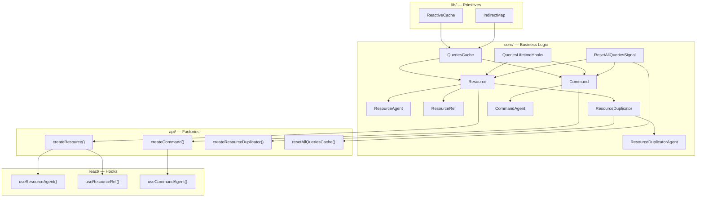

## Summary

The query v1 module (`src/query/`) is a mature data-fetching and mutation layer built on top of the signals system and RxJS. It provides three core abstractions — **Resource** (read queries), **Command** (mutations/write operations), and **ResourceDuplicator** (batch resource composition) — organized in a strict layering: `lib/` → `core/` → `api/` → `react/`. The module uses reactive caching with configurable lifetime, supports optimistic updates via Immer patches, lifecycle hooks (`onCacheEntryAdded`, `onQueryStarted`), DevTools integration, a link system connecting Commands to Resources, and abort-signal-based request cancellation. The "Operation" concept is fully deprecated in favor of "Command" — all Operation types/classes are re-exports.

## Findings

### 1. Module Structure and Organization

#### File Tree

```
src/query/
├── index.ts                          # Public API barrel
├── SKIP_TOKEN.ts                     # SKIP symbol for conditional queries
├── SKIP_TOKEN.test.ts
├── api/
│   ├── createResource.ts             # Factory: Resource
│   ├── createCommand.ts              # Factory: Command
│   ├── createOperation.ts            # Deprecated: re-exports createCommand
│   ├── createResourceDuplicator.ts   # Factory: ResourceDuplicator
│   └── resetAllQueriesCache.ts       # Global cache reset
├── core/
│   ├── QueriesCache.ts               # Cache container using IndirectMap + ReactiveCache
│   ├── QueriesCache.test.ts
│   ├── QueriesLifetimeHooks.ts       # Lifecycle hooks (onCacheEntryAdded, onQueryStarted)
│   ├── QueriesLifetimeHooks.test.ts
│   ├── ResetAllQueriesSignal.ts      # Global reset signal (RxJS Subject + Batcher)
│   ├── ResetAllQueriesSignal.test.ts
│   ├── Resource/
│   │   ├── Resource.ts               # Core Resource class + ResourceQueryState
│   │   ├── Resource.test.ts
│   │   ├── ResourceAgent.ts          # Agent proxy for Resource (reactive state)
│   │   ├── ResourceRef.ts            # Ref abstraction for cache manipulation
│   │   ├── ResourceRef.test.ts
│   │   ├── ResourceDuplicator.ts     # Batch resource composition + ComputedReactiveCache
│   │   ├── ResourceDuplicator.test.ts
│   │   └── ResourceDuplicatorAgent.ts
│   ├── Command/
│   │   ├── index.ts                  # Barrel: Command + CommandAgent
│   │   ├── Command.ts                # Core Command class + CommandQueryState
│   │   ├── Command.test.ts
│   │   └── CommandAgent.ts           # Agent proxy for Command
│   └── Operation/
│       ├── Operation.ts              # Deprecated: re-exports Command
│       └── OperationAgent.ts         # Deprecated: re-exports CommandAgent
├── lib/
│   ├── IndirectMap.ts                # Map with shallow-equal key lookup
│   ├── IndirectMap.test.ts
│   ├── ReactiveCache.ts             # BehaviorSubject-based reactive cache with TTL
│   └── ReactiveCache.test.ts
├── react/
│   ├── useResourceAgent.ts           # Hook: subscribes to Resource state
│   ├── useResourceAgent.test.ts
│   ├── useResourceRef.ts             # Hook: creates ResourceRef
│   ├── useResourceRef.test.ts
│   ├── useCommandAgent.ts            # Hook: trigger + state for Command
│   ├── useCommandAgent.test.ts
│   └── useOperationAgent.ts          # Deprecated: re-exports useCommandAgent
└── types/
    ├── index.ts                      # Barrel: all type exports
    ├── shared.types.ts               # CacheEntryAddedTools, QueryStartedTools, OnCacheEntryAdded, OnQueryStarted
    ├── Resource.types.ts             # ResourceCreateFn, ResourceCreateOptions, ResourceDefinition, ResourceInstance, ResourceAgentInstance, ResourceQueryState, ResourceTransaction, ResourceRefInstance, ResourceQueryFnTools
    ├── Command.types.ts              # CommandCreateFn, CommandCreateOptions, CommandDefinition, CommandInstance, CommandAgentInstance, CommandQueryState, LinkOptions
    └── Operation.types.ts            # Deprecated: re-exports all Command types
```

#### Layering



#### Public API Surface (`@/query/index.ts`)

- **Location**: `@/src/query/index.ts:1-19`
- Exports:
  - `createCommand`, `useCommandAgent`
  - `createResource`, `createResourceDuplicator`, `resetAllQueriesCache`
  - `SKIP` token
  - All types from `types/`
  - `useResourceAgent`, `useResourceRef`
  - Deprecated: `createOperation`, `useOperationAgent`
- The root `@/src/index.ts:6` re-exports the entire query module via `export * from "./query"`.

---

### 2. Core Abstractions

#### 2.1 Resource (`@/src/query/core/Resource/Resource.ts`)

**What it does**: Manages read-only data queries with caching, lifecycle hooks, abort control, and data selection.

**Internal state type** — `CoreResourceQueryState<D>` (lines 21-36):
- `transactions: ResourceTransaction[] | null` — pending Immer patch transactions
- `abortController: AbortController | null` — for cancelling in-flight requests
- `args`, `data`, `savedData` (pre-transaction original), `error`
- Boolean flags: `isError`, `isLoading`, `isReloading`, `isDone`, `isSuccess`, `isLocked`, `isInitiated`
- `lockCount: number` — counting semaphore for locks

**Static state transition methods** in private `ResourceQueryState` class (lines 39-130):
| Method | Transition |
|--------|-----------|
| `create(args)` | Initial idle state |
| `load(state, args)` | → Loading (sets `abortController`, `isLoading` or `isReloading` based on `isDone`) |
| `success(state, data)` | → Success (clears abort, transactions, savedData) |
| `error(state, error)` | → Error |
| `incrementLock(state)` / `decrementLock(state)` | Lock counting |
| `update(state, data, savedData, transactions)` | Data patching (from ResourceRef) |
| `createWithData(data, args)` | Pre-populated success state (not initiated) |

**Key dependencies**:
- `@/common/options/SharedOptions` — for `defaultCompareArgs`
- `@/query/lib/ReactiveCache` — per-cache-entry reactive store
- `QueriesCache` — map of args → `ReactiveCache<CoreResourceQueryState>`
- `QueriesLifetimeHooks` — lifecycle management
- `ResetAllQueriesSignal` — subscribes to global reset (aborts active controllers, resets all entries to initial state)

**Key methods** on `Resource` class (lines 132-336):
- `createAgent()` → returns `ResourceAgent`
- `createRef(args)` → returns `ResourceRef`
- `getQueryCache(args)` / `createQueryCache(args)` — cache management; `createQueryCache` wires lifecycle hooks (spy$ for `cacheDataLoaded`, `onClean$` for `cacheEntryRemoved`, `dataChanged$`)
- `incrementLock(args)` / `decrementLock(args)` — lock management, creates cache if needed
- `update(args, updateFn)` — applies data transformation; used by ResourceRef.patch()
- `createWithData(args, data)` — pre-populate cache (won't overwrite if already initiated)
- `initiate(args)` — performs the query: creates or reuses cache, aborts previous in-flight request, calls `queryFn`, resolves via `select` transform, calls lifecycle hooks
- `compareArgs(a, b)` — delegates to `_options.compareArgsFn ?? SharedOptions.defaultCompareArgs`

#### 2.2 ResourceAgent (`@/src/query/core/Resource/ResourceAgent.ts`)

**What it does**: Proxy over Resource that manages current/previous cache references and produces a single reactive `state$` signal for consumers. Handles "show previous data while loading" pattern.

**Key patterns**:
- Uses `Signal.state` for `_resources$` holding `{ previous$, current$ }` cache references (line 7, `{ isDisabled: true }`)
- `state$` is a `Computed.create` (line 14, `{ isDisabled: true }`) that:
  - Catches the "not initiated after reset" case and re-initiates
  - Shows previous successful data while current is loading (`isShowPrev` logic)
  - Derives `isInitialLoading` flag from `isLoading && !isDone && !prevState?.isDone`
- `_next(newCache)` manages the previous/current swap logic (lines 96-117): keeps `previous$` if the current wasn't done but previous was

#### 2.3 ResourceRef (`@/src/query/core/Resource/ResourceRef.ts`)

**What it does**: Provides direct cache manipulation for a specific args key — patch (optimistic updates via Immer), lock/unlock, invalidate, create.

**Key patterns**:
- Enables Immer patches: `enablePatches()` at module level (line 7)
- `patch(patchFn)` (lines 47-139): Uses `produceWithPatches` to create `patches`/`inversePatches`, builds a `ResourceTransaction` with `commit`/`abort` methods. The complex `reapplyFn` (lines 50-104) handles transaction ordering:
  - Before first pending: committed → apply & remove; aborted → skip
  - Pending → apply & keep
  - After pending: committed → apply & keep; aborted → rollback & keep (if more pending follows)
- `has` (line 19): lazy — checks cache on access
- `lock()` / `unlockOne()`: delegates to `Resource.incrementLock/decrementLock`
- `invalidate()`: calls `Resource.initiate` (re-fetches)
- `create(data)`: calls `Resource.createWithData`

#### 2.4 ResourceDuplicator (`@/src/query/core/Resource/ResourceDuplicator.ts`)

**What it does**: Composes multiple individual resource cache entries from a batch query. Used when a single API call returns data for multiple args items.

**Key patterns**:
- Works with array args (`D["ARGS_ITEM"][]`) and array data (`D["DATA_ITEM"][]`)
- `d_init(args)` (lines 121-175): splits args into "released" (already in cache) and "unreleased" (need fetching), creates a `Signal.compute` that aggregates state from multiple caches, maps data items to args keys via `getDataKey`/`getArgKey`
- `serialize(args)` — pipe-separated key string
- Uses `ComputedReactiveCache` instead of `ReactiveCache` — wraps a computed signal's observable
- Forward info (`_fis`) maps individual arg keys to shared resource caches with reference counting

#### 2.5 Command (`@/src/query/core/Command/Command.ts`)

**What it does**: Manages mutation operations with linking to Resources, optimistic updates, and transaction management.

**Internal state type** — `CoreCommandQueryState<D>` (lines 14-25):
- `arg`, `data`, `error`
- Boolean flags: `isError`, `isLoading`, `isRepeating`, `isDone`, `isSuccess`, `isInitiated`

**State transition methods** in `CommandQueryState`:
| Method | Transition |
|--------|-----------|
| `create()` | Initial idle state |
| `load(state, args)` | → Loading (sets `isRepeating` if was done) |
| `success(state, data)` | → Success |
| `error(state, error)` | → Error |

**Link system** (lines 159-235): On `_initiate`:
1. For each link: get `forwardedArgs`, create `ResourceRef`
2. Before query: `lock()` if configured, `optimisticUpdate()` → `ref.patch()`
3. On success: `update()` → `ref.patch().commit()`, `create()` → `ref.create()`, `invalidate()` → `ref.invalidate()`, commit optimistic patch
4. On error: abort optimistic patches, unlock
5. All updates wrapped in `Batcher.run()`

**Key dependencies**: Same as Resource (`QueriesCache`, `QueriesLifetimeHooks`, `ResetAllQueriesSignal`), plus `Batcher` from signals for batched state updates, `PromiseResolver` for deprecated `mutate()` method.

**Default cache lifetime**: 1 second (vs Resource's 60 seconds).

#### 2.6 CommandAgent (`@/src/query/core/Command/CommandAgent.ts`)

**What it does**: Simpler proxy than ResourceAgent — only tracks `current$` (no previous), always re-initiates on `initiate()`.

- `state$` Computed maps `CoreCommandQueryState` to `CommandQueryState` (null-to-undefined conversion)
- `initiate(args)` always calls `this._command.initiate(args, { cache })` — Commands always re-execute
- `createAgent()` returns a new `CommandAgent` (for independent state tracking)

#### 2.7 QueriesCache (`@/src/query/core/QueriesCache.ts`)

**What it does**: A map from args → `ReactiveCache<VALUE>` instances. Manages cache creation and auto-cleanup.

- **Location**: `@/src/query/core/QueriesCache.ts:1-37`
- Uses `IndirectMap` for key comparison (defaults to `shallowEqual`)
- `createQueryCache(args, initialState)`: creates a `ReactiveCache`, subscribes to `onClean$` to auto-remove from the map when the cache completes
- `getQueryCache(args)`: returns existing cache or undefined
- `values()`: iterator over all caches
- Constructor takes `cacheLifeTime` and optional `compareArgsFn`

#### 2.8 QueriesLifetimeHooks (`@/src/query/core/QueriesLifetimeHooks.ts`)

**What it does**: Manages lifecycle hooks for cache entries and queries. Integrates with DevTools and shared error handling.

- **Location**: `@/src/query/core/QueriesLifetimeHooks.ts:1-115`
- Collects arrays of `onCacheEntryAdded` and `onQueryStarted` listeners
- Automatically adds DevTools listener if `Devtools.hasDevtools` and `devtoolsName !== false` (lines 32-49)
- Automatically adds error handler if `SharedOptions.onQueryError` is set (lines 51-56)
- `onCacheEntryAdded(args)` returns `{ cacheDataLoaded, cacheEntryRemoved, dataChanged$ }` — resolvers for the hook promises
- `onQueryStarted(args)` returns `{ fulfilledSuccess, fulfilledError }` — resolvers for `$queryFulfilled` promise
- Uses `PromiseResolver` utility from `@/common/utils`

#### 2.9 ResetAllQueriesSignal (`@/src/query/core/ResetAllQueriesSignal.ts`)

**What it does**: Global signal broadcast for resetting all query caches.

- **Location**: `@/src/query/core/ResetAllQueriesSignal.ts:1-13`
- Static `Subject` + static `clean$` property
- `clean()` wraps emission in `Batcher.run()` for batched updates
- Both Resource and Command subscribe to `clean$` in their constructors

---

### 3. API Layer

#### 3.1 Factory Functions

All factories are thin wrappers — `new Class(options)` with type casting:

| Factory | Location | Creates |
|---------|----------|---------|
| `createResource` | `@/src/query/api/createResource.ts:1-4` | `new Resource(options)` |
| `createCommand` | `@/src/query/api/createCommand.ts:1-22` | `new Command(options)` |
| `createOperation` | `@/src/query/api/createOperation.ts:1-7` | Deprecated, re-exports `createCommand` |
| `createResourceDuplicator` | `@/src/query/api/createResourceDuplicator.ts:1-10` | `new ResourceDuplicator(options)` |
| `resetAllQueriesCache` | `@/src/query/api/resetAllQueriesCache.ts:1-4` | Calls `ResetAllQueriesSignal.clean()` |

#### 3.2 Configuration Options

**ResourceCreateOptions** (`@/src/query/types/Resource.types.ts:16-50`):
- `queryFn(args, tools: { abortSignal? })` — required
- `select?(data) → selected` — optional data transform
- `cacheLifetime?: number | false` — default 60_000ms
- `onCacheEntryAdded?`, `onQueryStarted?` — lifecycle hooks
- `devtoolsName?: string | false`
- `compareArgsFn?` — custom args equality

**CommandCreateOptions** (`@/src/query/types/Command.types.ts:16-45`):
- `queryFn(args)` — required (no abort signal)
- `select?` — optional data transform
- `link?` — Resource linking configuration
- `cacheLifetime?: number | false` — default 1_000ms
- `onCacheEntryAdded?`, `onQueryStarted?` — lifecycle hooks
- `devtoolsName?: string | false`

**LinkOptions** (`@/src/query/types/Command.types.ts:51-111`):
- `resource` — target Resource instance
- `forwardArgs(commandArgs) → resourceArgs` — args mapping
- `invalidate?: boolean` — re-fetch after command success
- `lock?: boolean` — lock resource during command execution
- `update?({ draft, args, data })` — Immer-style post-success update
- `optimisticUpdate?({ draft, args })` — Immer-style pre-query update
- `create?({ args, data })` — create new cache entry on success

---

### 4. React Integration

#### 4.1 useResourceAgent (`@/src/query/react/useResourceAgent.ts:1-52`)

- Signature: `useResourceAgent(resource | duplicator, args | SKIP)`
- Uses `useConstant` for one-time agent creation with initial `initiate(args)` if not SKIP
- On re-render: compares args via `agent.compareArgs` — only re-initiates if args changed
- Subscribes via `useSignal(agent.state$)` from signals/react
- Returns `ResourceQueryState` (flat object)
- Also accepts `ResourceDuplicator` — polymorphic via `createAgent()` shared interface

#### 4.2 useResourceRef (`@/src/query/react/useResourceRef.ts:1-25`)

- Signature: `useResourceRef(resource, args | SKIP)`
- Uses `React.useRef` for stable args (via `shallowEqual` comparison)
- Creates ref via `React.useMemo(() => resource.createRef(stableArgs), [stableArgs])`
- Returns `ResourceRefInstance` (imperative API: `has`, `lock`, `unlock`, `patch`, `invalidate`, `create`)
- No reactive subscription — it's an imperative handle

#### 4.3 useCommandAgent (`@/src/query/react/useCommandAgent.ts:1-50`)

- Signature: `useCommandAgent(command)`
- Returns tuple `[trigger, state]`
- `trigger(args)` → initiates command + returns Promise (subscribes to `agent.state$.obs` for resolution)
- Uses `useConstant` for agent, `useSignal` for state, `useEventHandler` for stable trigger reference
- No SKIP token support (Commands are imperative)

#### SKIP_TOKEN

- **Location**: `@/src/query/SKIP_TOKEN.ts:1` — `export const SKIP = Symbol("SKIP")`
- Used to conditionally skip query initiation in `useResourceAgent` and `useResourceRef`
- Type-level: varargs pattern allowing `void` args to omit the parameter entirely

#### No Provider/Context

The v1 module does **not** use React Context or Provider. All state is managed via factory-created instances and signals. Hooks subscribe directly to signal observables.

---

### 5. Library Utilities

#### 5.1 IndirectMap (`@/src/query/lib/IndirectMap.ts:1-112`)

- **What it does**: A `Map` wrapper that supports shallow-equal lookup for object keys
- Uses `WeakMap<object, KEY>` as a comparison cache for O(1) repeated lookups after first linear scan
- Constructor takes optional `compareFn` (default: `shallowEqual` from `@/common/utils`)
- Methods: `get`, `set`, `delete`, `has`, `values`
- For primitive keys: falls through to standard `Map` behavior
- For object keys: linear scan through map keys using `compareFn`, caches result in `WeakMap`

#### 5.2 ReactiveCache (`@/src/query/lib/ReactiveCache.ts:1-108`)

- **What it does**: A single-value reactive cache with configurable TTL based on subscriber reference counting
- Wraps `BehaviorSubject<VALUE>` for state storage
- `value$: ReadableSignalLike<VALUE>` — the reactive signal (created via `signalize()` from the signals module)
- `spy$: Observable<VALUE>` — side-effect-free observable for DevTools (uses `takeUntil(onClean$)`)
- `onClean$: Subject<VALUE>` — fires on completion
- TTL logic in `share()` RxJS operator:
  - `cacheLifeTime === false` → never reset
  - `cacheLifeTime <= 0` → reset immediately on unsubscribe
  - `cacheLifeTime > 0` → reset after timer expires with zero subscribers
- `signalize()` wraps the shared observable into a `ReadableSignalLike` (bridging RxJS → signals)

#### 5.3 ComputedReactiveCache (`@/src/query/core/Resource/ResourceDuplicator.ts:236-304`)

- Variant of ReactiveCache that wraps a computed signal's observable instead of a `BehaviorSubject`
- Constructor takes `{ obs, getValue, cacheLifeTime }` — no internal `next()` method
- Used exclusively by `ResourceDuplicator` for aggregated state

---

### 6. Testing Patterns

#### 6.1 Test Structure

Tests are co-located with source files (`*.test.ts` next to `*.ts`). Integration tests live in `@/src/__tests__/integration/`.

**Test count by area**:
- `lib/`: 2 test files (IndirectMap, ReactiveCache)
- `core/`: 6 test files (QueriesCache, QueriesLifetimeHooks, ResetAllQueriesSignal, Resource, ResourceRef, ResourceDuplicator, Command)
- `react/`: 3 test files (useResourceAgent, useResourceRef, useCommandAgent)
- Root: 1 test file (SKIP_TOKEN)

#### 6.2 Test Utilities (`@/src/__tests__/helpers/`)

| Helper | Location | Purpose |
|--------|----------|---------|
| `flushMicrotasks()` | `@/src/__tests__/helpers/async-helpers.ts:1-5` | `new Promise(resolve => queueMicrotask(resolve))` — flushes Promise microtask queue |
| `collectValues(signal)` | `@/src/__tests__/helpers/signal-helpers.ts:1-13` | Subscribes to signal observable, collects values into array |
| `resetSharedOptions()` | `@/src/__tests__/helpers/singleton-reset.ts:1-8` | Calls `SharedOptions.reset()` for test isolation |

**Global setup** (`@/src/__tests__/setup.ts:1-9`): `beforeEach` calls `resetSharedOptions()`.

#### 6.3 Mocking Strategies

**"Controllable" pattern** — consistently used across Resource, Command, and Duplicator tests:
```ts
function createControllableResource() {
    const calls: Array<{ resolve, reject }> = [];
    const queryFn = vi.fn((_args) => new Promise((resolve, reject) => {
        calls.push({ resolve, reject });
    }));
    const resource = createResource({ queryFn, cacheLifetime: false, devtoolsName: false });
    return { resource, queryFn, calls };
}
```
- `cacheLifetime: false` eliminates TTL interference
- `devtoolsName: false` disables DevTools hooks
- Promises are manually resolved/rejected via the `calls` array
- `flushMicrotasks()` used after resolve/reject to flush promise chains

**React hooks**: use `@testing-library/react` — `renderHook`, `act`, `rerender`.

#### 6.4 Test Coverage Patterns

**What is tested**:
- State transitions (idle → loading → success/error)
- Abort/cancellation on re-initiation
- Cache reuse (same args → same cache)
- Cache isolation (different args → different caches)
- Select transforms
- Link system (invalidate on command success)
- Transaction lifecycle (patch → commit/abort, multiple patches, idempotent commit/abort)
- Lock/unlock reference counting
- Lifecycle hooks (onQueryStarted, onCacheEntryAdded)
- React hook rendering, SKIP token, args comparison stability
- Edge cases (null keys, empty args, deprecated API compatibility)

**What is NOT tested**:
- ResourceDuplicatorAgent (no dedicated test file)
- ResourceAgent (no dedicated test file — tested indirectly via useResourceAgent)
- optimisticUpdate in link (tested only invalidate in Command.test.ts)
- `link.update`, `link.create`, `link.lock` (not directly tested in unit tests)
- DevTools integration hooks (requires Devtools.hasDevtools to be true)
- `SharedOptions.onQueryError` integration path
- Timer-based cache expiry in integration with Resource/Command

**Integration tests** (`@/src/__tests__/integration/`):
- `root-exports.test.ts` — verifies all public exports exist
- `deprecated-api.test.ts` — verifies backward compatibility of deprecated Signal/State API
- No query-specific integration tests found

---

### 7. Type System

#### Organization (`@/src/query/types/`)

All types are defined in `types/` and re-exported via `types/index.ts`. No runtime code in type files.

#### Key Type Hierarchy

```mermaid
graph TB
    subgraph "Shared Types"
        Prettify["Prettify<T>"]
        FallbackOnNever["FallbackOnNever<T, F>"]
        CacheEntryAddedTools["CacheEntryAddedTools<DATA>"]
        QueryStartedTools["QueryStartedTools<DATA>"]
        OnCacheEntryAdded["OnCacheEntryAdded<ARGS, DATA>"]
        OnQueryStarted["OnQueryStarted<ARGS, DATA>"]
    end

    subgraph "Resource Types"
        ResourceDefinition["ResourceDefinition<A, R, S>"]
        ResourceCreateOptions["ResourceCreateOptions<D>"]
        ResourceInstance["ResourceInstance<D>"]
        ResourceAgentInstance["ResourceAgentInstance<D>"]
        ResourceQueryState["ResourceQueryState<D>"]
        ResourceRefInstance["ResourceRefInstance<D>"]
        ResourceTransaction["ResourceTransaction"]
        ResourceQueryFnTools["ResourceQueryFnTools"]
    end

    subgraph "Command Types"
        CommandDefinition["CommandDefinition<A, R, S>"]
        CommandCreateOptions["CommandCreateOptions<D>"]
        CommandInstance["CommandInstance<D>"]
        CommandAgentInstance["CommandAgentInstance<D>"]
        CommandQueryState["CommandQueryState<D>"]
        LinkOptions["LinkOptions<D, RD>"]
    end

    ResourceDefinition --> ResourceCreateOptions
    ResourceDefinition --> ResourceInstance
    ResourceDefinition --> ResourceAgentInstance
    ResourceDefinition --> ResourceQueryState
    ResourceDefinition --> ResourceRefInstance
    FallbackOnNever --> ResourceDefinition
    OnCacheEntryAdded --> ResourceCreateOptions
    OnQueryStarted --> ResourceCreateOptions

    CommandDefinition --> CommandCreateOptions
    CommandDefinition --> CommandInstance
    CommandDefinition --> CommandAgentInstance
    CommandDefinition --> CommandQueryState
    FallbackOnNever --> CommandDefinition
    ResourceInstance --> LinkOptions
    CommandDefinition --> LinkOptions
    OnCacheEntryAdded --> CommandCreateOptions
    OnQueryStarted --> CommandCreateOptions
```



#### Definition Pattern

Both `ResourceDefinition` and `CommandDefinition` use the same branded-type approach:
```ts
type ResourceDefinition<A = any, R = any, S = any> = {
    Args: A;       // Input arguments
    Result: R;     // Raw query result
    Selected: S;   // Select-transformed result
    Data: FallbackOnNever<S, R>;  // Resolved data type (Selected if specified, else Result)
};
```

#### ReadableSignalLike dependency

Agent `state$` properties are typed as `ReadableSignalLike` from `@/signals/types`, bridging the query module to the signals system. This is the primary reactivity interface.

---

## Code References

- `@/src/query/index.ts:1-19` — Public API barrel
- `@/src/query/SKIP_TOKEN.ts:1` — SKIP symbol definition
- `@/src/query/types/shared.types.ts:1-35` — Shared lifecycle hook types
- `@/src/query/types/Resource.types.ts:1-135` — Resource type definitions
- `@/src/query/types/Command.types.ts:1-158` — Command + LinkOptions type definitions
- `@/src/query/types/Operation.types.ts:1-25` — Deprecated Operation type aliases
- `@/src/query/lib/IndirectMap.ts:1-112` — Shallow-equal keyed Map
- `@/src/query/lib/ReactiveCache.ts:1-108` — Reactive cache with TTL
- `@/src/query/core/QueriesCache.ts:1-37` — Args → ReactiveCache container
- `@/src/query/core/QueriesLifetimeHooks.ts:1-115` — Lifecycle hook manager
- `@/src/query/core/ResetAllQueriesSignal.ts:1-13` — Global reset broadcast
- `@/src/query/core/Resource/Resource.ts:1-336` — Resource implementation and state machine
- `@/src/query/core/Resource/ResourceAgent.ts:1-117` — Resource agent (reactive proxy)
- `@/src/query/core/Resource/ResourceRef.ts:1-155` — Cache ref with Immer patches
- `@/src/query/core/Resource/ResourceDuplicator.ts:1-304` — Batch resource composition + ComputedReactiveCache
- `@/src/query/core/Resource/ResourceDuplicatorAgent.ts:1-118` — Duplicator agent
- `@/src/query/core/Command/Command.ts:1-249` — Command implementation with link system
- `@/src/query/core/Command/CommandAgent.ts:1-75` — Command agent
- `@/src/query/core/Command/index.ts:1-2` — Barrel export
- `@/src/query/core/Operation/Operation.ts:1-8` — Deprecated re-export
- `@/src/query/core/Operation/OperationAgent.ts:1-4` — Deprecated re-export
- `@/src/query/api/createResource.ts:1-4` — Resource factory
- `@/src/query/api/createCommand.ts:1-22` — Command factory
- `@/src/query/api/createOperation.ts:1-7` — Deprecated factory
- `@/src/query/api/createResourceDuplicator.ts:1-10` — Duplicator factory
- `@/src/query/api/resetAllQueriesCache.ts:1-4` — Global reset function
- `@/src/query/react/useResourceAgent.ts:1-52` — Resource hook
- `@/src/query/react/useResourceRef.ts:1-25` — ResourceRef hook
- `@/src/query/react/useCommandAgent.ts:1-50` — Command hook
- `@/src/query/react/useOperationAgent.ts:1-7` — Deprecated hook
- `@/src/__tests__/helpers/async-helpers.ts:1-5` — flushMicrotasks helper
- `@/src/__tests__/helpers/signal-helpers.ts:1-13` — collectValues helper
- `@/src/__tests__/helpers/singleton-reset.ts:1-8` — SharedOptions reset
- `@/src/__tests__/setup.ts:1-9` — Global test setup
- `@/src/common/utils/PromiseResolver.ts:1-17` — Promise with external resolve/reject
- `@/src/index.ts:1-9` — Root barrel (re-exports query + query-v2 as `unstable_queryV2`)
