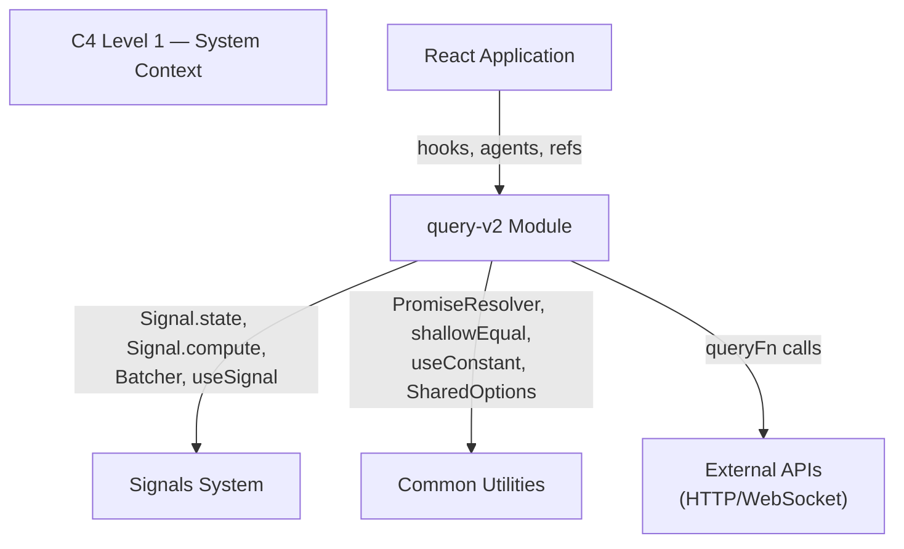
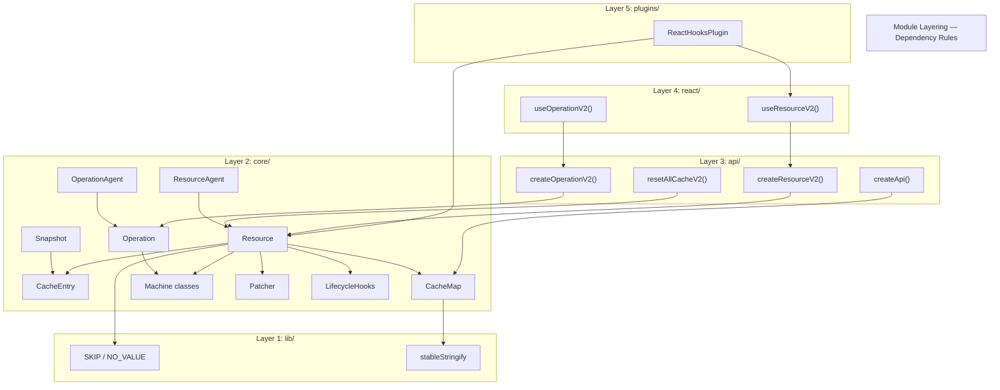
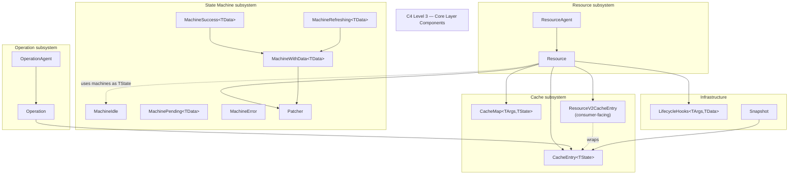
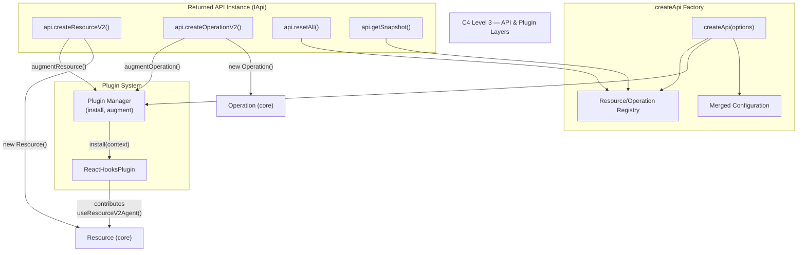
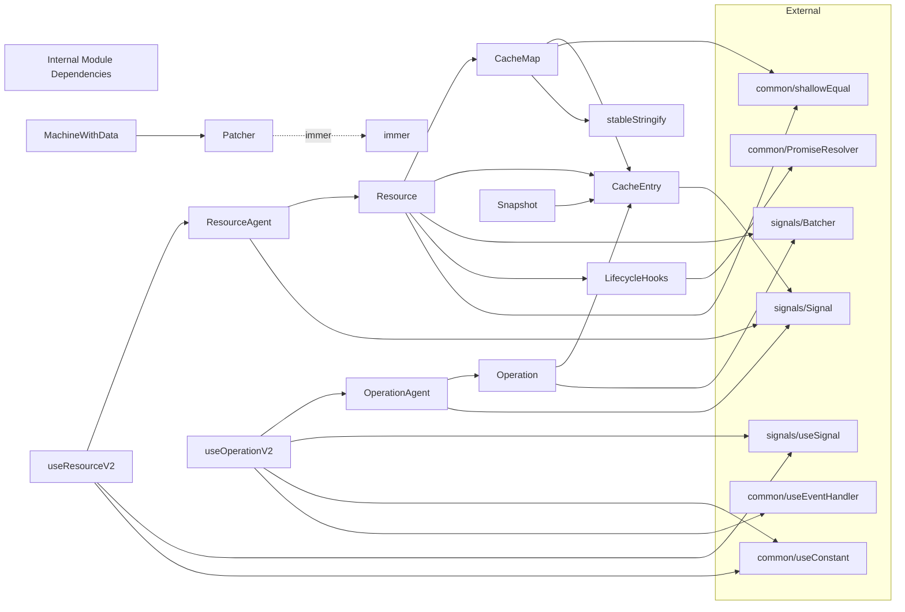
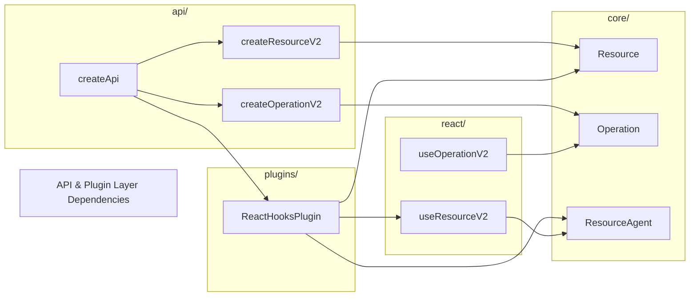
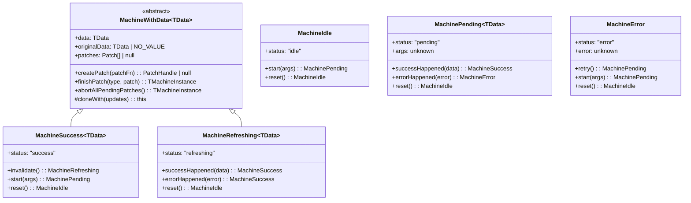
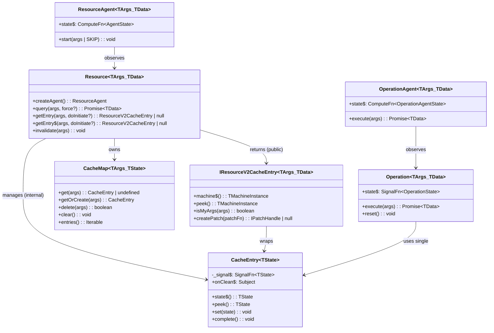

# System Architecture — query-v2

## 1. System Context (C4 Level 1)

query-v2 is one of three major modules in rx-toolkit, alongside `signals` and `query` (v1). It provides reactive data-fetching, machine-based cache state management, optimistic updates, SSR snapshots, and plugin-extensible React integration — all built on the `signals` reactive primitive layer.



## 2. Module Layering (C4 Level 2)

The module follows a strict 4-layer architecture. Each layer may depend only on layers below it. No upward or lateral cross-layer imports are permitted.

[ref: ../01-research/02-codebase-query-v1.md#1-module-structure-and-organization] — v1 uses the same `lib/ → core/ → api/ → react/` layering, proven in production.



### Layer Responsibilities

| Layer | Responsibility | May depend on | Examples |
|-------|---------------|---------------|----------|
| **lib/** | Pure utilities, sentinel values, zero-dependency helpers | Nothing (self-contained) | `SKIP`, `NO_VALUE`, `stableStringify` |
| **core/** | Business logic: state machines, cache storage, resource orchestration, agents, snapshots, lifecycle hooks, patching | `lib/`, `signals`, `common` | `Resource`, `Operation`, `CacheEntry`, `CacheMap`, `MachineIdle..MachineRefreshing`, `Patcher`, `ResourceAgent`, `OperationAgent`, `LifecycleHooks`, `Snapshot` |
| **api/** | Factory functions that compose core classes, plugin installation, configuration merging | `core/`, `lib/` | `createResourceV2()`, `createOperationV2()`, `createApi()`, `resetAllCacheV2()` |
| **react/** | React hooks bridging signals → React via `useSyncExternalStore` | `api/`, `core/`, `lib/`, `signals/react` | `useResourceV2()`, `useOperationV2()` |
| **plugins/** | Optional extensions that augment resources post-creation | `core/`, `react/` | `ReactHooksPlugin` |
| **types/** | TypeScript interfaces and type definitions; no runtime code | — (type-only) | All `*.types.ts` files |

## 3. Component Diagram (C4 Level 3) — Core Layer



## 3a. Component Diagram (C4 Level 3) — API & Plugin Layers



`createApi` is the primary entry-point factory. It creates a shared configuration, installs plugins, and returns an `IApi` instance with bound `createResourceV2`/`createOperationV2` factory methods. Each `createResourceV2` call creates a `Resource` (core), then invokes each plugin's `augmentResource()` to attach contributed methods (e.g., `ReactHooksPlugin` adds `useResourceV2Agent()`). The API instance maintains a registry of all created resources for `resetAll()` and `getSnapshot()` operations.

[ref: docs/query-v2/v0.1/README.md] — createApi is the entry point; all resources created through the API instance.
[ref: 04-decisions.md#adr-17-single-api-instance-as-entry-point] — ADR-17 covers the rationale.

## 4. Module Dependency Diagram — All Internal Connections



### 4a. API & Plugin Layer Dependencies



`createApi` orchestrates `createResourceV2`/`createOperationV2` and invokes plugins. `ReactHooksPlugin` depends on `useResourceV2` (react layer) and `Resource`/`ResourceAgent` (core layer) to contribute the `useResourceV2Agent()` hook method onto resource instances.

## 5. Class/Interface Hierarchy

### 5.1 Machine Class Hierarchy

[ref: ../01-research/01-codebase-query-v2.md#21-machine-state-model] — Machine classes are immutable; transitions return new instances.



### 5.2 Core Abstraction Hierarchy



## 6. Integration Points

### 6.1 Signals System Integration

[ref: ../01-research/01-codebase-query-v2.md#14-signals-system] — Signal primitives are the sole reactive backbone.

| query-v2 component | Signal primitive used | Purpose |
|--------------------|-----------------------|---------|
| `CacheEntry` | `Signal.state<TState>` | Stores state reactively. Resource uses `ICacheEntry<TMachineInstance<TData>>`. DevTools automatic via Signal.state |
| `Resource._status$` | `Signal.state<"idle" \| "ready">` | Resource-level idle/ready tracking for `getEntry$` reactivity |
| `Resource._lastEntry$` | `Signal.state<CacheEntry \| null>` | Last queried entry for `getEntry$` binded pattern |
| `ResourceAgent._tracking$` | `Signal.state<AgentTracking>` | Tracks previous/current cache entries for SWR |
| `ResourceAgent.state$` | `Signal.compute` | Derives flat agent state from tracking + machine signals |
| `Operation._state$` | `Signal.state<TMachineInstance>` | Stores operation's single machine state |
| `OperationAgent.state$` | `Signal.compute` | Derives flat agent state from operation signal |
| All state mutations | `Batcher.run()` | Ensures batch coherence: multiple signal writes → single notification pass |

DevTools are handled by Signal.state itself — no additional DevTools infrastructure is needed.
[ref: ../01-research/04-open-questions.md#q19-should-devtools-integration-be-part-of-the-core-implementation] — User decision: DevTools included in Signal.state, nothing more required.

### 6.2 Common Utilities Integration

| Utility | Used by | Purpose |
|---------|---------|---------|
| `PromiseResolver` | `LifecycleHooks` | Externally resolvable promises for `$cacheDataLoaded`, `$cacheEntryRemoved`, `$queryFulfilled` |
| `shallowEqual` | `CacheMap` (default `compareArg`), `ResourceAgent` (args comparison) | Default equality for cache key matching |
| `useConstant` | `useResourceV2`, `useOperationV2` | Stable agent creation across re-renders |
| `useEventHandler` | `useOperationV2` | Stable callback reference for execute trigger |
| `SharedOptions` | `Resource` (default compareArgs), optional onQueryError | Global configuration fallbacks |

### 6.3 React Integration

The React bridge is thin and relies entirely on `useSignal` from the signals module:

```
Agent.state$ (ComputeFn<T>)
    ↓  .obs (Observable<T>)
useSignal() → useSyncExternalStore(subscribe, getSnapshot)
    ↓
React component re-render
```

[ref: ../01-research/01-codebase-query-v2.md#93-signal--react-bridge] — `useSignal` uses `useSyncExternalStore` subscribing to `signal$.obs`.

Hooks also support SKIP token for conditional queries:
- `useResourceV2(resource, args | SKIP)` — when SKIP, agent is not started, returns idle state
- `useOperationV2(operation)` — returns `[trigger, state]` tuple

## 7. Boundary Definitions

### 7.1 Public API Boundary

The public API (exported from `index.ts`) exposes:

**Runtime:**
- `createResourceV2()`, `createOperationV2()`, `createApi()`, `resetAllCacheV2()`
- `useResourceV2()`, `useOperationV2()`
- `ReactHooksPlugin`
- `getSnapshot()`, `hydrateSnapshot()`, `CURRENT_SNAPSHOT_VERSION`
- `SKIP`, `NO_VALUE`
- `Machine` (static factory for `Machine.idle()`, `Machine.fromSnapshot()`)

**Types:**
- All public interfaces from `types/`

### 7.2 Internal Boundary

Not exported, invisible to consumers:
- `CacheEntry`, `CacheMap` — internal cache implementation
- `ResourceAgent`, `OperationAgent` — created via factory methods, not directly instantiated
- `Patcher` — internal to `MachineWithData`
- `LifecycleHooks` — internal to `Resource`/`Operation`
- `stableStringify` — internal to `CacheMap`
- `Resource._status$`, `Resource._lastEntry$` — internal reactive tracking

### 7.3 Extension Boundary (Plugins)

Plugins receive `IPluginContext` at install time and `augmentResource`/`augmentOperation` at creation time. They can add methods to resource/operation instances but cannot access internals.

[ref: ../01-research/01-codebase-query-v2.md#8-plugin-system] — Plugin `augmentResource` returns contributed methods merged via `Object.assign`.

## 8. Key Architectural Constraints

1. **No TError generic** — errors are always `unknown`. This eliminates the generic arity explosion identified in research. [ref: ../01-research/04-open-questions.md#q1-should-resourcev2-carry-terror-as-a-generic-parameter]

2. **No Command** — only Resource and Operation for this iteration. API/plugin interfaces should not preclude future Command addition. [ref: ../01-research/04-open-questions.md#q3-should-command-mutation-support-be-included-in-scope]

3. **v0.1 docs are canonical** — the existing v2 code is not a reference. Naming follows docs: `getEntry()` (not `entry()`), `getEntry$()` (not `entry$()`), `machine$()` (not `state$`). All public API names carry a "V2" suffix to distinguish from v1 exports (see [ADR-16](04-decisions.md#adr-16-v2-naming-convention--public-api-suffix)). [ref: ../01-research/01-codebase-query-v2.md#162-naming-mismatches-docs-vs-implementation]

4. **Minimal stableStringify** — handles plain objects, arrays, primitives. No Date/Map/Set. [ref: ../01-research/04-open-questions.md#q10-what-cache-key-serialization-strategy-should-stablestringify-support]

5. **Signal.state provides DevTools** — no separate DevTools infrastructure. [ref: ../01-research/04-open-questions.md#q19-should-devtools-integration-be-part-of-the-core-implementation]
