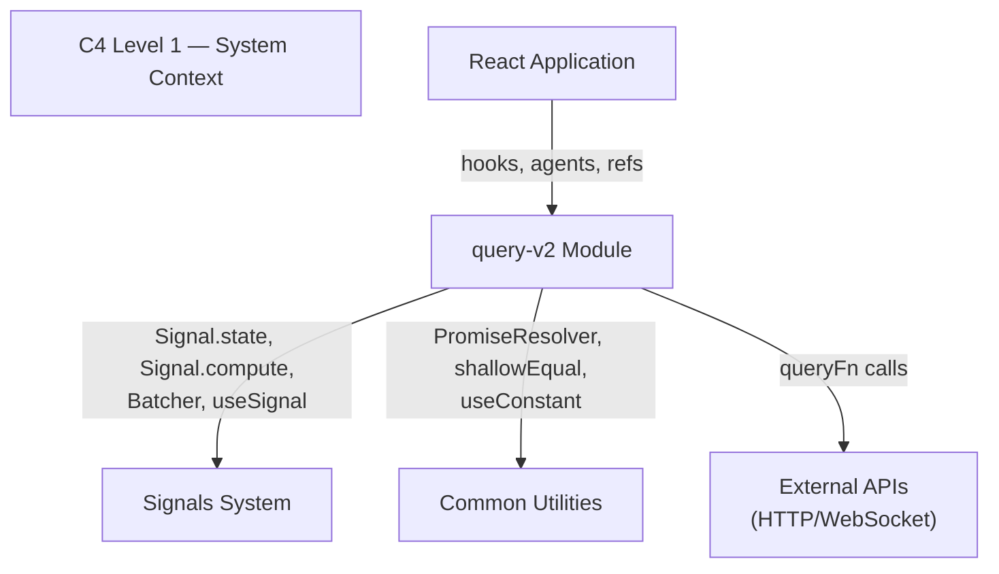
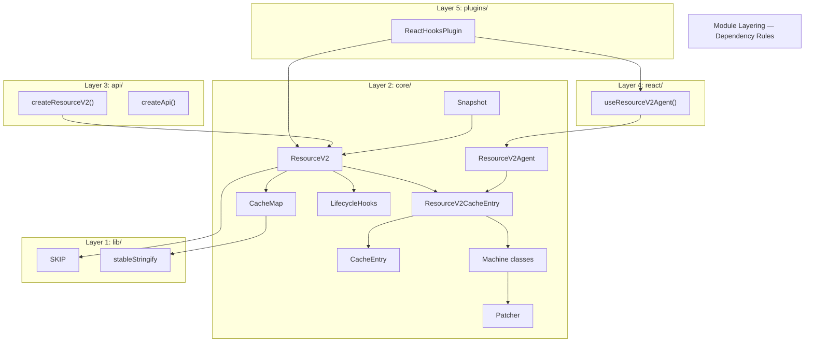
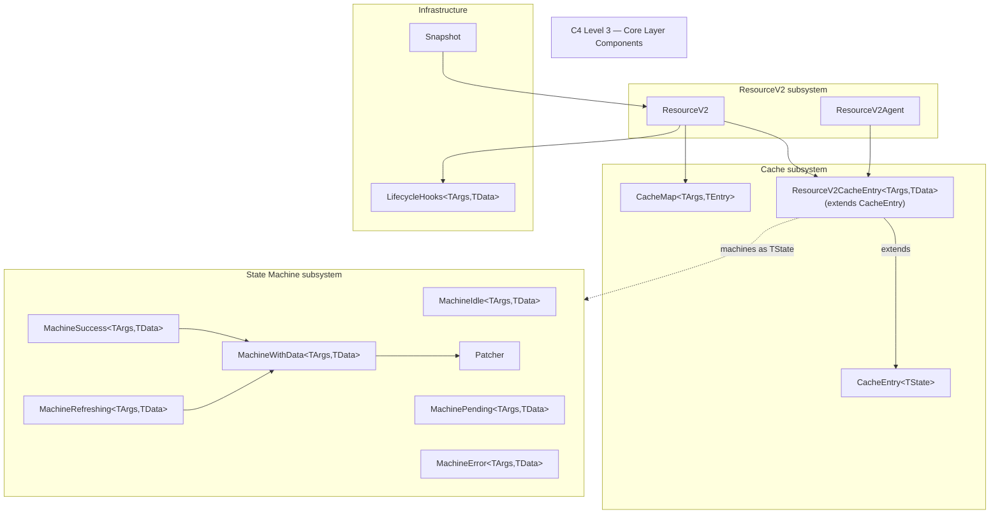
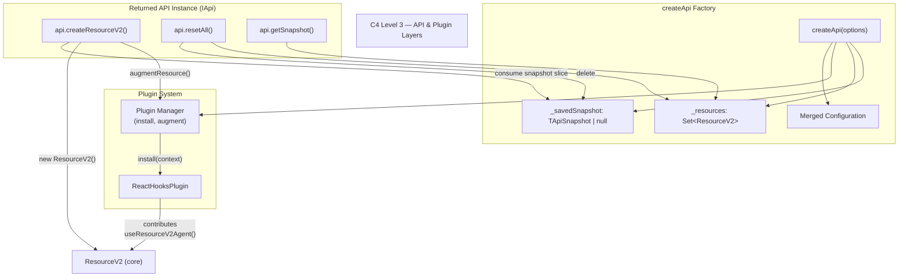
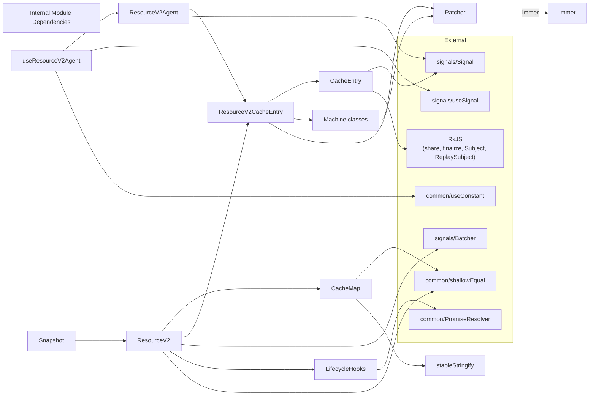
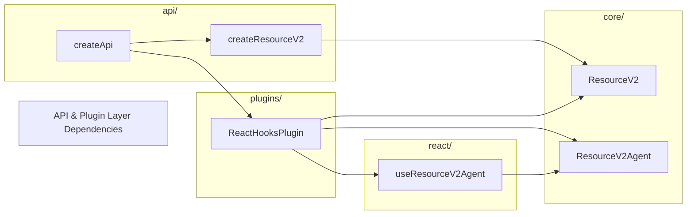
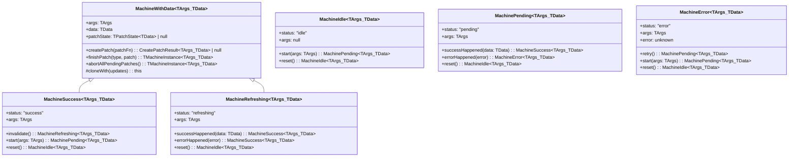
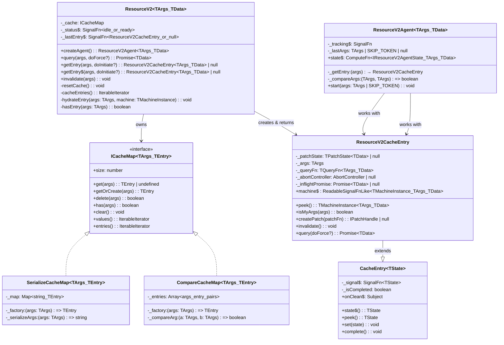

# System Architecture — query-v2

## 1. System Context (C4 Level 1)

query-v2 is one of three major modules in rx-toolkit, alongside `signals` and `query` (v1). It provides reactive data-fetching, machine-based cache state management, optimistic updates, SSR snapshots, and plugin-extensible React integration — all built on the `signals` reactive primitive layer.



## 2. Module Layering (C4 Level 2)

The module follows a strict 5-layer architecture. Each layer may depend only on layers below it. No upward or lateral cross-layer imports are permitted.

[ref: ../01-research/02-codebase-query-v1.md#1-module-structure-and-organization] — v1 uses the same `lib/ → core/ → api/ → react/` layering, proven in production.



### Layer Responsibilities

| Layer | Responsibility | May depend on | Examples |
|-------|---------------|---------------|----------|
| **lib/** | Pure utilities, sentinel values, zero-dependency helpers | Nothing (self-contained) | `SKIP`, `stableStringify` |
| **core/** | Business logic: state machines, cache storage, resource orchestration, agents, snapshots, lifecycle hooks, patching | `lib/`, `signals`, `common` | `ResourceV2`, `CacheEntry`, `CacheMap`, `MachineIdle..MachineRefreshing`, `Patcher`, `ResourceV2Agent`, `LifecycleHooks`, `Snapshot` |
| **api/** | Factory functions that compose core classes, plugin installation, configuration merging | `core/`, `lib/` | `createResourceV2()`, `createApi()` |
| **react/** | React hook bridging signals → React via `useSyncExternalStore` | `api/`, `core/`, `lib/`, `signals/react` | `useResourceV2Agent()` |
| **plugins/** | Optional extensions that augment resources post-creation | `core/`, `react/` | `ReactHooksPlugin` |
| **types/** | TypeScript interfaces and type definitions; no runtime code | — (type-only) | All `*.types.ts` files |

## 3. Component Diagram (C4 Level 3) — Core Layer



## 3a. Component Diagram (C4 Level 3) — API & Plugin Layers



`createApi` is the primary entry-point factory. It accepts an options object that may include `initialSnapshot: TApiSnapshot` — if provided, the snapshot is saved internally as `_savedSnapshot` for lazy per-resource consumption. It creates a shared configuration, installs plugins, and returns an `IApi` instance with a bound `createResourceV2` factory method. Each `createResourceV2` call creates a `ResourceV2` (core), checks `_savedSnapshot` for a matching slice (consuming and deleting it if found), then invokes each plugin's `augmentResource()` to attach contributed methods (e.g., `ReactHooksPlugin` adds `useResourceV2Agent()`). The API instance maintains an internal `Set<ResourceV2>` of all created resources for `resetAll()` and `getSnapshot()` operations. `resetAll()` also deletes `_savedSnapshot` entirely.

[ref: docs/query-v2/v0.1/README.md] — createApi is the entry point; all resources created through the API instance.
[ref: 04-decisions.md#adr-16-single-api-instance-as-entry-point] — ADR-16 covers the rationale.

## 4. Module Dependency Diagram — All Internal Connections



### 4a. API & Plugin Layer Dependencies



`createApi` orchestrates `createResourceV2` and invokes plugins. `ReactHooksPlugin` depends on `useResourceV2Agent` (react layer) and `ResourceV2`/`ResourceV2Agent` (core layer) to contribute the `useResourceV2Agent()` hook method onto resource instances.

## 5. Class/Interface Hierarchy

### 5.1 Machine Class Hierarchy

[ref: ../01-research/01-codebase-query-v2.md#21-machine-state-model] — Machine classes are immutable; transitions return new instances.



**`CreatePatchResult<TArgs, TData>`** = `{ machine: MachineWithData<TArgs, TData>, patchHandle: IPatchHandle }`. Since machines are immutable, `createPatch` returns both the new machine instance (with patched data and updated `patchState`) and the external handle for committing/aborting the patch. Returns `null` if the machine has no data (only possible on `MachineWithData` subclasses — `MachineSuccess` and `MachineRefreshing`). Tests SM31/SM36 verify this shape.

**Patch ownership boundary**: `MachineWithData.createPatch()` is a pure immutable transition — it produces a new machine instance with patched `data` and updated `patchState`, plus an `IPatchHandle`. `ResourceV2CacheEntry.createPatch()` is the orchestrator — it calls the machine's `createPatch`, stores the new machine in the signal via `set()`, manages the private `_patchState` field, and returns only the `IPatchHandle` to the consumer. The consumer never deals with machine instances directly through `createPatch`.

### 5.2 Core Abstraction Hierarchy



**`createCacheMap()` factory**: A static factory function `createCacheMap<TArgs, TEntry>(options: ICacheMapOptions<TArgs, TEntry>): ICacheMap<TArgs, TEntry>` in `core/CacheMap/` selects the implementation based on `options.keyStrategy` — returns `SerializeCacheMap` for `"serialize"` (default) and `CompareCacheMap` for `"compare"`. See [ADR-19](04-decisions.md#adr-19-cachemap-dual-implementation-with-factory-pattern).

**`IResourceV2CacheEntry<TArgs, TData>` — consumer-facing interface**: The concrete class `ResourceV2CacheEntry` (shown above) implements the public `IResourceV2CacheEntry<TArgs, TData>` interface. Consumers interact with entries exclusively through this interface (returned by `getEntry`, `getEntry$`, and the agent's `entry` field). The class itself is internal; the interface is the public API boundary.

**`LifecycleHooks<TArgs, TData>` method signatures**: LifecycleHooks orchestrates the `onCacheEntryAdded` and `onQueryStarted` callbacks provided in `IResourceV2Options`. Methods:
- `notifyCacheEntryAdded(args: TArgs, entry: IResourceV2CacheEntry<TArgs, TData>): void` — creates `ICacheEntryAddedTools<TData>` with `$cacheDataLoaded` and `$cacheEntryRemoved` promises (via PromiseResolver), invokes `onCacheEntryAdded(args, tools)`
- `notifyQueryStarted(args: TArgs, entry: IResourceV2CacheEntry<TArgs, TData>): void` — creates `IQueryStartedTools<TArgs, TData>` with `$queryFulfilled` promise and `getCacheEntry` accessor, invokes `onQueryStarted(args, tools)`

**ResourceV2 internal methods rationale** (Issue #6):
- `resetCache()` — called by `api.resetAll()` to complete all entries, clear CacheMap, and reset `_status$` to `"idle"`. Essential.
- `cacheEntries()` — delegates to `_cache.entries()`. Used by `getSnapshot()` to iterate all entries for snapshot capture (ADR-8). Essential for SSR.
- `hydrateEntry(args, machine)` — creates a cache entry pre-populated with a machine instance from snapshot data. Called during `createResourceV2()` when `_savedSnapshot` has a matching slice. Essential for snapshot hydration.
- `hasEntry(args)` — delegates to `_cache.has(args)`. Convenience check for entry existence.

## 6. Integration Points

### 6.1 Signals System Integration

[ref: ../01-research/01-codebase-query-v2.md#14-signals-system] — Signal primitives are the sole reactive backbone.

| query-v2 component | Signal primitive used | Purpose |
|--------------------|-----------------------|---------|
| `CacheEntry` | `Signal.state<TState>` | Stores state reactively. ResourceV2CacheEntry extends `CacheEntry<TMachineInstance<TArgs, TData>>`. DevTools automatic via Signal.state |
| `ResourceV2._status$` | `Signal.state<"idle" \| "ready">` | ResourceV2-level idle/ready tracking for `getEntry$` reactivity |
| `ResourceV2._lastEntry$` | `Signal.state<ResourceV2CacheEntry<TArgs, TData> \| null>` | Last queried entry for `getEntry$` binded pattern |
| `ResourceV2Agent._tracking$` | `Signal.state<AgentTracking>` | Tracks previous/current cache entries for SWR |
| `ResourceV2Agent.state$` | `Signal.compute` | Derives flat agent state from tracking + machine signals |
| Multi-signal mutations | `Batcher.run()` | Groups multiple signal writes into a single notification pass. **Optional for single changes** — a single `signal.set()` call propagates immediately without `Batcher.run()`. Use batching only when multiple signals must update atomically (e.g., machine transition + status change). |

DevTools are handled by Signal.state itself — no additional DevTools infrastructure is needed.
[ref: ../01-research/04-open-questions.md#q19-should-devtools-integration-be-part-of-the-core-implementation] — User decision: DevTools included in Signal.state, nothing more required.

### 6.2 Common Utilities Integration

| Utility | Used by | Purpose |
|---------|---------|---------|
| `PromiseResolver` | `LifecycleHooks` | Externally resolvable promises for `$cacheDataLoaded`, `$cacheEntryRemoved`, `$queryFulfilled` |
| `shallowEqual` | `CacheMap` (default `compareArg`), `ResourceV2Agent` (args comparison) | Default equality for cache key matching |
| `useConstant` | `useResourceV2Agent` | Stable agent creation across re-renders |

### 6.3 React Integration

The React bridge is thin and relies entirely on `useSignal` from the signals module:

```
Agent.state$ (ComputeFn<T>)
    ↓  .obs (Observable<T>)
useSignal() → useSyncExternalStore(subscribe, getSnapshot)
    ↓
React component re-render
```

[ref: ../01-research/01-codebase-query-v2.md#93-signal--react-bridge] — `useSignal` uses `useSyncExternalStore` subscribing to `signal$.obs`.

The `useResourceV2Agent` hook supports SKIP token for conditional queries:
- `useResourceV2Agent(resource, args | SKIP)` — when SKIP, agent is not started, returns idle state
- `resource.useResourceV2Agent(args | SKIP)` — same via plugin-contributed method

## 7. Boundary Definitions

### 7.1 Public API Boundary

The public API (exported from `index.ts`) exposes:

**Runtime:**
- `createResourceV2()`, `createApi()`
- `useResourceV2Agent()`
- `ReactHooksPlugin`
- `getSnapshot()`, `hydrateSnapshot()`, `CURRENT_SNAPSHOT_VERSION`
- `SKIP`
- `Machine` (static factory for `Machine.idle()`, `Machine.fromSnapshot()`)

**Types:**
- All public interfaces from `types/`

### 7.2 Internal Boundary

Not exported, invisible to consumers:
- `CacheEntry`, `CacheMap` — internal cache implementation
- `ResourceV2Agent` — created via factory methods, not directly instantiated
- `Patcher` — internal to `MachineWithData`
- `LifecycleHooks` — internal to `ResourceV2`
- `stableStringify` — internal to `CacheMap`
- `ResourceV2._status$`, `ResourceV2._lastEntry$` — internal reactive tracking
- `ResourceV2.resetCache()` — internal, called by `api.resetAll()` to complete all entries, clear CacheMap, and reset status

### 7.3 Extension Boundary (Plugins)

Plugins receive `IPluginContext` at install time and `augmentResource` at creation time. They can add methods to resource instances but cannot access internals.

[ref: ../01-research/01-codebase-query-v2.md#8-plugin-system] — Plugin `augmentResource` returns contributed methods merged via `Object.assign`.

## 8. Key Architectural Constraints

1. **No TError generic** — errors are always `unknown`. This eliminates the generic arity explosion identified in research. [ref: ../01-research/04-open-questions.md#q1-should-resourcev2-carry-terror-as-a-generic-parameter]

2. **Only ResourceV2** — scope is limited to ResourceV2 for this iteration; additional entity types are out of scope. [ref: ../01-research/04-open-questions.md#q3-should-command-mutation-support-be-included-in-scope]

3. **v0.1 docs are canonical** — the existing v2 code is not a reference. Naming follows docs: `getEntry()` (not `entry()`), `getEntry$()` (not `entry$()`), `machine$()` (not `state$`). All public API names carry a "V2" suffix to distinguish from v1 exports (see [ADR-15](04-decisions.md#adr-15-v2-naming-convention--public-api-suffix)). [ref: ../01-research/01-codebase-query-v2.md#162-naming-mismatches-docs-vs-implementation]

4. **Minimal stableStringify** — handles plain objects, arrays, primitives. No Date/Map/Set. [ref: ../01-research/04-open-questions.md#q10-what-cache-key-serialization-strategy-should-stablestringify-support]

5. **Signal.state provides DevTools** — no separate DevTools infrastructure. [ref: ../01-research/04-open-questions.md#q19-should-devtools-integration-be-part-of-the-core-implementation]

## 9. Differentiation from query-v2-legacy

The current `query-v2-legacy` implementation (previously `src/query-v2/`, now `src/query-v2-legacy/`) is known to be broken and serves as a cautionary reference, NOT a blueprint. This design intentionally diverges from the legacy implementation in all areas where the research identified problems. The following subsections make these divergences explicit.

[ref: ../01-research/01-codebase-query-v2.md#16-gaps-between-implementation-and-documentation] — Full list of legacy gaps.

### 9.1 Type System — No TError, No `as unknown as` Casts

**Legacy anti-pattern**: The legacy code carries `TError` as a third generic parameter on most types. This creates a generic arity explosion: `ResourceV2<TArgs, TData, TError>`, `IResourceV2Agent<TArgs, TData, TError>`, `TMachineInstance<TData, TError>`. In practice, `TError` is almost always `Error` or `unknown`. Worse, the type compositions don't actually compose — the legacy code has ~30+ `as unknown as` casts throughout `ResourceV2.ts` to work around type mismatches.

**New design**: `TError` is eliminated. Errors are always `unknown`. All generic types use only `<TArgs, TData>`. This eliminates the arity explosion and all `as unknown as` casts. The type system composes cleanly between Machine → CacheEntry → ResourceV2 → Agent → React hook without any intermediate casts.

[ref: 04-decisions.md#adr-2-state-machine-implementation] — ADR-2 notes TError removal.

### 9.2 SWR — Previous/Current Swap Actually Works

**Legacy anti-pattern**: `ResourceV2Agent.start()` sets `previous ← current`, then immediately clears `previous` on the next line (`previous: null`). This completely defeats SWR — the previous data is never visible to consumers. The test `A2: SWR — previous data shown while loading new args` relies on SWR working, but the implementation is broken.

**New design**: Previous entry is retained until the current entry reaches a resolved state (success or error). This directly follows v1's proven `ResourceAgent` pattern. The swap logic explicitly prevents chaining on rapid arg changes (see ADR-3).

[ref: ../01-research/01-codebase-query-v2.md#63-startargs-method] — Legacy SWR bug analysis.
[ref: 04-decisions.md#adr-3-swr-previouscurrent-swap-semantics] — ADR-3 specifies correct swap behavior.

### 9.3 GC — share({resetOnRefCountZero}) Instead of Timer-Only

**Legacy anti-pattern**: The legacy `ResourceV2` uses plain `setTimeout` / `clearTimeout` stored in a `_gcTimers: Map<string, setTimeout>`. GC timers are scheduled at query completion regardless of whether any component is still subscribed. This can GC data while React components are still mounted.

**New design**: GC uses the `share({resetOnRefCountZero: () => timer(cacheLifetime)})` pattern from v1's `ReactiveCache`. The RxJS `share()` operator handles subscriber tracking automatically — the GC timer starts only when the last subscriber unsubscribes, and cancels if a new subscriber appears. This is the same battle-tested approach from v1 but applied to `CacheEntry`'s observable pipeline.

[ref: 04-decisions.md#adr-5-gc-strategy] — ADR-5 specifies the share()-based GC approach.

### 9.4 CacheEntry — ResourceV2CacheEntry as First-Class Entity

**Legacy anti-pattern**: The legacy code has `CacheEntry` as a thin `Signal.state` wrapper, but never implements `IResourceV2CacheEntry` from the v0.1 docs. There is no `isMyArgs()`, no `createPatch()`, no `invalidate()` on cache entries. Consumers interact with cache entries only through the generic `ICacheEntry<TState>` interface, losing all resource-specific convenience.

**New design**: `ResourceV2CacheEntry extends CacheEntry` (inheritance, per v0.1 docs). The subclass adds `machine$` (signal property), `isMyArgs()`, `createPatch()`, `invalidate()`, and `query()`. The dependency chain is explicit: `ResourceV2 → CacheMap<ResourceV2CacheEntry> → ResourceV2CacheEntry extends CacheEntry → Machine`. CacheMap is generic and has no knowledge of CacheEntry internals.

[ref: 04-decisions.md#adr-4-cacheentry-abstraction-boundary] — ADR-4 specifies inheritance.

### 9.5 Agent.start() — Triggers Queries, Not Just Observation

**Legacy anti-pattern**: `ResourceV2Agent.start()` only calls `resource.entry(args)` — it does NOT trigger a fetch. This means React hooks using the agent never actually initiate data loading; they passively observe entries that may not exist yet.

**New design**: `Agent.start(args)` obtains an entry via the factory callback (`_getEntry`, provided by ResourceV2 at agent creation, internally calls CacheMap.getOrCreate) and calls `entry.query()`, which handles abort, inflight dedup, and queryFn execution at the RCE level. If data is cached and fresh, no fetch occurs. If not, a fetch is triggered. The agent has no dependency on ResourceV2 — it works exclusively with `ResourceV2CacheEntry` instances (see [ADR-18](04-decisions.md#adr-18-agent-independence-from-resource)). This matches v1's Agent pattern and all external SWR libraries.

[ref: 04-decisions.md#adr-10-agent-start-behavior] — ADR-10 specifies query-on-start.

### 9.6 CacheEntry.complete() — Full Cleanup

**Legacy anti-pattern**: `CacheEntry.complete()` only fires `onClean$` and sets `_isCompleted = true`. It does NOT abort pending patches or reset the machine to idle. Tests expect full cleanup, but the implementation doesn't deliver it.

**New design**: `complete()` performs full cleanup: abort all pending patches → reset machine to idle → fire `onClean$` → mark completed. Subsequent `set()` calls are no-ops. This is a terminal operation with deterministic cleanup.

[ref: 04-decisions.md#adr-14-cacheentrycomplete] — ADR-14 specifies full cleanup.

### 9.7 Missing Features Now Implemented

**Legacy missing**: `_status$`/`_lastEntry$` resource signals, consistency violation detection, `getEntry$` reactive reset on `resetAll()`, `getEntry(args, true)` non-nullable overload. All are described in v0.1 docs but not implemented in legacy.

**New design**: All of these features are designed and specified. `_status$`/`_lastEntry$` enable `getEntry$` to react to `resetAll()` (ADR-11). Consistency violations are detected by the Patcher and trigger auto-invalidation (ADR-6). TypeScript overloads provide non-nullable returns for `getEntry(args, true)`.

### 9.8 Plugin Type Augmentation — Generic, Not Ambient

**Legacy anti-pattern**: Plugin type contributions use `declare module` / declaration merging to populate `PluginContributionMap`. Declaration merging is ambient — it applies globally, is hard to scope, and doesn't compose cleanly when multiple API instances exist.

**New design**: Uses `PluginAugmentations<TPlugin, TArgs, TData>` — a generic conditional type that maps plugin class types to their contribution interfaces. The augmentation is explicit, scoped to the `createApi` call's plugin list, and composable. No `declare module` blocks needed.

[ref: 04-decisions.md#adr-9-plugin-hook-api] — ADR-9 specifies generic augmentation.
