# Data Flow — query-v2

## 1. Resource Scenarios

### 1.1 Initial Fetch

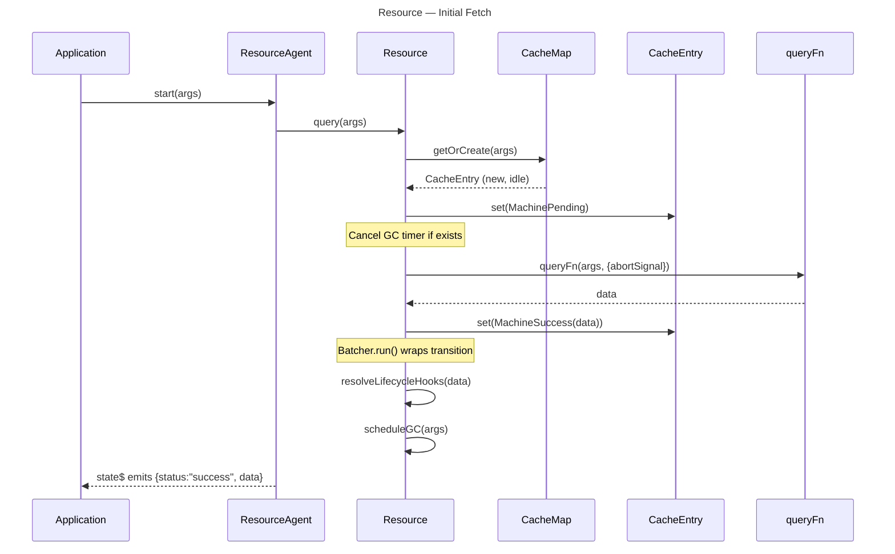
```mermaid
sequenceDiagram
    title Resource — Initial Fetch
    participant App as Application
    participant Agent as ResourceAgent
    participant Res as Resource
    participant CM as CacheMap
    participant CE as CacheEntry
    participant QFn as queryFn
    
    App->>Agent: start(args)
    Agent->>Res: query(args)
    Res->>CM: getOrCreate(args)
    CM-->>Res: CacheEntry (new, idle)
    Res->>CE: set(MachinePending)
    Note over Res: Cancel GC timer if exists
    Res->>QFn: queryFn(args, {abortSignal})
    QFn-->>Res: data
    Res->>CE: set(MachineSuccess(data))
    Note over Res: Batcher.run() wraps transition
    Res->>Res: resolveLifecycleHooks(data)
    Res->>Res: scheduleGC(args)
    Agent-->>App: state$ emits {status:"success", data}
```

[ref: ../01-research/01-codebase-query-v2.md#54-query-execution-private] — Query execution: calls queryFn, transitions to Success via Batcher.run().

### 1.2 Stale-While-Revalidate (Args Change)

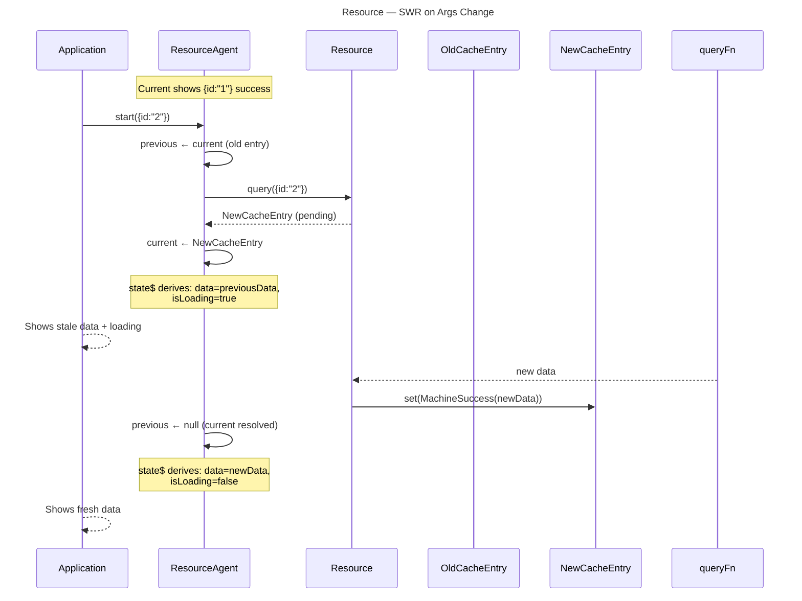
```mermaid
sequenceDiagram
    title Resource — SWR on Args Change
    participant App as Application
    participant Agent as ResourceAgent
    participant Res as Resource
    participant OldCE as OldCacheEntry
    participant NewCE as NewCacheEntry
    participant QFn as queryFn
    
    Note over Agent: Current shows {id:"1"} success
    App->>Agent: start({id:"2"})
    Agent->>Agent: previous ← current (old entry)
    Agent->>Res: query({id:"2"})
    Res-->>Agent: NewCacheEntry (pending)
    Agent->>Agent: current ← NewCacheEntry
    Note over Agent: state$ derives: data=previousData,<br/>isLoading=true
    App-->>App: Shows stale data + loading
    QFn-->>Res: new data
    Res->>NewCE: set(MachineSuccess(newData))
    Agent->>Agent: previous ← null (current resolved)
    Note over Agent: state$ derives: data=newData,<br/>isLoading=false
    App-->>App: Shows fresh data
```

[ref: ../01-research/04-open-questions.md#q2-how-should-the-agent-swr-previouscurrent-swap-work] — SWR must keep `previous` until `current` resolves. V1's proven approach.
[ref: ../01-research/02-codebase-query-v1.md#22-resourceagent] — V1 keeps `previous$` alive and only swaps when new cache entry reaches `isDone`.

### 1.3 Cache Hit (Same Args)

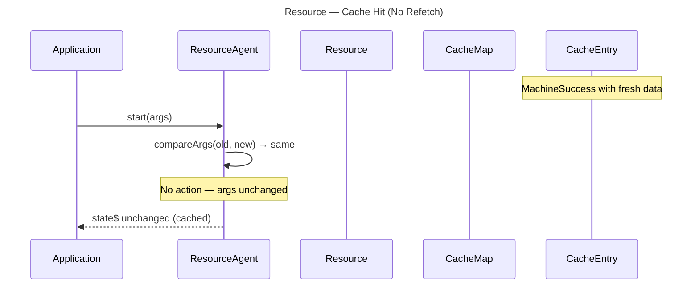
```mermaid
sequenceDiagram
    title Resource — Cache Hit (No Refetch)
    participant App as Application
    participant Agent as ResourceAgent
    participant Res as Resource
    participant CM as CacheMap
    participant CE as CacheEntry
    
    Note over CE: MachineSuccess with fresh data
    App->>Agent: start(args)
    Agent->>Agent: compareArgs(old, new) → same
    Note over Agent: No action — args unchanged
    Agent-->>App: state$ unchanged (cached)
```

### 1.4 Refetch (Force / Invalidation)

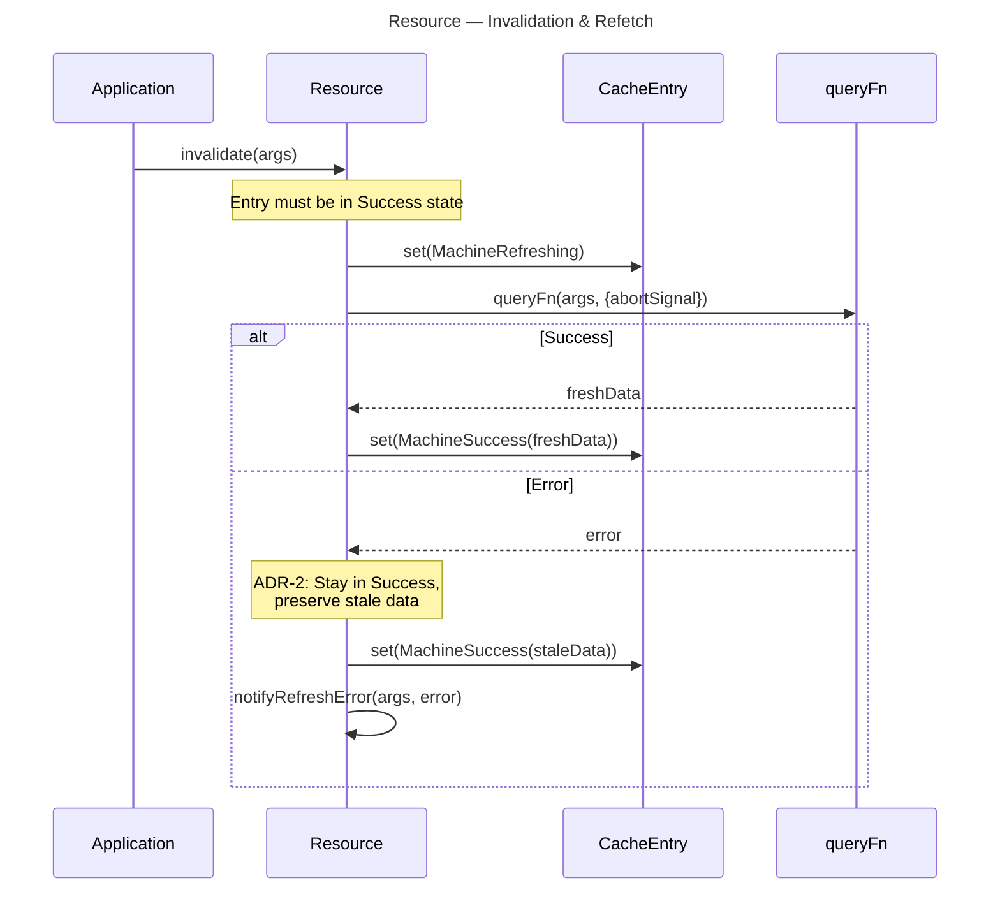
```mermaid
sequenceDiagram
    title Resource — Invalidation & Refetch
    participant App as Application
    participant Res as Resource
    participant CE as CacheEntry
    participant QFn as queryFn
    
    App->>Res: invalidate(args)
    Note over Res: Entry must be in Success state
    Res->>CE: set(MachineRefreshing)
    Res->>QFn: queryFn(args, {abortSignal})
    
    alt Success
        QFn-->>Res: freshData
        Res->>CE: set(MachineSuccess(freshData))
    else Error
        QFn-->>Res: error
        Note over Res: ADR-2: Stay in Success,<br/>preserve stale data
        Res->>CE: set(MachineSuccess(staleData))
        Res->>Res: notifyRefreshError(args, error)
    end
```

[ref: ../01-research/01-codebase-query-v2.md#22-state-machine-transitions] — ADR-2: `errorHappened()` on Refreshing returns MachineSuccess with stale data preserved.

### 1.5 Abort (Args Change During Pending)

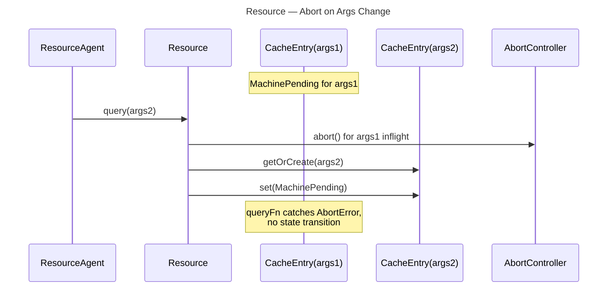
```mermaid
sequenceDiagram
    title Resource — Abort on Args Change
    participant Agent as ResourceAgent
    participant Res as Resource
    participant CE1 as CacheEntry(args1)
    participant CE2 as CacheEntry(args2)
    participant AC as AbortController
    
    Note over CE1: MachinePending for args1
    Agent->>Res: query(args2)
    Res->>AC: abort() for args1 inflight
    Res->>CE2: getOrCreate(args2)
    Res->>CE2: set(MachinePending)
    Note over CE1: queryFn catches AbortError,<br/>no state transition
```

### 1.6 Error → Retry

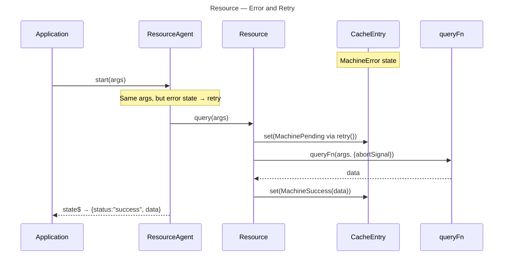
```mermaid
sequenceDiagram
    title Resource — Error and Retry
    participant App as Application
    participant Agent as ResourceAgent
    participant Res as Resource
    participant CE as CacheEntry
    participant QFn as queryFn
    
    Note over CE: MachineError state
    App->>Agent: start(args)
    Note over Agent: Same args, but error state → retry
    Agent->>Res: query(args)
    Res->>CE: set(MachinePending via retry())
    Res->>QFn: queryFn(args, {abortSignal})
    QFn-->>Res: data
    Res->>CE: set(MachineSuccess(data))
    Agent-->>App: state$ → {status:"success", data}
```

### 1.7 GC Lifecycle

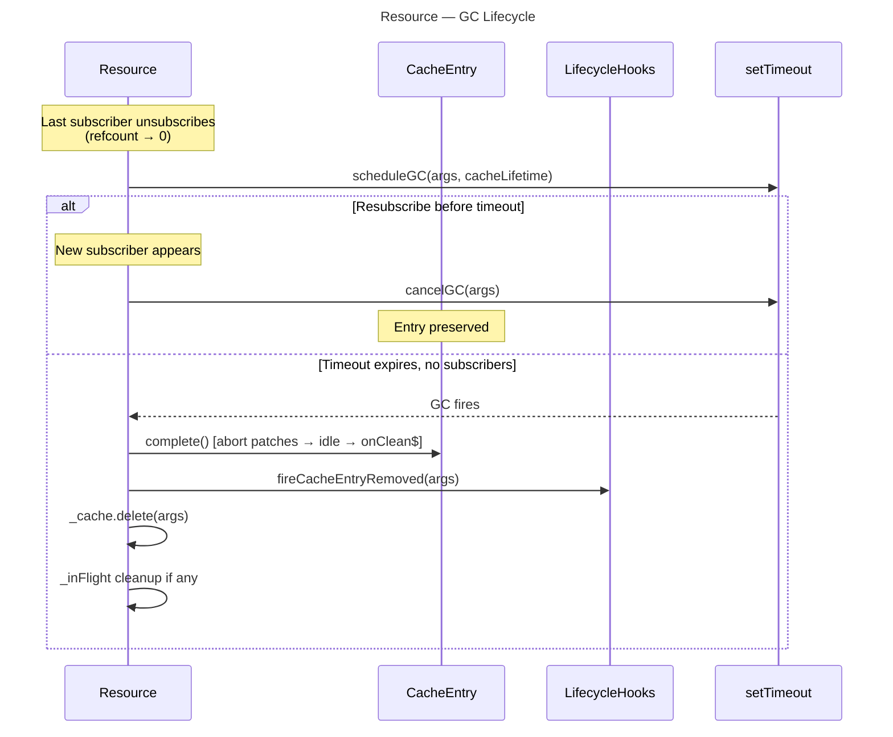
```mermaid
sequenceDiagram
    title Resource — GC Lifecycle
    participant Res as Resource
    participant CE as CacheEntry
    participant LH as LifecycleHooks
    participant Timer as setTimeout
    
    Note over Res: Last subscriber unsubscribes<br/>(refcount → 0)
    Res->>Timer: scheduleGC(args, cacheLifetime)
    
    alt Resubscribe before timeout
        Note over Res: New subscriber appears
        Res->>Timer: cancelGC(args)
        Note over CE: Entry preserved
    else Timeout expires, no subscribers
        Timer-->>Res: GC fires
        Res->>CE: complete() [abort patches → idle → onClean$]
        Res->>LH: fireCacheEntryRemoved(args)
        Res->>Res: _cache.delete(args)
        Res->>Res: _inFlight cleanup if any
    end
```

[ref: ../01-research/04-open-questions.md#q11-what-gc-strategy-should-v2-use] — Hybrid refcount+timer: GC timer starts only when refcount reaches 0.
[ref: ../01-research/03-external-research.md#25-cache-garbage-collection-approaches] — TanStack/RTK both use timer after zero subscribers (industry standard).

## 2. Operation Scenarios

### 2.1 Execute Operation

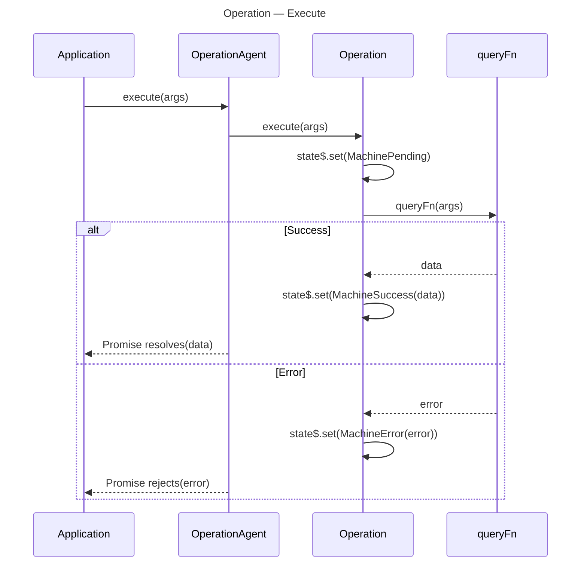
```mermaid
sequenceDiagram
    title Operation — Execute
    participant App as Application
    participant OAgent as OperationAgent
    participant Op as Operation
    participant QFn as queryFn
    
    App->>OAgent: execute(args)
    OAgent->>Op: execute(args)
    Op->>Op: state$.set(MachinePending)
    Op->>QFn: queryFn(args)
    
    alt Success
        QFn-->>Op: data
        Op->>Op: state$.set(MachineSuccess(data))
        OAgent-->>App: Promise resolves(data)
    else Error
        QFn-->>Op: error
        Op->>Op: state$.set(MachineError(error))
        OAgent-->>App: Promise rejects(error)
    end
```

### 2.2 Concurrent Execution

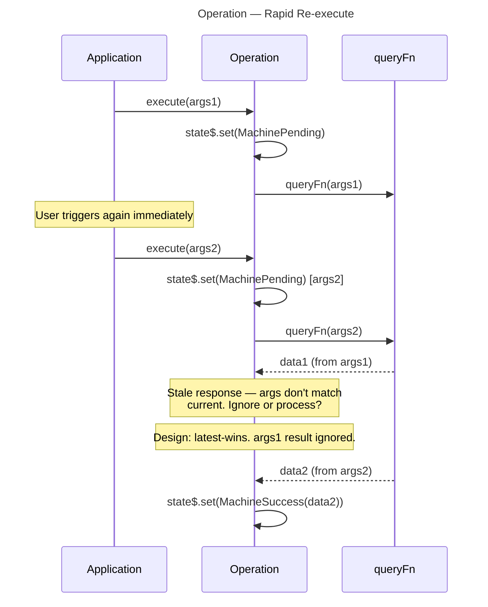
```mermaid
sequenceDiagram
    title Operation — Rapid Re-execute
    participant App as Application
    participant Op as Operation
    participant QFn as queryFn
    
    App->>Op: execute(args1)
    Op->>Op: state$.set(MachinePending)
    Op->>QFn: queryFn(args1)
    
    Note over App: User triggers again immediately
    App->>Op: execute(args2)
    Op->>Op: state$.set(MachinePending) [args2]
    Op->>QFn: queryFn(args2)
    
    QFn-->>Op: data1 (from args1)
    Note over Op: Stale response — args don't match<br/>current. Ignore or process?
    Note over Op: Design: latest-wins. args1 result ignored.
    
    QFn-->>Op: data2 (from args2)
    Op->>Op: state$.set(MachineSuccess(data2))
```

[ref: ../01-research/02-codebase-query-v1.md#26-commandagent] — V1 Command always re-executes. Operations follow the same imperative pattern.

## 3. Snapshot Scenarios

### 3.1 Signal → Snapshot Bridge

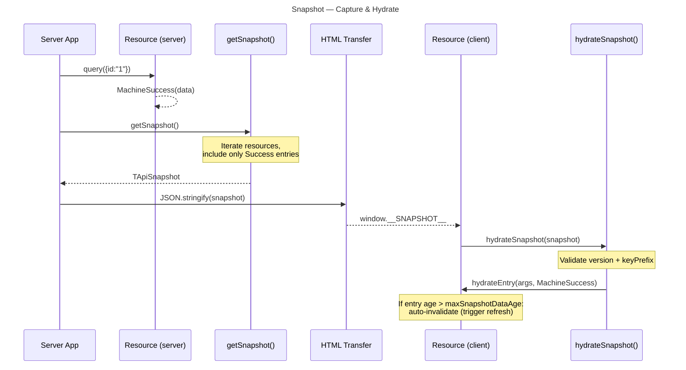
```mermaid
sequenceDiagram
    title Snapshot — Capture & Hydrate
    participant Server as Server App
    participant SRes as Resource (server)
    participant Snap as getSnapshot()
    participant HTML as HTML Transfer
    participant CRes as Resource (client)
    participant Hydrate as hydrateSnapshot()
    
    Server->>SRes: query({id:"1"})
    SRes-->>SRes: MachineSuccess(data)
    Server->>Snap: getSnapshot()
    Note over Snap: Iterate resources,<br/>include only Success entries
    Snap-->>Server: TApiSnapshot
    
    Server->>HTML: JSON.stringify(snapshot)
    HTML-->>CRes: window.__SNAPSHOT__
    
    CRes->>Hydrate: hydrateSnapshot(snapshot)
    Note over Hydrate: Validate version + keyPrefix
    Hydrate->>CRes: hydrateEntry(args, MachineSuccess)
    
    Note over CRes: If entry age > maxSnapshotDataAge:<br/>auto-invalidate (trigger refresh)
```

[ref: ../01-research/01-codebase-query-v2.md#7-snapshot-system] — Only MachineSuccess entries are included. `hydrateSnapshot` throws on version/prefix mismatch.

### 3.2 Snapshot Subscription Lifecycle

The snapshot → React flow uses the same signal pipeline as normal data:

```
CacheEntry (Signal.state)
    ↓ machine$() call inside Signal.compute
ResourceAgent.state$ (Signal.compute)
    ↓ .obs
useSignal → useSyncExternalStore
    ↓
React render
```

Hydrated data flows through the same pipeline — there's no separate snapshot subscription model.

## 4. Plugin Scenarios

### 4.1 Plugin Hook Invocation Order

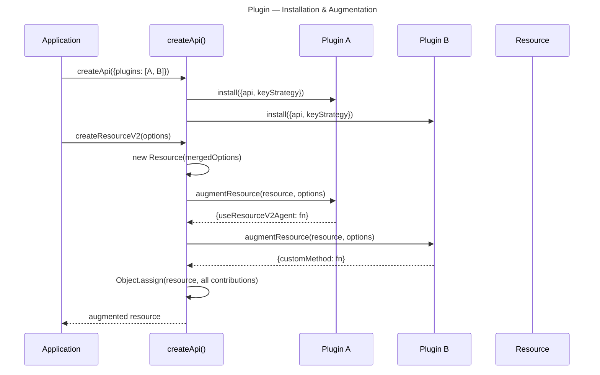
```mermaid
sequenceDiagram
    title Plugin — Installation & Augmentation
    participant App as Application
    participant API as createApi()
    participant P1 as Plugin A
    participant P2 as Plugin B
    participant Res as Resource
    
    App->>API: createApi({plugins: [A, B]})
    API->>P1: install({api, keyStrategy})
    API->>P2: install({api, keyStrategy})
    
    App->>API: createResourceV2(options)
    API->>API: new Resource(mergedOptions)
    API->>P1: augmentResource(resource, options)
    P1-->>API: {useResourceV2Agent: fn}
    API->>P2: augmentResource(resource, options)
    P2-->>API: {customMethod: fn}
    API->>API: Object.assign(resource, all contributions)
    API-->>App: augmented resource
```

[ref: ../01-research/01-codebase-query-v2.md#82-type-level-augmentation] — Plugin contributions are merged via Object.assign.

### 4.2 Plugin Composition

Plugins are applied sequentially. Later plugins can see earlier plugins' contributions (they're already on the resource object). Contribution key collisions are a runtime error.

### 4.3 createApi Initialization Flow

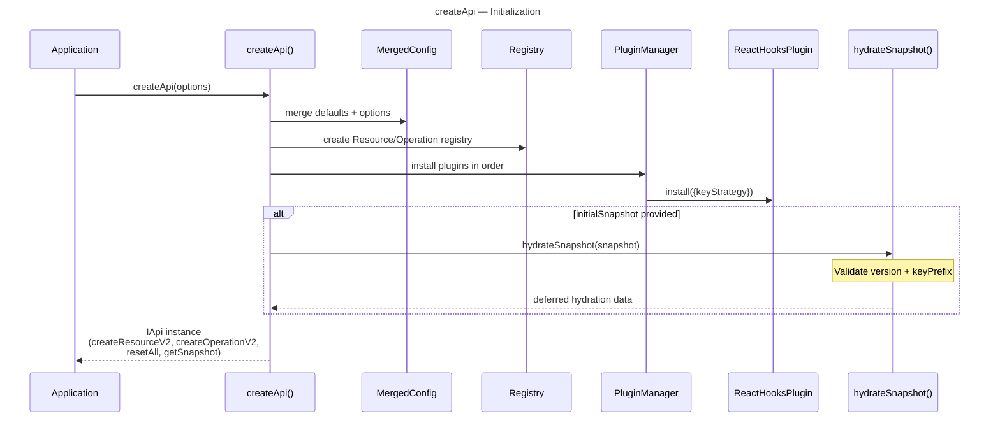
```mermaid
sequenceDiagram
    title createApi — Initialization
    participant App as Application
    participant APIF as createApi()
    participant Cfg as MergedConfig
    participant Reg as Registry
    participant PMgr as PluginManager
    participant P as ReactHooksPlugin
    participant Snap as hydrateSnapshot()
    
    App->>APIF: createApi(options)
    APIF->>Cfg: merge defaults + options
    APIF->>Reg: create Resource/Operation registry
    APIF->>PMgr: install plugins in order
    PMgr->>P: install({keyStrategy})
    
    alt initialSnapshot provided
        APIF->>Snap: hydrateSnapshot(snapshot)
        Note over Snap: Validate version + keyPrefix
        Snap-->>APIF: deferred hydration data
    end
    
    APIF-->>App: IApi instance<br/>(createResourceV2, createOperationV2,<br/>resetAll, getSnapshot)
```

`createApi` is the primary entry point for the query-v2 module. It merges default configuration with user options, creates an internal registry for tracking all resources and operations, installs each plugin via `plugin.install(context)`, and optionally prepares snapshot hydration data. The returned `IApi` object provides bound factory methods that share the merged configuration and plugin set.

[ref: docs/query-v2/v0.1/README.md] — createApi parameters and initialization flow.
[ref: 04-decisions.md#adr-17-single-api-instance-as-entry-point] — ADR-17 covers the single-instance entry point pattern.

### 4.4 ReactHooksPlugin Lifecycle

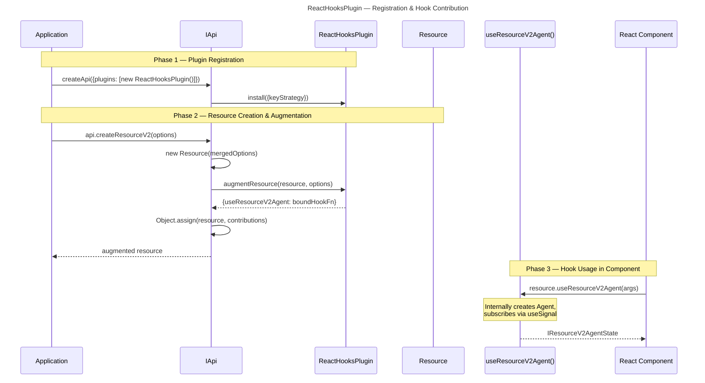
```mermaid
sequenceDiagram
    title ReactHooksPlugin — Registration & Hook Contribution
    participant App as Application
    participant API as IApi
    participant RHP as ReactHooksPlugin
    participant Res as Resource
    participant Hook as useResourceV2Agent()
    participant RC as React Component
    
    Note over App,RHP: Phase 1 — Plugin Registration
    App->>API: createApi({plugins: [new ReactHooksPlugin()]})
    API->>RHP: install({keyStrategy})
    
    Note over App,Res: Phase 2 — Resource Creation & Augmentation
    App->>API: api.createResourceV2(options)
    API->>API: new Resource(mergedOptions)
    API->>RHP: augmentResource(resource, options)
    RHP-->>API: {useResourceV2Agent: boundHookFn}
    API->>API: Object.assign(resource, contributions)
    API-->>App: augmented resource
    
    Note over RC,Hook: Phase 3 — Hook Usage in Component
    RC->>Hook: resource.useResourceV2Agent(args)
    Note over Hook: Internally creates Agent,<br/>subscribes via useSignal
    Hook-->>RC: IResourceV2AgentState
```

`ReactHooksPlugin` contributes the `useResourceV2Agent()` method to each resource instance via `augmentResource()`. This method is a bound hook that internally creates a `ResourceAgent`, starts it with the given args, and subscribes to `agent.state$` via `useSignal` (backed by `useSyncExternalStore`). The same hook can also be used standalone as `useResourceV2(resource, args)` without the plugin — the plugin simply provides the convenience of calling it as a method on the resource instance.

[ref: docs/query-v2/v0.1/README.md] — ReactHooksPlugin adds `useResourceV2Agent` to resources. Standalone usage also documented.

## 5. State Machine Specifications

### 5.1 Resource State Machine

Complete state machine for Resource cache entries. All transitions return new immutable machine instances.

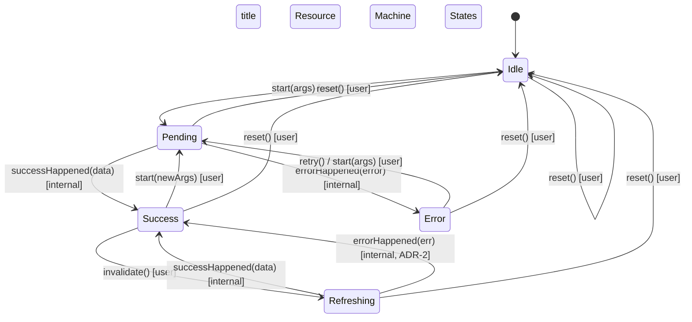
```mermaid
stateDiagram-v2
    title Resource Machine States
    
    [*] --> Idle
    
    Idle --> Pending : start(args) [user]
    
    Pending --> Success : successHappened(data) [internal]
    Pending --> Error : errorHappened(error) [internal]
    
    Success --> Refreshing : invalidate() [user]
    Success --> Pending : start(newArgs) [user]
    
    Refreshing --> Success : successHappened(data) [internal]
    Refreshing --> Success : errorHappened(err) [internal, ADR-2]
    
    Error --> Pending : retry() / start(args) [user]
    
    Idle --> Idle : reset() [user]
    Pending --> Idle : reset() [user]
    Success --> Idle : reset() [user]
    Error --> Idle : reset() [user]
    Refreshing --> Idle : reset() [user]
```

**Transition classification:**

| Transition | Trigger | Who invokes |
|-----------|---------|-------------|
| `start(args)` | User triggers query | Agent, Application |
| `invalidate()` | User or cross-resource | Application, Command (future) |
| `retry()` | User retries after error | Agent, Application |
| `reset()` | User resets or resetAll() | Application, createApi.resetAll() |
| `successHappened(data)` | queryFn resolves | Resource (internal) |
| `errorHappened(error)` | queryFn rejects | Resource (internal) |

**State data availability:**

| State | `data` | `error` | `args` | Patches possible |
|-------|--------|---------|--------|-----------------|
| idle | null | null | null | No |
| pending | null | null | TArgs | No |
| success | TData | null | TArgs | Yes |
| error | null | unknown | TArgs | No |
| refreshing | TData (stale) | null | TArgs | Yes |

[ref: ../01-research/01-codebase-query-v2.md#23-machine-state-shapes] — State shapes from v0.1 docs and existing machine classes.

### 5.2 Operation State Machine

Operations have a simpler lifecycle — no cache, no SWR, no patching.

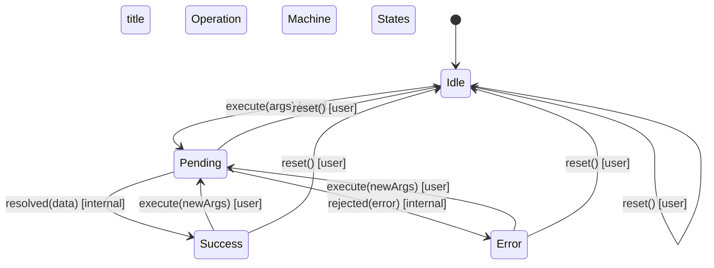
```mermaid
stateDiagram-v2
    title Operation Machine States
    
    [*] --> Idle
    
    Idle --> Pending : execute(args) [user]
    
    Pending --> Success : resolved(data) [internal]
    Pending --> Error : rejected(error) [internal]
    
    Success --> Pending : execute(newArgs) [user]
    Error --> Pending : execute(newArgs) [user]
    
    Idle --> Idle : reset() [user]
    Pending --> Idle : reset() [user]
    Success --> Idle : reset() [user]
    Error --> Idle : reset() [user]
```

**Key differences from Resource:**
- No Refreshing state (operations always start fresh)
- No invalidation
- No patch support
- `execute()` always transitions to Pending regardless of current state
- Concurrent executions: latest-wins semantics

## 6. Cache Data Flow

### 6.1 Write Path (Fetch → Store)

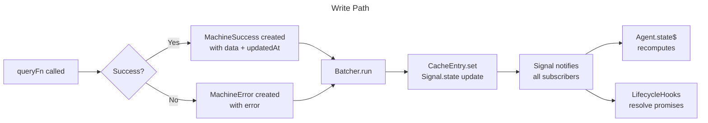
```mermaid
---
title: Write Path
---
flowchart LR
    A[queryFn called] --> B{Success?}
    B -->|Yes| C[MachineSuccess created<br/>with data + updatedAt]
    B -->|No| D[MachineError created<br/>with error]
    C --> E[Batcher.run]
    D --> E
    E --> F[CacheEntry.set<br/>Signal.state update]
    F --> G[Signal notifies<br/>all subscribers]
    G --> H[Agent.state$<br/>recomputes]
    G --> I[LifecycleHooks<br/>resolve promises]
```

### 6.2 Read Path (Key → Snapshot)

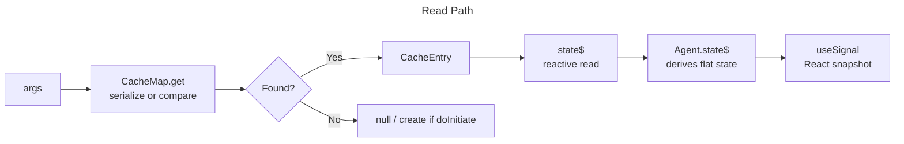
```mermaid
---
title: Read Path
---
flowchart LR
    A[args] --> B[CacheMap.get<br/>serialize or compare]
    B --> C{Found?}
    C -->|Yes| D[CacheEntry]
    C -->|No| E[null / create if doInitiate]
    D --> F[state$<br/>reactive read]
    F --> G[Agent.state$<br/>derives flat state]
    G --> H[useSignal<br/>React snapshot]
```

### 6.3 Invalidation Cascade

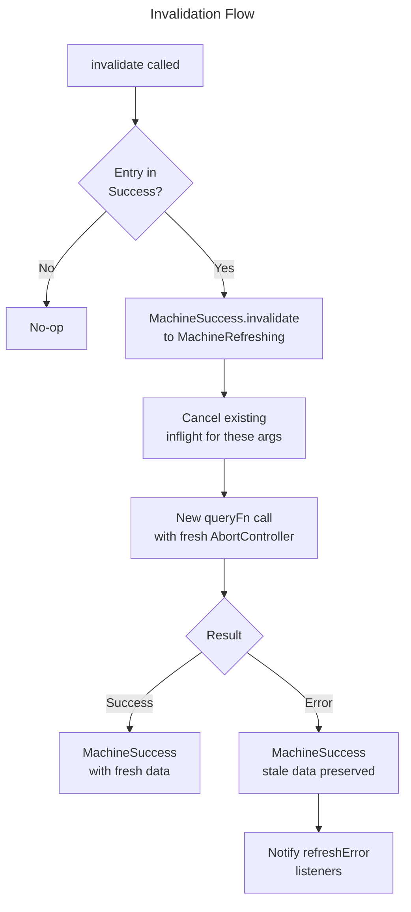
```mermaid
---
title: Invalidation Flow
---
flowchart TB
    A[invalidate called] --> B{Entry in<br/>Success?}
    B -->|No| C[No-op]
    B -->|Yes| D[MachineSuccess.invalidate<br/>to MachineRefreshing]
    D --> E[Cancel existing<br/>inflight for these args]
    E --> F[New queryFn call<br/>with fresh AbortController]
    F --> G{Result}
    G -->|Success| H[MachineSuccess<br/>with fresh data]
    G -->|Error| I[MachineSuccess<br/>stale data preserved]
    I --> J[Notify refreshError<br/>listeners]
```

### 6.4 GC Trigger Flow

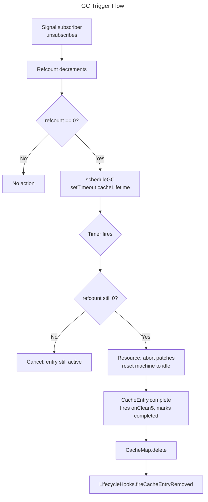
```mermaid
---
title: GC Trigger Flow
---
flowchart TB
    A[Signal subscriber<br/>unsubscribes] --> B[Refcount decrements]
    B --> C{refcount == 0?}
    C -->|No| D[No action]
    C -->|Yes| E[scheduleGC<br/>setTimeout cacheLifetime]
    E --> F{Timer fires}
    F --> G{refcount still 0?}
    G -->|No| H[Cancel: entry still active]
    G -->|Yes| I[Resource: abort patches<br/>reset machine to idle]
    I --> J[CacheEntry.complete<br/>fires onClean$, marks completed]
    J --> K[CacheMap.delete]
    K --> L[LifecycleHooks.fireCacheEntryRemoved]
```

[ref: ../01-research/04-open-questions.md#q5-how-should-cacheentrycomplete-behave] — Resource handles patch abort and machine reset before calling CacheEntry.complete(). CacheEntry.complete() fires onClean$ and marks entry as completed.
[ref: ../01-research/04-open-questions.md#q11-what-gc-strategy-should-v2-use] — Hybrid refcount+timer: industry standard from TanStack/RTK.

### 6.5 Optimistic Patch Flow

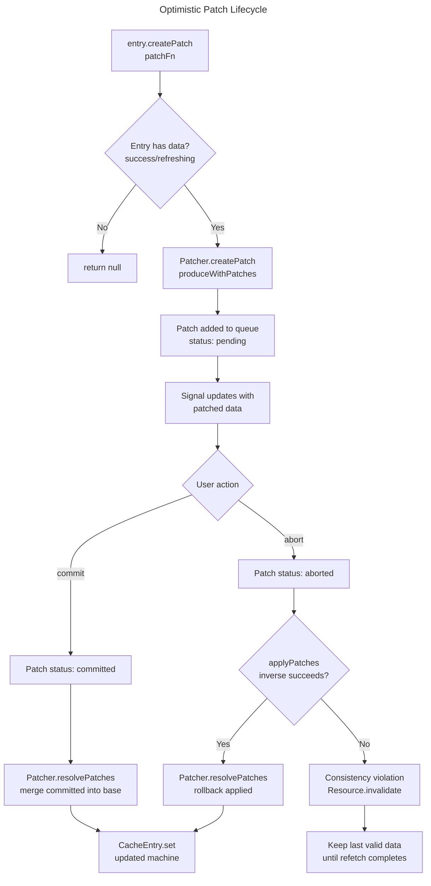
```mermaid
---
title: Optimistic Patch Lifecycle
---
flowchart TB
    A[entry.createPatch<br/>patchFn] --> B{Entry has data?<br/>success/refreshing}
    B -->|No| C[return null]
    B -->|Yes| D[Patcher.createPatch<br/>produceWithPatches]
    D --> E[Patch added to queue<br/>status: pending]
    E --> F[Signal updates with<br/>patched data]
    F --> G{User action}
    G -->|commit| H[Patch status: committed]
    G -->|abort| I[Patch status: aborted]
    H --> J[Patcher.resolvePatches<br/>merge committed into base]
    I --> K{applyPatches<br/>inverse succeeds?}
    K -->|Yes| L[Patcher.resolvePatches<br/>rollback applied]
    K -->|No| M[Consistency violation<br/>Resource.invalidate]
    J --> N[CacheEntry.set<br/>updated machine]
    L --> N
    M --> O[Keep last valid data<br/>until refetch completes]
```

[ref: ../01-research/01-codebase-query-v2.md#31-patcher] — Patcher uses `produceWithPatches` and `applyPatches` from Immer.
[ref: ../01-research/04-open-questions.md#q6-how-should-consistency-violation-detection-work-in-the-patcher] — Patcher returns `{data, isConsistencyViolation}` tuple; Resource checks and invalidates.

## 7. Reactive Chain Details

### 7.1 Resource → Agent → React Signal Chain

```
Resource.query()
  → Batcher.run(() => {
      CacheEntry.set(newMachine)   // Signal.state<TState> write
    })
  → Signal notification propagates
  → ResourceAgent.state$ (Signal.compute) recomputes:
      reads _tracking$()          // dependency registered
      reads current.machine$()    // IResourceV2CacheEntry delegates to CacheEntry.state$()
      reads previous?.machine$()  // if SWR active
      → derives {status, data, error, isLoading, ...}
  → useSignal(agent.state$)
      → useSyncExternalStore detects change
      → React re-render
```

### 7.2 getEntry$ Reactive Design

[ref: docs/query-v2/v0.1/Внутриянка.md] — Uses `Signal.compute` reading `_status$` and `_lastEntry$`.

```
Resource._status$ : Signal.state<"idle" | "ready">
Resource._lastEntry$ : Signal.state<CacheEntry | null>

getEntry$(args):
  Signal.compute(() => {
    if (_status$() === "idle")  → return null  // reacts to resetAll
    if (binded)                 → return binded
    entry = _lastEntry$()       
    if (entry.isMyArgs(args))   → binded = entry; return entry
    return null
  })
```

When `resetAll()` fires:
1. `_status$.set("idle")` 
2. All `getEntry$` computeds re-evaluate
3. Condition `_status$() === "idle"` → all return null
4. Consumers see null → show appropriate UI
