# Data Flow — query-v2

## 1. ResourceV2 Scenarios

### 1.1 Initial Fetch

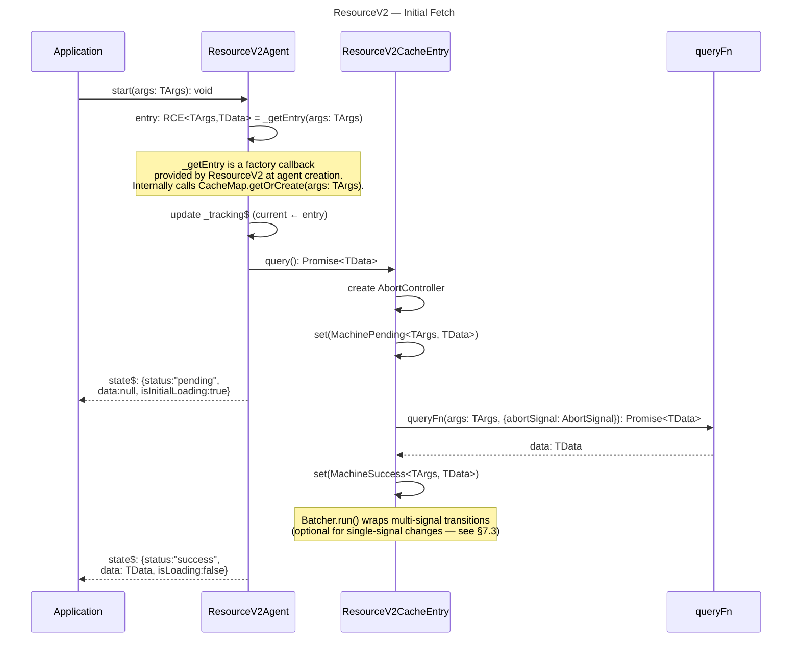

[ref: ../01-research/01-codebase-query-v2.md#54-query-execution-private] — Query execution: calls queryFn, transitions to Success via Batcher.run().

> **Note on `state$` outputs in diagrams**: Each diagram shows only the fields relevant to the scenario (e.g., `isInitialLoading` for first fetch, `isRefreshing` for invalidation). The full agent state shape is `IResourceV2AgentState<TArgs, TData>` (model §8.1) which includes: `status`, `data`, `error`, `args`, `isLoading`, `isInitialLoading`, `isRefreshing`, `isSuccess`, `isError`, `entry`. In particular, `isLoading` is `true` whenever `status` is `pending`, `refreshing`, or the agent is in SWR transition — it is omitted from some diagrams where a more specific indicator (`isInitialLoading`, `isRefreshing`) conveys the same information.

### 1.2 Stale-While-Revalidate (Args Change)

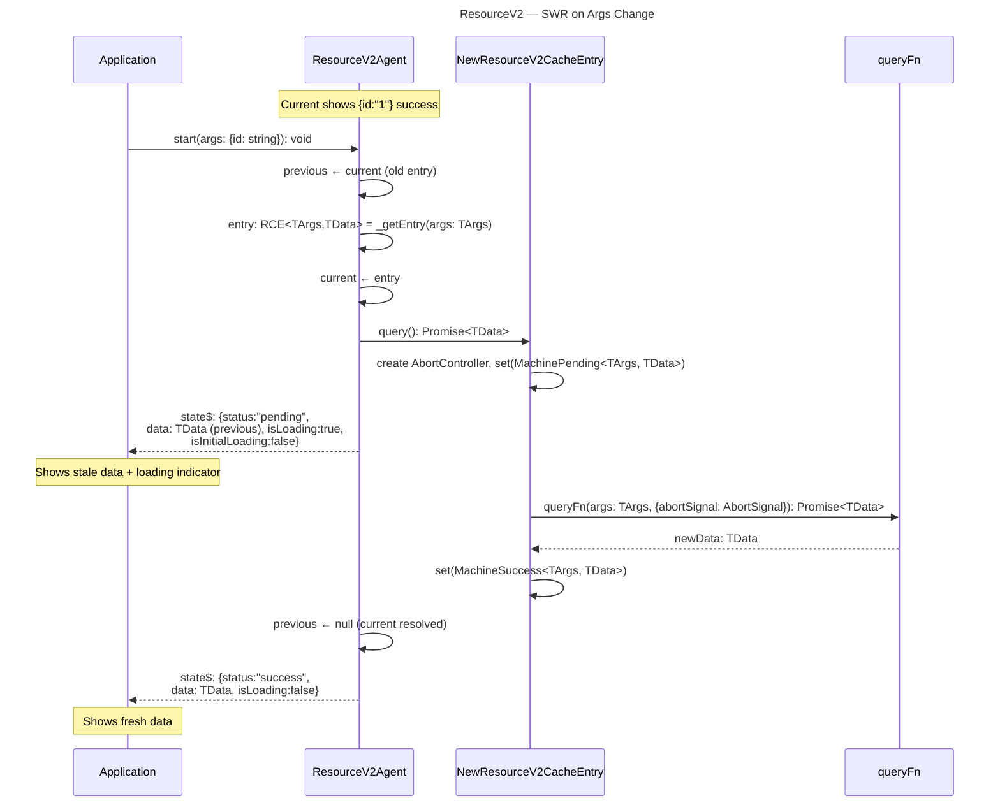

[ref: ../01-research/04-open-questions.md#q2-how-should-the-agent-swr-previouscurrent-swap-work] — SWR must keep `previous` until `current` resolves. V1's proven approach.
[ref: ../01-research/02-codebase-query-v1.md#22-resourceagent] — V1 keeps `previous$` alive and only swaps when new cache entry reaches `isDone`.

### 1.3 Cache Hit (Same Args)

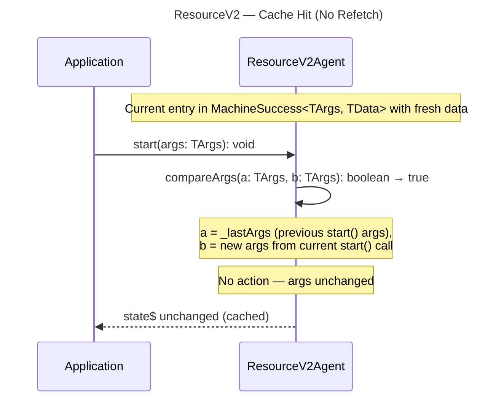

### 1.4 Refetch (Force / Invalidation)

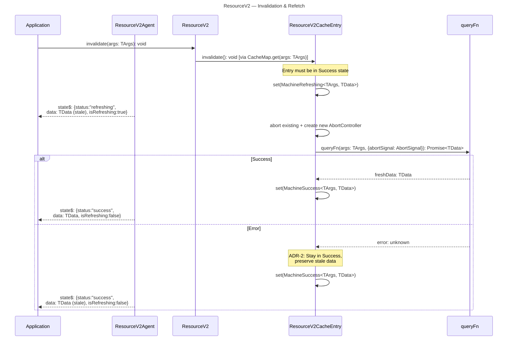

[ref: ../01-research/01-codebase-query-v2.md#22-state-machine-transitions] — ADR-2: `errorHappened()` on Refreshing returns MachineSuccess with stale data preserved.

### 1.5 Abort (Per-Entry Inflight Management)

Each `ResourceV2CacheEntry` manages its own `AbortController` and inflight promise. Abort occurs at the entry level — when a new `query()` call is made on the same entry (e.g., on invalidation or force re-fetch), the previous inflight request is aborted before starting a new one. [ref: 04-decisions.md#adr-17-abort-and-inflight-management-at-cacheentry-level]

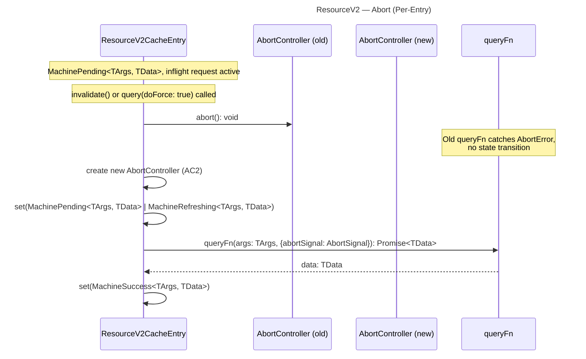

**Note on agent args changes**: When an agent switches from args1 to args2, it obtains a new entry for args2 and starts a query on it. The old entry's (args1) inflight request **continues independently** — it is not aborted by the agent. Other consumers (agents, hooks) still using the args1 entry will receive its data normally. Abort within an entry occurs only when a new `query()` call is made to the **same** entry (e.g., on invalidation or force re-fetch).

### 1.6 Error → Retry

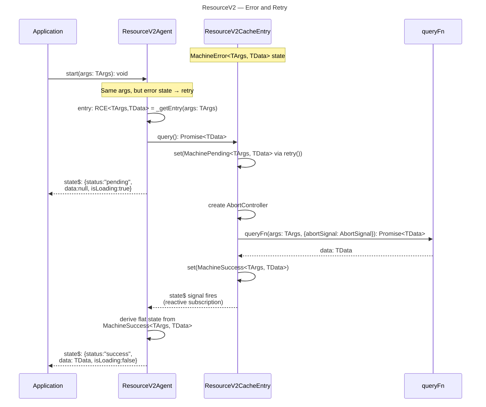

### 1.7 GC Lifecycle

GC uses the `share({resetOnRefCountZero})` pattern from v1's `ReactiveCache`. The RxJS `share()` operator tracks subscriber count automatically. When the last subscriber unsubscribes, `resetOnRefCountZero` fires; if `cacheLifetime > 0`, a timer starts. If a new subscriber appears before the timer fires, the reset is cancelled. When the timer completes with zero subscribers, `finalize()` triggers `complete()` on the CacheEntry.

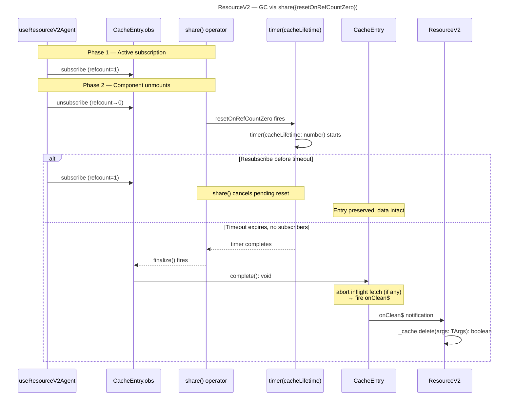

**GC timer behavior by `cacheLifetime` configuration:**

| `cacheLifetime` value | `resetOnRefCountZero` | Behavior |
|---|---|---|
| `false` | `false` | GC disabled — entry lives forever |
| `0` or negative | `true` | Immediate reset on last unsubscribe |
| `> 0` (e.g., `60_000`) | `() => timer(cacheLifetime)` | Timer starts on last unsubscribe; cancelled if new subscriber arrives |

[ref: src/query/lib/ReactiveCache.ts] — V1's proven `share({resetOnRefCountZero})` implementation.
[ref: 04-decisions.md#adr-5-gc-strategy] — ADR-5 specifies the share()-based GC approach.
[ref: ../01-research/03-external-research.md#25-cache-garbage-collection-approaches] — TanStack/RTK both use timer after zero subscribers (industry standard).

**GC cleanup decisions:**

- **Abort inflight fetch — YES**: When GC fires, refcount has been 0 for `cacheLifetime`, but a fetch may still be in-flight (scenario: component starts fetch → unmounts → GC timer fires before fetch resolves). Since `queryFn` runs as a Promise independent of the RxJS subscription chain, `share()` unsubscribing upstream does not cancel it. Calling `_abortController.abort()` prevents wasted network requests on an entry being destroyed. [ref: 04-decisions.md#adr-17-abort-and-inflight-management-at-cacheentry-level]
- **Abort patches — NO** (not needed in GC context): `complete()` does not explicitly abort pending patches. During GC, this is safe because refcount=0 means no consumers hold active `IPatchHandle` references — pending patches are impossible. For `resetAll()`, the machine is reset to idle before `complete()` fires, making any remaining patch state irrelevant (idle state has no data to patch). See model §12.1 for the full `resetAll()` sequence.

## 2. Snapshot Scenarios

### 2.1 Signal → Snapshot Bridge

**Capture** (server-side):

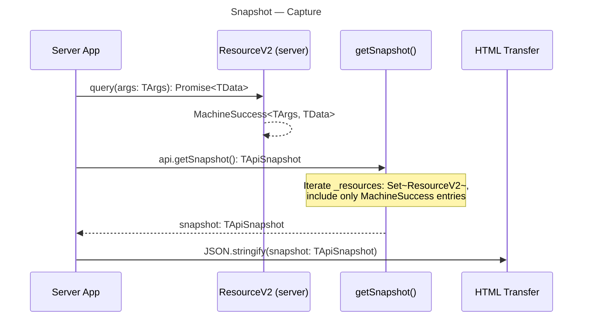

**Hydrate** (client-side — per-resource consumption):

The `initialSnapshot` lifecycle works in three phases:
1. `createApi({ initialSnapshot })` — the snapshot is **saved internally** (stored as `_savedSnapshot: TApiSnapshot | null`)
2. `api.createResourceV2()` — on resource creation, the snapshot slice for this resource's `key` is **consumed**: matching entries are hydrated into the resource cache, then the slice is **deleted** from `_savedSnapshot`. If entry data is stale (age > `maxSnapshotDataAge`), auto-invalidation is triggered.
3. `api.resetAll()` — the saved snapshot is **deleted entirely** (`_savedSnapshot = null`)

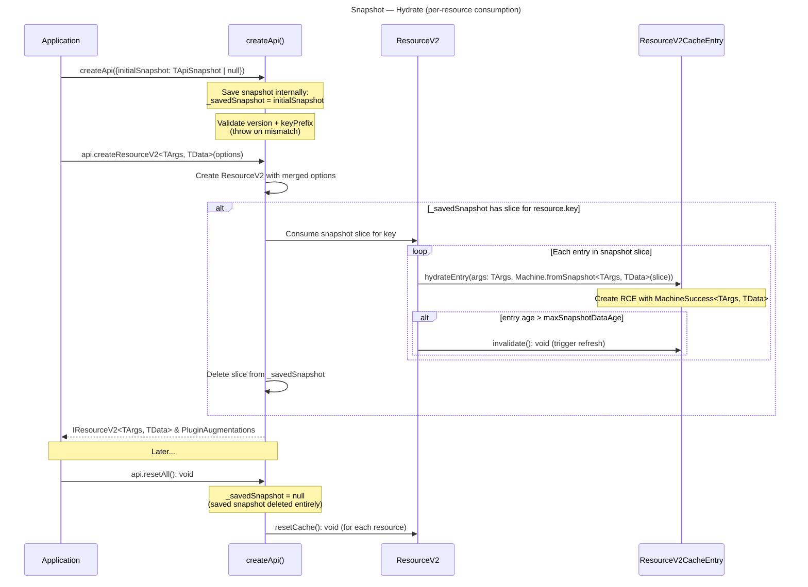

[ref: ../01-research/01-codebase-query-v2.md#7-snapshot-system] — Only MachineSuccess entries are included. `hydrateSnapshot` throws on version/prefix mismatch.

### 2.2 Snapshot Subscription Lifecycle

The snapshot → React flow uses the same signal pipeline as normal data:

```
ResourceV2CacheEntry (extends CacheEntry — Signal.state)
    ↓ machine$() signal read inside Signal.compute
ResourceV2Agent.state$ (Signal.compute)
    ↓ .obs
useSignal → useSyncExternalStore
    ↓
React render
```

Hydrated data flows through the same pipeline — there's no separate snapshot subscription model.

## 3. Plugin Scenarios

### 3.1 Plugin Hook Invocation Order

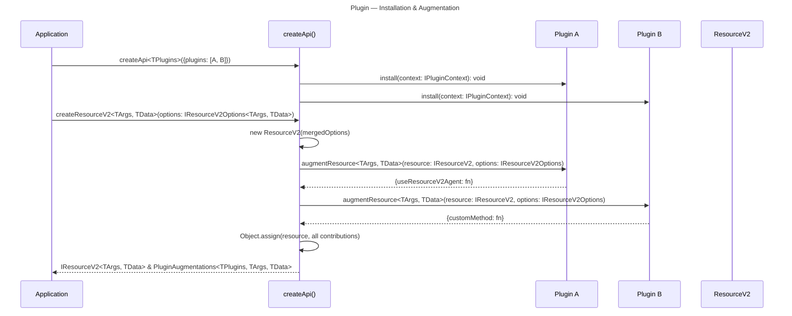

[ref: ../01-research/01-codebase-query-v2.md#82-type-level-augmentation] — Plugin contributions are merged via Object.assign.

### 3.2 Plugin Composition

Plugins are applied sequentially. Later plugins can see earlier plugins' contributions (they're already on the resource object). Contribution key collisions are a runtime error.

### 3.3 createApi Initialization Flow

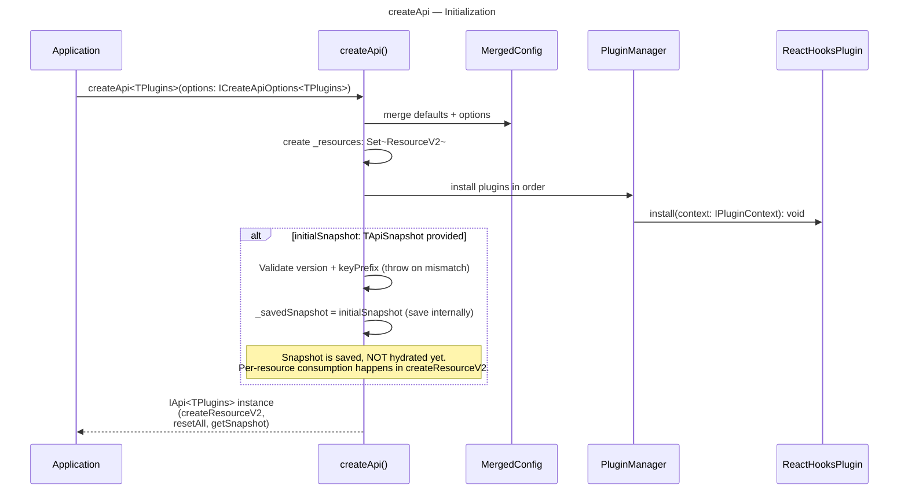

`createApi` is the primary entry point for the query-v2 module. It merges default configuration with user options, creates an internal `Set<ResourceV2>` for tracking all created resources, installs each plugin via `plugin.install(context)`, and **saves** the `initialSnapshot` internally (if provided). The snapshot is NOT hydrated globally at this point — each `createResourceV2()` call consumes its own slice from the saved snapshot. The returned `IApi` object provides bound factory methods that share the merged configuration and plugin set.

[ref: docs/query-v2/v0.1/README.md] — createApi parameters and initialization flow.
[ref: 04-decisions.md#adr-16-single-api-instance-as-entry-point] — ADR-16 covers the single-instance entry point pattern.

### 3.4 ReactHooksPlugin Lifecycle

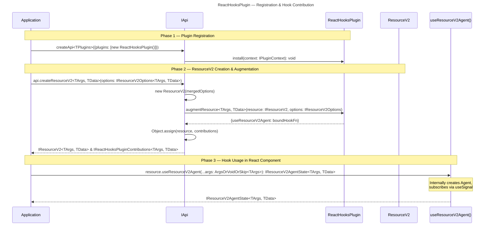

`ReactHooksPlugin` contributes the `useResourceV2Agent()` method to each resource instance via `augmentResource()`. This method is a bound hook that internally creates a `ResourceV2Agent`, starts it with the given args, and subscribes to `agent.state$` via `useSignal` (backed by `useSyncExternalStore`). The same hook can also be used standalone as `useResourceV2Agent(resource, args)` without the plugin — the plugin simply provides the convenience of calling it as a method on the resource instance.

[ref: docs/query-v2/v0.1/README.md] — ReactHooksPlugin adds `useResourceV2Agent` to resources. Standalone usage also documented.

## 4. State Machine Specifications

### 4.1 ResourceV2 State Machine

Complete state machine for ResourceV2 cache entries. All transitions return new immutable machine instances.

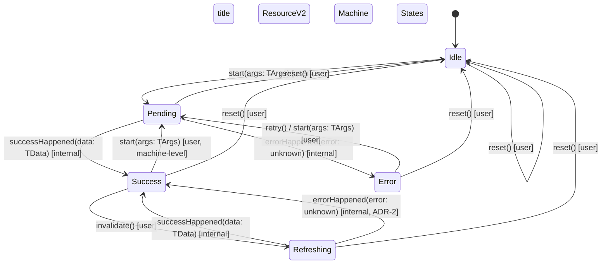

**Transition classification:**

| Transition | Trigger | Who invokes |
|-----------|---------|-------------|
| `start(args: TArgs)` | User triggers query | Agent, Application |
| `invalidate()` | User or cross-resource | Application |
| `retry()` | User retries after error | Agent, Application |
| `reset()` | User resets or resetAll() | Application, createApi.resetAll() |
| `successHappened(data: TData)` | queryFn resolves | ResourceV2CacheEntry (internal) |
| `errorHappened(error: unknown)` | queryFn rejects | ResourceV2CacheEntry (internal) |

**State data availability:**

| State | `data` | `error` | `args` | Patches possible |
|-------|--------|---------|--------|-----------------|
| idle | null | null | null | No |
| pending | null | null | TArgs | No |
| success | TData | null | TArgs | Yes |
| error | null | unknown | TArgs | No |
| refreshing | TData (stale) | null | TArgs | Yes |

[ref: ../01-research/01-codebase-query-v2.md#23-machine-state-shapes] — State shapes from v0.1 docs and existing machine classes.

**Entry-level vs agent-level transitions**: All transitions above are **machine-level** (entry-level) — they happen within a single `ResourceV2CacheEntry`. The `Success → Pending` via `start(args)` is a machine-level hard restart (resets data, re-fetches). It is **not** the SWR args-change scenario. SWR (Stale-While-Revalidate on args change) is an **agent-level** concept: the agent creates/switches to a _new_ entry (which starts in Idle → Pending) while keeping the _old_ entry in its current state (Success). The agent composes both entries into a single flat state showing stale data + loading. See §1.2 for the agent-level SWR flow.

## 5. Cache Data Flow

### 5.1 Write Path (Fetch → Store)

```mermaid
---
title: Write Path
---
flowchart LR
    A[queryFn(args: TArgs, tools) called] --> B{Success?}
    B -->|Yes| C[MachineSuccess<TArgs, TData><br/>created with data: TData + updatedAt]
    B -->|No| D[MachineError<TArgs><br/>created with error: unknown]
    C --> E[Batcher.run<br/>groups multiple writes]
    D --> E
    E --> F[CacheEntry.set(machine: TMachineInstance<TArgs, TData>)<br/>Signal.state update]
    F --> G[Signal notifies<br/>all subscribers]
    G --> H[ResourceV2Agent.state$<br/>recomputes]
    G --> I[LifecycleHooks<br/>resolve promises]
```

### 5.2 Read Path (Key → Snapshot)

```mermaid
---
title: Read Path
---
flowchart LR
    A[args: TArgs] --> B[CacheMap.get(args: TArgs):<br/>RCE | undefined]
    B --> C{Found?}
    C -->|Yes| D[ResourceV2CacheEntry<TArgs, TData>]
    C -->|No| E[null / create if doInitiate]
    E -->|"doInitiate=true"| D
    D --> F[state$(): TMachineInstance<TArgs, TData><br/>reactive read]
    F --> G[Signal notifies<br/>all subscribers]
    G --> H[ResourceV2Agent.state$<br/>derives flat state]
    G --> H2[useSignal<br/>React snapshot]
```

### 5.3 Invalidation Cascade

```mermaid
---
title: Invalidation Flow
---
flowchart TB
    A[ResourceV2.invalidate(args: TArgs)] --> A1[CacheMap.get(args: TArgs):<br/>RCE | undefined]
    A1 --> A2[Delegate to<br/>RCE.invalidate(): void]
    A2 --> B{Entry in<br/>Success?}
    B -->|No| C[No-op]
    B -->|Yes| D[MachineSuccess.invalidate():<br/>MachineRefreshing<TArgs, TData>]
    D --> E[RCE aborts existing<br/>inflight if any]
    E --> F[queryFn(args: TArgs, {abortSignal: AbortSignal}):<br/>Promise<TData>]
    F --> G{Result}
    G -->|Success| H[MachineSuccess<TArgs, TData><br/>with fresh data: TData]
    G -->|Error| I[MachineSuccess<TArgs, TData><br/>stale data preserved]
```

### 5.4 GC Trigger Flow

```mermaid
---
title: GC Trigger Flow
---
flowchart TB
    A[Signal subscriber<br/>unsubscribes] --> B[Refcount decrements]
    B --> C{refcount == 0?}
    C -->|No| D[No action]
    C -->|Yes| E[resetOnRefCountZero:<br/>timer(cacheLifetime: number)]
    E --> F{Timer fires}
    F --> G{refcount still 0?}
    G -->|No| H[Cancel: entry still active]
    G -->|Yes| I[abort inflight fetch if any]
    I --> J[CacheEntry.complete(): void<br/>fires onClean$, marks completed]
    J --> K[CacheMap.delete(args: TArgs): boolean]
    K --> L[LifecycleHooks.fireCacheEntryRemoved(args: TArgs): void]
```

[ref: ../01-research/04-open-questions.md#q5-how-should-cacheentrycomplete-behave] — On `complete()`: abort inflight fetch (if any), fire `onClean$`, mark entry as completed. Patch abort is unnecessary — see §1.7 GC cleanup decisions.
[ref: ../01-research/04-open-questions.md#q11-what-gc-strategy-should-v2-use] — Hybrid refcount+timer: industry standard from TanStack/RTK.

### 5.5 Optimistic Patch Flow

```mermaid
---
title: Optimistic Patch Lifecycle
---
flowchart TB
    A[entry.createPatch(patchFn:<br/>(draft: TData) => void):<br/>IPatchHandle | null] --> B{Entry has data?<br/>success/refreshing}
    B -->|No| C[return null]
    B -->|Yes| D[Patcher.createPatch(patchFn,<br/>data: TData):<br/>{patch: TPatch, data: TData}]
    D --> E[Patch added to queue<br/>status: pending]
    E --> F[Signal updates with<br/>patched data: TData]
    F --> G{User action}
    G -->|commit| H[Patch status: committed]
    G -->|abort| I[Patch status: aborted]
    H --> J[Patcher.resolvePatches(originalData: TData,<br/>patches: TPatch[]):<br/>IPatchResolution<TData>]
    I --> K{applyPatches<br/>inverse succeeds?}
    K -->|Yes| L[Patcher.resolvePatches:<br/>rollback applied]
    K -->|No| M[Consistency violation<br/>entry.invalidate(): void]
    J --> N[CacheEntry.set(machine:<br/>TMachineInstance<TArgs, TData>)]
    L --> N
    M --> O[Keep last valid data: TData<br/>until refetch completes]
```

[ref: ../01-research/01-codebase-query-v2.md#31-patcher] — Patcher uses `produceWithPatches` and `applyPatches` from Immer.
[ref: ../01-research/04-open-questions.md#q6-how-should-consistency-violation-detection-work-in-the-patcher] — Patcher returns `{data, isConsistencyViolation}` tuple; ResourceV2 checks and invalidates.

## 6. Reactive Chain Details

### 6.1 ResourceV2 → ResourceV2Agent → React Signal Chain

```
ResourceV2CacheEntry.query()
  → Batcher.run(() => {
      ResourceV2CacheEntry.set(newMachine)   // Signal.state<TState> write (inherited)
    })
  → Signal notification propagates
  → ResourceV2Agent.state$ (Signal.compute) recomputes:
      reads _tracking$()          // dependency registered
      reads current.machine$()    // signal read — machine$ property (reactive alias for inherited state$())
      reads previous?.machine$()  // if SWR active
      → derives {status, data, error, isLoading, ...}
  → useSignal(agent.state$)
      → useSyncExternalStore detects change
      → React re-render
```

### 6.2 getEntry$ Reactive Design

[ref: docs/query-v2/v0.1/Внутриянка.md] — Uses `Signal.compute` reading `_status$` and `_lastEntry$`.

```
ResourceV2._status$ : Signal.state<"idle" | "ready">
ResourceV2._lastEntry$ : Signal.state<ResourceV2CacheEntry<TArgs, TData> | null>

getEntry$(args):
  Signal.compute(() => {
    if (_status$() === "idle")  → return null  // reacts to resetAll
    if (binded)                 → return binded
    entry = _lastEntry$()       
    if (entry.isMyArgs(args))   → binded = entry; return entry
    return null
  })
```

When `resetAll()` fires:
1. `_status$.set("idle")` 
2. All `getEntry$` computeds re-evaluate
3. Condition `_status$() === "idle"` → all return null
4. Consumers see null → show appropriate UI

### 6.3 Batcher.run() Usage Semantics

`Batcher.run()` is an **optimization for grouping multiple signal writes** into a single notification pass. It is **not required for single state changes**.

- **Single signal change** (e.g., `cacheEntry.set(newMachine)`): The signal update propagates immediately to all subscribers without explicit batching.
- **Multiple signal changes** (e.g., machine transition + `_status$` update + `_lastEntry$` update): Wrap in `Batcher.run(() => { ... })` to ensure subscribers see a consistent snapshot rather than intermediate states.

In practice, `ResourceV2.query()` uses `Batcher.run()` because a fetch completion may update both the cache entry's machine state and internal tracking signals (`_status$`, `_lastEntry$`).

### 6.4 resetAll() Consolidated Sequence

The `resetAll()` sequence spans multiple subsystems. This diagram consolidates the full flow described across §2.1 (snapshot deletion), §5.4 (GC/complete), and §6.2 (reactive reset).

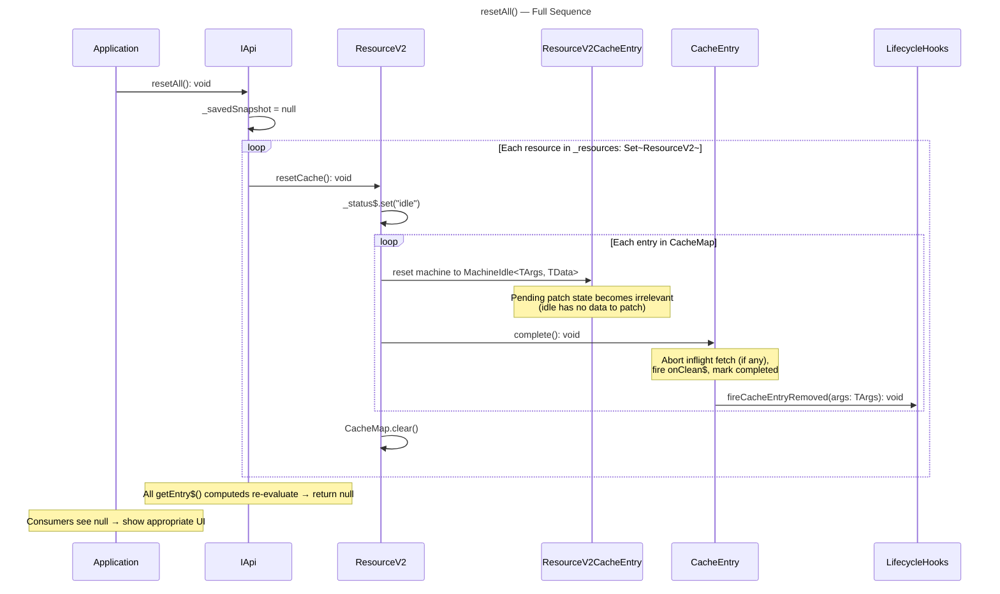

[ref: §2.1] — `_savedSnapshot = null` on resetAll.
[ref: §5.4] — GC trigger / CacheEntry.complete() lifecycle.
[ref: §6.2] — `_status$` set to "idle" → getEntry$ returns null.
