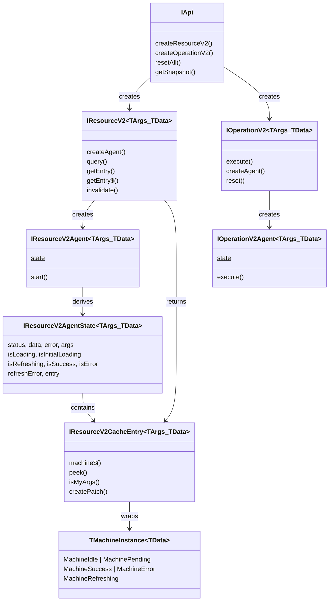

# Domain Model — query-v2

All generic type parameters use `<TArgs, TData>` only. No `TError`. Errors are always `unknown`.
[ref: ../01-research/04-open-questions.md#q1-should-resourcev2-carry-terror-as-a-generic-parameter] — User decision: TError not needed.

## 1. Sentinel Types

```typescript
// ── lib/SKIP_TOKEN.ts ── PUBLIC
export const SKIP: unique symbol = Symbol("SKIP");
export type SKIP_TOKEN = typeof SKIP;

// ── lib/NO_VALUE.ts ── PUBLIC
export const NO_VALUE: unique symbol = Symbol("NO_VALUE");
export type NO_VALUE = typeof NO_VALUE;
```

## 2. Machine State Types

[ref: ../01-research/01-codebase-query-v2.md#23-machine-state-shapes] — State shapes forming a discriminated union.

```typescript
// ── types/machine.types.ts ── PUBLIC

/** Discriminated union of all machine statuses */
type TMachineStatus = "idle" | "pending" | "success" | "error" | "refreshing";

/** Patch lifecycle status */
type TPatchStatus = "pending" | "committed" | "aborted";

/** Single Immer patch record */
interface TPatch {
    readonly patches: import("immer").Patch[];
    readonly inversePatches: import("immer").Patch[];
    readonly status: TPatchStatus;
}

/** Idle state — initial, no data */
interface TIdleState {
    readonly status: "idle";
    readonly args: null;
    readonly data: null;
    readonly error: null;
    readonly updatedAt: null;
}

/** Pending state — first fetch in progress */
interface TPendingState<TArgs, TData> {
    readonly status: "pending";
    readonly args: TArgs;
    readonly data: null;
    readonly error: null;
    readonly updatedAt: null;
    readonly originalData: TData | NO_VALUE;
}

/** Success state — data available */
interface TSuccessState<TArgs, TData> {
    readonly status: "success";
    readonly args: TArgs;
    readonly data: TData;
    readonly error: null;
    readonly updatedAt: number;
    readonly originalData: TData | NO_VALUE;
    readonly patches: TPatch[] | null;
}

/** Error state — fetch failed, no data */
interface TErrorState<TArgs> {
    readonly status: "error";
    readonly args: TArgs;
    readonly data: null;
    readonly error: unknown;
    readonly updatedAt: null;
}

/** Refreshing state — background refetch with stale data */
interface TRefreshingState<TArgs, TData> {
    readonly status: "refreshing";
    readonly args: TArgs;
    readonly data: TData;
    readonly error: null;
    readonly updatedAt: number;
    readonly originalData: TData | NO_VALUE;
    readonly patches: TPatch[] | null;
}

/** Discriminated union of all machine states */
type TMachineState<TArgs = unknown, TData = unknown> =
    | TIdleState
    | TPendingState<TArgs, TData>
    | TSuccessState<TArgs, TData>
    | TErrorState<TArgs>
    | TRefreshingState<TArgs, TData>;
```

## 3. Machine Class Types

```typescript
// ── types/machine.types.ts (continued) ── PUBLIC

/** Union of all concrete machine instances */
type TMachineInstance<TData = unknown> =
    | MachineIdle
    | MachinePending<TData>
    | MachineSuccess<TData>
    | MachineError
    | MachineRefreshing<TData>;

/** Handle returned by createPatch */
interface IPatchHandle {
    readonly commit: () => void;
    readonly abort: () => void;
}

/** Static factory */
interface IMachineStatic {
    idle(): MachineIdle;
    fromSnapshot<TData>(state: TMachineState<unknown, TData>): TMachineInstance<TData>;
}
```

[ref: ../01-research/01-codebase-query-v2.md#24-machine-static-factory] — Machine.idle() and Machine.fromSnapshot().

## 4. Patcher Types

```typescript
// ── INTERNAL (core/machines/Patcher.ts)

/** Result of Patcher.resolvePatches */
interface IPatchResolution<TData> {
    readonly data: TData;
    readonly patches: TPatch[] | null;
    readonly baseData: TData;
    readonly isConsistencyViolation: boolean;
}

/** Patcher static methods */
interface IPatcher {
    createPatch<TData>(
        patchFn: (draft: TData) => void,
        data: TData,
    ): { patch: TPatch; data: TData };

    resolvePatches<TData>(
        originalData: TData,
        patches: TPatch[],
    ): IPatchResolution<TData>;

    finishPatch<TData>(
        originalData: TData,
        patches: TPatch[],
        type: "committed" | "aborted",
        patch: TPatch,
    ): IPatchResolution<TData>;

    abortAllPending<TData>(
        originalData: TData,
        patches: TPatch[],
    ): IPatchResolution<TData>;
}
```

[ref: ../01-research/04-open-questions.md#q6-how-should-consistency-violation-detection-work-in-the-patcher] — Patcher returns `isConsistencyViolation` flag.

## 5. CacheEntry Types

```typescript
// ── types/cache.types.ts ── INTERNAL

import type { SignalFn } from "@/signals";
import type { Subject } from "rxjs";

/** Internal reactive container wrapping a Signal.state<TState> */
interface ICacheEntry<TState = unknown> {
    /** Reactive read — registers signal dependency */
    state$(): TState;
    /** Non-reactive read */
    peek(): TState;
    /** Update stored state (no-op if completed) */
    set(state: TState): void;
    /** Fire onClean$ and mark completed. Subsequent set() calls are no-ops. */
    complete(): void;
    /** Cleanup observable — fires on complete() */
    readonly onClean$: Subject<void>;
}

/** Options for CacheEntry construction (DevTools passthrough) */
interface ICacheEntryOptions {
    keyParts?: string[];
    beforeDevtoolsPush?: (value: unknown, push: (v: unknown) => void) => void;
}
```

[ref: ../01-research/04-open-questions.md#q4-what-should-the-cacheentry-api-surface-look-like] — CacheEntry is internal reactive container. Consumer-facing methods live on Resource/IResourceV2CacheEntry wrapper.
[ref: ../01-research/04-open-questions.md#q7-what-is-the-correct-type-for-cacheentrys-inner-signal] — CacheEntry stores a generic state value via Signal.state<TState>. Resource instantiates as ICacheEntry<TMachineInstance<TData>>.

## 6. CacheMap Types

```typescript
// ── types/cache.types.ts (continued) ── INTERNAL

/** Configuration for CacheMap creation */
interface ICacheMapOptions<TArgs> {
    keyStrategy: "serialize" | "compare";
    serializeArgs?: (args: TArgs) => string;
    compareArg?: (a: TArgs, b: TArgs) => boolean;
    doCacheArgs?: boolean;
}

/** CacheMap instance — storage container for cache entries */
interface ICacheMap<TArgs, TState> {
    get(args: TArgs): ICacheEntry<TState> | undefined;
    getOrCreate(args: TArgs, options?: ICacheEntryOptions): ICacheEntry<TState>;
    delete(args: TArgs): boolean;
    has(args: TArgs): boolean;
    clear(): void;
    readonly size: number;
    values(): IterableIterator<ICacheEntry<TState>>;
    entries(): IterableIterator<[string | TArgs, ICacheEntry<TState>]>;
}
```

## 7. Resource Types

### 7.1 Resource Configuration

```typescript
// ── types/resource.types.ts ── PUBLIC

/** Query function signature */
type TQueryFn<TArgs, TData> = (
    args: TArgs,
    tools: { abortSignal: AbortSignal },
) => Promise<TData>;

/** Serialization function */
type TSerializeArgsFn<TArgs = unknown> = (args: TArgs) => string;

/** Comparison function */
type TCompareArgsFn<TArgs = unknown> = (a: TArgs, b: TArgs) => boolean;

/** Resource creation options */
interface IResourceV2Options<TArgs, TData> {
    /** Unique key for this resource (required for SSR) */
    readonly key?: string;
    /** Query function */
    readonly queryFn: TQueryFn<TArgs, TData>;
    /** Cache lifetime in ms. Default: inherited from createApi */
    readonly cacheLifetime?: number;
    /** Custom args serialization (override API-level) */
    readonly serializeArgs?: TSerializeArgsFn<TArgs>;
    /** Custom args comparison (override API-level) */
    readonly compareArg?: TCompareArgsFn<TArgs>;
    /** Lifecycle: triggered when new cache entry is created */
    readonly onCacheEntryAdded?: TOnCacheEntryAdded<TArgs, TData>;
    /** Lifecycle: triggered when query starts */
    readonly onQueryStarted?: TOnQueryStarted<TArgs, TData>;
    /** DevTools state interceptor */
    readonly beforeDevtoolsPush?: (value: unknown, push: (v: unknown) => void) => void;
    /** Max age for snapshot data before auto-invalidation */
    readonly maxSnapshotDataAge?: number;
    /** Cache args in entry for WeakMap memoization */
    readonly doCacheArgs?: boolean;
}
```

### 7.2 Resource Instance

```typescript
// ── types/resource.types.ts (continued) ── PUBLIC

/**
 * Resource instance — the main data fetching unit.
 *
 * Void-args ergonomics: When TArgs = void, the args parameter is omitted
 * from all methods via ArgsOrVoid<TArgs> rest parameters (see §8.2).
 */
interface IResourceV2<TArgs, TData> {
    /** Create an agent (SWR observer) */
    createAgent(): IResourceV2Agent<TArgs, TData>;

    /** Execute query, return promise of data. Deduplicates in-flight. */
    query(...args: [...ArgsOrVoid<TArgs>, doForce?: boolean]): Promise<TData>;

    /**
     * Get cache entry (non-reactive).
     * When TArgs = void, args is omitted: getEntry() / getEntry(true).
     */
    getEntry(...args: ArgsOrVoid<TArgs>): IResourceV2CacheEntry<TArgs, TData> | null;
    getEntry(...args: [...ArgsOrVoid<TArgs>, doInitiate: true]): IResourceV2CacheEntry<TArgs, TData>;

    /**
     * Get cache entry (reactive — Signal.compute).
     * Returns null when no entry or after resetAll().
     * Same overloads as getEntry.
     */
    getEntry$(...args: ArgsOrVoid<TArgs>): IResourceV2CacheEntry<TArgs, TData> | null;
    getEntry$(...args: [...ArgsOrVoid<TArgs>, doInitiate: true]): IResourceV2CacheEntry<TArgs, TData>;

    /** Force re-fetch for args in success state */
    invalidate(...args: ArgsOrVoid<TArgs>): void;
}
```

[ref: docs/query-v2/v0.1/README.md] — `getEntry` / `getEntry$` naming, `IResourceV2CacheEntry` as consumer-facing entry.
[ref: docs/query-v2/v0.1/Внутриянка.md] — Strong typing: `getEntry(args, true)` non-nullable, `getEntry$` reacts to resetAll.

### 7.3 Resource Cache Entry (Consumer-Facing)

```typescript
// ── types/resource.types.ts (continued) ── PUBLIC

/**
 * Consumer-facing cache entry handle.
 * Composes an internal ICacheEntry<TMachineInstance<TData>> via private `_entry` field.
 * machine$() delegates to _entry.state$(), peek() delegates to _entry.peek().
 * Resource creates this wrapper when returning entries from getEntry/getEntry$.
 */
interface IResourceV2CacheEntry<TArgs, TData> {
    /** Reactive read of machine state (delegates to internal CacheEntry.state$()) */
    machine$(): TMachineInstance<TData>;
    /** Non-reactive read (delegates to internal CacheEntry.peek()) */
    peek(): TMachineInstance<TData>;
    /** Check if this entry matches given args */
    isMyArgs(args: TArgs): boolean;
    /** Create an optimistic patch. Returns null if no data available. */
    createPatch(patchFn: (draft: TData) => void): IPatchHandle | null;
    /** Force re-fetch */
    invalidate(): void;
}
```

[ref: docs/query-v2/v0.1/README.md] — `IResourceV2CacheEntry` with `isMyArgs`, `createPatch`.
[ref: ../01-research/04-open-questions.md#q4-what-should-the-cacheentry-api-surface-look-like] — Separate internal CacheEntry from consumer-facing handle.

## 8. Agent Types

### 8.1 Resource Agent

```typescript
// ── types/agent.types.ts ── PUBLIC

/** Resource agent state — flat object derived from machine */
interface IResourceV2AgentState<TArgs, TData> {
    readonly status: TMachineStatus;
    readonly data: TData | null;
    readonly error: unknown;
    readonly args: TArgs | null;
    readonly isLoading: boolean;
    readonly isInitialLoading: boolean;
    readonly isRefreshing: boolean;
    readonly isSuccess: boolean;
    readonly isError: boolean;
    /** Entry handle for optimistic patches */
    readonly entry: IResourceV2CacheEntry<TArgs, TData> | null;
}

/** Resource agent instance */
interface IResourceV2Agent<TArgs, TData> {
    /** Reactive state signal */
    readonly state$: ComputeFn<IResourceV2AgentState<TArgs, TData>>;
    /** Start observing a resource with given args */
    start(args: SKIP_TOKEN): void;
    start(...args: ArgsOrVoid<TArgs>): void;
    /** Compare args using resource strategy */
    compareArgs(a: TArgs, b: TArgs): boolean;
}
```

[ref: docs/query-v2/v0.1/README.md] — Agent state fields: status, data, error, args, isLoading, isInitialLoading, isRefreshing, isSuccess, isError.
[ref: docs/query-v2/v0.1/optimistic-updates.md] — Agent provides `entry` for patch creation.
[ref: ../01-research/04-open-questions.md#q13-what-should-the-refresherror-field-on-agent-state-look-like] — refreshError: set on refresh failure, cleared on next success.

### 8.2 Void Args Ergonomics

```typescript
// ── types/shared.types.ts ── PUBLIC

/**
 * Helper type for void args ergonomics.
 * When TArgs is void, functions accepting TArgs become zero-arg callable.
 */
type ArgsOrVoid<TArgs> = TArgs extends void ? [] : [args: TArgs];
type ArgsOrVoidOrSkip<TArgs> = TArgs extends void
    ? [] | [args: SKIP_TOKEN]
    : [args: TArgs | SKIP_TOKEN];
```

[ref: ../01-research/04-open-questions.md#q9-how-should-the-v2-type-system-handle-the-void-args-pattern] — Overloads at API/hook level + simpler types internally.
[ref: docs/query-v2/v0.1/Внутриянка.md] — Agent accepts void without explicit undefined.

## 9. Operation Types

### 9.1 Operation Configuration

```typescript
// ── types/operation.types.ts ── PUBLIC

/** Operation query function (no abort signal — operations are not cancellable) */
type TOperationQueryFn<TArgs, TData> = (args: TArgs) => Promise<TData>;

/** Operation creation options */
interface IOperationV2Options<TArgs, TData> {
    /** Unique key for this operation */
    readonly key?: string;
    /** Execution function */
    readonly queryFn: TOperationQueryFn<TArgs, TData>;
    /** DevTools state interceptor */
    readonly beforeDevtoolsPush?: (value: unknown, push: (v: unknown) => void) => void;
}
```

### 9.2 Operation Instance

```typescript
// ── types/operation.types.ts (continued) ── PUBLIC

/** Operation agent state — flat object */
interface IOperationV2AgentState<TArgs, TData> {
    readonly status: TMachineStatus;
    readonly data: TData | null;
    readonly error: unknown;
    readonly args: TArgs | null;
    readonly isLoading: boolean;
    readonly isSuccess: boolean;
    readonly isError: boolean;
}

/** Operation instance */
interface IOperationV2<TArgs, TData> {
    /** Execute operation, return promise of data */
    execute(args: TArgs): Promise<TData>;
    /** Create an agent (state observer) */
    createAgent(): IOperationV2Agent<TArgs, TData>;
    /** Reset to idle state */
    reset(): void;
}

/** Operation agent */
interface IOperationV2Agent<TArgs, TData> {
    /** Reactive state signal */
    readonly state$: ComputeFn<IOperationV2AgentState<TArgs, TData>>;
    /** Execute operation, returns promise */
    execute(args: TArgs): Promise<TData>;
}
```

## 10. Lifecycle Hook Types

```typescript
// ── types/lifecycle.types.ts ── PUBLIC

/** Tools provided to onCacheEntryAdded callback */
interface ICacheEntryAddedTools<TData> {
    /** Resolves when first MachineSuccess is reached */
    readonly $cacheDataLoaded: Promise<TData>;
    /** Resolves when cache entry is removed (GC / resetAll) */
    readonly $cacheEntryRemoved: Promise<void>;
}

/** Tools provided to onQueryStarted callback */
interface IQueryStartedTools<TData> {
    /** Resolves/rejects when query completes */
    readonly $queryFulfilled: Promise<{ data: TData }>;
    /** Get current cache entry */
    readonly getCacheEntry: () => IResourceV2CacheEntry<unknown, TData>;
}

/** onCacheEntryAdded callback signature */
type TOnCacheEntryAdded<TArgs, TData> = (
    args: TArgs,
    tools: ICacheEntryAddedTools<TData>,
) => void | Promise<void>;

/** onQueryStarted callback signature */
type TOnQueryStarted<TArgs, TData> = (
    args: TArgs,
    tools: IQueryStartedTools<TData>,
) => void | Promise<void>;
```

[ref: ../01-research/01-codebase-query-v2.md#44-lifecyclehooks] — LifecycleHooks manages `$cacheDataLoaded`, `$cacheEntryRemoved`, `$queryFulfilled`.
[ref: docs/query-v2/v0.1/README.md] — Lifecycle hook tools documented.

## 11. Snapshot Types

```typescript
// ── types/snapshot.types.ts ── PUBLIC

/** Current snapshot format version */
declare const CURRENT_SNAPSHOT_VERSION: 1;

/** Single entry in a resource snapshot */
interface TResourceV2SnapshotSlice<TData = unknown> {
    readonly status: "success";
    readonly args: unknown;
    readonly data: TData;
    readonly updatedAt: number;
}

/** All entries for a single resource */
interface TResourceSnapshot {
    readonly entries: Record<string, TResourceV2SnapshotSlice>;
}

/** Full API snapshot — serializable */
interface TApiSnapshot {
    readonly version: typeof CURRENT_SNAPSHOT_VERSION;
    readonly keyPrefix: string | null;
    readonly resources: Record<string, TResourceSnapshot>;
}
```

[ref: ../01-research/01-codebase-query-v2.md#73-snapshot-data-shape] — Snapshot structure.
[ref: docs/query-v2/v0.1/ssr.md] — Only success entries. Throws on version/prefix mismatch.

## 12. Plugin Types

```typescript
// ── types/plugin.types.ts ── PUBLIC

/** Context passed to plugin.install() */
interface IPluginContext {
    readonly keyStrategy: "serialize" | "compare";
}

/** Plugin interface */
interface IPlugin {
    readonly name: string;
    /** Called once when createApi() is invoked */
    install(context: IPluginContext): void;
    /** Called per createResourceV2() — return contributed methods */
    augmentResource?<TArgs, TData>(
        resource: IResourceV2<TArgs, TData>,
        options: IResourceV2Options<TArgs, TData>,
    ): Record<string, unknown>;
    /** Called per createOperationV2() — return contributed methods */
    augmentOperation?<TArgs, TData>(
        operation: IOperationV2<TArgs, TData>,
        options: IOperationV2Options<TArgs, TData>,
    ): Record<string, unknown>;
}

/**
 * Declaration merging target for plugin contributions.
 * Plugins extend this interface to add type-safe augmentations.
 *
 * Example:
 *   declare module "@fozy-labs/rx-toolkit" {
 *       interface PluginContributionMap<TArgs, TData> {
 *           ReactHooksPlugin: { useResourceV2Agent(args: TArgs | SKIP_TOKEN): IResourceV2AgentState<TArgs, TData> };
 *       }
 *   }
 */
interface PluginContributionMap<TArgs, TData> {}

/** Extract and intersect all plugin contributions */
type PluginAugmentations<
    TPlugins extends IPlugin[],
    TArgs,
    TData,
> = UnionToIntersection<
    PluginContributionMap<TArgs, TData>[TPlugins[number]["name"] & keyof PluginContributionMap<TArgs, TData>]
>;
```

[ref: ../01-research/01-codebase-query-v2.md#82-type-level-augmentation] — Declaration merging for plugin contributions.
[ref: ../01-research/04-open-questions.md#q14-how-should-the-plugin-augmentresource-api-compose-with-typescript] — Keep declaration merging with runtime validation.

### 12.1 ReactHooksPlugin Type

```typescript
// ── plugins/ReactHooksPlugin.ts ── PUBLIC

/**
 * Plugin that contributes useResourceV2Agent() method to resource instances.
 * When installed via createApi, each createResourceV2 call will have
 * the hook method automatically attached via augmentResource().
 *
 * The same hook is also available standalone as useResourceV2(resource, args)
 * from the react/ layer — the plugin simply provides the convenience of
 * calling it as a method on the resource instance.
 */
class ReactHooksPlugin implements IPlugin {
    readonly name = "ReactHooksPlugin";

    install(context: IPluginContext): void;

    augmentResource<TArgs, TData>(
        resource: IResourceV2<TArgs, TData>,
        options: IResourceV2Options<TArgs, TData>,
    ): {
        useResourceV2Agent(
            ...args: ArgsOrVoidOrSkip<TArgs>
        ): IResourceV2AgentState<TArgs, TData>;
    };
}

/** Declaration merging — type-safe plugin contributions */
declare module "@fozy-labs/rx-toolkit" {
    interface PluginContributionMap<TArgs, TData> {
        ReactHooksPlugin: {
            useResourceV2Agent(
                ...args: ArgsOrVoidOrSkip<TArgs>
            ): IResourceV2AgentState<TArgs, TData>;
        };
    }
}
```

`ReactHooksPlugin` contributes only `useResourceV2Agent()` to resource instances via `augmentResource()`. It does not currently augment operations — `useOperationV2()` is a standalone hook in the `react/` layer.

[ref: docs/query-v2/v0.1/README.md] — "Методы, добавляемые плагином: useResourceV2Agent(args)".
[ref: 04-decisions.md#adr-9-plugin-hook-api] — Synchronous Object.assign composition with declaration merging.

## 13. Factory Function Signatures

### 13.1 createApi (API Factory)

```typescript
// ── api/createApi.ts ── PUBLIC

/** API-level options */
interface ICreateApiOptions {
    readonly keyPrefix?: string | null;
    readonly keyStrategy?: "serialize" | "compare";
    readonly serializeArgs?: TSerializeArgsFn;
    readonly compareArg?: TCompareArgsFn;
    readonly cacheLifetime?: number;
    readonly plugins?: IPlugin[];
    readonly initialSnapshot?: TApiSnapshot | null;
    readonly maxSnapshotDataAge?: number;
    readonly doCacheArgs?: boolean;
}

/** API instance */
interface IApi {
    createResourceV2<TArgs, TData>(
        options: IResourceV2Options<TArgs, TData>,
    ): IResourceV2<TArgs, TData> & PluginAugmentations<IPlugin[], TArgs, TData>;

    createOperationV2<TArgs, TData>(
        options: IOperationV2Options<TArgs, TData>,
    ): IOperationV2<TArgs, TData> & PluginAugmentations<IPlugin[], TArgs, TData>;

    /** Reset all resources and operations */
    resetAll(): void;

    /** Capture snapshot of all resources */
    getSnapshot(): TApiSnapshot;
}

declare function createApi(options?: ICreateApiOptions): IApi;
```

[ref: docs/query-v2/v0.1/README.md] — createApi parameters and defaults.
[ref: ../01-research/01-codebase-query-v2.md#10-api-factory-createapi] — API factory behavior: registry, plugin install, augment, hydrate.

### 13.3 hydrateSnapshot (Standalone Function)

```typescript
// ── api/hydrateSnapshot.ts ── PUBLIC

/**
 * Hydrate an API instance from a previously captured snapshot.
 * Validates version and keyPrefix match. Populates resource caches
 * with MachineSuccess entries. Entries already in cache are skipped.
 * Stale entries (per maxSnapshotDataAge) are auto-invalidated.
 *
 * Throws on version mismatch or keyPrefix mismatch.
 */
declare function hydrateSnapshot(api: IApi, snapshot: TApiSnapshot): void;
```

[ref: 02-dataflow.md§§3.1] — Snapshot capture/hydrate flow.
[ref: 04-decisions.md#adr-8-snapshot-bridge] — Snapshot via .state extraction + Machine.fromSnapshot() reconstruction.

### 13.2 Standalone Factory Functions

```typescript
// ── api/ ── PUBLIC

/** Create a standalone resource (without API/plugin system) */
declare function createResourceV2<TArgs, TData>(
    options: IResourceV2Options<TArgs, TData> & {
        keyStrategy?: "serialize" | "compare";
        keyPrefix?: string;
    },
): IResourceV2<TArgs, TData>;

/** Create a standalone operation */
declare function createOperationV2<TArgs, TData>(
    options: IOperationV2Options<TArgs, TData>,
): IOperationV2<TArgs, TData>;

/** Reset all resources in all cache instances */
declare function resetAllCacheV2(): void;
```

## 14. React Hook Signatures

```typescript
// ── react/ ── PUBLIC

/**
 * React hook for subscribing to resource state.
 * Creates agent internally, handles SWR.
 *
 * Overloads for void args:
 *   useResourceV2(resource) — for TArgs = void
 *   useResourceV2(resource, args) — for TArgs
 *   useResourceV2(resource, SKIP) — conditional skip
 */
declare function useResourceV2<TArgs, TData>(
    resource: IResourceV2<TArgs, TData>,
    ...args: ArgsOrVoidOrSkip<TArgs>
): IResourceV2AgentState<TArgs, TData>;

/**
 * React hook for operation execution.
 * Returns [trigger, state] tuple.
 */
declare function useOperationV2<TArgs, TData>(
    operation: IOperationV2<TArgs, TData>,
): [
    trigger: (...args: ArgsOrVoid<TArgs>) => Promise<TData>,
    state: IOperationV2AgentState<TArgs, TData>,
];
```

[ref: ../01-research/02-codebase-query-v1.md#41-useresourceagent] — V1 hook pattern: `useConstant` for agent, `useSignal` for subscription.
[ref: ../01-research/02-codebase-query-v1.md#43-usecommandagent] — V1 Command hook returns `[trigger, state]` tuple.
[ref: ../01-research/04-open-questions.md#q9-how-should-the-v2-type-system-handle-the-void-args-pattern] — Overloads at hook level.

## 15. Type Hierarchy Diagram



## 16. Internal vs Public Type Summary

| Type | Visibility | Layer |
|------|-----------|-------|
| `SKIP`, `NO_VALUE` | **Public** | lib |
| `TMachineStatus`, `TMachineState`, `TMachineInstance` | **Public** | types |
| `TPatch`, `TPatchStatus`, `IPatchHandle` | **Public** | types |
| `MachineIdle`, `MachinePending`, `MachineSuccess`, `MachineError`, `MachineRefreshing` | **Public** | core/machines |
| `Machine` (static factory) | **Public** | core/machines |
| `IResourceV2`, `IResourceV2Options`, `IResourceV2CacheEntry` | **Public** | types |
| `IResourceV2Agent`, `IResourceV2AgentState` | **Public** | types |
| `IOperationV2`, `IOperationV2Options`, `IOperationV2Agent`, `IOperationV2AgentState` | **Public** | types |
| `IApi`, `ICreateApiOptions` | **Public** | types |
| `IPlugin`, `IPluginContext`, `PluginContributionMap` | **Public** | types |
| `TApiSnapshot`, `TResourceSnapshot`, `TResourceV2SnapshotSlice` | **Public** | types |
| `TOnCacheEntryAdded`, `TOnQueryStarted`, tools interfaces | **Public** | types |
| `TQueryFn`, `TSerializeArgsFn`, `TCompareArgsFn` | **Public** | types |
| `ArgsOrVoid`, `ArgsOrVoidOrSkip` | **Public** | types |
| `ICacheEntry`, `ICacheEntryOptions` | **Internal** | core |
| `ICacheMap`, `ICacheMapOptions` | **Internal** | core |
| `IPatcher`, `IPatchResolution` | **Internal** | core |
| `LifecycleHooks` | **Internal** | core |
| `Resource` (class) | **Internal** | core |
| `Operation` (class) | **Internal** | core |
| `ResourceAgent`, `OperationAgent` (classes) | **Internal** | core |
| `stableStringify` | **Internal** | lib |
