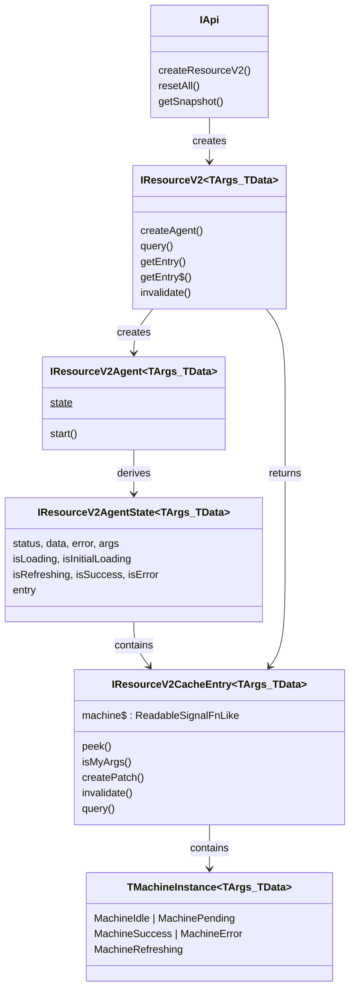

# Domain Model — query-v2

All generic type parameters use `<TArgs, TData>` only. No `TError`. Errors are always `unknown`.
[ref: ../01-research/04-open-questions.md#q1-should-resourcev2-carry-terror-as-a-generic-parameter] — User decision: TError not needed.

## 1. Sentinel Types

```typescript
// ── lib/SKIP_TOKEN.ts ── PUBLIC
export const SKIP: unique symbol = Symbol("SKIP");
export type SKIP_TOKEN = typeof SKIP;
```

## 2. Machine State Types

[ref: ../01-research/01-codebase-query-v2.md#23-machine-state-shapes] — State shapes forming a discriminated union.

```typescript
// ── types/machine.types.ts ── PUBLIC

/** Discriminated union of all machine statuses */
type TMachineStatus = "idle" | "pending" | "success" | "error" | "refreshing";

/** Patch lifecycle status */
type TPatchStatus = "pending" | "committed" | "aborted";

/** Single Immer patch record */
interface TPatch {
    readonly patches: import("immer").Patch[];
    readonly inversePatches: import("immer").Patch[];
    readonly status: TPatchStatus;
}

/**
 * Grouped patch lifecycle state.
 * Stored on machine states that support patching (success, refreshing).
 * When null, no patches are active — data is raw server data.
 * When present, data is the patched version; originalData is the unpatched base.
 */
interface TPatchState<TData> {
    readonly originalData: TData;
    readonly patches: TPatch[];
    readonly isConsistencyViolation: boolean;
}

/** Idle state — initial, no data */
interface TIdleState {
    readonly status: "idle";
    readonly args: null;
    readonly data: null;
    readonly error: null;
    readonly updatedAt: null;
}

/** Pending state — first fetch in progress */
interface TPendingState<TArgs> {
    readonly status: "pending";
    readonly args: TArgs;
    readonly data: null;
    readonly error: null;
    readonly updatedAt: null;
}

/** Success state — data available */
interface TSuccessState<TArgs, TData> {
    readonly status: "success";
    readonly args: TArgs;
    readonly data: TData;
    readonly error: null;
    readonly updatedAt: number;
    readonly patchState: TPatchState<TData> | null;
}

/** Error state — fetch failed, no data */
interface TErrorState<TArgs> {
    readonly status: "error";
    readonly args: TArgs;
    readonly data: null;
    readonly error: unknown;
    readonly updatedAt: null;
}

/** Refreshing state — background refetch with stale data */
interface TRefreshingState<TArgs, TData> {
    readonly status: "refreshing";
    readonly args: TArgs;
    readonly data: TData;
    readonly error: null;
    readonly updatedAt: number;
    readonly patchState: TPatchState<TData> | null;
}

/** Discriminated union of all machine states */
type TMachineState<TArgs = unknown, TData = unknown> =
    | TIdleState
    | TPendingState<TArgs>
    | TSuccessState<TArgs, TData>
    | TErrorState<TArgs>
    | TRefreshingState<TArgs, TData>;
```

## 3. Machine Class Types

```typescript
// ── types/machine.types.ts (continued) ── PUBLIC

/** Union of all concrete machine instances */
type TMachineInstance<TArgs = unknown, TData = unknown> =
    | MachineIdle<TArgs, TData>
    | MachinePending<TArgs, TData>
    | MachineSuccess<TArgs, TData>
    | MachineError<TArgs, TData>
    | MachineRefreshing<TArgs, TData>;

/** Handle returned by createPatch */
interface IPatchHandle {
    readonly commit: () => void;
    readonly abort: () => void;
}

/** Result of MachineWithData.createPatch — new immutable machine + external handle */
type CreatePatchResult<TArgs, TData> = {
    readonly machine: MachineWithData<TArgs, TData>;
    readonly patchHandle: IPatchHandle;
};

/** Static factory */
interface IMachineStatic {
    idle<TArgs, TData>(): MachineIdle<TArgs, TData>;
    fromSnapshot<TArgs, TData>(state: TMachineState<TArgs, TData>): TMachineInstance<TArgs, TData>;
}
```

[ref: ../01-research/01-codebase-query-v2.md#24-machine-static-factory] — Machine.idle() and Machine.fromSnapshot().

### 3.1 Machine Class Definitions

Machines are immutable — every transition method returns a new instance. `MachineWithData` is an abstract base for states that carry data (`MachineSuccess`, `MachineRefreshing`).

```typescript
// ── core/machines/ ── PUBLIC

/**
 * Abstract base for machine states that carry data (success, refreshing).
 * Owns patchState and provides createPatch / finishPatch / abortAllPendingPatches.
 */
abstract class MachineWithData<TArgs, TData> {
    readonly args: TArgs;
    readonly data: TData;
    readonly patchState: TPatchState<TData> | null;

    /**
     * Pure immutable transition — creates a new machine with patched data
     * and updated patchState, plus an IPatchHandle for commit/abort.
     * Returns null if patchFn produces no changes.
     */
    createPatch(patchFn: (draft: TData) => void): CreatePatchResult<TArgs, TData> | null;

    /** Finishes a patch (commit or abort) and returns a new machine with resolved state */
    finishPatch(type: "committed" | "aborted", patch: TPatch): TMachineInstance<TArgs, TData>;

    /** Aborts all pending patches, returns a new machine with resolved state */
    abortAllPendingPatches(): TMachineInstance<TArgs, TData>;

    /** Clone with partial updates (used internally by transitions) */
    protected cloneWith(updates: Partial<this>): this;
}

class MachineIdle<TArgs, TData> {
    readonly status: "idle";
    readonly args: null;

    start(args: TArgs): MachinePending<TArgs, TData>;
    reset(): MachineIdle<TArgs, TData>;
}

class MachinePending<TArgs, TData> {
    readonly status: "pending";
    readonly args: TArgs;

    successHappened(data: TData): MachineSuccess<TArgs, TData>;
    errorHappened(error: unknown): MachineError<TArgs, TData>;
    reset(): MachineIdle<TArgs, TData>;
}

class MachineSuccess<TArgs, TData> extends MachineWithData<TArgs, TData> {
    readonly status: "success";
    readonly updatedAt: number;

    invalidate(): MachineRefreshing<TArgs, TData>;
    start(args: TArgs): MachinePending<TArgs, TData>;
    reset(): MachineIdle<TArgs, TData>;
}

class MachineError<TArgs, TData> {
    readonly status: "error";
    readonly args: TArgs;
    readonly error: unknown;

    retry(): MachinePending<TArgs, TData>;
    start(args: TArgs): MachinePending<TArgs, TData>;
    reset(): MachineIdle<TArgs, TData>;
}

class MachineRefreshing<TArgs, TData> extends MachineWithData<TArgs, TData> {
    readonly status: "refreshing";
    readonly updatedAt: number;

    successHappened(data: TData): MachineSuccess<TArgs, TData>;
    /** ADR-2: error on refreshing preserves stale data → returns MachineSuccess */
    errorHappened(error: unknown): MachineSuccess<TArgs, TData>;
    reset(): MachineIdle<TArgs, TData>;
}
```

**Patch ownership boundary**: `MachineWithData.createPatch()` is a pure immutable transition — it produces a new machine instance with patched `data` and updated `patchState`, plus an `IPatchHandle`. `ResourceV2CacheEntry.createPatch()` is the orchestrator — it calls the machine's `createPatch`, stores the new machine in the signal via `set()`, manages the private `_patchState` field, and returns only the `IPatchHandle` to the consumer.

## 4. Patcher Types

```typescript
// ── INTERNAL (core/machines/Patcher.ts)

/** Result of Patcher.resolvePatches — returns computed data and new patch state */
interface IPatchResolution<TData> {
    readonly data: TData;
    readonly patchState: TPatchState<TData> | null;
}

/** Patcher static methods */
interface IPatcher {
    createPatch<TData>(
        patchFn: (draft: TData) => void,
        data: TData,
    ): { patch: TPatch; data: TData };

    resolvePatches<TData>(
        originalData: TData,
        patches: TPatch[],
    ): IPatchResolution<TData>;

    finishPatch<TData>(
        originalData: TData,
        patches: TPatch[],
        type: "committed" | "aborted",
        patch: TPatch,
    ): IPatchResolution<TData>;

    abortAllPending<TData>(
        originalData: TData,
        patches: TPatch[],
    ): IPatchResolution<TData>;
}
```

[ref: ../01-research/04-open-questions.md#q6-how-should-consistency-violation-detection-work-in-the-patcher] — Patcher returns `IPatchResolution` with `patchState: TPatchState<TData> | null` containing `isConsistencyViolation` flag.

## 5. CacheEntry Types

```typescript
// ── types/cache.types.ts ── INTERNAL

import type { SignalFn } from "@/signals";
import type { Subject } from "rxjs";

/** Internal reactive container wrapping a Signal.state<TState> */
interface ICacheEntry<TState = unknown> {
    /** Reactive read — registers signal dependency */
    state$(): TState;
    /** Non-reactive read */
    peek(): TState;
    /** Update stored state (no-op if completed) */
    set(state: TState): void;
    /** Fire onClean$ and mark completed. Subsequent set() calls are no-ops. */
    complete(): void;
    /** Cleanup observable — fires on complete() */
    readonly onClean$: Subject<void>;
    /** RxJS Observable bridge — exposes state$ as an Observable<TState> for share({resetOnRefCountZero}) GC integration */
    readonly obs: Observable<TState>;
}

/** Options for CacheEntry construction (DevTools passthrough) */
interface ICacheEntryOptions {
    keyParts?: string[];
    beforeDevtoolsPush?: (value: unknown, push: (v: unknown) => void) => void;
}
```

**Concrete class** (internal — not exported):

```typescript
// ── core/CacheEntry.ts ── INTERNAL
class CacheEntry<TState> implements ICacheEntry<TState> {
    private _signal$: SignalFn<TState>;
    private _isCompleted: boolean;
    private _onClean$: Subject<void>;
    readonly onClean$: Subject<void>;
    /** Observable adapter — wraps _signal$ for RxJS share({resetOnRefCountZero}) GC chain */
    readonly obs: Observable<TState>;

    // state$(), peek(), set(), complete() delegate to _signal$
    // complete() sets _isCompleted = true, fires onClean$, subsequent set() are no-ops
    // obs is constructed once from _signal$ — enables GC via share({resetOnRefCountZero}) (see 02-dataflow.md §1.7)
}
```

[ref: ../01-research/04-open-questions.md#q4-what-should-the-cacheentry-api-surface-look-like] — CacheEntry is internal reactive container. ResourceV2CacheEntry extends CacheEntry and adds resource-specific methods (isMyArgs, createPatch, invalidate, query).
[ref: ../01-research/04-open-questions.md#q7-what-is-the-correct-type-for-cacheentrys-inner-signal] — CacheEntry stores a generic state value via Signal.state<TState>. ResourceV2 instantiates as ICacheEntry<TMachineInstance<TArgs, TData>>.

## 6. CacheMap Types

**`TEntry` is intentionally unconstrained** — CacheMap is a pure generic container. It stores, retrieves, and deletes entries but **never calls any method** on `TEntry`. All entry lifecycle operations (e.g., `complete()`, `onClean$` subscription, `query()`) are performed by `ResourceV2` or consumers — not by CacheMap. Entry creation is delegated to a `factory` callback provided at construction time. This preserves CacheMap's full independence from `CacheEntry` and `ResourceV2CacheEntry`. [ref: 04-decisions.md#adr-19-cachemap-dual-implementation-with-factory-pattern]

### 6.1 Interface

```typescript
// ── types/cache.types.ts (continued) ── INTERNAL

/**
 * CacheMap instance — generic storage container, keyed by args.
 * TEntry is unconstrained: CacheMap never invokes methods on entries.
 * In practice, ResourceV2 instantiates as ICacheMap<TArgs, ResourceV2CacheEntry<TArgs, TData>>.
 */
interface ICacheMap<TArgs, TEntry> {
    get(args: TArgs): TEntry | undefined;
    getOrCreate(args: TArgs): TEntry;
    delete(args: TArgs): boolean;
    has(args: TArgs): boolean;
    clear(): void;
    readonly size: number;
    values(): IterableIterator<TEntry>;
    entries(): IterableIterator<[string | TArgs, TEntry]>;
}
```

### 6.2 Configuration & Factory

```typescript
// ── types/cache.types.ts (continued) ── INTERNAL

/** Factory function used by CacheMap to create new entries when getOrCreate is called */
type TCacheMapFactory<TArgs, TEntry> = (args: TArgs) => TEntry;

/** Configuration for CacheMap creation */
interface ICacheMapOptions<TArgs, TEntry> {
    /** Factory function to create a new entry when getOrCreate encounters unknown args */
    factory: TCacheMapFactory<TArgs, TEntry>;
    keyStrategy: "serialize" | "compare";
    serializeArgs?: (args: TArgs) => string;
    compareArg?: (a: TArgs, b: TArgs) => boolean;
    doCacheArgs?: boolean;
}
```

### 6.3 Concrete Implementations

Two concrete classes implement `ICacheMap`, selected based on `keyStrategy`. CacheMap has no knowledge of `CacheEntry` or `ResourceV2CacheEntry` — it is fully generic over `TEntry` (unconstrained). Entry creation is delegated to the `factory` callback received at construction time. CacheMap only stores and retrieves `TEntry` values — it never calls methods on them, which is why no constraint (e.g., `TEntry extends CacheEntry`) is required.

[ref: 04-decisions.md#adr-19-cachemap-dual-implementation-with-factory-pattern] — ADR-19 covers the rationale.

**SerializeCacheMap** — used when `keyStrategy = "serialize"` (default):

```typescript
// ── core/CacheMap/SerializeCacheMap.ts ── INTERNAL
class SerializeCacheMap<TArgs, TEntry> implements ICacheMap<TArgs, TEntry> {
    private _map: Map<string, TEntry>;
    private _factory: TCacheMapFactory<TArgs, TEntry>;
    private _serializeArgs: (args: TArgs) => string;

    constructor(options: ICacheMapOptions<TArgs, TEntry>) {
        this._map = new Map();
        this._factory = options.factory;
        this._serializeArgs = options.serializeArgs ?? stableStringify;
    }

    getOrCreate(args: TArgs): TEntry {
        const key = this._serializeArgs(args);
        let entry = this._map.get(key);
        if (!entry) {
            entry = this._factory(args);
            this._map.set(key, entry);
        }
        return entry;
    }

    // get, delete, has, clear, size, values, entries — all delegate to _map
    // entries() yields [string, TEntry] pairs (string keys)
}
```

**CompareCacheMap** — used when `keyStrategy = "compare"`:

```typescript
// ── core/CacheMap/CompareCacheMap.ts ── INTERNAL
class CompareCacheMap<TArgs, TEntry> implements ICacheMap<TArgs, TEntry> {
    private _entries: Array<{ args: TArgs; entry: TEntry }>;
    private _factory: TCacheMapFactory<TArgs, TEntry>;
    private _compareArg: (a: TArgs, b: TArgs) => boolean;

    constructor(options: ICacheMapOptions<TArgs, TEntry>) {
        this._entries = [];
        this._factory = options.factory;
        this._compareArg = options.compareArg ?? shallowEqual;
    }

    getOrCreate(args: TArgs): TEntry {
        const existing = this._entries.find(e => this._compareArg(e.args, args));
        if (existing) return existing.entry;
        const entry = this._factory(args);
        this._entries.push({ args, entry });
        return entry;
    }

    get(args: TArgs): TEntry | undefined {
        return this._entries.find(e => this._compareArg(e.args, args))?.entry;
    }

    // delete, has — linear scan via _compareArg
    // clear — empties _entries array
    // entries() yields [TArgs, TEntry] pairs (original args as keys)
}
```

**Static factory function** — selects the implementation:

```typescript
// ── core/CacheMap/createCacheMap.ts ── INTERNAL
function createCacheMap<TArgs, TEntry>(
    options: ICacheMapOptions<TArgs, TEntry>,
): ICacheMap<TArgs, TEntry> {
    return options.keyStrategy === "compare"
        ? new CompareCacheMap(options)
        : new SerializeCacheMap(options);
}
```

### 6.4 getOrCreate Mechanism

`getOrCreate(args)` is the primary entry access method used by `ResourceV2` and `ResourceV2Agent` (via the `_getEntry` callback). When no matching entry exists, CacheMap calls the `factory` callback to create one. CacheMap does not know what `TEntry` is — the factory is provided by `ResourceV2` at construction time and creates `ResourceV2CacheEntry` instances.

**Construction flow** (in `ResourceV2` or `createResourceV2`):

```typescript
// Inside ResourceV2 constructor or createResourceV2 factory:
this._cache = createCacheMap<TArgs, ResourceV2CacheEntry<TArgs, TData>>({
    factory: (args) => new ResourceV2CacheEntry({
        args,
        queryFn: this._queryFn,
        compareArgs: this._compareArgs,
        cacheLifetime: this._cacheLifetime,
    }),
    keyStrategy: options.keyStrategy ?? "serialize",
    serializeArgs: options.serializeArgs,
    compareArg: options.compareArg,
});
```

This preserves CacheMap's genericity — it never imports or references `ResourceV2CacheEntry` or `CacheEntry` directly. The dependency flows through the factory callback at construction time.

[ref: ../01-research/01-codebase-query-v2.md#42-cachemap] — CacheMap operates on args→entry pairs.
[ref: 04-decisions.md#adr-4-cacheentry-abstraction-boundary] — ResourceV2CacheEntry extends CacheEntry; CacheMap stores them generically.

## 7. ResourceV2 Types

### 7.1 ResourceV2 Configuration

```typescript
// ── types/resource.types.ts ── PUBLIC

/** Query function signature */
type TQueryFn<TArgs, TData> = (
    args: TArgs,
    tools: { abortSignal: AbortSignal },
) => Promise<TData>;

/** Serialization function */
type TSerializeArgsFn<TArgs = unknown> = (args: TArgs) => string;

/** Comparison function */
type TCompareArgsFn<TArgs = unknown> = (a: TArgs, b: TArgs) => boolean;

/** ResourceV2 creation options */
interface IResourceV2Options<TArgs, TData> {
    /** Unique key for this resource (required for SSR) */
    readonly key?: string;
    /** Query function */
    readonly queryFn: TQueryFn<TArgs, TData>;
    /** Cache lifetime in ms. Default: inherited from createApi */
    readonly cacheLifetime?: number;
    /** Custom args serialization (override API-level) */
    readonly serializeArgs?: TSerializeArgsFn<TArgs>;
    /** Custom args comparison (override API-level) */
    readonly compareArg?: TCompareArgsFn<TArgs>;
    /** Lifecycle: triggered when new cache entry is created */
    readonly onCacheEntryAdded?: TOnCacheEntryAdded<TArgs, TData>;
    /** Lifecycle: triggered when query starts */
    readonly onQueryStarted?: TOnQueryStarted<TArgs, TData>;
    /** DevTools state interceptor */
    readonly beforeDevtoolsPush?: (value: unknown, push: (v: unknown) => void) => void;
    /** Max age for snapshot data before auto-invalidation */
    readonly maxSnapshotDataAge?: number;
    /** Cache args in entry for WeakMap memoization */
    readonly doCacheArgs?: boolean;
}
```

### 7.2 ResourceV2 Instance

#### 7.2a ResourceV2 Concrete Class

```typescript
// ── core/Resource/ResourceV2.ts ── INTERNAL
class ResourceV2<TArgs, TData> implements IResourceV2<TArgs, TData> {
    private _cache: ICacheMap<TArgs, ResourceV2CacheEntry<TArgs, TData>>;
    private _status$: SignalFn<"idle" | "ready">;
    private _lastEntry$: SignalFn<ResourceV2CacheEntry<TArgs, TData> | null>;
    private _queryFn: TQueryFn<TArgs, TData>;
    private _compareArgs: TCompareArgsFn<TArgs>;
    private _lifecycleHooks: LifecycleHooks<TArgs, TData>;

    // ── Public (IResourceV2) ──
    createAgent(): ResourceV2Agent<TArgs, TData>;
    query(...args: [...ArgsOrVoid<TArgs>, doForce?: boolean]): Promise<TData>;
    getEntry(...args: ArgsOrVoid<TArgs>): IResourceV2CacheEntry<TArgs, TData> | null;
    getEntry$(...args: ArgsOrVoid<TArgs>): IResourceV2CacheEntry<TArgs, TData> | null;
    invalidate(...args: ArgsOrVoid<TArgs>): void;

    // ── Internal (called by createApi / Snapshot) ──
    /** Reset this resource: reset all machines to idle, complete entries, clear cache */
    resetCache(): void;
    /** Iterate all cache entries (used by getSnapshot for snapshot capture) */
    cacheEntries(): IterableIterator<[string | TArgs, ResourceV2CacheEntry<TArgs, TData>]>;
    /** Hydrate an entry from snapshot data — creates RCE pre-populated with a machine instance */
    hydrateEntry(args: TArgs, machine: TMachineInstance<TArgs, TData>): void;
    /** Check if an entry exists for given args */
    hasEntry(args: TArgs): boolean;
}
```

`ResourceV2` is the internal concrete class that implements `IResourceV2`. It owns the `CacheMap`, lifecycle hooks, and internal signals. Created by `createResourceV2()` / `createApi().createResourceV2()`. Not exported — consumers interact via `IResourceV2` interface.

#### 7.2b ResourceV2 Public Interface

```typescript
// ── types/resource.types.ts (continued) ── PUBLIC

/**
 * ResourceV2 instance — the main data fetching unit.
 *
 * Void-args ergonomics: When TArgs = void, the args parameter is omitted
 * from all methods via ArgsOrVoid<TArgs> rest parameters (see §8.2).
 */
interface IResourceV2<TArgs, TData> {
    /** Create an agent (SWR observer) */
    createAgent(): IResourceV2Agent<TArgs, TData>;

    /** Execute query, return promise of data. Delegates to ResourceV2CacheEntry.query() which handles inflight dedup and queryFn execution. */
    query(...args: [...ArgsOrVoid<TArgs>, doForce?: boolean]): Promise<TData>;

    /**
     * Get cache entry (non-reactive).
     * When TArgs = void, args is omitted: getEntry() / getEntry(true).
     */
    getEntry(...args: ArgsOrVoid<TArgs>): IResourceV2CacheEntry<TArgs, TData> | null;
    getEntry(...args: [...ArgsOrVoid<TArgs>, doInitiate: true]): IResourceV2CacheEntry<TArgs, TData>;

    /**
     * Get cache entry (reactive — Signal.compute).
     * Returns null when no entry or after resetAll().
     * Same overloads as getEntry.
     */
    getEntry$(...args: ArgsOrVoid<TArgs>): IResourceV2CacheEntry<TArgs, TData> | null;
    getEntry$(...args: [...ArgsOrVoid<TArgs>, doInitiate: true]): IResourceV2CacheEntry<TArgs, TData>;

    /** Force re-fetch for args in success state. Looks up the corresponding ResourceV2CacheEntry and delegates to entry.invalidate(). */
    invalidate(...args: ArgsOrVoid<TArgs>): void;
}
```

[ref: docs/query-v2/v0.1/README.md] — `getEntry` / `getEntry$` naming, `IResourceV2CacheEntry` as consumer-facing entry.
[ref: docs/query-v2/v0.1/Внутриянка.md] — Strong typing: `getEntry(args, true)` non-nullable, `getEntry$` reacts to resetAll.

### 7.3 ResourceV2 Cache Entry (Consumer-Facing)

```typescript
// ── types/resource.types.ts (continued) ── PUBLIC

/**
 * Consumer-facing cache entry — the primary action surface for cache interactions.
 *
 * Concrete class: `ResourceV2CacheEntry<TArgs, TData>` extends `CacheEntry<TMachineInstance<TArgs, TData>>`
 * via class inheritance. Inherits `state$()`, `peek()`, `set()`, `complete()`, `onClean$` from CacheEntry.
 *
 * Adds resource-specific: `machine$` (signal property, reactive alias for `state$()`), `isMyArgs()`, `createPatch()`,
 * `invalidate()`, `query()`.
 *
 * Patch lifecycle state is stored as a private `_patchState: TPatchState<TData> | null` field.
 * When patches are active, `_patchState` holds the originalData, patch queue, and consistency flag.
 * The machine's `data` reflects the patched version; `_patchState.originalData` is the unpatched base.
 */
interface IResourceV2CacheEntry<TArgs, TData> extends ICacheEntry<TMachineInstance<TArgs, TData>> {
    /** Signal property — reactive read of machine state (alias for inherited state$()). Call as machine$() for reactive read. */
    readonly machine$: ReadableSignalFnLike<TMachineInstance<TArgs, TData>>;
    /** Non-reactive read (inherited from CacheEntry) */
    peek(): TMachineInstance<TArgs, TData>;
    /** Check if this entry matches given args */
    isMyArgs(args: TArgs): boolean;
    /** Create an optimistic patch. Returns null if no data available (not success/refreshing). */
    createPatch(patchFn: (draft: TData) => void): IPatchHandle | null;
    /** Force re-fetch for this entry (transitions success → refreshing, then calls query() internally) */
    invalidate(): void;
    /** Execute queryFn for this entry's args. Manages AbortController internally. Deduplicates inflight requests at the entry level. */
    query(doForce?: boolean): Promise<TData>;
}
```

**Concrete class** (internal — not exported):

```typescript
// ── core/Resource/ResourceV2CacheEntry.ts ── INTERNAL
class ResourceV2CacheEntry<TArgs, TData>
    extends CacheEntry<TMachineInstance<TArgs, TData>>
    implements IResourceV2CacheEntry<TArgs, TData>
{
    private _patchState: TPatchState<TData> | null;
    private _args: TArgs;
    private _queryFn: TQueryFn<TArgs, TData>;
    private _abortController: AbortController | null;
    private _inflightPromise: Promise<TData> | null;

    // machine$ is a signal property aliasing inherited state$()
    // invalidate() transitions to MachineRefreshing, then calls query()
    // query() manages AbortController, calls _queryFn, transitions machine states
    // createPatch() uses Patcher and manages _patchState
}
```

[ref: docs/query-v2/v0.1/README.md] — `IResourceV2CacheEntry` with `isMyArgs`, `createPatch`.
[ref: ../01-research/04-open-questions.md#q4-what-should-the-cacheentry-api-surface-look-like] — ResourceV2CacheEntry extends internal CacheEntry, adding resource-specific consumer API.

## 8. Agent Types

### 8.1 ResourceV2 Agent

```typescript
// ── types/agent.types.ts ── PUBLIC

/**
 * ResourceV2 agent state — flat object derived from {previous, current} cache entries.
 * Note: `data` is `TData | null` (not narrowed by `status`) because the agent
 * composes its state from two entries. When `status` is "pending" during SWR,
 * `data` carries the previous entry's data. See ADR-3.
 */
interface IResourceV2AgentState<TArgs, TData> {
    readonly status: TMachineStatus;
    readonly data: TData | null;
    readonly error: unknown;
    readonly args: TArgs | null;
    readonly isLoading: boolean;
    readonly isInitialLoading: boolean;
    readonly isRefreshing: boolean;
    readonly isSuccess: boolean;
    readonly isError: boolean;
    /** Entry handle for optimistic patches */
    readonly entry: IResourceV2CacheEntry<TArgs, TData> | null;
}

/** ResourceV2 agent instance */
interface IResourceV2Agent<TArgs, TData> {
    /** Reactive state signal */
    readonly state$: ComputeFn<IResourceV2AgentState<TArgs, TData>>;
    /** Start observing a resource with given args */
    start(args: SKIP_TOKEN): void;
    start(...args: ArgsOrVoid<TArgs>): void;
    /** Compare args using resource strategy */
    compareArgs(a: TArgs, b: TArgs): boolean;
}
```

**Concrete class** (internal — created via `ResourceV2.createAgent()`):

```typescript
// ── core/Resource/ResourceV2Agent.ts ── INTERNAL
class ResourceV2Agent<TArgs, TData> implements IResourceV2Agent<TArgs, TData> {
    private _tracking$: SignalFn<{ previous: ResourceV2CacheEntry<TArgs, TData> | null; current: ResourceV2CacheEntry<TArgs, TData> | null }>;
    private _getEntry: (args: TArgs) => ResourceV2CacheEntry<TArgs, TData>;
    private _compareArgs: (a: TArgs, b: TArgs) => boolean;
    private _lastArgs: TArgs | SKIP_TOKEN | null;

    readonly state$: ComputeFn<IResourceV2AgentState<TArgs, TData>>;
    // state$ derives flat state from _tracking$ (previous/current cache entries)
    // start() obtains entry via _getEntry(args), calls entry.query(), updates _tracking$
}
```

[ref: docs/query-v2/v0.1/README.md] — Agent state fields: status, data, error, args, isLoading, isInitialLoading, isRefreshing, isSuccess, isError.
[ref: docs/query-v2/v0.1/optimistic-updates.md] — Agent provides `entry` for patch creation.

### 8.2 Void Args Ergonomics

```typescript
// ── types/shared.types.ts ── PUBLIC

/**
 * Helper type for void args ergonomics.
 * When TArgs is void, functions accepting TArgs become zero-arg callable.
 */
type ArgsOrVoid<TArgs> = TArgs extends void ? [] : [args: TArgs];
type ArgsOrVoidOrSkip<TArgs> = TArgs extends void
    ? [] | [args: SKIP_TOKEN]
    : [args: TArgs | SKIP_TOKEN];
```

[ref: ../01-research/04-open-questions.md#q9-how-should-the-v2-type-system-handle-the-void-args-pattern] — Overloads at API/hook level + simpler types internally.
[ref: docs/query-v2/v0.1/Внутриянка.md] — Agent accepts void without explicit undefined.

## 9. Lifecycle Hook Types

```typescript
// ── types/lifecycle.types.ts ── PUBLIC

/** Tools provided to onCacheEntryAdded callback */
interface ICacheEntryAddedTools<TData> {
    /** Resolves when first MachineSuccess is reached */
    readonly $cacheDataLoaded: Promise<TData>;
    /** Resolves when cache entry is removed (GC / resetAll) */
    readonly $cacheEntryRemoved: Promise<void>;
}

/** Tools provided to onQueryStarted callback */
interface IQueryStartedTools<TArgs, TData> {
    /** Resolves/rejects when query completes */
    readonly $queryFulfilled: Promise<{ data: TData }>;
    /** Get current cache entry */
    readonly getCacheEntry: () => IResourceV2CacheEntry<TArgs, TData>;
}

/** onCacheEntryAdded callback signature */
type TOnCacheEntryAdded<TArgs, TData> = (
    args: TArgs,
    tools: ICacheEntryAddedTools<TData>,
) => void | Promise<void>;

/** onQueryStarted callback signature */
type TOnQueryStarted<TArgs, TData> = (
    args: TArgs,
    tools: IQueryStartedTools<TArgs, TData>,
) => void | Promise<void>;
```

[ref: ../01-research/01-codebase-query-v2.md#44-lifecyclehooks] — LifecycleHooks manages `$cacheDataLoaded`, `$cacheEntryRemoved`, `$queryFulfilled`.
[ref: docs/query-v2/v0.1/README.md] — Lifecycle hook tools documented.

### 9.1 LifecycleHooks Internal Class

The internal `LifecycleHooks` class orchestrates promise resolution for lifecycle callbacks. It manages the `$cacheDataLoaded`, `$cacheEntryRemoved`, and `$queryFulfilled` promise resolvers, firing them at appropriate points in the cache entry lifecycle. Referenced in dataflow §5.1, §5.4, and §6.4.

```typescript
// ── core/LifecycleHooks.ts ── INTERNAL

class LifecycleHooks<TArgs, TData> {
    private _onCacheEntryAdded: TOnCacheEntryAdded<TArgs, TData> | undefined;
    private _onQueryStarted: TOnQueryStarted<TArgs, TData> | undefined;
    private _pendingResolvers: Map<TArgs, { dataLoaded: PromiseResolver<TData>; entryRemoved: PromiseResolver<void> }>;

    constructor(
        onCacheEntryAdded?: TOnCacheEntryAdded<TArgs, TData>,
        onQueryStarted?: TOnQueryStarted<TArgs, TData>,
    );

    /** Called when a new cache entry is created — invokes onCacheEntryAdded with promise-based tools */
    fireCacheEntryAdded(args: TArgs, entry: IResourceV2CacheEntry<TArgs, TData>): void;

    /** Called when a query starts — invokes onQueryStarted with $queryFulfilled + getCacheEntry */
    fireQueryStarted(args: TArgs, entry: IResourceV2CacheEntry<TArgs, TData>): void;

    /** Called when data is first loaded (MachineSuccess) — resolves $cacheDataLoaded for the entry's args */
    resolveDataLoaded(args: TArgs, data: TData): void;

    /** Called by GC or resetCache — resolves $cacheEntryRemoved for the entry's args */
    fireCacheEntryRemoved(args: TArgs): void;

    /** Called when a query completes — resolves or rejects $queryFulfilled */
    resolveQueryFulfilled(args: TArgs, result: { data: TData } | { error: unknown }): void;

    /** Cleans up all pending resolvers — used by resetCache to prevent stale promise leaks */
    clearAll(): void;
}
```

## 10. Snapshot Types

```typescript
// ── types/snapshot.types.ts ── PUBLIC

/** Current snapshot format version */
declare const CURRENT_SNAPSHOT_VERSION: 1;

/** Single entry in a resource snapshot */
interface TResourceV2SnapshotSlice<TData = unknown> {
    readonly status: "success";
    readonly args: unknown;
    readonly data: TData;
    readonly updatedAt: number;
}

/** All entries for a single resource */
interface TResourceSnapshot {
    readonly entries: Record<string, TResourceV2SnapshotSlice>;
}

/** Full API snapshot — serializable */
interface TApiSnapshot {
    readonly version: typeof CURRENT_SNAPSHOT_VERSION;
    readonly keyPrefix: string | null;
    readonly resources: Record<string, TResourceSnapshot>;
}
```

[ref: ../01-research/01-codebase-query-v2.md#73-snapshot-data-shape] — Snapshot structure.
[ref: docs/query-v2/v0.1/ssr.md] — Only success entries. Throws on version/prefix mismatch.

## 11. Plugin Types

```typescript
// ── types/plugin.types.ts ── PUBLIC

/** Context passed to plugin.install() */
interface IPluginContext {
    readonly keyStrategy: "serialize" | "compare";
}

/** Plugin interface */
interface IPlugin {
    readonly name: string;
    /** Called once when createApi() is invoked */
    install(context: IPluginContext): void;
    /** Called per createResourceV2() — return contributed methods */
    augmentResource?<TArgs, TData>(
        resource: IResourceV2<TArgs, TData>,
        options: IResourceV2Options<TArgs, TData>,
    ): Record<string, unknown>;
}

/**
 * Generic type-level augmentation — maps a plugin type to its
 * contributed resource methods. Uses conditional types instead of
 * declaration merging for explicit, composable, scoped augmentation.
 *
 * Each plugin's contributions are defined alongside the plugin class
 * (not via ambient `declare module` blocks). To add a new plugin,
 * extend this conditional type with a new branch.
 *
 * This is a compile-time-only mechanism. Runtime uses Object.assign.
 */
type PluginResourceContributions<TPlugin, TArgs, TData> =
    TPlugin extends ReactHooksPlugin
        ? IReactHooksPluginContributions<TArgs, TData>
        : {};

/**
 * Merges resource contributions from all plugins in the array.
 * Used to augment the return type of createResourceV2().
 *
 * Example: PluginAugmentations<[ReactHooksPlugin, LoggingPlugin], void, TodoList>
 * → IReactHooksPluginContributions<void, TodoList> & {}
 * → { useResourceV2Agent(...): IResourceV2AgentState<void, TodoList> }
 */
type PluginAugmentations<
    TPlugins extends readonly IPlugin[],
    TArgs,
    TData,
> = Prettify<UnionToIntersection<
    PluginResourceContributions<TPlugins[number], TArgs, TData>
>>;
```

[ref: ../01-research/01-codebase-query-v2.md#82-type-level-augmentation] — Legacy used declaration merging; new design uses generic conditional types.
[ref: 04-decisions.md#adr-9-plugin-hook-api] — ADR-9 specifies generic augmentation over declaration merging.

### 11.1 ReactHooksPlugin Type

```typescript
// ── types/plugin.types.ts (continued) ── PUBLIC

/**
 * Type-level contributions from ReactHooksPlugin.
 * Defined alongside the plugin, not via `declare module`.
 * PluginResourceContributions<ReactHooksPlugin, TArgs, TData> resolves to this.
 */
interface IReactHooksPluginContributions<TArgs, TData> {
    useResourceV2Agent(
        ...args: ArgsOrVoidOrSkip<TArgs>
    ): IResourceV2AgentState<TArgs, TData>;
}
```

```typescript
// ── plugins/ReactHooksPlugin.ts ── PUBLIC

/**
 * Plugin that contributes useResourceV2Agent() method to resource instances.
 * When installed via createApi, each createResourceV2 call will have
 * the hook method automatically attached via augmentResource().
 *
 * The same hook is also available standalone as useResourceV2Agent(resource, args)
 * from the react/ layer — the plugin simply provides the convenience of
 * calling it as a method on the resource instance.
 *
 * Type augmentation: PluginResourceContributions<ReactHooksPlugin, TArgs, TData>
 * resolves to IReactHooksPluginContributions<TArgs, TData> via conditional type
 * (no `declare module` needed).
 */
class ReactHooksPlugin implements IPlugin {
    readonly name = "ReactHooksPlugin";

    install(context: IPluginContext): void;

    augmentResource<TArgs, TData>(
        resource: IResourceV2<TArgs, TData>,
        options: IResourceV2Options<TArgs, TData>,
    ): IReactHooksPluginContributions<TArgs, TData>;
}
```

`ReactHooksPlugin` contributes only `useResourceV2Agent()` to resource instances via `augmentResource()`.

**How the type augmentation works (compile-time only):**

```typescript
// When createApi is called with plugins:
const api = createApi({ plugins: [new ReactHooksPlugin()] as const });
// TPlugins = readonly [ReactHooksPlugin]

// createResourceV2 return type:
// IResourceV2<TArgs, TData> & PluginAugmentations<readonly [ReactHooksPlugin], TArgs, TData>
// = IResourceV2<TArgs, TData> & Prettify<UnionToIntersection<
//     PluginResourceContributions<ReactHooksPlugin, TArgs, TData>
//   >>
// = IResourceV2<TArgs, TData> & IReactHooksPluginContributions<TArgs, TData>
// = IResourceV2<TArgs, TData> & { useResourceV2Agent(...): IResourceV2AgentState<TArgs, TData> }

const resource = api.createResourceV2<void, TodoList>({ key: "todos", queryFn: fetchTodos });
resource.useResourceV2Agent(); // ✓ type-safe, provided by PluginAugmentations
```

[ref: docs/query-v2/v0.1/README.md] — "Методы, добавляемые плагином: useResourceV2Agent(args)".
[ref: 04-decisions.md#adr-9-plugin-hook-api] — Generic augmentation over declaration merging.

## 12. Factory Function Signatures

### 12.1 createApi (API Factory)

```typescript
// ── api/createApi.ts ── PUBLIC

/** API-level options — generic over plugins for type inference */
interface ICreateApiOptions<TPlugins extends readonly IPlugin[] = readonly IPlugin[]> {
    readonly keyPrefix?: string | null;
    readonly keyStrategy?: "serialize" | "compare";
    readonly serializeArgs?: TSerializeArgsFn;
    /**
     * Default args comparison function shared across all resources.
     * Typed as `TCompareArgsFn` (defaults to `(a: unknown, b: unknown) => boolean`)
     * because API-level options are shared across resources with different TArgs.
     * Each resource can override with a typed `TCompareArgsFn<TArgs>` in IResourceV2Options.
     */
    readonly compareArg?: TCompareArgsFn;
    readonly cacheLifetime?: number;
    readonly plugins?: TPlugins;
    readonly initialSnapshot?: TApiSnapshot | null;
    readonly maxSnapshotDataAge?: number;
    readonly doCacheArgs?: boolean;
}

/** API instance — generic over plugins for type-safe augmentation */
interface IApi<TPlugins extends readonly IPlugin[] = readonly IPlugin[]> {
    createResourceV2<TArgs, TData>(
        options: IResourceV2Options<TArgs, TData>,
    ): IResourceV2<TArgs, TData> & PluginAugmentations<TPlugins, TArgs, TData>;

    /**
     * Reset all resources. Also deletes _savedSnapshot entirely.
     * Each resource: reset machine to idle → complete entries → clear cache.
     * Pending patches become stale (no explicit abort — machine reset to idle
     * makes patch state irrelevant; consistent with §1.7 GC reasoning).
     * After reset: _savedSnapshot = null, all getEntry$() return null.
     */
    resetAll(): void;

    /**
     * Capture snapshot of all resources.
     * Throws if the API uses `keyStrategy: "compare"` — compare-strategy CacheMap uses
     * original TArgs as keys (not serialized strings), which are not serializable to
     * the `Record<string, ...>` structure required by TResourceSnapshot.entries.
     */
    getSnapshot(): TApiSnapshot;
}

declare function createApi<TPlugins extends readonly IPlugin[]>(
    options?: ICreateApiOptions<TPlugins>,
): IApi<TPlugins>;
```

**`initialSnapshot` lifecycle:**
1. `createApi({ initialSnapshot })` — the snapshot is **saved** internally as `_savedSnapshot: TApiSnapshot | null`. Version and keyPrefix are validated at this time (throw on mismatch).
2. `api.createResourceV2(options)` — if `_savedSnapshot` has a slice matching `options.key`, the entries are hydrated into the resource (via `Machine.fromSnapshot<TArgs, TData>(slice)`). If entry data is stale (`Date.now() - updatedAt > maxSnapshotDataAge`), the entry is auto-invalidated. The snapshot slice for this resource is then **consumed (deleted)** from `_savedSnapshot`.
3. `api.resetAll()` — the saved snapshot is **deleted entirely** (`_savedSnapshot = null`). This means new `createResourceV2()` calls after a `resetAll()` will no longer see any snapshot data.

[ref: docs/query-v2/v0.1/README.md] — createApi parameters and defaults.
[ref: ../01-research/01-codebase-query-v2.md#10-api-factory-createapi] — API factory behavior: resource tracking, plugin install, augment, hydrate.

### 12.3 hydrateSnapshot (Standalone Function)

```typescript
// ── api/hydrateSnapshot.ts ── PUBLIC

/**
 * Hydrate an API instance from a previously captured snapshot.
 * Validates version and keyPrefix match. Populates resource caches
 * with MachineSuccess entries reconstructed via Machine.fromSnapshot().
 * Stale entries (per maxSnapshotDataAge) are auto-invalidated.
 *
 * Throws on version mismatch or keyPrefix mismatch.
 */
declare function hydrateSnapshot(api: IApi, snapshot: TApiSnapshot): void;
```

[ref: 02-dataflow.md§§3.1] — Snapshot capture/hydrate flow.
[ref: 04-decisions.md#adr-8-snapshot-bridge] — Snapshot via .state extraction + Machine.fromSnapshot() reconstruction.

### 12.2 Standalone Factory Functions

```typescript
// ── api/ ── PUBLIC

/** Create a standalone resource (without API/plugin system) */
declare function createResourceV2<TArgs, TData>(
    options: IResourceV2Options<TArgs, TData> & {
        keyStrategy?: "serialize" | "compare";
        keyPrefix?: string;
    },
): IResourceV2<TArgs, TData>;
```

## 13. React Hook Signatures

```typescript
// ── react/ ── PUBLIC

/**
 * React hook for subscribing to resource state.
 * Creates agent internally, handles SWR.
 *
 * Overloads for void args:
 *   useResourceV2Agent(resource) — for TArgs = void
 *   useResourceV2Agent(resource, args) — for TArgs
 *   useResourceV2Agent(resource, SKIP) — conditional skip
 *
 * Also available as plugin-contributed method:
 *   resource.useResourceV2Agent(args) — via ReactHooksPlugin
 */
declare function useResourceV2Agent<TArgs, TData>(
    resource: IResourceV2<TArgs, TData>,
    ...args: ArgsOrVoidOrSkip<TArgs>
): IResourceV2AgentState<TArgs, TData>;
```

[ref: ../01-research/02-codebase-query-v1.md#41-useresourceagent] — V1 hook pattern: `useConstant` for agent, `useSignal` for subscription.
[ref: ../01-research/02-codebase-query-v1.md#43-usecommandagent] — V1 returns `[trigger, state]` tuple (no equivalent in V2 for operations).
[ref: ../01-research/04-open-questions.md#q9-how-should-the-v2-type-system-handle-the-void-args-pattern] — Overloads at hook level.

## 14. Type Hierarchy Diagram



## 15. Internal vs Public Type Summary

| Type | Visibility | Layer |
|------|-----------|-------|
| `SKIP` | **Public** | lib |
| `TMachineStatus`, `TMachineState`, `TMachineInstance` | **Public** | types |
| `TPatch`, `TPatchStatus`, `TPatchState`, `IPatchHandle` | **Public** | types |
| `MachineIdle`, `MachinePending`, `MachineSuccess`, `MachineError`, `MachineRefreshing` | **Public** | core/machines |
| `Machine` (static factory) | **Public** | core/machines |
| `IResourceV2`, `IResourceV2Options`, `IResourceV2CacheEntry` | **Public** | types |
| `IResourceV2Agent`, `IResourceV2AgentState` | **Public** | types |
| `IApi`, `ICreateApiOptions` | **Public** | types |
| `IPlugin`, `IPluginContext`, `PluginAugmentations`, `PluginResourceContributions` | **Public** | types |
| `TApiSnapshot`, `TResourceSnapshot`, `TResourceV2SnapshotSlice` | **Public** | types |
| `TOnCacheEntryAdded`, `TOnQueryStarted`, tools interfaces | **Public** | types |
| `TQueryFn`, `TSerializeArgsFn`, `TCompareArgsFn` | **Public** | types |
| `ArgsOrVoid`, `ArgsOrVoidOrSkip` | **Public** | types |
| `ICacheEntry`, `ICacheEntryOptions` | **Internal** | core |
| `ICacheMap`, `ICacheMapOptions`, `TCacheMapFactory` | **Internal** | core |
| `SerializeCacheMap`, `CompareCacheMap`, `createCacheMap` | **Internal** | core |
| `IPatcher`, `IPatchResolution` | **Internal** | core |
| `LifecycleHooks` | **Internal** | core |
| `ResourceV2` (class) | **Internal** | core |
| `ResourceV2Agent` (class) | **Internal** | core |
| `stableStringify` | **Internal** | lib |
| `Batcher` | **Internal** | lib |

## 16. Internal Utility Type Signatures

### 16.1 stableStringify

Default `serializeArgs` implementation used by `SerializeCacheMap` (§6.3). Produces deterministic JSON string keys with sorted object properties.

```typescript
// ── lib/stableStringify.ts ── INTERNAL

/** Deterministic JSON serialization with sorted keys. Used as default serializeArgs for SerializeCacheMap. */
declare function stableStringify(value: unknown): string;
```

### 16.2 Batcher

Signal write batching utility. Groups multiple signal writes into a single notification pass so that subscribers see a consistent snapshot rather than intermediate states. Referenced in dataflow §1.1, §5.1, §6.1, §6.3.

```typescript
// ── lib/Batcher.ts ── INTERNAL

/** Batches multiple signal writes into a single notification pass */
interface IBatcher {
    /**
     * Execute callback synchronously. All signal writes within the callback
     * are deferred — subscribers are notified only once after the callback completes.
     * Optional for single-signal changes; required when updating multiple signals
     * atomically (e.g., machine state + _status$ + _lastEntry$).
     */
    run(fn: () => void): void;
}

declare const Batcher: IBatcher;
```
