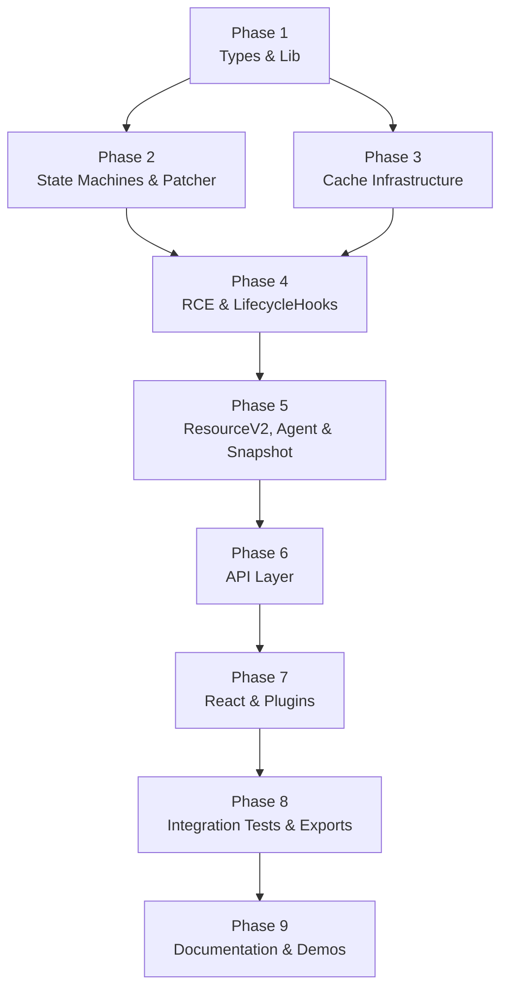

## Overview

Decomposes the approved design into 9 implementation phases following the strict 5-layer hierarchy (`lib/ → core/ → api/ → react/ → plugins/`) plus `types/` as a shared layer. Each phase creates concrete files in `src/query-v2/`, tests them, and leaves the project compilable. Total: ~64 new files, ~11 modified files, 137+ test cases.

## Phase Map

## Phase Summary

| Phase | Name | Layer(s) | Key Deliverables | Depends On | Parallelizable Tasks | Estimated Complexity |
|-------|------|----------|------------------|------------|---------------------|---------------------|
| 1 | Types & Lib | types/, lib/ | 9 type files + barrel, SKIP_TOKEN, stableStringify, 2 test files, module barrel | None | All type files parallel; lib files parallel | Medium |
| 2 | State Machines & Patcher | core/machines/ | Patcher, 5 machine classes, MachineWithData, Machine factory, 2 test files (~49 test cases) | Phase 1 | Patcher + MachineWithData first; then 5 machines parallel; Machine factory last | High |
| 3 | Cache Infrastructure | core/ | CacheEntry, SerializeCacheMap, CompareCacheMap, createCacheMap, 2 test files (~30 test cases) | Phase 1 | CacheEntry ∥ CacheMap implementations | Medium |
| 4 | RCE & LifecycleHooks | core/ | ResourceV2CacheEntry, LifecycleHooks, test helpers, 2 test files (~24 test cases) | Phases 2, 3 | LifecycleHooks ∥ RCE (after shared deps) | High |
| 5 | ResourceV2, Agent & Snapshot | core/ | ResourceV2, ResourceV2Agent, Snapshot, core barrel, 3 test files (~53 test cases) | Phase 4 | Agent partially ∥ ResourceV2 (after factory callback interface) | High |
| 6 | API Layer | api/ | createApi, createResourceV2 standalone, hydrateSnapshot, 1 test file (~11 test cases) | Phase 5 | createResourceV2 standalone ∥ hydrateSnapshot | Medium |
| 7 | React & Plugins | react/, plugins/ | useResourceV2Agent hook, ReactHooksPlugin, type-level tests, 3 test files (~21 test cases) | Phase 6 | Sequential: react → plugins | Medium |
| 8 | Integration Tests & Exports | cross-layer | 5 integration test files, edge cases, final barrel exports, src/index.ts update (~21 test cases) | Phase 7 | Integration test files parallel | Medium |
| 9 | Documentation & Demos | docs/, apps/ | v0.2 docs (3 files), v0.1 deprecation banners, migration guide, 3 demo updates | Phase 8 | v0.2 docs ∥ v0.1 banners ∥ demos | Low |

## Execution Rules

- Every phase must leave the project in a compilable state (`npm run ts-check` passes)
- Full verification command: `npm run check:all`
- The 5-layer hierarchy is strict: no upward or lateral cross-layer imports
- New code goes into `src/query-v2/` — never modify `src/query-v2-legacy/`
- Tests go alongside source files in `__tests__/` subdirectories
- Each phase must pass its own test suite before proceeding to the next
- `cacheLifetime: false` in all unit tests to prevent GC timer interference (except dedicated GC tests)
- Use the controllable-promise pattern for all async tests (no real network, no artificial delays)
- Barrel exports (`index.ts`) must be updated at each layer as files are added

## Next Steps

Proceeds to implementation after human review.

## Quality Review

**Review Round**: 5 (plan-reviewer full audit)

### Checklist

| # | Criterion | Status | Notes |
|---|-----------|--------|-------|
| 1 | Every design component mapped to task(s) | **PASS** | Full cross-reference below. All components from 8 design documents (01-architecture through 08-risks) mapped to plan tasks. 5-layer hierarchy, all 16 core types (§1–§16), all 19 ADRs, all 17 use cases, all 137+ test case IDs, all doc deliverables, and all risk mitigations requiring code artifacts are covered. |
| 2 | File paths concrete and verified | **PASS** | New `src/query-v2/` paths are expected (directory to be created). Verified existing paths against repo: `docs/query-v2/v0.1/` (4 files ✓), `docs/query-v2/README.md` (✓), `docs/migrations/query-v2.md` (✓), `apps/demos/src/examples/query-v2/` (3 tsx + index.ts ✓), `src/index.ts` line 9 (`export * as unstable_queryV2 from "./query-v2"` ✓), `src/query-v2-legacy/` (exists, untouched ✓). |
| 3 | Phase dependencies correct | **PASS** | P1→P2, P1→P3, P2→P4, P3→P4, P4→P5, P5→P6, P6→P7, P7→P8, P8→P9. No circular deps. P2∥P3 correctly independent (both need only P1). Mermaid `graph TB` in README matches phase file `Dependencies` sections exactly. |
| 4 | Verification criteria per phase | **PASS** | Every phase ends with a Verification section containing `npm run ts-check` + scoped vitest commands + layer-specific assertions (no upward imports, immutability, etc.). |
| 5 | Each phase leaves project compilable | **PASS** | Each phase creates/updates barrel `index.ts` at relevant layers. Phase 1 Task 1.15 creates `src/query-v2/index.ts` resolving the existing broken import at `src/index.ts:9`. |
| 6 | No vague tasks — exact files and changes | **PASS** | All 74 tasks (1.1–1.15, 2.1–2.11, 3.1–3.7, 4.1–4.5, 5.1–5.9, 6.1–6.6, 7.1–7.8, 8.1–8.8, 9.1–9.9) specify exact file paths, concrete type signatures, method lists, and implementation details. |
| 7 | Design traceability (`[ref: ...]`) on all tasks | **PASS** | All tasks include `[ref: ...]` annotations. Minor: Task 4.3 references `§10` (Snapshot types) instead of `§9`/`§9.1` (Lifecycle types) — see Issues #1. Does not affect implementation. |
| 8 | Parallel/sequential correctly marked | **PASS** | Each phase's Execution section clearly specifies ordering and parallelizable sub-groups. |
| 9 | Complexity estimates present (L/M/H) | **PASS** | All tasks include `**Complexity**: Low/Medium/High`. |
| 10 | Documentation tasks proportional to existing docs/demos | **PASS** | Phase 9 matches `07-docs.md` scope exactly: 3 new v0.2 docs, 4 deprecation banners, 1 doc index, 1 migration guide, 3 demo updates — proportional to existing `docs/query-v2/` (5 files) and `apps/demos/` (4 files). |
| 11 | Mermaid dependency graph present | **PASS** | `graph TB` in README with all 9 phases and correct edges. |
| 12 | Phase summary table complete | **PASS** | All columns filled for all 9 phases (Name, Layer, Deliverables, Dependencies, Parallelizable Tasks, Estimated Complexity). |

### Design Traceability — Full Cross-Reference

**01-architecture.md**: All layers (lib→core→api→react→plugins) mapped to phases P1–P7. All named components: MachineIdle–MachineRefreshing→T2.3–2.7, MachineWithData→T2.2, Patcher→T2.1, Machine factory→T2.8, CacheEntry→T3.1, SerializeCacheMap→T3.2, CompareCacheMap→T3.3, createCacheMap→T3.4, ResourceV2→T5.1, ResourceV2Agent→T5.2, ResourceV2CacheEntry→T4.2, LifecycleHooks→T4.3, Snapshot→T5.4, createApi→T6.1, createResourceV2→T6.2, hydrateSnapshot→T6.3, useResourceV2Agent→T7.1, ReactHooksPlugin→T7.3, SKIP→T1.10, stableStringify→T1.11. Public/internal boundaries→T8.7. Barrel exports at all layers→T1.9/1.12/2.9/3.5/5.3/5.5/6.4/7.2/7.4/8.7.

**02-dataflow.md**: §1 resource scenarios (initial fetch, SWR, cache hit, refetch, abort, error→retry, GC)→T4.2/T5.1/T5.2 + tests RE01–RE23, GC01–GC05. §2 snapshot→T5.4 + SN01–SN12. §3 plugins→T7.3/T7.6 + PL01–PL11. §4 state machine spec→T2.3–2.7 + SM01–SM36. §5 cache flows + optimistic patches→T3.1–3.4/T4.2/T2.1 + PA01–PA13. §6 reactive chain (getEntry$, Batcher, resetAll)→T5.1/T5.2 + RE19–RE23, AP05, INT10.

**03-model.md**: §1 SKIP→T1.10. §2 machine types→T1.1. §3 machine classes→T1.1/T2.1–2.8. §4 Patcher→T1.1/T2.1. §5 CacheEntry→T1.2/T3.1. §6 CacheMap→T1.2/T3.2–3.5. §7 ResourceV2→T1.3/T4.2/T5.1. §8 Agent + ArgsOrVoid→T1.4/T1.8/T5.2. §9 lifecycle types + class→T1.5/T4.3. §10 snapshot types→T1.6. §11 plugin types + ReactHooksPlugin→T1.7/T7.3. §12 factory signatures→T6.1–6.3. §13 React hook→T7.1. §14 type hierarchy→covered by impl. §15 visibility summary→T8.7. §16 stableStringify + Batcher→T1.11 / imported from signals.

**04-decisions.md**: ADR-1 (layering)→all phases. ADR-2 (immutable machines)→T2.2–2.7. ADR-3 (SWR)→T5.2, AG03–04. ADR-4 (CacheEntry inheritance)→T4.2. ADR-5 (GC refcount+timer)→T5.1, GC01–05. ADR-6 (consistency violation)→T2.1, PA10–11. ADR-7 (cache key serialization)→T1.11/T3.2. ADR-8 (snapshot bridge)→T5.4, SN01–12. ADR-9 (plugin augmentation)→T1.7/T7.3. ADR-10 (agent start)→T5.2. ADR-11 (getEntry$ reactive)→T5.1, RE20–23. ADR-12 (no structural sharing)→implicit in Patcher. ADR-13 (compare no snapshot)→T5.4, SN10. ADR-14 (CacheEntry.complete)→T4.2, RCE15. ADR-15 (V2 naming)→T6.1. ADR-16 (single API entry)→T6.1. ADR-17 (abort at entry)→T4.2. ADR-18 (agent independence)→T5.2. ADR-19 (CacheMap dual impl)→T3.2–3.4.

**05-usecases.md**: UC-1 through UC-14→covered by test cases (RE, AG, AP, RH, INT, SN, PL series). UC-15 (WebSocket onCacheEntryAdded)→T4.3+LH01–03. UC-16 (compare strategy non-serializable args)→T3.3+CM10–18. UC-17 (CacheMap factory mechanism)→T3.4+CM-F01–F05.

**06-testcases.md**: L01–L09→T1.13/T1.14. SM01–SM36→T2.11. PA01–PA13→T2.10. CE01–CE10→T3.6. CM-F01–F05+CM01–CM19→T3.7. RCE01–RCE15→T4.4. LH01–LH09→T4.5. RE01–RE23+GC01–GC05→T5.6. AG01–AG18→T5.7. SN01–SN12→T5.8. AP01–AP11→T6.5. RH01–RH10→T7.5. PL01–PL11→T7.6+T7.7. INT01–INT14→T8.1–8.5. E01–E10→T8.6.

**07-docs.md**: Existing updates (6 files)→T9.4/T9.5/T9.6. New v0.2 docs (3 files)→T9.1–9.3. Demo updates (3 files)→T9.7–9.9.

**08-risks.md**: R01 (machine state)→SM01–36. R02 (async races)→RE02/RE11/AG10/E06/E08. R03 (memory leaks)→RH04/GC01–05/CE05. R05 (Immer throws)→PA10–11/INT09. R08 (React tearing)→RH08. R09 (snapshot instability)→RH05. R10 (complexity)→layered phases. R13 (async timing)→controllable-promise pattern. R17 (cache growth)→GC tests/INT05–06. R19 (SWR bug)→AG03–04/INT02. R20 (Batcher exception)→E01.

### Documentation Proportionality

Phase 9 is proportional to `07-docs.md`:

- 3 new v0.2 docs (README, optimistic-updates, ssr) — matches design exactly
- 4 v0.1 deprecation banners (README, optimistic-updates, ssr, Внутриянка) — matches design exactly
- 1 docs index update (`docs/query-v2/README.md`) — matches design
- 1 migration guide update (`docs/migrations/query-v2.md`) — matches design
- 3 demo file updates (simple-resource, optimistic-patches, ssr-snapshot) — matches design

Existing `docs/query-v2/` has: `README.md`, `v0.1/` (4 files). Existing `apps/demos/src/examples/query-v2/` has: 3 `.tsx` files + `index.ts`. Plan creates a new `v0.2/` directory and touches all existing relevant files. Not over-specified or under-specified.

### Issues Found

1. ~~**Wrong design reference in Task 4.3**~~ — **FIXED in Redraft Round 5 (Phase 18)**. Task 4.3 now correctly references `[ref: ../02-design/03-model.md#§9, §9.1]`.

2. **Skipped test case IDs RE17 and AP07** — Task 5.6 enumerates RE01–RE16, RE18–RE23 (no RE17). Task 6.5 enumerates AP01–AP06, AP08–AP11 (no AP07). Per `02-design/06-testcases.md`: "RE17 and AP07 are reserved IDs (removed during prior design iterations). Remaining IDs are intentionally not renumbered to preserve cross-document reference stability." Not a coverage gap. — **Severity: Info** (by design).

### Review Summary

**Verdict**: Approved

All 12 checklist criteria pass. Full cross-reference of all 8 design documents confirms complete coverage: every named component, type, class, factory, hook, test case ID, ADR mandate, use case, documentation deliverable, and risk mitigation is mapped to at least one plan task. File paths verified against the actual repository. Phase dependencies are acyclic and correct. No functional issues remain.

**Prior review history (Rounds 1–5)**: 27 issues identified across rounds 1–3, all confirmed fixed through round 4. Round 5 verification audit found 16 issues (9 cross-consistency + 7 design adherence). All 16 fixed in Redraft Round 5 (Phases 18–19). This re-review (Phase 20) confirms all fixes and no regressions.

## Verification: Cross-Consistency

**Result**: PASS (0 inconsistencies, 0 duplicates)

**Review Round**: 6 (re-review after Redraft Round 5, Phases 18–19)

### Cross-Reference Matrix

Components appearing in multiple phase files and their consistency status:

| Component | Phases | Consistent? | Notes |
|-----------|--------|-------------|-------|
| `TPatch`, `IPatchHandle`, `CreatePatchResult` | P1, P2 | ✅ | P1 defines types, P2 uses them in Patcher/MachineWithData with matching signatures |
| `TMachineInstance`, `TMachineStatus` | P1, P2, P4, P5 | ✅ | Used consistently as union type and status literal |
| `ICacheEntry<TState>` | P1, P3, P4 | ✅ | P1 defines, P3 implements, P4 extends — generics and methods match |
| `ICacheMap<TArgs, TEntry>` | P1, P3, P5 | ✅ | P1 defines, P3 implements both strategies, P5 uses via factory |
| `TCacheMapFactory<TArgs, TEntry>` | P1, P3 | ✅ | `(args: TArgs) => TEntry` — consistent |
| `IResourceV2CacheEntry` | P1, P4, P5, P8 | ✅ | Public interface (`machine$`, `isMyArgs`, `createPatch`, `invalidate`, `query`) consistent across all references |
| `IResourceV2Agent` | P1, P5, P7 | ✅ | `state$`, `start()`, `compareArgs()` — consistent across type def, impl, and hook usage |
| `IResourceV2AgentState` | P1, P5, P7 | ✅ | All fields (status, data, error, args, isLoading, isInitialLoading, isRefreshing, isSuccess, isError, entry) match |
| `ResourceV2.getEntry()` | P1, P5 | ✅ | Two overloads: `getEntry(args) → null`, `getEntry(args, doInitiate: true) → non-null` — consistent between type def (T1.3) and impl (T5.1) |
| `ResourceV2.createAgent()` | P1, P5, P6, P7 | ✅ | Listed in T1.3 (`IResourceV2`), T5.1 (impl), T6.2 (standalone), T7.1 (hook usage) — consistent |
| `hydrateSnapshot` | P5, P6, P8 | ✅ | Core version (T5.4, `Map<string, ResourceV2>` param) is internal-only — NOT exported from barrel (T5.9). API version (T6.3, `IApi` param) is the sole public export (T6.6, T8.7). No collision. |
| `PluginAugmentations` type params | P1, P6, P7 | ✅ | 3-param form `PluginAugmentations<TPlugins, TArgs, TData>` used consistently: T1.7 (def), T6.1 (`<TPlugins, TArgs, TData>`), T7.3 (`<[ReactHooksPlugin], TArgs, TData>`), T7.7 (`<[ReactHooksPlugin], TArgs, TData>`) |
| `IPatchHandle` | P1, P2, P4, P9 | ✅ | `{ commit(): void; abort(): void }` only — no `undo()`. T9.2 uses `handle.abort()` + inverse patches for rollback. |
| `api.resources` property | P1, P6, P7 | ✅ | `IApi` has no `resources` property (T1.8, T6.1). T7.3 uses correct pattern: `todosResource = api.createResourceV2({...}); todosResource.useResourceV2Agent(args)` |
| Lifecycle hook tool names | P1, P4 | ✅ | T1.5 defines `$cacheDataLoaded`, `$cacheEntryRemoved`, `$queryFulfilled`, `getCacheEntry`. T4.3 uses matching method names: `fireCacheEntryAdded(args, entry)`, `fireQueryStarted(args, entry)`, `resolveDataLoaded`, `fireCacheEntryRemoved`, `resolveQueryFulfilled`, `clearAll` — all consistent with design §9.1 |
| `createApi`, `IApi<TPlugins>` | P1, P6 | ✅ | `createResourceV2()`, `resetAll()`, `getSnapshot()` — consistent |
| `useResourceV2Agent` | P7 | ✅ | Signature and behavior internally consistent. Uses `agent.start(args)`, `agent.state$` |
| `ReactHooksPlugin` | P7 | ✅ | Implements `IPlugin`, `augmentResource<TArgs, TData>(resource, options)` — consistent with P1 types |
| `Machine` factory | P2, P5 | ✅ | `Machine.idle()`, `Machine.fromSnapshot()` — consistent |
| `Patcher` | P2, P4, P5 | ✅ | Static methods and usage patterns match across all references |
| `MachineRefreshing.errorHappened` | P2, P5 | ✅ | ADR-2 preserved: returns MachineSuccess with stale data — consistent |
| `Snapshot` (getSnapshot) | P5, P6 | ✅ | P5 core impl, P6 api wrapper — signatures consistent per layer |
| `SKIP_TOKEN` | P1, P5, P7 | ✅ | Used consistently as agent disconnect signal |
| Phase dependencies (README vs files) | README, P1–P9 | ✅ | All match exactly |
| Module barrel `src/query-v2/index.ts` | P1, P5, P6, P7, P8 | ✅ | Incrementally expanded — no conflicting exports |

### Inconsistencies

All 9 inconsistencies from the previous review have been resolved in Redraft Round 5 (Phases 18–19):

1. ~~`api.resources.todos` phantom in P7 T7.3~~ — **FIXED**: T7.3 now uses `todosResource = api.createResourceV2({...}); todosResource.useResourceV2Agent(args)`
2. ~~`handle.undo()` in P9 T9.2~~ — **FIXED**: T9.2 now uses `handle.abort()` + inverse patches (`TPatch.inversePatches`) for rollback
3. ~~`ResourceV2.getEntry()` desc vs tests in P5~~ — **FIXED**: T5.1 now describes two overloads: `getEntry(args) → null`, `getEntry(args, doInitiate: true) → non-null`
4. ~~`createAgent()` missing from P5 T5.1~~ — **FIXED**: T5.1 now lists `createAgent(): ResourceV2Agent<TArgs, TData>` as a public method
5. ~~`hydrateSnapshot` dual export collision~~ — **FIXED**: T5.9 excludes core `hydrateSnapshot` from barrel; T6.6 and T8.7 export only API-layer version
6. ~~`PluginAugmentations` 1-param shorthand~~ — **FIXED**: T6.1, T7.3, T7.7 all use 3-param form `PluginAugmentations<TPlugins, TArgs, TData>`
7. ~~LifecycleHooks tool names in P4 vs P1~~ — **FIXED**: T4.3 now uses design §9.1 method names (`fireCacheEntryAdded`, `fireQueryStarted`, `resolveDataLoaded`, `fireCacheEntryRemoved`, `resolveQueryFulfilled`, `clearAll`) with correct parameters
8. ~~SN03 API-layer signature in core tests~~ — **FIXED**: T5.8 SN03 now uses core signature `hydrateSnapshot(resources: Map<string, ResourceV2>, snapshot)`
9. ~~Phase Summary "10 type files"~~ — **FIXED**: README Phase Summary now says "9 type files + barrel"

### Duplicates

No duplicate tasks found. All file create/modify operations are unique across phases. The module barrel `src/query-v2/index.ts` is incrementally modified in Phases 1, 5, 6, 7, and 8 — this is expected incremental development (each phase adds its layer's exports), not duplication.

## Verification: Design Adherence

**Result**: PASS (0 mismatches)

**Review Round**: 6 (re-review after Redraft Round 5, Phases 18–19)

### Per-Task Verification

| Phase | Task | File | Design Ref | Status | Notes |
|-------|------|------|------------|--------|-------|
| 1 | 1.1 | machine.types.ts | model §2, §3 | ✅ | `TPatch` no generic, `IPatchHandle` commit/abort only, `CreatePatchResult<TArgs, TData>`, all state types, `TMachineInstance`, `IMachineStatic` — all match |
| 1 | 1.2 | cache.types.ts | model §5, §6 | ✅ | `ICacheEntry<TState>` members (`state$`, `peek`, `set`, `complete`, `onClean$`, `obs`), `ICacheMap<TArgs, TEntry>` (8 methods), `TCacheMapFactory`, `ICacheMapOptions` — all match |
| 1 | 1.3 | resource.types.ts | model §7.1, §7.2b, §7.3 | ✅ | `TQueryFn`, `IResourceV2Options`, `IResourceV2CacheEntry` match. **`IResourceV2` now fully specified**: `createAgent()`, `query()`, `getEntry()` (2 overloads), `getEntry$()` (2 overloads), `invalidate()` — all with `ArgsOrVoid<TArgs>` rest-parameter ergonomics. Exact match with design §7.2b. |
| 1 | 1.4 | agent.types.ts | model §8.1 | ✅ | `IResourceV2AgentState` (11 fields), `IResourceV2Agent` with `state$`, `start()`, `compareArgs()`, no `signal`/`current`/`setArgs`/`destroy` — exact match |
| 1 | 1.5 | lifecycle.types.ts | model §9 | ✅ | `ICacheEntryAddedTools<TData>` (`$cacheDataLoaded`, `$cacheEntryRemoved`), `IQueryStartedTools<TArgs, TData>` (`$queryFulfilled`, `getCacheEntry`), callback types — exact match |
| 1 | 1.6 | snapshot.types.ts | model §10 | ✅ | `CURRENT_SNAPSHOT_VERSION = 1`, `TResourceV2SnapshotSlice<TData = unknown>` (no TArgs), `TResourceSnapshot`, `TApiSnapshot` — exact match |
| 1 | 1.7 | plugin.types.ts | model §11 | ✅ | `IPluginContext` no generics, `IPlugin` interface, `PluginResourceContributions<TPlugin, TArgs, TData>` (3 params), `PluginAugmentations<TPlugins, TArgs, TData>` (3 params), `IReactHooksPluginContributions` — match |
| 1 | 1.8 | shared.types.ts | model §8.2 | ✅ | `ArgsOrVoid`, `ArgsOrVoidOrSkip`, `Prettify`, `UnionToIntersection` — match |
| 1 | 1.8 | api.types.ts | model §12.1 | ✅ | `ICreateApiOptions<TPlugins>` (9 fields), `IApi<TPlugins>` with `createResourceV2()`, `resetAll()`, `getSnapshot()`, no `resources` property — exact match |
| 1 | 1.9 | types/index.ts | arch §2 | ✅ | Barrel — type-only re-exports |
| 1 | 1.10 | SKIP_TOKEN.ts | model §1 | ✅ | `SKIP: unique symbol`, `SKIP_TOKEN = typeof SKIP` — match |
| 1 | 1.11 | stableStringify.ts | model §16.1 | ✅ | Deterministic JSON, sorted keys — match |
| 1 | 1.12 | lib/index.ts | arch §2 | ✅ | Barrel |
| 1 | 1.13 | SKIP_TOKEN.test.ts | testcases L01 | ✅ | L01 covered |
| 1 | 1.14 | stableStringify.test.ts | testcases L02–L09 | ✅ | L02–L09 covered |
| 1 | 1.15 | query-v2/index.ts | arch §5 | ✅ | Module barrel — initial exports |
| 2 | 2.1 | Patcher.ts | model §4 | ✅ | `createPatch`, `resolvePatches`, `finishPatch`, `abortAllPending` — signatures and return types (`IPatchResolution`) exact match |
| 2 | 2.2 | MachineWithData.ts | model §3.1 | ✅ | Properties (`args`, `data`, `patchState`), `createPatch`, `finishPatch`, `abortAllPendingPatches`, `cloneWith` — exact match |
| 2 | 2.3 | MachineIdle.ts | model §3.1 | ✅ | `status: "idle"`, `args: null`, `start() → MachinePending`, `reset() → MachineIdle` |
| 2 | 2.4 | MachinePending.ts | model §3.1 | ✅ | `status: "pending"`, `successHappened → MachineSuccess`, `errorHappened → MachineError`, `reset → MachineIdle` |
| 2 | 2.5 | MachineSuccess.ts | model §3.1 | ✅ | Extends MachineWithData, `status: "success"`, `updatedAt`, `invalidate → MachineRefreshing`, `start → MachinePending`, `reset → MachineIdle` |
| 2 | 2.6 | MachineError.ts | model §3.1 | ✅ | `status: "error"`, `retry → MachinePending`, `start → MachinePending`, `reset → MachineIdle` |
| 2 | 2.7 | MachineRefreshing.ts | model §3.1 | ✅ | Extends MachineWithData, `successHappened → MachineSuccess` (with Patcher.resolvePatches), `errorHappened → MachineSuccess` (ADR-2), `reset → MachineIdle` |
| 2 | 2.8 | Machine.ts | model §3 | ✅ | `Machine.idle()`, `Machine.fromSnapshot()` — match |
| 2 | 2.9 | machines/index.ts | arch §2 | ✅ | Barrel |
| 2 | 2.10 | Patcher.test.ts | testcases PA01–PA13 | ✅ | All PA test IDs match |
| 2 | 2.11 | Machine.test.ts | testcases SM01–SM36 | ✅ | All SM test IDs match |
| 3 | 3.1 | CacheEntry.ts | model §5 | ✅ | Implements `ICacheEntry<TState>`, `_signal$`, `_isCompleted`, all methods, `onClean$`, `obs` — exact match |
| 3 | 3.2 | SerializeCacheMap.ts | model §6.3 | ✅ | `Map<string, TEntry>`, `factory(args)` on getOrCreate, `stableStringify` default — match |
| 3 | 3.3 | CompareCacheMap.ts | model §6.3 | ✅ | `Array<{args, entry}>`, linear scan, `shallowEqual` default — match |
| 3 | 3.4 | createCacheMap.ts | model §6.3 | ✅ | Strategy selection based on `keyStrategy` — match |
| 3 | 3.5 | CacheMap/index.ts | arch §2 | ✅ | Barrel |
| 3 | 3.6 | CacheEntry.test.ts | testcases CE01–CE10 | ✅ | All CE test IDs match |
| 3 | 3.7 | CacheMap.test.ts | testcases CM-F01–F05, CM01–CM19 | ✅ | All CM test IDs match |
| 4 | 4.1 | controllable-promise.ts | testcases test-tools | ✅ | Test utility — no design type spec |
| 4 | 4.2 | ResourceV2CacheEntry.ts | model §7.3 | ✅ | Extends `CacheEntry<TMachineInstance<TArgs, TData>>`, private fields match (`_patchState`, `_args`, `_queryFn`, `_abortController`, `_inflightPromise`), public: `machine$`, `isMyArgs`, `createPatch`, `invalidate`, `query` — exact match |
| 4 | 4.3 | LifecycleHooks.ts | model §9, §9.1 | ✅ | **FIXED**: Six methods matching design §9.1: `fireCacheEntryAdded(args, entry)`, `fireQueryStarted(args, entry)`, `resolveDataLoaded(args, data)`, `fireCacheEntryRemoved(args)`, `resolveQueryFulfilled(args, result)`, `clearAll()`. Tool names match P1: `$cacheDataLoaded`, `$cacheEntryRemoved`, `$queryFulfilled`, `getCacheEntry`. |
| 4 | 4.4 | ResourceV2CacheEntry.test.ts | testcases RCE01–RCE15 | ✅ | All RCE test IDs match |
| 4 | 4.5 | LifecycleHooks.test.ts | testcases LH01–LH09 | ✅ | All LH test IDs match |
| 5 | 5.1 | ResourceV2.ts | model §7.2a, §7.2b | ✅ | **FIXED**: `createAgent()` listed as public method. `getEntry()` has two overloads: returns null / `doInitiate: true` forces creation. `getEntry$()` also has two overloads. `resetCache()` is internal (called by createApi's `resetAll()`). All match design §7.2a/b. |
| 5 | 5.2 | ResourceV2Agent.ts | model §8.1, §8 concrete | ✅ | Constructor callbacks, `start()` overloads, `state$: ComputeFn`, `compareArgs`, `_tracking$`, no direct ResourceV2 dependency — exact match |
| 5 | 5.3 | Resource/index.ts | arch §2 | ✅ | Barrel |
| 5 | 5.4 | Snapshot.ts | model §10, §12 | ✅ | **FIXED**: Ref annotation now correctly uses `§10` (Snapshot Types). Core-level signatures are internal implementations. |
| 5 | 5.5 | core/index.ts | arch §2 | ✅ | Barrel |
| 5 | 5.6 | ResourceV2.test.ts | testcases RE01–RE23, GC01–GC05 | ✅ | All test IDs match (RE17 reserved per design — not a gap) |
| 5 | 5.7 | ResourceV2Agent.test.ts | testcases AG01–AG18 | ✅ | All AG test IDs match |
| 5 | 5.8 | Snapshot.test.ts | testcases SN01–SN12 | ✅ | **FIXED**: SN03 uses core signature `hydrateSnapshot(resources: Map<string, ResourceV2>, snapshot)` |
| 5 | 5.9 | query-v2/index.ts (modify) | arch §5 | ✅ | Incremental barrel expansion — core `hydrateSnapshot` excluded (internal-only) |
| 6 | 6.1 | createApi.ts | model §12.1 | ✅ | **FIXED**: Uses `PluginAugmentations<TPlugins, TArgs, TData>` (3 params). Signature and behavior match design §12.1. |
| 6 | 6.2 | createResourceV2.ts | model §12.2 | ✅ | Standalone factory signature matches |
| 6 | 6.3 | hydrateSnapshot.ts | model §12.3 | ✅ | `hydrateSnapshot(api: IApi, snapshot: TApiSnapshot): void` — exact match |
| 6 | 6.4 | api/index.ts | arch §2 | ✅ | Barrel |
| 6 | 6.5 | createApi.test.ts | testcases AP01–AP11 | ✅ | All AP test IDs match (AP07 reserved per design — not a gap) |
| 6 | 6.6 | query-v2/index.ts (modify) | arch §5 | ✅ | **FIXED**: Exports only API-layer `hydrateSnapshot` — core version stays internal. No naming collision. |
| 7 | 7.1 | useResourceV2Agent.ts | model §13 | ✅ | Signature matches, uses `agent.start(args)`, `agent.state$`, `useSyncExternalStore`, `resource.createAgent()`, no `destroy()` — exact match |
| 7 | 7.2 | react/index.ts | arch §2 | ✅ | Barrel |
| 7 | 7.3 | ReactHooksPlugin.ts | model §11.1 | ✅ | **FIXED**: Method is `augmentResource<TArgs, TData>(resource, options)` (2 params, generic). Uses correct pattern `todosResource = api.createResourceV2({...}); todosResource.useResourceV2Agent(args)`. `PluginAugmentations<[ReactHooksPlugin], TArgs, TData>` (3 params). |
| 7 | 7.4 | plugins/index.ts | arch §2 | ✅ | Barrel |
| 7 | 7.5 | useResourceV2Agent.test.ts | testcases RH01–RH10 | ✅ | All RH test IDs match |
| 7 | 7.6 | ReactHooksPlugin.test.ts | testcases PL01–PL11 | ✅ | PL01–PL08, PL11 match |
| 7 | 7.7 | ReactHooksPlugin.test-d.ts | testcases PL09–PL10 | ✅ | **FIXED**: PL09 uses `PluginAugmentations<[ReactHooksPlugin], TArgs, TData>` (3 params) |
| 7 | 7.8 | query-v2/index.ts (modify) | arch §5 | ✅ | Incremental barrel expansion |
| 8 | 8.1 | query-flow.test.ts | testcases INT01, INT02, INT12 | ✅ | Match |
| 8 | 8.2 | gc-lifecycle.test.ts | testcases INT05, INT06 | ✅ | Match |
| 8 | 8.3 | optimistic-updates.test.ts | testcases INT07–INT09 | ✅ | Match |
| 8 | 8.4 | reset-and-multi-agent.test.ts | testcases INT10, INT11 | ✅ | Match |
| 8 | 8.5 | plugins-and-snapshot.test.ts | testcases INT03, INT04, INT13, INT14 | ✅ | Match |
| 8 | 8.6 | edge-cases.test.ts | testcases E01–E10 | ✅ | Match |
| 8 | 8.7 | query-v2/index.ts (modify) | arch §5 | ✅ | **FIXED**: Final barrel — no dual `hydrateSnapshot`. Core version internal-only. |
| 8 | 8.8 | src/index.ts (modify) | arch §5 | ✅ | `unstable_queryV2` export update |
| 9 | 9.2 | optimistic-updates.md | docs + model §3 | ✅ | **FIXED**: No phantom `handle.undo()`. Uses `handle.abort()` + inverse patches (`TPatch.inversePatches`) for rollback. |

### Mismatches

All 7 mismatches from the previous review have been resolved in Redraft Round 5 (Phases 18–19):

1. ~~Task 1.3 — `IResourceV2` members not specified~~ — **FIXED**: All 5 public methods now listed with full signatures matching §7.2b
2. ~~Task 4.3 — LifecycleHooks method names differ~~ — **FIXED**: 6 methods matching §9.1 with correct names and parameters
3. ~~Task 5.1 — Missing `createAgent()` and incorrect `getEntry()`~~ — **FIXED**: `createAgent()` added, `getEntry()` uses two-overload semantics
4. ~~Task 7.3 — `augment(resource)` and phantom `api.resources.todos`~~ — **FIXED**: `augmentResource(resource, options)`, correct usage pattern
5. ~~Task 9.2 — Phantom `handle.undo()`~~ — **FIXED**: Uses `handle.abort()` + inverse patches
6. ~~Task 5.4 — Wrong `[ref:]` annotation~~ — **FIXED**: Now references §10 (Snapshot Types)
7. ~~Tasks 6.1, 7.3, 7.7 — `PluginAugmentations` 1-param~~ — **FIXED**: All use 3-param form

## Verification Summary

| Dimension | Result | Issues |
|-----------|--------|--------|
| Completeness (Quality Review §Traceability) | PASS | 0 gaps (all design components mapped) |
| Cross-Consistency | PASS | 0 inconsistencies (9 fixed) |
| Design Adherence | PASS | 0 mismatches (7 fixed) |

**Overall**: PASS

All 16 issues from the Round 5 verification audit (9 cross-consistency + 7 design adherence) have been resolved in Redraft Round 5 (Phases 18–19). No regressions from Rounds 1–4. The plan is fully consistent with the design model and ready for implementation.

**Spot-check — Rounds 1–4 regression check**: Verified the following previously-fixed items remain intact: TPatch no generic (T1.1), ICacheEntry<TState> (T1.2), ICacheMap<TArgs, TEntry> (T1.2), IResourceV2Agent state$/start/compareArgs (T1.4), TResourceV2SnapshotSlice<TData> no TArgs (T1.6), IPluginContext no generics (T1.7), RCE extends CacheEntry<TMachineInstance> (T4.2), ResourceV2 uses resetCache() (T5.1), useResourceV2Agent uses agent.start/state$ (T7.1). All intact — no regressions.
