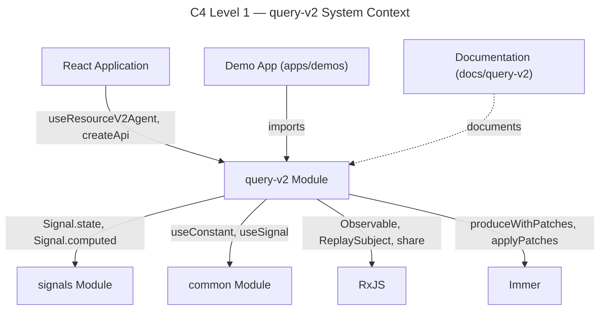
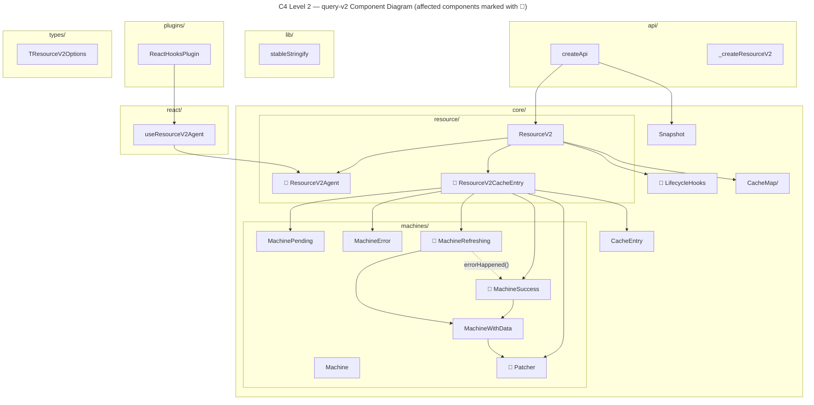
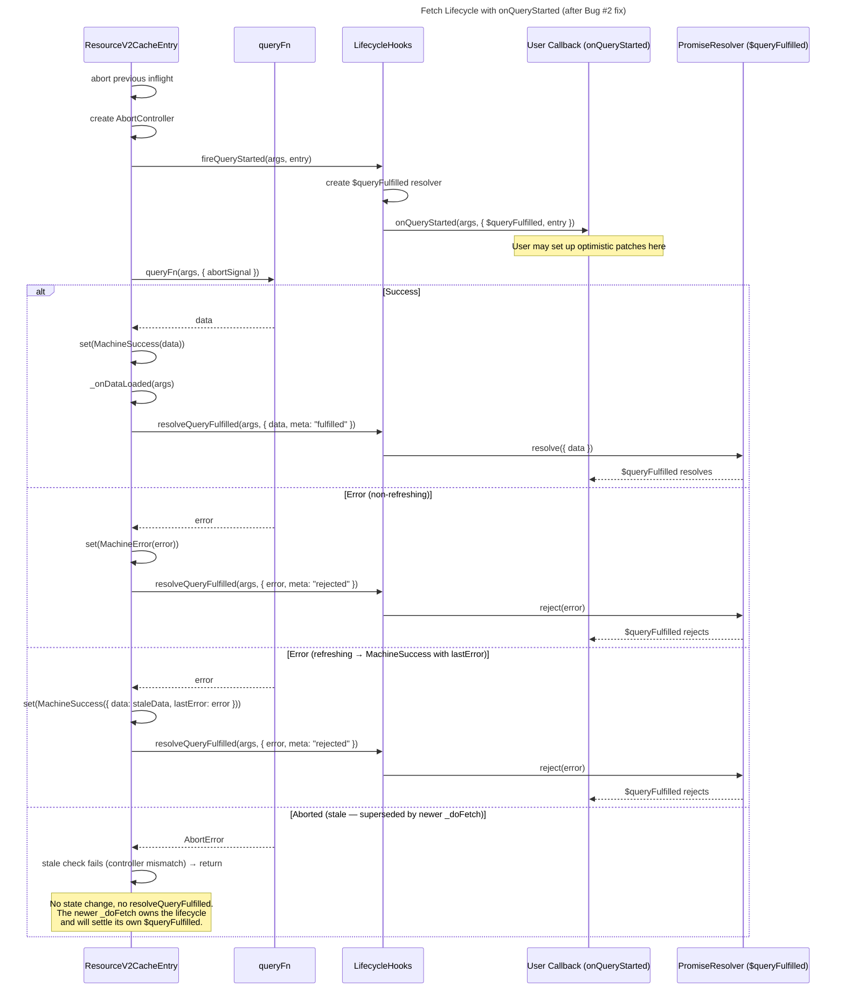
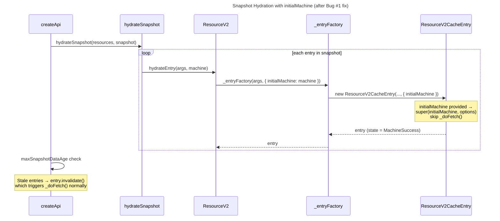
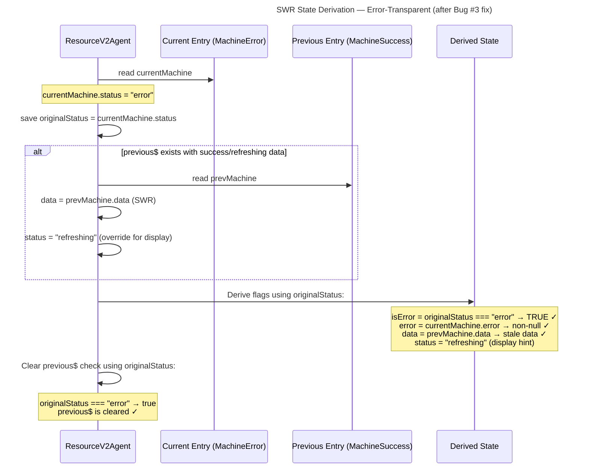
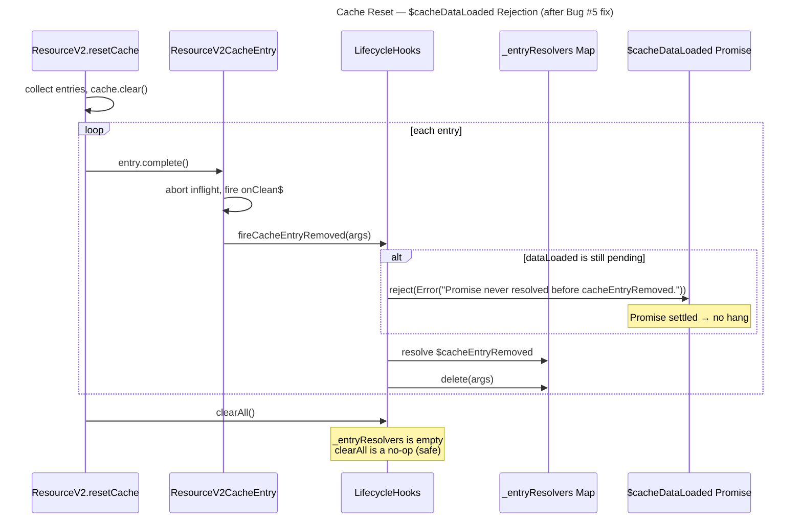
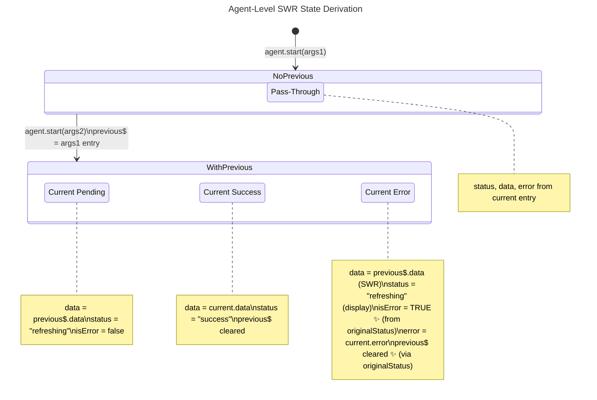
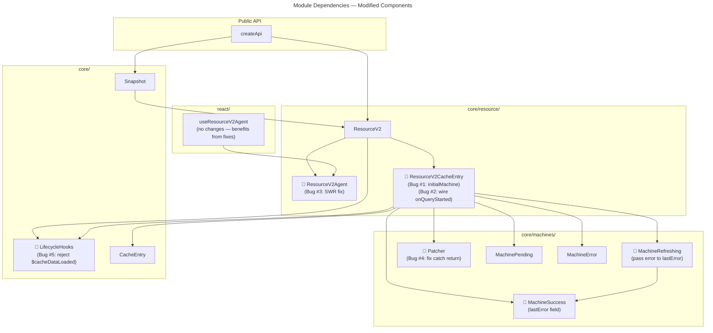

# System Architecture

## 1. C4 Container Diagram — query-v2 Module Context

The query-v2 module sits within the `rx-toolkit` monorepo alongside `signals`, `common`, and `query` (v1). It depends on `signals` for reactive state and `common` for shared React utilities.



## 2. C4 Component Diagram — query-v2 Internal Architecture

Shows all internal modules of query-v2 with the components affected by bug fixes highlighted.



## 3. Module Responsibility Zones

| Module | Responsibility | Files Affected by This Task |
|--------|---------------|----------------------------|
| `api/` | Public factories (`createApi`, `_createResourceV2`), snapshot hydration orchestration | None directly (hydration flows through `ResourceV2.hydrateEntry`) |
| `core/resource/` | Core query lifecycle: entry management, SWR agent, cache orchestration | `ResourceV2CacheEntry.ts` (Bugs #1, #2), `ResourceV2Agent.ts` (Bug #3) |
| `core/machines/` | Immutable state machines, Immer-based patching | `MachineSuccess.ts` (Enhancement: `lastError`), `MachineRefreshing.ts` (feeds `lastError`), `Patcher.ts` (Bug #4) |
| `core/` (root) | Lifecycle hooks, cache entry base, snapshot logic | `LifecycleHooks.ts` (Bug #5) |
| `lib/` | Utilities (stableStringify, SKIP_TOKEN) | None |
| `react/` | React hooks (`useResourceV2Agent`) | None (consumes agent state — benefits from Bug #3 fix transparently) |
| `plugins/` | Plugin system (`ReactHooksPlugin`) | None |
| `types/` | TypeScript type definitions | `TResourceV2Options` may need `initialMachine` addition for Bug #1 |

## 4. Component Boundaries per Fix Area

### Fix Area 1: Snapshot Fetch Bypass (Bug #1) + onQueryStarted Wiring (Bug #2)

Both bugs share `ResourceV2CacheEntry` as the primary modification target. They are designed together because Bug #1 modifies the constructor path and Bug #2 modifies `_doFetch` — complementary, non-overlapping changes within the same class.

[ref: ../01-research/05-open-questions.md#Q6]

**Files modified:**

| File | Change | Bug |
|------|--------|-----|
| `@/query-v2/core/resource/ResourceV2CacheEntry.ts` | Add `initialMachine?` constructor option; skip `_doFetch` when provided | #1 |
| `@/query-v2/core/resource/ResourceV2CacheEntry.ts` | Wire `fireQueryStarted`/`resolveQueryFulfilled` into `_doFetch` | #2 |
| `@/query-v2/core/resource/ResourceV2.ts` | Update `_entryFactory` to accept and pass `initialMachine`; update `hydrateEntry` to pass snapshot machine | #1 |
| `@/query-v2/core/LifecycleHooks.ts` | No structural change — `fireQueryStarted`/`resolveQueryFulfilled` already implemented | #2 |

**Component interaction:**

```mermaid
---
title: "Fix Area 1 — Component Boundaries"
---
graph LR
    Snapshot["Snapshot.hydrateSnapshot"]
    ResourceV2["ResourceV2.hydrateEntry"]
    EntryFactory["ResourceV2._entryFactory"]
    CacheEntry["ResourceV2CacheEntry"]
    DoFetch["ResourceV2CacheEntry._doFetch"]
    LCHooks["LifecycleHooks"]

    Snapshot -->|"hydrateEntry(args, machine)"| ResourceV2
    ResourceV2 -->|"_entryFactory(args, initialMachine)"| EntryFactory
    EntryFactory -->|"new ResourceV2CacheEntry(..., initialMachine)"| CacheEntry
    CacheEntry -->|"if no initialMachine"| DoFetch
    DoFetch -->|"fireQueryStarted(args, entry)"| LCHooks
    DoFetch -->|"resolveQueryFulfilled(args, result)"| LCHooks
```



### Fix Area 2: SWR Error Masking (Bug #3)

Isolated in `ResourceV2Agent._deriveState$`. No other components are modified.

[ref: ../01-research/03-problem-analysis-part1.md#Bug #3]

**Files modified:**

| File | Change |
|------|--------|
| `@/query-v2/core/resource/ResourceV2Agent.ts` | Derive `isError` from `currentMachine.status` before SWR override; use `currentMachine.status` for `previous$` clearing condition |

### Fix Area 3: Patcher Consistency Violation (Bug #4)

Isolated in `Patcher.resolvePatches` catch block. No caller changes needed — existing `_finishPatch` detection via `patchState?.isConsistencyViolation` will work unmodified.

[ref: ../01-research/04-problem-analysis-part2.md#Bug #4]

**Files modified:**

| File | Change |
|------|--------|
| `@/query-v2/core/machines/Patcher.ts` | Catch block returns `{ data: currentData, patchState: { patches: [], isConsistencyViolation: true } }` instead of `{ data: currentData, patchState: null }` |

### Fix Area 4: $cacheDataLoaded Hang (Bug #5)

Isolated in `LifecycleHooks.fireCacheEntryRemoved`. Covers both `resetCache` and GC-triggered removal paths.

[ref: ../01-research/04-problem-analysis-part2.md#Bug #5]
[ref: ../01-research/05-open-questions.md#Q12]

**Files modified:**

| File | Change |
|------|--------|
| `@/query-v2/core/LifecycleHooks.ts` | In `fireCacheEntryRemoved`, before deleting resolver entry: check if `dataLoaded` is pending, reject with `Error("Promise never resolved before cacheEntryRemoved.")` |

### Fix Area 5: MachineSuccess lastError (Enhancement)

Extends the machine type system. `MachineRefreshing.errorHappened()` passes the error to `MachineSuccess` instead of discarding it.

[ref: ../01-research/05-open-questions.md#Q10]

**Files modified:**

| File | Change |
|------|--------|
| `@/query-v2/core/machines/MachineSuccess.ts` | Add optional `lastError?: unknown` field (defaults to `undefined`) |
| `@/query-v2/core/machines/MachineRefreshing.ts` | `errorHappened(error)` passes `error` to new `MachineSuccess({ ..., lastError: error })` |
| `@/query-v2/types/` | Update relevant type definitions if `TMachineInstance` union is explicitly typed |

### Fix Area 6: Docs & Examples

[ref: ../01-research/05-open-questions.md#Q7]
[ref: ../01-research/05-open-questions.md#Q9]

**Files modified:**

| File | Change |
|------|--------|
| `@/docs/query-v2/README.md` | Fix MachineIdle → MachinePending reference; update onQueryStarted docs after Bug #2 fix |
| `@/docs/query-v2/optimistic-updates.md` | Update onQueryStarted examples to reflect wired-in behavior |
| `@/docs/query-v2/devtools.md` | Add note about outdated options references |
| `@/apps/demos/src/examples/query-v2/` | Add 4–5 new examples: basic-query, error-swr-states, skip-token, snapshot-hydration |

## 5. Sequence Diagram — Fetch Lifecycle with onQueryStarted (Bug #2 Fix)

Shows the complete `_doFetch` lifecycle after wiring in `fireQueryStarted` and `resolveQueryFulfilled`.



## 6. Sequence Diagram — Snapshot Hydration (Bug #1 Fix)

Shows how `initialMachine` prevents the spurious fetch during snapshot hydration.



## 7. Sequence Diagram — SWR State Derivation (Bug #3 Fix)

Shows the corrected `_deriveState$` flow where `isError` reflects the true error state and `previous$` is properly cleared.



## 8. Sequence Diagram — Cache Reset with Promise Rejection (Bug #5 Fix)

Shows the corrected flow where `$cacheDataLoaded` is rejected in `fireCacheEntryRemoved` before deleting the resolver.



## 9. State Diagram — Machine States with lastError Extension

Shows the complete machine state model including the new `lastError` field on `MachineSuccess`.

```mermaid
---
title: "Machine States — with lastError Extension"
---
stateDiagram-v2
    [*] --> MachinePending: new entry created

    MachinePending --> MachineSuccess: queryFn resolves
    MachinePending --> MachineError: queryFn rejects

    MachineSuccess --> MachineRefreshing: invalidate() / refetch
    MachineSuccess --> [*]: entry.complete()

    MachineRefreshing --> MachineSuccess: queryFn resolves\n(lastError = undefined)
    MachineRefreshing --> MachineSuccess_WithLastError: queryFn rejects\n(lastError = error) ✨ NEW
    MachineRefreshing --> [*]: entry.complete() / abort

    MachineSuccess_WithLastError --> MachineRefreshing: invalidate() / refetch
    MachineSuccess_WithLastError --> [*]: entry.complete()

    MachineError --> MachinePending: retry / refetch
    MachineError --> [*]: entry.complete()

    state MachineSuccess {
        data: TData
        error: null
        updatedAt: number
        lastError?: unknown
        ---
        status = "success"
    }

    state MachineSuccess_WithLastError {
        data: TData (stale)
        error: null
        updatedAt: number (original)
        lastError: unknown ✨
        ---
        status = "success"
    }

    state MachineRefreshing {
        data: TData
        error: null
        updatedAt: number
        ---
        status = "refreshing"
    }
```

**Key design notes for `lastError`:**

- `MachineSuccess.lastError` is `unknown | undefined`. `undefined` means no refetch error occurred; non-undefined means the last same-args refetch failed but stale data is preserved. [ref: ../01-research/05-open-questions.md#Q10]
- `MachineSuccess.error` remains `null` (the formal `error` field). `lastError` is a supplementary field, not a replacement. This preserves the invariant that `MachineSuccess` always has `error === null`.
- `MachineRefreshing.errorHappened(error)` currently returns `new MachineSuccess({ data: this.data, updatedAt: this.updatedAt })`. After the fix, it returns `new MachineSuccess({ data: this.data, updatedAt: this.updatedAt, lastError: error })`. [ref: ../01-research/01-codebase-analysis.md#6. Machine States]
- A successful refetch clears `lastError` by constructing `MachineSuccess` without it (defaults to `undefined`).
- At the agent level, `_deriveState$` can expose `lastError` from the current machine to the derived state, enabling consumers to show "data is stale due to refetch error" banners.

## 10. State Diagram — Agent-Level SWR with Error Transparency

Shows how the agent-level state derivation handles cross-args SWR after Bug #3 fix.



## 11. Module Dependency Diagram

Shows the dependency graph focused on the modified components.



## 12. Interface Design — Key Modified Interfaces

### ResourceV2CacheEntry Constructor Extension (Bug #1)

```typescript
// Before:
constructor(args: TArgs, options: TResourceV2CacheEntryOptions<TData, TArgs>)
// After:
constructor(args: TArgs, options: TResourceV2CacheEntryOptions<TData, TArgs> & {
  initialMachine?: TMachineInstance<TData, TArgs>;
})
```

When `initialMachine` is provided:
- `super(initialMachine, options)` instead of `super(new MachinePending(args), options)`
- Skip `this._doFetch().catch(() => {})`

[ref: ../01-research/03-problem-analysis-part1.md#Bug #1]

### _doFetch Lifecycle Extension (Bug #2)

```typescript
// Conceptual — calls added to _doFetch:
async _doFetch(): Promise<void> {
  // ... abort handling ...
  this._lifecycleHooks.fireQueryStarted(this._args, this);  // NEW
  try {
    const data = await this._queryFn(args, { abortSignal });
    // ... success handling ...
    this._lifecycleHooks.resolveQueryFulfilled(this._args, { data, meta: "fulfilled" }); // NEW
  } catch (error) {
    // ... error handling ...
    this._lifecycleHooks.resolveQueryFulfilled(this._args, { error, meta: "rejected" }); // NEW
  }
}
```

Note: `_doFetch` needs access to `_lifecycleHooks`. Currently `ResourceV2CacheEntry` does not hold a reference to `LifecycleHooks` — it is held by `ResourceV2`. The design must either:
- (a) Pass `lifecycleHooks` (or callback wrappers) into `ResourceV2CacheEntry` constructor options, or
- (b) Have `ResourceV2` wrap `_doFetch` externally.

Option (a) is preferred — pass `fireQueryStarted` and `resolveQueryFulfilled` as callback options, mirroring the existing `onDataLoaded` pattern already used in `ResourceV2CacheEntry`.

[ref: ../01-research/01-codebase-analysis.md#5. ResourceV2CacheEntry]

### MachineSuccess.lastError (Enhancement)

```typescript
// MachineSuccess — extended
class MachineSuccess<TData, TArgs> extends MachineWithData<TData, TArgs> {
  readonly status = "success" as const;
  readonly error = null;
  readonly lastError?: unknown;  // NEW — undefined = no refetch error
  readonly updatedAt: number;
}
```

[ref: ../01-research/05-open-questions.md#Q10]

### Patcher.resolvePatches Catch Return (Bug #4)

```typescript
// Before (catch block):
return { data: currentData, patchState: null };

// After (catch block):
return {
  data: currentData,
  patchState: { patches: [], isConsistencyViolation: true }
};
```

[ref: ../01-research/04-problem-analysis-part2.md#Bug #4]

### LifecycleHooks.fireCacheEntryRemoved Extension (Bug #5)

```typescript
// Before:
fireCacheEntryRemoved(args: TArgs): void {
  const resolvers = this._entryResolvers.get(args);
  if (resolvers) {
    resolvers.entryRemoved.resolve();
    this._entryResolvers.delete(args);
  }
}

// After:
fireCacheEntryRemoved(args: TArgs): void {
  const resolvers = this._entryResolvers.get(args);
  if (resolvers) {
    if (!resolvers.dataLoaded.isSettled) {  // NEW
      resolvers.dataLoaded.reject(
        new Error("Promise never resolved before cacheEntryRemoved.")
      );
    }
    resolvers.entryRemoved.resolve();
    this._entryResolvers.delete(args);
  }
}
```

Note: `PromiseResolver` must expose an `isSettled` property (or the check can use a try/catch pattern). Verify `@/common/utils/PromiseResolver.ts` — if it doesn't have settlement tracking, a minimal addition is needed.

[ref: ../01-research/02-external-research.md#5. Cache Reset and Pending Promises]
[ref: ../01-research/04-problem-analysis-part2.md#Bug #5]

## 13. Integration Points Summary

| Fix | Primary Component | Integration Points | Downstream Effect |
|-----|-------------------|-------------------|-------------------|
| Bug #1 | `ResourceV2CacheEntry` constructor | `ResourceV2._entryFactory`, `ResourceV2.hydrateEntry` | Hydrated entries skip fetch; age-based invalidation still triggers fetch normally |
| Bug #2 | `ResourceV2CacheEntry._doFetch` | `LifecycleHooks.fireQueryStarted`, `LifecycleHooks.resolveQueryFulfilled` | `onQueryStarted` callbacks receive `$queryFulfilled`; optimistic update docs become functional |
| Bug #3 | `ResourceV2Agent._deriveState$` | None (isolated) | `useResourceV2Agent` consumers see correct `isError: true` with stale data |
| Bug #4 | `Patcher.resolvePatches` | `ResourceV2CacheEntry._finishPatch` (no change needed) | Commit-path violations detected → `invalidate()` triggers refetch |
| Bug #5 | `LifecycleHooks.fireCacheEntryRemoved` | Possibly `PromiseResolver` (add `isSettled`) | `$cacheDataLoaded` rejects on both `resetCache` and GC removal |
| Enhancement | `MachineSuccess`, `MachineRefreshing` | `ResourceV2Agent._deriveState$` (expose `lastError`) | Consumers see refetch errors on same-args SWR |

## 14. Open Research Questions Addressed

All 12 open questions from research are addressed in this design:

| Question | Resolution | Design Impact |
|----------|-----------|---------------|
| Q1 | Wire in `_doFetch` | §5, §12 — `_doFetch` sequence + interface |
| Q2 | Error-transparent SWR | §7, §10 — `_deriveState$` fix |
| Q3 | `initialMachine` lazy fetch | §6, §12 — constructor extension |
| Q4 | Fix catch return | §12 — Patcher catch block |
| Q5 | Reject in `fireCacheEntryRemoved` | §8, §12 — LifecycleHooks extension |
| Q6 | Fix independently, #1+#2 together | §4 — Fix Area 1 groups both |
| Q7 | Incremental + targeted additions | §4 Fix Area 6 |
| Q8 | Defer (brief README note) | Out of scope per `00-short-design.md` |
| Q9 | Minimal 4–5 examples | §4 Fix Area 6 |
| Q10 | Add `lastError` to `MachineSuccess` | §9, §12 — machine extension |
| Q11 | Mandatory regression tests | §4 — each fix area has test scope |
| Q12 | Auto-covered by Q5 fix | §8 — GC path uses same `fireCacheEntryRemoved` |

[ref: ../01-research/05-open-questions.md]
