# Data Flow

This document details the data flow for five key scenarios affected by the bug fixes and the `lastError` enhancement. Each scenario includes sequence diagrams showing the message flow, state transition diagrams for machine states, and data flow diagrams showing signal/observable propagation.

All flows reference the **post-fix** design unless explicitly contrasted with the current (buggy) behavior.

---

## 1. Snapshot Hydration Flow

### Scenario

`createApi({ initialSnapshot })` hydrates entries from a snapshot. After Bug #1 fix, entries constructed with `initialMachine` skip `_doFetch()`, starting directly in `MachineSuccess` state. Stale entries (exceeding `maxSnapshotDataAge`) are subsequently invalidated, which triggers `_doFetch` through the normal `invalidate()` path.

[ref: ../01-research/03-problem-analysis-part1.md#Bug #1]
[ref: ../01-research/01-codebase-analysis.md#8. Snapshot]

### Sequence Diagram — Snapshot Hydration (Post-Fix)

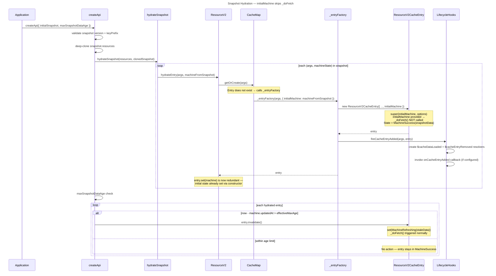
```mermaid
---
title: "Snapshot Hydration — initialMachine skips _doFetch"
---
sequenceDiagram
    participant App as Application
    participant API as createApi
    participant Snap as hydrateSnapshot
    participant Res as ResourceV2
    participant CM as CacheMap
    participant Factory as _entryFactory
    participant CE as ResourceV2CacheEntry
    participant LH as LifecycleHooks

    App->>API: createApi({ initialSnapshot, maxSnapshotDataAge })
    API->>API: validate snapshot version + keyPrefix
    API->>API: deep-clone snapshot.resources

    API->>Snap: hydrateSnapshot(resources, clonedSnapshot)

    loop each (args, machineState) in snapshot
        Snap->>Res: hydrateEntry(args, machineFromSnapshot)
        Res->>CM: getOrCreate(args)
        Note over CM: Entry does not exist → calls _entryFactory

        CM->>Factory: _entryFactory(args, { initialMachine: machineFromSnapshot })
        Factory->>CE: new ResourceV2CacheEntry({ ..., initialMachine })
        Note over CE: super(initialMachine, options)<br/>initialMachine provided →<br/>_doFetch() NOT called<br/>State = MachineSuccess(snapshotData)

        CE-->>Factory: entry
        Factory->>LH: fireCacheEntryAdded(args, entry)
        LH->>LH: create $cacheDataLoaded + $cacheEntryRemoved resolvers
        LH->>LH: invoke onCacheEntryAdded callback (if configured)
        Factory-->>Res: entry

        Note over Res: entry.set(machine) is now redundant —<br/>initial state already set via constructor
    end

    API->>API: maxSnapshotDataAge check
    loop each hydrated entry
        alt now - machine.updatedAt > effectiveMaxAge
            API->>CE: entry.invalidate()
            Note over CE: set(MachineRefreshing(staleData))<br/>_doFetch() triggered normally
        else within age limit
            Note over CE: No action — entry stays in MachineSuccess
        end
    end
```

### Lifecycle Comparison: Normal vs Hydrated Entry

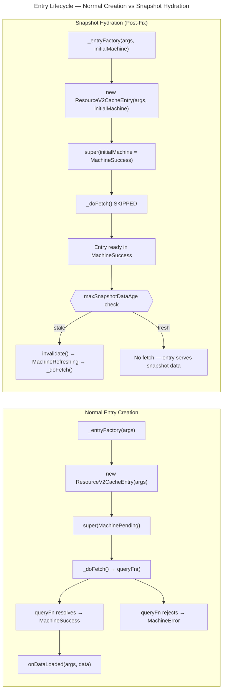
```mermaid
---
title: "Entry Lifecycle — Normal Creation vs Snapshot Hydration"
---
flowchart LR
    subgraph Normal["Normal Entry Creation"]
        N1["_entryFactory(args)"] --> N2["new ResourceV2CacheEntry(args)"]
        N2 --> N3["super(MachinePending)"]
        N3 --> N4["_doFetch() → queryFn()"]
        N4 --> N5["queryFn resolves → MachineSuccess"]
        N4 --> N6["queryFn rejects → MachineError"]
        N5 --> N7["onDataLoaded(args, data)"]
    end

    subgraph Hydrated["Snapshot Hydration (Post-Fix)"]
        H1["_entryFactory(args, initialMachine)"] --> H2["new ResourceV2CacheEntry(args, initialMachine)"]
        H2 --> H3["super(initialMachine = MachineSuccess)"]
        H3 --> H4["_doFetch() SKIPPED"]
        H4 --> H5["Entry ready in MachineSuccess"]
        H5 --> H6{{"maxSnapshotDataAge check"}}
        H6 -->|stale| H7["invalidate() → MachineRefreshing → _doFetch()"]
        H6 -->|fresh| H8["No fetch — entry serves snapshot data"]
    end
```

### Signal Propagation — Hydrated Entry

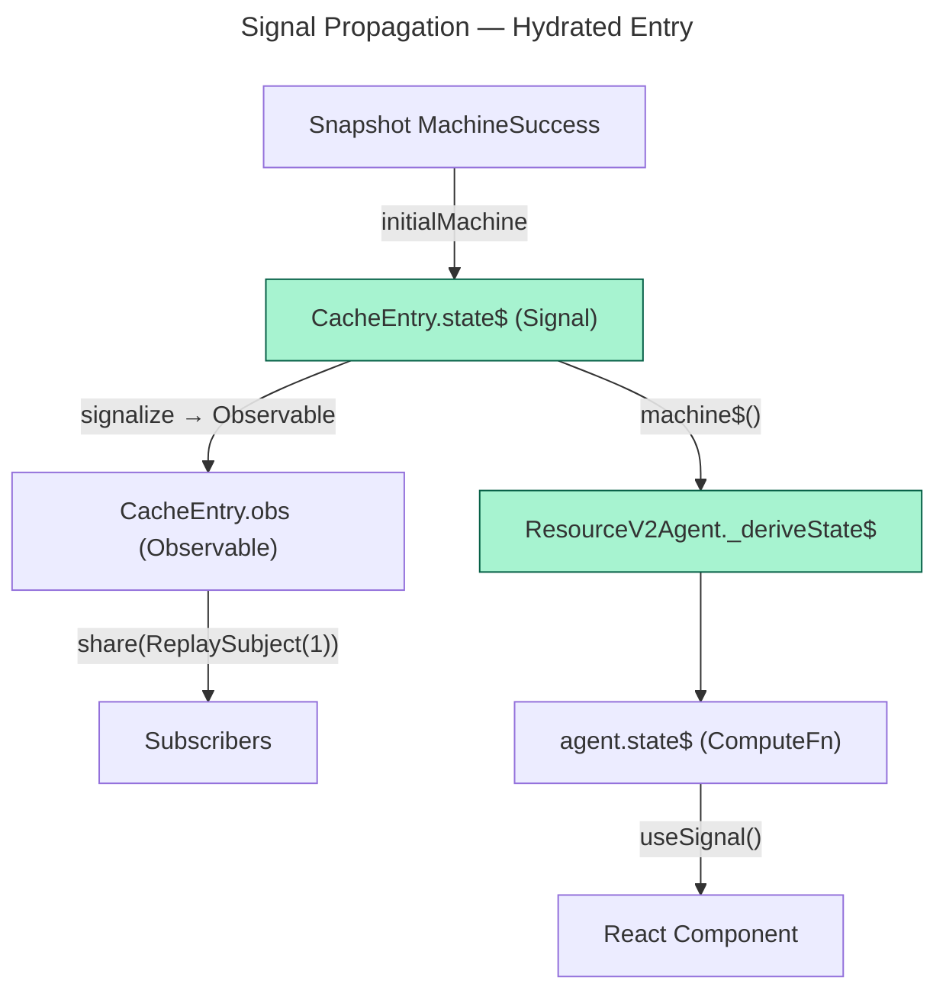
```mermaid
---
title: "Signal Propagation — Hydrated Entry"
---
flowchart TB
    Snap["Snapshot MachineSuccess"] -->|initialMachine| CESig["CacheEntry.state$ (Signal)"]
    CESig -->|"signalize → Observable"| CEObs["CacheEntry.obs (Observable)"]
    CEObs -->|"share(ReplaySubject(1))"| Subs["Subscribers"]
    CESig -->|"machine$()"| Agent["ResourceV2Agent._deriveState$"]
    Agent --> AgentState["agent.state$ (ComputeFn)"]
    AgentState -->|"useSignal()"| React["React Component"]

    style CESig fill:#a7f3d0,stroke:#065f46
    style Agent fill:#a7f3d0,stroke:#065f46
```

**Key differences from normal flow:**
- `onDataLoaded` is NOT called for hydrated entries — the data was never "loaded" from a network request. `$cacheDataLoaded` remains pending until the first actual fetch succeeds (or is rejected on entry removal per Bug #5 fix). [ref: ../01-research/01-codebase-analysis.md#9. LifecycleHooks]
- `fireQueryStarted` is NOT called — no `_doFetch` occurs, so no query lifecycle begins. This is correct: hydrated entries have no associated query. [ref: 01-architecture.md#Fix Area 1]

---

## 2. Fetch Lifecycle with onQueryStarted

### Scenario

After Bug #2 fix, `_doFetch()` calls `fireQueryStarted` before executing `queryFn`, and `resolveQueryFulfilled` on completion (success or error). The `$queryFulfilled` promise provided to the `onQueryStarted` callback settles synchronously after the state transition.

[ref: ../01-research/03-problem-analysis-part1.md#Bug #2]
[ref: ../01-research/05-open-questions.md#Q1]

### Sequence Diagram — Full _doFetch Lifecycle (Post-Fix)

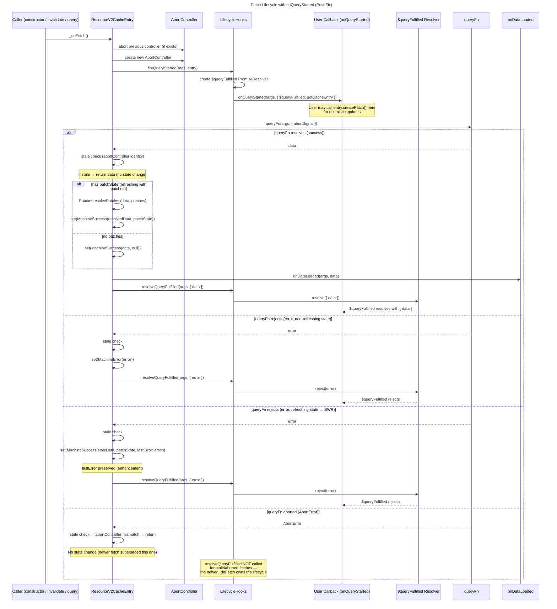
```mermaid
---
title: "Fetch Lifecycle with onQueryStarted (Post-Fix)"
---
sequenceDiagram
    participant Caller as Caller (constructor / invalidate / query)
    participant CE as ResourceV2CacheEntry
    participant Abort as AbortController
    participant LH as LifecycleHooks
    participant UCB as User Callback (onQueryStarted)
    participant QFR as $queryFulfilled Resolver
    participant QFn as queryFn
    participant DL as onDataLoaded

    Caller->>CE: _doFetch()

    CE->>Abort: abort previous controller (if exists)
    CE->>Abort: create new AbortController

    CE->>LH: fireQueryStarted(args, entry)
    LH->>LH: create $queryFulfilled PromiseResolver
    LH->>UCB: onQueryStarted(args, { $queryFulfilled, getCacheEntry })
    Note over UCB: User may call entry.createPatch() here<br/>for optimistic updates

    CE->>QFn: queryFn(args, { abortSignal })

    alt queryFn resolves (success)
        QFn-->>CE: data
        CE->>CE: stale check (abortController identity)
        Note over CE: If stale → return data (no state change)

        alt has patchState (refreshing with patches)
            CE->>CE: Patcher.resolvePatches(data, patches)
            CE->>CE: set(MachineSuccess(resolvedData, patchState))
        else no patches
            CE->>CE: set(MachineSuccess(data, null))
        end

        CE->>DL: onDataLoaded(args, data)
        CE->>LH: resolveQueryFulfilled(args, { data })
        LH->>QFR: resolve({ data })
        QFR-->>UCB: $queryFulfilled resolves with { data }

    else queryFn rejects (error, non-refreshing state)
        QFn-->>CE: error
        CE->>CE: stale check
        CE->>CE: set(MachineError(error))
        CE->>LH: resolveQueryFulfilled(args, { error })
        LH->>QFR: reject(error)
        QFR-->>UCB: $queryFulfilled rejects

    else queryFn rejects (error, refreshing state → SWR)
        QFn-->>CE: error
        CE->>CE: stale check
        CE->>CE: set(MachineSuccess(staleData, patchState, lastError: error))
        Note over CE: lastError preserved (enhancement)
        CE->>LH: resolveQueryFulfilled(args, { error })
        LH->>QFR: reject(error)
        QFR-->>UCB: $queryFulfilled rejects

    else queryFn aborted (AbortError)
        QFn-->>CE: AbortError
        CE->>CE: stale check → abortController mismatch → return
        Note over CE: No state change (newer fetch superseded this one)
        Note over LH: resolveQueryFulfilled NOT called<br/>for stale/aborted fetches —<br/>the newer _doFetch owns the lifecycle
    end
```

### $queryFulfilled Promise Timing

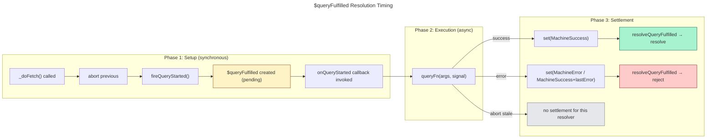
```mermaid
---
title: "$queryFulfilled Resolution Timing"
---
flowchart LR
    subgraph Phase1["Phase 1: Setup (synchronous)"]
        A["_doFetch() called"] --> B["abort previous"]
        B --> C["fireQueryStarted()"]
        C --> D["$queryFulfilled created (pending)"]
        D --> E["onQueryStarted callback invoked"]
    end

    subgraph Phase2["Phase 2: Execution (async)"]
        E --> F["queryFn(args, signal)"]
    end

    subgraph Phase3["Phase 3: Settlement"]
        F -->|success| G["set(MachineSuccess)"]
        G --> H["resolveQueryFulfilled → resolve"]
        F -->|error| I["set(MachineError / MachineSuccess+lastError)"]
        I --> J["resolveQueryFulfilled → reject"]
        F -->|abort stale| K["no settlement for this resolver"]
    end

    style D fill:#fef3c7,stroke:#92400e
    style H fill:#a7f3d0,stroke:#065f46
    style J fill:#fecaca,stroke:#991b1b
    style K fill:#e5e7eb,stroke:#6b7280
```

**Key design detail — abort handling**: When a fetch is aborted because a newer `_doFetch` supersedes it (stale check via `this._abortController !== controller`), the `$queryFulfilled` for the aborted fetch is NOT settled by the aborted handler. Instead, the **newer** `_doFetch` call creates its own `fireQueryStarted` → new resolver. The old resolver is effectively orphaned. To prevent leaks, `LifecycleHooks.clearAll()` rejects all outstanding `_queryResolvers` on cache reset, and `fireCacheEntryRemoved` should clean up per-entry query resolvers. [ref: ../01-research/01-codebase-analysis.md#9. LifecycleHooks]

**Design note on multiple fireQueryStarted calls**: Since `_doFetch` can be called multiple times (invalidate, query with force), `fireQueryStarted` fires for each fetch. The `_queryResolvers` map is keyed by `args`, so a new call overwrites the previous resolver. The previous `$queryFulfilled` promise becomes orphaned if the earlier fetch hasn't settled yet. This matches RTK Query behavior where each dispatch creates a new `onQueryStarted` invocation. [ref: ../01-research/02-external-research.md#2. Lifecycle Hooks]

---

## 3. SWR Error State Derivation

### Scenario A: Cross-Args Refetch Failure

Agent switches from `args1` (success) to `args2` (fails). After Bug #3 fix, `isError` reflects the true error state and `previous$` is properly cleared.

[ref: ../01-research/03-problem-analysis-part1.md#Bug #3]
[ref: ../01-research/05-open-questions.md#Q2]

### Sequence Diagram — Cross-Args SWR Error (Post-Fix)

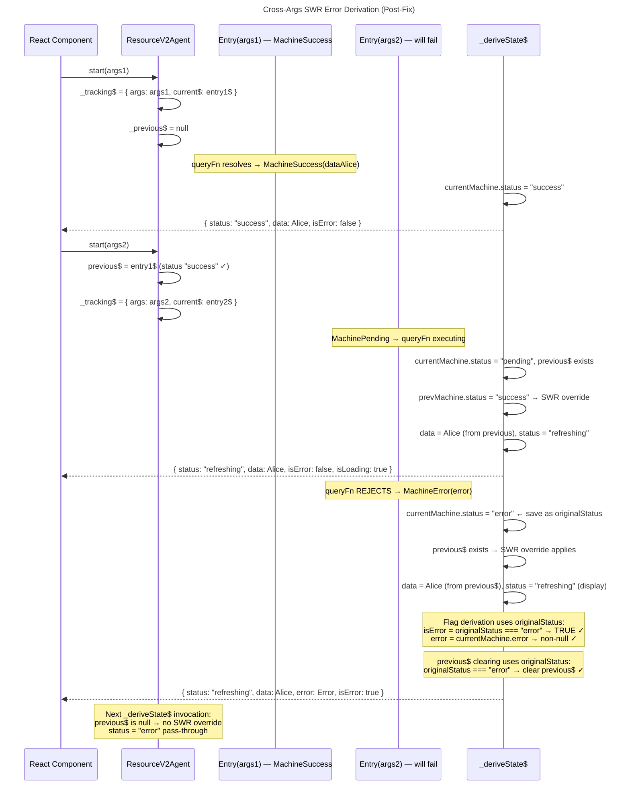
```mermaid
---
title: "Cross-Args SWR Error Derivation (Post-Fix)"
---
sequenceDiagram
    participant App as React Component
    participant Agent as ResourceV2Agent
    participant Entry1 as Entry(args1) — MachineSuccess
    participant Entry2 as Entry(args2) — will fail
    participant Derive as _deriveState$

    App->>Agent: start(args1)
    Agent->>Agent: _tracking$ = { args: args1, current$: entry1$ }
    Agent->>Agent: _previous$ = null

    Note over Entry1: queryFn resolves → MachineSuccess(dataAlice)

    Derive->>Derive: currentMachine.status = "success"
    Derive-->>App: { status: "success", data: Alice, isError: false }

    App->>Agent: start(args2)
    Agent->>Agent: previous$ = entry1$ (status "success" ✓)
    Agent->>Agent: _tracking$ = { args: args2, current$: entry2$ }

    Note over Entry2: MachinePending → queryFn executing

    Derive->>Derive: currentMachine.status = "pending", previous$ exists
    Derive->>Derive: prevMachine.status = "success" → SWR override
    Derive->>Derive: data = Alice (from previous), status = "refreshing"
    Derive-->>App: { status: "refreshing", data: Alice, isError: false, isLoading: true }

    Note over Entry2: queryFn REJECTS → MachineError(error)

    Derive->>Derive: currentMachine.status = "error" ← save as originalStatus
    Derive->>Derive: previous$ exists → SWR override applies
    Derive->>Derive: data = Alice (from previous$), status = "refreshing" (display)

    Note over Derive: Flag derivation uses originalStatus:<br/>isError = originalStatus === "error" → TRUE ✓<br/>error = currentMachine.error → non-null ✓

    Note over Derive: previous$ clearing uses originalStatus:<br/>originalStatus === "error" → clear previous$ ✓

    Derive-->>App: { status: "refreshing", data: Alice, error: Error, isError: true }

    Note over Agent: Next _deriveState$ invocation:<br/>previous$ is null → no SWR override<br/>status = "error" pass-through
```

### Data Flow — _deriveState$ Error-Transparent Logic (Post-Fix)

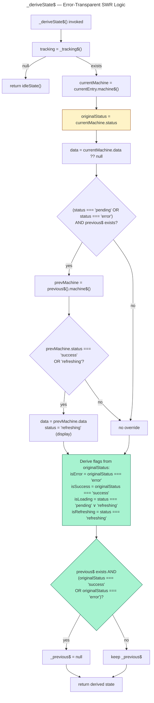
```mermaid
---
title: "_deriveState$ — Error-Transparent SWR Logic"
---
flowchart TB
    Start["_deriveState$() invoked"] --> ReadTracking["tracking = _tracking$()"]
    ReadTracking -->|null| Idle["return idleState()"]
    ReadTracking -->|exists| ReadMachine["currentMachine = currentEntry.machine$()"]

    ReadMachine --> SaveOriginal["originalStatus = currentMachine.status"]
    SaveOriginal --> ReadData["data = currentMachine.data ?? null"]

    ReadData --> CheckSWR{"(status === 'pending' OR status === 'error')<br/>AND previous$ exists?"}

    CheckSWR -->|yes| ReadPrev["prevMachine = previous$().machine$()"]
    ReadPrev --> CheckPrevValid{"prevMachine.status === 'success'<br/>OR 'refreshing'?"}
    CheckPrevValid -->|yes| ApplySWR["data = prevMachine.data<br/>status = 'refreshing' (display)"]
    CheckPrevValid -->|no| SkipSWR["no override"]

    CheckSWR -->|no| SkipSWR

    ApplySWR --> DeriveFlags
    SkipSWR --> DeriveFlags

    DeriveFlags["Derive flags from originalStatus:<br/>isError = originalStatus === 'error'<br/>isSuccess = originalStatus === 'success'<br/>isLoading = status === 'pending' ∨ 'refreshing'<br/>isRefreshing = status === 'refreshing'"]

    DeriveFlags --> ClearPrevious{"previous$ exists AND<br/>(originalStatus === 'success'<br/>OR originalStatus === 'error')?"}
    ClearPrevious -->|yes| DoClear["_previous$ = null"]
    ClearPrevious -->|no| KeepPrev["keep _previous$"]

    DoClear --> Return["return derived state"]
    KeepPrev --> Return

    style SaveOriginal fill:#fef3c7,stroke:#92400e
    style DeriveFlags fill:#a7f3d0,stroke:#065f46
    style ClearPrevious fill:#a7f3d0,stroke:#065f46
```

**Critical fix point**: `originalStatus` is captured from `currentMachine.status` **before** the SWR override mutates the local `status` variable. Both `isError` derivation and `previous$` clearing use `originalStatus`, not the potentially-overridden `status`. This fixes both sub-issues of Bug #3. [ref: ../01-research/03-problem-analysis-part1.md#Two separate issues]

### Scenario B: Same-Args Refetch Failure (lastError Enhancement)

A refetch of the same args fails while data exists. `MachineRefreshing.errorHappened()` transitions to `MachineSuccess` with `lastError`.

[ref: ../01-research/05-open-questions.md#Q10]

### Sequence Diagram — Same-Args Refetch Error with lastError

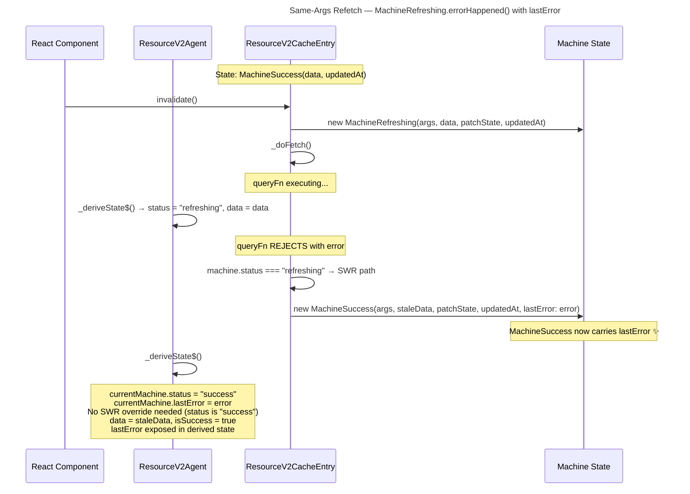
```mermaid
---
title: "Same-Args Refetch — MachineRefreshing.errorHappened() with lastError"
---
sequenceDiagram
    participant App as React Component
    participant Agent as ResourceV2Agent
    participant CE as ResourceV2CacheEntry
    participant Machine as Machine State

    Note over CE: State: MachineSuccess(data, updatedAt)

    App->>CE: invalidate()
    CE->>Machine: new MachineRefreshing(args, data, patchState, updatedAt)
    CE->>CE: _doFetch()

    Note over CE: queryFn executing...

    Agent->>Agent: _deriveState$() → status = "refreshing", data = data

    Note over CE: queryFn REJECTS with error

    CE->>CE: machine.status === "refreshing" → SWR path
    CE->>Machine: new MachineSuccess(args, staleData, patchState, updatedAt, lastError: error)
    Note over Machine: MachineSuccess now carries lastError ✨

    Agent->>Agent: _deriveState$()
    Note over Agent: currentMachine.status = "success"<br/>currentMachine.lastError = error<br/>No SWR override needed (status is "success")<br/>data = staleData, isSuccess = true<br/>lastError exposed in derived state
```

### Machine State Transitions (Complete, with lastError)

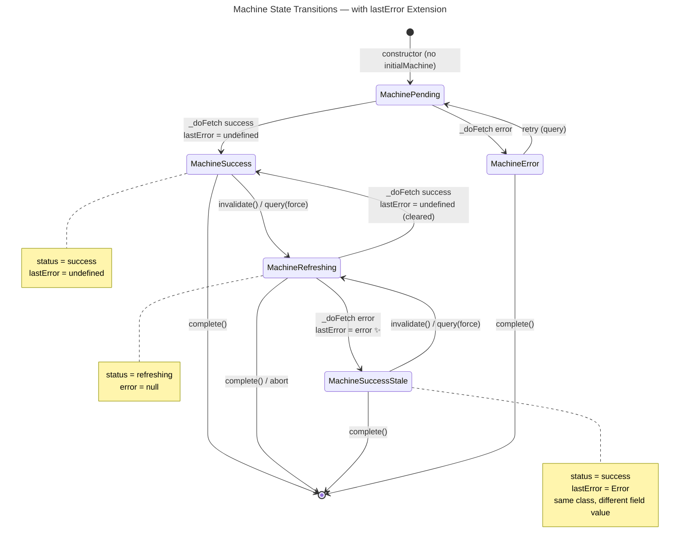
```mermaid
---
title: "Machine State Transitions — with lastError Extension"
---
stateDiagram-v2
    [*] --> MachinePending: constructor (no initialMachine)

    MachinePending --> MachineSuccess: _doFetch success<br/>lastError = undefined
    MachinePending --> MachineError: _doFetch error

    MachineSuccess --> MachineRefreshing: invalidate() / query(force)
    MachineSuccess --> [*]: complete()

    MachineRefreshing --> MachineSuccess: _doFetch success<br/>lastError = undefined (cleared)
    MachineRefreshing --> MachineSuccessStale: _doFetch error<br/>lastError = error ✨
    MachineRefreshing --> [*]: complete() / abort

    MachineSuccessStale --> MachineRefreshing: invalidate() / query(force)
    MachineSuccessStale --> [*]: complete()

    MachineError --> MachinePending: retry (query)
    MachineError --> [*]: complete()

    note right of MachineSuccess
        status = success
        lastError = undefined
    end note
    note right of MachineSuccessStale
        status = success
        lastError = Error
        same class, different field value
    end note
    note right of MachineRefreshing
        status = refreshing
        error = null
    end note
```

**Note**: `MachineSuccess` and `MachineSuccessStale` are the same class (`MachineSuccess`). The distinction is the value of `lastError`: `undefined` for clean success, non-undefined for SWR-preserved data after refetch error. A successful refetch always clears `lastError` by constructing `MachineSuccess` without it. [ref: 01-architecture.md#9. State Diagram]

### Signal Propagation — Error State through Agent

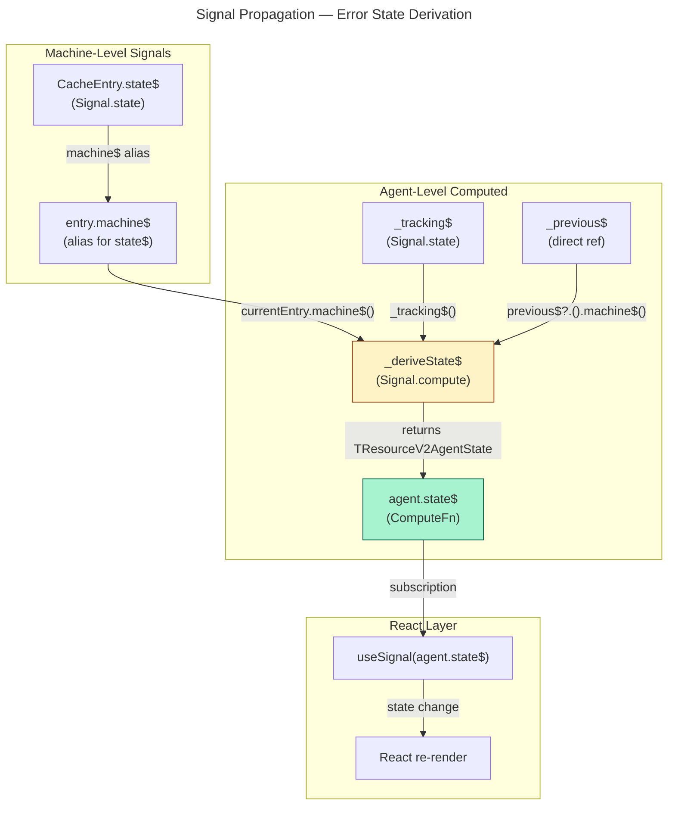
```mermaid
---
title: "Signal Propagation — Error State Derivation"
---
flowchart TB
    subgraph MachineLevelSignals["Machine-Level Signals"]
        CEState["CacheEntry.state$<br/>(Signal.state)"]
        CEMachine["entry.machine$<br/>(alias for state$)"]
    end

    subgraph AgentLevelComputed["Agent-Level Computed"]
        Track["_tracking$<br/>(Signal.state)"]
        Prev["_previous$<br/>(direct ref)"]
        Derive["_deriveState$<br/>(Signal.compute)"]
        AgentState["agent.state$<br/>(ComputeFn)"]
    end

    subgraph ReactLayer["React Layer"]
        UseSignal["useSignal(agent.state$)"]
        Component["React re-render"]
    end

    CEState -->|"machine$ alias"| CEMachine
    CEMachine -->|"currentEntry.machine$()"| Derive
    Track -->|"_tracking$()"| Derive
    Prev -->|"previous$?.().machine$()"| Derive
    Derive -->|"returns TResourceV2AgentState"| AgentState
    AgentState -->|"subscription"| UseSignal
    UseSignal -->|"state change"| Component

    style Derive fill:#fef3c7,stroke:#92400e
    style AgentState fill:#a7f3d0,stroke:#065f46
```

---

## 4. Patcher Commit with Consistency Violation

### Scenario

User creates a patch, patch is committed, but `applyPatches` throws during resolution because the server returned structurally incompatible data. After Bug #4 fix, `resolvePatches` returns `isConsistencyViolation: true` in the `patchState`, and `_finishPatch` detects it and calls `invalidate()`.

[ref: ../01-research/04-problem-analysis-part2.md#Bug #4]
[ref: ../01-research/05-open-questions.md#Q4]

### Sequence Diagram — Patcher Commit Violation (Post-Fix)

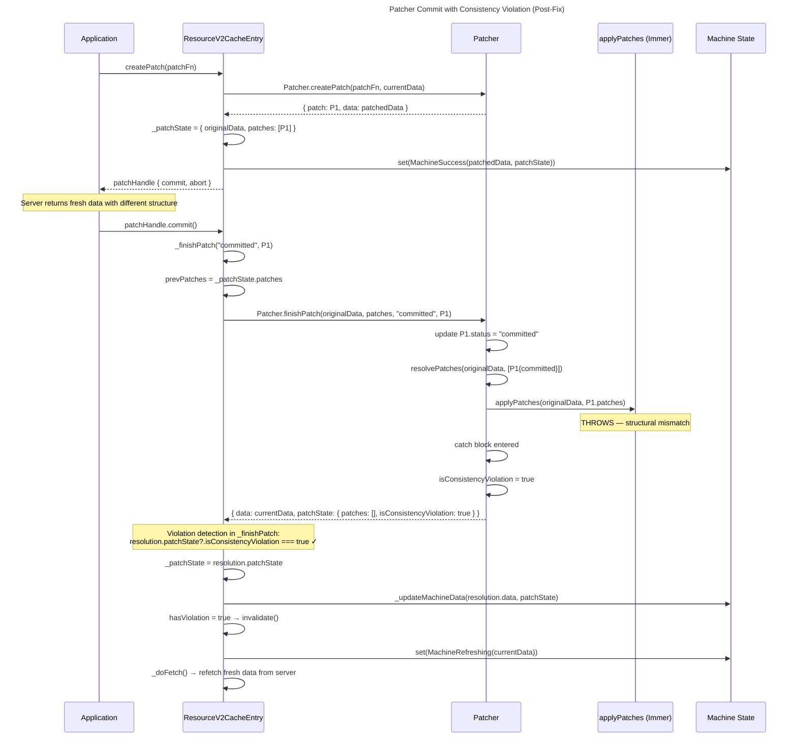
```mermaid
---
title: "Patcher Commit with Consistency Violation (Post-Fix)"
---
sequenceDiagram
    participant App as Application
    participant CE as ResourceV2CacheEntry
    participant P as Patcher
    participant Immer as applyPatches (Immer)
    participant Machine as Machine State

    App->>CE: createPatch(patchFn)
    CE->>P: Patcher.createPatch(patchFn, currentData)
    P-->>CE: { patch: P1, data: patchedData }
    CE->>CE: _patchState = { originalData, patches: [P1] }
    CE->>Machine: set(MachineSuccess(patchedData, patchState))
    CE-->>App: patchHandle { commit, abort }

    Note over App: Server returns fresh data with different structure

    App->>CE: patchHandle.commit()
    CE->>CE: _finishPatch("committed", P1)
    CE->>CE: prevPatches = _patchState.patches

    CE->>P: Patcher.finishPatch(originalData, patches, "committed", P1)
    P->>P: update P1.status = "committed"
    P->>P: resolvePatches(originalData, [P1{committed}])

    P->>Immer: applyPatches(originalData, P1.patches)
    Note over Immer: THROWS — structural mismatch

    P->>P: catch block entered
    P->>P: isConsistencyViolation = true
    P-->>CE: { data: currentData, patchState: { patches: [], isConsistencyViolation: true } }

    Note over CE: Violation detection in _finishPatch:<br/>resolution.patchState?.isConsistencyViolation === true ✓

    CE->>CE: _patchState = resolution.patchState
    CE->>Machine: _updateMachineData(resolution.data, patchState)

    CE->>CE: hasViolation = true → invalidate()
    CE->>Machine: set(MachineRefreshing(currentData))
    CE->>CE: _doFetch() → refetch fresh data from server
```

### Patcher.resolvePatches — Data Flow (Post-Fix, Catch Path)

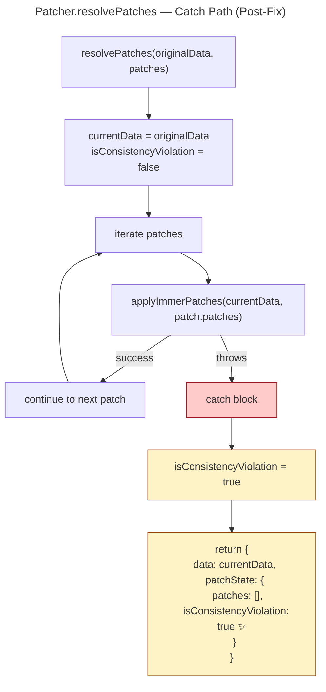
```mermaid
---
title: "Patcher.resolvePatches — Catch Path (Post-Fix)"
---
flowchart TB
    Start["resolvePatches(originalData, patches)"] --> Init["currentData = originalData<br/>isConsistencyViolation = false"]
    Init --> Loop["iterate patches"]

    Loop --> Apply["applyImmerPatches(currentData, patch.patches)"]

    Apply -->|success| Continue["continue to next patch"]
    Continue --> Loop

    Apply -->|throws| Catch["catch block"]

    Catch --> SetFlag["isConsistencyViolation = true"]
    SetFlag --> ReturnFixed["return {<br/>  data: currentData,<br/>  patchState: {<br/>    patches: [],<br/>    isConsistencyViolation: true ✨<br/>  }<br/>}"]

    style Catch fill:#fecaca,stroke:#991b1b
    style ReturnFixed fill:#fef3c7,stroke:#92400e
    style SetFlag fill:#fef3c7,stroke:#92400e
```

### Contrast: Current (Buggy) vs Fixed Catch Return

| Aspect | Current (Buggy) | Fixed |
|--------|----------------|-------|
| Catch return `patchState` | `null` | `{ patches: [], isConsistencyViolation: true }` |
| `_finishPatch` detection via `patchState?.isConsistencyViolation` | `null?.isConsistencyViolation` → `false` | `true` ✓ |
| `_finishPatch` fallback heuristic (`patchState === null && type === "aborted"`) | `null && "committed"` → `false` (committed, not aborted) | Not needed — primary check succeeds |
| `invalidate()` called | **No** — violation silently lost | **Yes** — triggers refetch |

### _finishPatch Detection — Data Flow

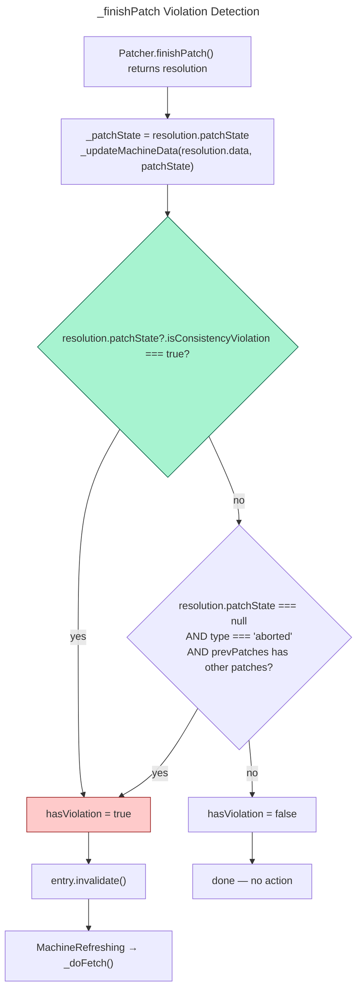
```mermaid
---
title: "_finishPatch Violation Detection"
---
flowchart TB
    Resolve["Patcher.finishPatch() returns resolution"] --> UpdateState["_patchState = resolution.patchState<br/>_updateMachineData(resolution.data, patchState)"]

    UpdateState --> Check1{"resolution.patchState?.isConsistencyViolation === true?"}

    Check1 -->|yes| Violation["hasViolation = true"]
    Check1 -->|no| Check2{"resolution.patchState === null<br/>AND type === 'aborted'<br/>AND prevPatches has other patches?"}

    Check2 -->|yes| Violation
    Check2 -->|no| NoViolation["hasViolation = false"]

    Violation --> Invalidate["entry.invalidate()"]
    Invalidate --> Refetch["MachineRefreshing → _doFetch()"]

    NoViolation --> Done["done — no action"]

    style Check1 fill:#a7f3d0,stroke:#065f46
    style Violation fill:#fecaca,stroke:#991b1b
```

**Note on the secondary call site**: `_doFetch` success handler (line 170–180 of `ResourceV2CacheEntry.ts`) also calls `Patcher.resolvePatches` when resolving patches on server data. Currently, this call site has **no** consistency violation check. With the fix to `resolvePatches` returning `isConsistencyViolation: true` in `patchState`, the machine will be set with a `patchState` carrying the violation flag. However, since `_doFetch` success sets `MachineSuccess` and does not call `_finishPatch`, the violation is embedded in the machine state but not acted upon immediately. The next `_finishPatch` call (on a subsequent patch commit/abort) will see the flag and invalidate. This is acceptable for the current scope. [ref: ../01-research/04-problem-analysis-part2.md#Root Location]

---

## 5. Cache Reset Promise Rejection

### Scenario A: resetCache()

`resource.resetCache()` destroys all entries. After Bug #5 fix, `fireCacheEntryRemoved` rejects pending `$cacheDataLoaded` before deleting the resolver, ensuring no promises hang.

[ref: ../01-research/04-problem-analysis-part2.md#Bug #5]
[ref: ../01-research/05-open-questions.md#Q5]

### Sequence Diagram — resetCache with $cacheDataLoaded Rejection (Post-Fix)

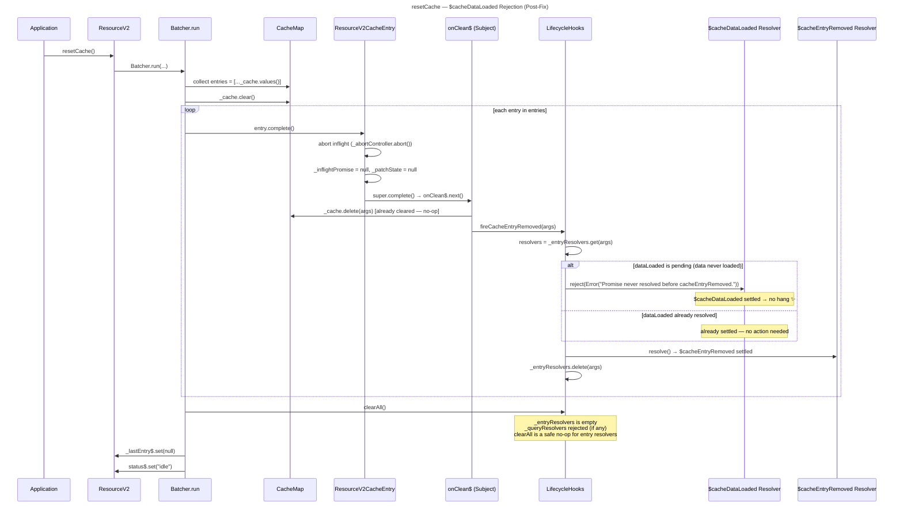
```mermaid
---
title: "resetCache — $cacheDataLoaded Rejection (Post-Fix)"
---
sequenceDiagram
    participant App as Application
    participant Res as ResourceV2
    participant Batch as Batcher.run
    participant CM as CacheMap
    participant CE as ResourceV2CacheEntry
    participant OnClean as onClean$ (Subject)
    participant LH as LifecycleHooks
    participant DLR as $cacheDataLoaded Resolver
    participant ERR as $cacheEntryRemoved Resolver

    App->>Res: resetCache()
    Res->>Batch: Batcher.run(...)

    Batch->>CM: collect entries = [..._cache.values()]
    Batch->>CM: _cache.clear()

    loop each entry in entries
        Batch->>CE: entry.complete()
        CE->>CE: abort inflight (_abortController.abort())
        CE->>CE: _inflightPromise = null, _patchState = null
        CE->>OnClean: super.complete() → onClean$.next()

        OnClean->>CM: _cache.delete(args) [already cleared — no-op]
        OnClean->>LH: fireCacheEntryRemoved(args)

        LH->>LH: resolvers = _entryResolvers.get(args)

        alt dataLoaded is pending (data never loaded)
            LH->>DLR: reject(Error("Promise never resolved before cacheEntryRemoved."))
            Note over DLR: $cacheDataLoaded settled → no hang ✨
        else dataLoaded already resolved
            Note over DLR: already settled — no action needed
        end

        LH->>ERR: resolve() → $cacheEntryRemoved settled
        LH->>LH: _entryResolvers.delete(args)
    end

    Batch->>LH: clearAll()
    Note over LH: _entryResolvers is empty<br/>_queryResolvers rejected (if any)<br/>clearAll is a safe no-op for entry resolvers

    Batch->>Res: _lastEntry$.set(null)
    Batch->>Res: status$.set("idle")
```

### Scenario B: GC-Triggered Entry Removal

Cache lifetime expires, RxJS `share` refcount drops to zero, triggering cleanup. Same `onClean$` → `fireCacheEntryRemoved` path as `resetCache`.

[ref: ../01-research/05-open-questions.md#Q12]

### Sequence Diagram — GC-Triggered Removal (Post-Fix)

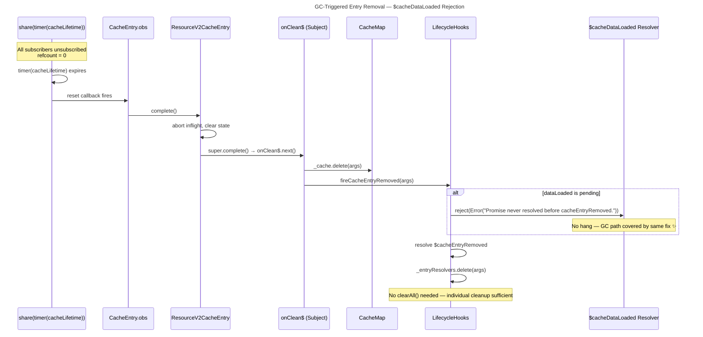
```mermaid
---
title: "GC-Triggered Entry Removal — $cacheDataLoaded Rejection"
---
sequenceDiagram
    participant RxJS as share(timer(cacheLifetime))
    participant CEObs as CacheEntry.obs
    participant CE as ResourceV2CacheEntry
    participant OnClean as onClean$ (Subject)
    participant CM as CacheMap
    participant LH as LifecycleHooks
    participant DLR as $cacheDataLoaded Resolver

    Note over RxJS: All subscribers unsubscribed<br/>refcount = 0

    RxJS->>RxJS: timer(cacheLifetime) expires
    RxJS->>CEObs: reset callback fires
    CEObs->>CE: complete()

    CE->>CE: abort inflight, clear state
    CE->>OnClean: super.complete() → onClean$.next()

    OnClean->>CM: _cache.delete(args)
    OnClean->>LH: fireCacheEntryRemoved(args)

    alt dataLoaded is pending
        LH->>DLR: reject(Error("Promise never resolved before cacheEntryRemoved."))
        Note over DLR: No hang — GC path covered by same fix ✨
    end

    LH->>LH: resolve $cacheEntryRemoved
    LH->>LH: _entryResolvers.delete(args)

    Note over LH: No clearAll() needed — individual cleanup sufficient
```

### Promise Settlement State Machine

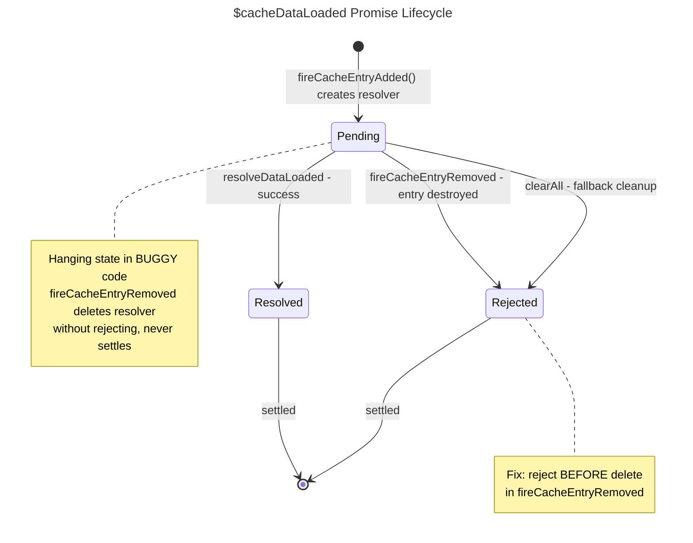
```mermaid
---
title: "$cacheDataLoaded Promise Lifecycle"
---
stateDiagram-v2
    [*] --> Pending: fireCacheEntryAdded() creates resolver

    Pending --> Resolved: resolveDataLoaded - success
    Pending --> Rejected: fireCacheEntryRemoved - entry destroyed
    Pending --> Rejected: clearAll - fallback cleanup

    Resolved --> [*]: settled
    Rejected --> [*]: settled

    note right of Pending
        Hanging state in BUGGY code
        fireCacheEntryRemoved deletes resolver
        without rejecting, never settles
    end note
    note right of Rejected
        Fix: reject BEFORE delete
        in fireCacheEntryRemoved
    end note
```

### Data Flow — fireCacheEntryRemoved (Post-Fix)

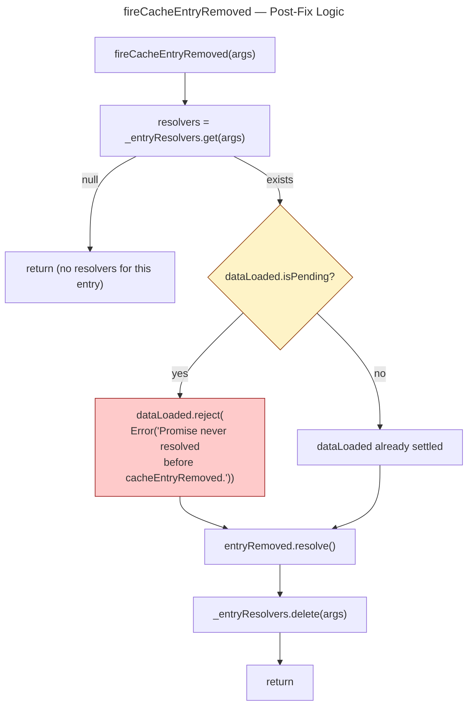
```mermaid
---
title: "fireCacheEntryRemoved — Post-Fix Logic"
---
flowchart TB
    Start["fireCacheEntryRemoved(args)"] --> GetResolvers["resolvers = _entryResolvers.get(args)"]
    GetResolvers -->|null| Done["return (no resolvers for this entry)"]
    GetResolvers -->|exists| CheckDL{"dataLoaded.isPending?"}

    CheckDL -->|yes| RejectDL["dataLoaded.reject(<br/>Error('Promise never resolved<br/>before cacheEntryRemoved.'))"]
    CheckDL -->|no| SkipReject["dataLoaded already settled"]

    RejectDL --> ResolveER["entryRemoved.resolve()"]
    SkipReject --> ResolveER

    ResolveER --> Delete["_entryResolvers.delete(args)"]
    Delete --> Done2["return"]

    style RejectDL fill:#fecaca,stroke:#991b1b
    style CheckDL fill:#fef3c7,stroke:#92400e
```

**Implementation detail**: `PromiseResolver` must expose a way to check if the promise is pending. If `PromiseResolver` does not currently have an `isPending` property, the fix can unconditionally call `reject()` — rejecting an already-resolved promise is a no-op for `PromiseResolver` (the underlying promise is already settled). This matches RTK Query's approach where `cacheDataLoaded.reject()` is always called on removal, relying on the fact that settled promises ignore subsequent resolution/rejection attempts. [ref: ../01-research/02-external-research.md#5. Cache Reset and Pending Promises]

---

## Summary of Signal/Observable Propagation Across All Scenarios

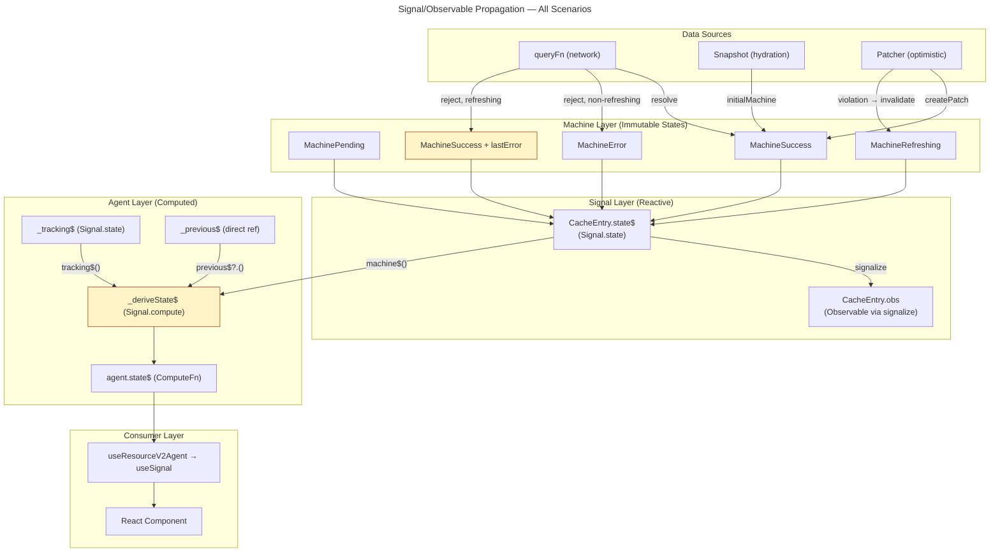
```mermaid
---
title: "Signal/Observable Propagation — All Scenarios"
---
flowchart TB
    subgraph Sources["Data Sources"]
        QFn["queryFn (network)"]
        Snap["Snapshot (hydration)"]
        Patch["Patcher (optimistic)"]
    end

    subgraph MachineLayer["Machine Layer (Immutable States)"]
        MP["MachinePending"]
        MS["MachineSuccess"]
        MSL["MachineSuccess + lastError"]
        MR["MachineRefreshing"]
        ME["MachineError"]
    end

    subgraph SignalLayer["Signal Layer (Reactive)"]
        CESig["CacheEntry.state$<br/>(Signal.state)"]
        CEObs["CacheEntry.obs<br/>(Observable via signalize)"]
    end

    subgraph AgentLayer["Agent Layer (Computed)"]
        Track["_tracking$ (Signal.state)"]
        PrevRef["_previous$ (direct ref)"]
        Derive["_deriveState$ (Signal.compute)"]
        AgentState["agent.state$ (ComputeFn)"]
    end

    subgraph ConsumerLayer["Consumer Layer"]
        Hook["useResourceV2Agent → useSignal"]
        ReactComp["React Component"]
    end

    QFn -->|resolve| MS
    QFn -->|reject, non-refreshing| ME
    QFn -->|reject, refreshing| MSL
    Snap -->|initialMachine| MS
    Patch -->|createPatch| MS
    Patch -->|violation → invalidate| MR

    MP --> CESig
    MS --> CESig
    MSL --> CESig
    MR --> CESig
    ME --> CESig

    CESig -->|signalize| CEObs
    CESig -->|"machine$()"| Derive

    Track -->|"tracking$()"| Derive
    PrevRef -->|"previous$?.()"| Derive

    Derive --> AgentState
    AgentState --> Hook
    Hook --> ReactComp

    style Derive fill:#fef3c7,stroke:#92400e
    style MSL fill:#fef3c7,stroke:#92400e
```
