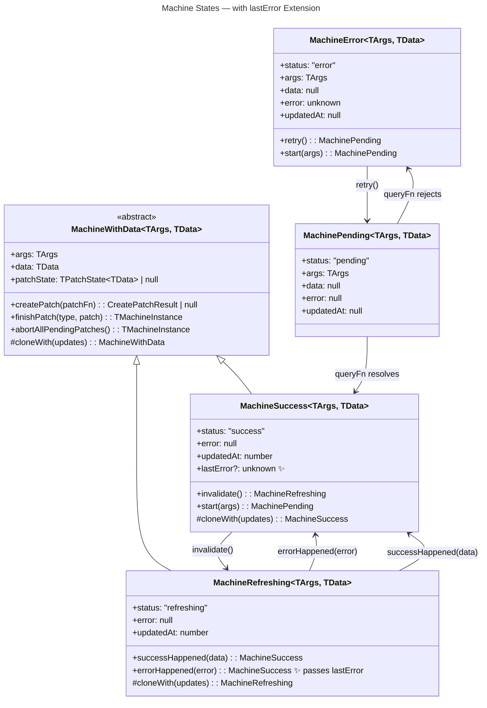
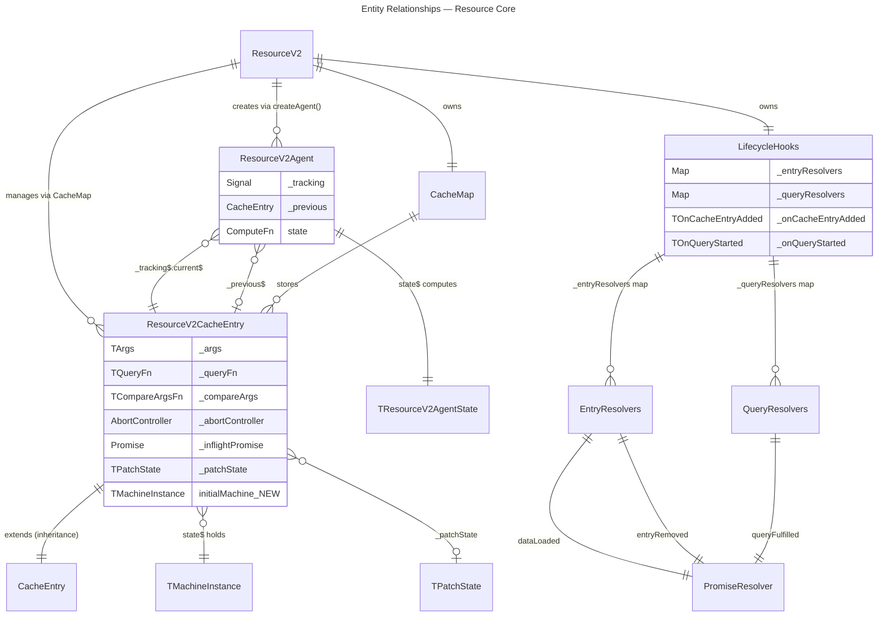
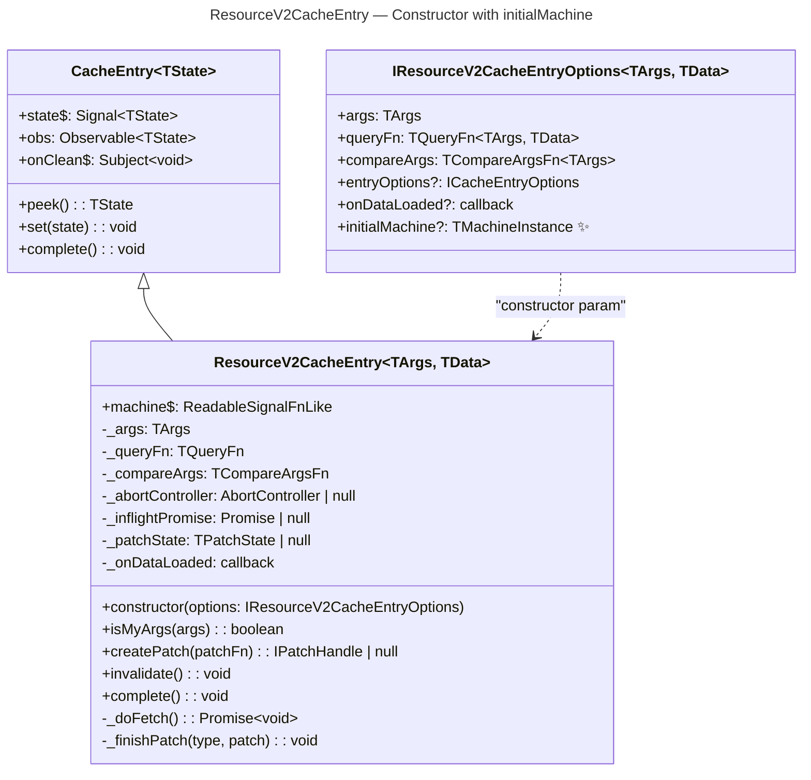
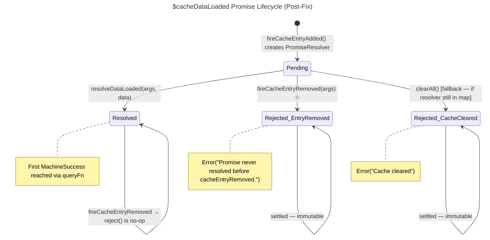
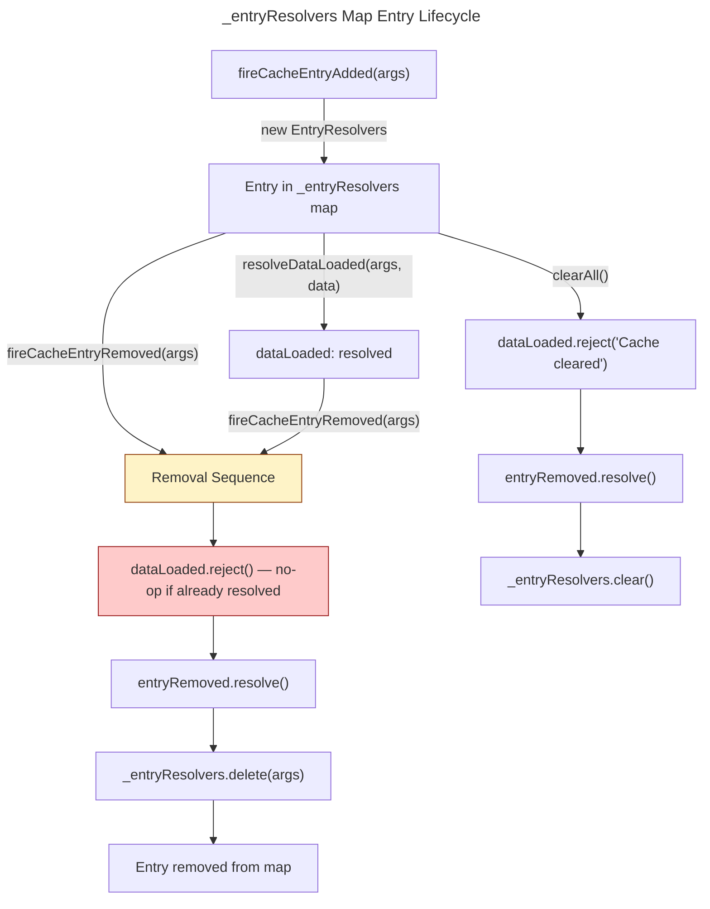
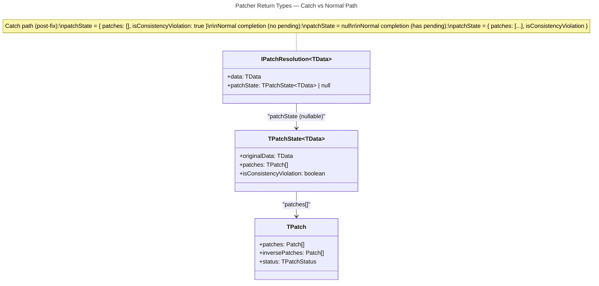
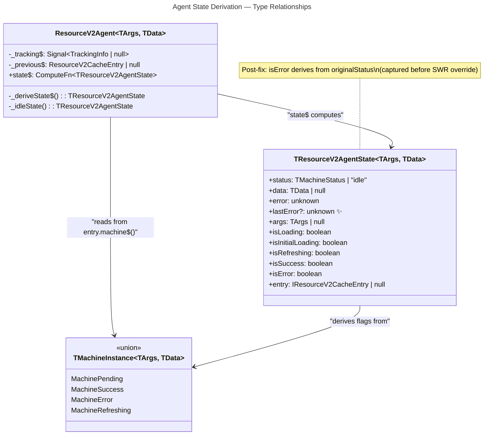
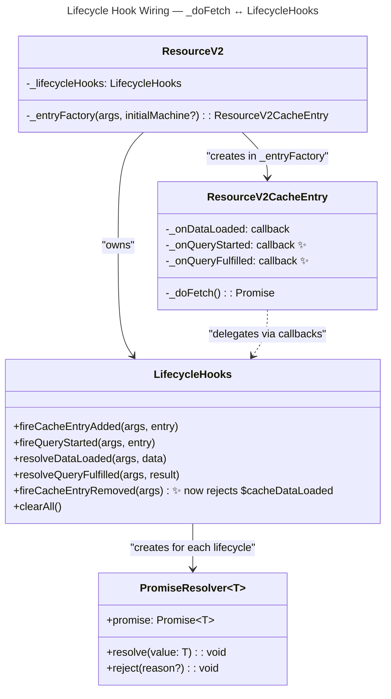

# Domain Model

This document models the type-level and structural changes required by the five bug fixes and the `lastError` enhancement. Each section covers a distinct change area with class diagrams, entity-relationship diagrams, and TypeScript type definitions showing the delta from the current codebase.

---

## 1. `MachineSuccess` Type Extension — `lastError` Field

### Current Type

```typescript
// @/query-v2/core/machines/MachineSuccess.ts (current)
class MachineSuccess<TArgs, TData> extends MachineWithData<TArgs, TData> {
    readonly status = "success" as const;
    readonly error = null;
    readonly updatedAt: number;
    // constructor(args, data, patchState, updatedAt)
}
```

### Modified Type

```typescript
// @/query-v2/core/machines/MachineSuccess.ts (post-fix)
class MachineSuccess<TArgs, TData> extends MachineWithData<TArgs, TData> {
    readonly status = "success" as const;
    readonly error = null;
    readonly updatedAt: number;
    readonly lastError?: unknown;  // ✨ NEW

    constructor(
        args: TArgs,
        data: TData,
        patchState: TPatchState<TData> | null,
        updatedAt: number,
        lastError?: unknown,  // ✨ NEW optional parameter
    ) {
        super(args, data, patchState);
        this.updatedAt = updatedAt;
        this.lastError = lastError;
    }
}
```

### `TSuccessState` Type Extension

```typescript
// @/query-v2/types/machine.types.ts (post-fix)
export interface TSuccessState<TArgs, TData> {
    readonly status: "success";
    readonly args: TArgs;
    readonly data: TData;
    readonly error: null;
    readonly updatedAt: number;
    readonly patchState: TPatchState<TData> | null;
    readonly lastError?: unknown;  // ✨ NEW
}
```

[ref: ../01-research/05-open-questions.md#Q10]
[ref: ../01-research/01-codebase-analysis.md#6. Machine States]

### `MachineRefreshing.errorHappened()` — Modification

```typescript
// @/query-v2/core/machines/MachineRefreshing.ts (current)
errorHappened(_error: unknown): MachineSuccess<TArgs, TData> {
    return new MachineSuccess<TArgs, TData>(this.args, this.data, this.patchState, this.updatedAt);
    // ↑ error discarded silently
}

// @/query-v2/core/machines/MachineRefreshing.ts (post-fix)
errorHappened(error: unknown): MachineSuccess<TArgs, TData> {
    return new MachineSuccess<TArgs, TData>(this.args, this.data, this.patchState, this.updatedAt, error);
    // ↑ error preserved as lastError
}
```

### `MachineSuccess.cloneWith()` — Must Propagate `lastError`

```typescript
// @/query-v2/core/machines/MachineSuccess.ts (post-fix)
protected cloneWith(updates: Record<string, unknown>): MachineSuccess<TArgs, TData> {
    return new MachineSuccess<TArgs, TData>(
        (updates.args as TArgs) ?? this.args,
        (updates.data as TData) ?? this.data,
        "patchState" in updates ? (updates.patchState as TPatchState<TData> | null) : this.patchState,
        (updates.updatedAt as number) ?? this.updatedAt,
        "lastError" in updates ? (updates.lastError as unknown) : this.lastError,  // ✨ propagate
    );
}
```

### Class Diagram — Machine States with `lastError`



### State Transitions Populating/Clearing `lastError`

| Transition | Source State | Target State | `lastError` value |
|-----------|-------------|-------------|-------------------|
| `MachineRefreshing.errorHappened(error)` | `MachineRefreshing` | `MachineSuccess` | `error` (set) |
| `MachineRefreshing.successHappened(data)` | `MachineRefreshing` | `MachineSuccess` | `undefined` (cleared — new constructor call without lastError) |
| `MachinePending → MachineSuccess` | `MachinePending` | `MachineSuccess` | `undefined` (initial fetch, no prior error) |
| `MachineSuccess.invalidate()` | `MachineSuccess` | `MachineRefreshing` | N/A (MachineRefreshing has no `lastError`) |
| `MachineSuccess.cloneWith(updates)` | `MachineSuccess` | `MachineSuccess` | Propagated from source unless overridden in `updates` |

### Invariants

1. **`MachineSuccess.error` is always `null`** — the formal error field remains `null`. `lastError` is supplementary.
2. **`lastError` is only set via `errorHappened()`** — same-args refetch failure in refreshing state.
3. **`lastError` is cleared on next successful fetch** — `successHappened()` constructs without `lastError`.
4. **`lastError` is preserved through `cloneWith()`** — patch operations that clone the machine carry `lastError` through unless explicitly overridden.

[ref: ../01-research/02-external-research.md#3. SWR Error State Management]

---

## 2. `ResourceV2CacheEntry` Constructor Changes — `initialMachine`

### Current Constructor Options

```typescript
// @/query-v2/core/resource/ResourceV2CacheEntry.ts (current)
export interface IResourceV2CacheEntryOptions<TArgs, TData> {
    args: TArgs;
    queryFn: TQueryFn<TArgs, TData>;
    compareArgs: TCompareArgsFn<TArgs>;
    entryOptions?: ICacheEntryOptions<TMachineInstance<TArgs, TData>>;
    onDataLoaded?: (args: TArgs, data: TData) => void;
}
```

### Modified Constructor Options

```typescript
// @/query-v2/core/resource/ResourceV2CacheEntry.ts (post-fix)
export interface IResourceV2CacheEntryOptions<TArgs, TData> {
    args: TArgs;
    queryFn: TQueryFn<TArgs, TData>;
    compareArgs: TCompareArgsFn<TArgs>;
    entryOptions?: ICacheEntryOptions<TMachineInstance<TArgs, TData>>;
    onDataLoaded?: (args: TArgs, data: TData) => void;
    initialMachine?: TMachineInstance<TArgs, TData>;  // ✨ NEW
}
```

### Constructor Behavior Change

```typescript
// @/query-v2/core/resource/ResourceV2CacheEntry.ts (post-fix)
constructor(options: IResourceV2CacheEntryOptions<TArgs, TData>) {
    // If initialMachine provided, use it as initial state; otherwise MachinePending
    super(
        options.initialMachine ?? new MachinePending<TArgs, TData>(options.args),
        options.entryOptions,
    );
    this._args = options.args;
    this._queryFn = options.queryFn;
    this._compareArgs = options.compareArgs;
    this._onDataLoaded = options.onDataLoaded;
    this.machine$ = this.state$;

    // Only fetch if no initialMachine was provided
    if (!options.initialMachine) {
        this._doFetch().catch(() => {});
    }
}
```

[ref: ../01-research/03-problem-analysis-part1.md#Bug #1]
[ref: ../01-research/05-open-questions.md#Q3]

### `_entryFactory` Signature Change

```typescript
// @/query-v2/core/resource/ResourceV2.ts (current)
private _entryFactory(args: TArgs): ResourceV2CacheEntry<TArgs, TData>

// @/query-v2/core/resource/ResourceV2.ts (post-fix)
private _entryFactory(
    args: TArgs,
    initialMachine?: TMachineInstance<TArgs, TData>,
): ResourceV2CacheEntry<TArgs, TData>
```

The `initialMachine` parameter is passed through to the `ResourceV2CacheEntry` constructor. The `CacheMap.getOrCreate` currently only calls `_entryFactory(args)` — for hydration, `ResourceV2.hydrateEntry` must bypass `getOrCreate` or pass `initialMachine` through the factory.

### `hydrateEntry` Change

```typescript
// @/query-v2/core/resource/ResourceV2.ts (current)
hydrateEntry(args: TArgs, machine: TMachineInstance<TArgs, TData>): void {
    const entry = this._cache.getOrCreate(args);
    entry.set(machine);
}

// @/query-v2/core/resource/ResourceV2.ts (post-fix)
hydrateEntry(args: TArgs, machine: TMachineInstance<TArgs, TData>): void {
    const entry = this._cache.getOrCreate(args, machine);
    // entry.set(machine) is no longer needed — initial state set via constructor
}
```

This requires `CacheMap.getOrCreate` to accept an optional second parameter to forward to the factory, or `_entryFactory` to be provided with `initialMachine` via closure. Implementation detail deferred to Plan stage.

### Entity-Relationship Diagram — ResourceV2CacheEntry ↔ ResourceV2Agent ↔ QueriesCacheV2



### Class Diagram — ResourceV2CacheEntry with `initialMachine`



---

## 3. `LifecycleHooks` Resolver Lifecycle — `$cacheDataLoaded` Rejection Path

### Current `_entryResolvers` Map Entry Structure

```typescript
// @/query-v2/core/LifecycleHooks.ts (current)
interface EntryResolvers<TData> {
    dataLoaded: PromiseResolver<TData>;
    entryRemoved: PromiseResolver<void>;
}
// Map keyed by TArgs
private _entryResolvers = new Map<TArgs, EntryResolvers<TData>>();
```

No structural change to `EntryResolvers` is needed. The fix is behavioral: `fireCacheEntryRemoved` must reject `dataLoaded` before deleting.

### `PromiseResolver` — No Type Change

```typescript
// @/common/utils/PromiseResolver.ts (unchanged)
class PromiseResolver<T> {
    promise: Promise<T>;
    resolve(value: T): void;
    reject(reason?: any): void;
}
```

`PromiseResolver` does not track settlement state. Calling `reject()` on an already-resolved `PromiseResolver` is semantically a no-op at the JavaScript Promise level (the underlying promise ignores subsequent settlement attempts). Therefore, `fireCacheEntryRemoved` can unconditionally call `dataLoaded.reject(...)` without checking `isPending`. [ref: ../01-research/02-external-research.md#5. Cache Reset and Pending Promises]

### `$cacheDataLoaded` Promise States



### Rejection Path in `fireCacheEntryRemoved` (Post-Fix)

```typescript
// @/query-v2/core/LifecycleHooks.ts (current)
fireCacheEntryRemoved(args: TArgs): void {
    const resolvers = this._entryResolvers.get(args);
    if (resolvers) {
        resolvers.entryRemoved.resolve();
        this._entryResolvers.delete(args);
    }
}

// @/query-v2/core/LifecycleHooks.ts (post-fix)
fireCacheEntryRemoved(args: TArgs): void {
    const resolvers = this._entryResolvers.get(args);
    if (resolvers) {
        // Reject $cacheDataLoaded if still pending (no-op if already resolved)
        resolvers.dataLoaded.reject(
            new Error("Promise never resolved before cacheEntryRemoved."),
        );
        resolvers.entryRemoved.resolve();
        this._entryResolvers.delete(args);
    }
}
```

### `_entryResolvers` Map Entry Lifecycle Diagram



[ref: ../01-research/04-problem-analysis-part2.md#Bug #5]
[ref: ../01-research/05-open-questions.md#Q5]
[ref: ../01-research/05-open-questions.md#Q12]

---

## 4. `Patcher.resolvePatches` Return Type — Catch Block Correction

### Current `IPatchResolution` Interface

```typescript
// @/query-v2/core/machines/Patcher.ts (unchanged)
export interface IPatchResolution<TData> {
    readonly data: TData;
    readonly patchState: TPatchState<TData> | null;
}
```

No structural change to the interface. The fix is in the catch block's return value.

### Current Catch Block Return (Buggy)

```typescript
// Line 86-91 of Patcher.ts (current)
catch {
    isConsistencyViolation = true;
    return {
        data: currentData,
        patchState: null,  // ← isConsistencyViolation lost
    };
}
```

### Fixed Catch Block Return

```typescript
// Line 86-91 of Patcher.ts (post-fix)
catch {
    return {
        data: currentData,
        patchState: {
            patches: [],
            originalData: currentData,
            isConsistencyViolation: true,  // ✨ now propagated
        },
    };
}
```

### `TPatchState` — No Type Change

```typescript
// @/query-v2/types/machine.types.ts (unchanged)
export interface TPatchState<TData> {
    readonly originalData: TData;
    readonly patches: TPatch[];
    readonly isConsistencyViolation: boolean;  // already exists in the type
}
```

The `isConsistencyViolation` field already exists in `TPatchState`. The bug was that the catch path returned `patchState: null` instead of a `TPatchState` with the flag set. The fix makes the catch path return a valid `TPatchState` with `isConsistencyViolation: true`, empty `patches`, and `currentData` as `originalData`.

[ref: ../01-research/04-problem-analysis-part2.md#Bug #4]
[ref: ../01-research/05-open-questions.md#Q4]

### Class Diagram — Patcher Return Types



### Detection Flow in `_finishPatch`

| Scenario | `patchState` | `patchState?.isConsistencyViolation` | Detection |
|----------|-------------|--------------------------------------|-----------|
| Normal commit, no throw | `null` (no remaining patches) | `undefined` → `false` | No violation |
| Normal commit, pending remain | `{ ..., isConsistencyViolation: false }` | `false` | No violation |
| Commit, `applyPatches` throws (current buggy) | `null` | `undefined` → `false` | **Missed** |
| Commit, `applyPatches` throws (post-fix) | `{ patches: [], isConsistencyViolation: true }` | `true` | **Detected** ✨ |
| Abort with other patches, no throw | `null` | `undefined` → `false` | Detected via heuristic (`patchState === null && type === "aborted" && prevPatches.some(...)`) |

---

## 5. SWR State Derivation Types — `TResourceV2AgentState`

### Current `TResourceV2AgentState`

```typescript
// @/query-v2/types/agent.types.ts (current)
export type TResourceV2AgentState<TArgs, TData> =
    | {
          readonly status: TMachineStatus;
          data: TData | null;
          error: unknown;
          args: TArgs | null;
          isLoading: boolean;
          isInitialLoading: boolean;
          isRefreshing: boolean;
          isSuccess: boolean;
          isError: boolean;
          entry: IResourceV2CacheEntry<TArgs, TData> | null;
      }
    | {
          status: "idle";
          data: null;
          error: null;
          args: null;
          isLoading: false;
          isInitialLoading: false;
          isRefreshing: false;
          isSuccess: false;
          isError: false;
          entry: null;
      };
```

### Modified `TResourceV2AgentState` — Adding `lastError`

```typescript
// @/query-v2/types/agent.types.ts (post-fix)
export type TResourceV2AgentState<TArgs, TData> =
    | {
          readonly status: TMachineStatus;
          data: TData | null;
          error: unknown;
          lastError?: unknown;  // ✨ NEW — from MachineSuccess.lastError
          args: TArgs | null;
          isLoading: boolean;
          isInitialLoading: boolean;
          isRefreshing: boolean;
          isSuccess: boolean;
          isError: boolean;
          entry: IResourceV2CacheEntry<TArgs, TData> | null;
      }
    | {
          status: "idle";
          data: null;
          error: null;
          lastError?: undefined;  // ✨ always undefined when idle
          args: null;
          isLoading: false;
          isInitialLoading: false;
          isRefreshing: false;
          isSuccess: false;
          isError: false;
          entry: null;
      };
```

### `_deriveState$` — Flag Derivation Change

The behavioral fix for Bug #3 introduces `originalStatus` captured before the SWR override. No new fields are needed beyond `lastError`. The key type-level observations:

1. **`isError` can now be `true` while `data` is non-null** — when cross-args SWR applies stale data from `previous$` but `currentMachine.status` is `"error"`. This was previously impossible because `status` was overridden before `isError` derivation.
2. **`status` remains `"refreshing"` in SWR override** — for display purposes, but `isError: true` tells the consumer the truth.
3. **`lastError` is passthrough** — read from `currentMachine.lastError` when the current machine is `MachineSuccess`. In the cross-args SWR path where `data` comes from `previous$`, `lastError` comes from the current machine (if it's `MachineSuccess` with a prior refetch error), or is `undefined`.

### State Combinations After Fix

| `currentMachine.status` | `previous$` exists? | `status` (output) | `isError` (output) | `data` (output) | `error` (output) | `lastError` (output) |
|------------------------|--------------------|--------------------|--------------------|-----------------|--------------------|---------------------|
| `"pending"` | no | `"pending"` | `false` | `null` | `null` | `undefined` |
| `"pending"` | yes (success) | `"refreshing"` | `false` | prev.data | `null` | `undefined` |
| `"success"` | any | `"success"` | `false` | current.data | `null` | `current.lastError` |
| `"error"` | no | `"error"` | **`true`** | `null` | `current.error` | `undefined` |
| `"error"` | yes (success) | `"refreshing"` | **`true`** ✨ | prev.data | `current.error` | `undefined` |
| `"refreshing"` | any | `"refreshing"` | `false` | current.data | `null` | `undefined` |

[ref: ../01-research/03-problem-analysis-part1.md#Bug #3]
[ref: ../01-research/05-open-questions.md#Q2]

### Class Diagram — Agent State Derivation



---

## 6. `onQueryStarted` Lifecycle Types — `fireQueryStarted` Call Context

### `_queryResolvers` Map Entry Structure (Unchanged)

```typescript
// @/query-v2/core/LifecycleHooks.ts (unchanged)
interface QueryResolvers<TData> {
    queryFulfilled: PromiseResolver<{ data: TData }>;
}
// Map keyed by TArgs
private _queryResolvers = new Map<TArgs, QueryResolvers<TData>>();
```

### `fireQueryStarted` Call Context — Within `_doFetch`

```typescript
// Illustrative: where fireQueryStarted is called in _doFetch (post-fix)
async _doFetch(): Promise<void> {
    // 1. Abort previous
    this._abortController?.abort();
    const controller = new AbortController();
    this._abortController = controller;

    // 2. Fire lifecycle hook ✨ NEW
    this._fireQueryStarted?.();
    // ↑ Delegates to LifecycleHooks.fireQueryStarted(this._args, this)

    // 3. Execute queryFn
    try {
        const data = await this._queryFn(this._args, { abortSignal: controller.signal });
        // ... stale check, state transition ...
        // 4a. Resolve $queryFulfilled on success ✨ NEW
        this._resolveQueryFulfilled?.({ data });
    } catch (error) {
        // ... stale check, state transition ...
        // 4b. Reject $queryFulfilled on error ✨ NEW
        this._resolveQueryFulfilled?.({ error });
    }
}
```

**Note**: The exact mechanism for `ResourceV2CacheEntry` to call `LifecycleHooks` methods is a wiring question. Currently, `ResourceV2CacheEntry` receives `onDataLoaded` as a callback. The same pattern applies: `fireQueryStarted` and `resolveQueryFulfilled` callbacks are passed to the entry via the constructor options or a similar delegation mechanism. Implementation details deferred to Plan stage.

[ref: ../01-research/03-problem-analysis-part1.md#Bug #2]
[ref: ../01-research/05-open-questions.md#Q1]

### `$queryFulfilled` Promise Type

```typescript
// @/query-v2/types/lifecycle.types.ts (unchanged)
interface IQueryStartedTools<TArgs, TData> {
    readonly $queryFulfilled: Promise<{ data: TData }>;
    readonly getCacheEntry: () => IResourceV2CacheEntry<TArgs, TData>;
}
```

`$queryFulfilled` resolves with `{ data: TData }` on success, rejects with the error on failure.

### `resolveQueryFulfilled` Data Shape

```typescript
// Called by _doFetch success path
resolveQueryFulfilled(args, { data: TData })  → resolver.resolve({ data })

// Called by _doFetch error path
resolveQueryFulfilled(args, { error: unknown }) → resolver.reject(error)
```

The existing `LifecycleHooks.resolveQueryFulfilled` method already handles both cases:

```typescript
resolveQueryFulfilled(args: TArgs, result: { data: TData } | { error: unknown }): void {
    const resolvers = this._queryResolvers.get(args);
    if (resolvers) {
        if ("data" in result) {
            resolvers.queryFulfilled.resolve({ data: result.data });
        } else {
            resolvers.queryFulfilled.reject(result.error);
        }
        this._queryResolvers.delete(args);
    }
}
```

No type changes needed for the lifecycle hook types — all types are already correctly defined.

### `_doFetch` Lifecycle — Callback Wiring Additions to Options

```typescript
// @/query-v2/core/resource/ResourceV2CacheEntry.ts (post-fix)
export interface IResourceV2CacheEntryOptions<TArgs, TData> {
    args: TArgs;
    queryFn: TQueryFn<TArgs, TData>;
    compareArgs: TCompareArgsFn<TArgs>;
    entryOptions?: ICacheEntryOptions<TMachineInstance<TArgs, TData>>;
    onDataLoaded?: (args: TArgs, data: TData) => void;
    initialMachine?: TMachineInstance<TArgs, TData>;  // Bug #1
    onQueryStarted?: (args: TArgs) => void;  // ✨ Bug #2
    onQueryFulfilled?: (args: TArgs, result: { data: TData } | { error: unknown }) => void;  // ✨ Bug #2
}
```

These callbacks are thin delegates: `ResourceV2._entryFactory` wires them to `LifecycleHooks` methods:

```typescript
// In ResourceV2._entryFactory (post-fix, illustrative)
const entry = new ResourceV2CacheEntry<TArgs, TData>({
    args,
    queryFn: this._queryFn,
    compareArgs: this._compareArgsFn,
    entryOptions: { /* ... */ },
    onDataLoaded: (a, data) => this._lifecycleHooks.resolveDataLoaded(a, data),
    initialMachine,
    onQueryStarted: (a) => this._lifecycleHooks.fireQueryStarted(a, entry),  // ✨
    onQueryFulfilled: (a, result) => this._lifecycleHooks.resolveQueryFulfilled(a, result),  // ✨
});
```

### Class Diagram — Lifecycle Hook Wiring



---

## Summary — All Modified Types

| Type / Interface | File | Change | Bug/Enhancement |
|-----------------|------|--------|-----------------|
| `MachineSuccess` class | `core/machines/MachineSuccess.ts` | Add `lastError?: unknown` field, update constructor + `cloneWith` | Enhancement (Q10) |
| `TSuccessState` interface | `types/machine.types.ts` | Add `lastError?: unknown` | Enhancement (Q10) |
| `MachineRefreshing.errorHappened()` | `core/machines/MachineRefreshing.ts` | Pass error as `lastError` to `MachineSuccess` constructor | Enhancement (Q10) |
| `IResourceV2CacheEntryOptions` | `core/resource/ResourceV2CacheEntry.ts` | Add `initialMachine?`, `onQueryStarted?`, `onQueryFulfilled?` | Bug #1, #2 |
| `ResourceV2CacheEntry` constructor | `core/resource/ResourceV2CacheEntry.ts` | Conditional `_doFetch` (skip if `initialMachine`) | Bug #1 |
| `ResourceV2._entryFactory` | `core/resource/ResourceV2.ts` | Add `initialMachine?` param, wire lifecycle callbacks | Bug #1, #2 |
| `ResourceV2.hydrateEntry` | `core/resource/ResourceV2.ts` | Pass machine as `initialMachine` to factory | Bug #1 |
| `TResourceV2AgentState` | `types/agent.types.ts` | Add `lastError?: unknown` | Enhancement (Q10) |
| `ResourceV2Agent._deriveState$` | `core/resource/ResourceV2Agent.ts` | Capture `originalStatus`, derive `isError`/clearing from it; expose `lastError` | Bug #3 |
| `Patcher.resolvePatches` catch block | `core/machines/Patcher.ts` | Return `patchState: { ..., isConsistencyViolation: true }` instead of `null` | Bug #4 |
| `LifecycleHooks.fireCacheEntryRemoved` | `core/LifecycleHooks.ts` | Reject `dataLoaded` before deleting resolver | Bug #5 |

No new types or interfaces are introduced. All changes extend existing types with optional fields or fix return values to match existing type contracts.
