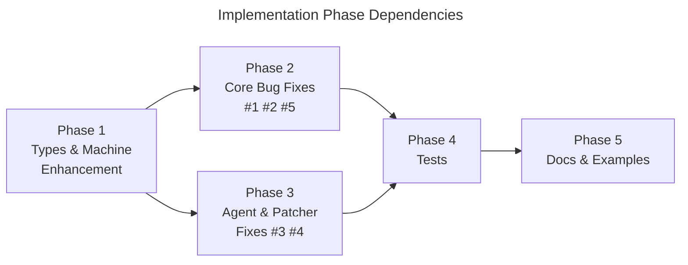

## Overview

Implement 5 bug fixes (snapshot fetch bypass, onQueryStarted dead code, SWR error masking, Patcher consistency violation, $cacheDataLoaded hang), one enhancement (lastError on MachineSuccess), regression tests, documentation corrections/additions, and 4–5 interactive examples — all as designed in `02-design/`.

## Phase Map

## Phase Summary

| Phase | Name | Tasks | Dependencies | Complexity | Execution | Files |
|-------|------|-------|--------------|------------|-----------|-------|
| 1 | Types & Machine Enhancement | 4 | None | Medium | Sequential | 4 |
| 2 | Core Bug Fixes (#1, #2, #5) | 4 | Phase 1 | High | Sequential | 3 |
| 3 | Agent & Patcher Fixes (#3, #4) | 2 | Phase 1 | Medium | Parallel with Phase 2 | 2 |
| 4 | Tests | 5 | Phases 2, 3 | High | Sequential | 7 |
| 5 | Docs & Examples | 5 | Phase 4 | Medium | Sequential | 9+ |

## Execution Rules

- Phases without dependencies on incomplete phases may be executed in parallel (Phases 2 and 3 are parallel).
- Sequential phases require verification before proceeding.
- Every phase must leave the project in a compilable state (`npm run ts-check` passes).
- Phase 4 (Tests) requires both Phases 2 and 3 to be complete — tests validate corrected behavior.
- Phase 5 (Docs & Examples) requires Phase 4 — docs describe tested, verified behavior.

## Quality Review

> Re-reviewed 2026-03-29 after Redraft Round 1 fixes. Previous REVIEW.md issues verified resolved.

### Checklist
| # | Criterion | Status | Notes |
|---|-----------|--------|-------|
| 1 | Every design component mapped to task(s) | PASS | ADR-1→Tasks 1.4,2.1,2.2,4.1; ADR-2→Tasks 2.3,4.2; ADR-3→Tasks 3.1,4.3; ADR-4→Tasks 3.2,4.4; ADR-5→Tasks 2.4,4.4,4.5; ADR-6→Tasks 1.1,1.2,1.3,3.1,4.3,4.4; ADR-7→Tasks 5.1,5.2,5.3; ADR-8→Tasks 5.4,5.5; ADR-9→Phase 4; ADR-10→phase structure. All 10 ADRs covered. |
| 2 | File paths concrete and verified | PASS | All source paths verified via directory listing: `MachineSuccess.ts`, `MachineRefreshing.ts`, `machine.types.ts`, `ResourceV2CacheEntry.ts`, `ResourceV2.ts`, `ResourceV2Agent.ts`, `Patcher.ts`, `LifecycleHooks.ts`. All test files confirmed: `Machine.test.ts`, `Patcher.test.ts`, `ResourceV2CacheEntry.test.ts`, `ResourceV2Agent.test.ts`, `LifecycleHooks.test.ts`, `type-level.test.ts`, 6 integration test files. Doc files: 4 in `docs/query-v2/`. Demo dir `apps/demos/src/examples/query-v2/` exists with `index.ts` + 3 existing examples. New example files are creates, not edits. |
| 3 | Phase dependencies correct | PASS | P1→P2, P1→P3 (types before code), P2→P4, P3→P4 (code before tests), P4→P5 (tests before docs). No circular dependencies. P2‖P3 parallelism valid — both depend only on P1, modify disjoint files (`ResourceV2CacheEntry.ts`/`ResourceV2.ts`/`LifecycleHooks.ts` vs `ResourceV2Agent.ts`/`Patcher.ts`). Mermaid graph matches. |
| 4 | Verification criteria per phase | PASS | Each phase file includes a verification checklist. All start with `npm run ts-check` and `npx vitest run src/query-v2/`. |
| 5 | Each phase leaves project compilable | PASS | Phase 1: additive type-only changes (optional fields, parameter rename). Phase 2/3: backward-compatible implementation changes. Phase 4: test additions only. Phase 5: docs + new example files. All verifications begin with `npm run ts-check`. |
| 6 | No vague tasks — exact files and changes | PASS | All 20 tasks specify exact files, exact fields/methods, and concrete change descriptions. No "improve X" or "refactor Y" language. |
| 7 | Design traceability (`[ref: ...]`) on all tasks | PASS | All tasks 1.1–5.5 have `[ref: ../02-design/...]` tags. Previously missing ref on Task 5.5 now present: `[ref: ../02-design/07-docs.md#3]`. |
| 8 | Parallel/sequential correctly marked | PASS | P1: Sequential (no deps). P2: Sequential (dep P1). P3: Parallel with P2 (dep P1, disjoint files). P4: Sequential (deps P2+P3). P5: Sequential (dep P4). Intra-phase modes appropriate. |
| 9 | Complexity estimates present (L/M/H) | PASS | Phase Summary table has per-phase complexity. All individual tasks (1.1–5.5) include per-task `**Complexity**: Low/Medium/High`. Previously missing — now resolved. |
| 10 | Documentation tasks proportional to existing docs/demos | PASS | Existing: 4 doc files in `docs/query-v2/`, 3 examples in `apps/demos/src/examples/query-v2/`. Planned: fix 3 factual errors, add 2 sections (~½ page each), create 4–5 examples. Proportional to 5-bug+1-enhancement scope. |
| 11 | Mermaid dependency graph present | PASS | Present in Phase Map section. Shows P1→P2→P4→P5 and P1→P3→P4 correctly. |
| 12 | Phase summary table complete | PASS | Table includes Phase, Name, Tasks, Dependencies, Complexity, Execution, Files columns. All 5 phases listed. |

### Documentation Proportionality
Existing documentation: 4 files (`README.md`, `devtools.md`, `optimistic-updates.md`, `ssr.md`). Existing demos: 3 examples (`simple-resource`, `optimistic-patches`, `ssr-snapshot`). Planned changes: fix 3 factual errors in existing docs, add 2 focused sections to README (~½ page each), create 4–5 minimal interactive examples. Proportional to a 5-bug+1-enhancement scope. Not over-specified (no full doc rewrite, no migration guide) and not under-specified (all factual errors addressed, key new behaviors documented).

### Issues Found
No issues found.

## Next Steps

Proceeds to implementation after human review.

After approval, proceeds to Implementation stage (04-implement).
