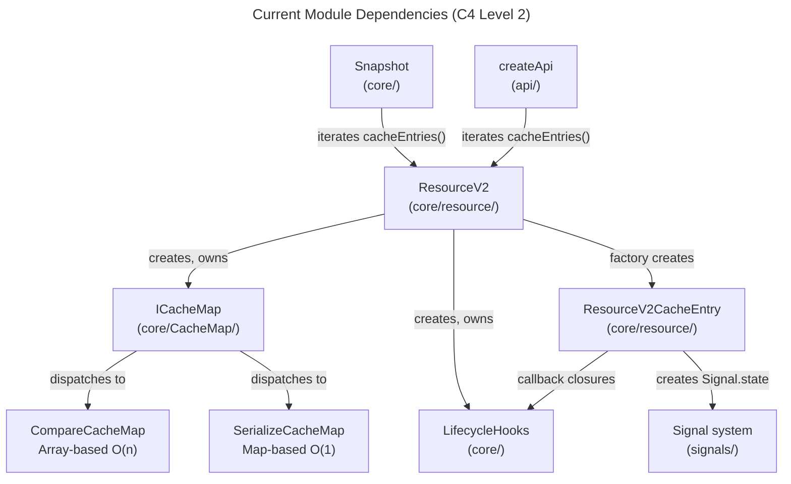
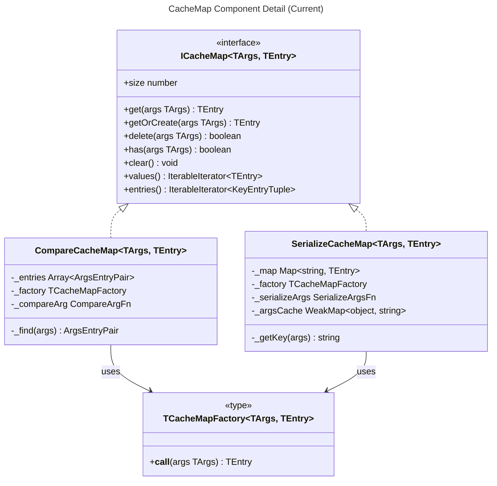
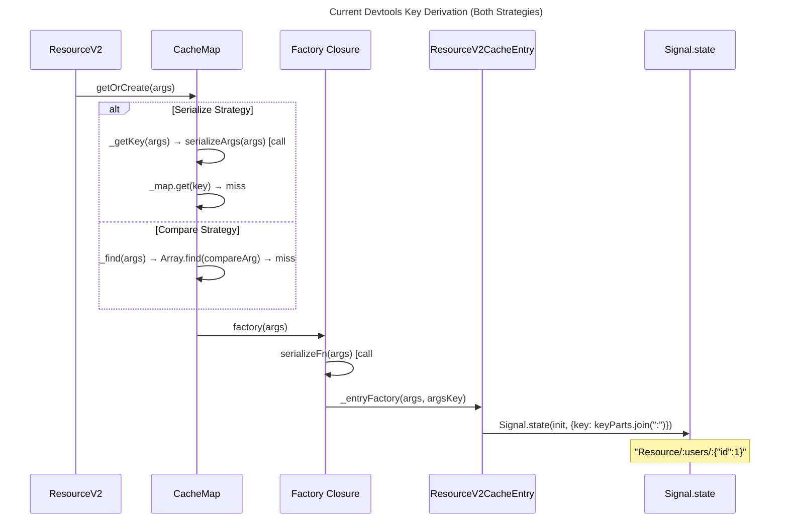
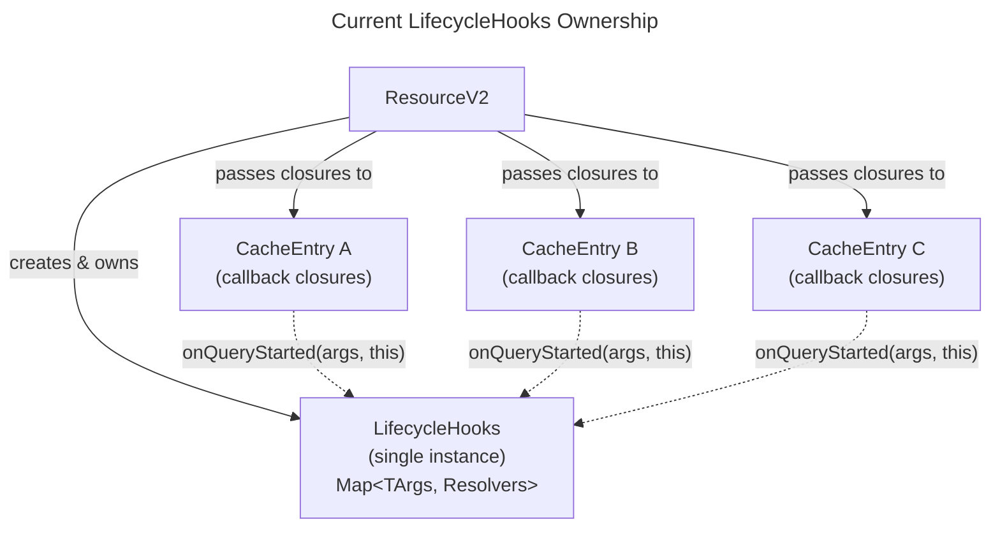
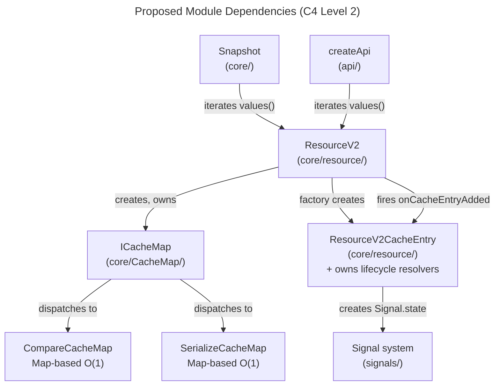
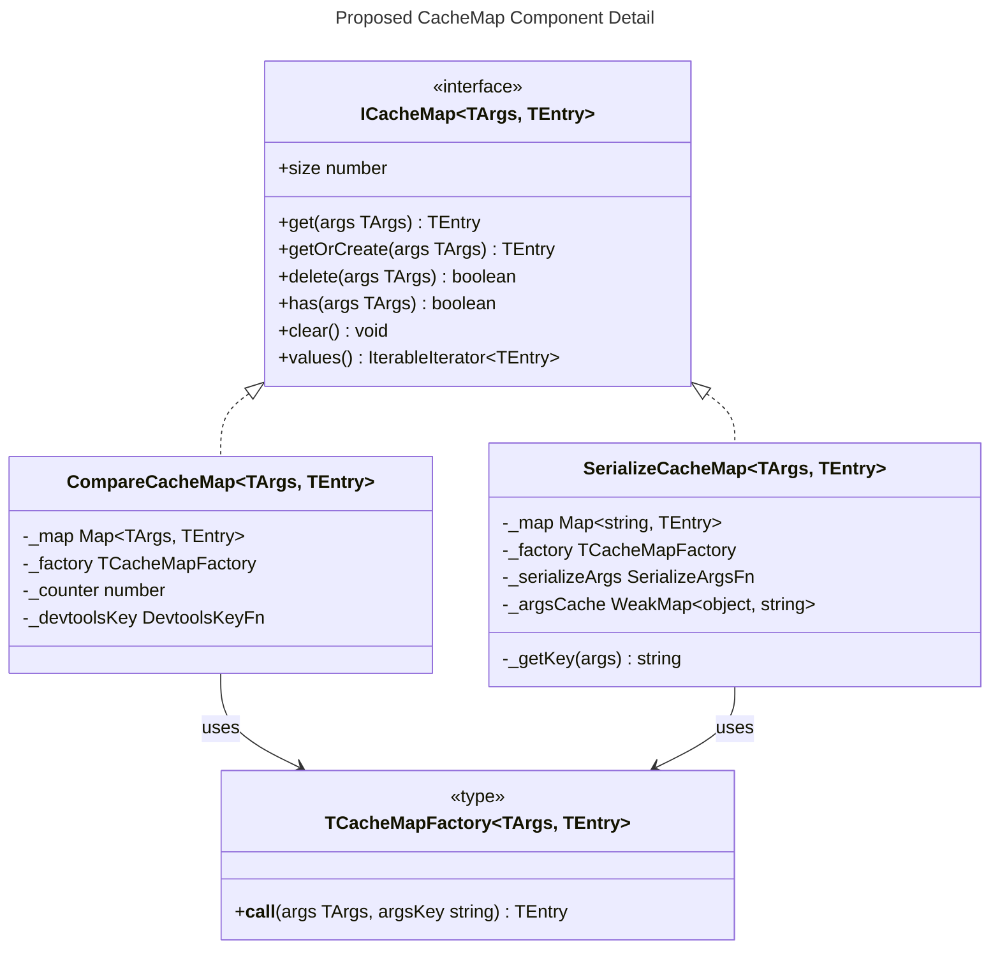
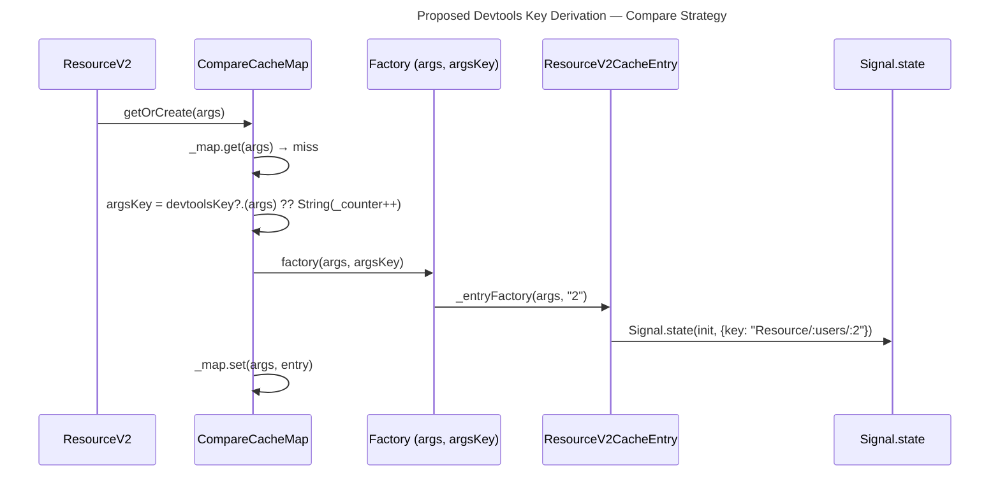
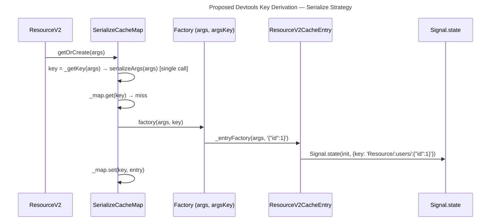
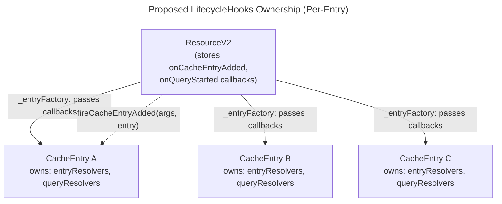
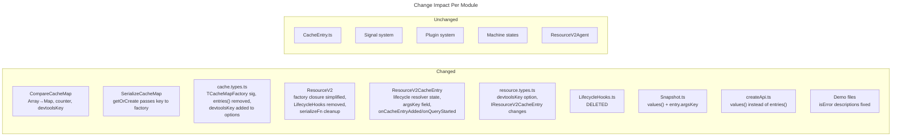

# System Architecture

## 1. Overview

This document designs the architectural changes for six problems in `query-v2`, organized into three change areas:

- **Area A** — CacheMap + Devtools Keys (problems #1–#4)
- **Area B** — LifecycleHooks ownership (problem #5)
- **Area C** — Demo fixes (problem #6)

All changes are internal to `query-v2`. The plugin system is confirmed orthogonal to LifecycleHooks and requires no changes [ref: ../01-research/01-codebase-analysis.md#Area C].

---

## 2. Current Architecture (Before)

### 2.1 C4 Level 2 — Module Dependencies (Current)



### 2.2 C4 Level 3 — CacheMap Component Detail (Current)



### 2.3 Factory Closure and Devtools Key Flow (Current)

The factory closure in `ResourceV2` constructor unconditionally calls `serializeFn(args)` for devtools key derivation, regardless of cache strategy [ref: ../01-research/01-codebase-analysis.md#Area B]:



### 2.4 LifecycleHooks Ownership (Current)



**Problem**: All entries share one `LifecycleHooks` instance. `_queryResolvers.set(args, ...)` overwrites prior unresolved promises for the same args reference [ref: ../01-research/04-problem-analysis-lifecycle-demos.md#Problem #5].

---

## 3. Proposed Architecture (After)

### 3.1 C4 Level 2 — Module Dependencies (Proposed)



Key differences from current:
- **`LifecycleHooks` class is removed** — resolver state lives in `ResourceV2CacheEntry`
- **`entries()` removed from ICacheMap** — consumers use `values()` instead
- **Factory signature changed** — CacheMap passes `argsKey` to factory

### 3.2 C4 Level 3 — CacheMap Component Detail (Proposed)



---

## 4. Area A — CacheMap + Devtools Keys (Problems #1–#4)

### 4.1 CompareCacheMap Redesign (Problems #1, #2)

**Current state**: `Array<{args, entry}>` with `Array.find`/`findIndex` — O(n) per access [ref: ../01-research/02-problem-analysis-cache.md#Problem #1]. `doCacheArgs` silently ignored [ref: ../01-research/02-problem-analysis-cache.md#Problem #2].

**Proposed state**: `Map<TArgs, TEntry>` with reference-identity keys — O(1) per access.

#### What changes

| Aspect | Current | Proposed |
|--------|---------|----------|
| Internal data structure | `Array<{args, entry}>` | `Map<TArgs, TEntry>` |
| Lookup | `Array.find(compareArg)` — O(n) | `Map.get(args)` — O(1) reference identity |
| Delete | `findIndex` + `splice` — O(n+n) | `Map.delete(args)` — O(1) |
| `compareArg` dependency | Used for every lookup | **Removed** — no comparison function |
| `doCacheArgs` | Silently ignored | Not applicable (`Map` is inherently O(1)) |
| Devtools key | `serializeFn(args)` | Monotonic counter or user-provided `devtoolsKey` |

#### Semantic change: reference identity replaces structural comparison

The `Map<TArgs, TEntry>` uses `===` for key identity. This means:

- **Same reference** → O(1) hit (the common case in React where args are memoized via `useMemo` or stable references)
- **Different reference, same structure** → cache miss → new entry created

This is a deliberate semantic change. The current `compareArg` default (`shallowEqual`) would find structurally-equal args. With `Map`, callers must ensure reference stability for cache hits. This aligns with the user feedback: "Давай сделаем проще — просто Map" [ref: ../01-research/05-open-questions.md#Q1].

#### `compareArg` removal from CompareCacheMap

The `compareArg` option is no longer read by `CompareCacheMap`. It remains on `ICacheMapOptions` for backward compatibility (the type is a union used by both strategies), but `CompareCacheMap` ignores it. The `ResourceV2` class still stores `compareArgsFn` for use in `ResourceV2Agent` and `ResourceV2CacheEntry.isMyArgs()` — these are unrelated to cache lookup.

#### `entries()` removal from ICacheMap

**Consumer audit** — three consumers of `entries()` via `ResourceV2.cacheEntries()`:

| Consumer | Location | Usage | Migration |
|----------|----------|-------|-----------|
| `Snapshot.getSnapshot()` | `@/query-v2/core/Snapshot.ts:22` | Iterates `[key, entry]` — uses `key` (string) for snapshot keys, throws if `typeof key !== "string"` (compare strategy) | Change to iterate `values()`, obtain snapshot key from entry's `argsKey` field (new) |
| `createApi` stale check | `@/query-v2/api/createApi.ts:112` | Iterates `[, entry]` — ignores key, only reads entry | Change to `values()` — drop required |
| `ResourceV2.resetCache()` | `@/query-v2/core/resource/ResourceV2.ts:108` | Uses `values()` already | No change needed |

`Snapshot.getSnapshot()` is the only consumer that needs the key. Since it already throws for compare strategy (non-string keys), it only works with serialize strategy. The serialized key can be obtained by adding an `argsKey` getter to `ResourceV2CacheEntry` (populated from the factory's `argsKey` parameter). This is more direct than routing through `entries()`.

**Decision**: Remove `entries()` from `ICacheMap`. Add `readonly argsKey: string` to `ResourceV2CacheEntry`. Snapshot uses `values()` + `entry.argsKey`.

### 4.2 Factory Signature Change (Problems #3, #4)

**Current**: `TCacheMapFactory<TArgs, TEntry> = (args: TArgs) => TEntry` [ref: ../01-research/01-codebase-analysis.md#Area A].

**Proposed**: `TCacheMapFactory<TArgs, TEntry> = (args: TArgs, argsKey: string) => TEntry`

This change allows each `CacheMap` implementation to pass its naturally-derived key:

- **`SerializeCacheMap.getOrCreate`**: already computes `const key = this._getKey(args)` — passes `key` as `argsKey` to factory. **Eliminates serialization call #2** from the `ResourceV2` factory closure [ref: ../01-research/03-problem-analysis-devtools.md#Problem #4].
- **`CompareCacheMap.getOrCreate`**: derives `argsKey` from its monotonic counter or user-provided `devtoolsKey` function, passes to factory. **Eliminates `serializeFn` call** for compare strategy [ref: ../01-research/03-problem-analysis-devtools.md#Problem #3].

#### Impact on ResourceV2 constructor

The factory closure simplifies:

```typescript
// CURRENT (ResourceV2.ts:51)
factory: (args) => this._entryFactory(args, serializeFn(args))

// PROPOSED
factory: (args, argsKey) => this._entryFactory(args, argsKey)
```

`serializeFn` is no longer called inside the factory closure. For serialize strategy, `serializeFn` is still passed to `SerializeCacheMap` via `serializeArgs` option — it is called once inside `_getKey()`. For compare strategy, `serializeFn` is not used at all.

### 4.3 Devtools Key for Compare Strategy (Problem #3)

**New option**: `devtoolsKey?: (args: TArgs) => string` on `TResourceV2Options`.

- **Applies only to compare strategy**. When `keyStrategy === "serialize"`, this option is ignored (the serialized key is always used).
- **Default**: Monotonic counter. `CompareCacheMap` maintains a private `_counter: number = 0`, incremented on each `getOrCreate` miss. Produces keys like `"0"`, `"1"`, `"2"`.
- **User override**: When `devtoolsKey` is provided, `CompareCacheMap` calls `devtoolsKey(args)` instead of using the counter.

The option flows from `TResourceV2Options` → `ICacheMapOptions` (new field) → `CompareCacheMap` constructor.

#### Devtools key derivation flow (Proposed — Compare Strategy)



#### Devtools key derivation flow (Proposed — Serialize Strategy)



**Key observation**: Serialization happens exactly once per new entry in serialize strategy (inside `_getKey`), and zero times in compare strategy. The `ResourceV2` factory closure no longer calls `serializeFn`.

### 4.4 ICacheMapOptions Changes

```typescript
// PROPOSED ICacheMapOptions
export interface ICacheMapOptions<TArgs, TEntry> {
    factory: TCacheMapFactory<TArgs, TEntry>;  // signature changed: (args, argsKey) => TEntry
    keyStrategy: "serialize" | "compare";
    serializeArgs?: (args: TArgs) => string;
    compareArg?: (a: TArgs, b: TArgs) => boolean;  // kept for type compat, ignored by CompareCacheMap
    doCacheArgs?: boolean;                          // serialize strategy only (unchanged)
    devtoolsKey?: (args: TArgs) => string;          // new — compare strategy only
}
```

---

## 5. Area B — LifecycleHooks Ownership (Problem #5)

### 5.1 Design Rationale

The current `LifecycleHooks` class manages resolver state in `Map<TArgs, Resolvers>` with `===` identity. This causes:
- Silent overwrite of unresolved `$queryFulfilled` promises when `fireQueryStarted` is called twice for the same args [ref: ../01-research/04-problem-analysis-lifecycle-demos.md#Problem #5]
- Incorrect semantics for `void`-args resources where all operations collapse to one Map key
- Inability to distinguish multiple concurrent entries with referentially-distinct but structurally-equal args

Per user feedback: "Каждая ResourceV2CacheEntry самостоятельно вызывает хуки" [ref: ../01-research/05-open-questions.md#Q4].

### 5.2 Proposed Ownership Model



### 5.3 What Changes

| Aspect | Current | Proposed |
|--------|---------|----------|
| `LifecycleHooks` class | Exists, owned by `ResourceV2` | **Eliminated** |
| Resolver state | `Map<TArgs, EntryResolvers>` in shared class | `EntryResolvers` fields directly on `ResourceV2CacheEntry` |
| `fireQueryStarted` | Shared class, overwrites resolver for same args | Per-entry method, each entry tracks its own resolver |
| `fireCacheEntryAdded` | Called on shared class with args | Called directly from `ResourceV2._entryFactory` — creates resolvers on the entry, invokes `onCacheEntryAdded` callback |
| `clearAll()` | Single call on shared class | `ResourceV2.resetCache()` already iterates `values()` → each `entry.complete()` cleans up its own resolvers |
| `fireQueryStarted` concurrent calls on same entry | Prior `$queryFulfilled` promise silently leaked | Prior `$queryFulfilled` promise is rejected (or resolved) before new one is created |

### 5.4 ResourceV2CacheEntry — New Lifecycle Responsibilities

`ResourceV2CacheEntry` gains the following internal state (previously in `LifecycleHooks`):

- `_entryDataLoaded: PromiseResolver<TData> | null` — resolves when first `MachineSuccess` is reached
- `_entryRemoved: PromiseResolver<void> | null` — resolves on `complete()`
- `_queryFulfilled: PromiseResolver<{data: TData}> | null` — resolves/rejects when current query completes
- `_onCacheEntryAdded: TOnCacheEntryAdded<TArgs, TData> | undefined` — callback from resource options
- `_onQueryStarted: TOnQueryStarted<TArgs, TData> | undefined` — callback from resource options

The entry controls the full lifecycle:

1. **Construction**: If `onCacheEntryAdded` callback exists, create `_entryDataLoaded` + `_entryRemoved` resolvers, invoke callback with tools `{ $cacheDataLoaded, $cacheEntryRemoved }`
2. **`_doFetch` start**: If `onQueryStarted` callback exists, reject any leftover `_queryFulfilled`, create new resolver, invoke callback with tools `{ $queryFulfilled, getCacheEntry }`
3. **`_doFetch` success**: Resolve `_entryDataLoaded` (first time only), resolve `_queryFulfilled`
4. **`_doFetch` error**: Reject `_queryFulfilled`
5. **`complete()`**: Reject `_entryDataLoaded` (if unresolved), resolve `_entryRemoved`, reject `_queryFulfilled` (if pending)

### 5.5 ResourceV2._entryFactory — Simplified

The factory no longer creates closures to a shared `LifecycleHooks`. Instead, it passes the callbacks directly to the entry:

```typescript
// CURRENT factory (closures to shared LifecycleHooks)
onDataLoaded: (a, data) => this._lifecycleHooks.resolveDataLoaded(a, data),
onQueryStarted: (a, entry) => this._lifecycleHooks.fireQueryStarted(a, entry),
onQueryFulfilled: (a, result) => this._lifecycleHooks.resolveQueryFulfilled(a, result),

// PROPOSED factory (direct callback references)
onCacheEntryAdded: this._onCacheEntryAdded,  // from resource options
onQueryStarted: this._onQueryStarted,         // from resource options
```

The entry's constructor fires `onCacheEntryAdded` itself (after setting up resolvers). The entry's `_doFetch` fires `onQueryStarted` itself (after setting up query resolvers).

`ResourceV2._entryFactory` no longer calls `this._lifecycleHooks.fireCacheEntryAdded(...)` — the entry does this internally.

### 5.6 Plugin System Impact

The plugin system is confirmed orthogonal to LifecycleHooks [ref: ../01-research/01-codebase-analysis.md#Area C]. `ReactHooksPlugin` does not import, reference, or invoke any lifecycle symbols. `IPlugin.augmentResource` receives the resource post-construction and contributes methods — no lifecycle access. **No plugin changes required**.

### 5.7 Snapshot / Hydration Impact

`ResourceV2.hydrateEntry()` calls `this._cache.getOrCreate(args)` which triggers the factory. The factory creates a `ResourceV2CacheEntry` with `initialMachine` set. If `onCacheEntryAdded` is configured, it will fire for hydrated entries — same as current behavior. `$cacheDataLoaded` will resolve immediately if the initial machine is `MachineSuccess` (hydrated state). No special handling needed.

---

## 6. Area C — Demo Fixes (Problem #6)

### 6.1 Problem Summary

All 8 query-v2 demo examples display `isError: false` at all times. The root cause: queryFns that succeed on the first call mean all subsequent errors occur during `refreshing`, producing `MachineSuccess` with `lastError` (SWR semantics), not `MachineError` [ref: ../01-research/04-problem-analysis-lifecycle-demos.md#Problem #6].

Per user feedback: "Исправить ложное описание и поведение UI (логику менять не нужно)" [ref: ../01-research/05-open-questions.md#Q8].

### 6.2 Files Requiring Changes

| File | Current Issue | Fix |
|------|---------------|-----|
| `error-swr-states.tsx` | UI displays `isError: {String(state.isError)}` with conditional error banner that never renders; description implies error state is reachable | Update description/comments to explain SWR semantics: errors during refresh keep `isError: false`, error data is in `lastError`. Remove or relabel the unreachable error banner. |
| `lifecycle-hooks.tsx` | Same `isError` display that never shows `true` | Update description to clarify `isError` stays `false` under SWR. Adjust or remove conditional error banner. |
| `basic-query.tsx` | Displays `isError: {String(state.isError)}` — never errors | Remove `isError` display or add comment explaining it is always `false` for this example. |
| `optimistic-patches.tsx` | Early return `if (state.isError)` that never triggers | Remove unreachable early return or add comment. |
| `ssr-snapshot.tsx` | `{state.isError && (...)}` that never renders | Remove unreachable conditional block or add comment. |

**queryFn logic is NOT changed** in any demo file.

### 6.3 What "correct behavior description" means

For `error-swr-states.tsx`: The demo demonstrates **SWR error recovery**, not "error state." After the first successful fetch, subsequent errors during refreshing preserve stale data with `lastError` set. `isError` remains `false` because the machine stays in `MachineSuccess`. The UI should show `lastError` (available via `state.error`) instead of `isError`, and the description should explain this SWR behavior.

For `lifecycle-hooks.tsx`: The demo demonstrates lifecycle hook callbacks. The `isError` display is incidental and misleading. It should either be removed or labeled as "always false in this example due to SWR semantics."

---

## 7. Component Boundaries — Change Summary

### 7.1 What Changes in Each Module



### 7.2 Detailed Change Matrix

| Module | File(s) | Changes | Stays Same |
|--------|---------|---------|------------|
| CompareCacheMap | `CompareCacheMap.ts` | Internal: `Array` → `Map`. Removes `_compareArg`, `_find`. Adds `_counter`, `_devtoolsKey`. `getOrCreate` passes `argsKey` to factory. | External API shape (get/getOrCreate/delete/has/clear/size/values) |
| SerializeCacheMap | `SerializeCacheMap.ts` | `getOrCreate` passes computed `key` to `factory(args, key)`. | All other methods, `_getKey`, `doCacheArgs` WeakMap |
| ICacheMap | `cache.types.ts` | `entries()` removed. `TCacheMapFactory` signature `(args, argsKey) => TEntry`. `devtoolsKey` added to `ICacheMapOptions`. | `get`, `getOrCreate`, `delete`, `has`, `clear`, `size`, `values` |
| ResourceV2 | `ResourceV2.ts` | Factory closure simplified (no `serializeFn` call). `_lifecycleHooks` field removed. Passes `onCacheEntryAdded`/`onQueryStarted` to entry. `cacheEntries()` → **removed** (or returns `values()` wrapper). `devtoolsKey` option forwarded. | `_queryFn`, `_compareArgsFn`, `_cacheLifetime`, `_key`, `createAgent`, `query`, `getEntry`, `invalidate`, `subscribe`, `hydrateEntry`, `hasEntry` |
| ResourceV2CacheEntry | `ResourceV2CacheEntry.ts` | Gains `_entryDataLoaded`, `_entryRemoved`, `_queryFulfilled` resolvers. Gains `argsKey` readonly field. Constructor fires `onCacheEntryAdded`. `_doFetch` fires `onQueryStarted`, resolves/rejects `_queryFulfilled`. `complete()` cleans up resolvers. | Query logic, abort management, optimistic patches, machine transitions |
| LifecycleHooks | `LifecycleHooks.ts` | **Deleted entirely** | — |
| Snapshot | `Snapshot.ts` | Uses `resource.values()` + `entry.argsKey` instead of `resource.cacheEntries()` | Snapshot format, hydration |
| createApi | `createApi.ts` | Uses `resource.values()` instead of `resource.cacheEntries()` | All other createApi logic |
| Demos | 5 files in `apps/demos/` | Description/UI fixes for `isError` | queryFn logic, component structure |

---

## 8. Preliminary ADRs

These are preliminary decisions — formal ADR detail will be produced in Phase 4.

### ADR-1: CompareCacheMap Map<TArgs, TEntry> with Reference Identity

**Status**: Proposed  
**Context**: `CompareCacheMap` uses `Array.find` with `compareArg` — O(n) per access [ref: ../01-research/02-problem-analysis-cache.md#Problem #1]. User feedback: "просто Map" [ref: ../01-research/05-open-questions.md#Q1].  
**Decision**: Replace with `Map<TArgs, TEntry>`. Remove `compareArg` from `CompareCacheMap`. Reference identity (`===`) replaces structural comparison.  
**Consequences**: Callers using compare strategy must ensure args reference stability for cache hits. `compareArg` remains on `ICacheMapOptions` type for backward compatibility but is unused by `CompareCacheMap`.

### ADR-2: TCacheMapFactory Signature Change

**Status**: Proposed  
**Context**: Factory closure calls `serializeFn(args)` unconditionally — double serialization for serialize strategy, unnecessary serialization for compare strategy [ref: ../01-research/03-problem-analysis-devtools.md#Problem #3, Problem #4].  
**Decision**: Change `TCacheMapFactory` to `(args: TArgs, argsKey: string) => TEntry`. Each CacheMap passes its derived key.  
**Consequences**: Internal type change. `query-v2` is unreleased, so no external breakage [ref: ../01-research/05-open-questions.md#Q5].

### ADR-3: Monotonic Counter as Default Devtools Key for Compare Strategy

**Status**: Proposed  
**Context**: Compare strategy uses `stableStringify` for devtools keys — semantic mismatch for non-serializable args [ref: ../01-research/03-problem-analysis-devtools.md#Problem #3].  
**Decision**: Default devtools key is `String(counter++)`. New `devtoolsKey` option on `TResourceV2Options` for override. Serialize strategy is unaffected.  
**Consequences**: Devtools keys for compare strategy change from `'{"id":1}'` to `"0"`, `"1"`, etc. Counter is monotonically increasing (no reuse after deletion).

### ADR-4: entries() Removal from ICacheMap

**Status**: Proposed  
**Context**: `entries()` has union return type `[string | TArgs, TEntry]`. User feedback: "entries() вообще не нужен" [ref: ../01-research/05-open-questions.md#Q9]. Only two downstream consumers exist; both can migrate to `values()`.  
**Decision**: Remove `entries()` from `ICacheMap`. Add `argsKey: string` to `ResourceV2CacheEntry` for `Snapshot` usage.  
**Consequences**: `ResourceV2.cacheEntries()` is removed or changed to return `values()`. Tests for `entries()` in `CacheMap.test.ts` are updated.

### ADR-5: LifecycleHooks Eliminated — Per-Entry Resolvers

**Status**: Proposed  
**Context**: Shared `LifecycleHooks` with `Map<TArgs, Resolvers>` causes cross-entry interference [ref: ../01-research/04-problem-analysis-lifecycle-demos.md#Problem #5]. User feedback: "каждая ResourceV2CacheEntry самостоятельно вызывает хуки" [ref: ../01-research/05-open-questions.md#Q4].  
**Decision**: Delete `LifecycleHooks.ts`. `ResourceV2CacheEntry` owns `EntryResolvers` and `QueryResolvers`. `ResourceV2` passes callback references directly.  
**Consequences**: Entry constructor and `_doFetch` gain lifecycle responsibility. `ResourceV2.resetCache()` relies on `entry.complete()` for cleanup (already iterates entries). Plugin system unaffected.

### ADR-6: Demo isError Fixes — Description Only

**Status**: Proposed  
**Context**: All demos display `isError: false` misleadingly [ref: ../01-research/04-problem-analysis-lifecycle-demos.md#Problem #6]. User feedback: "Исправить ложное описание; логику менять не нужно" [ref: ../01-research/05-open-questions.md#Q8].  
**Decision**: Fix UI descriptions and remove unreachable error banners. Do not change queryFn logic.  
**Consequences**: `error-swr-states.tsx` becomes a "SWR error recovery" demo showing `lastError`, not `isError`. Other demos remove misleading `isError` display.

---

## 9. Open Items for Subsequent Design Phases

- **Data flow** (Phase 2): Detailed reactive chains for lifecycle resolver state within entries. State transitions for `_queryFulfilled` resolver lifecycle (create → resolve/reject → recreate on refetch).
- **Domain model** (Phase 3): TypeScript type definitions for new `IResourceV2CacheEntryOptions` with lifecycle callbacks, `TCacheMapFactory` new signature, `ICacheMapOptions` with `devtoolsKey`.
- **Decisions** (Phase 4): Formalize all 6 ADRs with full options analysis and consequences.
- **Use cases** (Phase 5): React hook integration patterns with reference-stable args. Hydration with lifecycle hooks. Demo fix examples.
