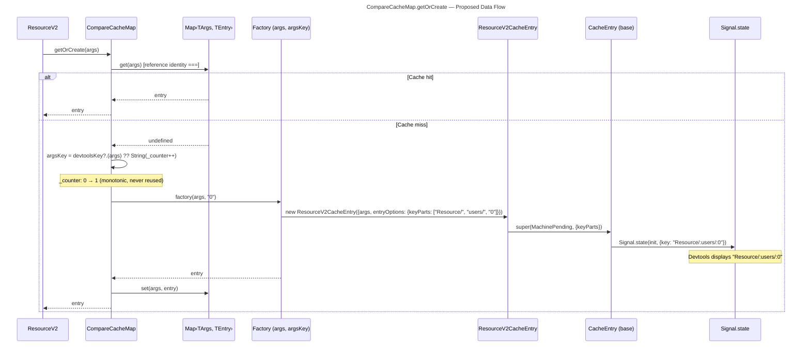
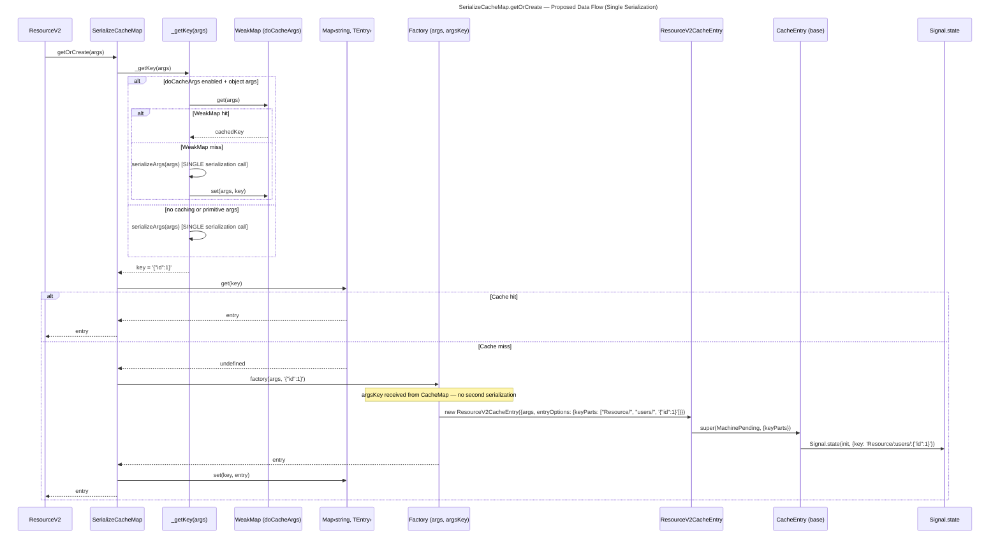
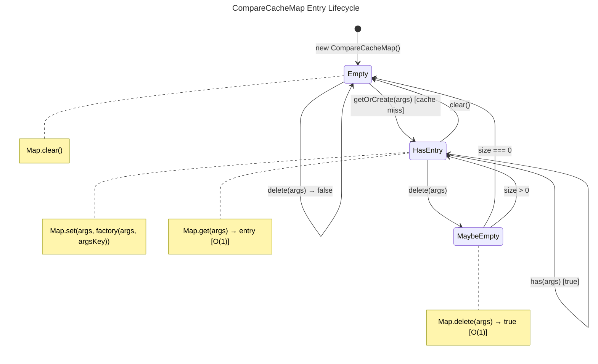
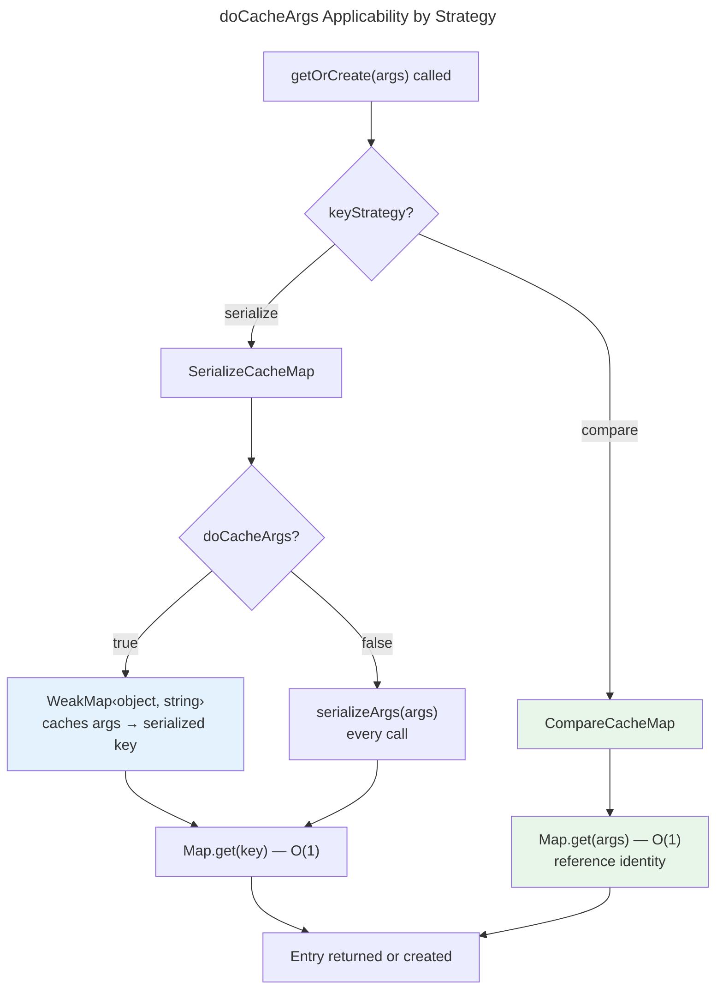
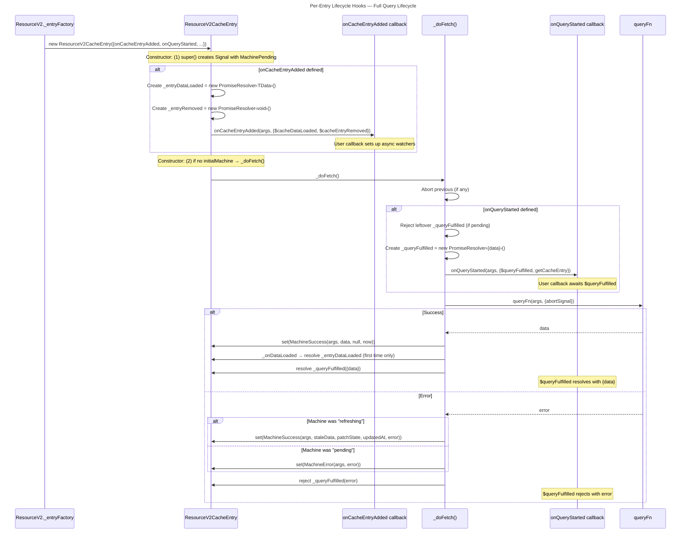
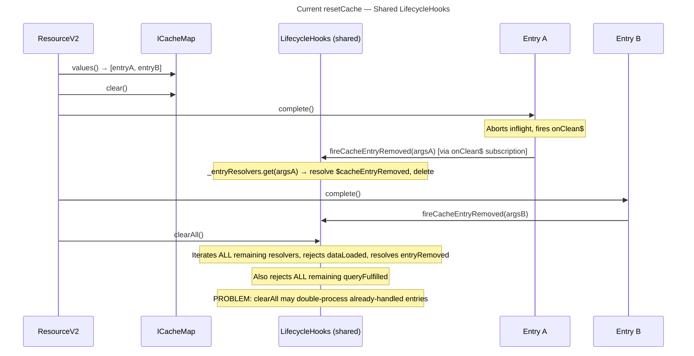
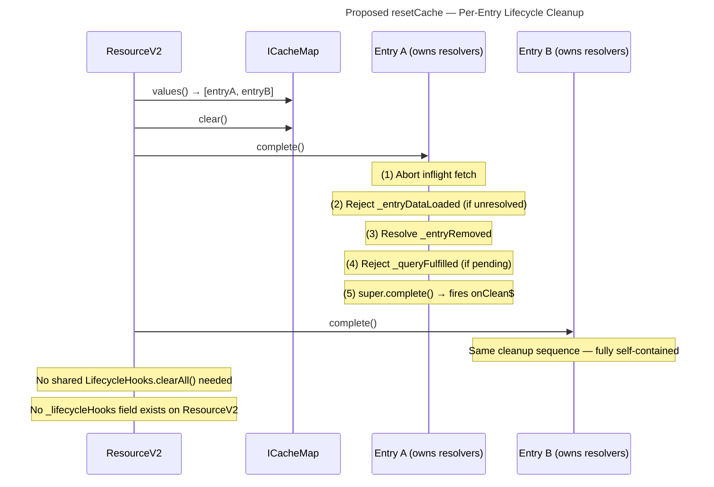
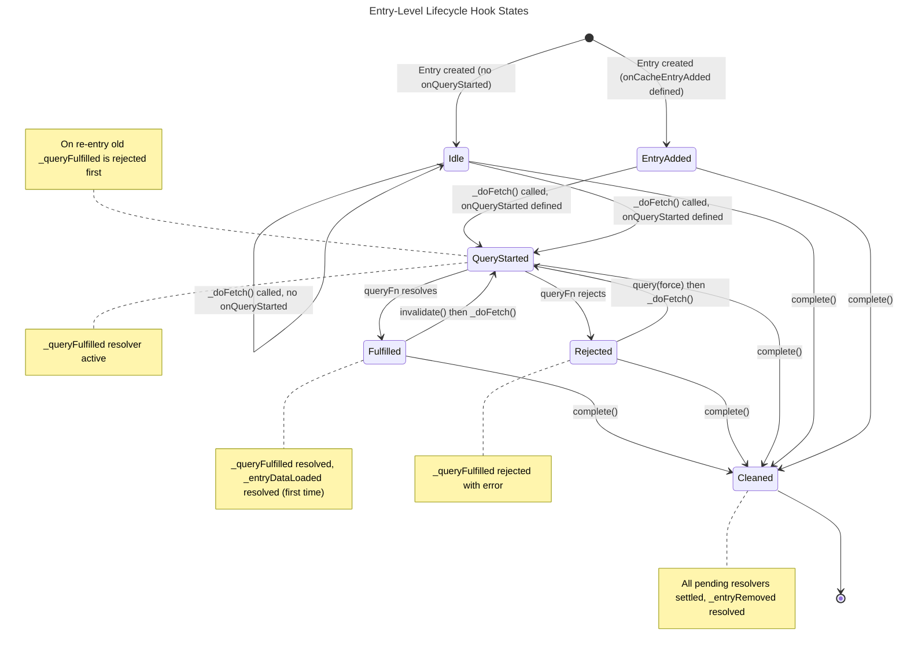
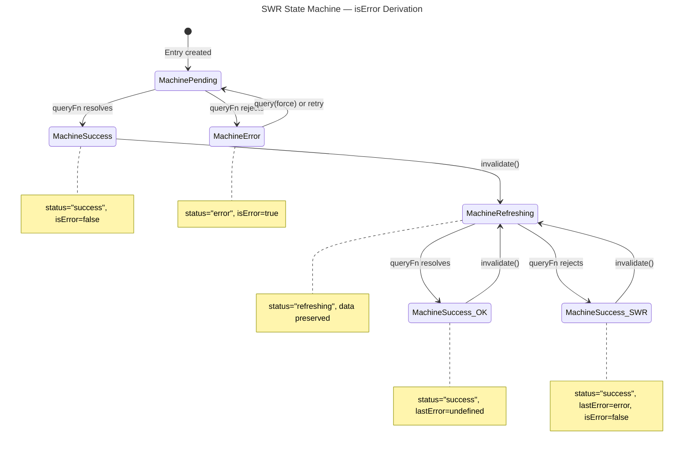
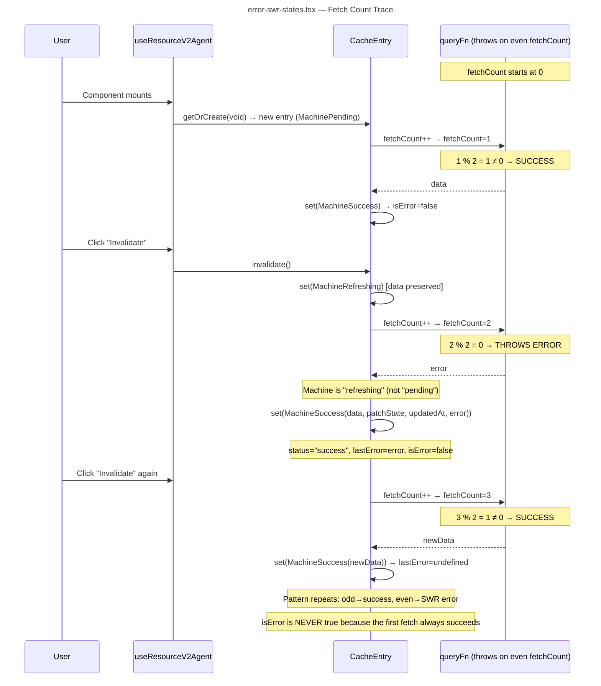

# Data Flow

## 1. Area A — CacheMap Data Flow

### 1.1 CompareCacheMap: getOrCreate with Monotonic Counter

The proposed `CompareCacheMap` uses `Map<TArgs, TEntry>` with reference-identity keys. On a cache miss, it derives `argsKey` from a monotonic counter (or user-provided `devtoolsKey`), then passes `(args, argsKey)` to the factory. The factory creates a `ResourceV2CacheEntry` whose `CacheEntry` base class creates `Signal.state` with `keyParts.join(":")` as the devtools key [ref: ../01-research/01-codebase-analysis.md#Area B].

Key properties:
- **Zero serialization calls** — the compare strategy never invokes `serializeFn` or `stableStringify` [ref: ../01-research/03-problem-analysis-devtools.md#Problem #3]
- **Counter is per-CompareCacheMap instance** — each resource's cache has its own counter starting at 0
- **Counter increments on miss only** — `get`, `has`, `delete` do not increment the counter
- **Deleted entries' counter values are not reused** — if entry "0" is deleted and a new entry created, it gets "1" (or the next counter value), ensuring unique devtools keys over the lifetime of the resource

### 1.2 SerializeCacheMap: getOrCreate — Single Serialization

The proposed `SerializeCacheMap` passes its already-computed serialized key to the factory as `argsKey`, eliminating the redundant second serialization call [ref: ../01-research/03-problem-analysis-devtools.md#Problem #4].

**Comparison with current (problem #4)**:
- **Current**: `_getKey(args)` calls `serializeArgs(args)` (call #1), then factory closure calls `serializeFn(args)` again (call #2) — both produce the identical string [ref: ../01-research/03-problem-analysis-devtools.md#Exact Redundancy Locations]
- **Proposed**: `_getKey(args)` calls `serializeArgs(args)` (call #1), passes the result as `argsKey` to factory — factory uses `argsKey` directly, **zero additional serialization**

### 1.3 CompareCacheMap Entry Lifecycle — State Diagram

All Map operations — `get`, `set`, `delete`, `has`, `clear` — are O(1) amortized. Contrast with current: `_find` is O(n), `delete` is O(n) findIndex + O(n) splice [ref: ../01-research/02-problem-analysis-cache.md#Problem #1].

### 1.4 doCacheArgs: SerializeCacheMap vs CompareCacheMap

**SerializeCacheMap** (unchanged):
- `doCacheArgs: true` → `WeakMap<object, string>` memoizes `serializeArgs` result per args reference. Avoids re-serialization when the same object reference is passed repeatedly (common in React hooks) [ref: ../01-research/01-codebase-analysis.md#Area A]
- `doCacheArgs: false` (default) → `serializeArgs(args)` called on every `get`/`getOrCreate`/`has`/`delete`

**CompareCacheMap** (proposed):
- `doCacheArgs` is **not applicable** — `Map<TArgs, TEntry>` provides O(1) reference-identity lookup inherently. There is no serialization step to cache. The option is ignored if passed (same as current, but now deliberately so) [ref: ../01-research/05-open-questions.md#Q2]

---

## 2. Area B — LifecycleHooks Data Flow

### 2.1 Entry Creation → Hooks Setup → Query Lifecycle (Proposed)

Each `ResourceV2CacheEntry` owns its lifecycle resolver state. The entry constructor fires `onCacheEntryAdded` (creating `$cacheDataLoaded` and `$cacheEntryRemoved` resolvers), then `_doFetch` fires `onQueryStarted` (creating a `$queryFulfilled` resolver). All scoped to a single entry instance — no shared Map [ref: ../01-research/05-open-questions.md#Q4].

Compared to current architecture where callbacks are closures to a shared `LifecycleHooks` instance with `Map<TArgs, Resolvers>`, the proposed flow:
- **Eliminates args-keyed Map lookup** — resolvers are fields on the entry, not Map entries
- **Eliminates cross-entry interference** — `fireQueryStarted` on one entry cannot overwrite another entry's `$queryFulfilled`
- **Handles refetch correctly** — before creating a new `_queryFulfilled` resolver, the old one is explicitly rejected (prevents promise leak) [ref: ../01-research/04-problem-analysis-lifecycle-demos.md#Problem #5]

### 2.2 resetCache — Per-Entry Cleanup vs Shared clearAll

**Current flow** — shared `LifecycleHooks.clearAll()`:

**Proposed flow** — per-entry cleanup:

Key simplification: Each entry's `complete()` handles all its own lifecycle cleanup. `ResourceV2.resetCache()` simply iterates entries and calls `complete()` on each — no separate `clearAll()` call needed. This also eliminates the risk of double-processing resolvers (current `clearAll` may process entries that `fireCacheEntryRemoved` already handled) [ref: ../01-research/01-codebase-analysis.md#Area C].

### 2.3 Entry-Level Hook State Machine

Each entry's lifecycle resolver state follows a simple lifecycle scoped entirely to the entry instance:

**Transition rules**:
- `QueryStarted → QueryStarted` (refetch): The old `_queryFulfilled` promise is explicitly rejected before creating a new resolver. This prevents the silent overwrite and promise leak present in the current shared `LifecycleHooks._queryResolvers.set()` [ref: ../01-research/04-problem-analysis-lifecycle-demos.md#Problem #5]
- `EntryAdded`: `_entryDataLoaded` resolver is created once (in constructor). It resolves on first successful fetch. If the entry is completed before any success, it is rejected.
- `Cleaned`: Terminal state. All promises are settled. `_entryRemoved.resolve()` fires to signal the `$cacheEntryRemoved` promise.

---

## 3. Area C — Demo Data Flow

### 3.1 SWR State Machine: Why isError Stays false

The machine state transitions explain why `isError` is never `true` in the current demos. The key is that `isError` derives from `originalStatus === "error"`, which requires `MachineError` — only reachable from `MachinePending` [ref: ../01-research/04-problem-analysis-lifecycle-demos.md#Root cause].

### 3.2 error-swr-states.tsx Trace

Tracing the actual queryFn logic in `error-swr-states.tsx` [ref: ../01-research/04-problem-analysis-lifecycle-demos.md#1. error-swr-states.tsx]:

**Why the UI is misleading**: The demo displays `isError: {String(state.isError)}` which always shows `isError: false`. The conditional error banner `{state.isError && (...)}` never renders. The demo should instead show `lastError` (accessible via `state.error` when `state.isRefreshError` is true) to demonstrate the SWR error-recovery behavior [ref: ../01-research/04-problem-analysis-lifecycle-demos.md#Summary].

**Fix approach** (per user feedback — description only, no queryFn changes) [ref: ../01-research/05-open-questions.md#Q8]:
- Replace `isError` display with `isRefreshError` and `lastError` display
- Update description text from "error state" to "SWR error recovery"
- Remove or relabel the conditional error banner that never renders
- Show `state.error` / `state.lastError` to demonstrate that error information IS available even when `isError` is `false`
