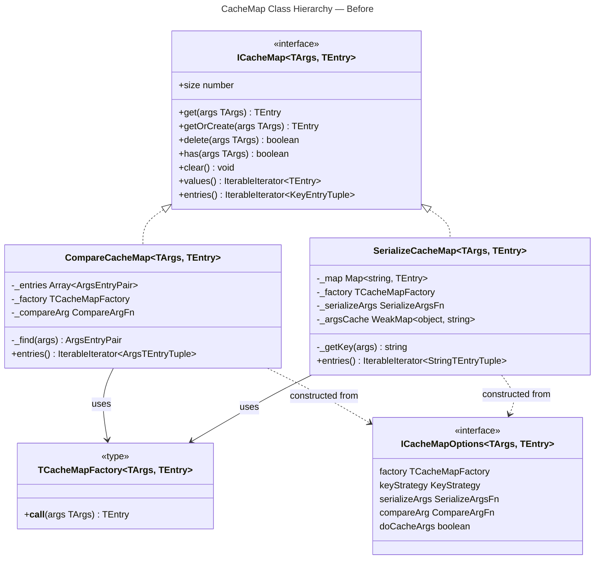
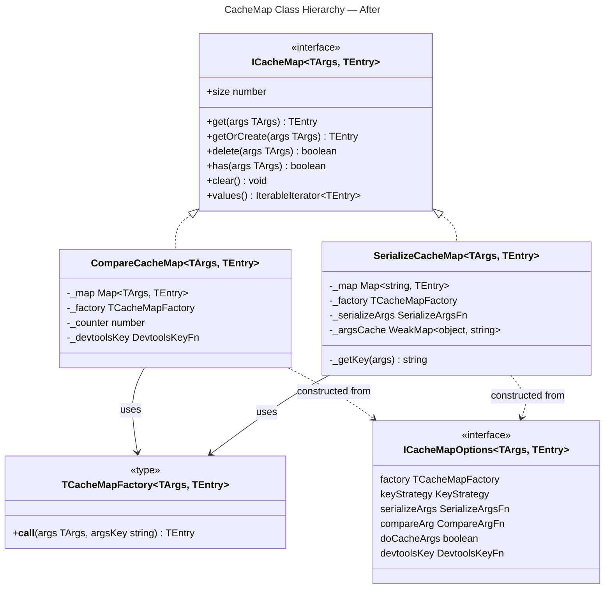
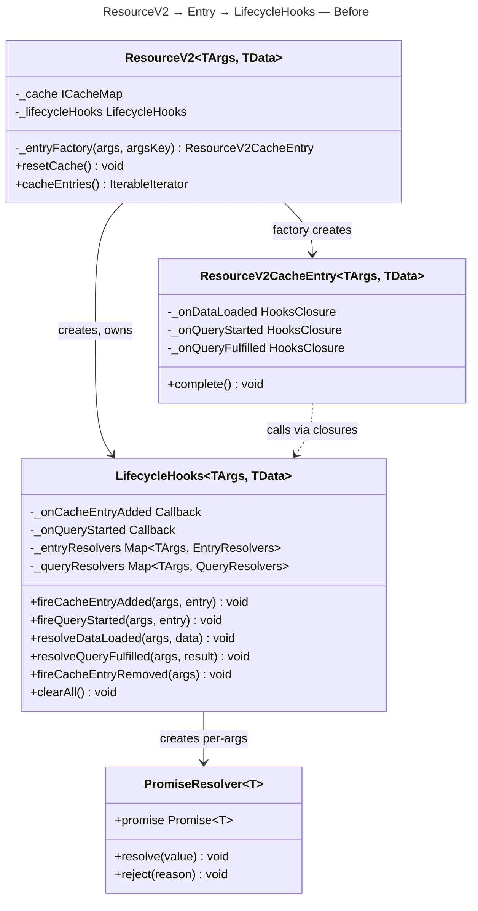
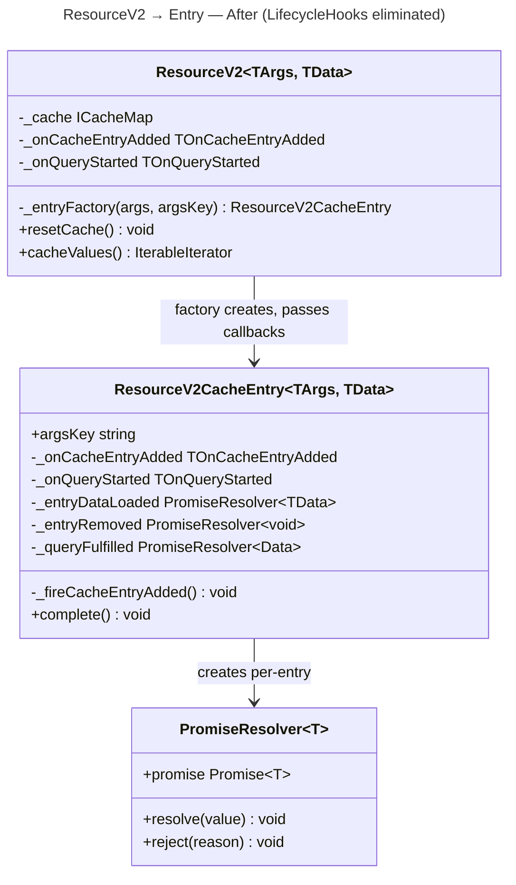
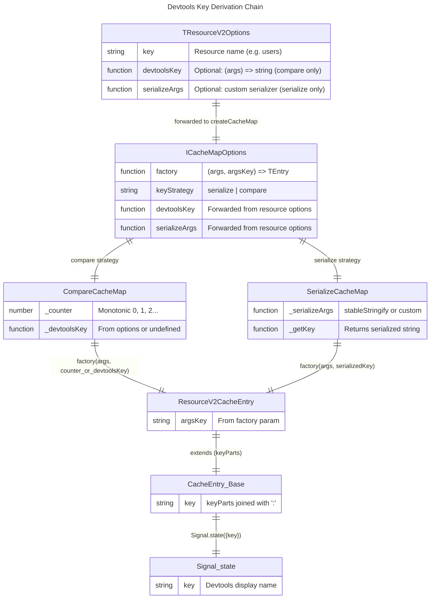

# Domain Model

## 1. Type Changes — CacheMap Family

### 1.1 ICacheMap Interface (Updated)

`entries()` is removed. Three consumers exist: `Snapshot.getSnapshot()` uses `[key, entry]` (key needed only for serialize strategy) [ref: ../01-research/01-codebase-analysis.md#Area A], `createApi` stale check ignores key entirely (`for (const [, entry] of resource.cacheEntries())`) [ref: createApi.ts:112], and `ResourceV2.resetCache()` already uses `values()` [ref: ResourceV2.ts:108]. User feedback confirms removal [ref: ../01-research/05-open-questions.md#Q9].

Snapshot migrates to `values()` + `entry.argsKey` (new field on `ResourceV2CacheEntry`). `createApi` migrates to `values()`.

```typescript
/** CacheMap instance — generic storage container, keyed by args */
export interface ICacheMap<TArgs, TEntry> {
    get(args: TArgs): TEntry | undefined;
    getOrCreate(args: TArgs): TEntry;
    delete(args: TArgs): boolean;
    has(args: TArgs): boolean;
    clear(): void;
    readonly size: number;
    values(): IterableIterator<TEntry>;
    // entries() — REMOVED
}
```

**Diff from current** (`cache.types.ts:27-37`):
- Removed: `entries(): IterableIterator<[string | TArgs, TEntry]>`

### 1.2 TCacheMapFactory (Updated Signature)

The factory receives `argsKey` from the CacheMap, eliminating the need for the `ResourceV2` factory closure to call `serializeFn(args)` [ref: ../01-research/03-problem-analysis-devtools.md#Problem #3, Problem #4].

```typescript
/** Factory function used by CacheMap to create new entries */
export type TCacheMapFactory<TArgs, TEntry> = (args: TArgs, argsKey: string) => TEntry;
```

**Diff from current** (`cache.types.ts:40`):
- Was: `(args: TArgs) => TEntry`
- Now: `(args: TArgs, argsKey: string) => TEntry`

### 1.3 ICacheMapOptions (Updated)

```typescript
/** Configuration for CacheMap creation */
export interface ICacheMapOptions<TArgs, TEntry> {
    factory: TCacheMapFactory<TArgs, TEntry>;       // signature changed
    keyStrategy: "serialize" | "compare";
    serializeArgs?: (args: TArgs) => string;         // serialize strategy only
    compareArg?: (a: TArgs, b: TArgs) => boolean;    // kept for type compat, ignored by CompareCacheMap
    doCacheArgs?: boolean;                           // serialize strategy only (unchanged)
    devtoolsKey?: (args: TArgs) => string;           // NEW — compare strategy only
}
```

**Diff from current** (`cache.types.ts:42-49`):
- Added: `devtoolsKey?: (args: TArgs) => string`
- `factory` field type changes from `(args) => TEntry` to `(args, argsKey) => TEntry` (via `TCacheMapFactory`)

### 1.4 CompareCacheMap Class (Redesigned)

Internal data structure changes from `Array<{args, entry}>` to `Map<TArgs, TEntry>`. `compareArg` is no longer read — lookup uses `Map.get(args)` with reference identity (`===`) [ref: ../01-research/05-open-questions.md#Q1]. Devtools key uses monotonic counter or user-provided `devtoolsKey` function [ref: ../01-research/05-open-questions.md#Q3].

```typescript
export class CompareCacheMap<TArgs, TEntry> implements ICacheMap<TArgs, TEntry> {
    private _map = new Map<TArgs, TEntry>();
    private _factory: TCacheMapFactory<TArgs, TEntry>;
    private _counter = 0;
    private _devtoolsKey: ((args: TArgs) => string) | undefined;

    constructor(options: ICacheMapOptions<TArgs, TEntry>) {
        this._factory = options.factory;
        this._devtoolsKey = options.devtoolsKey;
    }

    get(args: TArgs): TEntry | undefined {
        return this._map.get(args);
    }

    getOrCreate(args: TArgs): TEntry {
        let entry = this._map.get(args);
        if (entry) return entry;

        const argsKey = this._devtoolsKey
            ? this._devtoolsKey(args)
            : String(this._counter++);

        entry = this._factory(args, argsKey);
        this._map.set(args, entry);
        return entry;
    }

    delete(args: TArgs): boolean {
        return this._map.delete(args);
    }

    has(args: TArgs): boolean {
        return this._map.has(args);
    }

    clear(): void {
        this._map.clear();
    }

    get size(): number {
        return this._map.size;
    }

    *values(): IterableIterator<TEntry> {
        yield* this._map.values();
    }

    // entries() — REMOVED from ICacheMap, not implemented
}
```

**Diff from current** (`CompareCacheMap.ts:8-64`):

| Member | Current | Proposed |
|--------|---------|----------|
| `_entries` | `Array<{args, entry}>` | **Removed** |
| `_map` | — | `Map<TArgs, TEntry>` (new) |
| `_compareArg` | `(a, b) => boolean` (default `shallowEqual`) | **Removed** |
| `_counter` | — | `number = 0` (new) |
| `_devtoolsKey` | — | `((args) => string) \| undefined` (new) |
| `_find(args)` | `Array.find(compareArg)` — O(n) | **Removed** |
| `get(args)` | `_find(args)?.entry` — O(n) | `_map.get(args)` — O(1) |
| `getOrCreate(args)` | `_find` + `factory(args)` + `push` | `_map.get` + `factory(args, argsKey)` + `_map.set` |
| `delete(args)` | `findIndex` + `splice` — O(n+n) | `_map.delete(args)` — O(1) |
| `entries()` | yields `[TArgs, TEntry]` | **Removed** |

### 1.5 SerializeCacheMap.getOrCreate (Updated)

The only change is passing the computed key to the factory as `argsKey`, eliminating the double serialization [ref: ../01-research/03-problem-analysis-devtools.md#Problem #4].

```typescript
getOrCreate(args: TArgs): TEntry {
    const key = this._getKey(args);
    let entry = this._map.get(key);
    if (!entry) {
        entry = this._factory(args, key);  // was: this._factory(args)
        this._map.set(key, entry);
    }
    return entry;
}
```

**Diff from current** (`SerializeCacheMap.ts:37-44`):
- Line 41: `this._factory(args)` → `this._factory(args, key)`

`entries()` method is also removed from `SerializeCacheMap` to match the updated `ICacheMap`. All other methods unchanged.

---

## 2. Type Changes — Resource Options

### 2.1 TResourceV2Options (Updated)

New optional `devtoolsKey` field. Applies only when `keyStrategy === "compare"` (i.e., when `compareArg` is provided). Ignored for serialize strategy [ref: ../01-research/05-open-questions.md#Q3].

```typescript
/** ResourceV2 creation options */
export type TResourceV2Options<TArgs, TData> = {
    key?: string;
    queryFn: TQueryFn<TArgs, TData>;
    cacheLifetime?: number | false;
    serializeArgs?: TSerializeArgsFn<TArgs>;
    compareArg?: TCompareArgsFn<TArgs>;
    onCacheEntryAdded?: TOnCacheEntryAdded<TArgs, TData>;
    onQueryStarted?: TOnQueryStarted<TArgs, TData>;
    maxSnapshotDataAge?: number;
    doCacheArgs?: boolean;
    devtools?: DevtoolsLike;
    devtoolsKey?: (args: TArgs) => string;  // NEW — compare strategy only, default monotonic counter
};
```

**Diff from current** (`resource.types.ts:20-32`):
- Added: `devtoolsKey?: (args: TArgs) => string`

### 2.2 IResourceV2CacheEntry (Updated)

New `argsKey` readonly field. Populated from the factory's `argsKey` parameter. Used by `Snapshot.getSnapshot()` to obtain the cache key for snapshot entries [ref: 01-architecture.md#4.1].

```typescript
/** Consumer-facing cache entry */
export interface IResourceV2CacheEntry<TArgs, TData> extends ICacheEntry<TMachineInstance<TArgs, TData>> {
    readonly machine$: ReadableSignalFnLike<TMachineInstance<TArgs, TData>>;
    readonly argsKey: string;  // NEW — devtools/snapshot key assigned by CacheMap
    peek(): TMachineInstance<TArgs, TData>;
    isMyArgs(args: TArgs): boolean;
    createPatch(patchFn: (draft: TData) => void): IPatchHandle | null;
    invalidate(): void;
    query(doForce?: boolean): Promise<TData>;
}
```

**Diff from current** (`resource.types.ts:61-73`):
- Added: `readonly argsKey: string`

---

## 3. Type Changes — LifecycleHooks

### 3.1 LifecycleHooks Class — Eliminated

The `LifecycleHooks` class (`core/LifecycleHooks.ts`, 113 lines) is deleted entirely. Its internal types (`EntryResolvers`, `QueryResolvers`) and all methods are absorbed by `ResourceV2CacheEntry` [ref: ../01-research/05-open-questions.md#Q4].

### 3.2 Lifecycle Type Definitions — Unchanged

`lifecycle.types.ts` remains unchanged. The callback signatures (`TOnCacheEntryAdded`, `TOnQueryStarted`) and tool interfaces (`ICacheEntryAddedTools`, `IQueryStartedTools`) are the same — they describe the user-facing API. What changes is who invokes them: the entry itself, not a shared class.

```typescript
// lifecycle.types.ts — NO CHANGES
export interface ICacheEntryAddedTools<TData> { ... }  // unchanged
export interface IQueryStartedTools<TArgs, TData> { ... }  // unchanged
export type TOnCacheEntryAdded<TArgs, TData> = ...  // unchanged
export type TOnQueryStarted<TArgs, TData> = ...  // unchanged
```

### 3.3 IResourceV2CacheEntryOptions (Updated)

The entry options gain lifecycle callbacks directly, replacing the intermediate closures that routed through the shared `LifecycleHooks` instance. The three indirect callbacks (`onDataLoaded`, `onQueryStarted`, `onQueryFulfilled`) are replaced by two direct callbacks (`onCacheEntryAdded`, `onQueryStarted`) that match the user-facing types.

```typescript
export interface IResourceV2CacheEntryOptions<TArgs, TData> {
    args: TArgs;
    queryFn: TQueryFn<TArgs, TData>;
    compareArgs: TCompareArgsFn<TArgs>;
    entryOptions?: ICacheEntryOptions<TMachineInstance<TArgs, TData>>;
    initialMachine?: TMachineInstance<TArgs, TData>;

    // REMOVED:
    // onDataLoaded?: (args: TArgs, data: TData) => void;
    // onQueryStarted?: (args: TArgs, entry: IResourceV2CacheEntry<TArgs, TData>) => void;
    // onQueryFulfilled?: (args: TArgs, result: { data: TData } | { error: unknown }) => void;

    // NEW — direct callback references from resource options:
    onCacheEntryAdded?: TOnCacheEntryAdded<TArgs, TData>;
    onQueryStarted?: TOnQueryStarted<TArgs, TData>;
}
```

**Diff from current** (`ResourceV2CacheEntry.ts:16-27`):
- Removed: `onDataLoaded`, `onQueryStarted` (old closure-style), `onQueryFulfilled`
- Added: `onCacheEntryAdded` (type `TOnCacheEntryAdded`), `onQueryStarted` (type `TOnQueryStarted` — same field name, different type)

---

## 4. Updated ResourceV2CacheEntry — Lifecycle Resolver State

### 4.1 New Internal Fields

`ResourceV2CacheEntry` gains resolver fields (previously in `LifecycleHooks._entryResolvers` and `_queryResolvers`):

```typescript
export class ResourceV2CacheEntry<TArgs, TData>
    extends CacheEntry<TMachineInstance<TArgs, TData>>
    implements IResourceV2CacheEntry<TArgs, TData>
{
    readonly machine$: ReadableSignalFnLike<TMachineInstance<TArgs, TData>>;
    readonly argsKey: string;  // NEW — from factory parameter

    private _args: TArgs;
    private _queryFn: TQueryFn<TArgs, TData>;
    private _compareArgs: TCompareArgsFn<TArgs>;
    private _abortController: AbortController | null = null;
    private _inflightPromise: Promise<TData> | null = null;
    private _patchState: TPatchState<TData> | null = null;

    // NEW — lifecycle resolver state (previously in LifecycleHooks)
    private _entryDataLoaded: PromiseResolver<TData> | null = null;
    private _entryRemoved: PromiseResolver<void> | null = null;
    private _queryFulfilled: PromiseResolver<{ data: TData }> | null = null;

    // NEW — direct callback references (previously indirection via LifecycleHooks)
    private _onCacheEntryAdded: TOnCacheEntryAdded<TArgs, TData> | undefined;
    private _onQueryStarted: TOnQueryStarted<TArgs, TData> | undefined;

    // REMOVED:
    // private _onDataLoaded
    // private _onQueryStarted (old closure type)
    // private _onQueryFulfilled

    constructor(options: IResourceV2CacheEntryOptions<TArgs, TData>) {
        super(options.initialMachine ?? new MachinePending<TArgs, TData>(options.args), options.entryOptions);
        this._args = options.args;
        this._queryFn = options.queryFn;
        this._compareArgs = options.compareArgs;
        this._onCacheEntryAdded = options.onCacheEntryAdded;
        this._onQueryStarted = options.onQueryStarted;
        this.machine$ = this.state$;
        this.argsKey = options.entryOptions?.keyParts?.[2] ?? "";  // argsKey is the 3rd keyPart

        // Fire onCacheEntryAdded if defined
        this._fireCacheEntryAdded();

        if (!options.initialMachine) {
            this._doFetch().catch(() => {});
        }
    }

    // ... existing methods unchanged: isMyArgs, createPatch, invalidate, query ...
}
```

### 4.2 argsKey Derivation

The `argsKey` is the third element of `keyParts` (index `[2]`), which is set by `ResourceV2._entryFactory`:

```typescript
// In ResourceV2._entryFactory:
entryOptions: {
    keyParts: this._key ? ["Resource/", `${this._key}/`, argsKey] : undefined,
    ...
}
```

When `this._key` is undefined (no resource key), `keyParts` is `undefined` and `argsKey` defaults to `""`. This is acceptable because Snapshot already throws for compare-strategy resources (where argsKey would be a counter) and for serialize-strategy resources without a key, snapshot is not used.

### 4.3 Lifecycle Methods on Entry

These methods replace the corresponding methods on the deleted `LifecycleHooks` class:

```typescript
/** Fire onCacheEntryAdded — called once in constructor */
private _fireCacheEntryAdded(): void {
    if (!this._onCacheEntryAdded) return;

    this._entryDataLoaded = new PromiseResolver<TData>();
    this._entryRemoved = new PromiseResolver<void>();

    const tools: ICacheEntryAddedTools<TData> = {
        $cacheDataLoaded: this._entryDataLoaded.promise,
        $cacheEntryRemoved: this._entryRemoved.promise,
    };

    try {
        this._onCacheEntryAdded(this._args, tools);
    } catch {
        // Callback errors are caught, not propagated (matches current LifecycleHooks behavior)
    }

    // Resolve immediately if entry starts with data (hydration via Snapshot)
    const machine = this.peek();
    if (machine.status === "success" && this._entryDataLoaded) {
        this._entryDataLoaded.resolve(machine.data);
        this._entryDataLoaded = null;
    }
}
```

### 4.4 Updated _doFetch — Lifecycle Integration

`_doFetch()` manages `_queryFulfilled` resolver directly instead of calling closures to a shared hooks instance:

```typescript
private _doFetch(): Promise<TData> {
    if (this._abortController) {
        this._abortController.abort();
    }
    this._inflightPromise?.catch(() => {});

    const controller = new AbortController();
    this._abortController = controller;

    // Lifecycle: reject leftover _queryFulfilled before creating new one
    if (this._queryFulfilled) {
        this._queryFulfilled.reject(new Error("Query superseded"));
        this._queryFulfilled = null;
    }

    // Lifecycle: fire onQueryStarted
    if (this._onQueryStarted) {
        this._queryFulfilled = new PromiseResolver<{ data: TData }>();

        const tools: IQueryStartedTools<TArgs, TData> = {
            $queryFulfilled: this._queryFulfilled.promise,
            getCacheEntry: () => this,
        };

        try {
            this._onQueryStarted(this._args, tools);
        } catch {
            // Callback errors caught
        }
    }

    // ... rest of _doFetch: queryFn call, success/error handling ...
    // On success: resolve _queryFulfilled, resolve _entryDataLoaded (first time)
    // On error: reject _queryFulfilled
}
```

**Key difference from current**: The current `_doFetch` calls `this._onQueryStarted?.(this._args, this)` which is a closure that calls `LifecycleHooks.fireQueryStarted(args, entry)`. The proposed version directly manages the `_queryFulfilled` resolver and invokes the user callback `this._onQueryStarted(this._args, tools)`.

### 4.5 Updated complete() — Lifecycle Cleanup

```typescript
override complete(): void {
    if (this._abortController) {
        this._abortController.abort();
        this._abortController = null;
    }
    this._inflightPromise = null;
    this._patchState = null;

    // Lifecycle cleanup — resolve/reject all pending resolvers
    if (this._entryDataLoaded) {
        this._entryDataLoaded.reject(new Error("Cache entry removed before data loaded"));
        this._entryDataLoaded = null;
    }
    if (this._entryRemoved) {
        this._entryRemoved.resolve();
        this._entryRemoved = null;
    }
    if (this._queryFulfilled) {
        this._queryFulfilled.reject(new Error("Cache entry removed"));
        this._queryFulfilled = null;
    }

    super.complete();
}
```

### 4.6 _doFetch Success Path — Resolver Settlement

Inside `_doFetch`'s `.then()` handler:

```typescript
// After set(MachineSuccess(...)):

// Resolve _entryDataLoaded on first success only
if (this._entryDataLoaded) {
    this._entryDataLoaded.resolve(data);
    this._entryDataLoaded = null;  // one-shot: subsequent successes don't re-resolve
}

// Resolve _queryFulfilled for this fetch
if (this._queryFulfilled) {
    this._queryFulfilled.resolve({ data });
    this._queryFulfilled = null;
}
```

### 4.7 _doFetch Error Path — Resolver Settlement

Inside `_doFetch`'s `.catch()` handler:

```typescript
// After set(MachineError/MachineSuccess with lastError):

// Reject _queryFulfilled for this fetch
if (this._queryFulfilled) {
    this._queryFulfilled.reject(error);
    this._queryFulfilled = null;
}

// Note: _entryDataLoaded is NOT rejected on query error —
// it stays pending because a subsequent retry may succeed.
// Only complete() rejects it (when the entry is being removed).
```

---

## 5. Updated ResourceV2 — Simplified Factory

### 5.1 Constructor Changes

```typescript
constructor(options: TResourceV2Options<TArgs, TData>) {
    this._queryFn = options.queryFn;
    this._compareArgsFn = options.compareArg ?? (shallowEqual as TCompareArgsFn<TArgs>);
    this._cacheLifetime = options.cacheLifetime ?? 60_000;
    this._key = options.key;

    // REMOVED: this._lifecycleHooks = new LifecycleHooks<TArgs, TData>(...)
    // NEW: store callbacks directly
    this._onCacheEntryAdded = options.onCacheEntryAdded;
    this._onQueryStarted = options.onQueryStarted;

    const keyStrategy = options.compareArg ? ("compare" as const) : ("serialize" as const);

    // serializeFn no longer needed for factory closure — only for SerializeCacheMap
    this._cache = createCacheMap<TArgs, ResourceV2CacheEntry<TArgs, TData>>({
        keyStrategy,
        factory: (args, argsKey) => this._entryFactory(args, argsKey),  // passthrough
        serializeArgs: options.serializeArgs ?? stableStringify,
        compareArg: options.compareArg,
        doCacheArgs: options.doCacheArgs,
        devtoolsKey: options.devtoolsKey,  // NEW — forwarded to CompareCacheMap
    });
}
```

**Diff from current** (`ResourceV2.ts:40-56`):
- Removed: `this._lifecycleHooks = new LifecycleHooks<TArgs, TData>(...)`
- Removed: `const serializeFn = options.serializeArgs ?? stableStringify` (for factory closure usage)
- Changed: factory from `(args) => this._entryFactory(args, serializeFn(args))` to `(args, argsKey) => this._entryFactory(args, argsKey)`
- Added: `this._onCacheEntryAdded`, `this._onQueryStarted` fields
- Added: `devtoolsKey: options.devtoolsKey` in `createCacheMap` options

### 5.2 _entryFactory Changes

```typescript
private _entryFactory(args: TArgs, argsKey: string): ResourceV2CacheEntry<TArgs, TData> {
    const initialMachine = this._pendingInitialMachine;
    this._pendingInitialMachine = undefined;

    const entry = new ResourceV2CacheEntry<TArgs, TData>({
        args,
        queryFn: this._queryFn,
        compareArgs: this._compareArgsFn,
        entryOptions: {
            keyParts: this._key ? ["Resource/", `${this._key}/`, argsKey] : undefined,
            cacheLifetime: this._cacheLifetime,
        },
        // NEW — direct callback references (entry invokes hooks itself)
        onCacheEntryAdded: this._onCacheEntryAdded,
        onQueryStarted: this._onQueryStarted,
        initialMachine,
    });

    // Subscribe to onClean$ for cache removal
    entry.onClean$.subscribe(() => {
        this._cache.delete(args);
        // REMOVED: this._lifecycleHooks.fireCacheEntryRemoved(args)
        // Entry's complete() already settled _entryRemoved resolver
    });

    // REMOVED: this._lifecycleHooks.fireCacheEntryAdded(args, entry)
    // Entry's constructor already invoked onCacheEntryAdded

    if (this.status$.peek() === "idle") {
        this.status$.set("ready");
    }
    this._lastEntry$.set(entry);

    return entry;
}
```

**Diff from current** (`ResourceV2.ts:147-175`):
- Removed: `onDataLoaded`, `onQueryStarted` (closure), `onQueryFulfilled` closure options
- Added: `onCacheEntryAdded`, `onQueryStarted` direct references
- Removed: `this._lifecycleHooks.fireCacheEntryAdded(args, entry)` (entry self-fires)
- Removed: `this._lifecycleHooks.fireCacheEntryRemoved(args)` from `onClean$` subscription (entry's `complete()` resolves `_entryRemoved`)

### 5.3 resetCache Changes

```typescript
resetCache(): void {
    Batcher.run(() => {
        const entries = [...this._cache.values()];
        this._cache.clear();
        for (const entry of entries) {
            entry.complete();  // each entry settles its own lifecycle resolvers
        }
        // REMOVED: this._lifecycleHooks.clearAll()
        this._lastEntry$.set(null);
        this.status$.set("idle");
    });
}
```

### 5.4 cacheEntries → cacheValues Migration

```typescript
// REMOVED:
// cacheEntries(): IterableIterator<[string | TArgs, ResourceV2CacheEntry<TArgs, TData>]>

// Consumers use this._cache.values() or a new public method:
cacheValues(): IterableIterator<ResourceV2CacheEntry<TArgs, TData>> {
    return this._cache.values();
}
```

---

## 6. Snapshot Consumer Migration

### 6.1 getSnapshot — Before and After

**Current** (`Snapshot.ts:22-35`):
```typescript
for (const [key, entry] of resource.cacheEntries()) {
    if (typeof key !== "string") {
        throw new Error(`...compare strategy...`);
    }
    const machine = entry.peek();
    if (machine.status === "success") {
        entries[key] = { ... };
    }
}
```

**Proposed**:
```typescript
for (const entry of resource.cacheValues()) {
    if (!entry.argsKey) {
        throw new Error(`...compare strategy...`);
    }
    const machine = entry.peek();
    if (machine.status === "success") {
        entries[entry.argsKey] = { ... };
    }
}
```

The `argsKey` for serialize strategy is the serialized string (e.g., `'{"id":1}'`). For compare strategy, it's the counter string (e.g., `"0"`). The Snapshot's compare-strategy guard can check `entry.argsKey` is a meaningful serialized key (or throw if compare strategy).

> **Note**: The existing Snapshot behavior already throws for compare strategy. This behavior is preserved — compare-strategy resources produce counter-based `argsKey` values (e.g., `"0"`) which are not useful as snapshot keys. The Snapshot guard needs to distinguish strategies; currently it checks `typeof key !== "string"` (which catches TArgs objects but not string counters). A refined guard may be needed during implementation.

### 6.2 createApi — Before and After

**Current** (`createApi.ts:112`):
```typescript
for (const [, entry] of resource.cacheEntries()) {
```

**Proposed**:
```typescript
for (const entry of resource.cacheValues()) {
```

Ignores key — direct migration.

---

## 7. Class Diagrams

### 7.1 CacheMap Family — Before



### 7.2 CacheMap Family — After



**Key visual differences**:
- `entries()` removed from `ICacheMap`
- `TCacheMapFactory` signature gains `argsKey: string`
- `CompareCacheMap`: `_entries Array`, `_compareArg`, `_find` → `_map Map`, `_counter`, `_devtoolsKey`
- `ICacheMapOptions`: gains `devtoolsKey`

### 7.3 ResourceV2 → CacheEntry → LifecycleHooks — Before



### 7.4 ResourceV2 → CacheEntry → LifecycleHooks — After



**Key visual differences**:
- `LifecycleHooks` class removed entirely
- `ResourceV2`: no `_lifecycleHooks` field; stores callbacks directly; `cacheEntries()` → `cacheValues()`
- `ResourceV2CacheEntry`: gains `argsKey`, `_entryDataLoaded`, `_entryRemoved`, `_queryFulfilled`, `_onCacheEntryAdded`, `_onQueryStarted`, `_fireCacheEntryAdded()`; loses closure-style `_onDataLoaded`, `_onQueryStarted`, `_onQueryFulfilled`
- `PromiseResolver` owned by entry (per-entry), not by a shared Map (per-args)

---

## 8. Devtools Key Derivation Chain — Entity Relationship



**Derivation paths**:
- **Serialize**: `options.serializeArgs` → `ICacheMapOptions.serializeArgs` → `SerializeCacheMap._getKey(args)` → `factory(args, key)` → `ResourceV2CacheEntry.argsKey` → `CacheEntry.keyParts[2]` → `Signal.state({key: "Resource/:users/:{"id":1}"})`
- **Compare (default)**: `CompareCacheMap._counter++` → `String(counter)` → `factory(args, "0")` → `ResourceV2CacheEntry.argsKey` → `CacheEntry.keyParts[2]` → `Signal.state({key: "Resource/:users/:0"})`
- **Compare (custom)**: `options.devtoolsKey` → `ICacheMapOptions.devtoolsKey` → `CompareCacheMap._devtoolsKey(args)` → `factory(args, customKey)` → same chain

---

## 9. Invariants and Business Rules

### 9.1 CacheMap Invariants

| Invariant | Scope | Description |
|-----------|-------|-------------|
| **INV-CM1** | `CompareCacheMap` | `_counter` is monotonically increasing: never decremented, never reused. `delete()` does not reclaim counter values. |
| **INV-CM2** | `CompareCacheMap` | `_map.get(args)` uses `===` reference identity. Two structurally-equal but referentially-distinct args produce separate entries. |
| **INV-CM3** | `SerializeCacheMap` | `_getKey(args)` is called exactly once per `getOrCreate` invocation (no second call in factory). |
| **INV-CM4** | Both | `getOrCreate(args)` calls factory at most once per unique cache key (reference for compare, string for serialize). |
| **INV-CM5** | Both | `values()` iterates all live entries. `size` equals the number of entries. |

### 9.2 LifecycleHooks Invariants (Per-Entry)

| Invariant | Description |
|-----------|-------------|
| **INV-LH1** | `_entryDataLoaded` is created at most once (in constructor), resolved at most once (on first `MachineSuccess`), and rejected on `complete()` if unresolved. |
| **INV-LH2** | `_entryRemoved` is created at most once (in constructor) and resolved exactly once (in `complete()`). |
| **INV-LH3** | `_queryFulfilled` is created per `_doFetch` call (when `onQueryStarted` is defined). Before creating a new one, the previous is rejected. |
| **INV-LH4** | On `complete()`, all pending resolvers are settled: `_entryDataLoaded` rejected, `_entryRemoved` resolved, `_queryFulfilled` rejected. No promise leaks. |
| **INV-LH5** | `_entryDataLoaded.resolve()` is called only once (set to `null` after resolve). Subsequent data loads on refetch do not re-resolve. |

### 9.3 Factory Signature Contract

| Rule | Description |
|------|-------------|
| **INV-F1** | `TCacheMapFactory` receives `argsKey` that is unique within the CacheMap instance at creation time. |
| **INV-F2** | For serialize strategy: `argsKey === _getKey(args)` (the serialized string). |
| **INV-F3** | For compare strategy (default): `argsKey === String(counter)` where counter is the current monotonic counter value before increment. |
| **INV-F4** | For compare strategy (custom): `argsKey === devtoolsKey(args)`. Uniqueness is the user's responsibility. |

---

## 10. Summary of All Type Changes

| File | Symbol | Change Type | Description |
|------|--------|-------------|-------------|
| `cache.types.ts` | `ICacheMap.entries()` | Removed | No longer part of the interface |
| `cache.types.ts` | `TCacheMapFactory` | Signature change | `(args) => TEntry` → `(args, argsKey) => TEntry` |
| `cache.types.ts` | `ICacheMapOptions.devtoolsKey` | Added | `(args: TArgs) => string` — compare strategy devtools key |
| `resource.types.ts` | `TResourceV2Options.devtoolsKey` | Added | `(args: TArgs) => string` — compare strategy devtools key |
| `resource.types.ts` | `IResourceV2CacheEntry.argsKey` | Added | `readonly argsKey: string` |
| `ResourceV2CacheEntry.ts` | `IResourceV2CacheEntryOptions` | Changed | Removed `onDataLoaded`/`onQueryStarted`(closure)/`onQueryFulfilled`; added `onCacheEntryAdded`/`onQueryStarted`(typed) |
| `ResourceV2CacheEntry.ts` | Class fields | Added | `argsKey`, `_entryDataLoaded`, `_entryRemoved`, `_queryFulfilled`, `_onCacheEntryAdded` |
| `ResourceV2CacheEntry.ts` | Class fields | Removed | `_onDataLoaded`, `_onQueryStarted`(old), `_onQueryFulfilled` |
| `ResourceV2.ts` | `_lifecycleHooks` | Removed | No longer a class field |
| `ResourceV2.ts` | `_onCacheEntryAdded`, `_onQueryStarted` | Added | Direct callback storage |
| `ResourceV2.ts` | `cacheEntries()` | Removed | Replaced by `cacheValues()` |
| `ResourceV2.ts` | Factory closure | Changed | `(args) => _entryFactory(args, serializeFn(args))` → `(args, argsKey) => _entryFactory(args, argsKey)` |
| `CompareCacheMap.ts` | Class internals | Rewritten | Array → Map, compareArg removed, counter + devtoolsKey added |
| `SerializeCacheMap.ts` | `getOrCreate` | Changed | `_factory(args)` → `_factory(args, key)` |
| `SerializeCacheMap.ts` | `entries()` | Removed | Matches ICacheMap change |
| `CompareCacheMap.ts` | `entries()` | Removed | Matches ICacheMap change |
| `LifecycleHooks.ts` | Entire file | Deleted | Functionality absorbed by ResourceV2CacheEntry |
| `Snapshot.ts` | `getSnapshot` | Changed | `resource.cacheEntries()` → `resource.cacheValues()` + `entry.argsKey` |
| `createApi.ts` | Stale check | Changed | `resource.cacheEntries()` → `resource.cacheValues()` |
