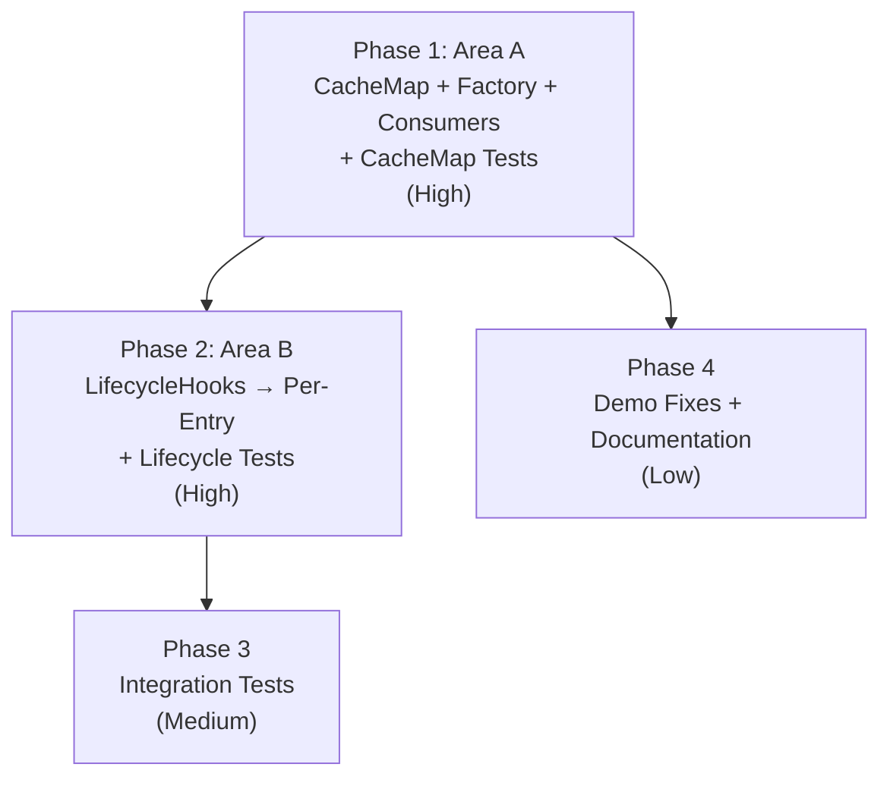

## Overview

Four-phase implementation plan decomposing the approved three-area design (Area A: CacheMap + Factory + Devtools Keys, Area B: LifecycleHooks → per-entry, Area C: Demo fixes) into dependency-ordered implementation steps with concrete file paths and verification criteria. Phases 1 and 2 form a strict sequential chain modifying shared files (`ResourceV2.ts`, `ResourceV2CacheEntry.ts`); Phase 3 depends on both; Phase 4 is independent and parallelizable.

## Phase Map

## Phase Summary

| Phase | Name | Type | Dependencies | Complexity | Files Changed |
|-------|------|------|--------------|------------|---------------|
| 1 | Area A: CacheMap + Factory + Consumer Migration + CacheMap Tests | Sequential | None | High | 10 modify |
| 2 | Area B: LifecycleHooks → Per-Entry + Lifecycle Tests | Sequential | Phase 1 | High | 5 modify, 2 delete, 1 modify (core/index.ts) |
| 3 | Integration Tests | Sequential | Phase 1, Phase 2 | Medium | 1 create or modify |
| 4 | Demo Fixes + Documentation | Parallel with P2, P3 | Phase 1 | Low | 5 modify (demos), 2 modify (docs) |

## Execution Rules

- Phases 1 → 2 → 3 form a strict sequential chain. Each requires verification before proceeding.
- Phase 4 has no code dependencies on Phase 2 or 3 and may execute in parallel with either.
- Every phase must leave the project in a compilable state (`npm run ts-check` passes).
- Phase 1 is the largest phase — all `entries()` removal, `TCacheMapFactory` signature change, and consumer migration must be atomic to maintain compilation.
- Phase 2 modifies files already changed in Phase 1 (`ResourceV2.ts`, `ResourceV2CacheEntry.ts`) — must apply after Phase 1 is verified.
- Phase 3 integration tests exercise cross-component flows from both Phase 1 and Phase 2.
- Phase 4 demo changes are UI text only (no core import changes); docs describe the new `devtoolsKey` API from Phase 1.

## Next Steps

Proceeds to implementation after human review.

## Quality Review

### Checklist
| # | Criterion | Status | Notes |
|---|-----------|--------|-------|
| 1 | Every design component mapped to task(s) | PASS | All 03-model.md sections (§1.1–§5.5) and all ADRs (ADR-1–ADR-7) are traced to specific plan tasks. ICacheMap entries() removal → T1.1; CompareCacheMap redesign → T1.3; Factory signature → T1.1/T1.3/T1.4/T1.5; LifecycleHooks elimination → T2.1–T2.3; Demo fixes → T4.1–T4.5. |
| 2 | File paths concrete and verified | PASS | All 22 file paths verified against repository via file_search. Source files (10), test files (5), demo files (5), docs (2) all exist. One new file (`cachemap-lifecycle-integration.test.ts`) targets existing `__tests__/integration/` directory. |
| 3 | Phase dependencies correct | PASS | P1→P2→P3 strict chain; P4 depends only on P1. No circular deps. P2 correctly requires P1 (both modify `ResourceV2.ts`, `ResourceV2CacheEntry.ts`). P4 parallelizable with P2/P3 — demo/docs have no code dependency on lifecycle or integration test changes. Mermaid graph matches. |
| 4 | Verification criteria per phase | PASS | All 4 phases have explicit verification checklists. P1/P2/P3 include `npm run ts-check`. P4 uses `npm run build` for demos (appropriate since P4 modifies no `src/` files). Minor: P4 could list `npm run ts-check` for completeness — see Issues #4. |
| 5 | Each phase leaves project compilable | PASS | P1 bundles all `entries()` removal + factory signature + consumer migration atomically. P2 bundles LifecycleHooks deletion + export removal + entry refactor. P3/P4 don't modify production code imports. No phase creates a half-state where compilation would fail. |
| 6 | No vague tasks — exact files and changes | PASS | 23 of 24 tasks specify exact files and concrete changes. Task 1.7 (Snapshot guard) defers the specific guard mechanism to implementation — the design (R6, 03-model.md §6.1) acknowledges this as an implementation-time decision with multiple valid approaches. See Issues #3. |
| 7 | Design traceability (`[ref: ...]`) on all tasks | PASS | 22 of 24 tasks have explicit `[ref: ...]` tags citing design documents. Tasks 2.4 (remove export line) and 2.7 (update ResourceV2 tests) lack explicit refs but are trivial consequences of Tasks 2.3 and 2.1 respectively. See Issues #2. |
| 8 | Parallel/sequential correctly marked | PASS | README states P1→P2→P3 sequential chain, P4 parallel with P2/P3. Each phase file states execution mode (Sequential/Parallel). Mermaid graph edges match declared dependencies. Within phases, tasks are implicitly ordered. |
| 9 | Complexity estimates present (L/M/H) | FAIL | Phase-level complexity present in summary table (High/High/Medium/Low). Per-task complexity estimates are NOT present — individual tasks lack L/M/H labels. See Issues #1. |
| 10 | Documentation tasks proportional to existing docs/demos | PASS | Existing `docs/query-v2/`: 4 files (~350 lines). Plan adds: 1 table row + 2–3 sentences in README.md, 1 row + 1 paragraph in devtools.md, 1 clarification for `doCacheArgs`. Demo changes: 5 files, text/styling only. Matches 07-docs.md spec. Proportional to one new public option + one clarification. |
| 11 | Mermaid dependency graph present | PASS | Present in README.md under "Phase Map". Shows P1→P2→P3 chain and P1→P4 edge. Includes phase names, area labels, and complexity annotations. |
| 12 | Phase summary table complete | PASS | Table has all required columns: Phase, Name, Type, Dependencies, Complexity, Files Changed. All 4 phases listed with concrete data. |

### Documentation Proportionality
Existing `docs/query-v2/` contains 4 files (README.md, devtools.md, optimistic-updates.md, ssr.md, ~350 lines total). `apps/demos/src/examples/query-v2/` contains 8 demo files.

Plan adds: 1 parameter table row + 2–3 sentences for `devtoolsKey` in README.md; 1 row + 1 short paragraph in devtools.md; 1 `doCacheArgs` clarification sentence. Demo changes affect 5 of 8 files with text/label corrections only (no new files, no structural changes). This is proportional to the scope — significant internal restructuring but only one new public option (`devtoolsKey`). Neither over-specified nor under-specified.

### Issues Found

1. **Per-task complexity estimates missing**
   - What's wrong: Individual tasks within each phase lack L/M/H complexity labels. Only phase-level estimates exist in the summary table.
   - Where: All 4 phase files (`01-cachemap-factory-consumers.md` Tasks 1.1–1.10, `02-lifecycle-hooks-elimination.md` Tasks 2.1–2.7, `03-integration-tests.md` Task 3.1, `04-demos-documentation.md` Tasks 4.1–4.7)
   - Expected: Each task header or description should include a complexity estimate (e.g., "**Complexity**: Medium")
   - Severity: Medium

2. **Tasks 2.4 and 2.7 lack explicit `[ref: ...]` design traceability**
   - What's wrong: Task 2.4 (remove LifecycleHooks export from core/index.ts) and Task 2.7 (update ResourceV2 tests for lifecycle changes) do not have `[ref: ...]` tags pointing to design documents.
   - Where: `02-lifecycle-hooks-elimination.md`, Tasks 2.4 and 2.7
   - Expected: Task 2.4 should reference `[ref: ../02-design/03-model.md §3.1; ADR-5]`. Task 2.7 should reference `[ref: ../02-design/06-testcases.md; ADR-5]`.
   - Severity: Low

3. **Task 1.7 Snapshot guard mechanism underspecified**
   - What's wrong: The plan defers the specific compare-strategy guard replacement to implementation discretion ("The implementation phase should choose the simplest mechanism"). While the design acknowledges this (R6, 03-model.md §6.1 Note), the plan task should specify the chosen approach or constrain acceptable options.
   - Where: `01-cachemap-factory-consumers.md`, Task 1.7 Details section
   - Expected: Specify the guard mechanism (e.g., "check resource keyStrategy accessor" or "remove guard — SSR is documented as serialize-only") with a concrete code change description.
   - Severity: Medium

4. **Phase 4 verification checklist omits `npm run ts-check`**
   - What's wrong: Phase 4's verification checklist includes `npm run build` for demos but does not list `npm run ts-check` for the main project, even though the execution rules state every phase must pass `npm run ts-check`.
   - Where: `04-demos-documentation.md`, Verification section
   - Expected: Add `- [ ] npm run ts-check passes` to Phase 4 verification for consistency with execution rules, even though Phase 4 modifies no `src/` files.
   - Severity: Low
